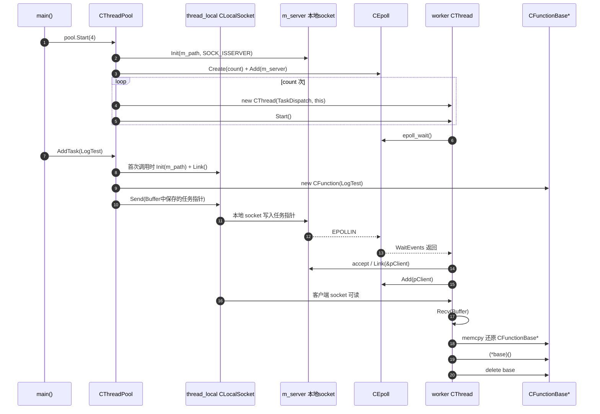
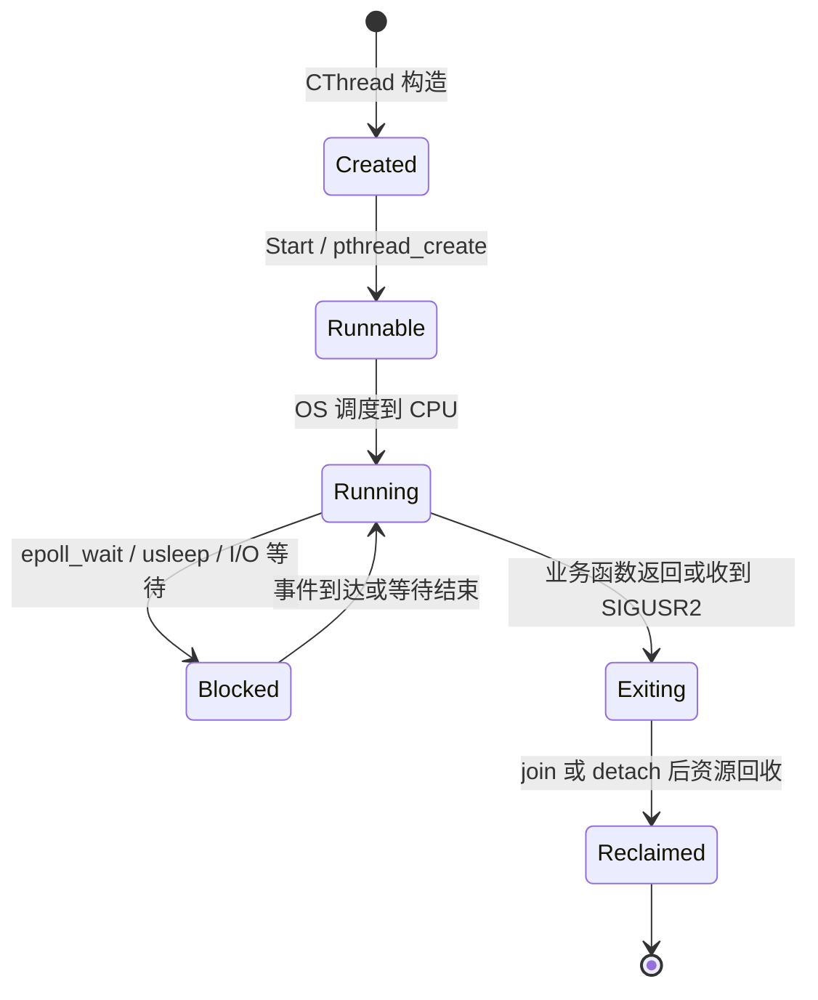

# 易播服务器线程体系详解

> [!abstract]
> 这一阶段的线程体系不是传统的“任务队列 + 互斥锁 + 条件变量”模型，而是一个更有教学辨识度的模型：任务先被封装成 `CFunctionBase*`，再通过 Unix 本地 socket 发给线程池内部的监听端，worker 线程统一阻塞在 `epoll_wait()` 上，收到 socket 可读事件后取出任务指针、执行、释放。

## 1. 总体架构

![[4_1_1_1.svg|1084]]

从架构师视角看，这套线程设计分为三条主线：

1. **任务抽象线**：`CFunctionBase / CFunction` 把任意可调用对象统一包装成 `operator()()`。
2. **线程执行线**：`CThread` 把 `pthread_create()`、线程入口、暂停、停止封装成对象。
3. **任务投递线**：`CThreadPool` 不维护显式队列，而是用 `CLocalSocket + CEpoll` 做任务通道和唤醒机制。

## 2. 关键节点图：进程关系与测试链路

![[4_1_1_2.svg|900]]

这张图是这一阶段非常关键的“定位图”。它不是线程池内部细节图，而是把当前 demo 的几个测试节点放到同一张图里：主进程如何组织调用，日志服务器如何被验证，客户端处理如何通过文件描述符传递被验证，以及后续网络调用和数据库节点应该放在什么位置。

按代码执行顺序看：

1. `main()` 是主进程入口，负责创建日志子进程、客户端子进程，并触发日志、线程、线程池测试。
2. `CreateLogServer` 对应图中的“日志服务器”，它内部启动 `CLoggerServer`，再由 `CLoggerServer` 持有一个后台 `CThread` 等待日志 socket 事件。
3. `CreateClientServer` 对应图中的“客户端处理”，当前测试里它通过 `proc->RecvFD(fd)` 接收主进程传过来的测试文件描述符。
4. “测试文件描述符传递”对应 `procclients.SendFD(fd)` 这条测试链路，用来验证父子进程间 fd 传递是否跑通。
5. “网络服务”和“数据库”在当前代码里还不是完整业务实现，更像架构预留位置：后续网络服务接入真实客户端请求，客户端处理再调用数据库完成业务。

这张图要和前面的总架构图区分开：

| 图 | 解决的问题 | 阅读重点 |
|---|---|---|
| `4_1_1_1.svg` | 线程体系由哪些模块组成 | `CFunction`、`CThread`、`CThreadPool`、`CLocalSocket`、`CEpoll` 的分层 |
| `4_1_1_2.svg` | 当前 demo 的关键测试节点在哪里 | 主进程、日志服务器、客户端处理、fd 传递、后续业务节点的关系 |

也就是说，第一张图回答“线程池怎么设计”，第二张图回答“这个阶段到底在测什么”。如果只看线程池代码，很容易误以为所有内容都已经是完整业务服务器；但从关键节点图看得更清楚：当前阶段主要是在验证基础设施，包括进程创建、日志线程、文件描述符传递、本地 socket、线程池任务投递。

## 3. 学习路线图：基础知识、八股、项目落地

这篇笔记不是孤立讲 `CThreadPool`，而是把 Linux 后端里最常见的几层知识合在一起看：

| 层次     | 基础知识                                        | 八股考点                         | 易播项目落地                                                             |
| ------ | ------------------------------------------- | ---------------------------- | ------------------------------------------------------------------ |
| 进程模型   | [[11.1 进程简介]]、[[11.2 进程间通信IPC]]             | 进程和线程区别、地址空间、IPC 为什么存在       | `CProcess` 创建日志进程和客户端进程，进程间不能直接共享普通指针                              |
| 线程模型   | [[12.1 线程简介]]、[[12.2 线程的创建与运行]]             | `pthread_create`、线程入口、线程共享资源 | `CThread::Start()` 把任意业务函数跑到新线程里                                   |
| 线程生命周期 | [[12.5 线程销毁]]                               | `join`、`detach`、自然退出、强制退出    | `CThread::Stop()` 试图 `pthread_timedjoin_np`，超时后 `detach + SIGUSR2` |
| 线程同步   | [[12.3 互斥量]]、[[12.7 条件变量与线程池]]              | 竞态、临界区、条件变量、生产者消费者           | 本项目没有传统任务队列，而是用 socket 可读事件唤醒 worker                               |
| 并发服务器  | [[11.8 基于多任务的多进程并发服务器]]、[[12.6 多线程并发服务器案例]] | 多进程、多线程、I/O 多路复用、线程池取舍       | 易播把进程隔离、日志线程、线程池任务分发混合在一个教学项目里                                     |

一个比较好的阅读方式是：

```text
先理解进程和线程的边界
  -> 再理解 pthread 的创建、退出、回收
  -> 再理解传统线程池为什么需要队列和条件变量
  -> 最后看易播为什么可以用本地 socket + epoll 代替条件变量唤醒
```

也就是说，易播这里不是为了证明“线程池必须这样写”，而是为了把前面学过的 `pthread`、本地 socket、`epoll`、任务封装串成一个能跑起来的服务端结构。

## 4. 进程 vs 线程：为什么这里必须理解地址空间

`[[11.1 进程简介]]` 里最重要的一句话是：**进程是资源分配的基本单位**。每个进程有自己的虚拟地址空间、文件描述符表、堆、全局变量等资源边界。`[[12.1 线程简介]]` 里最重要的一句话是：**线程是操作系统调度的最小单位**。同一个进程内的多个线程共享进程的地址空间和文件描述符，但每个线程有自己的栈、寄存器和执行流。

这两个概念直接决定了易播线程池的一个关键实现是否成立：

```cpp
CFunctionBase* base = new CFunction< _FUNCTION_, _ARGS_...>(func, args...);
Buffer data(sizeof(base));
memcpy(data, &base, sizeof(base));
ret = client.Send(data);
```

这里通过 socket 发送的是 `base` 指针的二进制值。这个做法看起来很危险，但在当前线程池设计中它能工作，原因是：

- `AddTask()` 的调用者和 `TaskDispatch()` 的 worker 线程属于同一个进程。
- 同一进程内的线程共享堆空间。
- `new CFunction(...)` 得到的堆对象地址，对同进程内所有线程都有意义。
- 本地 socket 在这里不是跨进程序列化通道，而是一个同进程内的任务通知和数据搬运通道。

如果把这段逻辑改成跨进程通信，立刻就会失效。因为父进程里的地址 `0x12345678`，在子进程里不一定映射同一个对象；即使地址值相同，也不是同一块堆内存。跨进程要传任务，必须传可序列化数据，或者使用共享内存并设计同步机制，不能直接传普通 C++ 对象指针。

> [!important]
> 这就是项目代码和八股知识的连接点：面试里问“进程和线程的区别”不是背概念而已。这个区别会直接决定 `CFunctionBase*` 能不能这样传、socket 在这里到底是 IPC 还是线程内任务通道。

## 5. pthread 八股与 CThread 对应表

`CThread` 基本就是一份 pthread 八股题的项目化答案：

| pthread 八股点 | 标准理解 | 项目代码位置 | 项目里的作用 |
|---|---|---|---|
| `pthread_create` | 创建线程，入口必须是 `void* (*)(void*)` | `CThread::Start()` | 创建新线程，并把 `this` 作为参数传给静态入口 |
| 线程入口函数 | 普通成员函数不能直接传给 pthread | `static ThreadEntry(void*)` | 静态函数接住 `void*`，再转回 `CThread*` |
| 参数传递 | pthread 只能传一个 `void*` 参数 | `pthread_create(..., this)` | 用 `this` 间接带出整个对象上下文 |
| `joinable` | 线程结束后需要被 join 回收 | `pthread_attr_setdetachstate` | 创建时设置为 `PTHREAD_CREATE_JOINABLE` |
| `pthread_join` | 等待线程结束并回收资源 | `pthread_timedjoin_np` | `Stop()` 中限时等待线程自然退出 |
| `detach` | 分离后线程结束自动回收，不能再 join | `pthread_detach` | 超时或线程结束时转成分离状态 |
| `pthread_exit` | 当前线程主动退出 | `ThreadEntry()`、`Sigaction()` | 业务执行完或收到退出信号后结束线程 |
| 信号控制线程 | 可以向指定线程发信号，但要注意安全性 | `pthread_kill`、`SIGUSR1`、`SIGUSR2` | 用于暂停和退出，教学意义大于生产推荐 |

面试时可以这样回答 `CThread` 的封装思想：

> `pthread_create` 只能接收 C 风格线程入口，所以 C++ 封装时通常把入口函数做成 `static void* ThreadEntry(void*)`，再把当前对象 `this` 作为参数传进去。线程启动后，静态入口把 `void*` 转回对象指针，调用对象内部保存的任务函数。易播的 `CThread` 就是这个模式，只是它进一步用 `CFunctionBase` 把任意函数和参数包装成统一的 `operator()()`。

## 6. 传统线程池 vs 易播线程池

`[[12.7 条件变量与线程池]]` 里讲的是最典型的线程池模型：生产者把任务放入队列，worker 没有任务时阻塞在条件变量上，有任务时被 `pthread_cond_signal` 或 `pthread_cond_broadcast` 唤醒。

易播这里换了一种写法：没有显式 `std::queue`，没有 `pthread_mutex_t`，也没有 `pthread_cond_t`。它把本地 socket 当成任务通道，把 `epoll_wait()` 当成睡眠点和唤醒点。

```mermaid
flowchart TB
    subgraph Traditional["传统 queue + mutex + condition_variable 线程池"]
        A1["生产者 AddTask"] --> A2["lock mutex"]
        A2 --> A3["push task 到队列"]
        A3 --> A4["pthread_cond_signal"]
        A4 --> A5["worker 从 pthread_cond_wait 醒来"]
        A5 --> A6["pop task"]
        A6 --> A7["执行任务"]
    end

    subgraph EPlayer["易播 local socket + epoll 线程池"]
        B1["调用者 AddTask"] --> B2["new CFunctionBase*"]
        B2 --> B3["client.Send 指针"]
        B3 --> B4["socket 变为可读"]
        B4 --> B5["worker 从 epoll_wait 醒来"]
        B5 --> B6["Recv 还原任务指针"]
        B6 --> B7["执行任务并 delete"]
    end
```



两者解决的是同一个核心问题：**没有任务时 worker 不要空转，有任务时 worker 要被唤醒**。

区别在于：

| 对比项 | 传统线程池 | 易播线程池 |
|---|---|---|
| 任务存储 | 用户态队列 | socket 缓冲区中保存任务指针字节 |
| 唤醒机制 | 条件变量 | socket 可读事件 + epoll |
| 同步方式 | mutex 保护队列 | 内核 socket 缓冲区承担排队和唤醒 |
| 典型用途 | 通用业务线程池 | 教学中串联 socket、epoll、pthread |
| 工程可控性 | 更容易管理 stop、队列长度、任务取消 | 更特别，但生命周期和错误处理更难 |

所以这份代码的价值不在于“比传统线程池更好”，而在于展示一种服务端思维：**只要能让 worker 睡眠、唤醒、取任务、执行任务，就能构成线程池；队列和条件变量只是最常见的一种实现，不是唯一实现。**

最终形成的调用链是：

```text
业务函数 LogTest
  -> CFunction<LogTest>
  -> CFunctionBase*
  -> AddTask() 写入本地 socket
  -> TaskDispatch() 被 epoll 唤醒
  -> Recv() 取回 CFunctionBase*
  -> (*base)()
  -> delete base
```

## 7. 线程通讯图



这张图有一个关键点：**socket 在这里承担了两个职责**。

- 它是任务数据通道：`AddTask()` 把 `CFunctionBase*` 的地址写进去。
- 它也是线程唤醒机制：socket 可读会触发 `EPOLLIN`，worker 因此从 `epoll_wait()` 返回。

## 8. 任务抽象层：Function.h

`Function.h` 是整个线程体系的底座。线程池不直接保存函数指针，也不关心任务到底是普通函数、成员函数还是带参数函数，它只认识一个统一接口：`CFunctionBase::operator()()`。

```cpp
#pragma once
#include <unistd.h>
#include <sys/types.h>
#include <functional>

// 所有任务对象的抽象基类。
// 线程池和线程封装层只持有 CFunctionBase*，
// 因此上层传入什么函数形态，对执行层都是透明的。
class CFunctionBase
{
public:
	virtual ~CFunctionBase() {}

	// 统一调用入口。
	// 只要派生类实现 operator()()，执行层就可以用 (*base)() 执行任务。
	virtual int operator()() = 0;
};

// 模板任务包装器。
// _FUNCTION_ 是函数、函数对象、成员函数指针等可调用实体；
// _ARGS_ 是调用时需要绑定的参数。
template<typename _FUNCTION_, typename... _ARGS_>
class CFunction :public CFunctionBase
{
public:
	CFunction(_FUNCTION_ func, _ARGS_... args)
		// 把函数和参数绑定成一个无参调用对象。
		// 后面 operator()() 只需要执行 m_binder()。
		:m_binder(std::forward<_FUNCTION_>(func), std::forward<_ARGS_>(args)...)
	{}

	virtual ~CFunction() {}

	virtual int operator()() {
		// 真正执行任务。
		// 对 CThread 和 CThreadPool 来说，不需要知道原函数签名。
		return m_binder();
	}

	// 保存绑定后的可调用对象。
	// 注意：std::_Bindres_helper 是实现相关名字，教学代码可以展示思路，
	// 更可移植的工程写法通常会用 std::function<int()> 或 decltype(std::bind(...))。
	typename std::_Bindres_helper<int, _FUNCTION_, _ARGS_...>::type m_binder;
};
```

### 架构意义

`CFunctionBase` 的价值在于把“执行什么”从“怎么调度”中拆出来。`CThread` 只负责创建线程和进入执行入口，`CThreadPool` 只负责接收任务和选择 worker，具体业务逻辑都被封装进 `CFunction`。

这个设计让下面几种任务都可以用同一套入口表达：

```cpp
CThread thread(LogTest);
new CThread(&CThreadPool::TaskDispatch, this);
pool.AddTask(LogTest);
```

### 函数对象化八股

`Function.h` 可以顺手串起三个 C++ 八股点：

| 八股点 | 普通解释 | 项目落点 |
|---|---|---|
| 多态 | 基类指针指向派生类对象，调用虚函数时执行派生类实现 | `CFunctionBase* base` 实际指向 `CFunction<...>` |
| 模板 | 编译期生成不同类型的包装器 | 普通函数、成员函数、带参数函数都能生成对应 `CFunction` |
| 函数绑定 | 把函数和参数提前组合成可调用对象 | `m_binder()` 变成无参调用，执行层不用知道原函数参数 |

为什么执行层只依赖 `CFunctionBase`？因为线程池的职责是调度，不是理解业务函数签名。如果线程池直接保存各种函数指针，就会遇到这些问题：

- 普通函数、成员函数、lambda、带参数函数的类型不同。
- 任务队列或 socket 通道需要统一的数据形态。
- worker 只应该做“取任务并执行”，不应该知道每种任务如何传参。

`CFunctionBase` 就是一个小型的“命令模式”：业务行为被封装成对象，调度层只调用统一的 `operator()()`。

面试时可以这样讲：

> 项目里用 `CFunctionBase` 做任务抽象，用模板派生类 `CFunction` 保存具体函数和参数。线程池只保存基类指针，执行时通过虚函数 `operator()()` 触发真实任务。这是多态和模板的结合：模板负责适配不同函数签名，多态负责给调度层提供统一接口。

## 9. 单线程封装层：Thread.h

`CThread` 是对 `pthread` 的 C++ 对象化封装。它的核心目标不是实现复杂调度，而是解决三个问题：

- `pthread_create()` 只能接收静态函数或普通函数，怎么调用对象成员函数？
- 一个线程对象如何保存自己真正要执行的业务函数？
- 外部如何暂停或停止一个已经启动的线程？

```cpp
#pragma once
#include <unistd.h>
#include <pthread.h>
#include <fcntl.h>
#include <signal.h>
#include <map>
#include "Function.h"

class CThread
{
public:
	CThread() {
		// 默认构造时还没有绑定任务。
		m_function = NULL;
		m_thread = 0;
		m_bpaused = false;
	}

	template<typename _FUNCTION_, typename... _ARGS_>
	CThread(_FUNCTION_ func, _ARGS_... args)
		// 构造时直接把业务函数包装成 CFunctionBase。
		:m_function(new CFunction<_FUNCTION_, _ARGS_...>(func, args...))
	{
		m_thread = 0;
		m_bpaused = false;
	}

	~CThread() {}
public:
	// 禁止复制。
	// 一个 CThread 对象对应一个 pthread_t，复制会导致所有权和生命周期混乱。
	CThread(const CThread&) = delete;
	CThread operator=(const CThread&) = delete;
public:
	template<typename _FUNCTION_, typename... _ARGS_>
	int SetThreadFunc(_FUNCTION_ func, _ARGS_... args)
	{
		// 后绑定线程函数。
		// 注意：如果之前已经有 m_function，这里没有释放旧对象，教学代码需要知道这个风险。
		m_function = new CFunction<_FUNCTION_, _ARGS_...>(func, args...);
		if (m_function == NULL)return -1;
		return 0;
	}

	int Start() {
		pthread_attr_t attr;
		int ret = 0;

		// 初始化线程属性。
		ret = pthread_attr_init(&attr);
		if (ret != 0)return -1;

		// 设置为 joinable，表示后续理论上可以 join 回收。
		ret = pthread_attr_setdetachstate(&attr, PTHREAD_CREATE_JOINABLE);
		if (ret != 0)return -2;

		// pthread_create 要求入口函数签名为 void* (*)(void*)。
		// CThread::ThreadEntry 是静态函数，所以可以作为 pthread 入口。
		// this 被作为参数传进去，在线程入口里再转回 CThread*。
		ret = pthread_create(&m_thread, &attr, &CThread::ThreadEntry, this);
		if (ret != 0)return -4;

		// 建立 pthread_t -> CThread* 的映射。
		// 信号处理函数里只能拿到当前线程 id，需要靠这张表找回对象。
		m_mapThread[m_thread] = this;

		ret = pthread_attr_destroy(&attr);
		if (ret != 0)return -5;
		return 0;
	}

	int Pause() {
		// 这里的判断按原代码保留。
		// 从语义看，如果 m_thread != 0 表示线程有效，直接返回 -1 会让暂停逻辑很难触发；
		// 因此这是阅读代码时需要重点留意的实现问题。
		if (m_thread != 0)return -1;

		// 如果已经暂停，再调用一次 Pause() 就解除暂停标记。
		if (m_bpaused) {
			m_bpaused = false;
			return 0;
		}

		// 设置暂停标记，然后向目标线程发送 SIGUSR1。
		m_bpaused = true;
		int ret = pthread_kill(m_thread, SIGUSR1);
		if (ret != 0) {
			m_bpaused = false;
			return -2;
		}
		return 0;
	}

	int Stop() {
		if (m_thread != 0) {
			pthread_t thread = m_thread;

			// 先把对象内的 m_thread 清零，让线程侧知道对象正在停止。
			m_thread = 0;

			timespec ts;
			ts.tv_sec = 0;
			ts.tv_nsec = 100 * 1000000;//100ms

			// 尝试限时 join。
			int ret = pthread_timedjoin_np(thread, NULL, &ts);
			if (ret == ETIMEDOUT) {
				// 超时后转成 detached，并发送 SIGUSR2 要求线程退出。
				pthread_detach(thread);
				pthread_kill(thread, SIGUSR2);
			}
		}
		return 0;
	}

	bool isValid()const { return m_thread != 0; }
private:
	static void* ThreadEntry(void* arg) {
		// pthread 入口收到的是 void*，这里转回 CThread*。
		CThread* thiz = (CThread*)arg;

		// 给当前线程注册信号处理函数。
		// SIGUSR1 用于暂停，SIGUSR2 用于退出。
		struct sigaction act = { 0 };
		sigemptyset(&act.sa_mask);
		act.sa_flags = SA_SIGINFO;
		act.sa_sigaction = &CThread::Sigaction;
		sigaction(SIGUSR1, &act, NULL);
		sigaction(SIGUSR2, &act, NULL);

		// 进入真正的业务函数。
		thiz->EnterThread();

		// 业务函数返回后，清理线程对象状态。
		if (thiz->m_thread)thiz->m_thread = 0;

		// pthread_self() 不是冗余。
		// Stop() 可能已经把 thiz->m_thread 清零，所以这里重新取当前线程 id。
		pthread_t thread = pthread_self();
		auto it = m_mapThread.find(thread);
		if (it != m_mapThread.end())
			m_mapThread[thread] = NULL;

		// 当前线程退出前 detach 自己。
		pthread_detach(thread);
		pthread_exit(NULL);
	}

	static void Sigaction(int signo, siginfo_t* info, void* context)
	{
		if (signo == SIGUSR1) {
			// 收到暂停信号后，通过 pthread_self() 找回 CThread 对象。
			pthread_t thread = pthread_self();
			auto it = m_mapThread.find(thread);
			if (it != m_mapThread.end()) {
				if (it->second) {
					// 暂停的本质是循环 sleep。
					// 外部把 m_bpaused 改回 false 后，线程继续向下执行。
					while (it->second->m_bpaused) {
						if (it->second->m_thread == 0) {
							pthread_exit(NULL);
						}
						usleep(1000);//1ms
					}
				}
			}
		}
		else if (signo == SIGUSR2) {
			// 收到退出信号，直接结束当前线程。
			pthread_exit(NULL);
		}
	}

	void EnterThread() {
		if (m_function != NULL) {
			// 统一执行入口。
			// 这就是 Function.h 抽象层的落点。
			int ret = (*m_function)();
			if (ret != 0) {
				printf("%s(%d):[%s]ret = %d\n", __FILE__, __LINE__, __FUNCTION__);
			}
		}
	}
private:
	CFunctionBase* m_function;                 // 线程要执行的任务对象
	pthread_t m_thread;                        // pthread 线程 id
	bool m_bpaused;                            // true 表示暂停，false 表示运行
	static std::map<pthread_t, CThread*> m_mapThread; // 信号处理时反查 CThread*
};
```

### CThread 的核心技巧

`pthread_create()` 不能直接调用普通成员函数，因为成员函数天然带一个隐藏的 `this` 参数。这里的解决方式是经典写法：

```cpp
pthread_create(&m_thread, &attr, &CThread::ThreadEntry, this);
```

`ThreadEntry()` 是静态函数，符合 pthread 的函数签名；`this` 通过 `void* arg` 传入后，再转回 `CThread*`，从而进入对象内部的 `EnterThread()`。

从分层上看，`CThread` 是一个“线程执行器”，不是业务模块。它不知道日志、线程池、socket 或 epoll，它只负责把 `m_function` 跑起来。

### 线程生命周期八股

从 `CThread` 看线程生命周期，可以拆成 6 个状态：



对应到项目：

- `CThread thread(LogTest)` 只是创建了 C++ 对象，还没有操作系统线程。
- `thread.Start()` 才会调用 `pthread_create()`，此时内核创建真正线程。
- `ThreadEntry()` 是线程的第一个执行点。
- `EnterThread()` 调用 `(*m_function)()`，进入业务函数。
- 业务函数返回后，线程进入退出清理逻辑。
- `Stop()` 试图用 `pthread_timedjoin_np()` 等待线程退出；超时后改用 `pthread_detach()` 和 `SIGUSR2`。

这里有一个非常适合面试延伸的点：**joinable 线程如果既不 join 也不 detach，会造成线程资源不能及时回收，也就是常说的僵尸线程风险**。`[[12.5 线程销毁]]` 里强调过，线程结束不等于所有线程资源立刻消失；joinable 线程需要其他线程 join，detached 线程才会自动回收。

易播代码中比较混合：

```cpp
pthread_attr_setdetachstate(&attr, PTHREAD_CREATE_JOINABLE);
...
pthread_timedjoin_np(thread, NULL, &ts);
...
pthread_detach(thread);
...
pthread_detach(thread);
pthread_exit(NULL);
```

它先按 joinable 创建，停止时先尝试 join，超时后 detach；线程入口结束时又自行 detach。作为课程代码，它能展示多个 API；作为工程代码，则需要更清晰地规定线程所有权：到底由外部 join，还是创建后直接 detach，最好不要混用得太随意。

### CThread 和普通 pthread 写法的差异

普通 pthread 写法通常是：

```cpp
void* worker(void* arg) {
    // 业务逻辑
    return NULL;
}

pthread_t tid;
pthread_create(&tid, NULL, worker, arg);
pthread_join(tid, NULL);
```

易播封装后变成：

```cpp
CThread thread(LogTest);
thread.Start();
```

表面上代码少了，底层做的事情其实更多：

- 把 `LogTest` 包成 `CFunctionBase`。
- 用 `ThreadEntry` 适配 pthread 入口。
- 在线程入口内注册信号处理函数。
- 执行 `EnterThread()`。
- 结束时清理 `m_thread` 和 `m_mapThread`。

这就是封装的意义：调用者看到的是对象接口，复杂的 pthread 生命周期被藏进类内部。

## 10. 线程池管理层：ThreadPool.h

`CThreadPool` 是这套设计最特别的地方。传统线程池一般是：

```text
AddTask -> push queue -> condition_variable notify -> worker pop queue
```

而这里是：

```text
AddTask -> local socket send -> epoll_wait 返回 -> worker recv -> execute
```

完整代码如下。

```cpp
#pragma once
#include "Epoll.h"
#include "Thread.h"
#include "Function.h"
#include "Socket.h"

class CThreadPool
{
public:
	CThreadPool() {
		m_server = NULL;

		// 用当前时间生成一个临时本地 socket 文件名。
		// 每个线程池实例都有自己的 m_path，避免固定路径冲突。
		timespec tp = { 0,0 };
		clock_gettime(CLOCK_REALTIME, &tp);
		char* buf = NULL;
		asprintf(&buf, "%d.%d.sock", tp.tv_sec % 100000, tp.tv_nsec % 1000000);
		if (buf != NULL) {
			m_path = buf;
			free(buf);
		}

		// 稍微错开时间，降低连续构造时路径重复概率。
		usleep(1);
	}

	~CThreadPool() {
		Close();
	}

	CThreadPool(const CThreadPool&) = delete;
	CThreadPool& operator=(const CThreadPool&) = delete;
public:
	int Start(unsigned count) {
		int ret = 0;

		// 已经初始化过则拒绝重复启动。
		if (m_server != NULL)return -1;
		if (m_path.size() == 0)return -2;

		// 创建本地 socket 服务端。
		// 这个 server 不是对外业务监听 socket，而是线程池内部任务入口。
		m_server = new CLocalSocket();
		if (m_server == NULL)return -3;

		ret = m_server->Init(CSockParam(m_path, SOCK_ISSERVER));
		if (ret != 0)return -4;

		// 创建 epoll。count 可以理解为预期监听规模。
		ret = m_epoll.Create(count);
		if (ret != 0)return -5;

		// 把线程池任务入口 socket 注册到 epoll。
		// 后续 AddTask() 连接进来时，worker 会收到 m_server 可读事件。
		ret = m_epoll.Add(*m_server, EpollData((void*)m_server));
		if (ret != 0)return -6;

		// 创建 count 个 worker 线程。
		// 每个线程执行同一个成员函数：CThreadPool::TaskDispatch(this)。
		m_threads.resize(count);
		for (unsigned i = 0; i < count; i++) {
			m_threads[i] = new CThread(&CThreadPool::TaskDispatch, this);
			if (m_threads[i] == NULL)return -7;
			ret = m_threads[i]->Start();
			if (ret != 0)return -8;
		}
		return 0;
	}

	void Close() {
		// 关闭 epoll 后，worker 的 while (m_epoll != -1) 会退出。
		m_epoll.Close();

		if (m_server) {
			CSocketBase* p = m_server;
			m_server = NULL;
			delete p;
		}

		// 删除线程对象。
		// 注意：CThread 析构函数本身没有 Stop()，这里依赖 epoll 关闭后线程自然退出。
		for (auto thread : m_threads)
		{
			if (thread)delete thread;
		}
		m_threads.clear();

		// 删除临时本地 socket 文件。
		unlink(m_path);
	}

	template<typename _FUNCTION_, typename... _ARGS_>
	int AddTask(_FUNCTION_ func, _ARGS_... args) {
		// 每个调用 AddTask 的线程都有一个自己的 client。
		// thread_local 避免每次投递任务都重复创建连接。
		static thread_local CLocalSocket client;
		int ret = 0;

		// 首次使用时连接线程池的本地 socket 服务端。
		if (client == -1) {
			ret = client.Init(CSockParam(m_path, 0));
			if (ret != 0)return -1;
			ret = client.Link();
			if (ret != 0)return -2;
		}

		// 把任意函数和参数封装成统一任务对象。
		CFunctionBase* base = new CFunction< _FUNCTION_, _ARGS_...>(func, args...);
		if (base == NULL)return -3;

		// 发送的不是任务内容本身，而是任务对象指针的二进制值。
		// 因为 sender 和 worker 在同一进程内，所以指针地址对双方都有效。
		Buffer data(sizeof(base));
		memcpy(data, &base, sizeof(base));

		// 通过本地 socket 把任务指针发给线程池内部服务端。
		ret = client.Send(data);
		if (ret != 0) {
			delete base;
			return -4;
		}
		return 0;
	}
private:
	int TaskDispatch() {
		// 每个 worker 都运行这个循环。
		// epoll 关闭后，m_epoll == -1，循环退出。
		while (m_epoll != -1) {
			EPEvents events;
			int ret = 0;
			ssize_t esize = m_epoll.WaitEvents(events);
			if (esize > 0) {
				for (ssize_t i = 0; i < esize; i++) {
					if (events[i].events & EPOLLIN) {
						CSocketBase* pClient = NULL;

						if (events[i].data.ptr == m_server) {
							// 事件来自监听 socket，说明有新的 AddTask 调用端连接进来。
							ret = m_server->Link(&pClient);
							if (ret != 0)continue;

							// 把新 client socket 注册进 epoll。
							// 后续这个 client 发任务时，会触发下面的数据读取分支。
							ret = m_epoll.Add(*pClient, EpollData((void*)pClient));
							if (ret != 0) {
								delete pClient;
								continue;
							}
						}
						else {
							// 事件来自某个 client socket，说明任务指针已经发送过来了。
							pClient = (CSocketBase*)events[i].data.ptr;
							if (pClient) {
								CFunctionBase* base = NULL;
								Buffer data(sizeof(base));

								// 读取任务指针。
								ret = pClient->Recv(data);
								if (ret <= 0) {
									// client 断开，移出 epoll 并释放 socket 对象。
									m_epoll.Del(*pClient);
									delete pClient;
									continue;
								}

								// 从 Buffer 中还原 CFunctionBase*。
								memcpy(&base, (char*)data, sizeof(base));
								if (base != NULL) {
									// 执行任务，然后释放任务对象。
									(*base)();
									delete base;
								}
							}
						}
					}
				}
			}
		}
		return 0;
	}
private:
	CEpoll m_epoll;                    // 事件监听器
	std::vector<CThread*> m_threads;   // worker 线程集合
	CSocketBase* m_server;             // 线程池内部本地 socket 服务端
	Buffer m_path;                     // 临时 socket 路径
};
```

### 为什么说 socket 被当成了任务队列

`AddTask()` 并没有把任务放进 `std::queue`，也没有加锁。它做的是：

```cpp
CFunctionBase* base = new CFunction< _FUNCTION_, _ARGS_...>(func, args...);
Buffer data(sizeof(base));
memcpy(data, &base, sizeof(base));
ret = client.Send(data);
```

`TaskDispatch()` 另一端做的是：

```cpp
CFunctionBase* base = NULL;
Buffer data(sizeof(base));
ret = pClient->Recv(data);
memcpy(&base, (char*)data, sizeof(base));
(*base)();
delete base;
```

这意味着任务的所有权转移过程是：

```text
AddTask 创建任务对象
  -> socket 发送任务对象地址
  -> worker 收到地址
  -> worker 执行
  -> worker delete
```

这种设计成立的前提是：**发送端和执行端在同一个进程地址空间内**。如果跨进程发送这个指针，地址值就失去意义。

### 任务所有权流转

线程池里最容易读漏的是任务对象的所有权。把代码拆开看：

| 阶段 | 代码 | 所有权状态 |
|---|---|---|
| 创建任务 | `new CFunction<...>(func, args...)` | `AddTask()` 临时拥有 `base` |
| 发送任务 | `client.Send(data)` | 发送成功后，逻辑所有权转给 worker |
| 发送失败 | `delete base; return -4;` | `AddTask()` 自己释放，避免泄漏 |
| 接收任务 | `pClient->Recv(data)` | worker 从 socket 取回指针值 |
| 执行任务 | `(*base)();` | worker 使用任务对象 |
| 释放任务 | `delete base;` | worker 结束任务生命周期 |

这个设计有两个隐含前提：

1. `client.Send(data)` 成功就意味着后续一定有 worker 能收到并释放任务。
2. 线程池关闭时不会遗留已经写入 socket、但还没被 worker 读取的任务指针。

第一个前提在教学 demo 中通常成立，但生产环境要更谨慎。如果发送成功后线程池马上关闭，socket 缓冲区里可能还有任务指针没有被消费，这些任务对象就可能泄漏。传统线程池用用户态队列时，可以在 `Close()` 中遍历队列释放未执行任务；而这里任务躺在 socket 缓冲区中，管理难度更高。

### 为什么没有 mutex 和 condition_variable 也能唤醒 worker

传统条件变量线程池的核心动作是：

```text
生产者 push task
生产者 signal condition_variable
worker 从 cond_wait 醒来
worker pop task
```

易播线程池的核心动作是：

```text
AddTask send task pointer
socket fd 变成 readable
worker 从 epoll_wait 醒来
worker recv task pointer
```

所以 `epoll_wait()` 在这里承担了类似 `pthread_cond_wait()` 的等待角色。区别是：

- 条件变量等待的是“用户态条件是否满足”，条件本身通常是队列非空。
- `epoll_wait()` 等待的是“内核 fd 事件是否就绪”，条件是 socket 可读。

这也解释了为什么 `CThreadPool::TaskDispatch()` 每个 worker 都围绕 `m_epoll.WaitEvents(events)` 写：worker 的休眠点不是条件变量，而是 epoll。

### 和服务器 Reactor 模型的关系

`[[12.6 多线程并发服务器案例]]` 提到真实服务常见升级方向是 `epoll + 线程池`。典型 Reactor 模型一般是：

```text
I/O 线程 epoll_wait
  -> accept / read
  -> 把耗时任务投递给线程池
  -> worker 执行业务
```

易播这份代码稍微反过来：worker 自己就在 `epoll_wait()` 里等线程池内部任务 socket。它监听的不是外部客户端连接，而是线程池内部的本地 socket。这个设计更像“用 epoll 实现线程池的任务通知”，不是完整 Reactor 服务器。

## 11. 日志线程复用：Logger.h 节选

日志模块也复用了 `CThread`。它不是线程池，而是一个专用后台线程：`CLoggerServer` 持有 `CThread m_thread`，启动后在线程里等待日志 socket 事件。

```cpp
class CLoggerServer
{
public:
	CLoggerServer() :
		// 把 CLoggerServer::ThreadFunc 绑定给 m_thread。
		// this 作为成员函数的对象参数传入。
		m_thread(&CLoggerServer::ThreadFunc, this)
	{
		m_server = NULL;
		char curpath[256] = "";
		getcwd(curpath, sizeof(curpath));
		m_path = curpath;
		m_path += "/log/" + GetTimeStr() + ".log";
		printf("%s(%d):[%s]path=%s\n", __FILE__, __LINE__, __FUNCTION__, (char*)m_path);
	}

	~CLoggerServer() {
		Close();
	}

	int Start() {
		if (m_server != NULL)return -1;

		// 准备日志目录和日志文件。
		if (access("log", W_OK | R_OK) != 0) {
			mkdir("log", S_IRUSR | S_IWUSR | S_IRGRP | S_IWGRP | S_IROTH);
		}
		m_file = fopen(m_path, "w+");
		if (m_file == NULL)return -2;

		// 创建 epoll，用来监听日志 socket。
		int ret = m_epoll.Create(1);
		if (ret != 0)return -3;

		// 创建日志服务端本地 socket。
		m_server = new CLocalSocket();
		if (m_server == NULL) {
			Close();
			return -4;
		}
		ret = m_server->Init(CSockParam("./log/server.sock", (int)SOCK_ISSERVER));
		if (ret != 0) {
			Close();
			return -5;
		}

		// 注册日志 socket 到 epoll。
		ret = m_epoll.Add(*m_server, EpollData((void*)m_server), EPOLLIN | EPOLLERR);
		if (ret != 0) {
			Close();
			return -6;
		}

		// 启动日志后台线程。
		ret = m_thread.Start();
		if (ret != 0) {
			printf("%s(%d):<%s> pid=%d errno:%d msg:%s ret:%d\n",
				__FILE__, __LINE__, __FUNCTION__, getpid(), errno, strerror(errno), ret);
			Close();
			return -7;
		}
		return 0;
	}

	int Close() {
		if (m_server != NULL) {
			CSocketBase* p = m_server;
			m_server = NULL;
			delete p;
		}
		m_epoll.Close();

		// 停止日志线程。
		m_thread.Stop();
		return 0;
	}

private:
	int ThreadFunc() {
		EPEvents events;
		std::map<int, CSocketBase*> mapClients;

		// 日志线程的主循环。
		// 只要线程有效、epoll 有效、server 存在，就继续等待日志事件。
		while (m_thread.isValid() && (m_epoll != -1) && (m_server != NULL)) {
			ssize_t ret = m_epoll.WaitEvents(events, 1);
			if (ret < 0)break;
			if (ret > 0) {
				ssize_t i = 0;
				for (; i < ret; i++) {
					if (events[i].events & EPOLLERR) {
						break;
					}
					else if (events[i].events & EPOLLIN) {
						if (events[i].data.ptr == m_server) {
							// 新日志客户端连接。
							CSocketBase* pClient = NULL;
							int r = m_server->Link(&pClient);
							if (r < 0) continue;

							// 把日志客户端加入 epoll。
							r = m_epoll.Add(*pClient, EpollData((void*)pClient), EPOLLIN | EPOLLERR);
							if (r < 0) {
								delete pClient;
								continue;
							}
							mapClients[*pClient] = pClient;
						}
						else {
							// 日志客户端发来日志数据。
							CSocketBase* pClient = (CSocketBase*)events[i].data.ptr;
							if (pClient != NULL) {
								Buffer data(1024 * 1024);
								int r = pClient->Recv(data);
								if (r <= 0) {
									mapClients[*pClient] = NULL;
									delete pClient;
								}
								else {
									WriteLog(data);
								}
							}
						}
					}
				}
				if (i != ret) {
					break;
				}
			}
		}

		for (auto it = mapClients.begin(); it != mapClients.end(); it++) {
			if (it->second) {
				delete it->second;
			}
		}
		mapClients.clear();
		return 0;
	}

private:
	CThread m_thread;       // 专用日志线程
	CEpoll m_epoll;         // 日志事件监听
	CSocketBase* m_server;  // 日志本地 socket 服务端
	Buffer m_path;          // 日志文件路径
	FILE* m_file;           // 日志文件句柄
};
```

日志模块和线程池模块的共同点是：都用 `CThread` 承载后台执行。区别是：

- `CLoggerServer` 是单线程专用服务，线程只做日志 socket 监听和写文件。
- `CThreadPool` 是多 worker 服务，线程共同等待任务 socket 事件并执行任务。

### 为什么日志线程适合后台线程模型

日志系统很适合作为线程封装的第一个落地点，因为日志有三个特点：

1. **业务线程不应该被日志 I/O 长时间阻塞**  
   写文件、flush、等待日志 socket 都可能比普通内存操作慢。如果业务路径每打一条日志都直接写文件，业务线程会被 I/O 拖慢。

2. **日志天然是异步消费模型**  
   业务侧只需要把日志消息发出去，真正写入磁盘可以由后台线程完成。这和生产者消费者模型一致：业务线程是生产者，日志线程是消费者。

3. **日志线程可以集中管理文件句柄**  
   多个线程同时写同一个文件需要锁，否则日志内容可能交错。易播这里没有让所有业务线程直接写文件，而是把日志数据发送到日志服务端，由 `CLoggerServer::ThreadFunc()` 集中 `WriteLog(data)`。

从八股角度看，这里能串起三个知识点：

| 知识点 | 普通说法 | 项目落地 |
|---|---|---|
| 后台线程 | 专门执行不阻塞主流程的辅助任务 | `CLoggerServer` 中的 `m_thread` |
| I/O 解耦 | 业务线程不直接做慢 I/O | `Trace()` 发送日志，`ThreadFunc()` 写文件 |
| 线程安全边界 | 共享文件句柄集中到一个线程处理 | `WriteLog()` 只在日志线程内被调用 |

不过这份代码还不是完整生产级日志系统。生产环境通常还会补充：

- 有界日志队列，避免日志量过大撑爆内存或 socket 缓冲区。
- 明确的退出 flush，保证进程退出前把日志刷完。
- 日志级别过滤，减少无效日志进入通道。
- 错误处理和日志文件轮转，避免单个文件无限增长。

## 12. 测试入口：main.cpp 节选

`main.cpp` 里同时测试了单线程封装和线程池封装。

```cpp
int LogTest()
{
	char buffer[] = "hello edoyun! 冯老师";
	usleep(1000 * 100);

	// 普通格式化日志。
	TRACEI("here is log %d %c %f %g %s 哈哈 嘻嘻 易道云", 10, 'A', 1.0f, 2.0, buffer);

	// 内存 dump 日志。
	DUMPD((void*)buffer, (size_t)sizeof(buffer));

	// 流式日志。
	LOGE << 100 << " " << 'S' << " " << 0.12345f << " " << 1.23456789 << " " << buffer << " 易道云编程";
	return 0;
}

int main()
{
	CProcess proclog, procclients;

	// 先创建日志子进程。
	proclog.SetEntryFunction(CreateLogServer, &proclog);
	int ret = proclog.CreateSubProcess();
	if (ret != 0) {
		return -1;
	}

	// 主线程直接执行一次日志测试。
	LogTest();

	// 单独创建一个 CThread 执行 LogTest。
	// 这是 CThread 对普通函数的直接封装测试。
	CThread thread(LogTest);
	thread.Start();

	// 省略 CProcess 文件描述符传递测试代码...

	// 创建线程池，启动 4 个 worker。
	CThreadPool pool;
	ret = pool.Start(4);
	if (ret != 0)printf("errno:%d msg:%s\n", errno, strerror(errno));

	// 连续投递多个 LogTest 任务。
	// 每个任务都会被包装成 CFunctionBase*，通过本地 socket 发给 worker。
	ret = pool.AddTask(LogTest);
	if (ret != 0)printf("errno:%d msg:%s\n", errno, strerror(errno));

	ret = pool.AddTask(LogTest);
	if (ret != 0)printf("errno:%d msg:%s\n", errno, strerror(errno));

	ret = pool.AddTask(LogTest);
	if (ret != 0)printf("errno:%d msg:%s\n", errno, strerror(errno));

	ret = pool.AddTask(LogTest);
	if (ret != 0)printf("errno:%d msg:%s\n", errno, strerror(errno));

	(void)getchar();
	pool.Close();
	proclog.SendFD(-1);
	(void)getchar();
	return 0;
}
```

从测试入口可以看到三种执行方式：

```text
LogTest()                  // 主线程同步执行
CThread thread(LogTest)    // 单独线程异步执行
pool.AddTask(LogTest)      // 线程池 worker 异步执行
```

这正好对应了课程从“普通函数调用”到“线程封装”再到“线程池调度”的演进。

## 13. 架构评价

### 设计亮点

1. **任务抽象干净**  
   `CFunctionBase` 把任务调用统一成 `operator()()`，让线程层不必关心函数签名。

2. **线程入口处理经典**  
   `ThreadEntry(void*) + this` 是 C++ 封装 pthread 时的标准思路，适合教学。

3. **线程池设计有辨识度**  
   用 `CLocalSocket + CEpoll` 替代传统任务队列，可以顺便练习本地 socket、epoll、多线程协作。

4. **日志模块复用线程封装**  
   `CLoggerServer` 和 `CThreadPool` 都建立在 `CThread` 上，说明 `CThread` 是可复用基础设施，而不是某个模块的私有工具。

### 工程风险

1. **任务指针只能在同一进程内传递**  
   `AddTask()` 发送的是 `CFunctionBase*` 地址，不是序列化后的任务内容。如果跨进程传递，这个地址无效。

2. **任务对象生命周期依赖 worker 正常接收**  
   `AddTask()` 成功发送后就不再持有 `base`。如果 socket 层成功但 worker 退出或关闭流程不完整，任务对象可能泄漏。

3. **信号处理函数里做了复杂操作**  
   `Sigaction()` 中访问 `std::map`、对象字段、调用 `usleep()`，严格来说不属于异步信号安全写法。工程上更推荐 `eventfd`、条件变量、原子变量或明确的控制消息。

4. **`std::_Bindres_helper` 可移植性差**  
   这是标准库实现内部名字，不适合作为稳定工程接口。更推荐把 `m_binder` 写成 `std::function<int()>`。

5. **线程关闭语义还不够完整**  
   `CThreadPool::Close()` 删除 `CThread*`，但 `CThread` 析构函数没有主动 `Stop()`；这要求 `m_epoll.Close()` 必须可靠唤醒并结束 worker，否则存在悬挂线程风险。

6. **`Pause()` 判断条件可疑**  
   当前代码 `if (m_thread != 0)return -1;` 会导致线程有效时直接返回，和暂停语义冲突。阅读时应把它当作需要后续修正的实现点。

## 14. 面试问答

### Q1：进程和线程的区别是什么？

进程是资源分配的基本单位，拥有独立地址空间；线程是 CPU 调度的基本单位，同一进程内的线程共享地址空间、堆、全局变量和文件描述符，但每个线程有自己的栈和寄存器。

结合易播项目看：

- `CProcess` 解决的是进程级隔离和父子进程通信。
- `CThread` 解决的是同一进程内的并发执行。
- `CFunctionBase*` 能在线程池里通过 socket 传，是因为发送方和 worker 在线程层共享同一进程地址空间。

### Q2：为什么线程间可以共享指针，进程间不行？

线程共享同一虚拟地址空间，所以一个线程 `new` 出来的堆对象，另一个线程可以通过同一个地址访问。进程之间地址空间独立，一个进程里的地址值传给另一个进程没有直接意义。

易播线程池中：

```cpp
CFunctionBase* base = new CFunction<...>(func, args...);
memcpy(data, &base, sizeof(base));
client.Send(data);
```

这不是通用序列化方案，而是同进程线程之间传递指针值。跨进程要用管道、消息队列、socket 序列化协议、共享内存等 IPC 方案。

### Q3：`pthread_create` 为什么不能直接传普通成员函数？

普通成员函数有隐藏的 `this` 参数，类型并不是 `void* (*)(void*)`。`pthread_create` 需要 C 风格函数指针，所以不能直接传普通成员函数。

易播的解法是：

```cpp
static void* ThreadEntry(void* arg);
pthread_create(&m_thread, &attr, &CThread::ThreadEntry, this);
```

`ThreadEntry` 是静态函数，签名符合 pthread 要求；`this` 作为 `void*` 传进去，再转回 `CThread*` 调用对象内部逻辑。

### Q4：`join` 和 `detach` 的区别是什么？

`join` 表示等待目标线程结束，并回收线程资源，还可以拿到线程返回值。`detach` 表示线程分离，线程结束后由系统自动回收资源，不能再 `join`。

易播代码中创建线程时设置为 joinable：

```cpp
pthread_attr_setdetachstate(&attr, PTHREAD_CREATE_JOINABLE);
```

停止时先尝试：

```cpp
pthread_timedjoin_np(thread, NULL, &ts);
```

超时后再：

```cpp
pthread_detach(thread);
pthread_kill(thread, SIGUSR2);
```

所以它展示了 joinable、join、detach 的多个概念，但生产代码最好统一线程所有权策略。

### Q5：条件变量线程池和易播 socket 线程池有什么区别？

传统线程池通常用：

```text
任务队列 + mutex + condition_variable
```

易播线程池用：

```text
本地 socket + epoll + worker threads
```

传统模型里，任务队列是用户态容器，条件变量负责唤醒 worker；易播模型里，socket 缓冲区保存任务指针字节，socket 可读事件负责唤醒 `epoll_wait()` 中的 worker。

它们本质上都在解决同一个问题：worker 没任务时睡眠，有任务时醒来执行。

### Q6：线程池为什么能减少创建销毁开销？

如果每来一个任务就 `pthread_create`，每个任务结束就销毁线程，系统要频繁创建内核线程、分配线程栈、调度新线程、回收线程资源。线程池提前创建固定数量 worker，让 worker 反复取任务执行，可以复用线程资源，并控制并发度。

易播中：

```cpp
ret = pool.Start(4);
pool.AddTask(LogTest);
pool.AddTask(LogTest);
```

`Start(4)` 提前创建 4 个 worker，后续多个 `AddTask` 不再创建新线程，而是把任务发送给已有 worker。

### Q7：`epoll` 在这里到底监听的是什么？

这里的 `epoll` 监听的是线程池内部的本地 socket，不是外部 TCP 客户端连接。

监听对象有两类：

- `m_server`：线程池内部服务端 socket。可读表示有新的任务发送端连接进来。
- `pClient`：已经 accept 的本地 socket 客户端。可读表示某个调用线程通过 `AddTask()` 发来了任务指针。

所以这里 `epoll` 的角色是任务通道的事件分发器。

### Q8：当前实现有哪些工程风险？生产环境如何改？

主要风险有：

- 直接传 `CFunctionBase*`，只能同进程使用，不能跨进程。
- `std::_Bindres_helper` 是标准库内部实现名，可移植性差。
- `CThread` 析构函数没有释放 `m_function`，存在资源管理问题。
- `SetThreadFunc()` 重复调用会覆盖旧指针，旧任务对象泄漏。
- `Sigaction()` 里访问 `std::map` 和对象字段，不是严格异步信号安全。
- `CThreadPool::Close()` 对未消费任务和 worker 退出的控制不够明确。
- 多 worker 共享同一个 `CEpoll` 对象，需要确认 `CEpoll` 封装内部是否线程安全。

生产环境可以这样改：

- 用 `std::function<int()>` 替代 `std::_Bindres_helper`。
- 用 `std::unique_ptr<CFunctionBase>` 管理任务对象生命周期。
- 用传统有界队列 + mutex + condition_variable 实现更可控的线程池。
- 或使用 `eventfd` 唤醒 epoll，而不是通过 socket 传裸指针。
- 设计明确的 `stop` 标志、任务 drain 策略和 worker join 流程。
- 避免在线程信号处理函数中做复杂 C++ 操作。

### Q9：这个项目最值得记住的架构思想是什么？

最值得记住的是分层：

```text
CFunctionBase / CFunction 解决“任务如何统一表达”
CThread 解决“任务如何跑到 pthread 线程里”
CThreadPool 解决“多个线程如何等待并执行任务”
CLocalSocket + CEpoll 解决“任务如何投递和唤醒 worker”
```

只要能按这个层次回答，就不是在背代码，而是在讲架构。

## 15. 一句话总结

这套线程体系的核心不是“写了一个线程池”，而是把 Linux 服务端常见的三类能力串起来了：**函数对象化、pthread 对象化、epoll/socket 事件化**。它用一条完整链路演示了任务如何从普通函数变成可调度对象，再被本地 socket 唤醒 worker 执行。
