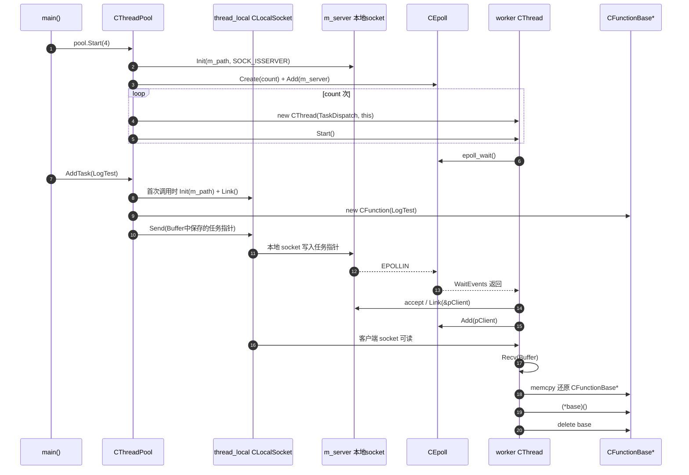

# 传统线程池 vs 易播线程池

> [!abstract]
> 本篇比较传统“队列 + mutex + condition_variable”线程池和易播的 local socket + epoll 线程池。
> 重点回答 worker 如何睡眠、如何被唤醒、任务为什么可以通过 socket 缓冲区传递。
> 
> 上级索引：[[4.1.1 易播服务器线程体系详解|易播服务器线程体系总览]]

## 6. 传统线程池 vs 易播线程池

[[3.Linux/12. 线程/12.7 条件变量与线程池]] 里讲的是最典型的线程池模型：生产者把任务放入队列，worker 没有任务时阻塞在条件变量上，有任务时被 `pthread_cond_signal` 或 `pthread_cond_broadcast` 唤醒。

易播这里换了一种写法：没有显式 `std::queue`，没有 `pthread_mutex_t`，也没有 `pthread_cond_t`。它把本地 socket 当成任务通道，把 `epoll_wait()` 当成睡眠点和唤醒点。

![[图片/6.项目/04.Linux播放器服务器/4.1 线程/6_4_1_1_3_1.svg]]

两者解决的是同一个核心问题：**没有任务时 worker 不要空转，有任务时 worker 要被唤醒**。

区别在于：

| 对比项 | 传统线程池 | 易播线程池 |
|---|---|---|
| 任务存储 | 用户态队列 | socket 缓冲区中保存任务指针字节 |
| 唤醒机制 | 条件变量 | socket 可读事件 + epoll |
| 同步方式 | mutex 保护队列 | 内核 socket 缓冲区承担排队和唤醒 |
| 典型用途 | 通用业务线程池 | 教学中串联 socket、epoll、pthread |
| 工程可控性 | 更容易管理 stop、队列长度、任务取消 | 更特别，但生命周期和错误处理更难 |

所以这份代码的价值不在于“比传统线程池更好”，而在于展示一种服务端思维：**只要能让 worker 睡眠、唤醒、取任务、执行任务，就能构成线程池；队列和条件变量只是最常见的一种实现，不是唯一实现。**

最终形成的调用链是：

```text
业务函数 LogTest
  -> CFunction<LogTest>
  -> CFunctionBase*
  -> AddTask() 写入本地 socket
  -> TaskDispatch() 被 epoll 唤醒
  -> Recv() 取回 CFunctionBase*
  -> (*base)()
  -> delete base
```

## 7. 线程通讯图



这张图有一个关键点：**socket 在这里承担了两个职责**。

- 它是任务数据通道：`AddTask()` 把 `CFunctionBase*` 的地址写进去。
- 它也是线程唤醒机制：socket 可读会触发 `EPOLLIN`，worker 因此从 `epoll_wait()` 返回。
