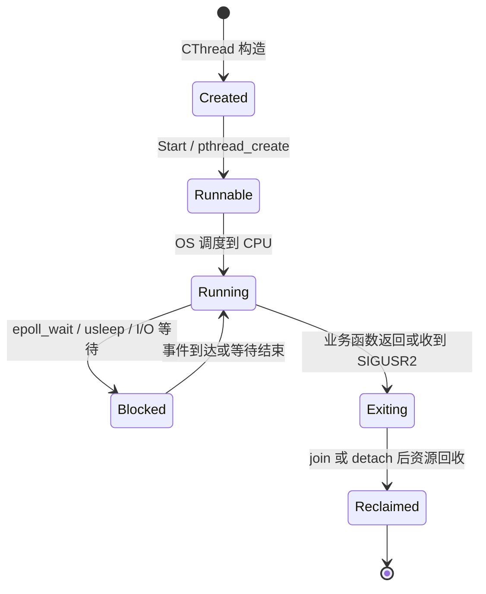

# CThread 与 CThreadPool 实现

> [!abstract]
> 本篇进入线程体系的核心实现层，拆解单线程封装 `CThread` 和线程池管理层 `CThreadPool`。
> 重点看线程生命周期、local socket 任务投递、epoll 唤醒、任务指针的接收执行和释放。
> 
> 上级索引：[[4.1.1 易播服务器线程体系详解|易播服务器线程体系总览]]

## 9. 单线程封装层：Thread.h

`CThread` 是对 `pthread` 的 C++ 对象化封装。它的核心目标不是实现复杂调度，而是解决三个问题：

- `pthread_create()` 只能接收静态函数或普通函数，怎么调用对象成员函数？
- 一个线程对象如何保存自己真正要执行的业务函数？
- 外部如何暂停或停止一个已经启动的线程？

```cpp
#pragma once
#include <unistd.h>
#include <pthread.h>
#include <fcntl.h>
#include <signal.h>
#include <map>
#include "Function.h"

class CThread
{
public:
	CThread() {
		// 默认构造时还没有绑定任务。
		m_function = NULL;
		m_thread = 0;
		m_bpaused = false;
	}

	template<typename _FUNCTION_, typename... _ARGS_>
	CThread(_FUNCTION_ func, _ARGS_... args)
		// 构造时直接把业务函数包装成 CFunctionBase。
		:m_function(new CFunction<_FUNCTION_, _ARGS_...>(func, args...))
	{
		m_thread = 0;
		m_bpaused = false;
	}

	~CThread() {}
public:
	// 禁止复制。
	// 一个 CThread 对象对应一个 pthread_t，复制会导致所有权和生命周期混乱。
	CThread(const CThread&) = delete;
	CThread operator=(const CThread&) = delete;
public:
	template<typename _FUNCTION_, typename... _ARGS_>
	int SetThreadFunc(_FUNCTION_ func, _ARGS_... args)
	{
		// 后绑定线程函数。
		// 注意：如果之前已经有 m_function，这里没有释放旧对象，教学代码需要知道这个风险。
		m_function = new CFunction<_FUNCTION_, _ARGS_...>(func, args...);
		if (m_function == NULL)return -1;
		return 0;
	}

	int Start() {
		pthread_attr_t attr;
		int ret = 0;

		// 初始化线程属性。
		ret = pthread_attr_init(&attr);
		if (ret != 0)return -1;

		// 设置为 joinable，表示后续理论上可以 join 回收。
		ret = pthread_attr_setdetachstate(&attr, PTHREAD_CREATE_JOINABLE);
		if (ret != 0)return -2;

		// pthread_create 要求入口函数签名为 void* (*)(void*)。
		// CThread::ThreadEntry 是静态函数，所以可以作为 pthread 入口。
		// this 被作为参数传进去，在线程入口里再转回 CThread*。
		ret = pthread_create(&m_thread, &attr, &CThread::ThreadEntry, this);
		if (ret != 0)return -4;

		// 建立 pthread_t -> CThread* 的映射。
		// 信号处理函数里只能拿到当前线程 id，需要靠这张表找回对象。
		m_mapThread[m_thread] = this;

		ret = pthread_attr_destroy(&attr);
		if (ret != 0)return -5;
		return 0;
	}

	int Pause() {
		// 这里的判断按原代码保留。
		// 从语义看，如果 m_thread != 0 表示线程有效，直接返回 -1 会让暂停逻辑很难触发；
		// 因此这是阅读代码时需要重点留意的实现问题。
		if (m_thread != 0)return -1;

		// 如果已经暂停，再调用一次 Pause() 就解除暂停标记。
		if (m_bpaused) {
			m_bpaused = false;
			return 0;
		}

		// 设置暂停标记，然后向目标线程发送 SIGUSR1。
		m_bpaused = true;
		int ret = pthread_kill(m_thread, SIGUSR1);
		if (ret != 0) {
			m_bpaused = false;
			return -2;
		}
		return 0;
	}

	int Stop() {
		if (m_thread != 0) {
			pthread_t thread = m_thread;

			// 先把对象内的 m_thread 清零，让线程侧知道对象正在停止。
			m_thread = 0;

			timespec ts;
			ts.tv_sec = 0;
			ts.tv_nsec = 100 * 1000000;//100ms

			// 尝试限时 join。
			int ret = pthread_timedjoin_np(thread, NULL, &ts);
			if (ret == ETIMEDOUT) {
				// 超时后转成 detached，并发送 SIGUSR2 要求线程退出。
				pthread_detach(thread);
				pthread_kill(thread, SIGUSR2);
			}
		}
		return 0;
	}

	bool isValid()const { return m_thread != 0; }
private:
	static void* ThreadEntry(void* arg) {
		// pthread 入口收到的是 void*，这里转回 CThread*。
		CThread* thiz = (CThread*)arg;

		// 给当前线程注册信号处理函数。
		// SIGUSR1 用于暂停，SIGUSR2 用于退出。
		struct sigaction act = { 0 };
		sigemptyset(&act.sa_mask);
		act.sa_flags = SA_SIGINFO;
		act.sa_sigaction = &CThread::Sigaction;
		sigaction(SIGUSR1, &act, NULL);
		sigaction(SIGUSR2, &act, NULL);

		// 进入真正的业务函数。
		thiz->EnterThread();

		// 业务函数返回后，清理线程对象状态。
		if (thiz->m_thread)thiz->m_thread = 0;

		// pthread_self() 不是冗余。
		// Stop() 可能已经把 thiz->m_thread 清零，所以这里重新取当前线程 id。
		pthread_t thread = pthread_self();
		auto it = m_mapThread.find(thread);
		if (it != m_mapThread.end())
			m_mapThread[thread] = NULL;

		// 当前线程退出前 detach 自己。
		pthread_detach(thread);
		pthread_exit(NULL);
	}

	static void Sigaction(int signo, siginfo_t* info, void* context)
	{
		if (signo == SIGUSR1) {
			// 收到暂停信号后，通过 pthread_self() 找回 CThread 对象。
			pthread_t thread = pthread_self();
			auto it = m_mapThread.find(thread);
			if (it != m_mapThread.end()) {
				if (it->second) {
					// 暂停的本质是循环 sleep。
					// 外部把 m_bpaused 改回 false 后，线程继续向下执行。
					while (it->second->m_bpaused) {
						if (it->second->m_thread == 0) {
							pthread_exit(NULL);
						}
						usleep(1000);//1ms
					}
				}
			}
		}
		else if (signo == SIGUSR2) {
			// 收到退出信号，直接结束当前线程。
			pthread_exit(NULL);
		}
	}

	void EnterThread() {
		if (m_function != NULL) {
			// 统一执行入口。
			// 这就是 Function.h 抽象层的落点。
			int ret = (*m_function)();
			if (ret != 0) {
				printf("%s(%d):[%s]ret = %d\n", __FILE__, __LINE__, __FUNCTION__);
			}
		}
	}
private:
	CFunctionBase* m_function;                 // 线程要执行的任务对象
	pthread_t m_thread;                        // pthread 线程 id
	bool m_bpaused;                            // true 表示暂停，false 表示运行
	static std::map<pthread_t, CThread*> m_mapThread; // 信号处理时反查 CThread*
};
```

### CThread 的核心技巧

`pthread_create()` 不能直接调用普通成员函数，因为成员函数天然带一个隐藏的 `this` 参数。这里的解决方式是经典写法：

```cpp
pthread_create(&m_thread, &attr, &CThread::ThreadEntry, this);
```

`ThreadEntry()` 是静态函数，符合 pthread 的函数签名；`this` 通过 `void* arg` 传入后，再转回 `CThread*`，从而进入对象内部的 `EnterThread()`。

从分层上看，`CThread` 是一个“线程执行器”，不是业务模块。它不知道日志、线程池、socket 或 epoll，它只负责把 `m_function` 跑起来。

### 线程生命周期八股

从 `CThread` 看线程生命周期，可以拆成 6 个状态：



对应到项目：

- `CThread thread(LogTest)` 只是创建了 C++ 对象，还没有操作系统线程。
- `thread.Start()` 才会调用 `pthread_create()`，此时内核创建真正线程。
- `ThreadEntry()` 是线程的第一个执行点。
- `EnterThread()` 调用 `(*m_function)()`，进入业务函数。
- 业务函数返回后，线程进入退出清理逻辑。
- `Stop()` 试图用 `pthread_timedjoin_np()` 等待线程退出；超时后改用 `pthread_detach()` 和 `SIGUSR2`。

这里有一个非常适合面试延伸的点：**joinable 线程如果既不 join 也不 detach，会造成线程资源不能及时回收，也就是常说的僵尸线程风险**。`[[3.Linux/12. 线程/12.5 线程销毁]]` 里强调过，线程结束不等于所有线程资源立刻消失；joinable 线程需要其他线程 join，detached 线程才会自动回收。

易播代码中比较混合：

```cpp
pthread_attr_setdetachstate(&attr, PTHREAD_CREATE_JOINABLE);
...
pthread_timedjoin_np(thread, NULL, &ts);
...
pthread_detach(thread);
...
pthread_detach(thread);
pthread_exit(NULL);
```

它先按 joinable 创建，停止时先尝试 join，超时后 detach；线程入口结束时又自行 detach。作为课程代码，它能展示多个 API；作为工程代码，则需要更清晰地规定线程所有权：到底由外部 join，还是创建后直接 detach，最好不要混用得太随意。

### CThread 和普通 pthread 写法的差异

普通 pthread 写法通常是：

```cpp
void* worker(void* arg) {
    // 业务逻辑
    return NULL;
}

pthread_t tid;
pthread_create(&tid, NULL, worker, arg);
pthread_join(tid, NULL);
```

易播封装后变成：

```cpp
CThread thread(LogTest);
thread.Start();
```

表面上代码少了，底层做的事情其实更多：

- 把 `LogTest` 包成 `CFunctionBase`。
- 用 `ThreadEntry` 适配 pthread 入口。
- 在线程入口内注册信号处理函数。
- 执行 `EnterThread()`。
- 结束时清理 `m_thread` 和 `m_mapThread`。

这就是封装的意义：调用者看到的是对象接口，复杂的 pthread 生命周期被藏进类内部。

## 10. 线程池管理层：ThreadPool.h

`CThreadPool` 是这套设计最特别的地方。传统线程池一般是：

```text
AddTask -> push queue -> condition_variable notify -> worker pop queue
```

而这里是：

```text
AddTask -> local socket send -> epoll_wait 返回 -> worker recv -> execute
```

完整代码如下。

```cpp
#pragma once
#include "Epoll.h"
#include "Thread.h"
#include "Function.h"
#include "Socket.h"

class CThreadPool
{
public:
	CThreadPool() {
		m_server = NULL;

		// 用当前时间生成一个临时本地 socket 文件名。
		// 每个线程池实例都有自己的 m_path，避免固定路径冲突。
		timespec tp = { 0,0 };
		clock_gettime(CLOCK_REALTIME, &tp);
		char* buf = NULL;
		asprintf(&buf, "%d.%d.sock", tp.tv_sec % 100000, tp.tv_nsec % 1000000);
		if (buf != NULL) {
			m_path = buf;
			free(buf);
		}

		// 稍微错开时间，降低连续构造时路径重复概率。
		usleep(1);
	}

	~CThreadPool() {
		Close();
	}

	CThreadPool(const CThreadPool&) = delete;
	CThreadPool& operator=(const CThreadPool&) = delete;
public:
	int Start(unsigned count) {
		int ret = 0;

		// 已经初始化过则拒绝重复启动。
		if (m_server != NULL)return -1;
		if (m_path.size() == 0)return -2;

		// 创建本地 socket 服务端。
		// 这个 server 不是对外业务监听 socket，而是线程池内部任务入口。
		m_server = new CLocalSocket();
		if (m_server == NULL)return -3;

		ret = m_server->Init(CSockParam(m_path, SOCK_ISSERVER));
		if (ret != 0)return -4;

		// 创建 epoll。count 可以理解为预期监听规模。
		ret = m_epoll.Create(count);
		if (ret != 0)return -5;

		// 把线程池任务入口 socket 注册到 epoll。
		// 后续 AddTask() 连接进来时，worker 会收到 m_server 可读事件。
		ret = m_epoll.Add(*m_server, EpollData((void*)m_server));
		if (ret != 0)return -6;

		// 创建 count 个 worker 线程。
		// 每个线程执行同一个成员函数：CThreadPool::TaskDispatch(this)。
		m_threads.resize(count);
		for (unsigned i = 0; i < count; i++) {
			m_threads[i] = new CThread(&CThreadPool::TaskDispatch, this);
			if (m_threads[i] == NULL)return -7;
			ret = m_threads[i]->Start();
			if (ret != 0)return -8;
		}
		return 0;
	}

	void Close() {
		// 关闭 epoll 后，worker 的 while (m_epoll != -1) 会退出。
		m_epoll.Close();

		if (m_server) {
			CSocketBase* p = m_server;
			m_server = NULL;
			delete p;
		}

		// 删除线程对象。
		// 注意：CThread 析构函数本身没有 Stop()，这里依赖 epoll 关闭后线程自然退出。
		for (auto thread : m_threads)
		{
			if (thread)delete thread;
		}
		m_threads.clear();

		// 删除临时本地 socket 文件。
		unlink(m_path);
	}

	template<typename _FUNCTION_, typename... _ARGS_>
	int AddTask(_FUNCTION_ func, _ARGS_... args) {
		// 每个调用 AddTask 的线程都有一个自己的 client。
		// thread_local 避免每次投递任务都重复创建连接。
		static thread_local CLocalSocket client;
		int ret = 0;

		// 首次使用时连接线程池的本地 socket 服务端。
		if (client == -1) {
			ret = client.Init(CSockParam(m_path, 0));
			if (ret != 0)return -1;
			ret = client.Link();
			if (ret != 0)return -2;
		}

		// 把任意函数和参数封装成统一任务对象。
		CFunctionBase* base = new CFunction< _FUNCTION_, _ARGS_...>(func, args...);
		if (base == NULL)return -3;

		// 发送的不是任务内容本身，而是任务对象指针的二进制值。
		// 因为 sender 和 worker 在同一进程内，所以指针地址对双方都有效。
		Buffer data(sizeof(base));
		memcpy(data, &base, sizeof(base));

		// 通过本地 socket 把任务指针发给线程池内部服务端。
		ret = client.Send(data);
		if (ret != 0) {
			delete base;
			return -4;
		}
		return 0;
	}
private:
	int TaskDispatch() {
		// 每个 worker 都运行这个循环。
		// epoll 关闭后，m_epoll == -1，循环退出。
		while (m_epoll != -1) {
			EPEvents events;
			int ret = 0;
			ssize_t esize = m_epoll.WaitEvents(events);
			if (esize > 0) {
				for (ssize_t i = 0; i < esize; i++) {
					if (events[i].events & EPOLLIN) {
						CSocketBase* pClient = NULL;

						if (events[i].data.ptr == m_server) {
							// 事件来自监听 socket，说明有新的 AddTask 调用端连接进来。
							ret = m_server->Link(&pClient);
							if (ret != 0)continue;

							// 把新 client socket 注册进 epoll。
							// 后续这个 client 发任务时，会触发下面的数据读取分支。
							ret = m_epoll.Add(*pClient, EpollData((void*)pClient));
							if (ret != 0) {
								delete pClient;
								continue;
							}
						}
						else {
							// 事件来自某个 client socket，说明任务指针已经发送过来了。
							pClient = (CSocketBase*)events[i].data.ptr;
							if (pClient) {
								CFunctionBase* base = NULL;
								Buffer data(sizeof(base));

								// 读取任务指针。
								ret = pClient->Recv(data);
								if (ret <= 0) {
									// client 断开，移出 epoll 并释放 socket 对象。
									m_epoll.Del(*pClient);
									delete pClient;
									continue;
								}

								// 从 Buffer 中还原 CFunctionBase*。
								memcpy(&base, (char*)data, sizeof(base));
								if (base != NULL) {
									// 执行任务，然后释放任务对象。
									(*base)();
									delete base;
								}
							}
						}
					}
				}
			}
		}
		return 0;
	}
private:
	CEpoll m_epoll;                    // 事件监听器
	std::vector<CThread*> m_threads;   // worker 线程集合
	CSocketBase* m_server;             // 线程池内部本地 socket 服务端
	Buffer m_path;                     // 临时 socket 路径
};
```

### 为什么说 socket 被当成了任务队列

`AddTask()` 并没有把任务放进 `std::queue`，也没有加锁。它做的是：

```cpp
CFunctionBase* base = new CFunction< _FUNCTION_, _ARGS_...>(func, args...);
Buffer data(sizeof(base));
memcpy(data, &base, sizeof(base));
ret = client.Send(data);
```

`TaskDispatch()` 另一端做的是：

```cpp
CFunctionBase* base = NULL;
Buffer data(sizeof(base));
ret = pClient->Recv(data);
memcpy(&base, (char*)data, sizeof(base));
(*base)();
delete base;
```

这意味着任务的所有权转移过程是：

```text
AddTask 创建任务对象
  -> socket 发送任务对象地址
  -> worker 收到地址
  -> worker 执行
  -> worker delete
```

这种设计成立的前提是：**发送端和执行端在同一个进程地址空间内**。如果跨进程发送这个指针，地址值就失去意义。

### 任务所有权流转

线程池里最容易读漏的是任务对象的所有权。把代码拆开看：

| 阶段 | 代码 | 所有权状态 |
|---|---|---|
| 创建任务 | `new CFunction<...>(func, args...)` | `AddTask()` 临时拥有 `base` |
| 发送任务 | `client.Send(data)` | 发送成功后，逻辑所有权转给 worker |
| 发送失败 | `delete base; return -4;` | `AddTask()` 自己释放，避免泄漏 |
| 接收任务 | `pClient->Recv(data)` | worker 从 socket 取回指针值 |
| 执行任务 | `(*base)();` | worker 使用任务对象 |
| 释放任务 | `delete base;` | worker 结束任务生命周期 |

这个设计有两个隐含前提：

1. `client.Send(data)` 成功就意味着后续一定有 worker 能收到并释放任务。
2. 线程池关闭时不会遗留已经写入 socket、但还没被 worker 读取的任务指针。

第一个前提在教学 demo 中通常成立，但生产环境要更谨慎。如果发送成功后线程池马上关闭，socket 缓冲区里可能还有任务指针没有被消费，这些任务对象就可能泄漏。传统线程池用用户态队列时，可以在 `Close()` 中遍历队列释放未执行任务；而这里任务躺在 socket 缓冲区中，管理难度更高。

### 为什么没有 mutex 和 condition_variable 也能唤醒 worker

传统条件变量线程池的核心动作是：

```text
生产者 push task
生产者 signal condition_variable
worker 从 cond_wait 醒来
worker pop task
```

易播线程池的核心动作是：

```text
AddTask send task pointer
socket fd 变成 readable
worker 从 epoll_wait 醒来
worker recv task pointer
```

所以 `epoll_wait()` 在这里承担了类似 `pthread_cond_wait()` 的等待角色。区别是：

- 条件变量等待的是“用户态条件是否满足”，条件本身通常是队列非空。
- `epoll_wait()` 等待的是“内核 fd 事件是否就绪”，条件是 socket 可读。

这也解释了为什么 `CThreadPool::TaskDispatch()` 每个 worker 都围绕 `m_epoll.WaitEvents(events)` 写：worker 的休眠点不是条件变量，而是 epoll。

### 和服务器 Reactor 模型的关系

`[[3.Linux/12. 线程/12.6 多线程并发服务器案例]]` 提到真实服务常见升级方向是 `epoll + 线程池`。典型 Reactor 模型一般是：

```text
I/O 线程 epoll_wait
  -> accept / read
  -> 把耗时任务投递给线程池
  -> worker 执行业务
```

易播这份代码稍微反过来：worker 自己就在 `epoll_wait()` 里等线程池内部任务 socket。它监听的不是外部客户端连接，而是线程池内部的本地 socket。这个设计更像“用 epoll 实现线程池的任务通知”，不是完整 Reactor 服务器。

