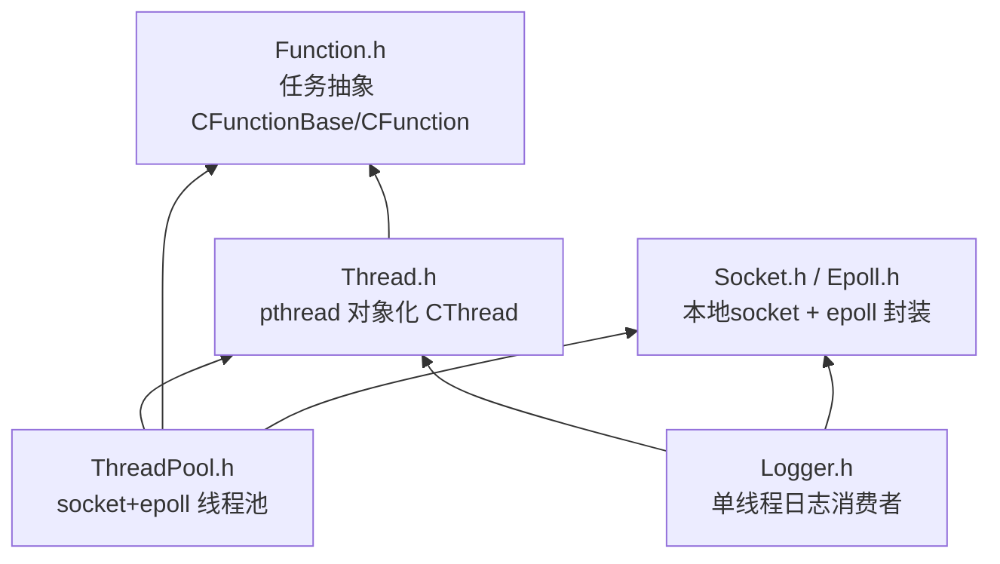

# 易播线程体系总览与学习路线（claude讲解版）

> [!abstract]
> 这一篇是整套线程体系的**入口地图**。它只回答三个问题：整体由哪几层组成、各层之间的**依赖顺序**是什么、应该按什么路线学。
> 具体实现拆到后面四篇专题，全部按**自底向上的依赖顺序**排列，读完一篇正好是下一篇的前置。
> 对应项目：`054-易播-集成测试 / EPlayerServer`。

## 1. 一句话抓住整个设计

整套线程体系只做了一件事的三种「对象化」：

```text
函数对象化   →  CFunctionBase / CFunction   （任务"是什么"）
pthread对象化 →  CThread                     （任务"在哪跑"）
事件对象化   →  CThreadPool(socket+epoll)   （任务"怎么投递 + 怎么唤醒"）
```

记住一个判断标准：**只要能让 worker「没任务时睡着、有任务时醒来、醒来后取任务执行」，它就是个线程池。** 队列 + 条件变量只是最常见的实现，不是唯一实现——这正是易播这份代码的教学用意：它用 `epoll_wait()` 当睡眠点、用 socket 可读事件当唤醒信号，证明「线程池 ≠ 队列 + condition_variable」。

## 2. 依赖链（必须按这个顺序理解）

```text
Function.h    ← 没有任何依赖，最底层（任务"是什么"）
   ↑
Thread.h      ← 依赖 Function.h（线程要跑一个任务）
   ↑
ThreadPool.h  ← 依赖 Thread + Function + Socket + Epoll（管理一群线程）
   ↑
Logger.h      ← 复用 CThread（证明 CThread 是可复用基础设施，不是私有工具）
```



## 3. 学习路线：四讲专题

| 顺序 | 笔记 | 核心一句话 |
|---|---|---|
| 第1讲 | [[4.1.1 Function 任务抽象层（claude讲解版）]] | 模板负责"适配差异"，多态负责"统一接口" |
| 第2讲 | [[4.1.2 CThread pthread 封装（claude讲解版）]] | `static 蹦床函数 + this 偷渡`，把 C 的 pthread 接回 C++ 对象 |
| 第3讲 | [[4.1.3 CThreadPool socket+epoll 线程池（claude讲解版）]] | socket=队列，epoll_wait=cond_wait，EPOLLIN=signal |
| 第4讲 | [[4.1.4 Logger 复用与全局对照（claude讲解版）]] | 传数据⇒可跨进程，传指针⇒只能同进程 |

> [!tip] 推荐阅读节奏
> ```text
> 先吃透"任务如何被统一表达"（第1讲）
>   → 再看"任务如何跑到 pthread 线程里"（第2讲）
>   → 再看"多个线程如何等待并执行任务"（第3讲，压轴）
>   → 最后看"同一套机制如何复用到日志，并对照出进程/线程边界"（第4讲）
> ```

## 4. 与基础知识 / 八股的映射

| 层次 | 基础知识 | 八股考点 | 易播落地 |
|---|---|---|---|
| 进程模型 | [[3.Linux/11. 进程/11.1 进程简介]] | 进程 vs 线程、地址空间、IPC 为什么存在 | `CProcess` 创建日志/客户端子进程，进程间不能直接共享普通指针 |
| 线程模型 | [[3.Linux/12. 线程/12.2 线程的创建与运行]] | `pthread_create`、线程入口、共享资源 | `CThread::Start()` 把任意业务函数跑到新线程 |
| 线程生命周期 | [[3.Linux/12. 线程/12.5 线程销毁]] | join / detach / 僵尸线程 | `CThread::Stop()` 限时 join，超时 detach + 信号兜底 |
| 线程同步 | [[3.Linux/12. 线程/12.7 条件变量与线程池]] | 竞态、临界区、条件变量、生产者消费者 | 没有传统队列，用 socket 可读事件唤醒 worker |
| 并发服务器 | [[3.Linux/12. 线程/12.6 多线程并发服务器案例]] | 多进程、多线程、I/O 多路复用、线程池取舍 | 把进程隔离、日志线程、线程池任务分发串成一个项目 |

## 5. 当前阶段在测什么（别被"线程池"误导）

`054-易播-集成测试` 当前主要在验证**基础设施**，不是完整业务服务器：进程创建、日志线程、文件描述符传递、本地 socket、线程池任务投递。`main()` 里的网络服务、数据库还只是架构预留位。读代码时要把「线程池怎么设计」和「这个阶段到底在测什么」分开看。

## 6. 一句话总结

这套线程体系的核心不是"写了一个线程池"，而是把 Linux 服务端常见的三类能力串成一条链：**函数对象化、pthread 对象化、epoll/socket 事件化**。任务从普通函数 → 可调度对象 → 被本地 socket 唤醒 worker 执行，全程一条龙。

---

> 下一篇：[[4.1.1 Function 任务抽象层（claude讲解版）]]
