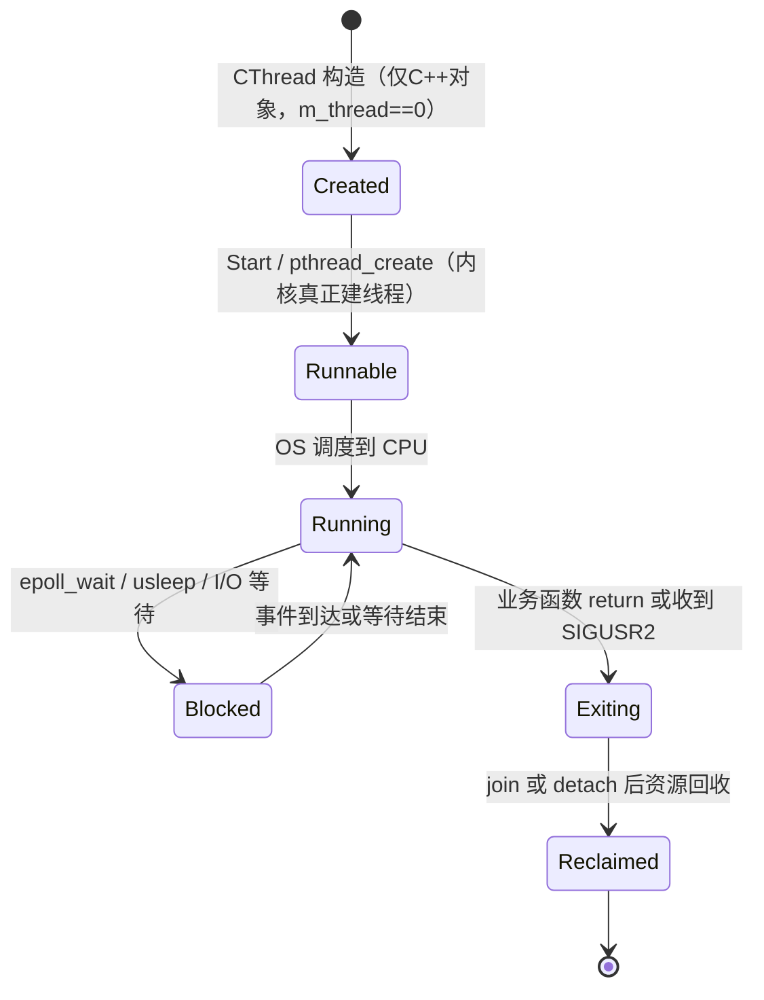

# 第2讲：CThread —— 把 pthread 对象化（claude讲解版）

> [!abstract]
> 本篇讲 `Thread.h`：如何把"C 风格、只认 `void*(*)(void*)` 函数指针"的 pthread，桥接到"带 this 的 C++ 成员世界"，并把线程的「创建→运行→暂停→停止→回收」收进一个对象。
> 上级索引：[[4.1.0 线程体系总览与学习路线（claude讲解版）]]

## 1. 知识定位

属于 **线程生命周期 + C/C++ 接口桥接**，底层依赖 [[3.Linux/12. 线程/12.2 线程的创建与运行]]、[[3.Linux/12. 线程/12.5 线程销毁]]。它向下用 [[4.1.1 Function 任务抽象层（claude讲解版）]] 的 `CFunctionBase` 承载任务，向上被 [[4.1.3 CThreadPool socket+epoll 线程池（claude讲解版）]] 和 [[4.1.4 Logger 复用与全局对照（claude讲解版）]] 复用。

## 2. 一句话定义

`CThread` 不发明任何线程机制，它只是pthread的搬运工：**把 pthread 的 C 接口桥接进 C++ 对象**，让调用者只面对 `Start() / Stop()`，而 `pthread_create / join / detach / 信号` 这些底层动作被藏进类内部。

## 3. 核心技巧：`static ThreadEntry(void*) + this`（必须吃透）

这是 C++ 封装 pthread 的**标准范式**，面试高频。

```cpp
pthread_create(&m_thread, &attr, &CThread::ThreadEntry, this);
//                                 ↑必须是 void*(*)(void*)   ↑借 void* 偷渡 this
```

**为什么普通成员函数不行？** 成员函数 `void CThread::Run()` 有一个**隐藏的 this 参数**，真实签名近似 `void Run(CThread* this)`，和 pthread 要的签名对不上：

```text
成员函数指针类型:  void(CThread::*)()    ← 隐含 this，多了一层绑定
pthread 要求类型:  void*(*)(void*)       ← 纯 C 函数指针，干净
```

**解法**：`static` 成员函数不绑定对象、没有隐藏 this，签名干净，正好当 C 入口；再把 `this` 塞进第 4 个参数 `void* arg` 偷渡进新线程，入口里 `static_cast<CThread*>(arg)` 把它接回对象世界。

```text
主线程 Start() ── pthread_create ──→ 新线程从 ThreadEntry(void*) 起跑
                                        │ arg 就是当初传的 this
                                        ▼
                                   thiz = (CThread*)arg     ← 回到对象世界
                                        ▼
                                   thiz->EnterThread()
                                        ▼
                                   (*m_function)()          ← 落回第1讲 Function
```

> [!quote] 📚 《UNIX 环境高级编程（APUE）》第11章
> pthread 是纯 C API，`start_routine` 必须是 `void *(*)(void *)`。C++ 里桥接成员函数的唯一干净办法，就是 static 蹦床函数（trampoline）+ `void*` 传 this。

## 4. `pthread_create` 参数拆解

```cpp
int pthread_create(pthread_t* thread, const pthread_attr_t* attr,
                   void* (*start_routine)(void*), void* arg);
```

| 实参 | 形参 | 含义 |
|---|---|---|
| `&m_thread` | `pthread_t*` | 输出：接收新线程 ID |
| `&attr` | `const pthread_attr_t*` | 线程属性（joinable / detached） |
| `&CThread::ThreadEntry` | `void*(*)(void*)` | 新线程的 C 风格入口 |
| `this` | `void*` | 传给入口的上下文 |

只有**第三个**参数是函数指针，不是"四个都是函数"。第四个参数传 `this`，所以入口能转回 `CThread*`。

## 5. 生命周期 6 态（对照源码）



| 状态 | 含义 | 对应动作 | 关注点 |
|------|------|----------|--------|
| `Created` | 只创建了 `CThread` 这个 C++ 对象，还没有真正的内核线程。 | 构造函数完成，`m_thread == 0`。 | 此时不能把它理解成“线程已经在跑”。 |
| `Runnable` | `pthread_create` 已经成功，线程进入可运行队列，等待 OS 调度。 | `Start()` 调用 `pthread_create`。 | 线程是否马上执行不由业务代码决定，而由调度器决定。 |
| `Running` | 线程拿到 CPU，开始执行入口函数和业务任务。 | `ThreadEntry()` 接回 `this`，再进入 `EnterThread()`。 | 真正运行的是 `m_function` 封装的任务。 |
| `Blocked` | 线程暂时让出 CPU，等待 I/O、定时器或事件。 | `epoll_wait`、`usleep`、阻塞 I/O 等。 | 阻塞不是退出，只是暂时不可运行。 |
| `Exiting` | 业务函数结束，或线程收到退出信号，开始离开执行流程。 | `return`、`SIGUSR2`、`pthread_exit` 等。 | 这一步只代表线程要结束，还不等于资源已经回收。 |
| `Reclaimed` | 线程结束后的资源已经被回收。 | `join` 等待回收，或 `detach` 后自动回收。 | `joinable` 线程如果没人 `join/detach`，会留下资源管理问题。 |

- `CThread t(LogTest)` 只建 C++ 对象，还没有 OS 线程。
- `t.Start()`（`Thread.h:48`）才 `pthread_create`，内核此时创建真正线程。
- `ThreadEntry`（`Thread.h:87`）是线程第一个执行点，先注册信号处理，再进 `EnterThread()`。
- `EnterThread()`（`Thread.h:128`）调 `(*m_function)()`，落回第1讲。

## 6. ⚠️ 三个工程隐患（"教学性 > 生产性"的体现）

### 隐患1：析构函数是空的 —— EMC++ Item 37 的反面教材

```cpp
~CThread() {}   // Thread.h:27，什么都不做！
```

对比标准库：`std::thread` 若析构时仍 joinable（既没 join 也没 detach），会直接 `std::terminate()` 让程序崩溃。

> [!quote] 📚 《Effective Modern C++》Item 37：Make std::threads unjoinable on all paths
> 线程对象析构时必须已经 join 或 detach，否则要么崩溃，要么资源泄漏。

#### 为什么 `std::thread` 选择 `terminate()` 而不是默默泄漏？

C++ 标准委员会在设计时面临三个选项：

| 选项 | 做法 | 后果 |
|------|------|------|
| A: 自动 join | 析构函数里调 `join()` | 如果线程卡死，析构无限阻塞——**Bug 变成 Hang**，更难调试 |
| B: 自动 detach | 析构函数里调 `detach()` | 线程可能还在引用已销毁的局部变量——**悬空引用**，未定义行为，极难复现 |
| C: terminate | 直接杀掉整个程序 | 看起来粗暴，但 **Bug 第一时间暴露**，不会变成更隐蔽的问题 |

> [!quote] 📚 《Effective Modern C++》Item 37
> "An implicit `join` makes performance anomalies hard to track down. An implicit `detach` makes debugging impossible (memory corruption from accessing destroyed stack frames). `std::terminate` is the right choice — it makes the mistake immediately visible."

**标准选了 C——让你崩，逼你修。**

#### CThread 怎么"侥幸"不崩？

CThread 不是 `std::thread`，它的析构是空的，自然不会 terminate。但内核线程的资源谁来回收？答案在 `ThreadEntry` 结尾：

```cpp
// Thread.h:103 附近
static void* ThreadEntry(void* arg) {
    CThread* thiz = static_cast<CThread*>(arg);
    // ... 注册信号处理、执行 EnterThread() ...

    pthread_detach(pthread_self());  // ← 线程自己 detach 自己
    return nullptr;
}
```

**回收责任从"析构函数"甩给了"线程自身"。** 线程跑完后自己 detach，内核自动回收。

#### "悬挂窗口"：对象已死，线程还在跑

问题在于：`delete thread` 可能发生在线程还没跑完的时候。

```text
时间 →

主线程 CThreadPool::Close():
 ┌─────────────────────────────────────────────┐
 │  delete thread[0]  ← C++对象被销毁           │
 │  delete thread[1]                            │
 └─────────────────────────────────────────────┘

Worker 0 的内核线程（还在跑）:
 ┌──────────────────────────────────────────────────────────┐
 │  ThreadEntry()                                           │
 │    → EnterThread()                                       │
 │      → epoll_wait... 还没收到退出信号...                  │
 │                       ↑                                  │
 │           C++对象已被 delete，                             │
 │           但线程还在通过 thiz-> 访问成员变量！              │
 │           → 访问已释放内存 = use-after-free               │
 │      → ...最终退出...                                    │
 │    → pthread_detach(self)                                │
 └──────────────────────────────────────────────────────────┘
```

它通常不崩是因为 `Close()` 关闭 epoll 后，worker 的 `epoll_wait()` 会返回错误，循环自然退出，窗口极短。但这是**运气**，不是**保证**。

#### 生产代码应该怎么做？

```cpp
// ✅ 正确：先确认线程死了，再销毁对象
~CThread() {
    Stop();
    if (m_thread.joinable()) {
        m_thread.join();
    }
}

// ✅ 最佳：C++20 std::jthread 析构自动 join
std::jthread t(some_func);
// 析构时自动 request_stop() + join()
```

**核心原则：对象的生命周期必须 ≥ 线程的生命周期。**

---

### 隐患2：用信号做暂停/停止 —— 违反异步信号安全

`Sigaction()`（`Thread.h:107`）在 `SIGUSR1` 处理函数里**访问 `std::map`、读对象字段、调 `usleep()`、调 `pthread_exit()`**。

> [!quote] 📚 APUE 10.6 / 《Linux 多线程服务端编程》（muduo，陈硕）
> 信号处理函数里只能调用**异步信号安全（async-signal-safe）** 函数，名单很短（`write`、`_exit` 等）。`std::map` 查找、`usleep`、`pthread_exit` 都不在名单里。陈硕明确主张：**多线程程序里尽量不用信号做线程控制。**

#### 信号到底是怎么"打断"线程的？

信号不是函数调用，它更像一个**硬件中断**——在任意指令之间强制插入执行：

```text
正常执行流:
  线程正在执行 func_A()
  → func_A 调用 func_B()
  → func_B 正在操作 std::map（内部调整红黑树节点指针）

此时 SIGUSR1 到达:
  ┌─────────────────────────────────────────────────┐
  │ 内核强制暂停 func_B()                            │
  │   ↓                                             │
  │ 保存当前所有寄存器（程序计数器、栈指针等）          │
  │   ↓                                             │
  │ 跳转到注册的信号处理函数 signal_handler()          │
  │   ↓                                             │
  │ signal_handler() 执行完毕                         │
  │   ↓                                             │
  │ 恢复寄存器，继续执行被打断的 func_B()              │
  └─────────────────────────────────────────────────┘
```

**信号处理函数在"被打断的函数的上下文中"执行——不是另一个线程，而是插入到当前线程的执行流中间。**

#### 为什么 `std::map` 操作不安全？

`std::map` 底层是红黑树。插入或查找时，内部正在逐步修改节点指针：

```text
红黑树旋转操作（简化）：

步骤1: node->left = other->right;   ← 指针 A 已修改
步骤2: other->right = node;          ← 信号在这里打断...
步骤3: node->parent = other;         ← 这一步还没执行！
```

信号恰好在步骤 1 和步骤 3 之间到达，红黑树内部状态**不一致**——有些指针改了，有些还没改。

然后信号处理函数去查 `m_mapThread`（也是 `std::map`），看到的是一棵**半修改的树**：

- 读到垃圾指针 → 段错误
- 陷入死循环（遍历到断裂的链接）
- 返回错误结果
- 更隐蔽：偶尔正确，偶尔崩溃（取决于信号到达的精确时刻）

#### 为什么 `usleep()` 不安全？

`usleep()` 内部操作定时器数据结构。如果主流程正在执行 `sleep()`，信号打断后又调 `usleep()`——两层嵌套操作同一个内核数据结构，未定义行为。

#### 为什么 `pthread_exit()` 不安全？

`pthread_exit()` 会触发栈展开（调用析构函数）、执行 cleanup 函数、释放线程局部存储。如果被打断的函数正持有锁：

```text
正常退出:
  func_B() {
    lock(mutex);
    修改共享数据;
    unlock(mutex);     ← 正常解锁
  }

信号处理中 pthread_exit():
  func_B() {
    lock(mutex);
    修改共享数据;      ← 信号在这里打断
    // --- 信号处理函数调用 pthread_exit() ---
    // 栈展开直接跳过 unlock(mutex)
    // mutex 永远锁着 → 其他线程死锁
  }
```

#### 哪些函数才是异步信号安全的？

POSIX 维护了一个**白名单**（完整列表见 `man 7 signal-safety`）：

| 安全（举例） | 不安全（举例） |
|---|---|
| `write()` | `printf()` — 内部有缓冲区和锁 |
| `read()` | `malloc()` / `free()` — 堆管理数据结构 |
| `_exit()` | `std::map` 的任何操作 |
| `signal()` | `usleep()` |
| `open()` / `close()` | `pthread_exit()` |
| `sem_post()` | 任何操作 `std::` 容器的函数 |

**判断标准：这个函数内部有没有全局/静态的可变状态？有就不安全。**

#### 正确的线程停止方式

```cpp
// ❌ CThread 做法：用信号
pthread_kill(m_thread, SIGUSR2);

// ✅ 做法1：eventfd（本项目线程池已用类似思路，见第3讲）
int efd = eventfd(0, EFD_NONBLOCK);
uint64_t val = 1;
write(efd, &val, sizeof(val));  // epoll_wait 检测到可读 → 线程醒来检查退出标志

// ✅ 做法2：原子标志 + 条件变量
std::atomic<bool> stop_flag{false};
stop_flag.store(true);
cv.notify_all();

// ✅ 做法3：C++20 stop_token（最现代）
std::jthread t([](std::stop_token st) {
    while (!st.stop_requested()) { /* 工作 */ }
});
// 析构时自动 request_stop() + join()
```

> [!quote] 📚 《Linux 多线程服务端编程》（陈硕）
> "在多线程程序中，最安全的做法是：**用一个专门的线程通过 `sigwait()` 同步处理信号，其他线程全部屏蔽信号。** 或者干脆不用信号做线程控制，改用 `eventfd` / 条件变量 / `stop_token`。"

---

### 隐患3：`Pause()` 判断写反了

```cpp
int Pause() {
    if (m_thread != 0) return -1;   // Thread.h:56 —— 线程"有效"时却直接失败？!
    ...
}
```

#### `m_thread` 的语义

```text
m_thread 的含义:
  == 0  → 线程还没创建，或已经结束（C++对象存在，但没有对应的内核线程）
  != 0  → pthread_create 成功了，线程正在运行（有对应的内核线程）
```

这个约定在 `Start()` 里建立——`pthread_create` 成功后 `m_thread` 被赋值为非零的线程 ID。

#### 为什么条件是反的？

逐行翻译当前代码的语义：

```text
"如果线程正在运行（m_thread != 0），返回 -1（失败）"
```

但 Pause 应该**暂停一个正在运行的线程**——线程正在运行正是你应该暂停它的时候，怎么能返回失败？

反过来，`m_thread == 0`（线程根本没启动），去"暂停"一个不存在的线程才应该返回失败。

```cpp
// ❌ 当前代码（Bug）
if (m_thread != 0) return -1;   // 线程有效却失败

// ✅ 正确逻辑
if (m_thread == 0) return -1;   // 线程不存在才失败
```

#### 这个 Bug 为什么没被发现？

- `Pause()` 可能从来没被调用过（测试代码只用了 `Start` / `Stop`）
- 即使被调用，调用者可能没检查返回值
- 功能"不工作"时容易误以为是信号机制的问题，不会怀疑简单的 `if` 条件

**这是代码里一个真实的 bug。**

## 7. Modern C++ 视角：这套封装的"现代等价物"

```cpp
// 易播教学写法（自己造轮子，练 pthread）
CThread t(LogTest);
t.Start();

// 现代标准库等价（生产首选）
std::jthread t(LogTest);  // C++20：析构自动 join，自带 stop_token 优雅停止
```

> [!quote] 📚 《Effective Modern C++》Item 35
> "Prefer task-based programming to thread-based." 能用 `std::async` / 任务模型就别手搓 `std::thread`。

C++20 的 `std::jthread` 直接解决了 Item 37 的「all paths unjoinable」：析构自动 join，还自带 `std::stop_token` 替代信号停止。**易播用 SIGUSR2 停线程的整套机制，在现代 C++ 里就是一个 `stop_token`。**

## 8. 封装前后对比

```cpp
// 裸 pthread
void* worker(void* arg) { /* 业务 */ return NULL; }
pthread_t tid;
pthread_create(&tid, NULL, worker, arg);
pthread_join(tid, NULL);

// CThread 封装后
CThread t(LogTest);
t.Start();
```

表面代码变少，底层其实做得更多：把 `LogTest` 包成 `CFunctionBase` → 用 `ThreadEntry` 适配入口 → 注册信号处理 → 执行 `EnterThread()` → 结束时清理 `m_thread` 和 `m_mapThread`。这就是封装的意义：复杂的 pthread 生命周期被藏进类内部。

## 9. 延伸思考

1. **相关概念**：`m_mapThread`（`pthread_t → CThread*` 的 static map）只为信号处理时反查对象——这正是「信号处理只拿得到线程 id、拿不到对象」的妥协产物。换 `eventfd` 方案后这张表就不需要了。
2. **面试常见问题**：
   - Q：`join` 和 `detach` 的区别？
   - A：`join` 等待线程结束并回收资源、可取返回值；`detach` 分离后线程结束自动回收、不能再 join。`CThread` 创建时设 joinable，`Stop()` 先限时 `pthread_timedjoin_np`，超时再 `detach` + `SIGUSR2`——展示了多个 API，但生产应统一线程所有权策略。
3. **下一步**：[[4.1.3 CThreadPool socket+epoll 线程池（claude讲解版）]] —— 看 N 个 `CThread` 如何围绕一个 epoll 协作。

---

> 上一篇：[[4.1.1 Function 任务抽象层（claude讲解版）]] ｜ 下一篇：[[4.1.3 CThreadPool socket+epoll 线程池（claude讲解版）]]
