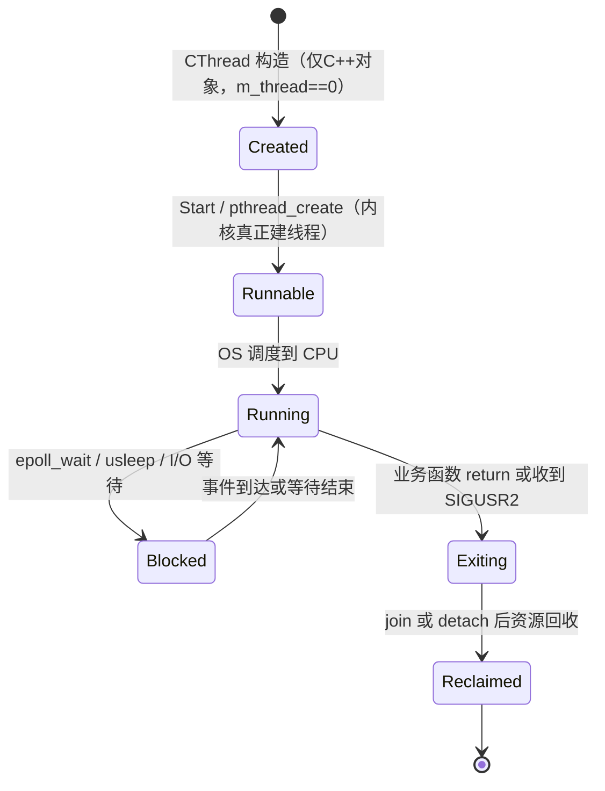

# 第2讲：CThread —— 把 pthread 对象化（claude讲解版）

> [!abstract]
> 本篇讲 `Thread.h`：如何把"C 风格、只认 `void*(*)(void*)` 函数指针"的 pthread，桥接到"带 this 的 C++ 成员世界"，并把线程的「创建→运行→暂停→停止→回收」收进一个对象。
> 上级索引：[[4.1.0 线程体系总览与学习路线（claude讲解版）]]

## 1. 知识定位

属于 **线程生命周期 + C/C++ 接口桥接**，底层依赖 [[3.Linux/12. 线程/12.2 线程的创建与运行]]、[[3.Linux/12. 线程/12.5 线程销毁]]。它向下用 [[4.1.1 Function 任务抽象层（claude讲解版）]] 的 `CFunctionBase*` 承载任务，向上被 [[4.1.3 CThreadPool socket+epoll 线程池（claude讲解版）]] 和 [[4.1.4 Logger 复用与全局对照（claude讲解版）]] 复用。

## 2. 一句话定义

`CThread` 不发明任何线程机制，它只做一件难事：**把 pthread 的 C 接口桥接进 C++ 对象**，让调用者只面对 `Start() / Stop()`，而 `pthread_create / join / detach / 信号` 这些底层动作被藏进类内部。

## 3. 核心技巧：`static ThreadEntry(void*) + this`（必须吃透）

这是 C++ 封装 pthread 的**标准范式**，面试高频。

```cpp
pthread_create(&m_thread, &attr, &CThread::ThreadEntry, this);
//                                 ↑必须是 void*(*)(void*)   ↑借 void* 偷渡 this
```

**为什么普通成员函数不行？** 成员函数 `void CThread::Run()` 有一个**隐藏的 this 参数**，真实签名近似 `void Run(CThread* this)`，类型是 `void(CThread::*)()`，和 pthread 要的 `void*(*)(void*)` 对不上。

**解法**：`static` 成员函数不绑定对象、没有隐藏 this，签名干净，正好当 C 入口；再把 `this` 塞进第 4 个参数 `void* arg` 偷渡进新线程，入口里 `static_cast<CThread*>(arg)` 把它接回对象世界。

```text
主线程 Start() ── pthread_create ──→ 新线程从 ThreadEntry(void*) 起跑
                                        │ arg 就是当初传的 this
                                        ▼
                                   thiz = (CThread*)arg     ← 回到对象世界
                                        ▼
                                   thiz->EnterThread()
                                        ▼
                                   (*m_function)()          ← 落回第1讲 Function
```

> [!quote] 📚 《UNIX 环境高级编程（APUE）》第11章
> pthread 是纯 C API，`start_routine` 必须是 `void *(*)(void *)`。C++ 里桥接成员函数的唯一干净办法，就是 static 蹦床函数（trampoline）+ `void*` 传 this。

## 4. `pthread_create` 参数拆解

```cpp
int pthread_create(pthread_t* thread, const pthread_attr_t* attr,
                   void* (*start_routine)(void*), void* arg);
```

| 实参 | 形参 | 含义 |
|---|---|---|
| `&m_thread` | `pthread_t*` | 输出：接收新线程 ID |
| `&attr` | `const pthread_attr_t*` | 线程属性（joinable / detached） |
| `&CThread::ThreadEntry` | `void*(*)(void*)` | 新线程的 C 风格入口 |
| `this` | `void*` | 传给入口的上下文 |

只有**第三个**参数是函数指针，不是"四个都是函数"。第四个参数传 `this`，所以入口能转回 `CThread*`。

## 5. 生命周期 6 态（对照源码）



- `CThread t(LogTest)` 只建 C++ 对象，还没有 OS 线程。
- `t.Start()`（`Thread.h:48`）才 `pthread_create`，内核此时创建真正线程。
- `ThreadEntry`（`Thread.h:87`）是线程第一个执行点，先注册信号处理，再进 `EnterThread()`。
- `EnterThread()`（`Thread.h:128`）调 `(*m_function)()`，落回第1讲。

## 6. ⚠️ 三个工程隐患（"教学性 > 生产性"的体现）

### 隐患1：析构函数是空的 —— EMC++ Item 37 的反面教材

```cpp
~CThread() {}   // Thread.h:27，什么都不做！
```

对比标准库：`std::thread` 若析构时仍 joinable（既没 join 也没 detach），会直接 `std::terminate()` 让程序崩溃。

> [!quote] 📚 《Effective Modern C++》Item 37：Make std::threads unjoinable on all paths
> 线程对象析构时必须已经 join 或 detach，否则要么崩溃，要么资源泄漏。

`CThread` 怎么"侥幸"不崩？靠 `ThreadEntry` 结尾**自己 detach 自己**（`Thread.h:103`）。它把回收责任甩给线程自身。代价：`CThreadPool::Close()` 里 `delete thread` 时，若对应内核线程还没退出，就出现「对象已析构、线程还在跑」的悬挂窗口，只能依赖「epoll 一关、worker 循环自然退出」兜底。**这是脆弱的隐式契约**，生产代码应让析构函数显式 `Stop()`。

### 隐患2：用信号做暂停/停止 —— 违反异步信号安全

`Sigaction()`（`Thread.h:107`）在 `SIGUSR1` 处理函数里**访问 `std::map`、读对象字段、调 `usleep()`、调 `pthread_exit()`**。

> [!quote] 📚 APUE 10.6 / 《Linux 多线程服务端编程》（muduo，陈硕）
> 信号处理函数里只能调用**异步信号安全（async-signal-safe）** 函数，名单很短（`write`、`_exit` 等）。`std::map` 查找、`usleep`、`pthread_exit` 都不在名单里。陈硕明确主张：**多线程程序里尽量不用信号做线程控制。**

**正确姿势**：用 `eventfd` 或条件变量做线程间唤醒/停止，而不是 `pthread_kill`。

### 隐患3：`Pause()` 判断写反了

```cpp
int Pause() {
    if (m_thread != 0) return -1;   // Thread.h:56 —— 线程"有效"时却直接失败？!
    ...
}
```

`m_thread != 0` 表示线程**有效**，这里却 `return -1` 不暂停。语义上应是 `if (m_thread == 0) return -1;`（无效才失败）。**这是代码里一个真实的 bug。**

## 7. Modern C++ 视角：这套封装的"现代等价物"

```cpp
// 易播教学写法（自己造轮子，练 pthread）
CThread t(LogTest);
t.Start();

// 现代标准库等价（生产首选）
std::jthread t(LogTest);  // C++20：析构自动 join，自带 stop_token 优雅停止
```

> [!quote] 📚 《Effective Modern C++》Item 35
> "Prefer task-based programming to thread-based." 能用 `std::async` / 任务模型就别手搓 `std::thread`。

C++20 的 `std::jthread` 直接解决了 Item 37 的「all paths unjoinable」：析构自动 join，还自带 `std::stop_token` 替代信号停止。**易播用 SIGUSR2 停线程的整套机制，在现代 C++ 里就是一个 `stop_token`。**

## 8. 封装前后对比

```cpp
// 裸 pthread
void* worker(void* arg) { /* 业务 */ return NULL; }
pthread_t tid;
pthread_create(&tid, NULL, worker, arg);
pthread_join(tid, NULL);

// CThread 封装后
CThread t(LogTest);
t.Start();
```

表面代码变少，底层其实做得更多：把 `LogTest` 包成 `CFunctionBase` → 用 `ThreadEntry` 适配入口 → 注册信号处理 → 执行 `EnterThread()` → 结束时清理 `m_thread` 和 `m_mapThread`。这就是封装的意义：复杂的 pthread 生命周期被藏进类内部。

## 9. 延伸思考

1. **相关概念**：`m_mapThread`（`pthread_t → CThread*` 的 static map）只为信号处理时反查对象——这正是「信号处理只拿得到线程 id、拿不到对象」的妥协产物。换 `eventfd` 方案后这张表就不需要了。
2. **面试常见问题**：
   - Q：`join` 和 `detach` 的区别？
   - A：`join` 等待线程结束并回收资源、可取返回值；`detach` 分离后线程结束自动回收、不能再 join。`CThread` 创建时设 joinable，`Stop()` 先限时 `pthread_timedjoin_np`，超时再 `detach` + `SIGUSR2`——展示了多个 API，但生产应统一线程所有权策略。
3. **下一步**：[[4.1.3 CThreadPool socket+epoll 线程池（claude讲解版）]] —— 看 N 个 `CThread` 如何围绕一个 epoll 协作。

---

> 上一篇：[[4.1.1 Function 任务抽象层（claude讲解版）]] ｜ 下一篇：[[4.1.3 CThreadPool socket+epoll 线程池（claude讲解版）]]
