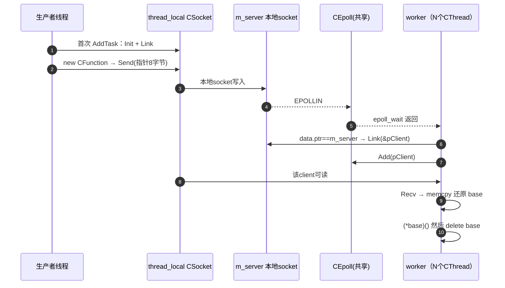

# 第3讲：CThreadPool —— 用 socket+epoll 替换"队列+条件变量"（claude讲解版）

> [!abstract]
> 本篇是整套体系的**压轴**：`CThreadPool` 把传统线程池的「任务队列 / mutex / 条件变量」整体换成「socket 缓冲区 / socket 可读事件 / epoll_wait」。
> 它要回答的还是那个唯一问题：**worker 没任务时怎么睡，有任务时怎么醒，醒了去哪取任务。**
> 上级索引：[[4.1.0 线程体系总览与学习路线（claude讲解版）]]

## 1. 知识定位

属于 **线程池模型 + I/O 多路复用 + 并发同步** 的交汇，底层依赖 [[3.Linux/12. 线程/12.7 条件变量与线程池]]。它复用 [[4.1.2 CThread pthread 封装（claude讲解版）]] 当 worker 载体，用 [[4.1.1 Function 任务抽象层（claude讲解版）]] 的 `CFunctionBase*` 当任务。

## 2. 核心对应表（把这张表刻进脑子）

| 传统线程池 | 易播线程池 | 本质 |
|---|---|---|
| `std::queue<Task>` | socket 内核缓冲区 | 任务排队的地方 |
| `mutex` 保护队列 | 内核对 socket 缓冲区天然串行化 | 入队/出队的互斥 |
| `cond.wait()` 睡眠 | `epoll_wait()` 睡眠 | worker 的休眠点 |
| `cond.notify()` 唤醒 | 写 socket → `EPOLLIN` | 生产者的唤醒动作 |
| `queue.pop()` | `Recv()` 读出指针 | 取任务 |

> [!quote] 📚 self-pipe trick / eventfd（《Linux 多线程服务端编程》陈硕）
> "用一个 fd 的可读事件唤醒等在 epoll/select 上的线程"有个经典名字叫 **self-pipe trick（自管道技巧）**。它的现代替代品是 **`eventfd`**：muduo 的每个 EventLoop 都揣一个 `eventfd`，别的线程往里写 8 字节就能把 `epoll_wait` 中的 loop 叫醒。
> **易播这里用本地 socket 传"8 字节指针"，本质就是 self-pipe trick 的变体**——只不过顺手把"唤醒"和"传数据"合并成了一次 `Send`。

最终调用链：

```text
业务函数 LogTest
  → CFunction<LogTest>      （第1讲：包成任务对象）
  → CFunctionBase*
  → AddTask() 写入本地 socket
  → TaskDispatch() 被 epoll 唤醒
  → Recv() 取回 CFunctionBase*
  → (*base)()               （执行）
  → delete base             （释放）
```

## 3. 任务投递时序图



## 4. 深度剖析

### 剖析1：`thread_local client` —— 生产端为什么不用加锁

```cpp
int AddTask(...) {
    static thread_local CSocket client;   // ThreadPool.h:65
    if (client == -1) { client.Init(...); client.Link(); }  // 每线程只连一次
    ...
    client.Send(data);
}
```

`thread_local` 让**每个调用 `AddTask` 的生产者线程各自拥有一条独立连接**：

1. **首次连接、之后复用**：`if (client == -1)` 保证连接建好后反复用，不会每投一个任务就 `connect`。
2. **天然免锁**：多个生产者各走各的 socket，内核帮你隔离并发写，生产端**完全不需要 mutex**。

> [!tip]
> 这是 TLS（线程局部存储）消除竞争的经典用法——把"共享资源"变成"每线程私有"，竞争就消失了。第4讲 Logger 的 `Trace()` 用的是同一招。

### 剖析2：任务对象的所有权流转（EMC++ 视角）

```text
[AddTask]  base = new CFunction(...)        // 生产者临时持有
   │        memcpy(data, &base, 8)          // 拷的是"指针的值"，不是对象
   │        client.Send(data) ───────────►  // 成功 = 所有权"逻辑移交"给 worker
   │        若 Send 失败: delete base        // 生产者兜底释放
   ▼
[worker]   Recv → memcpy(&base,...)         // 还原同一个堆地址
           (*base)()                        // 执行
           delete base                      // worker 最终释放
```

`new` 在生产者线程、`delete` 在 worker 线程，中间靠一条约定——*Send 成功就一定有 worker 接管*。

> [!quote] 📚 《Effective Modern C++》Item 18-21
> 堆对象所有权应当用 `std::unique_ptr` 表达。这里用**裸指针穿过 socket**，等于把 RAII 彻底关掉，所有权只活在程序员脑子里。一旦 `Close()` 时 socket 缓冲区里还躺着没被 `Recv` 的指针，那些 `CFunction` 对象就**直接泄漏**（传统队列还能在析构时遍历释放，socket 缓冲区你遍历不了）。

### 剖析3：为什么"传指针"只能同进程 —— 铁律

```cpp
memcpy(data, &base, sizeof(base));  // 发送的是虚拟地址 0x55a3...
```

> [!quote] 📚 CSAPP 第9章（虚拟内存）
> 每个进程有**私有的虚拟地址空间**。同一个虚拟地址在进程 A 映射到物理页 X，在进程 B 可能未映射、或映射到完全不同的物理页。所以指针 = "仅在本进程有效的虚拟地址"。

- 线程共享进程地址空间 → 同进程 worker 用这个地址能找到对象 ✅
- 跨进程 → 这个地址在对方进程里是无意义的数字 ❌

> [!important]
> 这条铁律是 [[4.1.4 Logger 复用与全局对照（claude讲解版）]] 的钥匙：Logger 跨进程，所以它**传数据不传指针**。

### 剖析4：⚠️ 共享一个 epoll 的 N 个 worker（面试加分点）

看 `Start()`：**N 个 worker 全跑同一个 `TaskDispatch`，共享同一个 `m_epoll` 和 `m_server`**。再看 `Epoll.h:89`，`Add` 默认事件是 `EPOLLIN`，**没有 `EPOLLET`，也没有 `EPOLLEXCLUSIVE`** → 即**水平触发 + 无独占唤醒**。两个真实问题：

1. **惊群（thundering herd）**：一个新连接到达 `m_server`，水平触发会让**多个**阻塞在 `epoll_wait` 的 worker 同时醒来抢 `accept`，只有一个抢到，其余空跑。
2. **更隐蔽的数据竞争**：某个已连接的 `pClient` 来了任务（可读），LT 模式下在数据被读走前，这个事件可能**同时**被两个 worker 的 `epoll_wait` 返回 → 两个 worker 都去 `Recv` 同一个 fd → 竞争。指针只有 8 字节，实践中多半"碰巧"没炸，但这是**潜伏的 race**。

> [!quote] 📚 TLPI（Kerrisk）第63章 / muduo
> 多线程共享 epoll 时，LT 模式天然有惊群；Linux 4.5 起可用 `EPOLLEXCLUSIVE` 缓解。而 **muduo 的答案是另一条路——"one loop per thread"**：每个线程独占自己的 EventLoop，连接被 round-robin 分给某个固定线程，从根上避免共享 epoll 的竞争。

**所以这份代码的工程定位很清楚**：它示范"socket+epoll 能驱动线程池"这个**思想**，但"N worker 抢一个 epoll"在生产里要么换 `EPOLLEXCLUSIVE`、要么换 one-loop-per-thread、要么回到「MPMC 队列 + 条件变量」。

### 剖析5：它其实不是"纯睡眠"

`Epoll.h:73` 的 `WaitEvents` 默认 `timeout = 10`（毫秒）。即 **worker 即使没任务，每 10ms 也会醒一次、空转一圈再睡**。和条件变量有本质区别：

| | 条件变量 | 易播 epoll(10ms) |
|---|---|---|
| 无任务时 CPU | 0，直到被 signal | 10ms 一次轻量轮询 |
| 关闭响应 | 需显式 notify 唤醒 | 最多 10ms 内看到 `m_epoll==-1` 自然退出 |

好处：`Close()` 后所有 worker 最多 10ms 就能自然退出（这正是它敢用空析构、不显式 `Stop()` 的底气）。代价：严格意义上不是零开销等待。

## 5. 关键源码骨架（对照 `ThreadPool.h`）

```cpp
int Start(unsigned count) {
    m_server = new CSocket();
    m_server->Init(CSockParam(m_path, SOCK_ISSERVER));   // 内部任务入口，不是对外业务监听
    m_epoll.Create(count);
    m_epoll.Add(*m_server, EpollData((void*)m_server));  // 监听任务入口
    m_threads.resize(count);
    for (unsigned i = 0; i < count; i++) {
        m_threads[i] = new CThread(&CThreadPool::TaskDispatch, this); // N个worker跑同一函数
        m_threads[i]->Start();
    }
}

int TaskDispatch() {                         // 每个 worker 的主循环
    while (m_epoll != -1) {
        EPEvents events;
        ssize_t esize = m_epoll.WaitEvents(events);      // 休眠点（10ms timeout）
        for (ssize_t i = 0; i < esize; i++) {
            if (!(events[i].events & EPOLLIN)) continue;
            if (events[i].data.ptr == m_server) {        // 新生产者连接
                CSocketBase* pClient = NULL;
                m_server->Link(&pClient);
                m_epoll.Add(*pClient, EpollData((void*)pClient));
            } else {                                     // 已连接：任务到了
                auto* pClient = (CSocketBase*)events[i].data.ptr;
                CFunctionBase* base = NULL;
                Buffer data(sizeof(base));
                if (pClient->Recv(data) <= 0) {          // 断开
                    m_epoll.Del(*pClient); delete pClient; continue;
                }
                memcpy(&base, (char*)data, sizeof(base)); // 还原指针
                if (base) { (*base)(); delete base; }     // 执行 + 释放
            }
        }
    }
}
```

> [!note] 小出入
> 有的笔记把 `m_server`/`client` 写成 `CLocalSocket`，**真实源码用的是 `CSocket`**（Logger 同样）。项目后期把本地 socket 统一进了 `CSocket`，靠 `CSockParam` 的路径 + `SOCK_ISSERVER` 标志区分本地/网络。

## 6. 延伸思考

1. **相关概念**：MPMC（多生产者多消费者）队列——生产级线程池的标配。易播用"内核 socket 缓冲区"替代了用户态 MPMC 队列，省了自己写无锁队列，代价是所有权和关闭语义更难管。
2. **面试常见问题**：
   - Q：没有 mutex 和 condition_variable，怎么唤醒 worker？
   - A：`epoll_wait` 承担了 `cond_wait` 的等待角色——条件变量等的是"用户态条件（队列非空）"，`epoll_wait` 等的是"内核 fd 就绪（socket 可读）"。生产者 `Send` 让 fd 可读，等价于 `notify`。
   - Q：这个线程池有什么工程风险？
   - A：裸指针只能同进程；`Close()` 对未消费任务无法 drain（泄漏）；N worker 共享 epoll 有惊群/竞态；`std::_Bindres_helper` 不可移植。生产改法：`unique_ptr` + MPMC 队列，或 one-loop-per-thread + `eventfd`。
3. **下一步**：[[4.1.4 Logger 复用与全局对照（claude讲解版）]] —— 同样的 socket+epoll+CThread，为什么 Logger 能跨进程而线程池不能。

---

> 上一篇：[[4.1.2 CThread pthread 封装（claude讲解版）]] ｜ 下一篇：[[4.1.4 Logger 复用与全局对照（claude讲解版）]]
