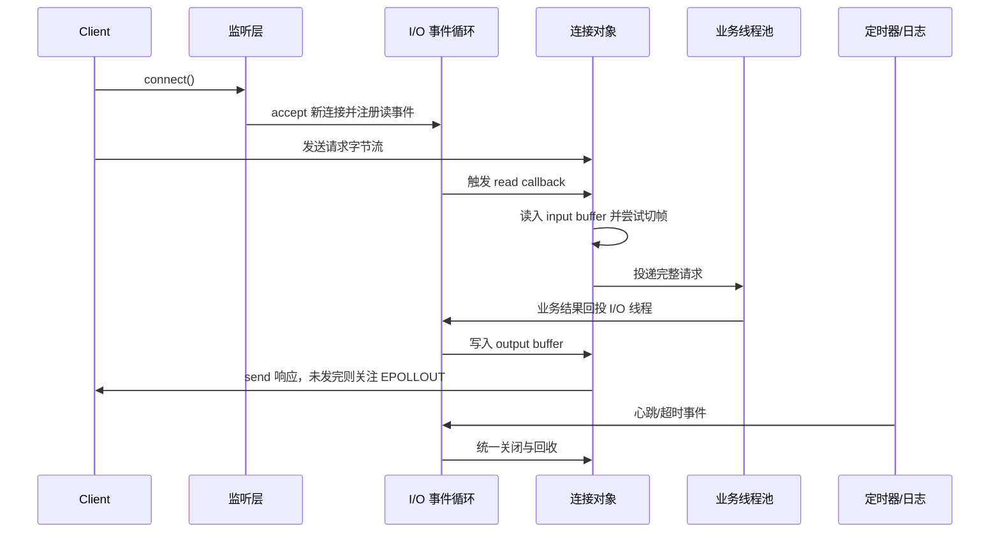

# Linux播放器服务器网络模板设计

> [!abstract]
> 这一页是 `4.2 网络` 专题的开篇设计笔记，目标不是重复 TCP/Winsock 基础，而是从 Linux 高并发服务端视角，梳理播放器服务器网络模板的主干设计：Reactor 事件循环、连接对象生命周期、收发缓冲、跨线程投递、定时器与超时管理。
> 
> 读完本文，应该能回答三个问题：网络线程主线怎么跑；连接对象如何安全管理；网络层怎样与 [[4.1.1 易播服务器线程体系详解|4.1 线程体系]] 协同。

## 专题定位

`4.2 网络` 要解决的是“播放器服务器如何组织网络模块”，不是重新写一遍通用网络编程教材。

| 范围 | 本文处理方式 |
|---|---|
| Linux 服务端网络主线 | 以 Reactor + epoll 为骨架说明 |
| 网络层与线程层关系 | 对接 [[4.1.1 易播服务器线程体系详解]]、[[4.1.5 CThread 与 CThreadPool 实现]] |
| TCP 字节流问题 | 只讲项目模板中需要的缓冲区、粘包拆包、短读短写 |
| Windows/Winsock | 不展开，避免和远控系统网络笔记重复 |
| 播放器业务协议 | 只保留协议边界，具体帧格式后续结合项目代码补充 |

这篇笔记更像一张“网络模块施工图”：先把连接、事件、缓冲、线程、定时器这些主梁搭起来，后续再按源码逐层拆解。

---

## 1. 设计目标与非目标

网络模板的核心目标是让服务端既能管理大量连接，又不把网络 I/O、业务处理、连接生命周期混在一起。

| 目标 | 对应机制 | 说明 |
|---|---|---|
| 高并发连接管理 | 非阻塞 socket + epoll | 一个 I/O 线程可以同时管理多个连接 |
| I/O 与业务解耦 | I/O 线程 + 业务线程池 | 网络线程只做短小操作，耗时业务交给线程池 |
| 粘包拆包处理 | input buffer + 协议解析 | TCP 是字节流，应用层必须自己恢复消息边界 |
| 健壮发送 | output buffer + `EPOLLOUT` 按需注册 | 一次 `send()` 发不完时保留剩余数据 |
| 安全关闭 | 统一 close/error 路径 | 正常关闭、异常关闭、超时关闭走同一套回收规则 |
| 时间事件 | timerfd/定时器队列 | 心跳、空闲超时、延迟任务都纳入事件循环 |
| 跨线程回投 | eventfd/wakeup | 业务线程不能直接操作连接对象，应把结果投回 I/O 线程 |
| 可排障 | 日志线程 + 测试入口 | 让连接建立、读写、关闭、超时都有可观察路径 |

非目标也要提前划清：

- 不讲通用 TCP/IP 入门，前置知识可回看 [[7.6 套接字]]。
- 不复刻远控系统里以单例 `ServerSocket` 为主线的写法。
- 不把播放器业务协议细节塞进网络模板，协议格式应单独沉淀。
- 不让业务线程直接读写连接对象，避免跨线程生命周期混乱。

---

## 2. 网络模板总体架构

这套网络模板可以概括为一句话：

> 以 Reactor 为主线，以 epoll 为事件发现机制，以连接对象保存状态，以缓冲区处理 TCP 字节流，以线程池承接业务，以 eventfd/timerfd 补齐跨线程唤醒和时间事件。

整体结构如下：

![[图片/SVG/4_2_1_1.svg|980]]

这张图里有三条线要分清：

1. **事件线**：`epoll_wait()` 发现监听 fd、连接 fd、wakeup fd、timer fd 的事件。
2. **数据线**：连接上的字节进入 input buffer，解析成请求，再把响应写入 output buffer。
3. **线程线**：I/O 线程只负责网络状态切换，耗时业务进入 [[4.1.5 CThread 与 CThreadPool 实现|CThreadPool]]，处理结果再回投 I/O 线程。

这里的 Reactor 不是某个系统调用，而是一种组织方式：`epoll` 只告诉我们“哪个 fd 就绪”，Reactor 负责把就绪事件分发到正确的对象和回调。这个分层可以结合 [[13.6 Reactor模式与EventLoop]] 理解。

---

## 3. 从 accept 到回包的完整事件流

网络模板最重要的不是某个类名，而是一条请求从进入服务端到返回客户端的路径。



按执行顺序看：

1. **新连接接入**：监听 fd 可读，接收 `conn_fd`，设置非阻塞，再注册读事件。
2. **读事件到来**：循环 `recv()` 到 `EAGAIN`，把字节追加到 input buffer。
3. **协议切分**：从 input buffer 中拆出完整请求；半包继续留在缓冲区。
4. **业务处理**：轻量逻辑可以直接处理，耗时逻辑投递到线程池。
5. **结果回投**：业务线程不直接写 socket，而是把响应投回连接所属 I/O 线程。
6. **发送响应**：先尝试立即 `send()`，没发完的部分进入 output buffer，并按需注册 `EPOLLOUT`。
7. **关闭回收**：正常关闭、异常关闭、超时关闭都走统一路径。

这条链路能跑通，后面再拆类、拆文件才有意义。

---

## 4. 五个关键设计点

### 4.1 连接接入与监听层

监听层只做一件事：尽快把新连接变成网络模板可管理的连接对象。它不应该承担业务解析，也不应该在 accept 回调里做耗时操作。

```cpp
void handleAccept(int listenFd)
{
    while (true) {
        int connFd = ::accept4(listenFd, nullptr, nullptr,
                              SOCK_NONBLOCK | SOCK_CLOEXEC);

        if (connFd >= 0) {
            auto connection = makeConnection(connFd);
            connection->enableReading();
            continue;
        }

        if (errno == EAGAIN || errno == EWOULDBLOCK) {
            break;
        }

        logAcceptError(errno);
        break;
    }
}
```

**关键点**：

- `accept4(..., SOCK_NONBLOCK | SOCK_CLOEXEC)` 让新连接一开始就满足非阻塞和 close-on-exec 约束。
- 循环 accept 是为了把内核 accept 队列中已经就绪的连接尽量取完，尤其适合 ET 模式或高并发接入。
- 监听层只创建连接并注册读事件，后续读写和关闭都交给连接对象。
- backlog、半连接队列、全连接队列的压力可以结合 [[8.13 TCP内核队列与参数调优]] 理解。

### 4.2 连接对象生命周期与 RAII

连接对象不能只是一个裸 `int fd`。它至少要保存连接状态、读写缓冲、事件回调、最后活跃时间，以及关闭过程中的状态标记。

```cpp
class NetworkConnection {
public:
    explicit NetworkConnection(unique_fd fd)
        : fd_(std::move(fd)) {}

    void handleRead();
    void handleWrite();
    void handleClose();

private:
    unique_fd fd_;
    ConnectionState state_{ConnectionState::Connected};
    Buffer input_;
    Buffer output_;
    Timestamp lastActive_;
};
```

**设计要点**：

- `unique_fd` 表示连接 fd 的唯一所有权，析构时负责关闭资源，避免忘记 `close()`。
- `input_` 和 `output_` 分开，读路径和写路径互不干扰。
- `state_` 用来区分 connected、closing、closed 等阶段，避免重复关闭。
- 连接对象的生命周期必须和事件回调绑定清楚，回调触发时不能访问已经释放的对象；这部分可以继续看 [[13.8 连接对象生命周期与RAII]]。

### 4.3 收发缓冲、粘包拆包与健壮发送

TCP 提供的是字节流，不提供“消息边界”。网络模板不能假设一次 `recv()` 就是一条完整请求，也不能假设一次 `send()` 就能发完一个响应。

读路径可以抽象成：先把内核缓冲区中的字节尽量读到 input buffer，再由协议解析层尝试切出完整消息。

```cpp
void NetworkConnection::handleRead()
{
    std::array<char, 4096> chunk{};

    while (true) {
        ssize_t n = ::recv(fd_.get(), chunk.data(), chunk.size(), 0);

        if (n > 0) {
            input_.append(chunk.data(), static_cast<size_t>(n));
            parseMessages(input_);
            continue;
        }

        if (n == 0) {
            handleClose();
            return;
        }

        if (errno == EAGAIN || errno == EWOULDBLOCK) {
            break;
        }

        handleError(errno);
        return;
    }
}
```

**关键点**：

- `std::array<char, 4096>` 只是临时读缓冲，真正跨回调保存数据的是 `input_`。
- `parseMessages(input_)` 只能消费已经完整的消息，半包必须继续留在 input buffer。
- `n == 0` 表示对端有序关闭，应该走统一关闭路径。
- 非阻塞 fd 读到 `EAGAIN` 不是错误，而是“当前已经读完”。非阻塞收发细节见 [[8.12 非阻塞connect与健壮收发]]，粘包拆包见 [[8.9 TCP的粘包和拆包]]。

写路径的重点是 `EPOLLOUT` 不能常驻。大多数 socket 大多数时候都是可写的，如果一直监听写事件，会让事件循环空转。

```cpp
void NetworkConnection::send(std::string_view data)
{
    if (output_.empty()) {
        ssize_t n = ::send(fd_.get(), data.data(), data.size(), MSG_NOSIGNAL);

        if (n >= 0 && static_cast<size_t>(n) == data.size()) {
            return;
        }

        if (n > 0) {
            data.remove_prefix(static_cast<size_t>(n));
        }
    }

    output_.append(data.data(), data.size());
    enableWriting();
}
```

**关键点**：

- output buffer 为空时可以先尝试立即发送，减少一次事件注册。
- 一次没发完时，剩余数据进入 `output_`，然后才打开写事件。
- 写事件回调里继续发送 `output_`，清空后要取消 `EPOLLOUT`。
- input/output buffer 的必要性可以结合 [[8.7 IO缓冲]] 理解。

### 4.4 跨线程任务投递与唤醒

播放器服务器的网络线程不应该执行耗时业务。请求解析完成后，可以把业务任务投递给线程池；业务线程处理完后，不能直接改连接对象，而应该把“写响应”这个动作回投到连接所属 I/O 线程。

```cpp
void NetworkLoop::queueInLoop(std::function<void()> task)
{
    {
        std::lock_guard<std::mutex> lock(mutex_);
        pendingTasks_.push_back(std::move(task));
    }

    wakeup();
}

void NetworkLoop::handleWakeup()
{
    drainWakeupFd();

    std::vector<std::function<void()>> tasks;
    {
        std::lock_guard<std::mutex> lock(mutex_);
        tasks.swap(pendingTasks_);
    }

    for (auto& task : tasks) {
        task();
    }
}
```

**关键点**：

- `pendingTasks_` 是跨线程投递队列，保护它的是互斥锁。
- `wakeup()` 的作用是唤醒阻塞在 `epoll_wait()` 上的 I/O 线程。
- 真正操作连接对象的 `task()` 仍然在 I/O 线程执行，从而避免跨线程直接访问连接状态。
- 这个模型可以和 [[13.7 eventfd、timerfd与跨线程唤醒]] 一起理解；线程池侧则复用 [[4.1.5 CThread 与 CThreadPool 实现]] 的任务执行能力。

### 4.5 定时器、心跳与超时回收

网络模板必须有时间维度。否则连接只在“有 I/O 事件”时才会被处理，空闲连接、半开连接、慢客户端都可能长期占用资源。

```cpp
void NetworkLoop::handleTimer()
{
    drainTimerFd();

    const auto now = Timestamp::now();
    timerQueue_.runExpired(now, [this](ConnectionId id) {
        queueInLoop([this, id] {
            closeIfIdle(id);
        });
    });
}
```

**关键点**：

- timer fd 让时间事件也进入同一个 epoll 事件循环，避免额外线程轮询。
- 超时回收最终仍通过 `queueInLoop()` 回到 I/O 线程，保证关闭路径统一。
- 心跳超时、空闲超时、写超时是不同策略，不应该混成一个“超时”。
- 连接超时与心跳设计可以继续看 [[13.9 定时器、心跳与连接超时]]。

---

## 5. 与 4.1 线程体系的衔接

`4.1 线程` 不是独立于网络模块的知识点，它是网络模板执行业务任务的底座。

| 层次 | 职责 | 对应 4.1 落点 |
|---|---|---|
| I/O 线程 | accept、read、write、close、timer、wakeup | 事件驱动主线，保持短小非阻塞 |
| 业务线程池 | 执行耗时业务、数据库访问、文件处理 | [[4.1.3 传统线程池 vs 易播线程池]]、[[4.1.5 CThread 与 CThreadPool 实现]] |
| 日志线程 | 记录连接建立、异常、关闭、超时、压测指标 | [[4.1.6 Logger 复用、测试入口与面试总结]] |
| 测试入口 | 验证 fd 传递、线程池投递、网络收发链路 | [[4.1.1 易播服务器线程体系详解]] |

最重要的边界是：

```text
I/O 线程负责“连接状态”
业务线程负责“业务计算”
业务结果必须回投 I/O 线程再写回连接
```

这样做的好处是连接对象不会被多个线程同时修改。线程池可以扩展业务吞吐，但不会破坏网络层的所有权和事件顺序。

---

## 6. 可落地的网络模板骨架

后续真正写代码时，可以按下面的模块职责拆解。这里使用的是“职责名”，不是要求必须创建同名独立笔记。

| 模块职责 | 主要保存什么 | 主要负责什么 |
|---|---|---|
| 监听接入层 | `listen_fd`、监听地址、接入回调 | `bind/listen/accept4`，创建新连接 |
| 事件循环层 | epoll fd、活跃事件、待执行任务、wakeup fd | 等待事件、分发回调、执行跨线程任务 |
| 事件注册层 | fd 与事件兴趣集合 | 注册、修改、删除 `EPOLLIN/EPOLLOUT` |
| 连接对象层 | conn fd、状态、input/output buffer、回调 | 读、写、关闭、错误处理 |
| 缓冲区层 | readable/writable 区间 | 累积字节流、切帧、保存待发送数据 |
| 业务分发层 | 任务对象、线程池入口 | 把完整请求交给业务线程池 |
| 时间事件层 | timer fd、超时任务、活跃时间 | 心跳、空闲连接清理、延迟任务 |
| 可观测层 | 日志、测试入口、指标 | 定位连接、事件、缓冲、线程问题 |

推荐的实现顺序是：

```text
先搭事件循环 + epoll
  -> 再搭监听接入 + 连接对象
  -> 再补 input/output buffer 与协议切分
  -> 再接入线程池和 wakeup
  -> 最后补 timer、关闭路径、日志与测试入口
```

这个顺序能保证每一步都可测试，不会一开始就陷入完整网络库的大工程。

---

## 7. 高风险点与测试清单

### 7.1 高风险点

| 风险 | 典型后果 | 处理思路 |
|---|---|---|
| ET 模式只读一次 | 缓冲区残留数据，后续不再触发 | 非阻塞循环读到 `EAGAIN`，见 [[13.4 epoll模型]] |
| `EPOLLOUT` 常驻 | 事件循环空转，CPU 飙高 | 只有 output buffer 非空时才关注写事件 |
| 忽略部分发送 | 响应数据丢失或协议错乱 | 未发完的数据进入 output buffer |
| 忽略半包 | 解析出错误请求 | input buffer 中只消费完整消息 |
| 回调中释放连接 | 后续事件访问悬挂对象 | 统一关闭路径，延迟回收，参考 [[13.8 连接对象生命周期与RAII]] |
| 业务线程直接操作连接 | 数据竞争、关闭顺序混乱 | 通过 `queueInLoop()` 回投 I/O 线程 |
| 超时关闭和正常关闭竞争 | 重复 close、重复删除事件 | 用连接状态机合并关闭路径 |
| accept 慢或 backlog 太小 | 新连接建立失败、排队溢出 | 结合 [[8.13 TCP内核队列与参数调优]] 检查 |

### 7.2 测试清单

- [ ] 单客户端连接、请求、响应、主动关闭。
- [ ] 多客户端同时连接，确认 I/O 线程不被单个连接阻塞。
- [ ] 构造粘包输入，确认协议解析能连续切出多条消息。
- [ ] 构造拆包输入，确认半包会留在 input buffer。
- [ ] 模拟慢客户端，确认 output buffer 和 `EPOLLOUT` 行为正确。
- [ ] 客户端异常断开，确认 close/error 路径统一。
- [ ] 空闲连接超时，确认 timer 触发后能安全回收。
- [ ] 业务线程回包，确认响应最终在 I/O 线程写回。
- [ ] 高并发压测，确认日志能定位 accept、read、write、close、timeout。

压测指标和线上排障可以参考 [[15.2 压测、指标与线上排障]]；如果只是复习多线程并发服务器演进，可以回看 [[12.6 多线程并发服务器案例]] 和 [[12.7 条件变量与线程池]]。

---

## 8. 面试表达与一句话总结

如果面试里被问“你的播放器服务器网络模块怎么设计”，可以这样说：

> 我会把网络层设计成 Reactor 模型：I/O 线程通过 epoll 管理监听 fd、连接 fd、wakeup fd 和 timer fd。新连接 accept 后封装成连接对象，连接对象持有 fd、状态、输入输出缓冲和回调。读事件只负责把数据读入 input buffer，并按协议切出完整请求；耗时业务投递到线程池处理，处理结果通过 eventfd 唤醒 I/O 线程，再写入 output buffer。发送时只在有剩余数据时关注 EPOLLOUT，发送完及时取消。连接关闭、异常和超时统一走关闭路径，并用 RAII 管理 fd 生命周期。

一句话总结：

> 网络模板的核心不是“会用 epoll”，而是把 **事件分发、连接状态、收发缓冲、线程协作、时间事件、资源回收** 组织成一条稳定的服务端主线。

---

## 关联笔记

- [[13.6 Reactor模式与EventLoop]]：网络模板的主干架构，解释 epoll 之后为什么还需要事件循环和回调分发。
- [[13.4 epoll模型]]：I/O 复用底层基础，特别是 LT/ET、`EPOLLOUT`、错误事件和关闭顺序。
- [[13.7 eventfd、timerfd与跨线程唤醒]]：支撑跨线程任务回投和时间事件纳入事件循环。
- [[13.8 连接对象生命周期与RAII]]：支撑连接对象、fd 所有权、回调安全和关闭顺序。
- [[13.9 定时器、心跳与连接超时]]：支撑心跳、空闲连接清理和超时关闭。
- [[8.12 非阻塞connect与健壮收发]]：支撑非阻塞读写、短读短写和输出缓冲策略。
- [[8.9 TCP的粘包和拆包]]：支撑 input buffer 与协议解析边界。
- [[8.7 IO缓冲]]：支撑内核缓冲区、应用层缓冲区和短读短写理解。
- [[8.11 TCP连接关闭与异常状态]]：支撑正常关闭、RST、半关闭和异常路径。
- [[10.1 套接字选项]]：支撑 keepalive、地址复用等 socket 参数设置。
- [[7.6 套接字]]、[[7.7 listen和accept函数]]：作为基础 API 回顾。
- [[4.1.1 易播服务器线程体系详解]]、[[4.1.3 传统线程池 vs 易播线程池]]、[[4.1.5 CThread 与 CThreadPool 实现]]、[[4.1.6 Logger 复用、测试入口与面试总结]]：说明网络层如何接入已有线程基础设施。
- [[聊天室项目技术总结]]：可作为 epoll 服务端和自定义协议落地案例参考，但不要直接套用为播放器服务器架构。

---

## 参考资料

- `epoll(7)`：I/O 复用事件模型。
- `accept(2)`、`accept4(2)`：连接接入与非阻塞 fd 创建。
- `recv(2)`、`send(2)`：非阻塞收发、返回值和错误处理。
- `eventfd(2)`：跨线程唤醒事件循环。
- `timerfd_create(2)`：把时间事件纳入 fd 事件循环。
- `socket(7)`、`tcp(7)`：socket 与 TCP 行为细节。
- 《UNIX Network Programming》：经典网络编程接口与并发服务器模型。
- 《The Linux Programming Interface》：Linux 系统调用、文件描述符、epoll、timerfd/eventfd 细节。
