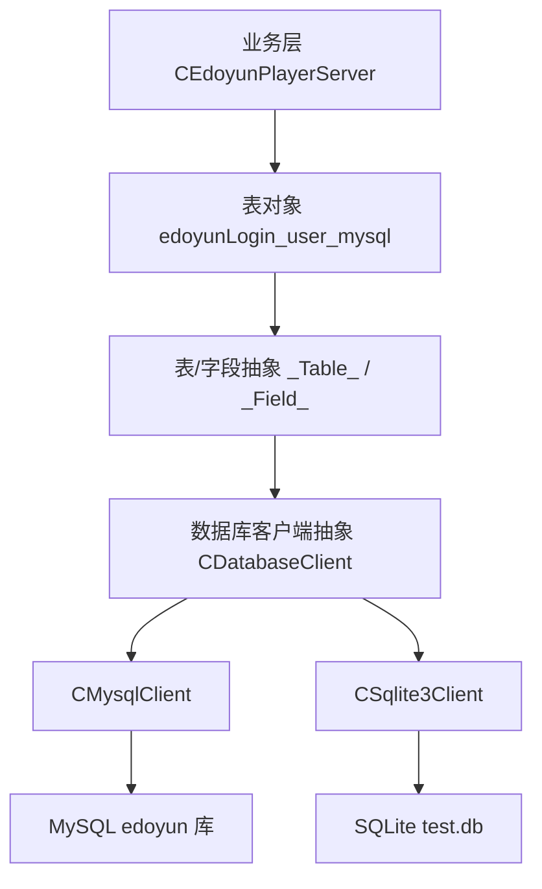
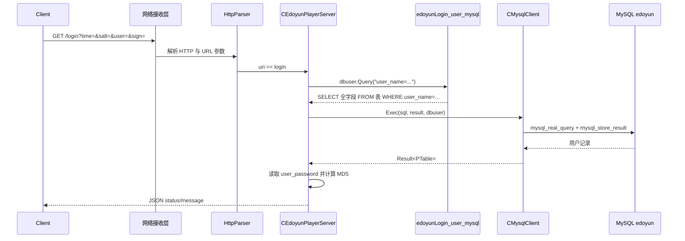
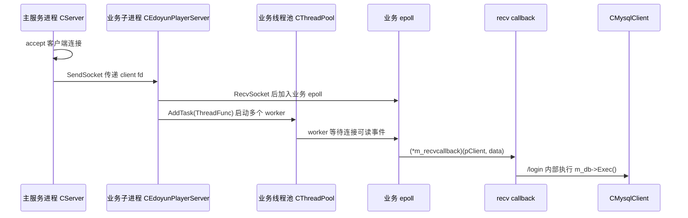

# 易播服务器数据库设计

> [!abstract]
> 这一页是 `4.3 数据库` 专题的总览设计笔记，目标不是重新讲 SQL 基础，而是从易播服务器当前集成测试代码出发，梳理数据库模块如何被抽象、如何生成 SQL、如何接入 MySQL/SQLite，以及登录业务如何通过 `edoyunLogin_user_mysql` 表完成用户校验。
>
> 读完本文，应该能回答三个问题：数据库访问层分成哪几层；表和字段宏如何生成建表与查询 SQL；`/login` 请求为什么要求 `user_name` 只能命中一条记录。

## 专题定位

`4.3 数据库` 要解决的是“播放器服务器如何把业务数据访问接入服务端主线”，不是单独复习数据库语法。

| 范围 | 本文处理方式 |
|---|---|
| 数据库访问抽象 | 以 `CDatabaseClient` 统一连接、执行、事务、关闭接口 |
| 数据库实现 | 对比 `CMysqlClient` 与 `CSqlite3Client` 的执行路径 |
| 表结构声明 | 解释 `DECLARE_TABLE_CLASS` 与字段宏如何生成表对象 |
| 当前业务表 | 以 `edoyunLogin_user_mysql` 为唯一真实业务表展开 |
| 登录业务 | 说明 `/login` 查询用户密码并做 MD5 签名校验的链路 |
| 未落地功能 | 不额外设计视频、播放记录、收藏等源码中尚未出现的表 |

这篇笔记更像 `4.3` 的“数据库施工图”：先看接口层和表模型，再看真实登录表，最后回到网络请求如何调用数据库。

---

## 1. 数据库模块的四层结构

当前代码里的数据库设计可以分成四层：



| 层次 | 关键类/对象 | 职责 |
|---|---|---|
| 业务层 | `CEdoyunPlayerServer` | 在启动时连接数据库、建表；在登录请求中查询用户 |
| 表模型层 | `edoyunLogin_user_mysql` | 用 C++ 类描述 MySQL 表名、字段名、类型和约束 |
| SQL 生成层 | `_Table_`、`_Field_` | 统一生成 `CREATE`、`INSERT`、`DELETE`、`UPDATE`、`SELECT` |
| 执行层 | `CDatabaseClient`、`CMysqlClient`、`CSqlite3Client` | 负责连接数据库、执行 SQL、装载查询结果、事务控制 |

`CDatabaseClient` 是最外层的数据库客户端接口，统一提供 `Connect`、`Exec`、带结果 `Exec`、事务和关闭能力，代码入口见 [D:/c++/八股/250612-易道云-全阶段课程资料/全阶段课程资料汇总/项目阶段/易播/易播服务器/代码/054-易播-集成测试/EPlayerServer/DatabaseHelper.h:14](/D:/c++/八股/250612-易道云-全阶段课程资料/全阶段课程资料汇总/项目阶段/易播/易播服务器/代码/054-易播-集成测试/EPlayerServer/DatabaseHelper.h#L14)。

> [!note]
> 这里的重点不是“项目用了 MySQL 还是 SQLite”，而是先抽出一套 `CDatabaseClient + _Table_ + _Field_` 的通用模型。业务层只拿表对象生成 SQL，再交给数据库客户端执行。

---

## 2. 当前真实业务表：edoyunLogin_user_mysql

集成测试阶段真正接入业务流程的表是 `edoyunLogin_user_mysql`，它在 `EdoyunPlayerServer.h` 中用宏声明，表名直接等于类名，来源见 [D:/c++/八股/250612-易道云-全阶段课程资料/全阶段课程资料汇总/项目阶段/易播/易播服务器/代码/054-易播-集成测试/EPlayerServer/EdoyunPlayerServer.h:10](/D:/c++/八股/250612-易道云-全阶段课程资料/全阶段课程资料汇总/项目阶段/易播/易播服务器/代码/054-易播-集成测试/EPlayerServer/EdoyunPlayerServer.h#L10)。

| 字段 | 类型声明 | 约束/默认值 | 业务含义 |
|---|---|---|---|
| `user_id` | `INTEGER` | `NOT NULL`、`PRIMARY KEY`、`AUTO_INCREMENT` | 用户主键 |
| `user_qq` | `VARCHAR(15)` | `NOT NULL` | QQ 号 |
| `user_phone` | `VARCHAR(11)` | 默认 `'18888888888'` | 手机号 |
| `user_name` | `TEXT` | `NOT NULL` | 登录用户名/姓名，当前登录查询使用它 |
| `user_nick` | `TEXT` | `NOT NULL` | 昵称 |
| `user_wechat` | `TEXT` | 默认 `NULL` | 微信信息 |
| `user_wechat_id` | `TEXT` | 默认 `NULL` | 微信 ID |
| `user_address` | `TEXT` | 默认空字符串 | 地址 |
| `user_province` | `TEXT` | 默认空字符串 | 省份 |
| `user_country` | `TEXT` | 默认空字符串 | 国家 |
| `user_age` | `INTEGER` | 默认 `18`，声明了 `CHECK` | 年龄 |
| `user_male` | `BOOL` | 默认 `1` | 性别标记 |
| `user_flags` | `TEXT` | 默认 `0` | 用户标志位 |
| `user_experience` | `REAL` | 默认 `0.0` | 经验值 |
| `user_level` | `INTEGER` | 默认 `0`，声明了 `CHECK` | 用户等级 |
| `user_class_priority` | `TEXT` | 默认空字符串 | 班级/权限优先级 |
| `user_time_per_viewer` | `REAL` | 默认空 | 单用户观看时长指标 |
| `user_career` | `TEXT` | 无约束 | 职业 |
| `user_password` | `TEXT` | `NOT NULL` | 登录校验使用的密码 |
| `user_birthday` | `DATETIME` | 无约束 | 生日 |
| `user_describe` | `TEXT` | 无约束 | 用户描述 |
| `user_education` | `TEXT` | 无约束 | 教育背景 |
| `user_register_time` | `DATETIME` | 默认 `LOCALTIME()` | 注册时间 |

> [!warning]
> 当前代码按 `user_name` 查询登录用户，但表定义里 `user_name` 只有 `NOT NULL`，没有 `UNIQUE`。同时业务代码又要求查询结果必须正好等于 1 条。因此数据库数据层面必须保证 `user_name` 唯一，否则会走“more than one”错误分支。

---

## 3. 表对象如何生成 SQL

表模型的核心在 `_Table_` 和 `_Field_`：

| 抽象 | 关键成员 | 作用 |
|---|---|---|
| `_Table_` | `Database`、`Name`、`FieldDefine`、`Fields` | 保存表名、字段顺序和字段映射 |
| `_Field_` | `Name`、`Type`、`Size`、`Attr`、`Default`、`Value` | 保存字段定义、约束、默认值和运行时值 |
| `SQL_INSERT` | 字段条件标记 | 表示该字段参与插入 |
| `SQL_MODIFY` | 字段条件标记 | 表示该字段参与更新 |
| `SQL_CONDITION` | 字段条件标记 | 表示该字段参与查询/删除条件 |

抽象接口定义见 `_Table_` 和字段属性枚举：[D:/c++/八股/250612-易道云-全阶段课程资料/全阶段课程资料汇总/项目阶段/易播/易播服务器/代码/054-易播-集成测试/EPlayerServer/DatabaseHelper.h:48](/D:/c++/八股/250612-易道云-全阶段课程资料/全阶段课程资料汇总/项目阶段/易播/易播服务器/代码/054-易播-集成测试/EPlayerServer/DatabaseHelper.h#L48)、[D:/c++/八股/250612-易道云-全阶段课程资料/全阶段课程资料汇总/项目阶段/易播/易播服务器/代码/054-易播-集成测试/EPlayerServer/DatabaseHelper.h:83](/D:/c++/八股/250612-易道云-全阶段课程资料/全阶段课程资料汇总/项目阶段/易播/易播服务器/代码/054-易播-集成测试/EPlayerServer/DatabaseHelper.h#L83)。

MySQL 表的 `Create()` 会按字段顺序拼接列定义，并把 `PRIMARY_KEY` 与 `UNIQUE` 追加成额外约束，入口见 [D:/c++/八股/250612-易道云-全阶段课程资料/全阶段课程资料汇总/项目阶段/易播/易播服务器/代码/054-易播-集成测试/EPlayerServer/MysqlClient.cpp:129](/D:/c++/八股/250612-易道云-全阶段课程资料/全阶段课程资料汇总/项目阶段/易播/易播服务器/代码/054-易播-集成测试/EPlayerServer/MysqlClient.cpp#L129)。

当前表启动时大致生成这样的建表语义：

```sql
CREATE TABLE IF NOT EXISTS `edoyunLogin_user_mysql` (
  `user_id` INTEGER NOT NULL AUTO_INCREMENT,
  PRIMARY KEY (`user_id`),
  `user_qq` VARCHAR(15) NOT NULL,
  `user_phone` VARCHAR(11) NULL DEFAULT "'18888888888'",
  `user_name` TEXT NOT NULL,
  `user_nick` TEXT NOT NULL,
  ...
  `user_password` TEXT NOT NULL,
  `user_register_time` DATETIME NULL DEFAULT "LOCALTIME()"
);
```

这里有一个实现细节要注意：`_mysql_field_::Create()` 对 `TEXT`、`BLOB`、`GEOMETRY`、`JSON` 不生成默认值，因为 MySQL 对这些类型的默认值支持有限。

---

## 4. MySQL 与 SQLite 的分工

代码里同时保留了 MySQL 和 SQLite 两套实现：

| 实现 | 文件 | 当前定位 |
|---|---|---|
| `CMysqlClient` | `MysqlClient.h/.cpp` | 当前真实服务端业务使用，连接远端 MySQL `edoyun` 库 |
| `CSqlite3Client` | `Sqlite3Client.h/.cpp` | 更偏本地测试和 SQL 生成验证，`sql_test()` 使用 `test.db` |
| `CDatabaseClient` | `DatabaseHelper.h` | 让业务层可以用统一接口执行 SQL |

`CMysqlClient::Exec(sql, result, table)` 执行查询后，通过 `mysql_store_result()` 取结果，再按字段顺序调用 `LoadFromStr()` 填回表对象。SQLite 版本则通过 `sqlite3_exec()` 回调按列名填充字段。

> [!tip]
> 从设计意图看，`CDatabaseClient` 是数据库适配层，`_mysql_table_` / `_sqlite3_table_` 是 SQL 方言适配层。这样业务层既不用直接写 `mysql_real_query()`，也不用手动解析 `MYSQL_ROW`。

---

## 5. 服务启动时的数据库初始化

服务器业务入口 `BusinessProcess()` 中会完成数据库初始化，关键顺序是：

```text
new CMysqlClient
  -> 设置 host/user/password/port/db
  -> Connect(args)
  -> 创建 edoyunLogin_user_mysql 表对象
  -> Exec(user.Create()) 建表
  -> 注册网络连接/接收回调
  -> 启动 epoll 和线程池
```

源码入口见 [D:/c++/八股/250612-易道云-全阶段课程资料/全阶段课程资料汇总/项目阶段/易播/易播服务器/代码/054-易播-集成测试/EPlayerServer/EdoyunPlayerServer.h:71](/D:/c++/八股/250612-易道云-全阶段课程资料/全阶段课程资料汇总/项目阶段/易播/易播服务器/代码/054-易播-集成测试/EPlayerServer/EdoyunPlayerServer.h#L71)。

| 配置项 | 当前值 | 说明 |
|---|---|---|
| `host` | `192.168.1.100` | MySQL 服务器地址 |
| `user` | `root` | 登录用户 |
| `password` | `123456` | 登录密码 |
| `port` | `3306` | MySQL 默认端口 |
| `db` | `edoyun` | 业务数据库名 |

启动时执行 `user.Create()` 的好处是测试环境可以自动补齐表结构；代价是表结构变更缺少迁移版本管理，后续如果字段变化，需要单独处理兼容策略。

---

## 6. /login 请求的数据库链路

`/login` 当前只支持 `GET`，请求解析后取出 `time`、`salt`、`user`、`sign` 四个参数。数据库链路如下：



对应代码路径是 [D:/c++/八股/250612-易道云-全阶段课程资料/全阶段课程资料汇总/项目阶段/易播/易播服务器/代码/054-易播-集成测试/EPlayerServer/EdoyunPlayerServer.h:164](/D:/c++/八股/250612-易道云-全阶段课程资料/全阶段课程资料汇总/项目阶段/易播/易播服务器/代码/054-易播-集成测试/EPlayerServer/EdoyunPlayerServer.h#L164)。查询语句由 `dbuser.Query("user_name=\"" + user + "\"")` 生成，来源见 [D:/c++/八股/250612-易道云-全阶段课程资料/全阶段课程资料汇总/项目阶段/易播/易播服务器/代码/054-易播-集成测试/EPlayerServer/EdoyunPlayerServer.h:174](/D:/c++/八股/250612-易道云-全阶段课程资料/全阶段课程资料汇总/项目阶段/易播/易播服务器/代码/054-易播-集成测试/EPlayerServer/EdoyunPlayerServer.h#L174)。

查询结果处理有三个判断：

| 判断 | 返回码 | 含义 |
|---|---:|---|
| SQL 执行失败 | `-3` | 数据库执行层失败 |
| `result.size() == 0` | `-4` | 用户不存在 |
| `result.size() != 1` | `-5` | 命中多条用户记录 |
| MD5 不匹配 | `-6` | 用户存在但签名校验失败 |
| MD5 匹配 | `0` | 登录成功 |

密码取值与 MD5 计算见 [D:/c++/八股/250612-易道云-全阶段课程资料/全阶段课程资料汇总/项目阶段/易播/易播服务器/代码/054-易播-集成测试/EPlayerServer/EdoyunPlayerServer.h:188](/D:/c++/八股/250612-易道云-全阶段课程资料/全阶段课程资料汇总/项目阶段/易播/易播服务器/代码/054-易播-集成测试/EPlayerServer/EdoyunPlayerServer.h#L188)。

---

## 7. 数据库设计风险点

| 风险 | 当前表现 | 影响 | 改进方向 |
|---|---|---|---|
| `user_name` 未唯一 | 表定义只有 `NOT NULL` | 多个同名用户会触发 `result.size() != 1` | 数据层增加唯一约束，或登录改用真正唯一账号字段 |
| SQL 条件字符串直接拼接 | `user_name="` + user + `"` | 有 SQL 注入风险 | 使用参数化查询或最少做转义 |
| 启动时自动建表 | `Exec(user.Create())` | 方便测试，但没有迁移版本 | 后续引入 schema 版本或迁移脚本 |
| 明文/弱密码处理 | 直接取 `user_password` 参与 MD5 | 不适合生产安全要求 | 存储加盐哈希，避免服务端硬编码固定密钥 |
| 查询返回全字段 | `Query()` 默认选择所有字段 | 登录只需要密码却取全表字段 | 支持按需选择列 |
| MySQL 连接配置硬编码 | host、root、密码写在代码里 | 环境切换和安全性差 | 改为配置文件或环境变量 |
| 结果装载依赖字段顺序 | MySQL 查询按 `FieldDefine` 顺序填值 | SQL 改列顺序时易错 | 按列名映射或固定只由表对象生成查询 |

当前阶段是教学集成测试，所以这些风险不一定都要立刻改代码，但它们是理解数据库设计边界时必须能说清楚的点。

---

## 8. 与 4.1 / 4.2 的衔接

数据库不是独立模块，它接在网络和线程体系之后：

| 上游专题 | 与数据库的关系 |
|---|---|
| [[4.1.1 易播服务器线程体系详解]] | 业务服务运行在线程/进程基础设施之上，日志和线程池为数据库访问提供运行环境 |
| [[4.1.5 CThread 与 CThreadPool 实现]] | 后续耗时数据库访问适合放入业务线程池，避免阻塞 I/O 主线 |
| [[4.2.1 Linux播放器服务器网络模板设计]] | 网络层解析请求后，把登录业务交给 `CEdoyunPlayerServer`，最终调用数据库 |

一句话串起来就是：

```text
网络层收到 /login
  -> 业务层解析参数
  -> 数据库层按 user_name 查询用户
  -> 密码参与 MD5 校验
  -> 网络层返回 JSON 响应
```

---

## 9. 面试表达与一句话总结

如果面试里被问“易播服务器数据库模块怎么设计”，可以这样说：

> 这个项目没有让业务代码直接调用 MySQL API，而是先抽了 `CDatabaseClient` 作为统一数据库客户端接口，再用 `_Table_` 和 `_Field_` 描述表结构和字段属性。MySQL 和 SQLite 各自实现连接、执行和结果装载，业务层通过表对象生成 SQL。当前真实业务表是 `edoyunLogin_user_mysql`，服务启动时连接 `edoyun` 库并自动建表；登录请求会按 `user_name` 查询用户，要求结果正好一条，再读取 `user_password` 与 `time`、固定密钥、`salt` 拼接后计算 MD5，和客户端传来的 `sign` 比较。

一句话总结：

> 易播数据库模块的核心不是“会执行 SQL”，而是把 **数据库连接、表结构声明、SQL 生成、结果映射、登录校验** 串成一条可复用的业务访问链路。

---

## 关联笔记

- [[4.1.1 易播服务器线程体系详解]]：说明数据库业务在整体进程/线程结构中的位置。
- [[4.1.5 CThread 与 CThreadPool 实现]]：说明数据库访问后续如何与业务线程池结合。
- [[4.2.1 Linux播放器服务器网络模板设计]]：说明 `/login` 请求如何从网络层进入业务层。
- [[13.6 Reactor模式与EventLoop]]：理解网络事件进入业务处理的主线。
- [[12.7 条件变量与线程池]]：复习耗时数据库访问为什么不应阻塞 I/O 线程。

---

## 源码定位

- 表声明入口：[D:/c++/八股/250612-易道云-全阶段课程资料/全阶段课程资料汇总/项目阶段/易播/易播服务器/代码/054-易播-集成测试/EPlayerServer/EdoyunPlayerServer.h:10](/D:/c++/八股/250612-易道云-全阶段课程资料/全阶段课程资料汇总/项目阶段/易播/易播服务器/代码/054-易播-集成测试/EPlayerServer/EdoyunPlayerServer.h#L10)
- MySQL 连接与启动建表：[D:/c++/八股/250612-易道云-全阶段课程资料/全阶段课程资料汇总/项目阶段/易播/易播服务器/代码/054-易播-集成测试/EPlayerServer/EdoyunPlayerServer.h:71](/D:/c++/八股/250612-易道云-全阶段课程资料/全阶段课程资料汇总/项目阶段/易播/易播服务器/代码/054-易播-集成测试/EPlayerServer/EdoyunPlayerServer.h#L71)
- 登录查询与结果判断：[D:/c++/八股/250612-易道云-全阶段课程资料/全阶段课程资料汇总/项目阶段/易播/易播服务器/代码/054-易播-集成测试/EPlayerServer/EdoyunPlayerServer.h:174](/D:/c++/八股/250612-易道云-全阶段课程资料/全阶段课程资料汇总/项目阶段/易播/易播服务器/代码/054-易播-集成测试/EPlayerServer/EdoyunPlayerServer.h#L174)
- 数据库客户端抽象：[D:/c++/八股/250612-易道云-全阶段课程资料/全阶段课程资料汇总/项目阶段/易播/易播服务器/代码/054-易播-集成测试/EPlayerServer/DatabaseHelper.h:14](/D:/c++/八股/250612-易道云-全阶段课程资料/全阶段课程资料汇总/项目阶段/易播/易播服务器/代码/054-易播-集成测试/EPlayerServer/DatabaseHelper.h#L14)
- 表和字段抽象：[D:/c++/八股/250612-易道云-全阶段课程资料/全阶段课程资料汇总/项目阶段/易播/易播服务器/代码/054-易播-集成测试/EPlayerServer/DatabaseHelper.h:48](/D:/c++/八股/250612-易道云-全阶段课程资料/全阶段课程资料汇总/项目阶段/易播/易播服务器/代码/054-易播-集成测试/EPlayerServer/DatabaseHelper.h#L48)
- MySQL 建表 SQL 生成：[D:/c++/八股/250612-易道云-全阶段课程资料/全阶段课程资料汇总/项目阶段/易播/易播服务器/代码/054-易播-集成测试/EPlayerServer/MysqlClient.cpp:129](/D:/c++/八股/250612-易道云-全阶段课程资料/全阶段课程资料汇总/项目阶段/易播/易播服务器/代码/054-易播-集成测试/EPlayerServer/MysqlClient.cpp#L129)
- MySQL 查询 SQL 生成：[D:/c++/八股/250612-易道云-全阶段课程资料/全阶段课程资料汇总/项目阶段/易播/易播服务器/代码/054-易播-集成测试/EPlayerServer/MysqlClient.cpp:224](/D:/c++/八股/250612-易道云-全阶段课程资料/全阶段课程资料汇总/项目阶段/易播/易播服务器/代码/054-易播-集成测试/EPlayerServer/MysqlClient.cpp#L224)

---

## 10. 补充：数据库与并发框架边界

前面几节只写了“数据库访问层”的静态结构，但当前集成测试代码并不是单线程直连数据库。更准确地说：**数据库模块本身没有数据库池，但数据库调用运行在多进程、多线程、epoll 回调框架里**。

### 10.1 当前没有数据库连接池

当前代码没有实现常见意义上的数据库连接池。

| 连接池特征 | 当前代码是否具备 | 说明 |
|---|---|---|
| 多个数据库连接对象 | 否 | `CEdoyunPlayerServer` 只持有一个 `CDatabaseClient* m_db` |
| 空闲/忙碌连接队列 | 否 | 没有 `queue/list/vector<CMysqlClient*>` 管理连接 |
| 获取/归还连接接口 | 否 | 没有 `Acquire/Release`、RAII connection guard 之类接口 |
| 互斥锁/条件变量保护连接池 | 否 | 数据库客户端层没有池级同步 |
| 每个 worker 独立连接 | 否 | 所有登录查询最终都走同一个 `m_db` 指针 |

也就是说，这里更像是“单连接数据库客户端 + 表对象 SQL 生成器”，不是数据库池。`m_db` 的定义在 [D:/c++/八股/250612-易道云-全阶段课程资料/全阶段课程资料汇总/项目阶段/易播/易播服务器/代码/054-易播-集成测试/EPlayerServer/EdoyunPlayerServer.h:271](/D:/c++/八股/250612-易道云-全阶段课程资料/全阶段课程资料汇总/项目阶段/易播/易播服务器/代码/054-易播-集成测试/EPlayerServer/EdoyunPlayerServer.h#L271)，初始化为 `new CMysqlClient()` 的位置在 [D:/c++/八股/250612-易道云-全阶段课程资料/全阶段课程资料汇总/项目阶段/易播/易播服务器/代码/054-易播-集成测试/EPlayerServer/EdoyunPlayerServer.h:71](/D:/c++/八股/250612-易道云-全阶段课程资料/全阶段课程资料汇总/项目阶段/易播/易播服务器/代码/054-易播-集成测试/EPlayerServer/EdoyunPlayerServer.h#L71)。

> [!warning]
> 因为业务线程池会启动多个 worker，如果多个连接同时触发 `/login`，这些 worker 可能并发调用同一个 `m_db->Exec()`。当前 `CMysqlClient` 内部没有互斥保护，也没有每线程独立连接，这一点是数据库并发访问的主要风险。

### 10.2 多线程回调是服务端框架的一部分

多线程回调不是数据库层直接实现的，而是由 `CServer`、`CBusiness`、`CThreadPool` 共同组织。



关键点有三层：

| 层次 | 代码位置 | 作用 |
|---|---|---|
| 网络接入线程池 | `CServer::Init()` 启动 `m_pool.Start(2)` 并投递 `CServer::ThreadFunc` | 主服务进程用线程池 accept 新连接 |
| 业务进程线程池 | `CEdoyunPlayerServer::BusinessProcess()` 启动 `m_pool.Start(m_count)` 并投递业务 `ThreadFunc` | 业务子进程用多个 worker 处理客户端读事件 |
| 回调封装 | `setConnectedCallback` / `setRecvCallback` | 把成员函数绑定成 `CFunctionBase`，在 epoll 事件中回调 |

回调封装见 [D:/c++/八股/250612-易道云-全阶段课程资料/全阶段课程资料汇总/项目阶段/易播/易播服务器/代码/054-易播-集成测试/EPlayerServer/CServer.h:35](/D:/c++/八股/250612-易道云-全阶段课程资料/全阶段课程资料汇总/项目阶段/易播/易播服务器/代码/054-易播-集成测试/EPlayerServer/CServer.h#L35)，业务线程中触发接收回调的位置见 [D:/c++/八股/250612-易道云-全阶段课程资料/全阶段课程资料汇总/项目阶段/易播/易播服务器/代码/054-易播-集成测试/EPlayerServer/EdoyunPlayerServer.h:256](/D:/c++/八股/250612-易道云-全阶段课程资料/全阶段课程资料汇总/项目阶段/易播/易播服务器/代码/054-易播-集成测试/EPlayerServer/EdoyunPlayerServer.h#L256)。

### 10.3 触发机制主要是 epoll 和本地 socket，不是数据库信号

这里容易混淆：登录查询不是由 Unix signal 触发的，而是由网络 fd 的 `EPOLLIN` 事件触发。

```text
客户端请求到达
  -> epoll_wait 返回 EPOLLIN
  -> worker 调用 pClient->Recv(data)
  -> 触发 m_recvcallback
  -> Received() -> HttpParser()
  -> /login 查询数据库
```

主服务进程和业务子进程之间通过 `socketpair + sendmsg(SCM_RIGHTS)` 传递客户端 socket fd。`CProcess::CreateSubProcess()` 建立 socketpair 和 fork，见 [D:/c++/八股/250612-易道云-全阶段课程资料/全阶段课程资料汇总/项目阶段/易播/易播服务器/代码/054-易播-集成测试/EPlayerServer/Process.h:30](/D:/c++/八股/250612-易道云-全阶段课程资料/全阶段课程资料汇总/项目阶段/易播/易播服务器/代码/054-易播-集成测试/EPlayerServer/Process.h#L30)；传递客户端 socket 的 `SendSocket/RecvSocket` 见 [D:/c++/八股/250612-易道云-全阶段课程资料/全阶段课程资料汇总/项目阶段/易播/易播服务器/代码/054-易播-集成测试/EPlayerServer/Process.h:108](/D:/c++/八股/250612-易道云-全阶段课程资料/全阶段课程资料汇总/项目阶段/易播/易播服务器/代码/054-易播-集成测试/EPlayerServer/Process.h#L108)。

### 10.4 信号用于线程控制，不用于数据库调度

代码里确实有信号，但用途是线程暂停/退出控制：

| 信号 | 触发位置 | 用途 |
|---|---|---|
| `SIGUSR1` | `CThread::Pause()` | 让目标线程进入暂停轮询 |
| `SIGUSR2` | `CThread::Stop()` 超时后 | 强制目标线程 `pthread_exit()` |
| `SIGCHLD` | `CProcess::SwitchDeamon()` | 守护进程模式下忽略子进程退出信号 |

线程入口注册 `SIGUSR1/SIGUSR2` 的位置见 [D:/c++/八股/250612-易道云-全阶段课程资料/全阶段课程资料汇总/项目阶段/易播/易播服务器/代码/054-易播-集成测试/EPlayerServer/Thread.h:87](/D:/c++/八股/250612-易道云-全阶段课程资料/全阶段课程资料汇总/项目阶段/易播/易播服务器/代码/054-易播-集成测试/EPlayerServer/Thread.h#L87)，信号处理函数见 [D:/c++/八股/250612-易道云-全阶段课程资料/全阶段课程资料汇总/项目阶段/易播/易播服务器/代码/054-易播-集成测试/EPlayerServer/Thread.h:107](/D:/c++/八股/250612-易道云-全阶段课程资料/全阶段课程资料汇总/项目阶段/易播/易播服务器/代码/054-易播-集成测试/EPlayerServer/Thread.h#L107)。

> [!important]
> 因此这一阶段应该表述为：数据库本身是单连接抽象；数据库调用被放进业务线程回调链路；触发源是 epoll 网络事件；线程控制使用 `SIGUSR1/SIGUSR2`，但不是数据库请求调度机制。

### 10.5 更完整的学习重点

如果把 `4.3 数据库` 放进整个服务端架构里，学习重点应该扩展为：

| 主题 | 当前是否落地 | 应该怎么理解 |
|---|---|---|
| 数据库表设计 | 已落地 | `edoyunLogin_user_mysql` 登录用户表 |
| SQL 生成器 | 已落地 | `_Table_/_Field_` 根据字段声明生成 SQL |
| MySQL/SQLite 适配 | 已落地 | 两套客户端实现同一个 `CDatabaseClient` 接口 |
| 数据库连接池 | 未落地 | 当前只有单连接，后续可扩展为每线程连接或连接池 |
| 多线程数据库访问 | 半落地 | 线程池会并发触发业务回调，但数据库客户端未做并发保护 |
| 回调链路 | 已落地 | epoll 可读事件触发 `m_recvcallback`，再进入登录查询 |
| 信号控制 | 已落地于线程层 | `SIGUSR1/SIGUSR2` 控制线程暂停/退出，不直接触发数据库 |
| 进程间 fd 传递 | 已落地 | 主服务进程 accept，业务子进程处理客户端请求 |

一句话修正：

> 这个阶段的数据库内容不只是“一张用户表 + 一个 MySQL client”，而是“单连接数据库访问层如何被挂进多进程、多线程、epoll 回调框架”。真正缺失的是数据库连接池和数据库并发保护，这正好是后续可以继续优化的点。
