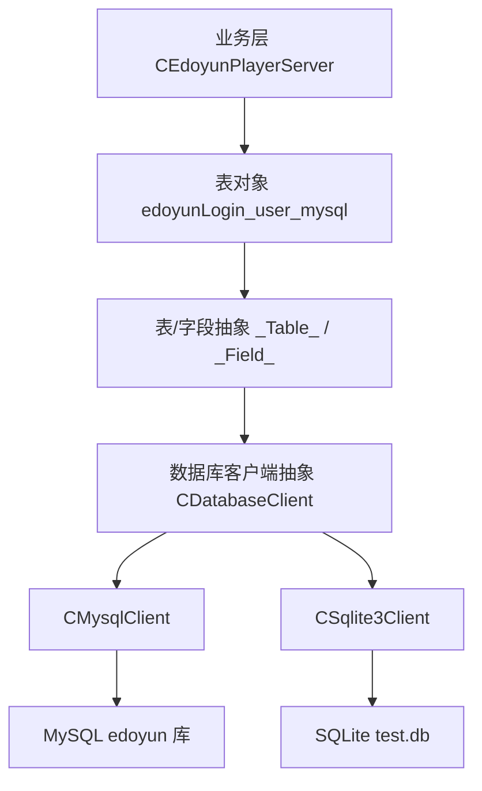
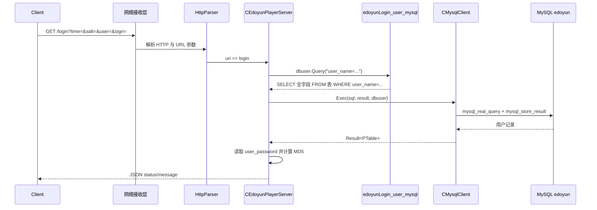
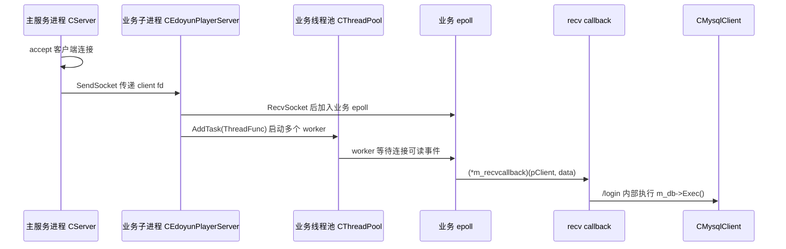

# 易播服务器数据库设计

> [!abstract]
> 本文是 `4.3 数据库` 专题的总览设计笔记，目标不是重新讲 SQL 基础，而是从易播服务器当前集成测试代码出发，梳理数据库模块的抽象方式、SQL 生成机制、MySQL/SQLite 接入方式，以及登录业务如何通过 `edoyunLogin_user_mysql` 表完成用户校验。
>
> 读完本文，应该能回答三个问题：数据库访问层分成哪几层；表和字段宏如何生成建表与查询 SQL；`/login` 请求为什么要求 `user_name` 只能命中一条记录。

## 专题定位

`4.3 数据库` 要解决的是”播放器服务器如何把业务数据访问接入服务端主流程”，不是单独复习数据库语法。

| 范围 | 本文处理方式 |
|---|---|
| 数据库访问抽象 | 以 `CDatabaseClient` 统一连接、执行、事务、关闭接口 |
| 数据库实现 | 对比 `CMysqlClient` 与 `CSqlite3Client` 的执行路径 |
| 表结构声明 | 解释 `DECLARE_TABLE_CLASS` 与字段宏如何生成表对象 |
| 当前业务表 | 以 `edoyunLogin_user_mysql` 为唯一真实业务表展开 |
| 登录业务 | 说明 `/login` 查询用户密码并做 MD5 签名校验的链路 |
| 未落地功能 | 不额外设计视频、播放记录、收藏等源码中尚未出现的表 |

本文更像是 `4.3` 的”数据库施工图”：先看接口层和表模型，再看真实登录表，最后回到网络请求如何调用数据库。

---

## 1. 数据库模块的四层结构

当前代码里的数据库设计可以分成四层：



| 层次 | 关键类/对象 | 职责 |
|---|---|---|
| 业务层 | `CEdoyunPlayerServer` | 在启动时连接数据库、建表；在登录请求中查询用户 |
| 表模型层 | `edoyunLogin_user_mysql` | 用 C++ 类描述 MySQL 表名、字段名、类型和约束 |
| SQL 生成层 | `_Table_`、`_Field_` | 统一生成 `CREATE`、`INSERT`、`DELETE`、`UPDATE`、`SELECT` |
| 执行层 | `CDatabaseClient`、`CMysqlClient`、`CSqlite3Client` | 负责连接数据库、执行 SQL、装载查询结果、事务控制 |

`CDatabaseClient` 是最外层的数据库客户端接口，统一提供 `Connect`、`Exec`、带结果 `Exec`、事务和关闭能力，核心源码如下：

```cpp
class CDatabaseClient
{
public:
    CDatabaseClient(const CDatabaseClient&) = delete;
    CDatabaseClient& operator=(const CDatabaseClient&) = delete;
public:
    CDatabaseClient() {}
    virtual ~CDatabaseClient() {}
public:
    virtual int Connect(const KeyValue& args) = 0;
    virtual int Exec(const Buffer& sql) = 0;
    virtual int Exec(const Buffer& sql, Result& result, const _Table_& table) = 0;
    virtual int StartTransaction() = 0;
    virtual int CommitTransaction() = 0;
    virtual int RollbackTransaction() = 0;
    virtual int Close() = 0;
    virtual bool IsConnected() = 0;
};
```

> [!note]
> 这里的重点不是”项目用了 MySQL 还是 SQLite”，而是先提炼出一套 `CDatabaseClient + _Table_ + _Field_` 的通用模型。业务层只拿表对象生成 SQL，再交给数据库客户端执行。

---

## 2. 当前真实业务表：edoyunLogin_user_mysql

集成测试阶段真正接入业务流程的表是 `edoyunLogin_user_mysql`，它在 `EdoyunPlayerServer.h` 中用宏声明，表名直接等于类名：

```cpp
DECLARE_TABLE_CLASS(edoyunLogin_user_mysql, _mysql_table_)
DECLARE_MYSQL_FIELD(TYPE_INT, user_id, NOT_NULL | PRIMARY_KEY | AUTOINCREMENT, "INTEGER", "", "", "")
DECLARE_MYSQL_FIELD(TYPE_VARCHAR, user_qq, NOT_NULL, "VARCHAR", "(15)", "", "")
DECLARE_MYSQL_FIELD(TYPE_VARCHAR, user_phone, DEFAULT, "VARCHAR", "(11)", "'18888888888'", "")
DECLARE_MYSQL_FIELD(TYPE_TEXT, user_name, NOT_NULL, "TEXT", "", "", "")
DECLARE_MYSQL_FIELD(TYPE_TEXT, user_nick, NOT_NULL, "TEXT", "", "", "")
DECLARE_MYSQL_FIELD(TYPE_TEXT, user_wechat, DEFAULT, "TEXT", "", "NULL", "")
DECLARE_MYSQL_FIELD(TYPE_TEXT, user_wechat_id, DEFAULT, "TEXT", "", "NULL", "")
DECLARE_MYSQL_FIELD(TYPE_TEXT, user_address, DEFAULT, "TEXT", "", "", "")
DECLARE_MYSQL_FIELD(TYPE_TEXT, user_province, DEFAULT, "TEXT", "", "", "")
DECLARE_MYSQL_FIELD(TYPE_TEXT, user_country, DEFAULT, "TEXT", "", "", "")
DECLARE_MYSQL_FIELD(TYPE_INT, user_age, DEFAULT | CHECK, "INTEGER", "", "18", "")
DECLARE_MYSQL_FIELD(TYPE_INT, user_male, DEFAULT, "BOOL", "", "1", "")
DECLARE_MYSQL_FIELD(TYPE_TEXT, user_flags, DEFAULT, "TEXT", "", "0", "")
DECLARE_MYSQL_FIELD(TYPE_REAL, user_experience, DEFAULT, "REAL", "", "0.0", "")
DECLARE_MYSQL_FIELD(TYPE_INT, user_level, DEFAULT | CHECK, "INTEGER", "", "0", "")
DECLARE_MYSQL_FIELD(TYPE_TEXT, user_class_priority, DEFAULT, "TEXT", "", "", "")
DECLARE_MYSQL_FIELD(TYPE_REAL, user_time_per_viewer, DEFAULT, "REAL", "", "", "")
DECLARE_MYSQL_FIELD(TYPE_TEXT, user_career, NONE, "TEXT", "", "", "")
DECLARE_MYSQL_FIELD(TYPE_TEXT, user_password, NOT_NULL, "TEXT", "", "", "")
DECLARE_MYSQL_FIELD(TYPE_INT, user_birthday, NONE, "DATETIME", "", "", "")
DECLARE_MYSQL_FIELD(TYPE_TEXT, user_describe, NONE, "TEXT", "", "", "")
DECLARE_MYSQL_FIELD(TYPE_TEXT, user_education, NONE, "TEXT", "", "", "")
DECLARE_MYSQL_FIELD(TYPE_INT, user_register_time, DEFAULT, "DATETIME", "", "LOCALTIME()", "")
DECLARE_TABLE_CLASS_EDN()
```

| 字段                     | 类型声明          | 约束/默认值                                    | 业务含义               |
| ---------------------- | ------------- | ----------------------------------------- | ------------------ |
| `user_id`              | `INTEGER`     | `NOT NULL`、`PRIMARY KEY`、`AUTO_INCREMENT` | 用户主键               |
| `user_qq`              | `VARCHAR(15)` | `NOT NULL`                                | QQ 号               |
| `user_phone`           | `VARCHAR(11)` | 默认 `'18888888888'`                        | 手机号                |
| `user_name`            | `TEXT`        | `NOT NULL`                                | 登录用户名/姓名，当前登录查询使用它 |
| `user_nick`            | `TEXT`        | `NOT NULL`                                | 昵称                 |
| `user_wechat`          | `TEXT`        | 默认 `NULL`                                 | 微信信息               |
| `user_wechat_id`       | `TEXT`        | 默认 `NULL`                                 | 微信 ID              |
| `user_address`         | `TEXT`        | 默认空字符串                                    | 地址                 |
| `user_province`        | `TEXT`        | 默认空字符串                                    | 省份                 |
| `user_country`         | `TEXT`        | 默认空字符串                                    | 国家                 |
| `user_age`             | `INTEGER`     | 默认 `18`，声明了 `CHECK`                       | 年龄                 |
| `user_male`            | `BOOL`        | 默认 `1`                                    | 性别标记               |
| `user_flags`           | `TEXT`        | 默认 `0`                                    | 用户标志位              |
| `user_experience`      | `REAL`        | 默认 `0.0`                                  | 经验值                |
| `user_level`           | `INTEGER`     | 默认 `0`，声明了 `CHECK`                        | 用户等级               |
| `user_class_priority`  | `TEXT`        | 默认空字符串                                    | 班级/权限优先级           |
| `user_time_per_viewer` | `REAL`        | 默认空                                       | 单用户观看时长指标          |
| `user_career`          | `TEXT`        | 无约束                                       | 职业                 |
| `user_password`        | `TEXT`        | `NOT NULL`                                | 登录校验使用的密码          |
| `user_birthday`        | `DATETIME`    | 无约束                                       | 生日                 |
| `user_describe`        | `TEXT`        | 无约束                                       | 用户描述               |
| `user_education`       | `TEXT`        | 无约束                                       | 教育背景               |
| `user_register_time`   | `DATETIME`    | 默认 `LOCALTIME()`                          | 注册时间               |

> [!warning]
> 当前代码按 `user_name` 查询登录用户，但表定义里 `user_name` 只有 `NOT NULL`，没有 `UNIQUE`。同时业务代码又要求查询结果必须恰好命中一条。因此数据库数据层面必须保证 `user_name` 唯一，否则会走”more than one”错误分支。

---

## 2.1 ER 图（实体关系图）

集成测试阶段整个数据库**只有一个实体**——`edoyunLogin_user_mysql`，没有任何外键、没有任何关联表，可以视作“单实体退化的 ER 图”。下图按语义把 23 个字段分成 6 组，并标注约束：

![[图片/6.项目/04.Linux播放器服务器/4.3 数据库/4_3_1_1.svg|1100]]

理解这张图的几个要点：

| 视角 | 说明 |
|---|---|
| 实体数量 | **1 个**：`edoyunLogin_user_mysql`，不存在 `Video`、`PlayRecord`、`Favorite`、`Token` 等关联实体 |
| 关系数量 | **0 条**：没有 `1:1`、`1:N`、`N:M` 关系，更没有跨表外键 |
| 主键 | `user_id`（`PRIMARY KEY` + `AUTO_INCREMENT`） |
| 业务查询键 | `user_name`（仅 `NOT NULL`，未声明 `UNIQUE`，但业务隐含要求唯一） |
| 候选键（应有未有） | `user_name`、`user_qq`、`user_phone` 在真实业务里都应是唯一的，但当前表定义都没声明 `UNIQUE` |
| 字段分组 | 标识与认证 / 联系方式 / 个人资料 / 地理信息 / 业务等级 / 时间戳 |

> [!note]
> 单实体 ER 图看似“没什么可画”，但它把一个隐藏问题摆到了台面上：**这张表既承担了用户身份认证，又混杂了画像、地理、等级、统计等无关属性**。一旦后续要做视频/播放记录/收藏，正常做法是把当前表拆成 `User` 主表 + `UserProfile` 副表 + 业务关联表，而不是继续往这张表加列。

ER 图中标灰的“设计未覆盖区域”提示了下一步设计可能引入的实体：

| 预期实体 | 与 `user_id` 关系 | 触发场景 |
|---|---|---|
| `Video`（视频元数据表） | 多对多（通过 `UserVideo` 关联） | 上传视频、视频权限 |
| `PlayRecord`（播放记录表） | 一对多 | 续播、推荐、统计 |
| `Favorite`（收藏表） | 一对多 | 收藏视频、收藏 UP 主 |
| `Token`（登录令牌表） | 一对多 | 登录态保持、多端互踢 |

这些表当前 **都不存在**，编写时不应凭空臆造结构。但要能说清楚：”如果要支持播放业务，最先该加哪张表、用哪个外键引用 `user_id`”。

---

## 3. 表对象如何生成 SQL

表模型的核心在 `_Table_` 和 `_Field_`：

| 抽象 | 关键成员 | 作用 |
|---|---|---|
| `_Table_` | `Database`、`Name`、`FieldDefine`、`Fields` | 保存表名、字段顺序和字段映射 |
| `_Field_` | `Name`、`Type`、`Size`、`Attr`、`Default`、`Value` | 保存字段定义、约束、默认值和运行时值 |
| `SQL_INSERT` | 字段条件标记 | 表示该字段参与插入 |
| `SQL_MODIFY` | 字段条件标记 | 表示该字段参与更新 |
| `SQL_CONDITION` | 字段条件标记 | 表示该字段参与查询/删除条件 |

配套的几个**类型别名**（`DatabaseHelper.h`）需要先看清楚，否则后面的 `Result result; result.front()` 会让人感到困惑：

```cpp
using PTable     = std::shared_ptr<_Table_>;
using PField     = std::shared_ptr<_Field_>;
using FieldArray = std::vector<PField>;
using FieldMap   = std::map<Buffer, PField>;
using KeyValue   = std::map<Buffer, Buffer>;   // Connect 时的参数
using Result     = std::list<PTable>;          // 查询结果：表对象的链表
```

| 别名 | 实际类型 | 作用 |
|---|---|---|
| `PTable` | `shared_ptr<_Table_>` | 用于在 `Result` 中持有“一行结果”的表对象，引用计数管理生命周期 |
| `PField` | `shared_ptr<_Field_>` | `_Table_::FieldDefine`、`Fields` 都装的是 `PField`，方便子类对象多态使用 |
| `FieldArray` | `vector<PField>` | 按声明顺序保存字段，决定 `Create()` 的列顺序 |
| `FieldMap` | `map<Buffer, PField>` | 按字段名快速取字段，例如 `Fields["user_password"]` |
| `Result` | `list<PTable>` | `Exec(sql, result, table)` 把每条查询结果克隆成一个新的表对象塞进链表 |

理解这一层之后，`auto user1 = result.front();` 就是”从结果链表里拿出第一个表对象的 shared_ptr”，`user1->Fields[“user_password”]->Value.String` 就是”按名取字段，再读 union 里的字符串指针”。

抽象接口定义如下：

```cpp
class _Table_ {
public:
    _Table_() {}
    virtual ~_Table_() {}
    virtual Buffer Create() = 0;
    virtual Buffer Drop() = 0;
    virtual Buffer Insert(const _Table_& values) = 0;
    virtual Buffer Delete(const _Table_& values) = 0;
    virtual Buffer Modify(const _Table_& values) = 0;
    virtual Buffer Query(const Buffer& condition = "") = 0;
    virtual PTable Copy()const = 0;
    virtual void ClearFieldUsed() = 0;
public:
    virtual operator const Buffer() const = 0;
public:
    Buffer Database;
    Buffer Name;
    FieldArray FieldDefine;
    FieldMap Fields;
};

enum {
    SQL_INSERT = 1,
    SQL_MODIFY = 2,
    SQL_CONDITION = 4
};

enum {
    NONE = 0,
    NOT_NULL = 1,
    DEFAULT = 2,
    UNIQUE = 4,
    PRIMARY_KEY = 8,
    CHECK = 16,
    AUTOINCREMENT = 32
};

class _Field_
{
public:
    virtual Buffer Create() = 0;
    virtual void LoadFromStr(const Buffer& str) = 0;
    virtual Buffer toEqualExp() const = 0;
    virtual Buffer toSqlStr() const = 0;
    virtual operator const Buffer() const = 0;
public:
    Buffer Name;
    Buffer Type;
    Buffer Size;
    unsigned Attr;
    Buffer Default;
    Buffer Check;
    unsigned Condition;
    union {
        bool Bool;
        int Integer;
        double Double;
        Buffer* String;
    }Value;
    int nType;
};
```

### 3.1 字段约束位图（Attr）设计

`_Field_::Attr` 是一个 `unsigned`，**每一种约束占一个 bit**：

| 常量 | 值 | bit 位 | 触发的 SQL 输出 |
|---|---:|---:|---|
| `NONE` | 0 | — | 无任何约束 |
| `NOT_NULL` | 1 | bit 0 | `NOT NULL` |
| `DEFAULT` | 2 | bit 1 | `DEFAULT <value>` |
| `UNIQUE` | 4 | bit 2 | `UNIQUE INDEX ... (...)` |
| `PRIMARY_KEY` | 8 | bit 3 | `PRIMARY KEY (...)` |
| `CHECK` | 16 | bit 4 | （保留位，当前 MySQL Create 未真正生成 CHECK 子句） |
| `AUTOINCREMENT` | 32 | bit 5 | `AUTO_INCREMENT` |

宏 `DECLARE_MYSQL_FIELD` 通过 **按位或** 把多种约束打包到 `Attr`；`Create()` 再用 **按位与** 检查哪些标志位需要落到 SQL 里。下面是几个真实字段的位图取值与 `Create()` 的判断流程：

![[图片/6.项目/04.Linux播放器服务器/4.3 数据库/4_3_1_2.svg|1100]]

| 字段 | Attr 表达式 | 数值 | 位图（bit5..bit0） |
|---|---|---:|---|
| `user_id` | `NOT_NULL \| PRIMARY_KEY \| AUTOINCREMENT` | 41 | `101001` |
| `user_age` | `DEFAULT \| CHECK` | 18 | `010010` |
| `user_phone` | `DEFAULT` | 2 | `000010` |
| `user_career` | `NONE` | 0 | `000000` |

> [!tip]
> 把多个约束折叠到一个 `unsigned` 是一种典型的**标志位（flag bits）**做法。优点是新增约束只要再占一个 bit；代价是没有类型检查，写错位常量会被编译器静默通过。读这段代码时不要被 `NOT_NULL | PRIMARY_KEY` 之类的”看起来像逻辑或”的写法误导——它本质是”合并标志”，不是布尔判断。

> [!note]
> 同一套设计也用在了 `_Field_::Condition` 上，只不过常量换成了 `SQL_INSERT=1 / SQL_MODIFY=2 / SQL_CONDITION=4`。运行期通过 `Condition |= SQL_CONDITION` 标记“这个字段参与 WHERE 条件”，`Query` / `Insert` / `Modify` 拼 SQL 时按位与判断字段是否被使用，最后再调用 `ClearFieldUsed()` 把所有字段的 `Condition` 清零，避免污染下次查询。

---

MySQL 表的 `Create()` 会按字段顺序拼接列定义，并把 `PRIMARY_KEY` 与 `UNIQUE` 追加成额外约束：

```cpp
Buffer _mysql_table_::Create()
{
    Buffer sql = "CREATE TABLE IF NOT EXISTS " + (Buffer)*this + " (\r\n";
    for (unsigned i = 0; i < FieldDefine.size(); i++)
    {
        if (i > 0)sql += ",\r\n";
        sql += FieldDefine[i]->Create();
        if (FieldDefine[i]->Attr & PRIMARY_KEY) {
            sql += ",\r\n PRIMARY KEY (`" + FieldDefine[i]->Name + "`)";
        }
        if (FieldDefine[i]->Attr & UNIQUE) {
            sql += ",\r\n UNIQUE INDEX `" + FieldDefine[i]->Name + "_UNIQUE` (";
            sql += (Buffer)*FieldDefine[i] + " ASC) VISIBLE ";
        }
    }
    sql += ");";
    return sql;
}
```

当前表启动时大致生成这样的建表语义：

```sql
CREATE TABLE IF NOT EXISTS `edoyunLogin_user_mysql` (
  `user_id` INTEGER NOT NULL AUTO_INCREMENT,
  PRIMARY KEY (`user_id`),
  `user_qq` VARCHAR(15) NOT NULL,
  `user_phone` VARCHAR(11) NULL DEFAULT "'18888888888'",
  `user_name` TEXT NOT NULL,
  `user_nick` TEXT NOT NULL,
  ...
  `user_password` TEXT NOT NULL,
  `user_register_time` DATETIME NULL DEFAULT "LOCALTIME()"
);
```

这里有一个实现细节要注意：`_mysql_field_::Create()` 对 `TEXT`、`BLOB`、`GEOMETRY`、`JSON` 不生成默认值，因为 MySQL 对这些类型的默认值支持有限。

---

## 4. MySQL 与 SQLite 的分工

代码里同时保留了 MySQL 和 SQLite 两套实现：

| 实现 | 文件 | 当前定位 |
|---|---|---|
| `CMysqlClient` | `MysqlClient.h/.cpp` | 当前真实服务端业务使用，连接远端 MySQL `edoyun` 库 |
| `CSqlite3Client` | `Sqlite3Client.h/.cpp` | 更偏本地测试和 SQL 生成验证，`sql_test()` 使用 `test.db` |
| `CDatabaseClient` | `DatabaseHelper.h` | 让业务层可以用统一接口执行 SQL |

`CMysqlClient::Exec(sql, result, table)` 执行查询后，通过 `mysql_store_result()` 取结果，再按字段顺序调用 `LoadFromStr()` 填回表对象。SQLite 版本则通过 `sqlite3_exec()` 回调按列名填充字段。

> [!tip]
> 从设计意图看，`CDatabaseClient` 是数据库适配层，`_mysql_table_` / `_sqlite3_table_` 是 SQL 方言适配层。这样业务层既不用直接写 `mysql_real_query()`，也不用手动解析 `MYSQL_ROW`。

---

## 5. 服务启动时的数据库初始化

服务器业务入口 `BusinessProcess()` 中会完成数据库初始化，关键顺序是：

```text
new CMysqlClient
  -> 设置 host/user/password/port/db
  -> Connect(args)
  -> 创建 edoyunLogin_user_mysql 表对象
  -> Exec(user.Create()) 建表
  -> 注册网络连接/接收回调
  -> 启动 epoll 和线程池
```

对应源码如下：

```cpp
virtual int BusinessProcess(CProcess* proc) {
    using namespace std::placeholders;
    int ret = 0;
    m_db = new CMysqlClient();
    if (m_db == NULL) {
        TRACEE("no more memory!");
        return -1;
    }
    KeyValue args;
    args["host"] = "192.168.1.100";
    args["user"] = "root";
    args["password"] = "123456";
    args["port"] = 3306;
    args["db"] = "edoyun";
    ret = m_db->Connect(args);
    ERR_RETURN(ret, -2);
    edoyunLogin_user_mysql user;
    ret = m_db->Exec(user.Create());
    ERR_RETURN(ret, -3);
    ret = setConnectedCallback(&CEdoyunPlayerServer::Connected, this, _1);
    ERR_RETURN(ret, -4);
    ret = setRecvCallback(&CEdoyunPlayerServer::Received, this, _1, _2);
    ERR_RETURN(ret, -5);
    ret = m_epoll.Create(m_count);
    ERR_RETURN(ret, -6);
    ret = m_pool.Start(m_count);
    ERR_RETURN(ret, -7);
    for (unsigned i = 0; i < m_count; i++) {
        ret = m_pool.AddTask(&CEdoyunPlayerServer::ThreadFunc, this);
        ERR_RETURN(ret, -8);
    }
    // 后续循环接收主进程传来的客户端 socket，并加入业务 epoll。
}
```

| 配置项 | 当前值 | 说明 |
|---|---|---|
| `host` | `192.168.1.100` | MySQL 服务器地址 |
| `user` | `root` | 登录用户 |
| `password` | `123456` | 登录密码 |
| `port` | `3306` | MySQL 默认端口 |
| `db` | `edoyun` | 业务数据库名 |

启动时执行 `user.Create()` 的好处是测试环境可以自动建表；代价是表结构变更缺少迁移版本管理，后续如果字段变化，需要单独处理兼容策略。

---

## 6. /login 请求的数据库链路

`/login` 当前只支持 `GET`，请求解析后取出 `time`、`salt`、`user`、`sign` 四个参数。数据库链路如下：



对应代码逻辑如下。查询语句由 `dbuser.Query("user_name=\"" + user + "\"")` 生成：

```cpp
if (uri == "login") {
    Buffer time = url["time"];
    Buffer salt = url["salt"];
    Buffer user = url["user"];
    Buffer sign = url["sign"];
    TRACEI("time %s salt %s user %s sign %s", (char*)time, (char*)salt, (char*)user, (char*)sign);

    edoyunLogin_user_mysql dbuser;
    Result result;
    Buffer sql = dbuser.Query("user_name=\"" + user + "\"");
    ret = m_db->Exec(sql, result, dbuser);
    if (ret != 0) {
        TRACEE("sql=%s ret=%d", (char*)sql, ret);
        return -3;
    }
    if (result.size() == 0) {
        TRACEE("no result sql=%s ret=%d", (char*)sql, ret);
        return -4;
    }
    if (result.size() != 1) {
        TRACEE("more than one sql=%s ret=%d", (char*)sql, ret);
        return -5;
    }
    auto user1 = result.front();
    Buffer pwd = *user1->Fields["user_password"]->Value.String;
    TRACEI("password = %s", (char*)pwd);

    const char* MD5_KEY = "*&^%$#@b.v+h-b*g/h@n!h#n$d^ssx,.kl<kl";
    Buffer md5str = time + MD5_KEY + pwd + salt;
    Buffer md5 = Crypto::MD5(md5str);
    TRACEI("md5 = %s", (char*)md5);
    if (md5 == sign) {
        return 0;
    }
    return -6;
}
```

查询结果处理有三个判断：

| 判断 | 返回码 | 含义 |
|---|---:|---|
| SQL 执行失败 | `-3` | 数据库执行层失败 |
| `result.size() == 0` | `-4` | 用户不存在 |
| `result.size() != 1` | `-5` | 命中多条用户记录 |
| MD5 不匹配 | `-6` | 用户存在但签名校验失败 |
| MD5 匹配 | `0` | 登录成功 |

其中密码取值与 MD5 计算就是上面这段代码的后半部分：先从查询结果的 `user_password` 字段取出密码，再拼接 `time + MD5_KEY + pwd + salt` 计算签名。

---

## 7. 数据库设计风险点

| 风险 | 当前表现 | 影响 | 改进方向 |
|---|---|---|---|
| `user_name` 未唯一 | 表定义只有 `NOT NULL` | 多个同名用户会触发 `result.size() != 1` | 数据层增加唯一约束，或登录改用真正唯一账号字段 |
| SQL 条件字符串直接拼接 | `user_name="` + user + `"` | 有 SQL 注入风险 | 使用参数化查询或最少做转义 |
| 启动时自动建表 | `Exec(user.Create())` | 方便测试，但没有迁移版本 | 后续引入 schema 版本或迁移脚本 |
| 明文/弱密码处理 | 直接取 `user_password` 参与 MD5 | 不适合生产安全要求 | 存储加盐哈希，避免服务端硬编码固定密钥 |
| 查询返回全字段 | `Query()` 默认选择所有字段 | 登录只需要密码却取全表字段 | 支持按需选择列 |
| MySQL 连接配置硬编码 | host、root、密码写在代码里 | 环境切换和安全性差 | 改为配置文件或环境变量 |
| 结果装载依赖字段顺序 | MySQL 查询按 `FieldDefine` 顺序填值 | SQL 改列顺序时易错 | 按列名映射或固定只由表对象生成查询 |

当前阶段属于教学性质的集成测试，所以这些风险不一定都要立刻改代码，但它们是理解数据库设计边界时必须能说清楚的点。

---

## 8. 与 4.1 / 4.2 的衔接

数据库不是独立模块，它接在网络和线程体系之后：

| 上游专题 | 与数据库的关系 |
|---|---|
| [[4.1.1 易播服务器线程体系详解]] | 业务服务运行在线程/进程基础设施之上，日志和线程池为数据库访问提供运行环境 |
| [[4.1.5 CThread 与 CThreadPool 实现]] | 后续耗时数据库访问适合放入业务线程池，避免阻塞 I/O 主线 |
| [[4.2.1 Linux播放器服务器网络模板设计]] | 网络层解析请求后，把登录业务交给 `CEdoyunPlayerServer`，最终调用数据库 |

一句话串联起来就是：

```text
网络层收到 /login
  -> 业务层解析参数
  -> 数据库层按 user_name 查询用户
  -> 密码参与 MD5 校验
  -> 网络层返回 JSON 响应
```

---

## 9. 面试表达与一句话总结

如果面试里被问“易播服务器数据库模块怎么设计”，可以这样说：

> 这个项目没有让业务代码直接调用 MySQL API，而是先提炼了 `CDatabaseClient` 作为统一数据库客户端接口，再用 `_Table_` 和 `_Field_` 描述表结构和字段属性。MySQL 和 SQLite 各自实现连接、执行和结果装载，业务层通过表对象生成 SQL。当前真实业务表是 `edoyunLogin_user_mysql`，服务启动时连接 `edoyun` 库并自动建表；登录请求会按 `user_name` 查询用户，要求结果恰好命中一条，再读取 `user_password` 与 `time`、固定密钥、`salt` 拼接后计算 MD5，和客户端传来的 `sign` 比较。

一句话总结：

> 易播数据库模块的核心不是”会执行 SQL”，而是把 **数据库连接、表结构声明、SQL 生成、结果映射、登录校验** 串联成一条可复用的业务访问链路。

---

## 关联笔记

- [[4.1.1 易播服务器线程体系详解]]：说明数据库业务在整体进程/线程结构中的位置。
- [[4.1.5 CThread 与 CThreadPool 实现]]：说明数据库访问后续如何与业务线程池结合。
- [[4.2.1 Linux播放器服务器网络模板设计]]：说明 `/login` 请求如何从网络层进入业务层。
- [[13.6 Reactor模式与EventLoop]]：理解网络事件进入业务处理的主线。
- [[12.7 条件变量与线程池]]：复习耗时数据库访问为什么不应阻塞 I/O 线程。

---

## 关键源码摘录

表声明、数据库初始化、登录查询、数据库客户端抽象、表字段抽象和建表 SQL 生成源码已经在前文对应小节贴出。这里补充 MySQL 查询 SQL 的生成逻辑：

```cpp
Buffer _mysql_table_::Query(const Buffer& condition)
{
    Buffer sql = "SELECT ";
    for (size_t i = 0; i < FieldDefine.size(); i++)
    {
        if (i > 0)sql += ',';
        sql += '`' + FieldDefine[i]->Name + "` ";
    }
    sql += " FROM " + (Buffer)*this + " ";
    if (condition.size() > 0) {
        sql += " WHERE " + condition;
    }
    sql += ";";
    printf("sql = %s\n", (char*)sql);
    return sql;
}
```

---

## 10. 补充：数据库与并发框架边界

前面几节仅描述了”数据库访问层”的静态结构，但当前集成测试代码并不是单线程直连数据库。更准确地说：**数据库模块本身没有数据库池，但数据库调用运行在多进程、多线程、epoll 回调框架里**。

### 10.1 当前没有数据库连接池

当前代码没有实现常见意义上的数据库连接池。

| 连接池特征 | 当前代码是否具备 | 说明 |
|---|---|---|
| 多个数据库连接对象 | 否 | `CEdoyunPlayerServer` 只持有一个 `CDatabaseClient* m_db` |
| 空闲/忙碌连接队列 | 否 | 没有 `queue/list/vector<CMysqlClient*>` 管理连接 |
| 获取/归还连接接口 | 否 | 没有 `Acquire/Release`、RAII connection guard 之类接口 |
| 互斥锁/条件变量保护连接池 | 否 | 数据库客户端层没有池级同步 |
| 每个 worker 独立连接 | 否 | 所有登录查询最终都走同一个 `m_db` 指针 |

换句话说，这里更像是”单连接数据库客户端 + 表对象 SQL 生成器”，而不是数据库池。`m_db` 在业务对象里只是一个单独的裸指针，启动时只创建一次：

```cpp
m_db = new CMysqlClient();
```

成员定义如下：

```cpp
private:
    CEpoll m_epoll;
    std::map<int, CSocketBase*> m_mapClients;
    CThreadPool m_pool;
    unsigned m_count;
    CDatabaseClient* m_db;
```

> [!warning]
> 因为业务线程池会启动多个 worker，如果多个连接同时触发 `/login`，这些 worker 可能并发调用同一个 `m_db->Exec()`。当前 `CMysqlClient` 内部没有互斥保护，也没有每线程独立连接，这一点是数据库并发访问的主要风险。

### 10.2 多线程回调是服务端框架的一部分

多线程回调不是数据库层直接实现的，而是由 `CServer`、`CBusiness`、`CThreadPool` 共同组织。



关键点有三层：

| 层次 | 代码位置 | 作用 |
|---|---|---|
| 网络接入线程池 | `CServer::Init()` 启动 `m_pool.Start(2)` 并投递 `CServer::ThreadFunc` | 主服务进程用线程池 accept 新连接 |
| 业务进程线程池 | `CEdoyunPlayerServer::BusinessProcess()` 启动 `m_pool.Start(m_count)` 并投递业务 `ThreadFunc` | 业务子进程用多个 worker 处理客户端读事件 |
| 回调封装 | `setConnectedCallback` / `setRecvCallback` | 把成员函数绑定成 `CFunctionBase`，在 epoll 事件中回调 |

回调封装源码如下：

```cpp
class CBusiness
{
public:
    CBusiness()
        :m_connectedcallback(NULL), m_recvcallback(NULL)
    {}
    virtual int BusinessProcess(CProcess* proc) = 0;

    template<typename _FUNCTION_, typename... _ARGS_>
    int setConnectedCallback(_FUNCTION_ func, _ARGS_... args) {
        m_connectedcallback = new CConnectedFunction< _FUNCTION_, _ARGS_...>(func, args...);
        if (m_connectedcallback == NULL)return -1;
        return 0;
    }

    template<typename _FUNCTION_, typename... _ARGS_>
    int setRecvCallback(_FUNCTION_ func, _ARGS_... args) {
        m_recvcallback = new CReceivedFunction< _FUNCTION_, _ARGS_...>(func, args...);
        if (m_recvcallback == NULL)return -1;
        return 0;
    }
protected:
    CFunctionBase* m_connectedcallback;
    CFunctionBase* m_recvcallback;
};
```

业务线程中触发接收回调的位置如下：

```cpp
else if (events[i].events & EPOLLIN) {
    CSocketBase* pClient = (CSocketBase*)events[i].data.ptr;
    if (pClient) {
        Buffer data;
        ret = pClient->Recv(data);
        TRACEI("recv data size %d", ret);
        if (ret <= 0) {
            TRACEW("ret= %d errno = %d msg = [%s]", ret, errno, strerror(errno));
            m_epoll.Del(*pClient);
            continue;
        }
        if (m_recvcallback) {
            (*m_recvcallback)(pClient, data);
        }
    }
}
```

### 10.3 触发机制主要是 epoll 和本地 socket，不是数据库信号

这里容易产生混淆：登录查询不是由 Unix signal 触发的，而是由网络 fd 的 `EPOLLIN` 事件触发。

```text
客户端请求到达
  -> epoll_wait 返回 EPOLLIN
  -> worker 调用 pClient->Recv(data)
  -> 触发 m_recvcallback
  -> Received() -> HttpParser()
  -> /login 查询数据库
```

主服务进程和业务子进程之间通过 `socketpair + sendmsg(SCM_RIGHTS)` 传递客户端 socket fd。建立子进程的源码如下：

```cpp
int CreateSubProcess() {
    if (m_func == NULL)return -1;
    int ret = socketpair(AF_LOCAL, SOCK_STREAM, 0, pipes);
    if (ret == -1)return -2;
    pid_t pid = fork();
    if (pid == -1)return -3;
    if (pid == 0) {
        close(pipes[1]);
        pipes[1] = 0;
        ret = (*m_func)();
        exit(0);
    }
    close(pipes[0]);
    pipes[0] = 0;
    m_pid = pid;
    return 0;
}
```

传递客户端 socket 的源码如下：

```cpp
int SendSocket(int fd, const sockaddr_in* addrin) {
    struct msghdr msg;
    iovec iov;
    char buf[20] = "";
    bzero(&msg, sizeof(msg));
    memcpy(buf, addrin, sizeof(sockaddr_in));
    iov.iov_base = buf;
    iov.iov_len = sizeof(buf);
    msg.msg_iov = &iov;
    msg.msg_iovlen = 1;

    cmsghdr* cmsg = (cmsghdr*)calloc(1, CMSG_LEN(sizeof(int)));
    if (cmsg == NULL)return -1;
    cmsg->cmsg_len = CMSG_LEN(sizeof(int));
    cmsg->cmsg_level = SOL_SOCKET;
    cmsg->cmsg_type = SCM_RIGHTS;
    *(int*)CMSG_DATA(cmsg) = fd;
    msg.msg_control = cmsg;
    msg.msg_controllen = cmsg->cmsg_len;

    ssize_t ret = sendmsg(pipes[1], &msg, 0);
    free(cmsg);
    if (ret == -1) {
        printf("********errno %d msg:%s\n", errno, strerror(errno));
        return -2;
    }
    return 0;
}

int RecvSocket(int& fd, sockaddr_in* addrin)
{
    msghdr msg;
    iovec iov;
    char buf[20] = "";
    bzero(&msg, sizeof(msg));
    iov.iov_base = buf;
    iov.iov_len = sizeof(buf);
    msg.msg_iov = &iov;
    msg.msg_iovlen = 1;

    cmsghdr* cmsg = (cmsghdr*)calloc(1, CMSG_LEN(sizeof(int)));
    if (cmsg == NULL)return -1;
    cmsg->cmsg_len = CMSG_LEN(sizeof(int));
    cmsg->cmsg_level = SOL_SOCKET;
    cmsg->cmsg_type = SCM_RIGHTS;
    msg.msg_control = cmsg;
    msg.msg_controllen = CMSG_LEN(sizeof(int));
    ssize_t ret = recvmsg(pipes[0], &msg, 0);
    if (ret == -1) {
        free(cmsg);
        return -2;
    }
    memcpy(addrin, buf, sizeof(sockaddr_in));
    fd = *(int*)CMSG_DATA(cmsg);
    free(cmsg);
    return 0;
}
```

### 10.4 信号用于线程控制，不用于数据库调度

代码里确实有信号，但用途是线程暂停/退出控制：

| 信号 | 触发位置 | 用途 |
|---|---|---|
| `SIGUSR1` | `CThread::Pause()` | 让目标线程进入暂停轮询 |
| `SIGUSR2` | `CThread::Stop()` 超时后 | 强制目标线程 `pthread_exit()` |
| `SIGCHLD` | `CProcess::SwitchDeamon()` | 守护进程模式下忽略子进程退出信号 |

线程入口注册 `SIGUSR1/SIGUSR2` 以及信号处理源码如下：

```cpp
static void* ThreadEntry(void* arg) {
    CThread* thiz = (CThread*)arg;
    struct sigaction act = { 0 };
    sigemptyset(&act.sa_mask);
    act.sa_flags = SA_SIGINFO;
    act.sa_sigaction = &CThread::Sigaction;
    sigaction(SIGUSR1, &act, NULL);
    sigaction(SIGUSR2, &act, NULL);

    thiz->EnterThread();

    if (thiz->m_thread)thiz->m_thread = 0;
    pthread_t thread = pthread_self();
    auto it = m_mapThread.find(thread);
    if (it != m_mapThread.end())
        m_mapThread[thread] = NULL;
    pthread_detach(thread);
    pthread_exit(NULL);
}

static void Sigaction(int signo, siginfo_t* info, void* context)
{
    if (signo == SIGUSR1) {
        pthread_t thread = pthread_self();
        auto it = m_mapThread.find(thread);
        if (it != m_mapThread.end()) {
            if (it->second) {
                while (it->second->m_bpaused) {
                    if (it->second->m_thread == 0) {
                        pthread_exit(NULL);
                    }
                    usleep(1000);
                }
            }
        }
    }
    else if (signo == SIGUSR2) {
        pthread_exit(NULL);
    }
}
```

> [!important]
> 因此当前阶段可以这样概括：数据库本身是单连接抽象；数据库调用被放进业务线程回调链路；触发源是 epoll 网络事件；线程控制使用 `SIGUSR1/SIGUSR2`，但不是数据库请求调度机制。

### 10.5 更完整的学习重点

如果把 `4.3 数据库` 放进整个服务端架构里，学习重点应该扩展为：

| 主题 | 当前是否落地 | 应该怎么理解 |
|---|---|---|
| 数据库表设计 | 已落地 | `edoyunLogin_user_mysql` 登录用户表 |
| SQL 生成器 | 已落地 | `_Table_/_Field_` 根据字段声明生成 SQL |
| MySQL/SQLite 适配 | 已落地 | 两套客户端实现同一个 `CDatabaseClient` 接口 |
| 数据库连接池 | 未落地 | 当前只有单连接，后续可扩展为每线程连接或连接池 |
| 多线程数据库访问 | 半落地 | 线程池会并发触发业务回调，但数据库客户端未做并发保护 |
| 回调链路 | 已落地 | epoll 可读事件触发 `m_recvcallback`，再进入登录查询 |
| 信号控制 | 已落地于线程层 | `SIGUSR1/SIGUSR2` 控制线程暂停/退出，不直接触发数据库 |
| 进程间 fd 传递 | 已落地 | 主服务进程 accept，业务子进程处理客户端请求 |

一句话修正：

> 这个阶段的数据库内容不只是”一张用户表 + 一个 MySQL client”，而是”单连接数据库访问层如何嵌入多进程、多线程、epoll 回调框架”。真正缺失的是数据库连接池和数据库并发保护，这正是后续可以继续优化的方向。
