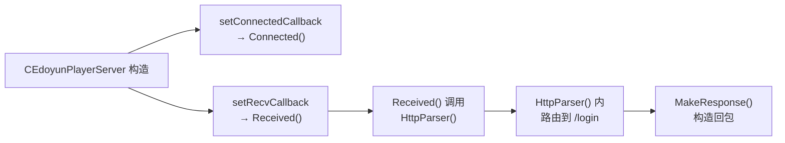
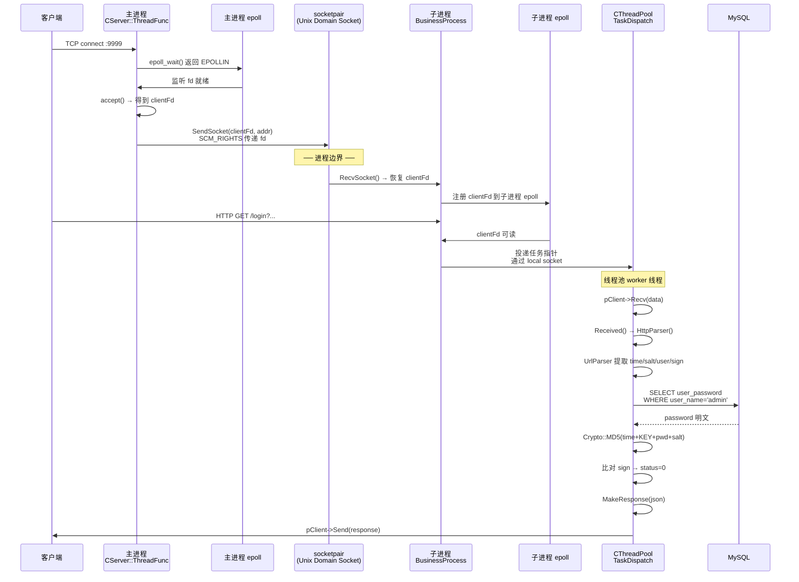
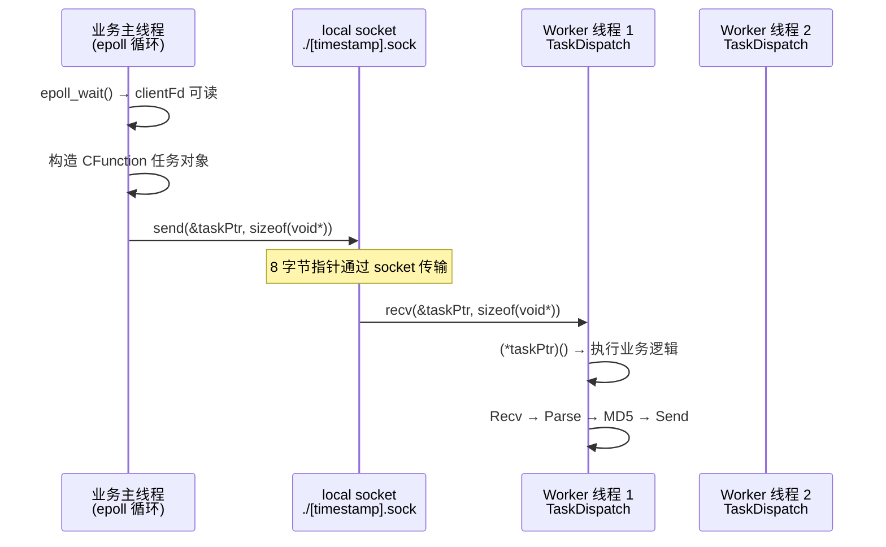
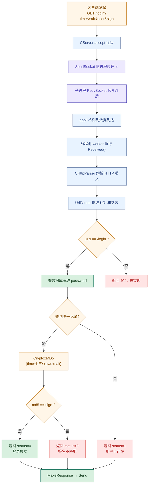

# 易播服务器加密与业务模块设计

> [!abstract]
> 本文是 `4.4 加密与业务` 专题的总览设计笔记，从易播服务器集成测试代码出发，梳理加密校验机制、HTTP 请求解析与路由、业务回调体系、以及登录请求从网络层穿越进程边界到达业务层的完整链路。
>
> 读完本文，应该能回答三个问题：服务端用什么方式校验客户端身份；HTTP 请求如何被解析并路由到具体 handler；一个 `/login` 请求在多进程多线程架构中走过哪些节点。
>
> 前置知识：[[4.1.1 易播服务器线程体系详解|4.1 线程体系]]、[[4.2.1 Linux播放器服务器网络模板设计|4.2 网络模板]]、[[4.3.1 易播服务器数据库设计|4.3 数据库设计]]。

## 专题定位

`4.4 加密与业务` 要解决的是"播放器服务器如何把加密校验与业务逻辑接入主流程"，不是单独讲密码学或 HTTP 协议。

| 范围 | 本文处理方式 |
|---|---|
| 加密校验 | 以 `Crypto::MD5()` + 共享密钥签名为主线说明 |
| HTTP 解析 | 解剖 `CHttpParser` 与 `UrlParser` 如何从原始字节流中提取请求 |
| 业务回调链 | 从 `CBusiness` 基类到 `CEdoyunPlayerServer` 的回调注册与触发 |
| 登录业务 | `/login` 端点的完整链路：参数提取 → 数据库查询 → 签名比对 → 回包 |
| 跨进程调度 | 请求如何通过 socketpair 从主进程转发到业务子进程 |
| 未落地功能 | 不额外设计 HTTPS/TLS、JWT、OAuth 等源码中尚未出现的机制 |

本文更像是 `4.4` 的"加密与业务施工图"：先看总体架构，再逐层拆解加密、解析、回调、响应，最后用完整的登录链路把所有模块串起来。

---

## 1. 加密与业务模块总体架构

![[图片/6.项目/04.Linux播放器服务器/4.4 加密与业务/4_4_1_1.svg|1060]]

整张架构图可以拆成四条线：

1. **网络线**：`CServer` 在主进程通过 epoll 监听 TCP 9999 端口，accept 新连接后把客户端 fd 通过 `SendSocket()` 传给子进程。
2. **业务线**：子进程的 `CEdoyunPlayerServer::BusinessProcess()` 收到 fd，在自己的 epoll 循环和线程池中完成 HTTP 解析、加密校验、数据库查询。
3. **加密线**：`Crypto::MD5()` 在业务层被调用，用 OpenSSL 的 MD5 接口对 `time + KEY + password + salt` 做摘要，与客户端提交的 `sign` 比对。
4. **响应线**：`MakeResponse()` 组装标准 HTTP/1.1 响应头 + JSON body，通过同一个客户端 socket 回包。

> [!important]
> 当前版本只做了 MD5 签名校验，没有 HTTPS/TLS 加密传输。这意味着 `time`、`salt`、`user` 在网络上是明文传输的，`sign` 防的是篡改而非窃听。生产环境至少应加 TLS 层。

---

## 2. MD5 签名校验机制

### 2.1 Crypto 类

加密模块非常精简，只有一个静态方法：

```cpp
class Crypto {
public:
    // 输入任意长度文本，返回 32 字符十六进制 MD5 摘要
    static Buffer MD5(const Buffer& text);
};
```

实现路径 `Crypto.cpp`：

```cpp
Buffer Crypto::MD5(const Buffer& text) {
    MD5_CTX ctx;
    MD5_Init(&ctx);
    MD5_Update(&ctx, (const unsigned char*)(const char*)text, text.size());
    unsigned char md5[16] = "";
    MD5_Final(md5, &ctx);
    // 16 字节二进制 → 32 字符十六进制
    Buffer result;
    char hex[3] = "";
    for (int i = 0; i < 16; i++) {
        snprintf(hex, sizeof(hex), "%02x", md5[i]);
        result += hex;
    }
    return result;
}
```

这里用的是 OpenSSL 的 `MD5_Init / MD5_Update / MD5_Final` 三步式接口，链接时需要 `-lssl -lcrypto`。

### 2.2 签名协议

![[图片/6.项目/04.Linux播放器服务器/4.4 加密与业务/4_4_1_2.svg|1060]]

签名的核心思路是**共享密钥 + 参数拼接 + 哈希比对**：

| 角色 | 持有信息 | 操作 |
|---|---|---|
| 客户端 | `time`、`salt`（随机数）、`user`、用户密码、`MD5_KEY` | 拼接后 MD5 得到 `sign`，随请求发送 |
| 服务端 | `MD5_KEY`（硬编码）、数据库中的密码 | 从 URL 取 `time`/`salt`/`user`，查库得密码，重算 MD5，与 `sign` 比对 |

共享密钥定义在 `EdoyunPlayerServer.h`：

```cpp
#define MD5_KEY "*&^%$#@b.v+h-b*g/h@n!h#n$d^ssx,.kl<kl"
```

签名计算公式：

```text
sign = MD5( time + MD5_KEY + password + salt )
```

> [!warning]
> **安全隐患**：
> 1. MD5 已被证明存在碰撞攻击，不适合用于安全场景，应至少升级为 SHA-256。
> 2. 密钥硬编码在源码中，客户端逆向后密钥即暴露。
> 3. `time` 和 `salt` 没有做过期和重放校验，理论上截获的合法请求可以被重放。
> 4. 数据库中密码为明文存储，应改为存储 bcrypt/scrypt 哈希。

---

## 3. HTTP 请求解析与路由

### 3.1 CHttpParser

`CHttpParser` 负责从原始 TCP 字节流中解析 HTTP 请求：

```cpp
class CHttpParser {
public:
    int Parser(const Buffer& data);   // 解析完整 HTTP 报文
    unsigned Method() const;           // GET=0, POST=1, ...
    Buffer Url() const;                // 请求 URI
    Buffer Body() const;               // POST body
    Buffer Protocol() const;           // "HTTP/1.1"
};
```

解析器内部使用正则或手动分割的方式提取首行 `GET /login?... HTTP/1.1`，再把 URL 部分交给 `UrlParser` 做参数拆解。

### 3.2 UrlParser

`UrlParser` 是一个轻量级的 URL 参数解析器：

```cpp
class UrlParser {
public:
    int Parser(const Buffer& url);      // 解析完整 URL
    Buffer operator[](const Buffer& key); // 按 key 取 query 参数
    Buffer Uri() const;                   // 路径部分 "/login"
    Buffer Host() const;
    int Port() const;
};
```

用法示例（在业务代码中）：

```cpp
UrlParser urlParser;
urlParser.Parser(http.Url());
Buffer uri = urlParser.Uri();           // "/login"
Buffer time = urlParser["time"];        // "1693000000"
Buffer salt = urlParser["salt"];        // "random_str"
Buffer user = urlParser["user"];        // "admin"
Buffer sign = urlParser["sign"];        // "a1b2c3d4..."
```

### 3.3 路由分发

当前版本的路由非常直接——在 `HttpParser()` 方法中用 `if` 判断 URI：

```cpp
if (uri == "/login") {
    // 登录校验逻辑
} else {
    // 404 或其他 handler
}
```

| 端点 | 方法 | 处理逻辑 |
|---|---|---|
| `/login` | GET | 参数提取 → 查库 → MD5 校验 → JSON 回包 |
| 其他 | — | 当前未实现，可扩展 |

> [!note]
> 这种"URI 字符串匹配"的路由方式在端点少时足够简单。如果后续要支持 `/video/list`、`/user/info` 等多端点，可以考虑用 `std::map<Buffer, Handler>` 做路由表。

---

## 4. 业务回调链：从 CBusiness 到具体 Handler

### 4.1 CBusiness 基类

`CBusiness` 是所有业务模块的抽象基类，定义了两个核心回调注册点：

```cpp
class CBusiness {
public:
    CBusiness();
    virtual int BusinessProcess(CProcess* proc) = 0;
protected:
    CConnectedFunction* m_connectedcallback;  // 新连接回调
    CReceivedFunction*  m_recvcallback;       // 数据到达回调
    
    void setConnectedCallback(bindtype bindfunc);
    void setRecvCallback(bindtype bindfunc);
};
```

### 4.2 回调函数封装

`CConnectedFunction` 和 `CReceivedFunction` 是对 `std::bind` 结果的包装：

```cpp
class CConnectedFunction : public CFunctionBase {
public:
    // 绑定签名：void handler(CSocketBase* pClient)
    int operator()(CSocketBase* pClient);
};

class CReceivedFunction : public CFunctionBase {
public:
    // 绑定签名：void handler(CSocketBase* pClient, const Buffer& data)
    int operator()(CSocketBase* pClient, const Buffer& data);
};
```

### 4.3 CEdoyunPlayerServer 的注册

`CEdoyunPlayerServer` 在构造函数中把自己的成员函数绑定到回调：



实际触发链：

1. epoll 检测到客户端 fd 可读
2. `pClient->Recv(data)` 读取字节流
3. `(*m_recvcallback)(pClient, data)` → 调用 `Received()`
4. `Received()` 内部调用 `HttpParser()` 完成解析、校验、回包

> [!tip]
> 这套回调体系的好处是**网络层与业务层解耦**：`CServer` / `CEpoll` 不需要知道具体业务逻辑，只要按连接事件和数据事件触发回调即可。新增业务只需继承 `CBusiness` 并注册自己的回调。

---

## 5. HTTP 响应构造

`MakeResponse()` 按 HTTP/1.1 标准组装响应：

```cpp
Buffer MakeResponse(const Buffer& json) {
    Buffer result = "HTTP/1.1 200 OK\r\n";
    // RFC 7231 日期格式
    result += "Date: " + GetRFCDatetime() + "\r\n";
    result += "Server: Edoyun/1.0\r\n";
    result += "Content-Type: text/html; charset=utf-8\r\n";
    result += "Content-Length: " + Buffer(json.size()) + "\r\n";
    // 安全响应头
    result += "X-Frame-Options: DENY\r\n";
    result += "X-Content-Type-Options: nosniff\r\n";
    result += "Referrer-Policy: same-origin\r\n";
    result += "\r\n";
    result += json;
    return result;
}
```

| 响应头 | 作用 |
|---|---|
| `X-Frame-Options: DENY` | 防止页面被嵌入 iframe（点击劫持防护） |
| `X-Content-Type-Options: nosniff` | 阻止浏览器 MIME 嗅探 |
| `Referrer-Policy: same-origin` | 限制 Referer 头泄露 |

JSON body 格式：

```json
{"status": 0, "message": ""}
```

| status | 含义 |
|---|---|
| 0 | 登录成功 |
| 1 | 用户不存在或查询结果不唯一 |
| 2 | 签名校验失败 |

---

## 6. 线程间通信：请求如何跨进程到达业务层

这是整个加密与业务模块最关键的运行时链路——一个 HTTP 请求从 TCP 到达到最终回包，涉及主进程、子进程、线程池三个执行上下文。

### 6.1 完整时序



### 6.2 跨进程 fd 传递详解

主进程和子进程之间通过 `fork()` 前创建的 `socketpair` 通信。传递的不是数据，而是**文件描述符本身**：

```cpp
// Process.h - SendSocket
int CProcess::SendSocket(int fd, sockaddr_in* addrin) {
    struct msghdr msg = {};
    struct iovec iov[2];
    iov[0] = { (void*)"edoyun",  6 };   // 标识字节
    iov[1] = { addrin, sizeof(*addrin) }; // 客户端地址
    msg.msg_iov = iov;
    msg.msg_iovlen = 2;
    
    // 通过 SCM_RIGHTS 把 fd 塞进控制消息
    struct cmsghdr* cmsg = ...;
    cmsg->cmsg_level = SOL_SOCKET;
    cmsg->cmsg_type  = SCM_RIGHTS;
    *(int*)CMSG_DATA(cmsg) = fd;
    
    sendmsg(m_pair[0], &msg, 0);
}
```

> [!note]
> `SCM_RIGHTS` 是 Unix 域套接字的辅助数据机制，允许一个进程把打开的文件描述符发送给另一个进程。接收方通过 `recvmsg()` 获得一个**新的 fd 编号**，但指向内核中同一个 socket 对象。这是多进程服务器把连接从 accept 进程分发到 worker 进程的经典做法。

### 6.3 线程池任务投递

子进程内部，`CThreadPool` 通过 Unix 域套接字实现任务投递：



| 机制 | 传统线程池 | 易播线程池 |
|---|---|---|
| 任务存储 | `std::queue` + `mutex` + `condition_variable` | socket 内核缓冲区 |
| 投递方式 | `push()` + `notify_one()` | `send()` 指针的字节表示 |
| 唤醒方式 | 条件变量 | epoll / 阻塞 `recv()` |
| 优势 | 通用、直观 | 天然与 epoll 事件循环集成，减少锁竞争 |

---

## 7. 登录业务完整链路

把上面所有模块串起来，一次 `/login` 请求的完整处理步骤：



---

## 8. 安全性分析与改进方向

| 当前现状 | 风险 | 改进方向 |
|---|---|---|
| MD5 签名校验 | MD5 碰撞攻击已实用化 | 升级为 HMAC-SHA256 |
| 密钥硬编码 | 客户端逆向即暴露 | 密钥协商（如 Diffie-Hellman）或服务端下发临时 token |
| 明文 HTTP 传输 | 中间人可窃听全部参数 | 加 TLS 层（OpenSSL `SSL_CTX`） |
| 密码明文存储 | 数据库泄露 = 全部密码暴露 | bcrypt / scrypt / Argon2 哈希存储 |
| 无重放防护 | 截获合法请求可重复提交 | `time` 加有效期窗口 + `nonce` 一次性校验 |
| 无速率限制 | 暴力枚举用户名和密码 | 登录失败计数 + IP 限流 |

> [!tip]
> 当前的 MD5 签名机制可以看作**教学版的 HMAC**：用共享密钥 + 请求参数做摘要，防止参数被篡改。理解了这个模式，后续切换到 HMAC-SHA256 或 JWT 只是替换底层算法和协议格式，架构思路不变。

---

## 9. 一句话总结

易播服务器的加密与业务模块以 `CBusiness` 回调体系为骨架，通过 `CHttpParser` + `UrlParser` 解析 HTTP 请求并路由到具体 handler，在 `/login` 端点用 `Crypto::MD5()` 对共享密钥和请求参数做签名比对完成身份校验，整个过程依赖 socketpair + SCM_RIGHTS 完成主进程到子进程的连接分发，再由子进程的线程池并行处理业务。

---

## 10. 面试表达

> "易播服务器的业务层设计了一套回调机制：`CBusiness` 基类定义连接和数据到达两个回调点，具体业务类注册自己的处理函数。对于登录请求，服务端先用 `UrlParser` 从 HTTP GET 中提取 `time`、`salt`、`user`、`sign` 四个参数，再查数据库拿到密码，用 `MD5(time + 密钥 + password + salt)` 重算摘要与客户端的 `sign` 比对。整个请求通过 socketpair 的 SCM_RIGHTS 从主进程分发到子进程，子进程内部用基于 socket 的线程池做并行处理。这套架构的好处是网络层、加密层、业务层各自解耦，新增端点只要在路由分支里加 handler 就行。"

---

## 11. 关联笔记

| 方向 | 笔记 |
|---|---|
| 上级 | [[4.1.1 易播服务器线程体系详解]] — 线程与进程模型总览 |
| 线程池实现 | [[4.1.5 CThread 与 CThreadPool 实现]] — 理解 TaskDispatch 和 socket 投递 |
| 网络模板 | [[4.2.1 Linux播放器服务器网络模板设计]] — CServer / CEpoll / Reactor 事件循环 |
| 数据库 | [[4.3.1 易播服务器数据库设计]] — 表模型层和 SQL 生成机制 |
| 套接字基础 | [[7.6 套接字]] — TCP / Unix Domain Socket 基础 |

---

## 参考资料

- OpenSSL MD5 手册：`man 3 MD5_Init`
- SCM_RIGHTS 机制：`man 7 unix`（辅助数据与文件描述符传递）
- RFC 7231 — HTTP/1.1 Semantics and Content
- OWASP 认证安全备忘单：密码存储、传输加密、防重放最佳实践
