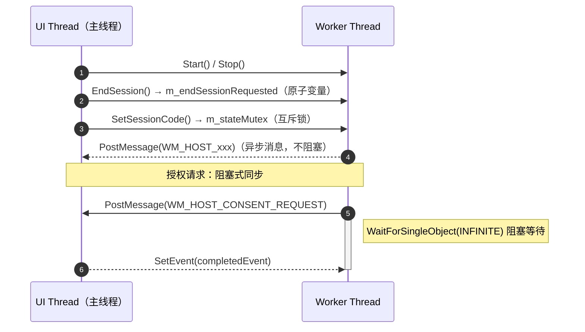

# ServerSocket 网络架构与 select 多路复用
# ServerSocket 网络架构与 select 多路复用

> [!abstract]
> `CServerSocket` 是远控服务端的网络核心，基于 Winsock2 实现 TCP 监听与 `select` 多路复用。
> 本笔记分析其线程模型（`_beginthreadex` 后台线程）、单客户端连接管理、会话状态机驱动、以及数据收发流程。

---

## 1. 架构总览

![[图片/6.项目/06.远控服务端/6.1 网络与协议/6_1_1_1_1.svg]]

**设计模式**：单线程 Server + 异步 UI 通知

| 组件 | 职责 |
|---|---|
| Main UI Thread | MFC 消息循环，处理用户交互与 UI 更新 |
| Worker Thread | 运行 `select()` 循环，处理所有网络 I/O |
| `PostMessage` | Worker → UI 的唯一通信通道，线程安全 |

> [!tip] 为什么不用 IOCP？
> 本项目是**单客户端**远程协助场景（`listen(sock, 1)`），同一时刻最多一个 Viewer 连接。`select` 足以应对，IOCP 的异步完成端口模型在此场景下是过度设计。

---

## 2. 服务器启动流程

### 2.1 Start() 完整流程

```cpp
bool CServerSocket::Start(HWND owner, const CString& sessionCode, UINT port)
{
    Stop();  // 幂等：先停掉旧实例

    // 1. 初始化所有成员状态
    m_ownerWnd = owner;
    m_port = port;
    m_sessionCode = sessionCode;
    m_running = true;
    m_sessionState = SessionState::Idle;

    // 2. 创建 TCP 监听 socket
    m_listenSocket = socket(AF_INET, SOCK_STREAM, IPPROTO_TCP);

    // 3. 设置 SO_EXCLUSIVEADDRUSE（安全选项）
    BOOL exclusive = TRUE;
    setsockopt(m_listenSocket, SOL_SOCKET, SO_EXCLUSIVEADDRUSE,
               reinterpret_cast<const char*>(&exclusive), sizeof(exclusive));

    // 4. bind + listen
    sockaddr_in address = {};
    address.sin_family = AF_INET;
    address.sin_addr.s_addr = htonl(INADDR_ANY);
    address.sin_port = htons(static_cast<u_short>(port));
    bind(m_listenSocket, ...);
    listen(m_listenSocket, 1);  // backlog = 1

    // 5. 启动工作线程
    m_thread = reinterpret_cast<HANDLE>(
        _beginthreadex(nullptr, 0, &CServerSocket::ThreadEntry, this, 0, &threadId));

    // 6. 通知 UI
    PostEvent(HostServerEventType::Listening, ...);
    return true;
}
```

### 2.2 关键设计决策

| 决策 | 原因 |
|---|---|
| `SO_EXCLUSIVEADDRUSE` 而非 `SO_REUSEADDR` | 防止其他进程绑定同一端口，避免端口劫持攻击 |
| `listen(sock, 1)` | 只允许一个待处理连接，多余的直接被 OS 拒绝 |
| `_beginthreadex` 而非 `std::thread` | MFC 项目惯例，保证 CRT 正确初始化（`__stdcall` 约定） |
| `Stop()` 在 `Start()` 开头 | 幂等设计——重复调用不会泄露资源 |

> [!warning] `_beginthreadex` vs `CreateThread`
> 在使用 CRT 函数（如 `recv`、`send`）的线程中，必须用 `_beginthreadex` 而非 `CreateThread`。后者不会初始化 CRT 的线程局部数据，可能导致内存泄漏或未定义行为。

---

## 3. select 多路复用核心

### 3.1 Run() 主循环

```cpp
unsigned CServerSocket::Run()
{
    while (m_running)
    {
        fd_set readSet;
        FD_ZERO(&readSet);

        // 将活跃的 socket 加入监听集合
        if (m_listenSocket != INVALID_SOCKET)
            FD_SET(m_listenSocket, &readSet);
        if (m_clientSocket != INVALID_SOCKET)
            FD_SET(m_clientSocket, &readSet);

        // 200ms 超时——兼顾响应性与 CPU 占用
        timeval timeout = {};
        timeout.tv_usec = 200000;
        const int selectResult = select(0, &readSet, nullptr, nullptr, &timeout);

        if (!m_running) break;                    // 优雅退出检查
        if (selectResult == SOCKET_ERROR) break;  // 致命错误

        // 优先处理本地结束请求
        if (m_endSessionRequested && m_clientSocket != INVALID_SOCKET)
        {
            ResetClient();
            PostEvent(HostServerEventType::SessionEnded, ...);
            continue;
        }

        // 新连接就绪
        if (FD_ISSET(m_listenSocket, &readSet))
            AcceptClient();

        // 已有客户端数据就绪
        if (FD_ISSET(m_clientSocket, &readSet))
            if (!ReceiveFromClient())
                // 断开处理 ...
    }

    CloseSocket(m_clientSocket);
    CloseSocket(m_listenSocket);
    return 0;
}
```

### 3.2 select() 参数详解

| 参数 | 值 | 说明 |
|---|---|---|
| `nfds` | `0` | **Windows 忽略此参数**（POSIX 下需传最大 fd+1） |
| `readfds` | `&readSet` | 监听可读事件：新连接到达 / 客户端数据到达 |
| `writefds` | `nullptr` | 不监听可写（send 在同步调用中完成） |
| `exceptfds` | `nullptr` | 不监听异常 |
| `timeout` | 200ms | 超时后返回 0，用于检查 `m_running` 和 `m_endSessionRequested` |

> [!info] 为什么是 200ms？
> - 太短（如 10ms）：CPU 空转浪费
> - 太长（如 2s）：用户点击"结束会话"后响应迟缓
> - 200ms 是响应性与资源消耗的平衡点

### 3.3 事件处理优先级

![[图片/6.项目/06.远控服务端/6.1 网络与协议/6_1_1_1_2.svg]]

---

## 4. 连接管理

### 4.1 AcceptClient()——单客户端策略

```cpp
void CServerSocket::AcceptClient()
{
    SOCKET acceptedSocket = accept(m_listenSocket, ...);

    // ★ 核心策略：已有客户端 → 拒绝新连接
    if (m_clientSocket != INVALID_SOCKET)
    {
        // 发送 Busy 状态后立即关闭
        CPacket busyPacket(ScreenShareProtocol::ConsentResult, &busy, sizeof(busy));
        SendPacket(acceptedSocket, busyPacket);
        CloseSocket(acceptedSocket);
        return;
    }

    // 提取客户端 IP
    char ipBuffer[INET_ADDRSTRLEN] = {};
    inet_ntop(AF_INET, &clientAddress.sin_addr, ipBuffer, sizeof(ipBuffer));

    // 初始化会话状态
    {
        std::lock_guard<std::mutex> guard(m_stateMutex);
        m_clientSocket = acceptedSocket;
        m_peerIp = CA2T(ipBuffer);
        m_sessionState = SessionState::AwaitingHello;
        m_wrongAttempts = 0;
        m_receiveBuffer.clear();
    }
}
```

### 4.2 ResetClient()——清理连接状态

```cpp
void CServerSocket::ResetClient()
{
    CloseSocket(m_clientSocket);           // shutdown + closesocket
    std::lock_guard<std::mutex> guard(m_stateMutex);
    m_peerIp.Empty();
    m_helperName.Empty();
    m_sessionState = SessionState::Idle;   // 回到空闲，准备接受新连接
    m_wrongAttempts = 0;
    m_endSessionRequested = false;
    m_receiveBuffer.clear();
}
```

### 4.3 CloseSocket()——安全关闭

```cpp
void CServerSocket::CloseSocket(SOCKET& socket)
{
    if (socket != INVALID_SOCKET)
    {
        shutdown(socket, SD_BOTH);  // 先通知对端：不再发送/接收
        closesocket(socket);         // 释放 socket 资源
        socket = INVALID_SOCKET;     // 置为无效，防止重复关闭
    }
}
```

> [!warning] 为什么先 `shutdown` 再 `closesocket`？
> 直接 `closesocket` 会导致 TCP RST（重置），对端的 `recv` 返回错误而非正常的 0。先 `shutdown(SD_BOTH)` 发送 FIN 实现优雅关闭，对端 `recv` 会正常返回 0 表示连接结束。

---

## 5. 会话状态机

### 5.1 状态定义

```cpp
enum class SessionState
{
    Idle,              // 空闲，等待连接
    AwaitingHello,     // 已连接，等待 Hello 握手
    WaitingForConsent, // Hello 验证通过，等待用户授权
    Sharing,           // 授权通过，正在共享屏幕
};
```

### 5.2 状态转换图

![[图片/6.项目/06.远控服务端/6.1 网络与协议/6_1_1_1_3.svg]]

### 5.3 HandlePacket() 状态驱动

状态机决定了每个数据包的合法性：

| 当前状态 | 合法命令 | 处理逻辑 |
|---|---|---|
| `AwaitingHello` | `Hello` | 验证会话码 → 成功则请求授权，失败最多重试 3 次 |
| `WaitingForConsent` | （无，阻塞等待） | `RequestConsent()` 阻塞 Worker 线程，等待 UI 回复 |
| `Sharing` | `FrameRequest`（空载荷） | 截屏 → PNG 编码 → 发回帧数据 |
| 任何状态 | 非法命令 | 立即断开：`ResetClient()` |

> [!warning] 会话码验证的安全措施
> - 最多允许 3 次错误尝试（`kMaxSessionCodeAttempts`），超过则断开
> - 每次错误后 `Sleep(500)` 防暴力枚举
> - 会话码要求 6 位纯数字，由 `ScreenShareProtocol::IsValidSessionCode` 校验

---

## 6. 数据收发

### 6.1 接收流程——增量缓冲 + 粘包处理

```cpp
bool CServerSocket::ReceiveFromClient()
{
    char receiveBuffer[8192] = {};
    const int receivedLength = recv(m_clientSocket, receiveBuffer, sizeof(receiveBuffer), 0);
    if (receivedLength <= 0) return false;  // 连接断开

    // ★ 追加到持久缓冲区（处理 TCP 粘包/拆包）
    m_receiveBuffer.insert(m_receiveBuffer.end(),
                           receiveBuffer, receiveBuffer + receivedLength);

    // 循环解析完整数据包
    while (!m_receiveBuffer.empty())
    {
        CPacket packet;
        size_t consumed = 0;
        const PacketParseResult result =
            CPacket::TryParse(m_receiveBuffer.data(), m_receiveBuffer.size(),
                              packet, consumed);

        if (result == PacketParseResult::NeedMoreData)
            break;   // 数据不够，等下一次 recv
        if (result == PacketParseResult::Invalid)
            return false;  // 协议错误，断开连接

        // 移除已消费的字节
        m_receiveBuffer.erase(m_receiveBuffer.begin(),
                              m_receiveBuffer.begin() + consumed);
        HandlePacket(packet);
    }
    return true;
}
```

**TCP 粘包/拆包问题**：TCP 是字节流协议，一次 `recv` 可能收到半个包、一个包、或多个包。解决方案：
1. 将收到的数据追加到 `m_receiveBuffer`
2. 通过 `CPacket::TryParse` 尝试解析（检查 magic number `0xFEFF`、长度、校验和）
3. 解析成功则消费对应字节，继续尝试下一个包
4. 数据不够则等待下一次 `recv`

### 6.2 发送流程——循环发送确保完整性

```cpp
bool CServerSocket::SendPacket(SOCKET socket, const CPacket& packet)
{
    const std::vector<char> bytes = packet.Serialize();
    size_t sentLength = 0;
    std::lock_guard<std::mutex> guard(m_sendMutex);  // 线程安全
    while (sentLength < bytes.size())
    {
        const int chunkLength = send(socket,
            bytes.data() + sentLength,
            static_cast<int>(bytes.size() - sentLength), 0);
        if (chunkLength <= 0) return false;
        sentLength += static_cast<size_t>(chunkLength);
    }
    return true;
}
```

> [!info] 为什么需要循环发送？
> `send()` 不保证一次发完所有数据——当内核发送缓冲区满时，它可能只发送部分字节。必须循环直到所有数据发送完毕。

---

## 7. 线程安全模型

### 7.1 同步原语一览

| 原语 | 保护对象 | 说明 |
|---|---|---|
| `m_stateMutex` | `m_sessionState`, `m_peerIp`, `m_helperName`, `m_sessionCode` | 保护会话状态的读写 |
| `m_sendMutex` | `SendPacket()` 整个发送过程 | 防止并发 send 导致数据交织 |
| `std::atomic_bool m_running` | 线程退出标志 | 无锁读写，Worker 线程轮询检查 |
| `std::atomic_bool m_endSessionRequested` | 会话结束请求 | UI 线程设置，Worker 线程消费 |

### 7.2 线程间通信



### 7.3 授权请求的同步机制

```cpp
ScreenShareProtocol::Status CServerSocket::RequestConsent()
{
    // 1. 创建请求对象（含 Windows Event）
    ConsentRequest* request = new ConsentRequest(...);

    // 2. 投递到 UI 线程
    PostMessage(m_ownerWnd, WM_HOST_CONSENT_REQUEST, 0, (LPARAM)request);

    // 3. Worker 线程阻塞等待 UI 回复
    WaitForSingleObject(request->completedEvent, INFINITE);

    // 4. 读取结果
    return request->result;
}
```

> [!warning] 阻塞等待的影响
> `RequestConsent()` 阻塞了 Worker 线程，此期间：
> - **不会 accept 新连接**——但 `listen(1)` 仍然队列一个
> - **不会处理 `m_endSessionRequested`**——需等 consent 完成后才检查
> - 用户授权对话框有 **30 秒超时**（由 `ConsentDialog` 实现），防止无限阻塞

---

## 8. 优雅关闭

### 8.1 Stop() 流程

```cpp
void CServerSocket::Stop()
{
    m_running = false;          // 1. 通知 Worker 退出
    CloseSocket(m_clientSocket);// 2. 关闭 socket → select 返回错误或超时
    CloseSocket(m_listenSocket);
    if (m_thread != nullptr)
    {
        WaitForSingleObject(m_thread, 2000); // 3. 等待线程退出（最多 2 秒）
        CloseHandle(m_thread);                // 4. 释放线程句柄
        m_thread = nullptr;
    }
    ResetClient();              // 5. 清理所有会话状态
}
```

**关闭时序**：
1. `m_running = false` → Worker 线程下次 `select` 超时后检查退出
2. 关闭 socket → 若 Worker 正阻塞在 `recv`/`WaitForSingleObject`，强制返回
3. `WaitForSingleObject(2000)` → 给 Worker 2 秒清理时间
4. 析构函数调用 `Stop()`，确保 RAII 语义

---

## 9. 陷阱与设计权衡

### 9.1 已知限制

| 限制 | 原因 | 影响 |
|---|---|---|
| 单客户端 | 设计简化，远程协助场景不需要多客户端 | 第二个 Viewer 收到 `Busy` 后被拒绝 |
| `Sleep(500)` 在 Worker 线程 | 防暴力枚举会话码 | 阻塞期间无法处理其他事件 |
| `WaitForSingleObject(INFINITE)` | 等待用户授权 | Worker 线程完全阻塞，依赖 30s 超时保底 |
| 无 keepalive | 未设置 `SO_KEEPALIVE` | 对端无预警断开时，需等下一次 `recv` 返回 0 才感知 |

### 9.2 与 IOCP 模型的对比

| 特性 | 本项目 (select) | IOCP 模型 |
|---|---|---|
| 并发客户端 | 1 | 数千+ |
| 线程模型 | 1 Worker 线程 | 线程池 |
| I/O 方式 | 同步阻塞 | 异步重叠 I/O |
| 复杂度 | 低（~300 行） | 高（需 Completion Port + Overlapped） |
| 适用场景 | 远程协助 | 高性能服务器 |

> [!tip] 面试表达
> "本项目使用 `select` 而非 IOCP，因为远程协助是**单客户端**场景。`select` 的代码量和调试难度远低于 IOCP，且 200ms 的超时轮询足以保证响应性。如果需要支持多客户端，可以考虑迁移到 IOCP 或使用 `WSAEventSelect` 模型。"

---

## 10. Windows 消息通知机制

### 10.1 自定义消息

```cpp
constexpr UINT WM_HOST_SERVER_EVENT      = WM_APP + 0x100;  // 服务器状态变更
constexpr UINT WM_HOST_CONSENT_REQUEST   = WM_APP + 0x101;  // 请求用户授权
constexpr UINT WM_HOST_BANNER_END_SESSION= WM_APP + 0x102;  // Banner 结束会话
constexpr UINT WM_HOST_TRAYICON          = WM_APP + 0x103;  // 托盘图标事件
```

### 10.2 事件载荷

```cpp
struct HostServerEventPayload
{
    HostServerEventType type;  // Listening / WaitingForConsent / SharingStarted / SessionEnded / Error
    CString peerIp;
    CString helperName;
    CString detail;
};
```

> [!info] 为什么用 `PostMessage` 而非回调函数？
> - `PostMessage` 是**异步的**——Worker 线程投递后立即继续，不阻塞
> - 消息由 MFC 消息循环在 **UI 线程**中处理，天然线程安全
> - 载荷通过 `new` 分配，UI 线程 `delete`——所有权从 Worker 转移到 UI

---

## 关联笔记

- [[6.1.2 ScreenShareProtocol 协议设计]] — 命令码、状态码、Hello 载荷定义
- [[6.1.3 SharedPacket 数据包序列化与解析]] — 二进制协议的封包/拆包实现
- [[6.3.1 SessionPolicy 会话生命周期管理]] — 会话策略与超时控制
- [[6.3.3 ConsentDialog 用户授权机制]] — 30 秒倒计时授权弹窗
- [[6.4.1 MFC 应用框架与 HostMainDlg]] — UI 事件处理与消息分发
- [[6.0 远控服务端项目总结]] — 项目总览