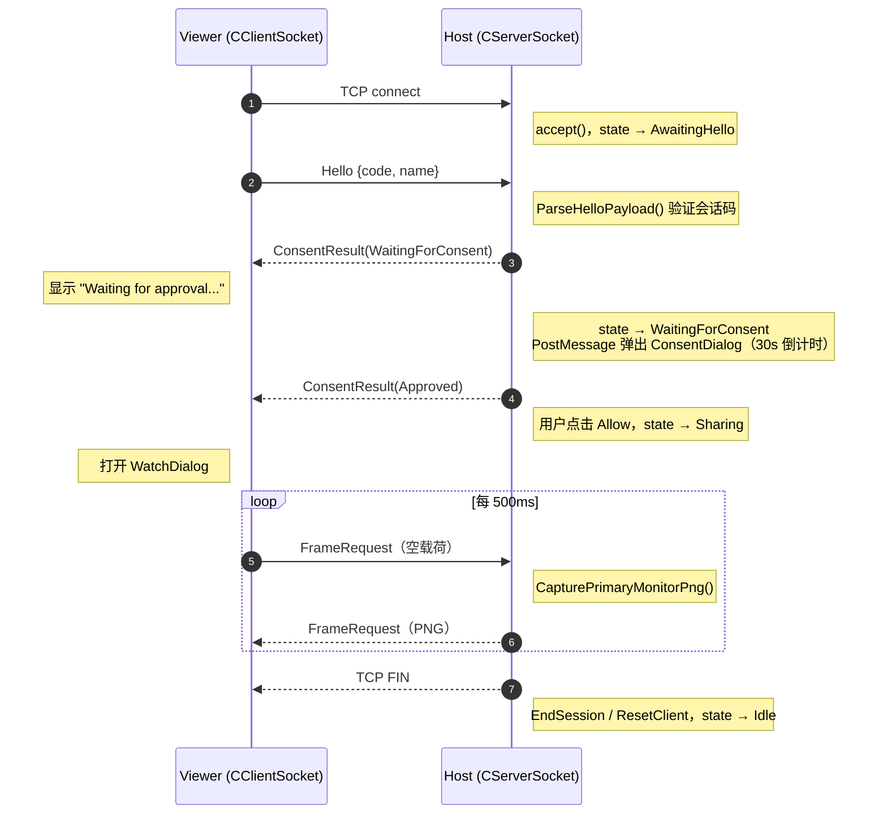
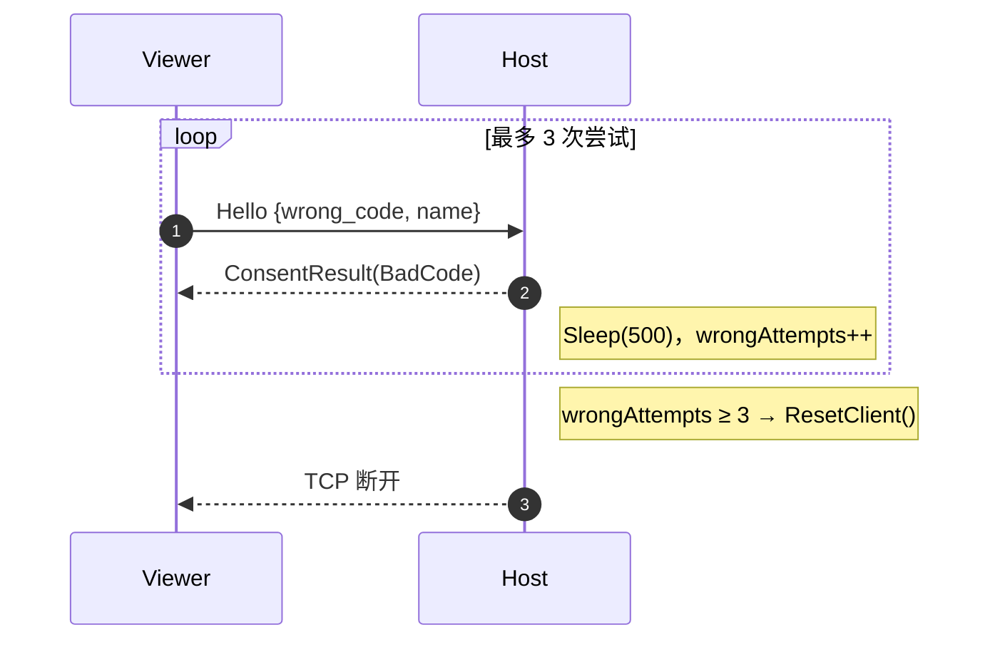
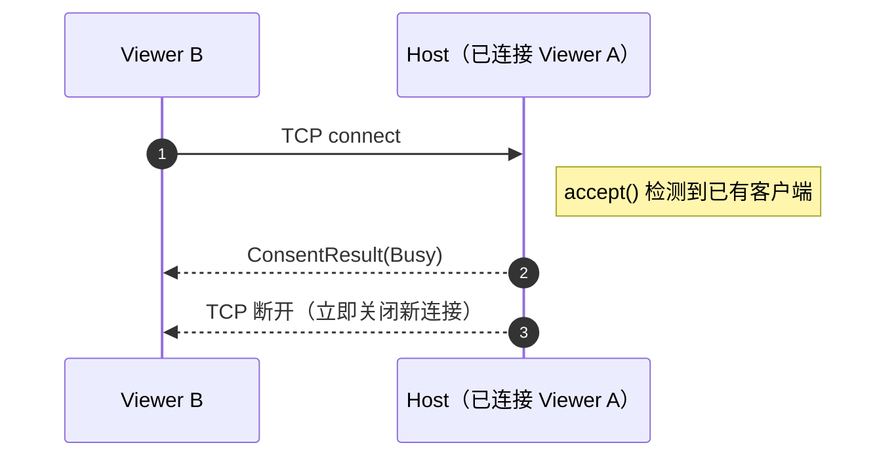
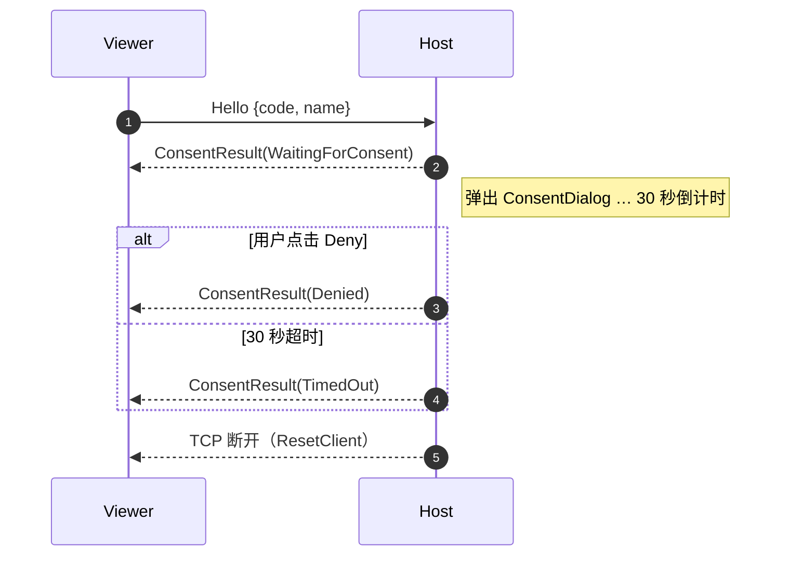
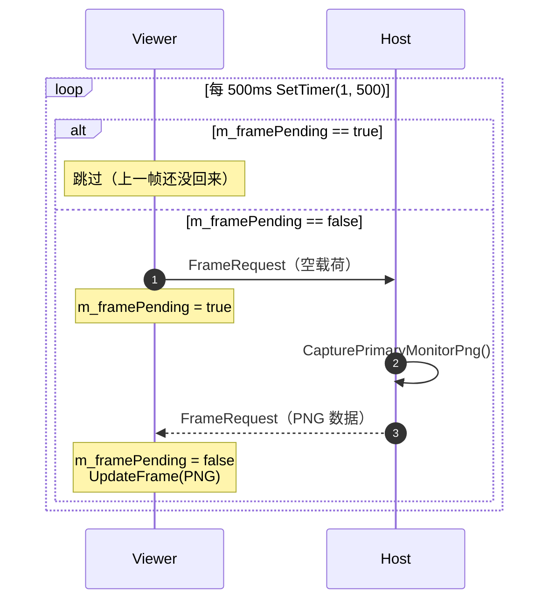

---
tags:
  - 项目
  - 远控服务端
  - 网络与协议
---
---
title: ScreenShareProtocol 协议设计
date: 2026-06-05
tags:
  - remote-control
  - protocol
  - binary-protocol
  - network
aliases:
  - ScreenShareProtocol
  - 远控协议设计
  - 屏幕共享协议
status: complete
---

# ScreenShareProtocol 协议设计
# ScreenShareProtocol 协议设计

> [!abstract]
> `ScreenShareProtocol.h` 定义了远控服务端与观看端之间的二进制通信协议。
> 本笔记分析命令码（Hello/FrameRequest/ConsentResult）、状态码（BadCode/WaitingForConsent/Denied/Approved/Busy/TimedOut）、以及验证规则（会话码 6 位数字、Helper 名称 UTF-8 限制）。

---

## 1. 协议概述

### 1.1 定位与职责

`ScreenShareProtocol` 是一个**应用层协议定义头文件**，不包含网络 I/O 逻辑。它定义了：

| 职责 | 具体内容 |
|---|---|
| **语义层** | 命令码（做什么）、状态码（结果如何） |
| **载荷格式** | Hello 握手的序列化/反序列化 |
| **约束常量** | 端口、超时、重试次数、字段长度 |
| **验证函数** | 会话码合法性、Helper 名称合法性 |

它与 [[6.1.3 SharedPacket 数据包序列化与解析|SharedPacket]] 的关系：

![[图片/6.项目/06.远控服务端/6.1 网络与协议/6_1_1_2_1.svg]]

### 1.2 协议常量

```cpp
namespace ScreenShareProtocol
{
constexpr UINT   kDefaultPort             = 9527;   // 默认监听端口
constexpr DWORD  kFrameIntervalMs         = 500;    // 帧请求最小间隔（毫秒）
constexpr size_t kSessionCodeLength       = 6;      // 会话码固定 6 位
constexpr size_t kHelperNameMaxLength     = 64;     // Helper 名称最大字符数（宽字符）
constexpr UINT   kConsentTimeoutSeconds   = 30;     // 用户授权等待超时
constexpr UINT   kMaxSessionCodeAttempts  = 3;      // 会话码最大错误次数
}
```

> [!info] 常量的使用位置
> - `kFrameIntervalMs` → Viewer 端 `CWatchDialog::SetTimer(1, 500, nullptr)` 控制请求节奏
> - `kSessionCodeLength` → Viewer 端 `EM_SETLIMITTEXT` 限制输入框长度
> - `kConsentTimeoutSeconds` → Host 端 `ConsentDialog` 30 秒倒计时
> - `kMaxSessionCodeAttempts` → Host 端 `HandlePacket` 中累计错误次数

---

## 2. 命令码定义

### 2.1 Command 枚举

```cpp
enum Command : WORD   // 2 字节，嵌入 CPacket 的 command 字段
{
    FrameRequest  = 6,      // 帧请求 / 帧响应（双向复用）
    Hello         = 1001,   // Viewer → Host 握手
    ConsentResult = 1002,   // Host → Viewer 授权结果
};
```

### 2.2 命令方向与载荷

| 命令 | 方向 | 载荷（Payload） | 说明 |
|---|---|---|---|
| `Hello` (1001) | Viewer → Host | `"123456\nAlice"` | 会话码 + `\n` + Helper 名称 |
| `ConsentResult` (1002) | Host → Viewer | 1 字节 Status | 授权结果状态码 |
| `FrameRequest` (6) | Viewer → Host | **空**（0 字节） | 请求一帧截图 |
| `FrameRequest` (6) | Host → Viewer | PNG 二进制数据 | 响应帧数据 |

> [!tip] FrameRequest 的双向复用设计
> 同一个命令码 `6` 被 **请求** 和 **响应** 共用：
> - **请求**：Viewer 发送，载荷为空 → 意思是"给我一帧"
> - **响应**：Host 发送，载荷为 PNG → 意思是"这是截图"
>
> 通过 **载荷是否为空** 区分方向，避免额外定义 FrameResponse 命令码。

> [!warning] 命令码为什么不连续？
> `FrameRequest = 6` 而 `Hello = 1001`。这是历史遗留——`6` 来自早期远控项目的命令编号体系，而 `1001`/`1002` 是屏幕共享重构后新增的。两段编号不重叠，所以功能上没问题。

---

## 3. 状态码定义

### 3.1 Status 枚举

```cpp
enum Status : BYTE   // 1 字节，作为 ConsentResult 的载荷
{
    BadCode           = 0,   // 会话码错误
    WaitingForConsent = 1,   // 正在等待用户授权
    Denied            = 2,   // 用户拒绝
    Approved          = 3,   // 用户批准
    Busy              = 4,   // 已有其他 Viewer 连接
    TimedOut          = 5,   // 授权超时（30 秒）
};
```

### 3.2 状态码语义详解

| 状态码 | 含义 | Viewer 收到后的行为 | 触发场景 |
|---|---|---|---|
| `BadCode` (0) | 会话码不匹配 | 断开连接，提示"Incorrect session code" | Host 比较 code 失败 |
| `WaitingForConsent` (1) | 码正确，等用户点按钮 | 显示"Waiting for host approval..." | Host 进入 WaitingForConsent 状态 |
| `Denied` (2) | 用户点击了"拒绝" | 断开连接，提示"Host denied the request" | ConsentDialog 点 Deny |
| `Approved` (3) | 用户点击了"允许" | 进入共享模式，打开 WatchDialog | ConsentDialog 点 Allow |
| `Busy` (4) | Host 已有连接 | 断开连接，提示"already sharing with another" | AcceptClient 检测到已有客户端 |
| `TimedOut` (5) | 30 秒无响应 | 断开连接，提示"consent timer expired" | ConsentDialog 倒计时耗尽 |

> [!info] 状态码的传输方式
> 状态码作为 `ConsentResult` 命令的 1 字节载荷发送：
> ```cpp
> const BYTE rawStatus = static_cast<BYTE>(status);
> SendPacket(m_clientSocket, CPacket(ScreenShareProtocol::ConsentResult, &rawStatus, sizeof(rawStatus)));
> ```
> Viewer 端解析：
> ```cpp
> HandleSessionStatus(static_cast<BYTE>(packet->Payload()[0]));
> ```

---

## 4. Hello 握手协议

### 4.1 载荷格式

Hello 载荷是纯文本格式，用 `\n` 分隔两个字段：

![[图片/6.项目/06.远控服务端/6.1 网络与协议/6_1_1_2_2.svg]]

**约束条件**：
- 恰好包含 **一个** `\n` 分隔符
- 不允许出现 `\r`（防止 CRLF 注入）
- 会话码：恰好 6 个 ASCII 数字 `'0'-'9'`
- Helper 名称：非空，合法 UTF-8，转为宽字符后不超过 64 个字符

### 4.2 构建函数——BuildHelloPayload

```cpp
inline bool BuildHelloPayload(const std::string& sessionCode,
                               const std::string& helperName,
                               std::string& payload)
{
    if (!IsValidSessionCode(sessionCode) || !IsValidHelperName(helperName))
        return false;

    payload = sessionCode;       // "123456"
    payload.push_back('\n');     // "123456\n"
    payload += helperName;       // "123456\nAlice"
    return true;
}
```

### 4.3 解析函数——ParseHelloPayload

```cpp
inline bool ParseHelloPayload(const std::string& payload, HelloPayload& hello)
{
    const size_t separator = payload.find('\n');

    // 防御性检查：必须恰好一个 \n，且无 \r
    if (separator == std::string::npos ||
        payload.find('\n', separator + 1) != std::string::npos ||
        payload.find('\r') != std::string::npos)
        return false;

    hello.sessionCode = payload.substr(0, separator);
    hello.helperName = payload.substr(separator + 1);

    // 双重验证：格式正确 + 值合法
    return IsValidSessionCode(hello.sessionCode) && IsValidHelperName(hello.helperName);
}
```

> [!warning] 解析中的防御性编程
> `ParseHelloPayload` 做了 **4 层防御**：
> 1. `\n` 必须存在（否则无法分割）
> 2. `\n` 只能有一个（防止多字段注入）
> 3. 不允许 `\r`（防止 CRLF 注入导致解析歧义）
> 4. 分割后的两个字段分别通过 `IsValidSessionCode` 和 `IsValidHelperName` 验证

---

## 5. 验证函数

### 5.1 会话码验证——IsValidSessionCode

```cpp
inline bool IsValidSessionCode(const std::string& code)
{
    if (code.size() != kSessionCodeLength)    // 必须恰好 6 字节
        return false;

    for (char ch : code)
    {
        if (ch < '0' || ch > '9')            // 每个字符必须是 '0'-'9'
            return false;
    }
    return true;
}
```

**安全分析**：
- 6 位数字 = 100 万种组合（000000-999999）
- 配合 `kMaxSessionCodeAttempts = 3` 次限制 + 每次错误 `Sleep(500)`
- 暴力枚举成功概率 = 3/1,000,000 = 0.0003%

### 5.2 Helper 名称验证——IsValidHelperName

```cpp
inline bool IsValidHelperName(const std::string& helperName)
{
    // 1. 非空且不含换行符
    if (helperName.empty() ||
        helperName.find('\r') != std::string::npos ||
        helperName.find('\n') != std::string::npos)
        return false;

    // 2. UTF-8 合法性 + 宽字符长度限制
    const int wideLength = ::MultiByteToWideChar(
        CP_UTF8,
        MB_ERR_INVALID_CHARS,     // ★ 严格模式：拒绝非法 UTF-8 序列
        helperName.data(),
        static_cast<int>(helperName.size()),
        nullptr,                   // 不实际转换，只计算长度
        0);

    return wideLength > 0 && wideLength <= static_cast<int>(kHelperNameMaxLength);
}
```

> [!tip] `MB_ERR_INVALID_CHARS` 的关键作用
> 不加此标志时，`MultiByteToWideChar` 会将非法 UTF-8 字节替换为 `U+FFFD`（替换字符）并返回成功。加上后，遇到非法序列立即返回 0 并设置 `ERROR_NO_UNICODE_TRANSLATION`。
>
> **为什么重要**：如果接受非法 UTF-8，Host UI 可能显示乱码或触发字体渲染异常。

### 5.3 验证规则汇总

| 字段 | 类型 | 约束 | 验证位置 |
|---|---|---|---|
| 会话码 | ASCII | 恰好 6 位数字 | `IsValidSessionCode` |
| Helper 名称 | UTF-8 | 非空，无换行，合法 UTF-8，≤64 宽字符 | `IsValidHelperName` |
| Hello 载荷 | 文本 | 恰好 1 个 `\n`，无 `\r` | `ParseHelloPayload` |

---

## 6. 完整协议交互流程

### 6.1 正常握手时序图



### 6.2 错误场景

#### 会话码错误（最多 3 次）



#### Host 已有连接（Busy）



#### 用户拒绝 / 超时



---

## 7. 帧传输协议

### 7.1 帧请求周期



### 7.2 流量控制

| 机制 | 实现 | 效果 |
|---|---|---|
| **定时器节流** | `SetTimer(1, 500, nullptr)` | 最多每 500ms 请求一帧 |
| **m_framePending 标志** | 请求时置 true，收到响应置 false | 防止请求堆积（上一帧没回来不发新请求） |
| **同步截屏** | `CapturePrimaryMonitorPng()` 阻塞 Worker 线程 | 自然背压——截屏慢则响应慢 |

> [!info] 帧率估算
> 按 500ms 间隔 + 截屏+编码+网络延迟（约 50-200ms），实际帧率约 1-2 FPS。这对远程协助场景（看对方屏幕排查问题）足够，不需要实时流畅。

---

## 8. 线上数据包格式

每条协议消息最终通过 [[6.1.3 SharedPacket 数据包序列化与解析|CPacket]] 封装传输。以 Hello 为例：

![[图片/6.项目/06.远控服务端/6.1 网络与协议/6_1_1_2_3.svg]]

**各命令的包大小估算**：

| 命令 | Header | Payload | 总大小 |
|---|---|---|---|
| Hello | 10 字节 | ~20 字节（code+name） | ~30 字节 |
| ConsentResult | 10 字节 | 1 字节 | 11 字节 |
| FrameRequest（请求） | 10 字节 | 0 字节 | 10 字节 |
| FrameRequest（响应） | 10 字节 | ~50KB-500KB (PNG) | ~50-500 KB |

---

## 9. 安全设计分析

### 9.1 已实现的安全措施

| 措施 | 实现 | 防御目标 |
|---|---|---|
| 6 位会话码 + 3 次限制 | `kMaxSessionCodeAttempts = 3` | 暴力枚举（成功率 0.0003%） |
| 错误延迟 | `Sleep(500)` 每次错误后 | 减缓自动化攻击 |
| 用户授权 | ConsentDialog 30 秒弹窗 | 未授权观看 |
| 单客户端 | `listen(1)` + Busy 拒绝 | 多连接攻击 |
| `SO_EXCLUSIVEADDRUSE` | 端口独占 | 端口劫持 |
| `MB_ERR_INVALID_CHARS` | 严格 UTF-8 验证 | 非法字节注入 |
| `\r` / 多 `\n` 拒绝 | `ParseHelloPayload` | 协议注入 |
| 状态机驱动 | 每个状态只接受特定命令 | 乱序命令攻击 |

### 9.2 设计权衡

> [!warning] Sleep(500) 阻塞 Worker 线程
> 密码错误后的 `Sleep(500)` 阻塞了整个 Worker 线程。期间：
> - 无法处理 `m_endSessionRequested`（Host 点"结束"无反应）
> - 无法 `accept` 新连接
>
> 在单客户端场景下影响有限，但如果扩展为多客户端，需要改为异步延迟。

---

## 10. 协议设计原则总结

| 原则 | 体现 |
|---|---|
| **最小权限** | Viewer 只能请求截图，不能远程控制、传文件、执行命令 |
| **显式授权** | 每次连接都需要用户点击"Allow"，无静默/自动模式 |
| **失败关闭** | 解析失败、非法命令、超时 → 一律断开连接 |
| **简单至上** | 3 个命令码 + 6 个状态码覆盖全部场景 |
| **inline 函数** | 所有协议函数标记 `inline`，Header-only 设计，Host 和 Viewer 共享同一头文件 |
| **防御性解析** | 先验证格式再使用数据，多层检查不信任输入 |

> [!tip] 面试表达
> "协议采用 **Header-only** 设计（`ScreenShareProtocol.h` + `SharedPacket.h`），服务端和客户端共享同一份协议定义，编译时保证两端类型一致。命令码和状态码都是枚举类型，添加新命令时只需扩展枚举和 `HandlePacket` 的 switch 分支。Hello 握手采用文本格式便于调试，而帧数据采用二进制（PNG 原始字节）保证效率。"

---

## 关联笔记

- [[6.1.1 ServerSocket 网络架构与 select 多路复用]] — 协议在 `HandlePacket` 中的状态机驱动
- [[6.1.3 SharedPacket 数据包序列化与解析]] — 协议消息的二进制封装（Magic/Length/Checksum）
- [[6.3.1 SessionPolicy 会话生命周期管理]] — 会话级别的安全策略
- [[6.3.3 ConsentDialog 用户授权机制]] — `ConsentResult` 状态码的 UI 来源
- [[6.0 远控服务端项目总结]] — 项目总览
