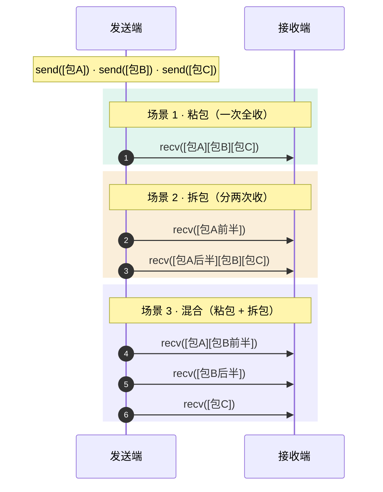

---
tags:
  - 项目
  - 远控服务端
  - 网络与协议
---
---
title: SharedPacket 数据包序列化与解析
date: 2026-06-05
tags:
  - remote-control
  - packet
  - serialization
  - binary-protocol
aliases:
  - SharedPacket
  - CPacket
  - 数据包序列化
status: complete
---

# SharedPacket 数据包序列化与解析
# SharedPacket 数据包序列化与解析

> [!abstract]
> `SharedPacket.h` 实现了远控项目的数据包封装与解析。
> 本笔记分析包格式（Magic 0xFEFF + BodyLength + Command + Payload + Checksum）、`TryParse` 增量解析状态机、`Serialize` 序列化流程、以及校验和计算。

---

## 1. 设计定位

`CPacket` 是一个 **Header-only 的传输层封装类**，解决 TCP 字节流上的"帧定界"问题：

![[图片/6.项目/06.远控服务端/6.1 网络与协议/6_1_1_3_1.svg]]

**核心问题**：TCP 是字节流协议，一次 `recv` 可能收到半个包、一个包、或多个包粘在一起。`CPacket` 通过 **Magic Number + 长度前缀 + 校验和** 三重机制在字节流上恢复消息边界。

---

## 2. 帧格式

### 2.1 二进制布局

![[图片/6.项目/06.远控服务端/6.1 网络与协议/6_1_1_3_2.svg]]

### 2.2 字段详解

| 字段 | 类型 | 大小 | 说明 |
|---|---|---|---|
| **Magic** | `WORD` | 2 字节 | 固定值 `0xFEFF`，用于同步帧起始位置 |
| **BodyLength** | `DWORD` | 4 字节 | Body 部分的字节数（= Command + Payload + Checksum） |
| **Command** | `WORD` | 2 字节 | 命令码，见 [[6.1.2 ScreenShareProtocol 协议设计#2. 命令码定义\|ScreenShareProtocol::Command]] |
| **Payload** | `char[]` | 0~N 字节 | 可变长载荷，内容取决于命令类型 |
| **Checksum** | `WORD` | 2 字节 | Payload 的逐字节累加校验和 |

### 2.3 最小包与最大包

```cpp
// 最小合法包：空载荷（如 FrameRequest 请求）
// Magic(2) + BodyLen(4) + Command(2) + Checksum(2) = 10 字节
static size_t HeaderSize()
{
    return sizeof(WORD) + sizeof(DWORD) + sizeof(WORD) + sizeof(WORD);  // = 10
}

// BodyLen 最小值 = sizeof(Command) + sizeof(Checksum) = 4
// BodyLen < 4 → Invalid
```

| 包类型 | Payload 大小 | 总大小 |
|---|---|---|
| FrameRequest 请求 | 0 字节 | 10 字节 |
| ConsentResult | 1 字节 | 11 字节 |
| Hello | ~20 字节 | ~30 字节 |
| FrameRequest 响应 (PNG) | 50~500 KB | 50~500 KB |

> [!info] 为什么 Magic 选 0xFEFF？
> `0xFEFF` 是 Unicode BOM（Byte Order Mark）。它不太可能在正常的二进制数据流中随机出现，同时也隐含了小端序假设（x86/x64 平台）。本项目不做跨平台，所以直接使用小端序的 `memcpy` 即可。

---

## 3. 序列化——Serialize()

### 3.1 完整实现

```cpp
std::vector<char> Serialize() const
{
    const DWORD payloadLength = static_cast<DWORD>(m_payload.size());
    const DWORD bodyLength = payloadLength + sizeof(WORD) + sizeof(WORD);
    //                       ^^^^^^^^^^^^^^^^  ^^^^^^^^^^^   ^^^^^^^^^^^
    //                       Payload 长度      Command 2B    Checksum 2B

    // 预分配精确大小：Header(6) + Body(bodyLength)
    std::vector<char> bytes(sizeof(WORD) + sizeof(DWORD) + bodyLength, 0);
    char* cursor = bytes.data();

    // 1. 写入 Magic
    const WORD magic = kMagic;
    memcpy(cursor, &magic, sizeof(magic));
    cursor += sizeof(WORD);

    // 2. 写入 BodyLength
    memcpy(cursor, &bodyLength, sizeof(bodyLength));
    cursor += sizeof(DWORD);

    // 3. 写入 Command
    memcpy(cursor, &m_command, sizeof(m_command));
    cursor += sizeof(WORD);

    // 4. 写入 Payload
    if (!m_payload.empty())
    {
        memcpy(cursor, m_payload.data(), m_payload.size());
        cursor += m_payload.size();
    }

    // 5. 写入 Checksum
    const WORD checksum = CalculateChecksum(m_payload.data(), m_payload.size());
    memcpy(cursor, &checksum, sizeof(checksum));

    return bytes;
}
```

### 3.2 序列化流程图

![[图片/6.项目/06.远控服务端/6.1 网络与协议/6_1_1_3_4.svg]]

> [!note] 字节数订正
> 原 ASCII 图把 `"123456\nAlice"` 当作 13 字节，实际是 **12 字节**（`123456` 6 + `\n` 1 + `Alice` 5）。因此 `bodyLength = 12 + 2 + 2 = 16`，整包 `6 + 16 = 22` 字节。上图已按正确值渲染（`BodyLen` 小端序为 `10 00 00 00`，`Checksum = 0x031D`）。

> [!tip] 为什么用 `memcpy` 而非直接赋值？
> 直接通过指针 `*(WORD*)cursor = magic` 在某些平台上会触发**未对齐访问**（Unaligned Access），导致性能下降甚至崩溃。`memcpy` 由编译器保证在任何对齐边界上都安全。虽然 x86 容忍未对齐访问，但 `memcpy` 是更规范的做法。

---

## 4. 反序列化——TryParse()

### 4.1 解析状态机

`TryParse` 是一个**增量解析器**——它不假设缓冲区中有完整的包，而是根据已有数据的多少返回不同结果：

```cpp
enum class PacketParseResult
{
    NeedMoreData,  // 数据不够，等下一次 recv
    Complete,      // 解析成功，packet 已填充
    Invalid,       // 协议错误，包无法恢复
};
```

### 4.2 完整解析流程

```cpp
static PacketParseResult TryParse(const char* buffer, size_t bufferSize,
                                   CPacket& packet, size_t& consumed)
{
    consumed = 0;

    // ── 阶段 1：检查 Header 是否完整 ──
    if (buffer == nullptr || bufferSize < HeaderSize())   // HeaderSize() = 10
        return PacketParseResult::NeedMoreData;

    // ── 阶段 2：验证 Magic ──
    WORD magic = 0;
    memcpy(&magic, buffer, sizeof(magic));
    if (magic != kMagic)                                  // != 0xFEFF
        return PacketParseResult::Invalid;

    // ── 阶段 3：读取 BodyLength，计算完整包大小 ──
    DWORD bodyLength = 0;
    memcpy(&bodyLength, buffer + sizeof(WORD), sizeof(bodyLength));
    const size_t packetSize = sizeof(WORD) + sizeof(DWORD) + bodyLength;

    // ── 阶段 4：BodyLength 合法性检查 ──
    if (bodyLength < sizeof(WORD) + sizeof(WORD))         // < 4（至少 Command + Checksum）
        return PacketParseResult::Invalid;

    // ── 阶段 5：检查缓冲区是否包含完整包 ──
    if (bufferSize < packetSize)
        return PacketParseResult::NeedMoreData;

    // ── 阶段 6：提取 Command 和 Payload ──
    WORD command = 0;
    memcpy(&command, buffer + sizeof(WORD) + sizeof(DWORD), sizeof(command));
    const size_t payloadLength = bodyLength - sizeof(WORD) - sizeof(WORD);
    const char* payload = buffer + sizeof(WORD) + sizeof(DWORD) + sizeof(WORD);

    // ── 阶段 7：校验 Checksum ──
    WORD checksum = 0;
    memcpy(&checksum, payload + payloadLength, sizeof(checksum));
    const WORD actualChecksum = CalculateChecksum(payload, payloadLength);
    if (checksum != actualChecksum)
    {
        consumed = packetSize;          // ★ 即使校验失败，也消费掉这个包
        return PacketParseResult::Invalid;
    }

    // ── 阶段 8：构造结果 ──
    packet = CPacket(command, payload, payloadLength);
    consumed = packetSize;
    return PacketParseResult::Complete;
}
```

### 4.3 解析决策树

![[图片/6.项目/06.远控服务端/6.1 网络与协议/6_1_1_3_3.svg]]

> [!warning] 校验失败时的 consumed 行为
> 注意 Checksum 失败时 `consumed = packetSize` 而非 0。这是**关键设计**：
> - 如果 consumed=0，调用方会反复尝试解析同一段损坏数据，陷入死循环
> - consumed=packetSize 意味着"跳过这个坏包，尝试解析后面的数据"
>
> 但在本项目中，`ServerSocket::ReceiveFromClient()` 收到 `Invalid` 后直接返回 `false` 断开连接，所以实际上不会用到这个跳过逻辑。这是一种防御性设计——即使上层改变策略（比如容错继续），解析器也不会卡住。

---

## 5. 校验和算法

### 5.1 实现

```cpp
static WORD CalculateChecksum(const char* payload, size_t payloadLength)
{
    WORD checksum = 0;
    for (size_t index = 0; index < payloadLength; ++index)
    {
        checksum = static_cast<WORD>(checksum + static_cast<BYTE>(payload[index]));
    }
    return checksum;
}
```

### 5.2 算法分析

| 特性 | 说明 |
|---|---|
| **算法** | 逐字节累加求和，自然溢出取低 16 位 |
| **范围** | 0x0000 ~ 0xFFFF |
| **复杂度** | O(N)，N = payload 长度 |
| **空载荷** | checksum = 0（循环不执行） |

**计算示例**（Payload = "AB"）：

```
checksum = 0
+ 'A' (0x41) → checksum = 0x0041
+ 'B' (0x42) → checksum = 0x0083
结果：0x0083
```

### 5.3 校验强度评估

> [!warning] 这是简单校验和，不是 CRC
>
> **能检测的错误**：
> - 单字节翻转（任一字节值改变）
> - 字节丢失或多余
>
> **无法检测的错误**：
> - 字节交换（"AB" 和 "BA" 的校验和相同：0x41 + 0x42 = 0x42 + 0x41）
> - 精心构造的多字节篡改（只要和不变就通过）
>
> **为什么够用**：
> 1. TCP 本身有 16 位校验和 + 序列号保证数据完整性
> 2. 此校验和主要防御的是**应用层 Bug**（序列化/反序列化错误），而非网络篡改
> 3. 安全性由 TLS 或应用层认证保证，不依赖校验和

---

## 6. 构造函数

```cpp
class CPacket
{
public:
    // 默认构造——空包，用于 TryParse 的输出参数
    CPacket() : m_command(0) {}

    // 原始数据构造——用于发送二进制载荷（如 Status 字节、PNG 数据）
    CPacket(WORD command, const void* data, size_t size) : m_command(command)
    {
        if (data != nullptr && size > 0)
        {
            m_payload.assign(static_cast<const char*>(data),
                             static_cast<const char*>(data) + size);
        }
    }

    // 字符串构造——用于发送文本载荷（如 Hello payload、PNG 字节串）
    explicit CPacket(WORD command, const std::string& payload)
        : m_command(command), m_payload(payload) {}
};
```

**三种构造场景**：

| 构造方式 | 使用场景 | 示例 |
|---|---|---|
| `CPacket()` | TryParse 输出参数 | `CPacket parsed;` |
| `CPacket(cmd, ptr, size)` | 发送原始字节 | `CPacket(ConsentResult, &rawStatus, 1)` |
| `CPacket(cmd, string)` | 发送字符串/大块数据 | `CPacket(FrameRequest, pngBytes)` |

> [!info] `explicit` 的作用
> 第三个构造函数标记为 `explicit`，防止 `std::string` 隐式转换为 `CPacket`：
> ```cpp
> // 编译错误（好事）——防止意外构造
> CPacket pkt = someString;
> // 必须显式构造
> CPacket pkt(ScreenShareProtocol::Hello, someString);
> ```

---

## 7. TCP 粘包/拆包处理

### 7.1 问题本质

TCP 是**字节流**协议，不保留消息边界。一次 `send` 的数据可能被拆成多次 `recv`，也可能多次 `send` 的数据被合并成一次 `recv`：



### 7.2 解决方案——增量缓冲 + 循环解析

```cpp
// ServerSocket::ReceiveFromClient() 和 CClientSocket::Run() 使用相同模式：

// 1. 持久缓冲区（跨 recv 调用保持状态）
std::vector<char> m_receiveBuffer;

// 2. 每次 recv 后追加到缓冲区
m_receiveBuffer.insert(m_receiveBuffer.end(), buffer, buffer + receivedLength);

// 3. 循环尝试解析
while (!m_receiveBuffer.empty())
{
    CPacket packet;
    size_t consumed = 0;
    PacketParseResult result = CPacket::TryParse(
        m_receiveBuffer.data(), m_receiveBuffer.size(), packet, consumed);

    if (result == PacketParseResult::NeedMoreData)
        break;          // 拆包：等下一次 recv 补齐

    if (result == PacketParseResult::Invalid)
        return false;   // 协议错误：断开

    // 粘包：消费已解析字节，继续循环解析下一个包
    m_receiveBuffer.erase(m_receiveBuffer.begin(),
                          m_receiveBuffer.begin() + consumed);
    HandlePacket(packet);
}
```

### 7.3 TryParse 与缓冲区的配合

```
缓冲区状态                     TryParse 返回            操作
─────────────────────────────  ─────────────────────── ──────────
[FF FE 11 00]                  NeedMoreData (头不全)    break, 等 recv
[FF FE 11 00 00 00 E9 03 ...]  NeedMoreData (体不全)    break, 等 recv
[完整包A][完整包B]              Complete (包A)            消费A, 继续循环
                               Complete (包B)            消费B, 继续循环
                               NeedMoreData (空了)       break
[FF EE ...]                    Invalid (Magic 错)        return false, 断开
[完整但校验错]                   Invalid (consumed>0)     上层断开
```

---

## 8. 单元测试覆盖

项目通过 `PacketTests.cpp` 验证了关键场景：

| 测试用例 | 验证内容 | 对应的边界条件 |
|---|---|---|
| `TestCompletePacket` | 序列化 → 反序列化往返 | 正常路径 |
| `TestFragmentedHeader` | 只给 4 字节（Header 不全） | 拆包：Header 阶段 |
| `TestFragmentedHelloPayload` | 总长少 2 字节 | 拆包：Body 阶段 |
| `TestFragmentedFramePayload` | 帧数据包少 2 字节 | 拆包：大载荷 |
| `TestConcatenatedPackets` | 两个包拼接在一起 | 粘包：只解析第一个 |
| `TestBadChecksum` | 翻转最后一字节 | 校验和失败 |
| `TestEmptyPayload` | FrameRequest 空载荷 | 最小合法包 |
| `TestHelloPayload` | Hello 载荷构建+解析 | 协议层往返 |
| `TestHelloMalformedPayloads` | 短码/非数字/空名/多换行 | Hello 验证拒绝 |

> [!tip] 测试重点：`consumed` 的正确性
> 每个测试都验证了 `consumed` 值：
> - `NeedMoreData` → `consumed == 0`（不消费任何字节）
> - `Complete` → `consumed == 实际包大小`
> - `Invalid (BadChecksum)` → `consumed == packetSize`（跳过坏包）
>
> `consumed` 的正确性直接决定了粘包/拆包循环能否正确推进。

---

## 9. Header-Only 设计

### 9.1 为什么是 Header-Only？

```
RemoteCtrl/
├── ScreenShareProtocol.h   ← Host 和 Viewer 共享
├── SharedPacket.h          ← Host 和 Viewer 共享
├── RemoteCtrl/             ← Host 项目
│   └── #include "..\SharedPacket.h"
├── RemoteClient/           ← Viewer 项目
│   └── #include "..\SharedPacket.h"
└── PacketTests/            ← 测试项目
    └── #include "..\SharedPacket.h"
```

**优势**：
- **单一事实来源**：协议定义只有一份，两端编译时保证类型一致
- **无链接依赖**：不需要编译 .cpp 或链接 .lib
- **所有函数标记 `inline`** / 定义在类体内：多个翻译单元包含不会违反 ODR（One Definition Rule）

### 9.2 类成员一览

```cpp
class CPacket
{
public:
    static constexpr WORD kMagic = 0xFEFF;  // 编译时常量

    // 3 个构造函数
    // Command() / Payload() 访问器
    // Serialize() / TryParse() / HeaderSize() 静态/成员函数

private:
    static WORD CalculateChecksum(const char* payload, size_t payloadLength);

    WORD m_command;          // 2 字节
    std::string m_payload;   // 堆分配的载荷数据
};
```

> [!info] `m_payload` 用 `std::string` 而非 `std::vector<char>`
> 虽然 payload 是二进制数据，但 `std::string` 在本项目中是合理选择：
> - `std::string` 支持 `\0` 在中间（不会截断）
> - 与 `ScreenShareProtocol` 的 `BuildHelloPayload` 返回 `std::string` 一致
> - `CPacket(WORD, const std::string&)` 构造更自然
> - C++11 后 `std::string` 保证连续内存

---

## 10. 设计权衡与改进方向

### 10.1 当前设计的优势

| 优势 | 说明 |
|---|---|
| 简单 | 整个实现 ~130 行，易于审查和调试 |
| 零依赖 | 只依赖 `<Windows.h>` 和 STL |
| 自描述 | Magic + Length 足以定界任何大小的消息 |
| 防御性 | 多层检查：Magic → Length 合法性 → 缓冲区充足 → Checksum |

### 10.2 已知限制

| 限制 | 影响 | 如果要改进 |
|---|---|---|
| 无最大包限制 | 恶意 BodyLength 可导致内存分配爆炸 | 添加 `kMaxPacketSize` 常量，TryParse 中拒绝超大包 |
| 校验和弱 | 无法检测字节交换 | 改用 CRC-16 或 CRC-32 |
| 小端序假设 | 不支持大端平台 | 改用 `htons`/`htonl` 做网络字节序转换 |
| `erase` 前端开销 | `vector::erase(begin, begin+N)` 是 O(剩余) | 改用环形缓冲或 `deque` |

> [!tip] 面试表达
> "数据包采用经典的 **TLV（Type-Length-Value）** 变体设计：Magic 用于帧同步，BodyLength 定界消息边界，Command 区分类型，Checksum 做完整性校验。解析器 `TryParse` 是增量式的——配合 `std::vector<char>` 接收缓冲区，循环调用即可处理 TCP 粘包和拆包。校验和失败时仍然消费字节（`consumed = packetSize`），防止解析器卡在坏包上无限重试。"

---

## 关联笔记

- [[6.1.1 ServerSocket 网络架构与 select 多路复用]] — `ReceiveFromClient()` 中的增量缓冲 + 循环解析
- [[6.1.2 ScreenShareProtocol 协议设计]] — Command/Status 枚举定义与 Hello 载荷格式
- [[6.3.1 SessionPolicy 会话生命周期管理]] — 包解析失败时的断开策略
- [[6.0 远控服务端项目总结]] — 项目总览
