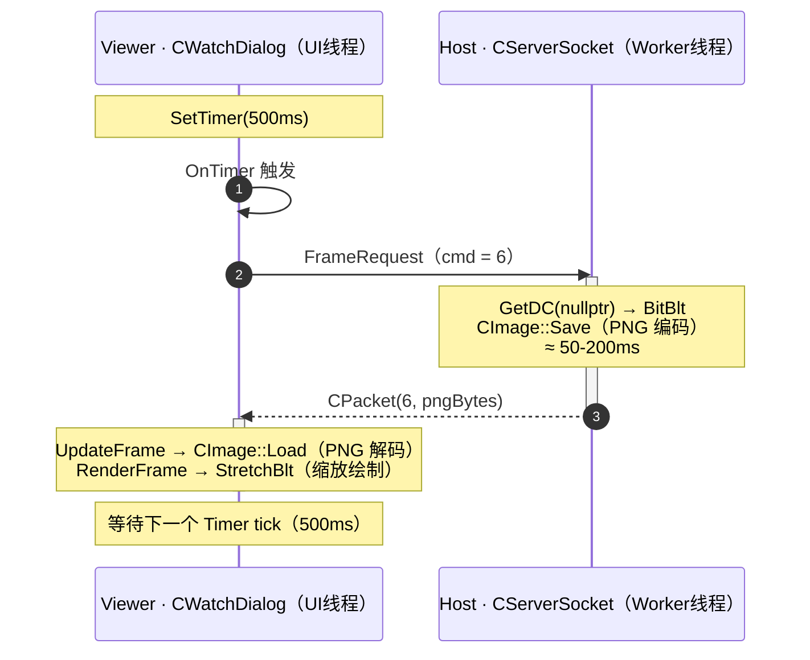

# GDI 屏幕捕获与 PNG 编码

> [!abstract]
> `ScreenCapture.cpp` 实现了远控服务端的屏幕截取功能。
> 本笔记分析 Windows GDI 截屏流程（`GetDC` → `BitBlt` → `CImage`）、GDI+ PNG 编码、内存流输出、以及性能考量。

---

## 1. 模块定位

`CapturePrimaryMonitorPng` 是一个**无状态的自由函数**，每次调用完成一次完整的"截屏 → 编码 → 输出"流程：

```
┌─────────────┐     FrameRequest      ┌────────────────────────────┐
│  Viewer端   │  ──────────────────►  │  ServerSocket::HandlePacket │
│ (定时器500ms)│  ◄──────────────────  │         ↓                  │
│             │     PNG bytes          │  CapturePrimaryMonitorPng()│
└─────────────┘                        └────────────────────────────┘
```

**调用链**：`CWatchDialog::OnTimer` → 发送 `FrameRequest` → `CServerSocket::HandlePacket` → `CapturePrimaryMonitorPng` → PNG 字节通过 `CPacket` 发回。

---

## 2. 完整截屏流程

### 2.1 函数签名

```cpp
// ScreenCapture.h
bool CapturePrimaryMonitorPng(std::string& pngBytes);
```

- **返回值**：`true` 表示截屏+编码成功，`pngBytes` 包含完整 PNG 二进制数据
- **输出参数**：`std::string` 作为二进制缓冲区（不是文本，是原始字节）

> [!tip] 为什么用 `std::string` 而不是 `std::vector<char>`？
> 因为 [[6.1.3 SharedPacket 数据包序列化与解析|CPacket]] 的 Payload 类型就是 `std::string`，直接使用避免了一次拷贝。`std::string` 完全可以存储含 `\0` 的二进制数据（`.size()` 不依赖 null terminator）。

### 2.2 阶段一：GDI 屏幕捕获

```cpp
// ── 获取桌面 DC ──
HDC screenDc = ::GetDC(nullptr);  // nullptr = 整个桌面
if (screenDc == nullptr) return false;

// ── 获取主显示器尺寸 ──
const int width  = GetSystemMetrics(SM_CXSCREEN);   // 主显示器宽度（像素）
const int height = GetSystemMetrics(SM_CYSCREEN);   // 主显示器高度（像素）

// ── 创建内存位图 ──
CImage image;
if (FAILED(image.Create(width, height, 32)))         // 32位 = ARGB
{
    ::ReleaseDC(nullptr, screenDc);
    return false;
}

// ── 位块传输（核心截屏操作）──
BitBlt(image.GetDC(), 0, 0, width, height,           // 目标：CImage 内部 DC
       screenDc, 0, 0, SRCCOPY);                      // 源：桌面 DC
image.ReleaseDC();                                     // ★ 必须先释放 CImage 的 DC
::ReleaseDC(nullptr, screenDc);                        // ★ 再释放桌面 DC
```

#### 关键 API 详解

| API | 作用 | 技术细节 |
|-----|------|----------|
| `GetDC(nullptr)` | 获取整个桌面的设备上下文 | 传 `nullptr` 返回的是**包含所有显示器的虚拟屏幕** DC |
| `GetSystemMetrics(SM_CXSCREEN)` | 获取**主显示器**宽度 | 多显示器环境下只取主屏。若需全屏幕，应使用 `SM_CXVIRTUALSCREEN` |
| `CImage::Create(w, h, 32)` | 创建 32 位 DIB 位图 | 底层调用 `CreateDIBSection`，像素格式为 BGRA（每像素 4 字节） |
| `BitBlt` | 位块传输 | 从源 DC 拷贝像素到目标 DC，`SRCCOPY` 表示直接拷贝 |

#### BitBlt 工作原理

```
         GetDC(nullptr)                  CImage::GetDC()
              │                                │
              ▼                                ▼
  ┌───────────────────┐    BitBlt      ┌──────────────────┐
  │   桌面 DC         │  ──────────►   │  内存兼容 DC      │
  │  (显卡帧缓冲区)    │   SRCCOPY     │  (CImage 内部)    │
  │  SM_CXSCREEN ×     │               │  CreateDIBSection │
  │  SM_CYSCREEN       │               │  32-bit BGRA      │
  └───────────────────┘               └──────────────────┘
```

`BitBlt` 是 GDI 中最基础的光栅操作（ROP），`SRCCOPY`（`0x00CC0020`）直接将源矩形的像素拷贝到目标矩形，不做任何位运算。

> [!warning] DC 释放顺序
> 必须先调用 `image.ReleaseDC()` 释放 CImage 的内部 DC，再调用 `::ReleaseDC(nullptr, screenDc)` 释放桌面 DC。如果顺序反了，`CImage` 仍持有一个关联到已释放桌面 DC 的兼容 DC，后续操作可能导致 GDI 资源泄漏或未定义行为。

### 2.3 阶段二：PNG 编码与内存流

```cpp
// ── 分配全局内存块（作为 IStream 的后端）──
HGLOBAL memoryHandle = ::GlobalAlloc(GMEM_MOVEABLE, 0);   // 初始大小为 0
if (memoryHandle == nullptr) return false;

// ── 创建 COM IStream 包装器 ──
IStream* stream = nullptr;
if (FAILED(::CreateStreamOnHGlobal(memoryHandle, FALSE, &stream)) || stream == nullptr)
{
    ::GlobalFree(memoryHandle);
    return false;
}

// ── GDI+ PNG 编码 ──
bool success = false;
if (SUCCEEDED(image.Save(stream, Gdiplus::ImageFormatPNG)))
{
    // ── 从 IStream 提取 PNG 字节 ──
    HGLOBAL streamHandle = nullptr;
    if (SUCCEEDED(::GetHGlobalFromStream(stream, &streamHandle)) && streamHandle != nullptr)
    {
        const SIZE_T size = ::GlobalSize(streamHandle);
        void* data = ::GlobalLock(streamHandle);
        if (data != nullptr && size > 0)
        {
            pngBytes.assign(static_cast<const char*>(data),
                            static_cast<const char*>(data) + size);
            success = true;
            ::GlobalUnlock(streamHandle);
        }
    }
}

// ── 清理资源 ──
stream->Release();            // 释放 COM 接口
::GlobalFree(memoryHandle);   // 释放全局内存
return success;
```

#### IStream 内存流模式详解

```
CreateStreamOnHGlobal(memoryHandle, FALSE, &stream)
    │                         │
    │  FALSE = 调用者负责释放   │
    ▼                         ▼
┌─────────────────────────────────────────┐
│  IStream (COM 流接口)                    │
│  ┌─────────────────────────────────┐    │
│  │  HGLOBAL (可移动全局内存)         │    │
│  │  ┌───────────────────────────┐  │    │
│  │  │  PNG 二进制数据             │  │    │
│  │  │  (由 GDI+ 编码器写入)       │  │    │
│  │  └───────────────────────────┘  │    │
│  └─────────────────────────────────┘    │
└─────────────────────────────────────────┘
         │
         ▼ GetHGlobalFromStream → GlobalLock → 读取字节
```

| 参数/函数 | 作用 | 关键细节 |
|-----------|------|----------|
| `GMEM_MOVEABLE` | 分配可移动内存 | `IStream` 要求后端内存必须可移动（会在写入时自动扩展） |
| 初始大小 `0` | 空分配 | `IStream::Write`（由 `CImage::Save` 内部调用）会自动 `GlobalReAlloc` 扩展 |
| `FALSE`（第二参数） | 不自动释放 | `stream->Release()` 时**不会**释放 `memoryHandle`，调用者需手动 `GlobalFree` |
| `GetHGlobalFromStream` | 取回底层句柄 | 编码完成后通过这个函数获取写满数据的内存块 |
| `GlobalLock` / `GlobalUnlock` | 锁定内存获取指针 | `GMEM_MOVEABLE` 内存在未锁定时地址可能变化，必须先 `Lock` |

> [!warning] `CreateStreamOnHGlobal` 的 `fDeleteOnRelease` 参数
> 第二个参数传 `FALSE` 意味着 `stream->Release()` 后 `memoryHandle` 仍然有效——**调用者必须手动释放**。如果传 `TRUE`，则 `Release()` 时自动释放，之后再调用 `GlobalFree` 会导致**双重释放**崩溃。

### 2.4 CImage::Save 内部做了什么

`CImage::Save(IStream*, GUID)` 的内部流程：

```
CImage::Save(stream, ImageFormatPNG)
    │
    ├── 1. 从 CImage 内部 HBITMAP 创建 Gdiplus::Bitmap 对象
    │       └── Gdiplus::Bitmap::FromHBITMAP(m_hBitmap, nullptr)
    │
    ├── 2. 查找 PNG 编码器的 CLSID
    │       └── 遍历 Gdiplus::GetImageEncoders() 找到 image/png 的编码器
    │
    └── 3. 调用 Gdiplus::Image::Save(IStream*, clsidPngEncoder, nullptr)
            └── GDI+ 内部执行 DEFLATE 压缩，写入 PNG 文件格式
                ├── PNG Signature (8 bytes)
                ├── IHDR chunk (图像尺寸、位深、颜色类型)
                ├── IDAT chunk(s) (DEFLATE 压缩的像素数据)
                └── IEND chunk
```

**关键技术点**：
- `CImage` 是 ATL（Active Template Library）提供的图像封装类，定义在 `<atlimage.h>`
- 底层依赖 **GDI+** 进行 PNG 编码（需要 GDI+ 运行时，Windows XP+ 自带）
- PNG 使用 **DEFLATE** 无损压缩，压缩率取决于屏幕内容复杂度
- 压缩级别不可通过 `CImage::Save` 直接配置（GDI+ 使用默认压缩级别）

---

## 3. 客户端解码与渲染

### 3.1 PNG 解码（CWatchDialog::UpdateFrame）

```cpp
void CWatchDialog::UpdateFrame(const std::string& pngBytes)
{
    // 1. 分配全局内存并拷贝 PNG 数据
    HGLOBAL memoryHandle = ::GlobalAlloc(GMEM_MOVEABLE, pngBytes.size());
    void* memory = ::GlobalLock(memoryHandle);
    memcpy(memory, pngBytes.data(), pngBytes.size());
    ::GlobalUnlock(memoryHandle);

    // 2. 创建 IStream 包装器（TRUE = Release 时自动释放）
    IStream* stream = nullptr;
    ::CreateStreamOnHGlobal(memoryHandle, TRUE, &stream);   // ← 注意这里是 TRUE

    // 3. 销毁旧图像，加载新 PNG
    if ((HBITMAP)m_image != nullptr) m_image.Destroy();
    m_image.Load(stream);    // CImage::Load 使用 GDI+ 解码 PNG → HBITMAP

    // 4. 渲染到屏幕
    RenderFrame();
    stream->Release();       // 同时释放 memoryHandle（因为 TRUE）
}
```

> [!note] 服务端 vs 客户端的 `fDeleteOnRelease` 差异
> - **服务端**：`CreateStreamOnHGlobal(..., FALSE, ...)`——手动释放，因为需要在 `Release` 后读取数据
> - **客户端**：`CreateStreamOnHGlobal(..., TRUE, ...)`——自动释放，`Load` 后不再需要原始数据

### 3.2 帧渲染（CWatchDialog::RenderFrame）

```cpp
void CWatchDialog::RenderFrame()
{
    CRect rect;
    m_picture.GetClientRect(&rect);                        // 获取 Static 控件尺寸
    CDC* pictureDc = m_picture.GetDC();

    pictureDc->FillSolidRect(&rect, RGB(0, 0, 0));         // 黑色背景填充
    m_image.StretchBlt(pictureDc->GetSafeHdc(),             // 缩放绘制
                       0, 0, rect.Width(), rect.Height(),
                       SRCCOPY);
    m_picture.ReleaseDC(pictureDc);
}
```

**`StretchBlt` 缩放**：将远程桌面（如 1920×1080）缩放到本地 Static 控件大小。`StretchBlt` 默认使用 `COLORONCOLOR` 缩放模式（丢弃像素），速度快但质量一般。

---

## 4. 帧传输完整时序

Viewer 的 **UI 线程**（定时器驱动）与 Host 的 **Worker 线程**（`CServerSocket` 单工作线程）通过 `CPacket` 跨网络通讯，构成一问一答的请求-响应循环：



> [!note] 为什么是串行的一问一答？
> Host 端只有**一个** Worker 线程处理截屏，Viewer 端在收到上一帧并渲染完成后才会等待下一个定时器 tick。因此整条链路是串行的，实际帧率受"截屏 + 编码 + 网络 + 解码"总耗时与 500ms 间隔中**较大者**约束。

下图从**数据形态**的角度补充时序图：同一帧画面在链路上经历的体积变化与各阶段操作（与上方时序图为同一过程的两个视角）。

![[图片/6.项目/06.远控服务端/6.2 屏幕捕获/6_2_2_1_1.svg]]

**帧率分析**：
- 定时器间隔：`kFrameIntervalMs = 500ms`（2 FPS 上限）
- 实际帧率 ≈ `1000 / (500 + 截屏耗时 + 编码耗时 + 网络延迟)` ≈ **1-1.5 FPS**
- 这对远程协助场景（看对方屏幕排查问题）足够，不需要实时流畅

---

## 5. 资源管理分析

### 5.1 GDI 资源生命周期

```cpp
bool CapturePrimaryMonitorPng(std::string& pngBytes)
{
    pngBytes.clear();

    HDC screenDc = ::GetDC(nullptr);           // ← 获取 GDI 资源 ①
    // ...
    CImage image;
    image.Create(width, height, 32);            // ← 获取 GDI 资源 ②（HBITMAP + HDC）
    // ...
    BitBlt(image.GetDC(), ...);                 // ← CImage 内部 GetDC() → 资源 ③
    image.ReleaseDC();                          // ← 释放资源 ③
    ::ReleaseDC(nullptr, screenDc);             // ← 释放资源 ①

    HGLOBAL memoryHandle = ::GlobalAlloc(...);  // ← 堆资源 ④
    IStream* stream = ...;                      // ← COM 资源 ⑤
    // ...
    stream->Release();                          // ← 释放资源 ⑤
    ::GlobalFree(memoryHandle);                 // ← 释放资源 ④
    return success;
}                                               // CImage 析构 → 释放资源 ②
```

### 5.2 错误路径资源泄漏检查

| 错误点 | 已获取的资源 | 清理是否正确 |
|--------|-------------|-------------|
| `GetDC` 失败 | 无 | 直接 return，正确 |
| `Create` 失败 | screenDc | 手动释放 screenDc，正确 |
| `GlobalAlloc` 失败 | screenDc, image | screenDc 已释放，image 由 CImage 析构释放，正确 |
| `CreateStreamOnHGlobal` 失败 | memoryHandle | 手动 `GlobalFree`，正确 |
| `Save` 失败 | stream, memoryHandle | 走到函数末尾统一释放，正确 |

> [!tip] CImage 的 RAII 特性
> `CImage` 的析构函数会自动调用 `Destroy()`，释放内部持有的 `HBITMAP`。这是 C++ RAII 原则的体现——栈上的 `CImage image` 在函数退出时自动清理，无需手动释放。对比之下，`HDC`、`HGLOBAL`、`IStream*` 都需要手动管理。

---

## 6. 性能考量

### 6.1 性能瓶颈分析

| 阶段 | 耗时估算 | 瓶颈来源 |
|------|----------|----------|
| `GetDC` + `BitBlt` | ~5-15ms | 显卡到内存的 DMA 传输 |
| `CImage::Save (PNG)` | ~30-150ms | DEFLATE 压缩（CPU 密集） |
| 网络传输 | ~10-100ms | 取决于 PNG 大小和带宽 |
| `CImage::Load (PNG)` | ~10-30ms | DEFLATE 解压 |
| `StretchBlt` | ~1-5ms | GDI 缩放渲染 |

**PNG 编码是最大瓶颈**。1920×1080 × 32bit = **~8MB** 原始像素数据，PNG 压缩后通常 **200KB-2MB**（取决于屏幕内容），压缩过程涉及大量 CPU 计算。

### 6.2 PNG 数据量估算

| 屏幕内容 | 原始大小 | PNG 压缩后 | 压缩率 |
|----------|----------|-----------|--------|
| 纯色桌面 | 8.3 MB | ~50 KB | 0.6% |
| 文本编辑器 | 8.3 MB | ~200 KB | 2.4% |
| 复杂网页 | 8.3 MB | ~800 KB | 9.6% |
| 照片/视频 | 8.3 MB | ~2 MB | 24% |

### 6.3 与其他截屏方案的对比

| 方案 | 优点 | 缺点 | 适用场景 |
|------|------|------|----------|
| **GDI BitBlt**（本项目） | 简单可靠，兼容性好 | 不捕获硬件叠加层，速度中等 | 远程协助，低帧率 |
| DXGI Desktop Duplication | 高性能，GPU 加速 | 仅 Win8+，API 复杂 | 高帧率屏幕录制 |
| Windows.Graphics.Capture | 可捕获特定窗口 | 仅 Win10 1803+，需 UWP | 现代应用截屏 |
| Mirror Driver | 仅传输变化区域 | 已弃用（Win8+不支持） | 旧式远控 |

> [!warning] GDI BitBlt 的已知限制
> - **不捕获 Direct3D/OpenGL 覆盖层**：全屏游戏、某些视频播放器的硬件加速内容可能显示为黑色区域
> - **不处理 DPI 缩放**：如果系统设置了 125%/150% 缩放，`GetSystemMetrics` 返回的是缩放后的逻辑像素，实际截图可能模糊
> - **仅主显示器**：`SM_CXSCREEN`/`SM_CYSCREEN` 只获取主显示器尺寸

---

## 7. 设计决策与权衡

### 7.1 为什么选 PNG 而不是 JPEG？

| 维度 | PNG | JPEG |
|------|-----|------|
| 压缩类型 | 无损 | 有损 |
| 文字清晰度 | 完美 | 有模糊（尤其小字体） |
| 典型大小 | 较大 | 较小（可调质量） |
| 编码速度 | 较慢（DEFLATE） | 较快 |
| 适合场景 | 远程协助（需看清文字） | 视频流（帧率优先） |

在远程协助场景中，用户需要**看清对方屏幕上的文字和 UI 元素**，PNG 的无损特性保证了这一点。代价是压缩率略低、编码稍慢，但在 500ms 帧间隔下完全可以接受。

### 7.2 为什么不直接传 BMP？

原始 BMP 约 8MB/帧，按 500ms 间隔需要 **128 Mbps** 带宽——远超局域网合理范围。PNG 压缩后 200KB-2MB/帧，带宽需求降低到 **3-32 Mbps**，更加实际。

### 7.3 为什么用内存流而不是临时文件？

```
方案一（临时文件）：  CImage::Save("temp.png") → ReadFile → DeleteFile
方案二（内存流）  ：  CImage::Save(IStream*)   → GlobalLock → 读取

方案二优势：
  ✓ 避免磁盘 I/O（~ms 级延迟 vs ~μs 级内存操作）
  ✓ 无需处理文件路径、权限、并发访问
  ✓ 无临时文件残留风险
  ✗ 需要理解 COM IStream + GlobalAlloc 模型
```

---

## 8. 陷阱与注意事项

> [!warning] 常见错误一：忘记 `image.ReleaseDC()`
> `CImage::GetDC()` 内部调用 `::CreateCompatibleDC` + `::SelectObject`，如果不调用 `ReleaseDC()`，后续的 `Save()` 会失败。因为 GDI+ 无法访问一个 DC 仍在使用中的 HBITMAP。

> [!warning] 常见错误二：`GlobalLock` 返回的指针在 `GlobalUnlock` 后失效
> `GMEM_MOVEABLE` 内存在 `GlobalUnlock` 后不保证地址不变——Windows 内存管理器可能移动它。必须在 `Lock` / `Unlock` 之间完成所有读写操作。本项目在 `Lock` 和 `Unlock` 之间调用 `pngBytes.assign()` 完成了数据拷贝。

> [!warning] 常见错误三：多线程安全
> `CapturePrimaryMonitorPng` 依赖 GDI 和 GDI+，它们都有线程亲和性限制。本项目中该函数在 `CServerSocket` 的 Worker 线程中调用，且只有一个 Worker 线程，因此不存在并发问题。但如果多线程调用，需要加锁或每个线程维护独立的 GDI+ 上下文。

---

## 9. 面试表达

> [!tip] 面试口述版
> "屏幕截取模块使用 **GDI BitBlt** 完成像素捕获：通过 `GetDC(nullptr)` 获取桌面 DC，用 `CImage::Create` 创建一个 32 位 DIB 内存位图，然后 `BitBlt` 将桌面像素拷贝到内存位图。编码阶段利用 **ATL CImage** 封装的 GDI+ 编码器，将位图以 **PNG 格式** 写入一个 COM `IStream` 内存流（底层是 `GlobalAlloc` 的可移动堆内存），最后通过 `GlobalLock` 提取 PNG 字节。整个过程约 50-200ms，配合 500ms 帧间隔实现约 1-2 FPS 的屏幕共享。选择 PNG 是因为远程协助场景需要**无损压缩**保证文字清晰度；使用内存流而非临时文件避免了磁盘 I/O 开销。"

---

## 10. 已知局限与优化方向

| 局限 | 说明 | 可能的优化 |
|------|------|-----------|
| 仅主显示器 | `SM_CXSCREEN` 不含多屏 | 改用 `EnumDisplayMonitors` + `SM_CXVIRTUALSCREEN` |
| 无增量传输 | 每帧都是完整 PNG | 实现脏矩形检测，只传输变化区域 |
| 编码慢 | GDI+ PNG 编码约 50-150ms | 可切换 `libpng`（可控压缩级别）或降级为 JPEG |
| 固定帧率 | 500ms 间隔不自适应 | 根据网络带宽/CPU 负载动态调整 |
| 无 DPI 感知 | 高 DPI 下可能截图模糊 | 调用 `SetProcessDPIAware()` 或声明 DPI 感知清单 |
| 不捕获硬件叠加 | D3D/OpenGL 内容可能黑屏 | 切换到 DXGI Desktop Duplication |

---

## 代码索引

| 功能 | 文件 | 位置 |
|------|------|------|
| 截屏函数声明 | `RemoteCtrl/ScreenCapture.h` | 第 5 行 |
| 截屏函数实现 | `RemoteCtrl/ScreenCapture.cpp` | 第 6-63 行 |
| 帧请求处理 | `RemoteCtrl/ServerSocket.cpp` | 第 356-362 行 |
| 帧间隔配置 | `ScreenShareProtocol.h` | 第 9 行 `kFrameIntervalMs = 500` |
| 客户端解码 | `RemoteClient/CWatchDialog.cpp` | 第 52-94 行 |
| 客户端渲染 | `RemoteClient/CWatchDialog.cpp` | 第 144-162 行 |

---

## 关联笔记

- [[6.1.1 ServerSocket 网络架构与 select 多路复用]] — `HandlePacket` 中调用截屏函数的上下文
- [[6.1.2 ScreenShareProtocol 协议设计]] — `FrameRequest` 命令码定义与帧传输协议
- [[6.1.3 SharedPacket 数据包序列化与解析]] — PNG 字节作为 `CPacket` Payload 的封装传输
- [[6.0 远控服务端项目总结]] — 项目总览
