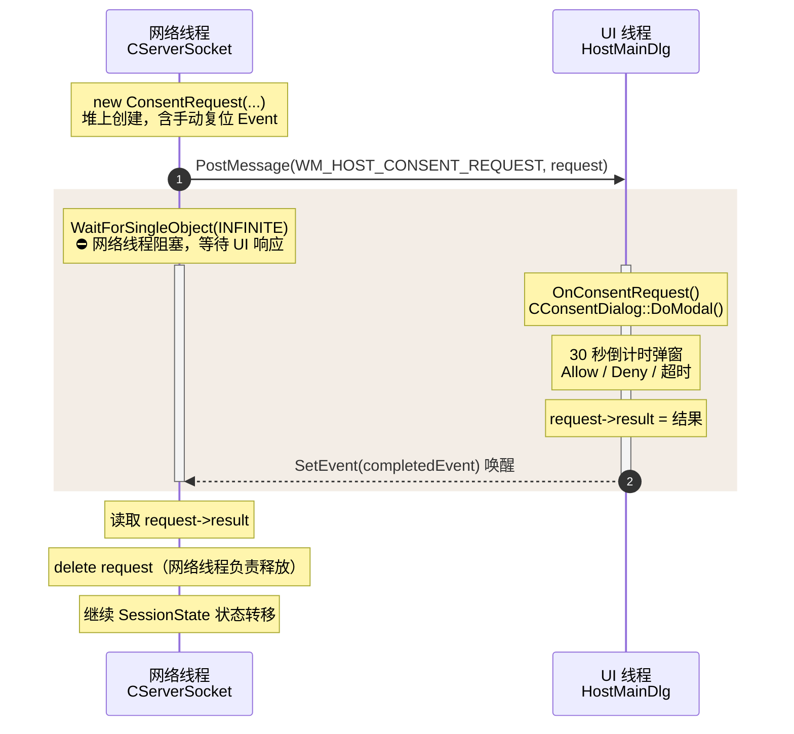

# SessionPolicy 会话生命周期管理

> [!abstract]
> `CSessionPolicy` 管理远控服务端的会话生命周期。
> 本笔记分析默认 60 分钟时限、55 分钟延长提示、每次 +15 分钟延长机制、流类型同意追踪（Screen/Microphone/Camera）、以及定时器过期检查逻辑。
> 同时覆盖 `SessionState` 状态机、`ConsentRequest` 跨线程同意流程、`ConsentDialog` 倒计时弹窗，以及 `HostMainDlg` 中的 UI 集成与定时器驱动。

---

## 1. 模块定位

![[图片/6.项目/06.远控服务端/6.3 会话管理/6_3_3_1_2.svg]]

**关键职责分工**：
- `CSessionPolicy`：纯策略类，管理时限计算和流同意状态，**无线程同步**
- `CServerSocket`：持有 `SessionState` 状态机，在网络线程执行状态转移
- `ConsentRequest` + `CConsentDialog`：跨线程同意流程的桥梁
- `HostMainDlg`：将所有组件绑定到 MFC UI 事件循环

---

## 2. 会话状态机

### 2.1 四状态定义

```cpp
// ServerSocket.h:78
enum class SessionState
{
    Idle,               // 无客户端连接
    AwaitingHello,      // TCP 已 accept，等待 Hello 握手
    WaitingForConsent,  // Hello 验证通过，等待主机用户同意
    Sharing,            // 正在共享屏幕
};
```

### 2.2 状态转移图

![[图片/6.项目/06.远控服务端/6.3 会话管理/6_3_3_1_3.svg]]

### 2.3 关键转移代码

**Idle → AwaitingHello**（`AcceptClient`，accept 新连接后设置状态）：

**AwaitingHello → WaitingForConsent**（`HandlePacket`，验证通过后）：
```cpp
// ServerSocket.cpp:324
{
    std::lock_guard<std::mutex> guard(m_stateMutex);
    m_helperName = helperName;
    m_sessionState = SessionState::WaitingForConsent;
}
SendStatus(ScreenShareProtocol::WaitingForConsent);
```

**WaitingForConsent → Sharing**（同意被批准）：
```cpp
// ServerSocket.cpp:333
const ScreenShareProtocol::Status consentStatus = RequestConsent();
if (consentStatus == ScreenShareProtocol::Approved)
{
    {
        std::lock_guard<std::mutex> guard(m_stateMutex);
        m_sessionState = SessionState::Sharing;
    }
    SendStatus(ScreenShareProtocol::Approved);
}
```

**任意活跃状态 → Idle**（`ResetClient`）：
```cpp
// ServerSocket.cpp:393
void CServerSocket::ResetClient()
{
    CloseSocket(m_clientSocket);
    std::lock_guard<std::mutex> guard(m_stateMutex);
    m_peerIp.Empty();
    m_helperName.Empty();
    m_sessionState = SessionState::Idle;
    m_wrongAttempts = 0;
    m_endSessionRequested = false;
    m_endSessionDetail = _T("Session ended locally.");
    m_receiveBuffer.clear();
}
```

### 2.4 Hello 握手防暴力破解

```cpp
// ServerSocket.cpp:310
++m_wrongAttempts;
::Sleep(500);                                      // 故意延迟 500ms 增加暴力成本
SendStatus(ScreenShareProtocol::BadCode);
if (m_wrongAttempts >= ScreenShareProtocol::kMaxSessionCodeAttempts)  // 最多 3 次
{
    ResetClient();  // 断开连接
}
```

> [!warning] Sleep(500) 在网络线程
> `Sleep(500)` 直接阻塞网络线程。单客户端架构下影响可控，但若改为多客户端模型则需异步延迟。

---

## 3. CSessionPolicy 时限策略

### 3.1 时间常量体系

```cpp
// SessionPolicy.h:22
static constexpr UINT_PTR kTimerId           = 10;
static constexpr UINT     kTimerIntervalMs   = 1000;       // 1 秒轮询
static constexpr DWORD    kDefaultLimitSeconds = 60 * 60;   // 60 分钟 = 3600 秒
static constexpr DWORD    kExtendPromptSeconds = 55 * 60;   // 55 分钟 = 3300 秒
static constexpr DWORD    kExtensionSeconds    = 15 * 60;   // 15 分钟 = 900 秒
```

**时间线示意**：

![[图片/6.项目/06.远控服务端/6.3 会话管理/6_3_3_1_4.svg]]

### 3.2 Start — 会话开始

```cpp
// SessionPolicy.cpp:10
void CSessionPolicy::Start()
{
    m_startedTick = ::GetTickCount64();                       // 记录起始 tick
    m_allowedSeconds = kDefaultLimitSeconds;                   // 重置为 3600 秒
    m_active = true;
    m_extensionPrompted = false;
    m_streamConsent.fill(AssistStreamConsent::NotRequested);   // 全部重置
    SetStreamConsent(AssistStreamId::Screen, AssistStreamConsent::Approved);  // 屏幕自动批准
}
```

> [!tip] 为什么 Screen 自动批准？
> 当前产品只支持屏幕共享。用户在 ConsentDialog 中已经明确同意了"屏幕访问"，所以 `Start()` 被调用时 Screen 自动标记为 Approved。Microphone/Camera 保留为 `NotRequested` 供未来扩展。

### 3.3 时间计算

```cpp
// SessionPolicy.cpp:56
DWORD CSessionPolicy::ElapsedSeconds() const
{
    if (!m_active) return 0;
    return static_cast<DWORD>((::GetTickCount64() - m_startedTick) / 1000);
}

// SessionPolicy.cpp:66
DWORD CSessionPolicy::RemainingSeconds() const
{
    const DWORD elapsedSeconds = ElapsedSeconds();
    return elapsedSeconds >= m_allowedSeconds ? 0 : m_allowedSeconds - elapsedSeconds;
}
```

**使用 `GetTickCount64()` 的优势**：
- 返回系统启动后的毫秒数，单调递增
- 64 位，不存在 `GetTickCount()` 的 49.7 天溢出问题
- 不受系统时钟修改影响（区别于 `time()` / `GetSystemTime()`）

### 3.4 过期判定与延长提示

```cpp
// SessionPolicy.cpp:52
bool CSessionPolicy::IsExpired() const
{
    return m_active && ElapsedSeconds() >= m_allowedSeconds;
}

// SessionPolicy.cpp:46
bool CSessionPolicy::ShouldPromptForExtension() const
{
    return m_active && !m_extensionPrompted && ElapsedSeconds() >= kExtendPromptSeconds;
}
```

关键设计：`m_extensionPrompted` 是一次性标志。`ShouldPromptForExtension()` 返回 true 后，由调用方（`HostMainDlg::OnTimer`）调用 `MarkExtensionPrompted()` 将其置 true，防止重复触发。

### 3.5 Extend — 延长会话

```cpp
// SessionPolicy.cpp:27
void CSessionPolicy::Extend()
{
    if (m_active)
    {
        m_allowedSeconds += kExtensionSeconds;   // +900 秒
        m_extensionPrompted = false;             // 重置，允许下一次 55 分钟提示
    }
}
```

> [!important] 延长可无限次叠加
> `Extend()` 没有上限检查。每次 +15 分钟，且 `m_extensionPrompted = false` 使得到达新的 55 分钟阈值时再次提示。理论上用户可以无限延长会话。

### 3.6 Stop — 会话终止

```cpp
// SessionPolicy.cpp:20
void CSessionPolicy::Stop()
{
    m_active = false;
    m_extensionPrompted = false;
    m_streamConsent.fill(AssistStreamConsent::NotRequested);   // 全部撤销
}
```

`Stop()` 不重置 `m_startedTick` 和 `m_allowedSeconds`，因为 `m_active = false` 后 `ElapsedSeconds()` 直接返回 0，这些字段不会被访问。

---

## 4. 流类型同意追踪

### 4.1 枚举定义

```cpp
// SessionPolicy.h:5
enum class AssistStreamId
{
    Screen = 0,
    Microphone = 1,
    Camera = 2,
    Count = 3,       // 哨兵值，用于数组大小
};

enum class AssistStreamConsent
{
    NotRequested,    // 未请求该流
    Approved,        // 已批准
};
```

### 4.2 存储与访问

```cpp
// SessionPolicy.h:45
std::array<AssistStreamConsent, static_cast<size_t>(AssistStreamId::Count)> m_streamConsent;

// SessionPolicy.cpp:72
void CSessionPolicy::SetStreamConsent(AssistStreamId streamId, AssistStreamConsent consent)
{
    m_streamConsent[StreamIndex(streamId)] = consent;
}

// SessionPolicy.cpp:82 — 枚举到索引的安全转换
size_t CSessionPolicy::StreamIndex(AssistStreamId streamId)
{
    return static_cast<size_t>(streamId);
}
```

**当前使用情况**：仅 Screen 流在 `Start()` 中被自动设为 `Approved`，用于 UI Banner 的流指示器显示：
```cpp
// HostMainDlg.cpp:282
m_banner.UpdateIndicators(
    m_sessionPolicy.GetStreamConsent(AssistStreamId::Screen) == AssistStreamConsent::Approved,
    false,                                 // Microphone: 硬编码 false
    m_sessionPolicy.RemainingSeconds());
```

---

## 5. ConsentRequest 跨线程同意流程

这是整个会话管理中最复杂的线程协调机制。

### 5.1 数据结构

```cpp
// ServerSocket.h:34
struct ConsentRequest
{
    ConsentRequest(...)
        : ...,
          completedEvent(::CreateEvent(nullptr, TRUE, FALSE, nullptr)),  // 手动复位事件
          result(ScreenShareProtocol::Denied)                           // 默认拒绝
    { }

    ~ConsentRequest()
    {
        if (completedEvent != nullptr)
        {
            ::CloseHandle(completedEvent);
        }
    }

    CString peerIp, helperName, sessionCode, hostName;
    HANDLE completedEvent;                     // 跨线程信号
    ScreenShareProtocol::Status result;        // UI 线程写入结果
};
```

### 5.2 完整流程时序



> [!note] 时序要点
> 灰底区间是**网络线程被阻塞**的窗口：从 `PostMessage` 投递后到 UI 线程 `SetEvent` 之间，网络线程在 `WaitForSingleObject(INFINITE)` 上挂起。`request` 指针的所有权全程归网络线程，UI 线程只读字段并写 `result`，绝不释放。

### 5.3 网络线程侧

```cpp
// ServerSocket.cpp:373
ScreenShareProtocol::Status CServerSocket::RequestConsent()
{
    if (!::IsWindow(m_ownerWnd))
        return ScreenShareProtocol::Denied;

    // 在堆上创建，因为要跨线程传递
    ConsentRequest* request = new ConsentRequest(
        GetPeerIp(), CurrentHelperName(),
        CurrentSessionCode(), GetLocalHostName());

    // PostMessage 是异步的 — 消息入队后立即返回
    if (!::PostMessage(m_ownerWnd, WM_HOST_CONSENT_REQUEST,
                       0, reinterpret_cast<LPARAM>(request)))
    {
        delete request;
        return ScreenShareProtocol::Denied;
    }

    // 阻塞网络线程，直到 UI 线程 SetEvent
    ::WaitForSingleObject(request->completedEvent, INFINITE);
    const ScreenShareProtocol::Status result = request->result;
    delete request;       // 网络线程负责释放
    return result;
}
```

### 5.4 UI 线程侧

```cpp
// HostMainDlg.cpp:114
LRESULT CHostMainDlg::OnConsentRequest(WPARAM wParam, LPARAM lParam)
{
    ConsentRequest* request = reinterpret_cast<ConsentRequest*>(lParam);
    if (request == nullptr) return 0;

    CConsentDialog dialog(this);
    dialog.SetRequestDetails(request->peerIp, request->helperName,
                            request->sessionCode, request->hostName);

    // DoModal() 阻塞 UI 线程直到用户选择或超时
    request->result = (dialog.DoModal() == IDOK)
        ? ScreenShareProtocol::Approved
        : (dialog.WasTimedOut()
            ? ScreenShareProtocol::TimedOut
            : ScreenShareProtocol::Denied);

    // 记录审计日志
    AppendSessionLog(...);

    // 唤醒网络线程
    ::SetEvent(request->completedEvent);
    return 0;
}
```

> [!warning] 所有权约定
> `ConsentRequest` 由网络线程 `new`，通过 `PostMessage` 传递指针到 UI 线程，但 **UI 线程不 delete**。网络线程在 `WaitForSingleObject` 返回后负责 `delete`。这种模式要求：
> 1. `PostMessage` 成功时网络线程**必须等待**，不能提前释放
> 2. UI 线程在 `SetEvent` 之后**不能再访问** request 指针

下图把上面时序图省略的两条隐式规则——**指针所有权**与 **Event 信号方向**——拆开摊平展示：网络线程独占 `new`/`delete`，UI 线程只是借用指针读写字段；`completedEvent` 单向地从 UI 线程流回网络线程。

![[图片/6.项目/06.远控服务端/6.3 会话管理/6_3_3_1_1.svg]]

### 5.5 Windows Event 的选择

使用 `CreateEvent(nullptr, TRUE, FALSE, nullptr)`：
- **手动复位** (`TRUE`)：信号一旦设置就保持，不会被 `WaitForSingleObject` 自动复位
- **初始未信号** (`FALSE`)：创建时处于等待态
- 手动复位是正确选择 — 此 event 只会被 signal 一次，不存在 auto-reset 导致信号丢失的风险

---

## 6. ConsentDialog 30 秒倒计时

```cpp
// ConsentDialog.cpp:7
CConsentDialog::CConsentDialog(CWnd* parent)
    : CDialogEx(IDD_DIALOG_CONSENT, parent),
      m_timedOut(false),
      m_secondsRemaining(ScreenShareProtocol::kConsentTimeoutSeconds)  // 30 秒
{ }
```

### 6.1 定时器驱动

```cpp
// ConsentDialog.cpp:31
BOOL CConsentDialog::OnInitDialog()
{
    // ... 设置 UI 文本 ...
    UpdateCountdownText();
    SetTimer(1, 1000, nullptr);       // 每秒触发
    return TRUE;
}

// ConsentDialog.cpp:46
void CConsentDialog::OnTimer(UINT_PTR eventId)
{
    if (eventId == 1)
    {
        if (m_secondsRemaining > 0)
            --m_secondsRemaining;

        UpdateCountdownText();         // "Auto-deny in X seconds"

        if (m_secondsRemaining == 0)
        {
            m_timedOut = true;
            KillTimer(1);
            EndDialog(IDCANCEL);       // 自动关闭，返回 IDCANCEL
            return;
        }
    }
    CDialogEx::OnTimer(eventId);
}
```

### 6.2 三种退出路径

| 用户操作 | DoModal() 返回值 | WasTimedOut() | 映射结果 |
|---------|-----------------|---------------|---------|
| 点击 Allow | `IDOK` | `false` | `Approved` |
| 点击 Deny | `IDCANCEL` | `false` | `Denied` |
| 30 秒超时 | `IDCANCEL` | `true` | `TimedOut` |

---

## 7. HostMainDlg UI 集成

### 7.1 StartSession — 会话启动

```cpp
// HostMainDlg.cpp:218
void CHostMainDlg::StartSession(const HostServerEventPayload& payload)
{
    m_activeHelperName = payload.helperName;
    m_activePeerIp = payload.peerIp;
    m_sessionPolicy.Start();                    // 启动 60 分钟计时

    // 更新窗口标题和状态栏
    // ...

    GetDlgItem(IDC_BTN_STOP_SHARING)->EnableWindow(TRUE);
    GetDlgItem(IDC_BTN_EXTEND_SESSION)->EnableWindow(FALSE);   // 延长按钮初始禁用

    m_banner.ShowBanner(..., m_sessionPolicy.RemainingSeconds());
    SetTimer(CSessionPolicy::kTimerId, CSessionPolicy::kTimerIntervalMs, nullptr);  // 启动 1 秒轮询

    AppendSessionLog(_T("session_started"), payload.detail);
}
```

### 7.2 OnTimer — 每秒轮询

```cpp
// HostMainDlg.cpp:181
void CHostMainDlg::OnTimer(UINT_PTR eventId)
{
    if (eventId == CSessionPolicy::kTimerId)
    {
        // 检查 1：会话是否已过期
        if (m_sessionPolicy.IsExpired())
        {
            AppendSessionLog(_T("session_expired"), ...);
            m_server.EndSession(_T("Session expired."));
            return;                            // EndSession 触发 StopSession
        }

        // 检查 2：是否该提示延长
        if (m_sessionPolicy.ShouldPromptForExtension())
        {
            m_sessionPolicy.MarkExtensionPrompted();
            GetDlgItem(IDC_BTN_EXTEND_SESSION)->EnableWindow(TRUE);   // 启用延长按钮
            UpdateStatus(_T("Session will expire soon..."));
        }

        RefreshSessionTimerUi();               // 更新 Banner 倒计时
        return;
    }

    CDialogEx::OnTimer(eventId);
}
```

### 7.3 Extend — 用户点击延长

```cpp
// HostMainDlg.cpp:168
void CHostMainDlg::OnBnClickedExtendSession()
{
    if (!m_sessionPolicy.IsActive()) return;

    m_sessionPolicy.Extend();                  // +15 分钟
    AppendSessionLog(_T("session_extended"), ...);
    RefreshSessionTimerUi();
}
```

### 7.4 StopSession — 会话终止

```cpp
// HostMainDlg.cpp:248
void CHostMainDlg::StopSession(const HostServerEventPayload& payload)
{
    KillTimer(CSessionPolicy::kTimerId);       // 停止 1 秒轮询
    m_sessionPolicy.Stop();                    // 重置策略状态
    m_activeHelperName.Empty();
    m_activePeerIp.Empty();
    m_banner.HideBanner();
    GetDlgItem(IDC_BTN_STOP_SHARING)->EnableWindow(FALSE);
    GetDlgItem(IDC_BTN_EXTEND_SESSION)->EnableWindow(FALSE);
    RefreshSessionCode();                      // 生成新的 6 位会话码
    UpdateStatus(_T("Waiting for viewer"));
}
```

> [!tip] 为什么 StopSession 要刷新会话码？
> 每次会话结束后生成新的 6 位码，确保上一个 viewer 无法用旧码重新连接。这是一种简单有效的会话隔离机制。

---

## 8. 线程同步全景

### 8.1 同步原语清单

| 原语 | 类型 | 位置 | 保护对象 |
|-----|------|------|---------|
| `m_stateMutex` | `std::mutex` | ServerSocket | `m_sessionState`, `m_peerIp`, `m_helperName`, `m_sessionCode` |
| `m_sendMutex` | `std::mutex` | ServerSocket | `send()` 调用的原子性 |
| `m_running` | `std::atomic_bool` | ServerSocket | 线程退出信号 |
| `m_endSessionRequested` | `std::atomic_bool` | ServerSocket | UI → 网络线程的终止请求 |
| `completedEvent` | Windows Event (手动复位) | ConsentRequest | 跨线程同意结果传递 |

### 8.2 线程交互模型

![[图片/6.项目/06.远控服务端/6.3 会话管理/6_3_3_1_5.svg]]

### 8.3 CSessionPolicy 的线程安全性

`CSessionPolicy` 本身**没有任何锁**。它是一个纯策略对象，所有调用都发生在 UI 线程（`StartSession`、`OnTimer`、`OnBnClickedExtendSession`、`StopSession`）。

这是正确的设计：MFC 的消息泵保证了同一时刻只有一个消息处理函数在执行，因此不需要额外同步。

> [!warning] 不要从网络线程调用 CSessionPolicy
> 如果未来需要在网络线程中查询会话策略（例如根据剩余时间调整帧率），必须加锁或通过 PostMessage 回到 UI 线程。

---

## 9. 会话终止的五条路径

| 路径 | 触发方 | 机制 | detail 文本 |
|-----|-------|------|------------|
| 定时过期 | UI 线程 OnTimer | `IsExpired()` → `EndSession()` | "Session expired." |
| 主机主动停止 | UI 线程按钮/Banner | `EndSession()` | "Session ended locally." |
| Viewer 断开 | 网络线程 ReceiveFromClient | `recv()` 返回 0 → `ResetClient()` | "Viewer disconnected." |
| Viewer 发非法命令 | 网络线程 HandlePacket | Sharing 状态收到非 FrameRequest | "Viewer sent an unexpected command." |
| 网络错误 | 网络线程 Run | `select()` 返回 `SOCKET_ERROR` | "Socket loop failed." |

所有路径最终都通过 `PostEvent(SessionEnded, ...)` 通知 UI 线程，由 `StopSession()` 统一清理。

---

## 10. 资源管理与清理

### 10.1 ConsentRequest 的 RAII

```cpp
// ServerSocket.h:46 — 析构函数关闭 Event Handle
~ConsentRequest()
{
    if (completedEvent != nullptr)
    {
        ::CloseHandle(completedEvent);
        completedEvent = nullptr;
    }
}
```

### 10.2 完整清理序列

```
StopSession() 调用链：
  1. KillTimer(kTimerId)           // 停止 1 秒轮询定时器
  2. m_sessionPolicy.Stop()        // 重置时限和流同意
  3. 清空 helper/peer 信息
  4. HideBanner()                  // 隐藏共享状态条
  5. 禁用 Stop/Extend 按钮
  6. RefreshSessionCode()          // 生成新会话码
  7. 更新状态文本
  8. RefreshRecentSessions()       // 刷新审计日志显示

ResetClient() 调用链（网络线程）：
  1. CloseSocket(m_clientSocket)   // shutdown + closesocket
  2. 清空 peer/helper 信息
  3. m_sessionState = Idle
  4. m_wrongAttempts = 0
  5. m_endSessionRequested = false
  6. m_receiveBuffer.clear()
```

---

## 11. 陷阱与警示

> [!danger] 陷阱 1：延长无上限
> `Extend()` 每次 +900 秒，无最大值检查。`m_allowedSeconds` 理论上可溢出 `DWORD` 上限（~136 年），实际不会触达但缺少防御性代码。若需限制，应在 `Extend()` 中加 `min(m_allowedSeconds + kExtensionSeconds, kMaxAllowedSeconds)`。

> [!danger] 陷阱 2：RequestConsent 的 INFINITE 等待
> `WaitForSingleObject(request->completedEvent, INFINITE)` 会无限期阻塞网络线程。若 UI 线程崩溃或窗口被意外销毁（`PostMessage` 返回 `TRUE` 但消息未被处理），网络线程将永久挂起。改进方案：使用超时等待（如 35 秒 > 30 秒倒计时），超时后返回 `Denied`。

> [!warning] 陷阱 3：Sleep(500) 阻塞网络线程
> 错误码重试延迟使用 `::Sleep(500)` 直接阻塞。单客户端架构下可接受，但阻塞期间无法响应 `m_running = false` 或 `m_endSessionRequested` 信号，导致关闭延迟。

> [!warning] 陷阱 4：CSessionPolicy 无锁设计的隐含约束
> 类自身不包含任何同步机制，完全依赖"仅在 UI 线程调用"的约定。编译器和运行时不会强制检查此约定。一旦违反（如从网络线程调用 `ElapsedSeconds()`），将产生 data race（未定义行为）。

> [!warning] 陷阱 5：GetTickCount64 精度
> `GetTickCount64()` 的精度取决于系统定时器分辨率（通常 15.6ms）。对于秒级别的会话管理足够精确，但不适用于毫秒级时间测量。

---

## 12. 设计决策分析

### 12.1 为什么用轮询而不是 WaitableTimer？

**当前方案**：`SetTimer(kTimerId, 1000)` + 每秒 `OnTimer` 轮询
**替代方案**：`CreateWaitableTimer` + 回调

选择轮询的原因：
1. MFC 的 `SetTimer` 与消息泵天然集成，无需额外线程
2. 1 秒间隔足够刷新 UI 倒计时（精度不需要更高）
3. 代码简单直观，易于维护

### 12.2 为什么 ConsentRequest 用堆分配 + PostMessage？

替代方案：使用 `SendMessage`（同步），但 `SendMessage` 在网络线程调用时会直接在 UI 线程执行回调，实际效果相同。**真正的区别**是 `PostMessage` 将消息排入队列后立即返回，配合 `WaitForSingleObject` 实现了更清晰的跨线程同步模型：

1. 消息所有权通过指针传递，生命周期清晰
2. 网络线程可以在 `PostMessage` 和 `WaitForSingleObject` 之间插入其他操作（当前没有但预留了空间）
3. 堆对象 + Event 模式是 Windows 跨线程通信的经典范式

### 12.3 为什么 Consent 超时用 ConsentDialog 内部倒计时？

替代方案：在 `RequestConsent` 中用 `WaitForSingleObject(event, 30000)` 超时

当前方案的优势：
1. 用户可以在 UI 上看到实时倒计时（"Auto-deny in X seconds"）
2. 超时行为（`WasTimedOut()`）与用户拒绝（`IDCANCEL`）可以精确区分
3. 日志可以准确记录 `consent_timed_out` vs `consent_denied`

---

## 13. 面试表达

> [!quote] 推荐表达
> "会话生命周期管理采用**策略-状态机分离**架构：`CSessionPolicy` 是无锁的纯策略类，只在 UI 线程使用，负责时限计算和流同意追踪；`SessionState` 状态机在网络线程运行，通过 `PostMessage` + Windows Event 实现跨线程同意请求。
>
> 核心的 `RequestConsent()` 使用 **生产者-消费者** 模式：网络线程堆分配 `ConsentRequest`（包含一个手动复位 Event），通过 `PostMessage` 异步投递到 UI 线程，然后 `WaitForSingleObject(INFINITE)` 阻塞等待。UI 线程弹出 30 秒倒计时对话框，用户选择后将结果写入 request 并 `SetEvent` 唤醒网络线程。所有权由网络线程管理（new/delete）。
>
> 时限策略基于 `GetTickCount64()` 单调时钟，默认 60 分钟，55 分钟时启用延长按钮，每次延长 +15 分钟。五条会话终止路径（过期/主动停止/对端断开/非法命令/网络错误）都通过 `PostEvent(SessionEnded)` 汇聚到 `StopSession()` 统一清理。"

---

## 14. 已知局限

| 局限 | 说明 | 改进方向 |
|-----|------|---------|
| 单客户端 | 一次只允许一个 Viewer | 若需多 Viewer，SessionState 需改为 per-connection |
| 无持久化 | 会话时限信息全在内存，进程重启丢失 | 可持久化到注册表或配置文件 |
| 延长无上限 | `Extend()` 可无限累加 | 添加 `kMaxSessionSeconds` 约束 |
| RequestConsent INFINITE | 极端情况下网络线程永久阻塞 | 改为带超时的等待 |
| Microphone/Camera 未实装 | 枚举已定义但 UI 逻辑未接入 | 等待产品需求 |

---

## 15. 源码索引

| 文件 | 行号 | 内容 |
|-----|------|------|
| `SessionPolicy.h` | 5-17 | `AssistStreamId` / `AssistStreamConsent` 枚举 |
| `SessionPolicy.h` | 19-50 | `CSessionPolicy` 类定义与常量 |
| `SessionPolicy.cpp` | 10-17 | `Start()` — 启动会话，Screen 自动批准 |
| `SessionPolicy.cpp` | 20-25 | `Stop()` — 重置全部状态 |
| `SessionPolicy.cpp` | 27-34 | `Extend()` — 延长 15 分钟 |
| `SessionPolicy.cpp` | 46-48 | `ShouldPromptForExtension()` — 55 分钟提示判定 |
| `SessionPolicy.cpp` | 52-54 | `IsExpired()` — 过期判定 |
| `SessionPolicy.cpp` | 56-70 | `ElapsedSeconds()` / `RemainingSeconds()` |
| `ServerSocket.h` | 34-61 | `ConsentRequest` 结构体（Event + 结果） |
| `ServerSocket.h` | 78-84 | `SessionState` 四状态枚举 |
| `ServerSocket.cpp` | 286-371 | `HandlePacket()` — 状态转移主逻辑 |
| `ServerSocket.cpp` | 373-391 | `RequestConsent()` — 跨线程同意请求 |
| `ServerSocket.cpp` | 393-404 | `ResetClient()` — 网络层清理 |
| `ConsentDialog.cpp` | 31-43 | `OnInitDialog()` — 启动 30 秒倒计时 |
| `ConsentDialog.cpp` | 46-66 | `OnTimer()` — 倒计时与自动关闭 |
| `HostMainDlg.cpp` | 114-137 | `OnConsentRequest()` — UI 侧同意处理 |
| `HostMainDlg.cpp` | 181-204 | `OnTimer(kTimerId)` — 每秒过期检查 |
| `HostMainDlg.cpp` | 218-246 | `StartSession()` — 会话启动 |
| `HostMainDlg.cpp` | 248-267 | `StopSession()` — 会话终止清理 |

---

## 关联笔记

- [[6.1.1 ServerSocket 网络架构与 select 多路复用]] — 网络线程 Run() 循环与 SessionState 的宿主
- [[6.2.1 GDI 屏幕捕获与 PNG 编码]] — Sharing 状态下的帧捕获实现
- [[6.3.2 SessionLog 审计日志系统]] — AppendSessionLog 记录会话事件
- [[6.3.3 ConsentDialog 用户授权机制]] — 30 秒倒计时弹窗的详细分析
- [[6.0 远控服务端项目总结]] — 项目整体架构
