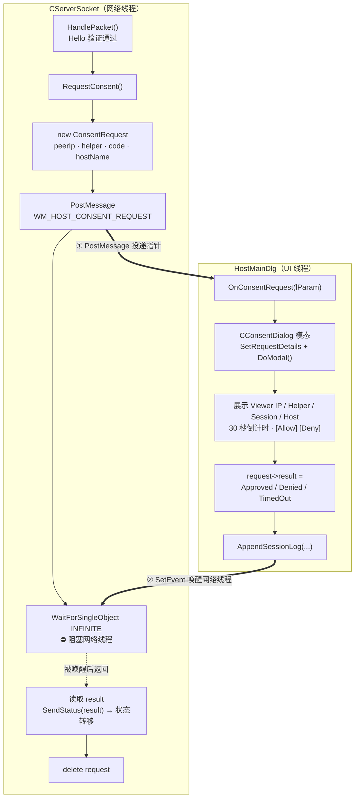
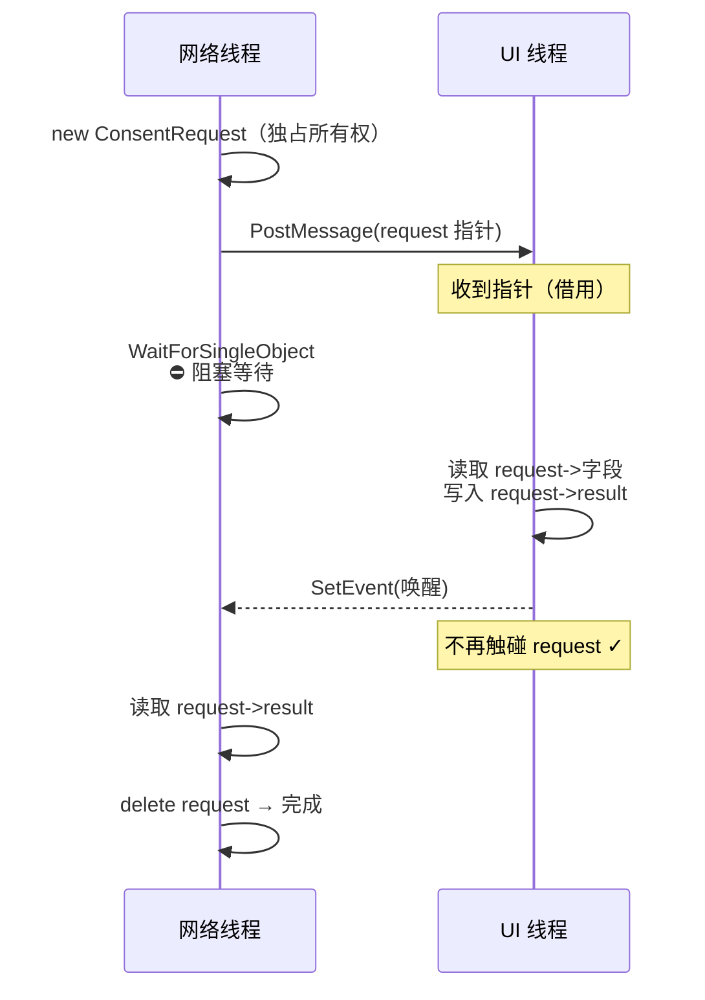
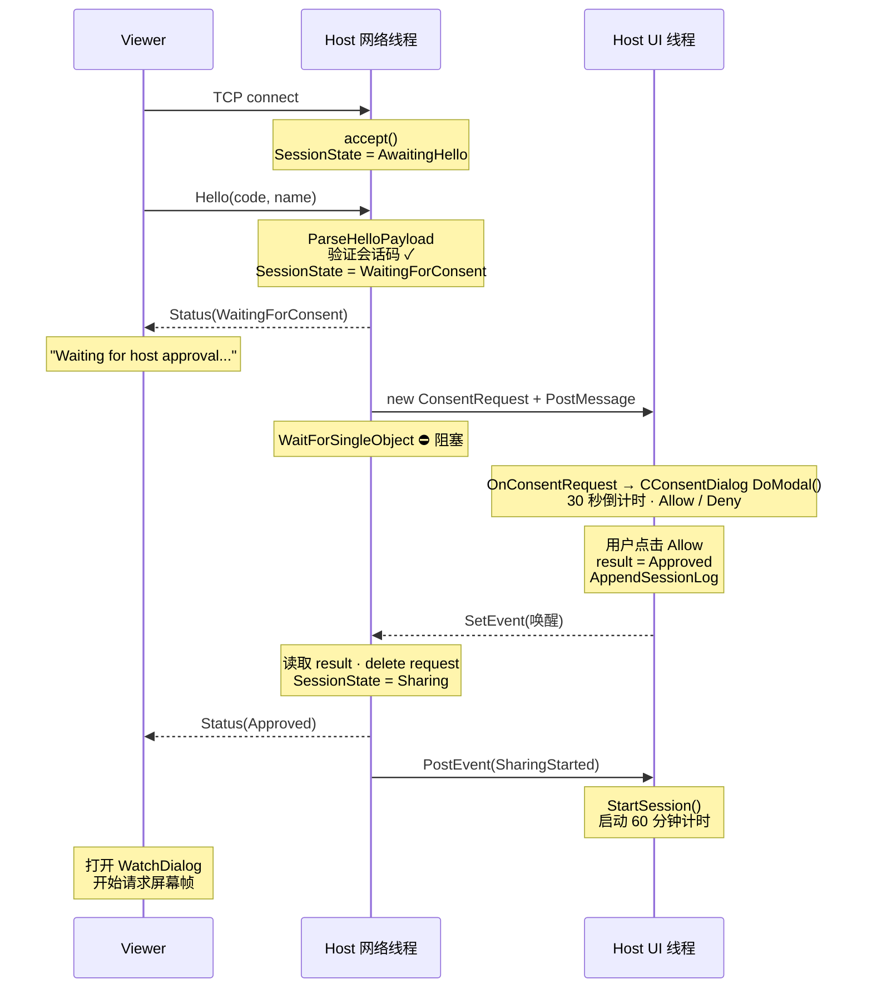

# ConsentDialog 用户授权机制

> [!abstract]
> `CConsentDialog` 实现远控服务端的用户授权弹窗。
> 本笔记分析 30 秒倒计时自动拒绝机制、请求详情展示（Viewer IP / Helper 名称 / 会话码 / Host 名称）、三种退出路径（Allow / Deny / 超时）的结果映射、MFC 模态对话框与定时器的交互、跨线程同意流程（`ConsentRequest` + `PostMessage` + `WaitForSingleObject`）、以及 Viewer 侧对同意结果的处理。

---

## 1. 模块定位



**关键职责分工**：
- `CConsentDialog`：纯 UI 组件，负责展示请求详情、倒计时、捕获用户选择
- `ConsentRequest`：跨线程数据载体，包含请求信息 + Windows Event + 结果字段
- `HostMainDlg::OnConsentRequest`：编排层，连接 ConsentRequest 与 ConsentDialog，写入结果并唤醒网络线程
- `CServerSocket::RequestConsent`：发起方，构造请求、投递消息、阻塞等待、读取结果

下图从**组件所有权**的视角补充：网络线程独占 `ConsentRequest` 的 `new`/`delete`，UI 线程仅"借用"指针读写字段，对话框由编排层通过 `DoModal` 拉起。

![[图片/6.项目/06.远控服务端/6.3 会话管理/6_3_3_3_1.svg]]

---

## 2. 类设计

### 2.1 接口定义

```cpp
// ConsentDialog.h
class CConsentDialog : public CDialogEx
{
    DECLARE_DYNAMIC(CConsentDialog)

public:
    explicit CConsentDialog(CWnd* parent = nullptr);
    ~CConsentDialog() override;

    enum { IDD = IDD_DIALOG_CONSENT };

    // 在 DoModal() 之前调用，设置弹窗中展示的请求详情
    void SetRequestDetails(
        const CString& peerIp,        // Viewer 的 IP 地址
        const CString& helperName,    // Viewer 提供的助手名称
        const CString& sessionCode,   // 本次匹配的会话码
        const CString& hostName);     // 本机计算机名

    // DoModal() 返回后调用，区分"用户点击 Deny"和"30秒超时自动关闭"
    bool WasTimedOut() const;

protected:
    void DoDataExchange(CDataExchange* pDX) override;
    BOOL OnInitDialog() override;
    afx_msg void OnTimer(UINT_PTR eventId);

    DECLARE_MESSAGE_MAP()

private:
    void UpdateCountdownText();

    CString m_viewerIp;
    CString m_helperName;
    CString m_sessionCode;
    CString m_hostName;
    bool m_timedOut;               // 超时标志
    UINT m_secondsRemaining;       // 倒计时剩余秒数
};
```

### 2.2 设计特征

| 特征 | 说明 |
|-----|------|
| **MFC 模态对话框** | 继承 `CDialogEx`，通过 `DoModal()` 阻塞调用方直到对话框关闭 |
| **DECLARE_DYNAMIC** | 启用 MFC 运行时类型识别（`RUNTIME_CLASS`），模态对话框的标准做法 |
| **两阶段初始化** | 先 `SetRequestDetails` 设置数据，再 `DoModal()` 显示。数据在 `OnInitDialog` 中填入控件 |
| **超时状态外部查询** | `WasTimedOut()` 在 `DoModal()` 返回后由调用方查询，区分超时和主动拒绝 |
| **协议常量驱动** | 超时时间来自 `ScreenShareProtocol::kConsentTimeoutSeconds`（30秒），非硬编码 |

---

## 3. 对话框资源布局

### 3.1 RC 资源定义

```rc
// RemoteCtrl.rc:27
IDD_DIALOG_CONSENT DIALOGEX 0, 0, 248, 140
STYLE DS_SETFONT | DS_MODALFRAME | WS_POPUP | WS_CAPTION | WS_SYSMENU
CAPTION "Remote Assist Consent"
FONT 9, "Microsoft YaHei UI", 0, 0, 0x1
BEGIN
    LTEXT  "A viewer is requesting read-only screen access."
                                    IDC_STATIC_CONSENT_MESSAGE,          14, 12, 220, 16
    LTEXT  "Viewer IP"              IDC_STATIC_CONSENT_VIEWER_IP_LABEL,  14, 36,  48,  8
    LTEXT  "0.0.0.0"               IDC_STATIC_CONSENT_VIEWER_IP_VALUE,  88, 36, 146,  8
    LTEXT  "Helper name"           IDC_STATIC_CONSENT_HELPER_NAME_LABEL,14, 52,  56,  8
    LTEXT  "Viewer"                IDC_STATIC_CONSENT_HELPER_NAME_VALUE,88, 52, 146,  8
    LTEXT  "Session code"          IDC_STATIC_CONSENT_SESSION_CODE_LABEL,14,68,  56,  8
    LTEXT  "000000"                IDC_STATIC_CONSENT_SESSION_CODE_VALUE,88, 68, 146,  8
    LTEXT  "This host"             IDC_STATIC_CONSENT_HOST_NAME_LABEL,  14, 84,  48,  8
    LTEXT  "HOSTNAME"              IDC_STATIC_CONSENT_HOST_NAME_VALUE,  88, 84, 146,  8
    LTEXT  "Auto-deny in 30 seconds"
                                    IDC_STATIC_CONSENT_COUNTDOWN,        14,104, 220,  8, SS_CENTER
    DEFPUSHBUTTON "Allow"           IDOK,                                24,118,  92, 18
    PUSHBUTTON    "Deny"            IDCANCEL,                           132,118,  92, 18
END
```

### 3.2 视觉布局示意

```
┌──────────────────────────────────────────────┐
│  Remote Assist Consent                    [X] │
├──────────────────────────────────────────────┤
│                                              │
│  A viewer is requesting read-only screen     │
│  access.                                     │
│                                              │
│  Viewer IP      192.168.1.100                │
│  Helper name    JohnDoe                      │
│  Session code   482917                       │
│  This host      DESKTOP-ADMIN                │
│                                              │
│          Auto-deny in 28 seconds             │
│                                              │
│      ┌──────────┐      ┌──────────┐          │
│      │  Allow   │      │   Deny   │          │
│      └──────────┘      └──────────┘          │
└──────────────────────────────────────────────┘
```

### 3.3 窗口样式解析

| 样式标志 | 含义 |
|---------|------|
| `DS_SETFONT` | 使用 `FONT` 语句指定的字体（雅黑 UI 9pt） |
| `DS_MODALFRAME` | 模态对话框边框（不可拖拽调整大小） |
| `WS_POPUP` | 弹出窗口，不作为子窗口嵌入父窗口 |
| `WS_CAPTION` | 显示标题栏 |
| `WS_SYSMENU` | 标题栏上的关闭按钮（[X]） |

### 3.4 控件资源 ID 映射

| 控件 ID | 数值 | 用途 |
|---------|------|------|
| `IDC_STATIC_CONSENT_MESSAGE` | 1009 | 顶部提示文本 |
| `IDC_STATIC_CONSENT_VIEWER_IP_VALUE` | 1011 | Viewer IP 值 |
| `IDC_STATIC_CONSENT_HELPER_NAME_VALUE` | 1013 | 助手名称值 |
| `IDC_STATIC_CONSENT_SESSION_CODE_VALUE` | 1015 | 会话码值 |
| `IDC_STATIC_CONSENT_HOST_NAME_VALUE` | 1017 | 本机名称值 |
| `IDC_STATIC_CONSENT_COUNTDOWN` | 1018 | 倒计时文本（居中，`SS_CENTER`） |
| `IDOK` | (系统) | Allow 按钮（`DEFPUSHBUTTON` = 默认按钮，按 Enter 触发） |
| `IDCANCEL` | (系统) | Deny 按钮（按 Esc 也触发 `IDCANCEL`） |

> [!tip] DEFPUSHBUTTON vs PUSHBUTTON
> `DEFPUSHBUTTON` 让 Allow 成为**默认按钮**——按 Enter 键即触发 Allow。这是安全设计上的一个有意选择：如果用户没有仔细阅读就按 Enter，最坏情况是允许了一个"只读屏幕查看"请求（risk 较低）。而 30 秒超时的默认行为是**拒绝**，这两者形成了一种平衡：
> - **主动操作默认**：Allow（Enter 键）→ 方便用户快速响应
> - **被动超时默认**：Deny（30 秒后自动关闭）→ 安全兜底

---

## 4. 生命周期与初始化

### 4.1 构造函数

```cpp
// ConsentDialog.cpp:6
CConsentDialog::CConsentDialog(CWnd* parent)
    : CDialogEx(IDD_DIALOG_CONSENT, parent),
      m_timedOut(false),
      m_secondsRemaining(ScreenShareProtocol::kConsentTimeoutSeconds)  // 30
{
}
```

**初始化要点**：
- `m_timedOut = false`：默认未超时，只有定时器触发时才设为 true
- `m_secondsRemaining = 30`：来自协议常量，非硬编码
- 此时 `m_viewerIp` 等字符串成员是空的，需要后续 `SetRequestDetails` 赋值

### 4.2 两阶段初始化模式

```
阶段 1: SetRequestDetails()    ← DoModal 之前调用
    │
    │  设置 m_viewerIp, m_helperName, m_sessionCode, m_hostName
    │  （数据存储在成员变量中，此时对话框窗口尚未创建）
    │
    ▼
阶段 2: OnInitDialog()          ← DoModal 内部自动调用
    │
    │  对话框窗口已创建，可以安全操作控件
    │  将成员变量中的数据 SetDlgItemText 到控件
    │  启动 1 秒定时器
    │
    ▼
对话框可见，等待用户操作
```

> [!important] 为什么不在构造函数中传入请求详情？
> MFC 对话框的控件在 `OnInitDialog` 之前**不存在**（窗口句柄为 NULL）。即使在构造函数中接收了数据，也不能立即设置到控件。两阶段模式是 MFC 对话框的标准范式：构造时存数据 → `OnInitDialog` 时设置控件。
>
> `SetRequestDetails` 将数据赋值与控件初始化解耦，让调用方的代码更清晰：
> ```cpp
> CConsentDialog dialog(this);
> dialog.SetRequestDetails(ip, name, code, host);  // 阶段 1
> dialog.DoModal();                                  // 内部触发阶段 2
> ```

### 4.3 SetRequestDetails

```cpp
// ConsentDialog.cpp:13
void CConsentDialog::SetRequestDetails(
    const CString& peerIp,
    const CString& helperName,
    const CString& sessionCode,
    const CString& hostName)
{
    m_viewerIp = peerIp;
    m_helperName = helperName;
    m_sessionCode = sessionCode;
    m_hostName = hostName;
}
```

纯赋值，无验证。数据来源是 `ConsentRequest` 结构体，其值已在网络层经过 `ScreenShareProtocol::ParseHelloPayload` 验证（会话码格式、助手名称长度和编码合法性）。

### 4.4 OnInitDialog — 控件填充与定时器启动

```cpp
// ConsentDialog.cpp:31
BOOL CConsentDialog::OnInitDialog()
{
    CDialogEx::OnInitDialog();          // 必须先调用基类

    // 1. 设置窗口标题
    SetWindowText(_T("Remote Assist Consent"));

    // 2. 设置提示文本（安全描述：read-only screen access）
    SetDlgItemText(IDC_STATIC_CONSENT_MESSAGE,
        _T("A viewer is requesting read-only screen access."));

    // 3. 填充请求详情
    SetDlgItemText(IDC_STATIC_CONSENT_VIEWER_IP_VALUE, m_viewerIp);
    SetDlgItemText(IDC_STATIC_CONSENT_HELPER_NAME_VALUE, m_helperName);
    SetDlgItemText(IDC_STATIC_CONSENT_SESSION_CODE_VALUE, m_sessionCode);
    SetDlgItemText(IDC_STATIC_CONSENT_HOST_NAME_VALUE, m_hostName);

    // 4. 初始化倒计时显示
    UpdateCountdownText();              // "Auto-deny in 30 seconds"

    // 5. 启动 1 秒定时器
    SetTimer(1, 1000, nullptr);         // Timer ID = 1, 间隔 1000ms

    return TRUE;  // 让系统设置默认焦点（DEFPUSHBUTTON = Allow）
}
```

**`return TRUE` 的含义**：告诉 MFC 框架自动将焦点设置到第一个 `WS_TABSTOP` 控件。由于 Allow 是 `DEFPUSHBUTTON`，它自动获得焦点并成为 Enter 键的目标。若返回 `FALSE`，则调用方需手动调用 `GotoDlgCtrl` 设置焦点。

### 4.5 析构

```cpp
// ConsentDialog.cpp:11
CConsentDialog::~CConsentDialog() = default;
```

使用编译器生成的默认析构。`CString` 成员自动释放，`SetTimer` 创建的定时器在 `KillTimer` 或窗口销毁时自动清理。

---

## 5. 30 秒倒计时机制

### 5.1 协议常量

```cpp
// ScreenShareProtocol.h:12
constexpr UINT kConsentTimeoutSeconds = 30;
```

30 秒是**产品决策**——在安全性（给用户足够时间判断）和可用性（不让远程助手等太久）之间的折中。

### 5.2 定时器驱动

```cpp
// ConsentDialog.cpp:46
void CConsentDialog::OnTimer(UINT_PTR eventId)
{
    if (eventId == 1)
    {
        // 1. 递减计数器
        if (m_secondsRemaining > 0)
        {
            --m_secondsRemaining;
            UpdateCountdownText();      // 更新 UI："Auto-deny in N seconds"
        }

        // 2. 到达零时自动关闭
        if (m_secondsRemaining == 0)
        {
            m_timedOut = true;          // 标记为超时
            KillTimer(1);               // 停止定时器
            EndDialog(IDCANCEL);        // 关闭对话框，返回 IDCANCEL
            return;
        }
    }

    CDialogEx::OnTimer(eventId);        // 传递给基类处理其他定时器
}
```

### 5.3 定时器逻辑时序

```
t=0   OnInitDialog: m_secondsRemaining=30, SetTimer(1, 1000)
      显示 "Auto-deny in 30 seconds"
        │
t=1s  OnTimer: --m_secondsRemaining → 29
      显示 "Auto-deny in 29 seconds"
        │
t=2s  OnTimer: --m_secondsRemaining → 28
      显示 "Auto-deny in 28 seconds"
        │
      ...
        │
t=29s OnTimer: --m_secondsRemaining → 1
      显示 "Auto-deny in 1 seconds"
        │
t=30s OnTimer: --m_secondsRemaining → 0
      显示 "Auto-deny in 0 seconds"  ← UpdateCountdownText 先执行
      m_timedOut = true
      KillTimer(1)
      EndDialog(IDCANCEL)             ← 对话框关闭
```

> [!note] 递减与检查分离
> 代码先 `--m_secondsRemaining` + `UpdateCountdownText()`，然后再检查 `== 0`。这意味着用户会**短暂看到** "Auto-deny in 0 seconds" 文本。实际上 `EndDialog` 在同一消息处理中立即执行，UI 上几乎不可感知。

### 5.4 UpdateCountdownText

```cpp
// ConsentDialog.cpp:68
void CConsentDialog::UpdateCountdownText()
{
    CString countdown;
    countdown.Format(_T("Auto-deny in %u seconds"), m_secondsRemaining);
    SetDlgItemText(IDC_STATIC_CONSENT_COUNTDOWN, countdown);
}
```

**语法细节**：`%u` 对应 `UINT` 类型（无符号），避免倒计时到 0 后意外显示负数。`SS_CENTER` 样式使文本在控件宽度内居中显示。

> [!warning] 英语语法瑕疵
> 当 `m_secondsRemaining == 1` 时，显示 "Auto-deny in 1 seconds"（复数形式）。严格来说应该区分单复数（"1 second" vs "N seconds"）。对于工具型应用不影响功能，但正式产品中应修正。

---

## 6. 三种退出路径

### 6.1 退出路径矩阵

| 用户操作 | 触发机制 | `DoModal()` 返回值 | `WasTimedOut()` | 最终状态映射 |
|---------|---------|-------------------|-----------------|------------|
| 点击 **Allow** | `CDialogEx::OnOK()` 自动调用 | `IDOK` | `false` | `Approved` |
| 点击 **Deny** | `CDialogEx::OnCancel()` 自动调用 | `IDCANCEL` | `false` | `Denied` |
| 点击 **[X]** 关闭按钮 | `WM_CLOSE` → `OnCancel()` | `IDCANCEL` | `false` | `Denied` |
| 按 **Enter** 键 | `DEFPUSHBUTTON` → `OnOK()` | `IDOK` | `false` | `Approved` |
| 按 **Esc** 键 | MFC 默认 → `OnCancel()` | `IDCANCEL` | `false` | `Denied` |
| **30 秒超时** | `OnTimer` → `EndDialog(IDCANCEL)` | `IDCANCEL` | **`true`** | `TimedOut` |

### 6.2 结果判定逻辑

```cpp
// HostMainDlg.cpp:125
request->result = (dialog.DoModal() == IDOK)
    ? ScreenShareProtocol::Approved                          // Allow
    : (dialog.WasTimedOut()
        ? ScreenShareProtocol::TimedOut                      // 超时
        : ScreenShareProtocol::Denied);                      // Deny
```

**判定流程图**：

```
DoModal() 返回
    │
    ├── IDOK ──────────────────────► Approved
    │
    └── IDCANCEL
            │
            ├── WasTimedOut() == true ──► TimedOut
            │
            └── WasTimedOut() == false ─► Denied
```

> [!important] 为什么需要 WasTimedOut()？
> MFC 中 `EndDialog(IDCANCEL)` 和用户点击 Deny 产生**完全相同**的返回值 `IDCANCEL`。没有 `WasTimedOut()` 就无法区分这两种关闭原因。这个区分在审计日志和协议响应中都很重要：
> - **审计日志**：`consent_timed_out` vs `consent_denied`（安全审计需要精确分类）
> - **协议响应**：`TimedOut(5)` vs `Denied(2)`（Viewer 侧显示不同提示文本）

### 6.3 MFC 模态对话框的 IDOK / IDCANCEL 机制

MFC `CDialogEx` 对 `IDOK` 和 `IDCANCEL` 有特殊处理：

```
按钮 ID == IDOK:
  → MFC 自动调用虚函数 OnOK()
  → 默认实现调用 EndDialog(IDOK)
  → DoModal() 返回 IDOK

按钮 ID == IDCANCEL:
  → MFC 自动调用虚函数 OnCancel()
  → 默认实现调用 EndDialog(IDCANCEL)
  → DoModal() 返回 IDCANCEL

WM_CLOSE (关闭按钮 / Alt+F4):
  → MFC 默认路由到 OnCancel()
  → 同上

Esc 键:
  → MFC 默认路由到 OnCancel()
  → 同上
```

`CConsentDialog` 没有 override `OnOK()` 或 `OnCancel()`，完全依赖 MFC 默认行为。对话框关闭时定时器随窗口销毁自动清理（但超时路径中显式 `KillTimer` 是更好的实践——不依赖隐式行为）。

---

## 7. ConsentRequest 跨线程同意流程

### 7.1 数据结构

```cpp
// ServerSocket.h:34
struct ConsentRequest
{
    ConsentRequest(const CString& viewerIp,
                   const CString& viewerName,
                   const CString& codeText,
                   const CString& hostMachineName)
        : peerIp(viewerIp),
          helperName(viewerName),
          sessionCode(codeText),
          hostName(hostMachineName),
          completedEvent(::CreateEvent(nullptr, TRUE, FALSE, nullptr)),
          result(ScreenShareProtocol::Denied)       // 默认拒绝——安全兜底
    {
    }

    ~ConsentRequest()
    {
        if (completedEvent != nullptr)
        {
            ::CloseHandle(completedEvent);
            completedEvent = nullptr;
        }
    }

    CString peerIp;
    CString helperName;
    CString sessionCode;
    CString hostName;
    HANDLE completedEvent;                           // 跨线程同步信号
    ScreenShareProtocol::Status result;              // UI 线程写入结果
};
```

**设计要点**：

| 字段 | 职责 | 写入方 | 读取方 |
|-----|------|-------|-------|
| `peerIp/helperName/sessionCode/hostName` | 请求信息 | 网络线程（构造时） | UI 线程（填充对话框） |
| `completedEvent` | 同步信号 | 构造函数（创建） / UI 线程（SetEvent） | 网络线程（WaitForSingleObject） |
| `result` | 同意结果 | UI 线程（对话框关闭后） | 网络线程（Wait 返回后） |

> [!tip] 默认值 `Denied` 的安全含义
> `result` 初始化为 `Denied` 而非 `Approved`，这是 **fail-safe** 设计。即使在任何异常路径下 result 未被正确设置，系统也会默认拒绝请求，不会意外授予屏幕访问权限。

### 7.2 Windows Event 对象

```cpp
completedEvent(::CreateEvent(nullptr, TRUE, FALSE, nullptr))
//                            │       │     │      │
//                            │       │     │      └── 无名称（匿名 Event）
//                            │       │     └── 初始状态：未信号（Non-signaled）
//                            │       └── 手动复位（Manual-reset）
//                            └── 默认安全描述符
```

**为什么用手动复位而非自动复位？**

| 类型 | 行为 | 适用场景 |
|-----|------|---------|
| **手动复位** (Manual-reset) | `SetEvent` 后保持信号态，直到显式 `ResetEvent` | 一次性通知，多个等待者 |
| 自动复位 (Auto-reset) | `WaitForSingleObject` 成功后自动复位为未信号态 | 互斥/信号量语义 |

此处 Event 只会被 signal 一次（UI 线程调用 `SetEvent`），只有一个等待者（网络线程）。手动复位是更安全的选择——即使 `WaitForSingleObject` 和 `SetEvent` 的时序有微妙变化，信号也不会丢失。

### 7.3 网络线程侧 — RequestConsent

```cpp
// ServerSocket.cpp:373
ScreenShareProtocol::Status CServerSocket::RequestConsent()
{
    // 1. 安全检查：目标窗口是否仍然有效
    if (!::IsWindow(m_ownerWnd))
    {
        return ScreenShareProtocol::Denied;
    }

    // 2. 堆上创建 ConsentRequest（必须堆分配，因为要跨线程传递指针）
    ConsentRequest* request = new ConsentRequest(
        GetPeerIp(),
        CurrentHelperName(),
        CurrentSessionCode(),
        GetLocalHostName());              // 本机计算机名

    // 3. 异步投递消息到 UI 线程
    if (!::PostMessage(m_ownerWnd,
                       WM_HOST_CONSENT_REQUEST,
                       0,
                       reinterpret_cast<LPARAM>(request)))
    {
        delete request;                   // PostMessage 失败，自行清理
        return ScreenShareProtocol::Denied;
    }

    // 4. 阻塞网络线程，等待 UI 线程处理完成
    ::WaitForSingleObject(request->completedEvent, INFINITE);

    // 5. 读取结果并清理
    const ScreenShareProtocol::Status result = request->result;
    delete request;                       // 网络线程负责 delete
    return result;
}
```

> [!warning] PostMessage vs SendMessage
> 此处**必须**用 `PostMessage`（异步），不能用 `SendMessage`（同步）。
>
> `SendMessage` 从网络线程调用时，会让 UI 线程**在网络线程的调用栈上**执行消息处理函数。表面上效果相同，但：
> 1. 网络线程的调用栈不在 MFC 消息泵的保护下，模态对话框的消息循环可能产生意外行为
> 2. `DoModal()` 内部会接管消息泵，在非 UI 线程的上下文中运行模态循环是未定义行为
>
> `PostMessage` + `WaitForSingleObject` 模式确保模态对话框完全在 UI 线程的正常消息循环中运行。

### 7.4 UI 线程侧 — OnConsentRequest

```cpp
// HostMainDlg.cpp:114
LRESULT CHostMainDlg::OnConsentRequest(WPARAM wParam, LPARAM lParam)
{
    UNREFERENCED_PARAMETER(wParam);

    // 1. 从 LPARAM 恢复指针
    ConsentRequest* request = reinterpret_cast<ConsentRequest*>(lParam);
    if (request == nullptr)
    {
        return 0;
    }

    // 2. 创建并配置对话框（栈上分配）
    CConsentDialog dialog(this);
    dialog.SetRequestDetails(
        request->peerIp,
        request->helperName,
        request->sessionCode,
        request->hostName);

    // 3. 显示模态对话框，阻塞直到用户选择或超时
    request->result = (dialog.DoModal() == IDOK)
        ? ScreenShareProtocol::Approved
        : (dialog.WasTimedOut()
            ? ScreenShareProtocol::TimedOut
            : ScreenShareProtocol::Denied);

    // 4. 记录审计日志
    AppendSessionLog(
        request->result == ScreenShareProtocol::Approved
            ? _T("consent_approved")
            : (request->result == ScreenShareProtocol::TimedOut
                ? _T("consent_timed_out")
                : _T("consent_denied")),
        request->result == ScreenShareProtocol::Approved
            ? _T("Screen stream approved.")
            : (request->result == ScreenShareProtocol::TimedOut
                ? _T("Consent dialog timed out.")
                : _T("Host denied screen sharing.")),
        request->helperName,
        request->peerIp);

    // 5. 唤醒网络线程 — 此后不能再访问 request 指针！
    ::SetEvent(request->completedEvent);

    return 0;
}
```

> [!danger] SetEvent 之后禁止访问 request
> `SetEvent` 唤醒网络线程后，网络线程可能**立即** delete request。UI 线程若在 `SetEvent` 之后继续访问 `request->xxx`，将产生 **use-after-free**（未定义行为）。当前代码是正确的——`SetEvent` 是函数的最后一个有效操作。

### 7.5 指针所有权模型



**所有权规则**：
1. **网络线程独占 new/delete**——UI 线程只是"借用"指针
2. **UI 线程在 SetEvent 前完成所有读写**——之后视指针为失效
3. **PostMessage 失败时网络线程自行 delete**——不会泄漏

---

## 8. 协议层交互

### 8.1 Status 枚举

```cpp
// ScreenShareProtocol.h:22
enum Status : BYTE
{
    BadCode          = 0,    // 会话码错误
    WaitingForConsent = 1,   // 正在等待主机同意
    Denied           = 2,    // 主机拒绝
    Approved         = 3,    // 主机同意
    Busy             = 4,    // 主机已在共享中
    TimedOut         = 5,    // 同意弹窗超时
};
```

### 8.2 同意结果的协议传输

```cpp
// ServerSocket.cpp:332 — HandlePacket 中
const ScreenShareProtocol::Status consentStatus = RequestConsent();

if (consentStatus == ScreenShareProtocol::Approved)
{
    // 成功路径
    {
        std::lock_guard<std::mutex> guard(m_stateMutex);
        m_sessionState = SessionState::Sharing;
    }
    SendStatus(ScreenShareProtocol::Approved);      // 告知 Viewer "已批准"
    PostEvent(HostServerEventType::SharingStarted, ...);
}
else
{
    // 拒绝/超时路径
    SendStatus(consentStatus);                       // 告知 Viewer 具体原因
    ResetClient();                                   // 断开连接
    PostEvent(HostServerEventType::SessionEnded, ...);
}
```

**协议帧格式**（`ConsentResult` 命令）：

```
┌──────────────┬──────────────┬──────────┐
│ Command(WORD)│ Length(DWORD)│ Status   │
│    1002      │      1       │  (BYTE)  │
└──────────────┴──────────────┴──────────┘
```

### 8.3 Viewer 侧处理

```cpp
// RemoteClientDlg.cpp:224 — HandleSessionStatus
switch (status)
{
case ScreenShareProtocol::WaitingForConsent:
    SetStatus(_T("Waiting for host approval..."));      // 显示等待状态
    break;

case ScreenShareProtocol::Approved:
    m_sessionActive = true;
    m_watchDialog.EnsureCreated(this);
    m_watchDialog.ShowWatch();                           // 打开屏幕查看窗口
    SetStatus(_T("Screen sharing active."));
    break;

case ScreenShareProtocol::Denied:
    m_socket.Close();                                    // 断开连接
    SetStatus(_T("Host denied the request."));
    break;

case ScreenShareProtocol::TimedOut:
    m_socket.Close();                                    // 断开连接
    SetStatus(_T("Host did not respond before the consent timer expired."));
    break;

case ScreenShareProtocol::Busy:
    m_socket.Close();
    SetStatus(_T("The host is already sharing with another viewer."));
    break;
}
```

**Viewer 看到的不同提示**：

| 同意结果 | Viewer 状态栏文本 | Viewer 行为 |
|---------|-----------------|------------|
| `WaitingForConsent` | "Waiting for host approval..." | 继续等待 |
| `Approved` | "Screen sharing active." | 打开 WatchDialog |
| `Denied` | "Host denied the request." | 断开，启用重连按钮 |
| `TimedOut` | "Host did not respond before the consent timer expired." | 断开，启用重连按钮 |
| `Busy` | "The host is already sharing with another viewer." | 断开，启用重连按钮 |

---

## 9. 完整时序：从 Viewer 连接到同意完成



---

## 10. MFC 消息映射

### 10.1 ConsentDialog 消息映射

```cpp
// ConsentDialog.cpp:75
BEGIN_MESSAGE_MAP(CConsentDialog, CDialogEx)
    ON_WM_TIMER()
END_MESSAGE_MAP()
```

只映射了 `WM_TIMER`，其他消息由 `CDialogEx` 基类处理：
- `IDOK` 按钮 → 基类 `OnOK()` → `EndDialog(IDOK)`
- `IDCANCEL` 按钮 / Esc / [X] → 基类 `OnCancel()` → `EndDialog(IDCANCEL)`

### 10.2 HostMainDlg 中的注册

```cpp
// HostMainDlg.cpp:348
ON_MESSAGE(WM_HOST_CONSENT_REQUEST, &CHostMainDlg::OnConsentRequest)
```

`WM_HOST_CONSENT_REQUEST = WM_APP + 0x101`，自定义消息，用 `ON_MESSAGE` 宏映射到成员函数。

### 10.3 DECLARE_DYNAMIC 宏

```cpp
// ConsentDialog.h:9
DECLARE_DYNAMIC(CConsentDialog)

// ConsentDialog.cpp:4
IMPLEMENT_DYNAMIC(CConsentDialog, CDialogEx)
```

MFC 运行时类型信息（RTTI）机制。启用 `RUNTIME_CLASS(CConsentDialog)` 和 `IsKindOf()` 等功能。对于模态对话框是标准做法，虽然本类未直接使用 MFC RTTI，但符合 MFC 编码惯例。

---

## 11. 安全设计分析

### 11.1 信息展示的安全价值

对话框展示四个信息字段，每个都有安全目的：

| 字段 | 安全目的 |
|-----|---------|
| **Viewer IP** | 让主机用户确认连接来源是否合理（内网 vs 外网、已知 vs 未知） |
| **Helper name** | 标识请求者身份（Viewer 在 Hello 握手中提供） |
| **Session code** | 确认是自己分享出去的会话码（防止不同会话混淆） |
| **This host** | 确认当前机器身份（多台主机时避免操作错误） |

> [!warning] Helper name 可伪造
> `helperName` 由 Viewer 自行声明，服务端不验证其真实性。恶意 Viewer 可以声明任意名称（如冒充 "IT Support"）。对话框展示时应当意识到这一点——它是**声明的身份**，不是**验证的身份**。

### 11.2 默认安全策略

```
主动操作默认 → Allow（Enter 键触发 DEFPUSHBUTTON）
被动超时默认 → Deny（30 秒后 EndDialog(IDCANCEL)）
异常路径默认 → Denied（ConsentRequest::result 初始值）
```

三层默认值构成了安全纵深：
1. **用户在场且主动** → 可以快速 Allow
2. **用户不在场** → 30 秒后自动 Deny
3. **系统异常** → `result` 初始值为 `Denied`，不会意外授权

![[图片/6.项目/06.远控服务端/6.3 会话管理/6_3_3_3_2.svg]]

### 11.3 提示文本的安全措辞

```
"A viewer is requesting read-only screen access."
```

明确告知：
- "**read-only**"——只能看，不能控制
- "**screen access**"——访问的是屏幕内容
- 使用中性的 "requesting"——需要用户**主动批准**

---

## 12. 陷阱与警示

> [!danger] 陷阱 1：SetEvent 后访问 request 是 use-after-free
> `SetEvent` 唤醒网络线程后，网络线程可能在任意时刻 `delete request`。当前代码中 `SetEvent` 是 `OnConsentRequest` 的最后有效操作，是正确的。但如果未来在 `SetEvent` 后添加代码访问 `request->xxx`，就会产生 UAF。

> [!danger] 陷阱 2：WaitForSingleObject(INFINITE) 无超时保护
> 若 UI 线程崩溃、窗口被意外销毁、或 `PostMessage` 成功但消息未被处理（极端情况），网络线程将**永久阻塞**。改进方案：
> ```cpp
> // 建议：使用超时等待（35 秒 > 30 秒倒计时）
> DWORD waitResult = ::WaitForSingleObject(
>     request->completedEvent, 35000);
> if (waitResult == WAIT_TIMEOUT)
> {
>     delete request;
>     return ScreenShareProtocol::TimedOut;
> }
> ```

> [!warning] 陷阱 3：Timer ID 硬编码为 1
> `SetTimer(1, 1000, nullptr)` 中 Timer ID = 1 是硬编码的魔数。若未来 `CConsentDialog` 需要第二个定时器，或基类引入 ID=1 的定时器，会产生冲突。改进方案是定义命名常量：
> ```cpp
> static constexpr UINT_PTR kCountdownTimerId = 1;
> ```

> [!warning] 陷阱 4：模态对话框阻塞 UI 线程
> `DoModal()` 会阻塞整个 UI 线程的正常消息处理。在 30 秒的倒计时期间，`HostMainDlg` 无法响应其他 `WM_HOST_SERVER_EVENT` 消息。对于单客户端架构这是可接受的——此时没有其他需要处理的网络事件。但若改为多客户端，需要改用非模态对话框。

> [!warning] 陷阱 5：CConsentDialog 栈分配在 OnConsentRequest 中
> `CConsentDialog dialog(this)` 在栈上创建。`DoModal()` 返回后 `dialog` 析构。这是正确的——模态对话框天然适合栈分配，因为调用方需要等待结果。但不能将此模式用于非模态对话框（窗口会在栈帧退出后悬垂）。

> [!warning] 陷阱 6：helperName 可伪造
> Viewer 自行声明 `helperName`，服务端仅做格式验证（非空、无换行、UTF-8 合法、长度 ≤64），不验证真实身份。社会工程攻击者可伪造为 "IT Support" 等可信名称诱导用户点击 Allow。

---

## 13. 设计决策分析

### 13.1 为什么用模态对话框而不是非模态？

| 方案 | 优势 | 劣势 |
|-----|------|------|
| **模态 (当前)** | 强制用户响应，不会被忽略；代码简单，DoModal 返回即有结果 | 阻塞 UI 线程 |
| 非模态 | 不阻塞 UI | 用户可能最小化/遮挡，实现复杂（需要回调或消息通知结果） |
| 系统通知 (Toast) | 不打断用户工作流 | 容易被忽略；Windows Toast API 实现复杂 |

**选择模态的理由**：同意弹窗是**安全关键操作**——必须让用户明确做出选择（或超时自动拒绝）。非模态和通知都有被忽略的风险。

### 13.2 为什么超时默认是 Deny 而非 Allow？

这是**安全设计的核心原则**——对安全敏感的操作，默认行为应该是**最安全的选择**。

- 如果用户不在电脑旁 → 30 秒后自动拒绝 → 安全
- 如果用户看到了但没来得及操作 → Viewer 可以重新请求 → 可用性不受影响

### 13.3 为什么 30 秒而不是更长/更短？

```cpp
constexpr UINT kConsentTimeoutSeconds = 30;
```

- **太短（如 10 秒）**：用户可能来不及阅读信息并做出判断
- **太长（如 60 秒）**：Viewer 等待体验差，且无人值守时暴露窗口过长
- **30 秒**：参考了 Windows UAC 和 TeamViewer 的同意超时设计，是行业通行做法

### 13.4 为什么 ConsentRequest 在网络线程 new/delete？

替代方案：在 UI 线程 delete，或使用 `std::shared_ptr`。

当前方案的优势：
1. **所有权单一**——网络线程全权负责对象生命周期，逻辑简单
2. **不需要引用计数**——只有两个线程，且通信方式（Event）保证了严格的时序
3. **避免 shared_ptr 的原子引用计数开销**——对于一次性对象不值得

### 13.5 为什么 GetLocalHostName 也传给对话框？

```cpp
ConsentRequest* request = new ConsentRequest(
    GetPeerIp(), CurrentHelperName(),
    CurrentSessionCode(), GetLocalHostName());  // ← 本机名
```

```cpp
// ServerSocket.cpp:10 — 获取本机名
CString GetLocalHostName()
{
    WCHAR buffer[MAX_COMPUTERNAME_LENGTH + 1] = {};
    DWORD length = _countof(buffer);
    if (::GetComputerNameW(buffer, &length))
        return CString(buffer);
    return _T("(unknown)");
}
```

当用户远程桌面到多台机器，或有多个远控 Host 实例运行时，"This host" 字段帮助用户确认自己正在操作**哪台主机**的同意弹窗，避免误操作。

---

## 14. 面试表达

> [!quote] 推荐表达
> "用户授权机制基于 MFC **模态对话框** + **30 秒倒计时自动拒绝**设计，体现了安全优先原则：主动操作默认 Allow（Enter 键），被动超时默认 Deny，异常路径默认 Denied（ConsentRequest 初始值）。三层默认值构成安全纵深。
>
> 跨线程通信采用 **PostMessage + Windows Event** 模式：网络线程在堆上 `new ConsentRequest`（含手动复位 Event），通过 `PostMessage` 投递指针到 UI 线程，然后 `WaitForSingleObject(INFINITE)` 阻塞。UI 线程弹出模态对话框，用户选择后将结果写入 `request->result`，调用 `SetEvent` 唤醒网络线程。**所有权由网络线程管理**（new/delete），UI 线程仅借用指针读写字段。
>
> 对话框返回后通过 `DoModal()` 返回值（IDOK/IDCANCEL）和 `WasTimedOut()` 标志区分三种退出路径：Allow → Approved、Deny → Denied、超时 → TimedOut。三种结果分别映射到不同的协议 Status 字节发送给 Viewer，Viewer 侧根据状态显示不同提示文本。同意结果同时写入审计日志（`consent_approved` / `consent_denied` / `consent_timed_out`），支持事后安全审计。"

---

## 15. 已知局限

| 局限 | 说明 | 改进方向 |
|-----|------|---------|
| INFINITE 等待 | 网络线程可能永久阻塞 | 改为 35 秒超时等待 |
| 模态阻塞 UI | DoModal 期间 HostMainDlg 无法处理其他消息 | 单客户端可接受；多客户端需非模态 |
| helperName 可伪造 | 无身份验证机制 | 可添加证书或 token 验证（超出当前范围） |
| Timer ID 硬编码 | `1` 是魔数 | 定义 `constexpr` 常量 |
| 英语单复数 | "1 seconds" 语法错误 | `m_secondsRemaining == 1 ? "second" : "seconds"` |
| 无辅助功能 | 未处理屏幕阅读器等 a11y | 添加 `WM_GETOBJECT` 支持 |

---

## 16. 源码索引

| 文件 | 行号 | 内容 |
|-----|------|------|
| `ConsentDialog.h` | 7-39 | `CConsentDialog` 类定义 |
| `ConsentDialog.cpp` | 6-9 | 构造函数（初始化超时秒数） |
| `ConsentDialog.cpp` | 13-19 | `SetRequestDetails()` — 设置请求详情 |
| `ConsentDialog.cpp` | 21-24 | `WasTimedOut()` — 超时查询 |
| `ConsentDialog.cpp` | 31-44 | `OnInitDialog()` — 控件填充与定时器启动 |
| `ConsentDialog.cpp` | 46-66 | `OnTimer()` — 倒计时逻辑与自动关闭 |
| `ConsentDialog.cpp` | 68-73 | `UpdateCountdownText()` — 倒计时文本更新 |
| `ConsentDialog.cpp` | 75-77 | `BEGIN_MESSAGE_MAP` — 消息映射 |
| `ServerSocket.h` | 34-61 | `ConsentRequest` 结构体定义 |
| `ServerSocket.cpp` | 10-18 | `GetLocalHostName()` — 获取本机计算机名 |
| `ServerSocket.cpp` | 323-351 | `HandlePacket()` — 同意流程触发与结果处理 |
| `ServerSocket.cpp` | 373-391 | `RequestConsent()` — 网络线程侧同意请求 |
| `HostMainDlg.cpp` | 114-138 | `OnConsentRequest()` — UI 线程侧同意处理 |
| `ScreenShareProtocol.h` | 12 | `kConsentTimeoutSeconds = 30` |
| `ScreenShareProtocol.h` | 22-30 | `Status` 枚举（含 Denied/Approved/TimedOut） |
| `RemoteCtrl.rc` | 27-44 | `IDD_DIALOG_CONSENT` 对话框资源模板 |
| `resource.h` | 6, 18-27 | 对话框和控件 ID 定义 |
| `RemoteClientDlg.cpp` | 224-269 | Viewer 侧 `HandleSessionStatus()` — 处理同意结果 |

---

## 关联笔记

- [[6.3.1 SessionPolicy 会话生命周期管理]] — ConsentRequest 跨线程流程的详细时序图；会话状态机中 WaitingForConsent → Sharing 的转移
- [[6.3.2 SessionLog 审计日志系统]] — consent_approved / consent_denied / consent_timed_out 事件的记录
- [[6.1.1 ServerSocket 网络架构与 select 多路复用]] — HandlePacket 中触发 RequestConsent 的上下文
- [[6.0 远控服务端项目总结]] — 项目整体架构
