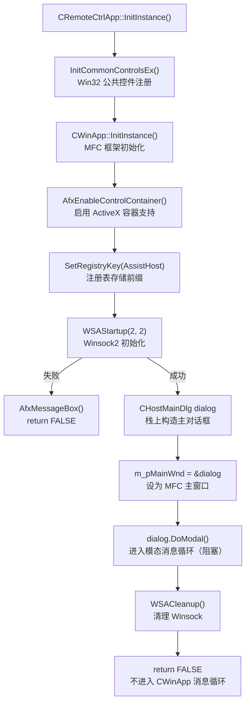
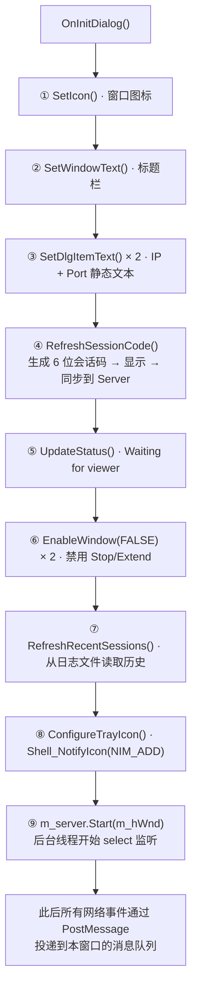
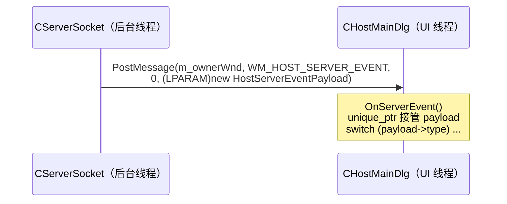
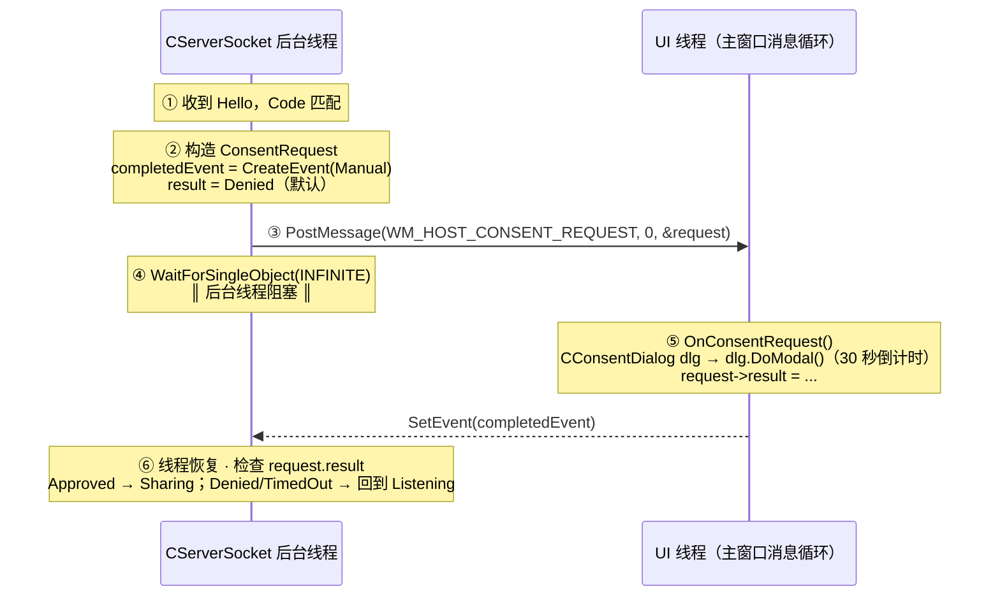
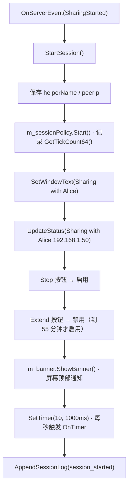
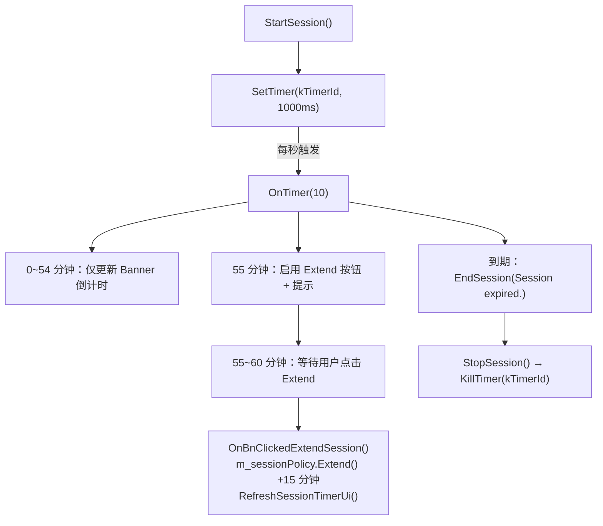
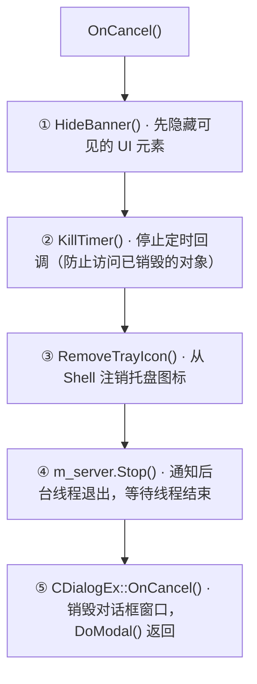
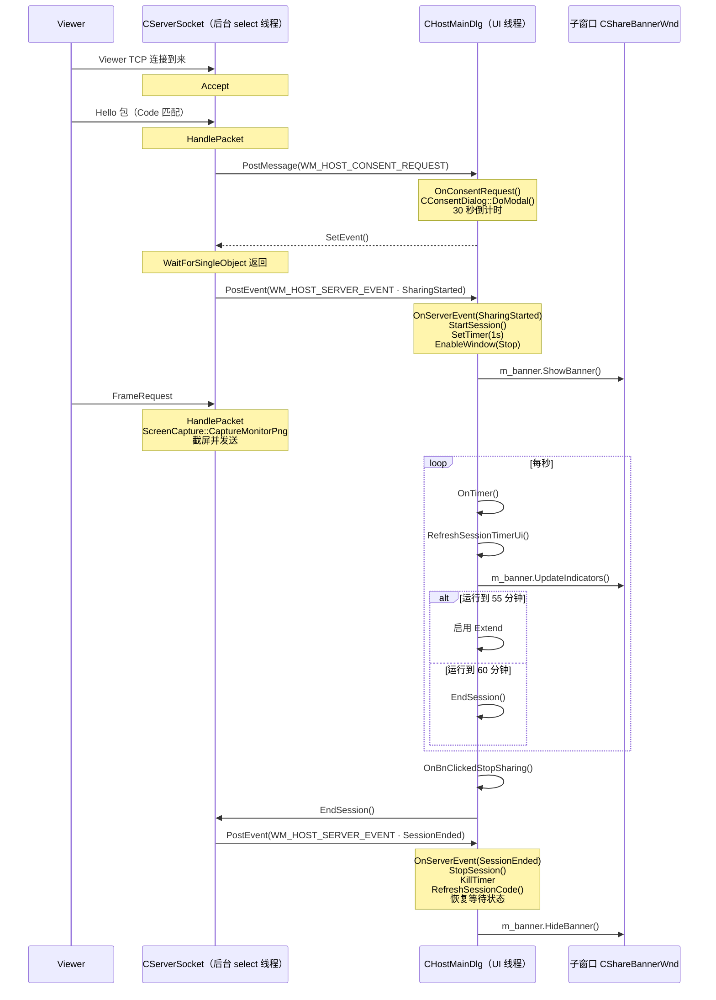

# MFC 应用框架与 HostMainDlg

> [!abstract]
> `CHostMainDlg` 是远控服务端的主窗口，负责 UI 展示与事件协调。
> 本笔记分析 MFC 应用入口（`RemoteCtrl.cpp` Winsock 初始化）、主对话框功能（会话码显示/IP 地址/端口/状态/历史记录）、托盘图标集成、服务端事件分发（`OnServerEvent`/`OnConsentRequest`）、以及会话定时器管理。

---

## 1. MFC 应用入口：CRemoteCtrlApp

`RemoteCtrl.cpp` 是整个 Host 端的启动点，`CRemoteCtrlApp` 继承自 `CWinApp`，其 `InitInstance()` 完成所有全局初始化。

### 1.1 MFC 应用生命周期



### 1.2 完整入口代码

```cpp
// RemoteCtrl.cpp
CRemoteCtrlApp theApp;  // 全局唯一 MFC App 对象

BOOL CRemoteCtrlApp::InitInstance()
{
    // 1. 注册公共控件（列表、树、进度条等）
    INITCOMMONCONTROLSEX initControls = {};
    initControls.dwSize = sizeof(initControls);
    initControls.dwICC  = ICC_WIN95_CLASSES;
    InitCommonControlsEx(&initControls);

    CWinApp::InitInstance();
    AfxEnableControlContainer();
    SetRegistryKey(_T("AssistHost"));

    // 2. 初始化 Winsock2（全局一次，退出前 WSACleanup）
    WSADATA wsaData = {};
    if (WSAStartup(MAKEWORD(2, 2), &wsaData) != 0) {
        AfxMessageBox(_T("Unable to initialize Winsock."));
        return FALSE;
    }

    // 3. 以模态对话框作为主窗口
    CHostMainDlg dialog;
    m_pMainWnd = &dialog;
    dialog.DoModal();  // 阻塞直到对话框关闭

    WSACleanup();
    return FALSE;  // 告诉 MFC：不要进入 Run() 消息泵
}
```

### 1.3 关键设计决策

> [!important] 为什么 InitInstance() 返回 FALSE？
> MFC 的 `CWinApp::Run()` 内部会启动标准消息泵（`GetMessage`/`DispatchMessage` 循环）。但本项目使用 **模态对话框** 作为主窗口，`DoModal()` 自身就包含一个完整的消息循环。如果 `InitInstance()` 返回 `TRUE`，`Run()` 会再启动一个消息泵，对话框关闭后程序不会退出。返回 `FALSE` 让 MFC 在 `InitInstance()` 结束后直接终止进程。

> [!important] 为什么在 InitInstance() 中初始化 Winsock 而不是在 CServerSocket 内部？
> Winsock 初始化（`WSAStartup`）是**进程级别**的全局操作，而 `CServerSocket` 可能被多次 `Start()`/`Stop()`。将 Winsock 生命周期绑定到 App 对象，确保：
> - 整个进程只调用一次 `WSAStartup`/`WSACleanup`
> - `CServerSocket` 构造时 Winsock 已经就绪
> - 退出时 Winsock 能被正确清理（`WSACleanup` 在 `DoModal` 之后）

### 1.4 MFC 全局对象 theApp

```cpp
CRemoteCtrlApp theApp;
```

这是 MFC 的**核心约定**：每个 MFC 程序必须有且仅有一个 `CWinApp` 派生类的全局实例。MFC 框架通过这个全局对象：

| 阶段 | MFC 内部行为 |
|------|-------------|
| CRT 启动 | `theApp` 构造，`CWinApp::CWinApp()` 将 `this` 注册到 `afxCurrentWinApp` |
| `WinMain` | MFC 提供的 `WinMain` 调用 `afxCurrentWinApp->InitInstance()` |
| 消息循环 | 若 `InitInstance()` 返回 `TRUE`，进入 `Run()` 消息泵 |
| 退出 | 调用 `ExitInstance()` 做清理 |

> [!tip] `m_dwRestartManagerSupportFlags = AFX_RESTART_MANAGER_SUPPORT_RESTART`
> 构造函数中设置的这个标志启用 **Windows Restart Manager** 支持。当系统更新需要重启时，若应用支持此标志，Windows 可以先关闭应用、完成更新后自动重新启动它。对远控 Host 来说这保证了系统更新不会永久丢失远程协助服务。

---

## 2. CHostMainDlg 类设计

### 2.1 类声明总览

```cpp
// HostMainDlg.h
class CHostMainDlg : public CDialogEx
{
public:
    explicit CHostMainDlg(CWnd* parent = nullptr);
    enum { IDD = IDD_DIALOG_HOST_MAIN };  // 关联对话框资源 ID

protected:
    // ---- MFC 虚函数覆写 ----
    void DoDataExchange(CDataExchange* pDX) override;
    BOOL OnInitDialog() override;
    void OnCancel() override;

    // ---- 消息处理函数 ----
    afx_msg void    OnBnClickedStopSharing();
    afx_msg void    OnBnClickedExtendSession();
    afx_msg LRESULT OnServerEvent(WPARAM wParam, LPARAM lParam);
    afx_msg LRESULT OnConsentRequest(WPARAM wParam, LPARAM lParam);
    afx_msg LRESULT OnBannerEndSession(WPARAM wParam, LPARAM lParam);
    afx_msg LRESULT OnTrayIcon(WPARAM wParam, LPARAM lParam);
    afx_msg void    OnTimer(UINT_PTR eventId);

    DECLARE_MESSAGE_MAP()

private:
    // ---- 托盘菜单命令 ID ----
    enum {
        ID_TRAY_SHOW = 40001,
        ID_TRAY_STOP = 40002,
        ID_TRAY_EXIT = 40003,
    };

    // ---- 私有方法 ----
    void RefreshSessionCode();
    void UpdateStatus(const CString& statusText);
    void ConfigureTrayIcon();
    void RemoveTrayIcon();
    void ShowTrayMenu();
    void StartSession(const HostServerEventPayload& payload);
    void StopSession(const HostServerEventPayload& payload);
    void RefreshRecentSessions();
    void RefreshSessionTimerUi();
    void AppendSessionLog(...);

    // ---- 成员变量 ----
    HICON           m_icon;            // 窗口/托盘图标
    CServerSocket   m_server;          // 网络服务器（后台线程）
    CShareBannerWnd m_banner;          // 屏幕顶部共享指示条
    CSessionPolicy  m_sessionPolicy;   // 会话时限策略
    NOTIFYICONDATA  m_trayData;        // 系统托盘数据
    CString         m_sessionCode;     // 当前 6 位会话码
    CString         m_activeHelperName;// 当前连接的协助者名称
    CString         m_activePeerIp;    // 当前连接的对端 IP
};
```

### 2.2 成员对象职责划分

![[图片/6.项目/06.远控服务端/6.4 UI与应用框架/6_4_4_1_1.svg]]

- **`CServerSocket m_server`** — 后台线程运行 select 循环，通过 `PostMessage` 向主窗口投递事件。详见 → [[6.1.1 ServerSocket 网络架构与 select 多路复用]]
- **`CShareBannerWnd m_banner`** — 屏幕顶部的浮动指示条（"正在共享屏幕"），点击可结束会话。详见 → [[6.4.2 ShareBannerWnd 共享状态通知]]
- **`CSessionPolicy m_sessionPolicy`** — 60 分钟会话时限 · 55 分钟提示延长，每次延长 +15 分钟。详见 → [[6.3.1 SessionPolicy 会话生命周期管理]]
- **`NOTIFYICONDATA m_trayData`** — 系统托盘图标数据结构，支持右键菜单 / 双击恢复窗口

> [!important] CHostMainDlg 是**协调者**而非**执行者**
> 主对话框不直接做网络 I/O、不直接截屏、不直接管理计时。它的职责是：
> 1. **接收**来自各子系统的事件（`OnServerEvent`、`OnTimer`、`OnBannerEndSession`）
> 2. **协调**子系统之间的交互（收到 Sharing 事件 → 启动 Banner + 启动 Timer）
> 3. **更新** UI 状态（窗口标题、状态文本、按钮使能）
>
> 这种设计使得网络、策略、UI 各模块可以独立测试和替换。

---

## 3. 对话框资源与控件布局

### 3.1 资源 ID 映射

| 控件 ID | 数值 | 类型 | 用途 |
|---------|------|------|------|
| `IDD_DIALOG_HOST_MAIN` | 101 | Dialog | 主对话框模板 |
| `IDC_STATIC_HOST_IP_LABEL` | 1000 | Static | "IP Address:" 标签 |
| `IDC_STATIC_HOST_IP_VALUE` | 1001 | Static | 显示本机 IP |
| `IDC_STATIC_HOST_PORT_LABEL` | 1002 | Static | "Port:" 标签 |
| `IDC_STATIC_HOST_PORT_VALUE` | 1003 | Static | 显示监听端口 |
| `IDC_STATIC_SESSION_CODE_LABEL` | 1004 | Static | "Session Code:" 标签 |
| `IDC_STATIC_SESSION_CODE_VALUE` | 1005 | Static | 显示 6 位会话码 |
| `IDC_STATIC_STATUS_LABEL` | 1006 | Static | "Status:" 标签 |
| `IDC_STATIC_STATUS_VALUE` | 1007 | Static | 显示当前状态文本 |
| `IDC_BTN_STOP_SHARING` | 1008 | Button | "Stop Sharing" 按钮 |
| `IDC_STATIC_RECENT_SESSIONS_LABEL` | 1019 | Static | "Recent Sessions:" 标签 |
| `IDC_EDIT_RECENT_SESSIONS` | 1020 | Edit | 历史会话日志（多行只读） |
| `IDC_BTN_EXTEND_SESSION` | 1021 | Button | "Extend Session" 按钮 |

### 3.2 逻辑布局示意

```
┌──────────────────────────────────────────────┐
│  Remote Assist Host - Waiting for viewer     │
├──────────────────────────────────────────────┤
│                                              │
│  IP Address:    192.168.1.100, 10.0.0.5      │
│  Port:          9527                         │
│  Session Code:  482917                       │
│  Status:        Waiting for viewer           │
│                                              │
│  [Stop Sharing]  [Extend Session]            │
│                                              │
│  Recent Sessions:                            │
│  ┌────────────────────────────────────────┐  │
│  │ 2026-06-05 14:32:01  session_started   │  │
│  │ 2026-06-05 14:55:12  session_extended  │  │
│  │ 2026-06-05 15:10:45  session_ended     │  │
│  └────────────────────────────────────────┘  │
│                                              │
└──────────────────────────────────────────────┘
         ↓ 最小化后
    [🖥 Remote Assist Host]  ← 系统托盘图标
```

---

## 4. OnInitDialog：主窗口初始化序列

```cpp
BOOL CHostMainDlg::OnInitDialog()
{
    CDialogEx::OnInitDialog();   // 必须先调基类

    // 1. 设置窗口图标（大图标 + 小图标）
    SetIcon(m_icon, TRUE);       // 任务栏 / Alt+Tab 显示
    SetIcon(m_icon, FALSE);      // 标题栏左上角

    // 2. 设置窗口标题
    SetWindowText(_T("Remote Assist Host - Waiting for viewer"));

    // 3. 填充静态信息（本机 IP、端口）
    SetDlgItemText(IDC_STATIC_HOST_IP_VALUE,
                   CEdoyunTool::JoinLocalIpv4Addresses());
    CString portText;
    portText.Format(_T("%u"), ScreenShareProtocol::kDefaultPort);
    SetDlgItemText(IDC_STATIC_HOST_PORT_VALUE, portText);

    // 4. 生成并显示 6 位会话码
    RefreshSessionCode();

    // 5. 初始状态
    UpdateStatus(_T("Waiting for viewer"));
    GetDlgItem(IDC_BTN_STOP_SHARING)->EnableWindow(FALSE);
    GetDlgItem(IDC_BTN_EXTEND_SESSION)->EnableWindow(FALSE);

    // 6. 加载历史会话日志
    RefreshRecentSessions();

    // 7. 配置系统托盘图标
    ConfigureTrayIcon();

    // 8. 启动服务器（后台线程开始监听）
    if (!m_server.Start(m_hWnd, m_sessionCode))
        UpdateStatus(_T("Unable to bind the listening socket."));

    return TRUE;  // 让 MFC 设置默认焦点
}
```

### 4.1 初始化时序图



> [!tip] `m_server.Start(m_hWnd, m_sessionCode)` 的两个参数
> - `m_hWnd`：主窗口句柄，Server 线程用它来 `PostMessage` 投递事件
> - `m_sessionCode`：当前会话码，Server 用它验证 Hello 握手中的 Code
>
> 这意味着 Server 线程**只持有窗口句柄的副本**，不持有对话框指针，避免了跨线程访问 MFC 对象的风险。

---

## 5. 消息映射机制

### 5.1 MFC 消息映射原理

MFC 消息映射是一套**编译期宏展开 + 运行时查表**的消息分发机制，替代了 Win32 中手写 `switch-case` 的 Window Procedure。

```
Windows 消息 → MFC 框架 → 消息映射表查找 → 调用对应成员函数
```

底层展开后的伪代码：

```cpp
// DECLARE_MESSAGE_MAP() 展开为：
protected:
    static const AFX_MSGMAP_ENTRY _messageEntries[];
    static const AFX_MSGMAP messageMap;
    virtual const AFX_MSGMAP* GetMessageMap() const;

// BEGIN_MESSAGE_MAP / END_MESSAGE_MAP 展开为：
const AFX_MSGMAP_ENTRY CHostMainDlg::_messageEntries[] = {
    { WM_COMMAND, BN_CLICKED, IDC_BTN_STOP_SHARING,
      0, AfxSig_vv, &OnBnClickedStopSharing },
    { WM_HOST_SERVER_EVENT, 0, 0,
      0, AfxSig_lwl, &OnServerEvent },
    // ... 更多条目
    { 0, 0, 0, 0, AfxSig_end, nullptr }  // 终止标记
};
```

### 5.2 本项目消息映射表

```cpp
BEGIN_MESSAGE_MAP(CHostMainDlg, CDialogEx)
    // ── 按钮点击（标准 WM_COMMAND / BN_CLICKED）──
    ON_BN_CLICKED(IDC_BTN_STOP_SHARING,  &CHostMainDlg::OnBnClickedStopSharing)
    ON_BN_CLICKED(IDC_BTN_EXTEND_SESSION,&CHostMainDlg::OnBnClickedExtendSession)

    // ── 自定义消息（WM_APP + 偏移）──
    ON_MESSAGE(WM_HOST_SERVER_EVENT,      &CHostMainDlg::OnServerEvent)
    ON_MESSAGE(WM_HOST_CONSENT_REQUEST,   &CHostMainDlg::OnConsentRequest)
    ON_MESSAGE(WM_HOST_BANNER_END_SESSION,&CHostMainDlg::OnBannerEndSession)
    ON_MESSAGE(WM_HOST_TRAYICON,          &CHostMainDlg::OnTrayIcon)

    // ── 系统消息 ──
    ON_WM_TIMER()
END_MESSAGE_MAP()
```

### 5.3 消息分类与签名

| 宏 | 消息类型 | 处理函数签名 | 典型用途 |
|----|---------|-------------|---------|
| `ON_BN_CLICKED(id, fn)` | `WM_COMMAND` + `BN_CLICKED` | `void fn()` | 按钮点击 |
| `ON_MESSAGE(msg, fn)` | 自定义消息 | `LRESULT fn(WPARAM, LPARAM)` | 跨线程事件投递 |
| `ON_WM_TIMER()` | `WM_TIMER` | `void OnTimer(UINT_PTR)` | 定时器回调 |

> [!warning] ON_MESSAGE 与 ON_BN_CLICKED 的签名区别
> `ON_MESSAGE` 的处理函数**必须**返回 `LRESULT` 并接受 `WPARAM`/`LPARAM` 两个参数。
> 如果写成 `void OnServerEvent()`（缺少参数），编译能通过但运行时栈会错乱。
> 这是 MFC 消息映射中最容易踩的坑之一。

### 5.4 自定义消息定义

```cpp
// ServerSocket.h
constexpr UINT WM_HOST_SERVER_EVENT      = WM_APP + 0x100;  // 服务器异步事件
constexpr UINT WM_HOST_CONSENT_REQUEST   = WM_APP + 0x101;  // 授权请求弹窗
constexpr UINT WM_HOST_BANNER_END_SESSION= WM_APP + 0x102;  // Banner 请求结束
constexpr UINT WM_HOST_TRAYICON          = WM_APP + 0x103;  // 托盘图标交互
```

> [!important] 为什么用 WM_APP 而不是 WM_USER？
> - `WM_USER`（0x0400）到 `WM_APP`（0x8000）之间的范围，MFC 框架本身和某些控件（如 `ListView`、`TreeView`）会使用，存在冲突风险。
> - `WM_APP`（0x8000）起始的范围是 Microsoft 明确保留给**应用程序自定义消息**的，不会与任何系统控件或 MFC 内部消息冲突。
> - 加上 `0x100` 的偏移进一步避免与其他模块的自定义消息混淆（Client 端使用 `WM_APP + 0x200` 系列）。

### 5.5 双线程消息通道总览

下图汇总 Host 端两个线程之间的全部跨线程通道：后台 select 线程用 `PostMessage` 异步投递事件，UI 线程用 `SetEvent` 同步唤醒阻塞的后台线程。

![[图片/6.项目/06.远控服务端/6.4 UI与应用框架/6_4_4_1_2.svg]]

---

## 6. OnServerEvent：服务端事件分发中心

`OnServerEvent` 是主窗口的**核心事件路由器**，处理来自 `CServerSocket` 后台线程的所有异步通知。

### 6.1 事件投递机制



### 6.2 事件载荷结构

```cpp
// ServerSocket.h
enum class HostServerEventType {
    Listening,         // 服务器就绪 / 回到监听状态
    WaitingForConsent, // 收到 Hello，等待用户授权
    SharingStarted,    // 用户已批准，屏幕共享开始
    SessionEnded,      // 会话正常结束
    Error,             // 网络错误
};

struct HostServerEventPayload {
    HostServerEventType type;
    CString peerIp;      // 对端 IP
    CString helperName;  // 协助者名称
    CString detail;      // 详情文本
};
```

### 6.3 事件处理逻辑

```cpp
LRESULT CHostMainDlg::OnServerEvent(WPARAM wParam, LPARAM lParam)
{
    UNREFERENCED_PARAMETER(wParam);
    // unique_ptr 接管堆分配的 payload，确保无泄漏
    std::unique_ptr<HostServerEventPayload> payload(
        reinterpret_cast<HostServerEventPayload*>(lParam));
    if (!payload) return 0;

    switch (payload->type)
    {
    case HostServerEventType::Listening:
        // 可能携带上一次连接尝试的信息（Code 不匹配等）
        if (!payload->peerIp.IsEmpty())
            AppendSessionLog(_T("connect_attempt"), ...);
        // 未在活跃会话中 → 恢复等待状态
        if (!m_sessionPolicy.IsActive()) {
            UpdateStatus(_T("Waiting for viewer"));
            GetDlgItem(IDC_BTN_STOP_SHARING)->EnableWindow(FALSE);
            GetDlgItem(IDC_BTN_EXTEND_SESSION)->EnableWindow(FALSE);
        }
        break;

    case HostServerEventType::WaitingForConsent:
        AppendSessionLog(_T("consent_shown"), ...);
        UpdateStatus(_T("Waiting for local approval..."));
        break;

    case HostServerEventType::SharingStarted:
        StartSession(*payload);  // → 详见 §8
        break;

    case HostServerEventType::SessionEnded:
        StopSession(*payload);   // → 详见 §9
        break;

    case HostServerEventType::Error:
        AppendSessionLog(_T("socket_error"), ...);
        // 全面重置：标题、Banner、按钮、会话码
        m_banner.HideBanner();
        RefreshSessionCode();
        UpdateStatus(payload->detail.IsEmpty()
            ? _T("Socket error.") : payload->detail);
        break;
    }
    return 0;
}
```

### 6.4 事件类型与 UI 响应矩阵

| 事件类型 | 窗口标题 | 状态文本 | Stop 按钮 | Extend 按钮 | Banner | 会话码 |
|---------|---------|---------|----------|------------|--------|--------|
| `Listening` | 不变 | "Waiting for viewer" | 禁用 | 禁用 | 不变 | 不变 |
| `WaitingForConsent` | 不变 | "Waiting for local approval..." | 不变 | 不变 | 不变 | 不变 |
| `SharingStarted` | "Sharing with X" | "Sharing with X (IP)" | **启用** | 禁用 | **显示** | 不变 |
| `SessionEnded` | "Waiting for viewer" | "Waiting for viewer" | 禁用 | 禁用 | **隐藏** | **刷新** |
| `Error` | "Waiting for viewer" | 错误详情 | 禁用 | 禁用 | **隐藏** | **刷新** |

> [!tip] `unique_ptr` 接管 PostMessage 传递的堆指针
> `PostMessage` 只能传递两个整数（`WPARAM`/`LPARAM`），要传递复杂数据必须在堆上分配后传指针。`OnServerEvent` 用 `std::unique_ptr` 立即接管这个裸指针，保证无论 `switch` 走哪个分支，payload 都会被正确释放。这是 **RAII 在消息传递中的经典应用**。

---

## 7. OnConsentRequest：跨线程授权流程

当 `CServerSocket` 收到 Viewer 的 `Hello` 且会话码匹配后，需要弹出授权对话框让用户决定是否允许共享。这涉及**后台线程与 UI 线程之间的同步**。

### 7.1 跨线程同步时序



### 7.2 UI 线程处理代码

```cpp
LRESULT CHostMainDlg::OnConsentRequest(WPARAM wParam, LPARAM lParam)
{
    UNREFERENCED_PARAMETER(wParam);
    ConsentRequest* request = reinterpret_cast<ConsentRequest*>(lParam);
    if (request == nullptr) return 0;

    // 弹出模态授权对话框
    CConsentDialog dialog(this);
    dialog.SetRequestDetails(
        request->peerIp, request->helperName,
        request->sessionCode, request->hostName);

    // 三种结果映射
    request->result =
        (dialog.DoModal() == IDOK)
            ? ScreenShareProtocol::Approved
            : (dialog.WasTimedOut()
                ? ScreenShareProtocol::TimedOut
                : ScreenShareProtocol::Denied);

    // 记录审计日志
    AppendSessionLog(
        request->result == ScreenShareProtocol::Approved
            ? _T("consent_approved")
            : (request->result == ScreenShareProtocol::TimedOut
                ? _T("consent_timed_out")
                : _T("consent_denied")),
        ...);

    // 唤醒后台线程
    ::SetEvent(request->completedEvent);
    return 0;
}
```

### 7.3 ConsentRequest 结构体

```cpp
struct ConsentRequest {
    CString peerIp;          // Viewer 的 IP
    CString helperName;      // Viewer 提供的名称
    CString sessionCode;     // 匹配的会话码
    CString hostName;        // 本机名称
    HANDLE  completedEvent;  // 手动重置事件（同步信号）
    ScreenShareProtocol::Status result;  // 授权结果

    ConsentRequest(...) :
        completedEvent(::CreateEvent(nullptr, TRUE, FALSE, nullptr)),
        result(ScreenShareProtocol::Denied)  // 默认拒绝
    {}

    ~ConsentRequest() {
        if (completedEvent) ::CloseHandle(completedEvent);
    }
};
```

> [!warning] 为什么 ConsentRequest 分配在后台线程的栈上而非堆上？
> 与 `OnServerEvent` 不同，`ConsentRequest` 不用 `new` 分配。后台线程在 `PostMessage` 之后立即 `WaitForSingleObject` 阻塞，所以栈帧在整个授权流程期间保持有效。UI 线程通过指针访问它、写入 `result`、然后 `SetEvent` 唤醒后台线程。后台线程恢复后读取 `result`，`ConsentRequest` 在线程函数返回时自然析构。
>
> 这比堆分配更安全——不需要协调谁来 `delete`，RAII 析构保证 `completedEvent` 句柄被关闭。

> [!warning] PostMessage vs SendMessage 的选择
> 这里**必须**用 `PostMessage` 而非 `SendMessage`：
> - `SendMessage` 会在目标线程处理完消息前阻塞调用线程
> - 但 `OnConsentRequest` 内部调用 `DoModal()` 启动了新的模态消息循环
> - 如果用 `SendMessage`，后台线程会在 `Send` 内部阻塞，而 `DoModal()` 也需要处理消息，形成死锁
> - `PostMessage` 投递后立即返回，后台线程在 `WaitForSingleObject` 上等待，不参与消息处理

---

## 8. StartSession：会话启动流程

当用户在 ConsentDialog 中点击 "Allow" 后，`OnServerEvent` 收到 `SharingStarted` 事件，调用 `StartSession`。

```cpp
void CHostMainDlg::StartSession(const HostServerEventPayload& payload)
{
    // 1. 记录当前会话的协助者信息
    m_activeHelperName = payload.helperName;
    m_activePeerIp     = payload.peerIp;

    // 2. 启动会话策略（开始计时）
    m_sessionPolicy.Start();

    // 3. 更新窗口标题
    const CString displayName =
        m_activeHelperName.IsEmpty() ? m_activePeerIp : m_activeHelperName;
    CString title;
    title.Format(_T("Remote Assist Host - Sharing with %s"),
                 displayName.GetString());
    SetWindowText(title);

    // 4. 更新状态文本
    CString status;
    status.Format(_T("Sharing with %s (%s)"),
                  displayName.GetString(), m_activePeerIp.GetString());
    UpdateStatus(status);

    // 5. 按钮状态：允许停止，暂不允许延长
    GetDlgItem(IDC_BTN_STOP_SHARING)->EnableWindow(TRUE);
    GetDlgItem(IDC_BTN_EXTEND_SESSION)->EnableWindow(FALSE);

    // 6. 显示屏幕顶部 Banner
    m_banner.EnsureCreated(m_hWnd);
    m_banner.ShowBanner(
        m_activeHelperName, m_activePeerIp,
        m_sessionPolicy.GetStreamConsent(AssistStreamId::Screen)
            == AssistStreamConsent::Approved,
        false,                              // microphone（预留）
        m_sessionPolicy.RemainingSeconds());

    // 7. 启动 1 秒定时器（驱动会话倒计时）
    SetTimer(CSessionPolicy::kTimerId, CSessionPolicy::kTimerIntervalMs, nullptr);

    // 8. 记录日志
    AppendSessionLog(_T("session_started"), payload.detail);
    RefreshRecentSessions();
}
```

### 8.1 启动流程状态变迁图



---

## 9. StopSession：会话结束与清理

会话可以从多个路径触发结束：

| 触发源 | 触发方式 |
|-------|---------|
| Host 点击 "Stop Sharing" 按钮 | `OnBnClickedStopSharing()` → `m_server.EndSession()` |
| Host 点击 Banner 上的关闭 | `OnBannerEndSession()` → `m_server.EndSession()` |
| Host 从托盘菜单选择 "Stop" | `ShowTrayMenu()` → `m_server.EndSession()` |
| Viewer 断开连接 | Server 检测到连接关闭 → PostEvent(SessionEnded) |
| 会话超时（60 分钟） | `OnTimer()` → `m_server.EndSession("Session expired.")` |

所有路径最终都汇聚到 `StopSession()`：

```cpp
void CHostMainDlg::StopSession(const HostServerEventPayload& payload)
{
    // 1. 确定结束原因（用于日志）
    const CString detail = payload.detail.IsEmpty()
        ? _T("Session ended.") : payload.detail;
    const CString eventType =
        detail == _T("Session expired.")       ? _T("session_expired")
      : detail == _T("Session ended locally.") ? _T("session_ended_locally")
      :                                          _T("session_disconnected");
    AppendSessionLog(eventType, detail, ...);

    // 2. 停止定时器
    KillTimer(CSessionPolicy::kTimerId);

    // 3. 重置会话策略
    m_sessionPolicy.Stop();

    // 4. 清除会话信息
    m_activeHelperName.Empty();
    m_activePeerIp.Empty();

    // 5. 恢复 UI 到等待状态
    SetWindowText(_T("Remote Assist Host - Waiting for viewer"));
    m_banner.HideBanner();
    GetDlgItem(IDC_BTN_STOP_SHARING)->EnableWindow(FALSE);
    GetDlgItem(IDC_BTN_EXTEND_SESSION)->EnableWindow(FALSE);

    // 6. 生成新的会话码（安全：防止旧码被重用）
    RefreshSessionCode();
    UpdateStatus(_T("Waiting for viewer"));
    RefreshRecentSessions();
}
```

> [!important] 会话结束后为什么要刷新会话码？
> 每次会话结束后调用 `RefreshSessionCode()` 生成新的 6 位数字码。这是一个**安全设计**：
> - 防止 Viewer 用旧码重新连接（不需要 Host 再次告知码）
> - 如果会话是因为 Host 拒绝而结束的，旧码不应再有效
> - 确保每个会话都有唯一的一次性码

---

## 10. OnTimer：会话定时器管理

`CSessionPolicy` 定义了会话时限常量：

| 常量 | 值 | 含义 |
|------|---|------|
| `kTimerId` | 10 | 定时器 ID |
| `kTimerIntervalMs` | 1000 | 每秒触发一次 |
| `kDefaultLimitSeconds` | 3600 | 默认 60 分钟时限 |
| `kExtendPromptSeconds` | 3300 | 55 分钟时提示延长 |
| `kExtensionSeconds` | 900 | 每次延长 15 分钟 |

```cpp
void CHostMainDlg::OnTimer(UINT_PTR eventId)
{
    if (eventId == CSessionPolicy::kTimerId) {
        // 1. 检查是否已超时
        if (m_sessionPolicy.IsExpired()) {
            AppendSessionLog(_T("session_expired"),
                _T("60-minute session limit reached."));
            m_server.EndSession(_T("Session expired."));
            return;  // EndSession 会触发 StopSession → KillTimer
        }

        // 2. 检查是否到了延长提示时间（55 分钟）
        if (m_sessionPolicy.ShouldPromptForExtension()) {
            m_sessionPolicy.MarkExtensionPrompted();
            GetDlgItem(IDC_BTN_EXTEND_SESSION)->EnableWindow(TRUE);
            UpdateStatus(_T("Session will expire soon. "
                            "Host can extend by 15 minutes."));
        }

        // 3. 更新 Banner 上的倒计时显示
        RefreshSessionTimerUi();
        return;
    }

    CDialogEx::OnTimer(eventId);  // 非本定时器 → 交给基类
}
```

### 10.1 定时器生命周期



### 10.2 Extend Session 流程

```cpp
void CHostMainDlg::OnBnClickedExtendSession()
{
    if (!m_sessionPolicy.IsActive()) return;

    m_sessionPolicy.Extend();  // allowedSeconds += 900
    AppendSessionLog(_T("session_extended"),
        _T("Host extended the session by 15 minutes."));
    RefreshSessionTimerUi();
    RefreshRecentSessions();
}
```

延长后 `Extend` 按钮保持启用（可多次点击），`ShouldPromptForExtension()` 内部通过 `m_extensionPrompted` 标记保证同一时间窗口只提示一次。

---

## 11. 系统托盘集成

### 11.1 托盘图标配置

```cpp
void CHostMainDlg::ConfigureTrayIcon()
{
    m_trayData.cbSize         = sizeof(m_trayData);
    m_trayData.hWnd           = m_hWnd;          // 消息接收窗口
    m_trayData.uID            = 1;                // 图标 ID
    m_trayData.uFlags         = NIF_MESSAGE       // 启用回调消息
                              | NIF_ICON          // 显示图标
                              | NIF_TIP;          // 显示工具提示
    m_trayData.uCallbackMessage = WM_HOST_TRAYICON; // 托盘事件回调
    m_trayData.hIcon          = m_icon;           // 使用窗口图标
    _tcscpy_s(m_trayData.szTip, _T("Remote Assist Host"));

    Shell_NotifyIcon(NIM_ADD, &m_trayData);  // 添加到系统托盘
}
```

### 11.2 NOTIFYICONDATA 关键字段

| 字段 | 含义 | 本项目取值 |
|------|------|----------|
| `cbSize` | 结构体大小 | `sizeof(NOTIFYICONDATA)` |
| `hWnd` | 接收通知的窗口 | 主对话框句柄 |
| `uID` | 图标在该窗口中的唯一 ID | `1` |
| `uFlags` | 启用的功能位掩码 | 消息 + 图标 + 提示 |
| `uCallbackMessage` | 托盘事件投递到的消息 ID | `WM_HOST_TRAYICON` |
| `hIcon` | 图标句柄 | 应用图标 |
| `szTip` | 鼠标悬停时的提示文字 | "Remote Assist Host" |

### 11.3 托盘事件处理

```cpp
LRESULT CHostMainDlg::OnTrayIcon(WPARAM wParam, LPARAM lParam)
{
    UNREFERENCED_PARAMETER(wParam);  // wParam = uID，只有一个图标不需要区分

    switch (lParam)  // lParam = 鼠标事件类型
    {
    case WM_RBUTTONUP:      // 右键弹起 → 弹出菜单
        ShowTrayMenu();
        break;
    case WM_LBUTTONDBLCLK:  // 左键双击 → 显示窗口
        ShowWindow(SW_SHOW);
        SetForegroundWindow();
        break;
    }
    return 0;
}
```

### 11.4 托盘右键菜单

```cpp
void CHostMainDlg::ShowTrayMenu()
{
    CMenu menu;
    menu.CreatePopupMenu();

    // 三个菜单项
    menu.AppendMenu(MF_STRING, ID_TRAY_SHOW, _T("Show Host Window"));
    menu.AppendMenu(MF_STRING |
        (m_server.IsSharing() ? MF_ENABLED : MF_GRAYED),
        ID_TRAY_STOP, _T("Stop Sharing"));  // 仅在共享时可用
    menu.AppendMenu(MF_STRING, ID_TRAY_EXIT, _T("Exit"));

    // 获取鼠标位置并显示菜单
    CPoint cursorPoint;
    GetCursorPos(&cursorPoint);
    SetForegroundWindow();  // 必须！否则菜单不会在点击外部时消失
    const UINT command = menu.TrackPopupMenu(
        TPM_RETURNCMD | TPM_RIGHTBUTTON,
        cursorPoint.x, cursorPoint.y, this);

    switch (command) {
    case ID_TRAY_SHOW: ShowWindow(SW_SHOW); SetForegroundWindow(); break;
    case ID_TRAY_STOP: m_server.EndSession(_T("Session ended locally.")); break;
    case ID_TRAY_EXIT: OnCancel(); break;
    }
}
```

> [!warning] TrackPopupMenu 之前必须调用 SetForegroundWindow()
> 这是一个 **Windows Shell 的已知问题**（Microsoft KB 文档 Q135788）：如果不先调用 `SetForegroundWindow()`，弹出菜单在用户点击其他地方时不会自动消失。这是因为 `TrackPopupMenu` 需要窗口处于前台才能正确响应焦点丢失事件。

> [!tip] TPM_RETURNCMD 的作用
> 正常情况下 `TrackPopupMenu` 会发送 `WM_COMMAND` 消息，需要在消息映射中处理。使用 `TPM_RETURNCMD` 标志后，函数直接返回用户选择的菜单 ID，可以在同一函数中用 `switch` 处理，代码更紧凑。

---

## 12. OnCancel：窗口关闭与资源清理

```cpp
void CHostMainDlg::OnCancel()
{
    m_banner.HideBanner();                  // 隐藏 Banner 窗口
    KillTimer(CSessionPolicy::kTimerId);    // 停止定时器
    RemoveTrayIcon();                       // 从托盘移除图标
    m_server.Stop();                        // 停止服务器线程
    CDialogEx::OnCancel();                  // 关闭对话框（退出 DoModal）
}
```

### 12.1 清理顺序设计



> [!important] 清理顺序的重要性
> - 必须在 `m_server.Stop()` 之前 `KillTimer()`：Timer 回调可能调用 `m_server.EndSession()`，而 Server 正在关闭
> - 必须在 `CDialogEx::OnCancel()` 之前完成所有清理：`OnCancel()` 后窗口句柄 `m_hWnd` 变为无效，后续的 `SetDlgItemText` 等调用会崩溃
> - `m_server.Stop()` 内部会 `WaitForSingleObject` 等待后台线程退出，确保不会有悬空的线程访问已销毁的窗口

---

## 13. RefreshSessionCode：会话码管理

```cpp
void CHostMainDlg::RefreshSessionCode()
{
    m_sessionCode = CEdoyunTool::GenerateSessionCode();  // 6 位随机数字
    SetDlgItemText(IDC_STATIC_SESSION_CODE_VALUE, m_sessionCode);
    m_server.SetSessionCode(m_sessionCode);  // 同步到 Server（线程安全）
}
```

刷新时机：

| 时机 | 原因 |
|------|------|
| `OnInitDialog()` | 初始生成 |
| `StopSession()` | 会话结束后旧码作废 |
| `OnServerEvent(Error)` | 网络错误后重新开始 |

> [!tip] 会话码的三重存储
> 1. `m_sessionCode`（CHostMainDlg）—— UI 显示和本地缓存
> 2. `IDC_STATIC_SESSION_CODE_VALUE`（控件）—— 屏幕上给 Host 看
> 3. `m_sessionCode`（CServerSocket 内部副本）—— 后台线程用于验证 Hello
>
> `SetSessionCode()` 是**线程安全**的（内部有 `std::mutex`），保证 Server 线程不会在验证 Hello 时读到半写状态的码。

---

## 14. AppendSessionLog：审计日志集成

```cpp
void CHostMainDlg::AppendSessionLog(
    const CString& eventType,
    const CString& detail,
    const CString& helperName,
    const CString& peerIp)
{
    // 如果调用方没传 helper/ip，使用当前会话的缓存值
    const CString logHelperName =
        helperName.IsEmpty() ? m_activeHelperName : helperName;
    const CString logPeerIp =
        peerIp.IsEmpty() ? m_activePeerIp : peerIp;

    CSessionLog::AppendEvent(
        logHelperName, logPeerIp, eventType, detail);
}
```

事件类型一览：

| 事件类型 | 触发场景 |
|---------|---------|
| `connect_attempt` | Viewer 连接但 Code 不匹配 |
| `consent_shown` | 弹出授权对话框 |
| `consent_approved` | 用户允许 |
| `consent_denied` | 用户拒绝 |
| `consent_timed_out` | 30 秒未响应 |
| `session_started` | 屏幕共享开始 |
| `session_extended` | 用户延长会话 |
| `session_expired` | 60 分钟超时 |
| `session_ended_locally` | Host 主动结束 |
| `session_disconnected` | Viewer 断开连接 |
| `socket_error` | 网络异常 |

详细的日志格式和存储机制见 → [[6.3.2 SessionLog 审计日志系统]]

---

## 15. 完整消息流转架构

![[图片/6.项目/06.远控服务端/6.4 UI与应用框架/6_4_4_1_3.svg]]



---

## 16. 已知局限

| 局限 | 说明 | 潜在改进方向 |
|------|------|------------|
| 单 Viewer 限制 | `CServerSocket` 一次只接受一个客户端，后续连接收到 `Busy` | 如需多 Viewer，需改为连接池 + 多对话框管理 |
| 无最小化到托盘 | 点击 × 直接退出，不是最小化到托盘 | 可在 `OnCancel` 中改为 `ShowWindow(SW_HIDE)` |
| 固定端口 | 始终使用 9527 | 可添加配置界面或命令行参数 |
| 无密码保护 | 6 位数字码安全性有限（10^6 种组合） | 可增加字母混合或延长位数 |
| Banner 位置固定 | 始终在屏幕顶部 | 可做拖动或位置记忆 |

---

## 17. 源码索引

| 文件 | 关键内容 |
|------|---------|
| `RemoteCtrl.cpp` | MFC App 入口、Winsock 初始化、`DoModal` |
| `HostMainDlg.h` | 类声明、成员变量、消息处理函数原型 |
| `HostMainDlg.cpp` | 初始化、事件路由、会话管理、托盘集成 |
| `ServerSocket.h` | 自定义消息定义、`HostServerEventPayload`、`ConsentRequest` |
| `SessionPolicy.h` | 定时器常量、流类型枚举 |
| `ShareBannerWnd.h` | Banner 窗口接口 |
| `resource.h` | 控件 ID 定义（1000–1021） |
| `ScreenShareProtocol.h` | 端口号、帧间隔、协议常量 |

---

## 关联笔记

- [[6.4.2 ShareBannerWnd 共享状态通知]] — `StartSession` 中创建并显示的屏幕顶部共享指示条
- [[6.4.3 EdoyunTool 工具类]] — `RefreshSessionCode` 和 `OnInitDialog` 中使用的会话码生成 / IP 枚举
- [[6.1.1 ServerSocket 网络架构与 select 多路复用]] — `m_server` 的后台线程架构与 PostMessage 事件投递
- [[6.1.2 ScreenShareProtocol 协议设计]] — 自定义消息中传递的 Command/Status 枚举定义
- [[6.3.1 SessionPolicy 会话生命周期管理]] — `OnTimer` 中驱动的 60 分钟时限与延长机制
- [[6.3.2 SessionLog 审计日志系统]] — `AppendSessionLog` 的底层存储实现
- [[6.3.3 ConsentDialog 用户授权机制]] — `OnConsentRequest` 中弹出的 30 秒授权对话框
- [[6.0 远控服务端项目总结]] — 项目整体架构
