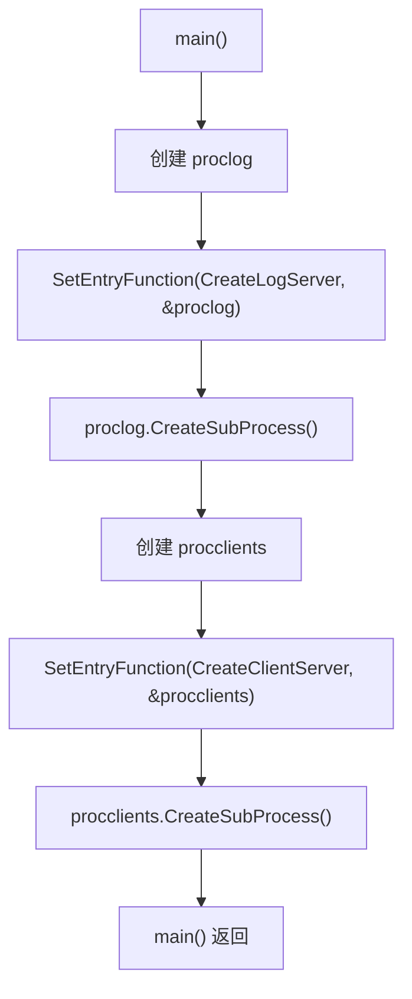
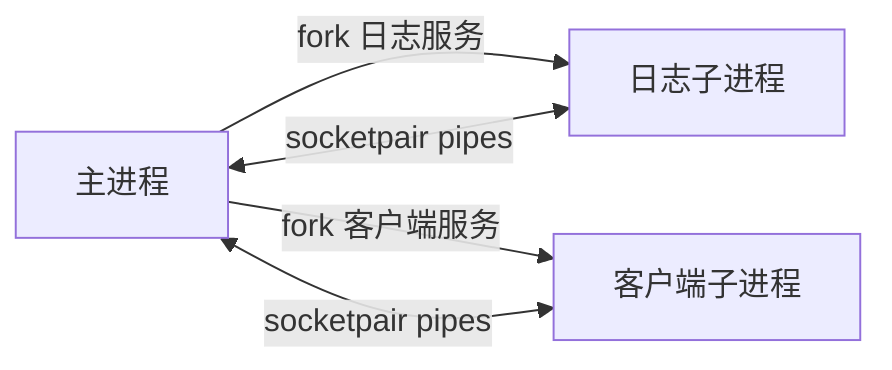

---
title: 线程阶段总览
date: 2026-05-12
tags:
  - linux-server
  - eplayer
  - thread-stage
aliases:
  - Linux播放器服务器线程阶段
status: draft
---

# 线程阶段总览

> [!note] 当前判断
> 目录名是“线程”，但当前代码实际处在“多进程服务器框架”阶段：主进程创建日志服务进程和客户端服务进程，并预留了父子进程之间传递文件描述符的能力。

## 当前源码入口

- 工程入口集中在 [D:/c++/project/Linux_server/EplayerServer/EplayerServer/main.cpp:155](/D:/c++/project/Linux_server/EplayerServer/EplayerServer/main.cpp#L155)。
- `main()` 创建两个 `CProcess` 对象：`proclog` 和 `procclients`。
- 日志服务入口是 `CreateLogServer`，绑定位置见 [D:/c++/project/Linux_server/EplayerServer/EplayerServer/main.cpp:158](/D:/c++/project/Linux_server/EplayerServer/EplayerServer/main.cpp#L158)。
- 客户端服务入口是 `CreateClientServer`，绑定位置见 [D:/c++/project/Linux_server/EplayerServer/EplayerServer/main.cpp:164](/D:/c++/project/Linux_server/EplayerServer/EplayerServer/main.cpp#L164)。

## 启动流程

## 阶段核心

- [[01-CProcess进程封装]]：把子进程创建、入口函数绑定、父子进程管道封装到 `CProcess`。
- [[02-socketpair与FD传递]]：用 `socketpair()` 建立本地双向通信，再用 `sendmsg()` / `recvmsg()` 传递 fd。
- [[03-当前问题清单]]：记录当前实现中需要修正或后续验证的问题。

## 父子进程关系

## 后续演进方向

- 先把当前多进程框架跑通，再补齐日志服务和客户端服务的真实逻辑。
- `SendFD()` / `RecvFD()` 可用于把监听 socket 或已 accept 的客户端 socket 分发给子进程。
- 如果后续进入真正的“线程阶段”，需要区分进程模型和线程模型：进程负责隔离，线程负责并发处理。
