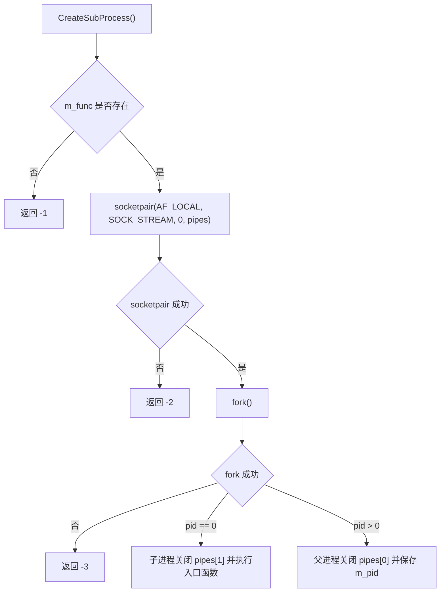

---
title: CProcess进程封装
date: 2026-05-12
tags:
  - linux-server
  - eplayer
  - process
aliases:
  - CProcess
status: draft
---

# CProcess进程封装

`CProcess` 是当前阶段的核心封装，定义位置见 [D:/c++/project/Linux_server/EplayerServer/EplayerServer/main.cpp:34](/D:/c++/project/Linux_server/EplayerServer/EplayerServer/main.cpp#L34)。

## 设计意图

> [!abstract]
> `CProcess` 把“入口函数保存起来 -> 创建 socketpair -> fork 子进程 -> 在子进程里执行入口函数”包装成一个对象接口。

当前类里维护三类状态：

- `m_func`：保存子进程入口函数对象，见 [D:/c++/project/Linux_server/EplayerServer/EplayerServer/main.cpp:140](/D:/c++/project/Linux_server/EplayerServer/EplayerServer/main.cpp#L140)。
- `m_pid`：保存创建出来的子进程 pid，见 [D:/c++/project/Linux_server/EplayerServer/EplayerServer/main.cpp:141](/D:/c++/project/Linux_server/EplayerServer/EplayerServer/main.cpp#L141)。
- `pipes[2]`：保存 `socketpair()` 创建的父子进程通信 fd，见 [D:/c++/project/Linux_server/EplayerServer/EplayerServer/main.cpp:142](/D:/c++/project/Linux_server/EplayerServer/EplayerServer/main.cpp#L142)。

## 函数绑定层

`CFunctionBase` 提供统一的可调用接口，核心是纯虚函数 `operator()()`，见 [D:/c++/project/Linux_server/EplayerServer/EplayerServer/main.cpp:10](/D:/c++/project/Linux_server/EplayerServer/EplayerServer/main.cpp#L10)。

`CFunction` 模板负责把不同函数和参数包装成统一对象，见 [D:/c++/project/Linux_server/EplayerServer/EplayerServer/main.cpp:17](/D:/c++/project/Linux_server/EplayerServer/EplayerServer/main.cpp#L17)。

`SetEntryFunction()` 创建 `CFunction` 并赋给 `m_func`，让后续 `CreateSubProcess()` 可以在子进程中统一调用，见 [D:/c++/project/Linux_server/EplayerServer/EplayerServer/main.cpp:50](/D:/c++/project/Linux_server/EplayerServer/EplayerServer/main.cpp#L50)。

## 子进程创建流程

关键实现位置：

- 检查入口函数：[D:/c++/project/Linux_server/EplayerServer/EplayerServer/main.cpp:59](/D:/c++/project/Linux_server/EplayerServer/EplayerServer/main.cpp#L59)。
- 创建父子通信 socket：[D:/c++/project/Linux_server/EplayerServer/EplayerServer/main.cpp:60](/D:/c++/project/Linux_server/EplayerServer/EplayerServer/main.cpp#L60)。
- `fork()`：[D:/c++/project/Linux_server/EplayerServer/EplayerServer/main.cpp:63](/D:/c++/project/Linux_server/EplayerServer/EplayerServer/main.cpp#L63)。
- 子进程执行入口函数：[D:/c++/project/Linux_server/EplayerServer/EplayerServer/main.cpp:70](/D:/c++/project/Linux_server/EplayerServer/EplayerServer/main.cpp#L70)。
- 父进程保存 pid：[D:/c++/project/Linux_server/EplayerServer/EplayerServer/main.cpp:76](/D:/c++/project/Linux_server/EplayerServer/EplayerServer/main.cpp#L76)。

## 和主流程的关系

`main()` 只负责组织两个服务进程：

- `proclog` 对应日志服务：[D:/c++/project/Linux_server/EplayerServer/EplayerServer/main.cpp:157](/D:/c++/project/Linux_server/EplayerServer/EplayerServer/main.cpp#L157)。
- `procclients` 对应客户端服务：[D:/c++/project/Linux_server/EplayerServer/EplayerServer/main.cpp:157](/D:/c++/project/Linux_server/EplayerServer/EplayerServer/main.cpp#L157)。

更多整体流程见 [[00-线程阶段总览]]，通信机制见 [[02-socketpair与FD传递]]。
