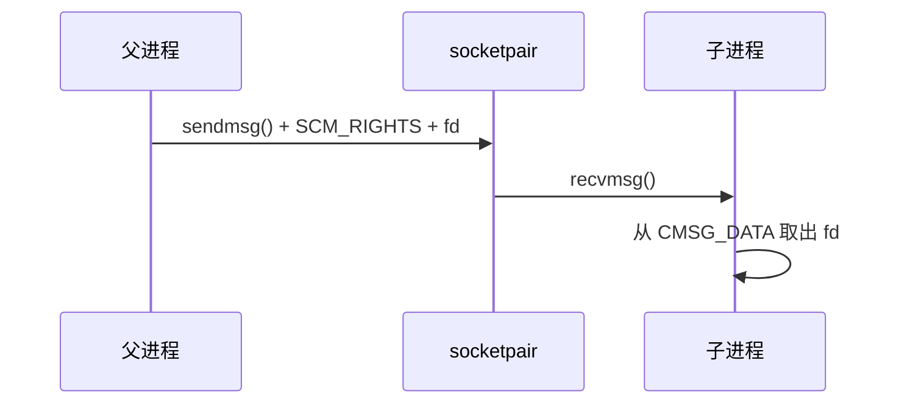

---
title: socketpair与FD传递
date: 2026-05-12
tags:
  - linux-server
  - eplayer
  - ipc
aliases:
  - socketpair
  - 文件描述符传递
status: draft
---

# socketpair与FD传递

当前项目通过 `socketpair()` 为父子进程建立本地通信通道，再预留 `SendFD()` / `RecvFD()` 完成文件描述符传递。

## socketpair 的作用

`socketpair(AF_LOCAL, SOCK_STREAM, 0, pipes)` 创建一对相互连接的 socket fd，代码位置见 [D:/c++/project/Linux_server/EplayerServer/EplayerServer/main.cpp:60](/D:/c++/project/Linux_server/EplayerServer/EplayerServer/main.cpp#L60)。

> [!tip]
> `fork()` 之后，父子进程都会继承 `pipes[0]` 和 `pipes[1]`。当前实现中子进程关闭 `pipes[1]`，父进程关闭 `pipes[0]`，于是每个进程只保留自己要使用的一端。

关闭逻辑：

- 子进程关闭 `pipes[1]`：[D:/c++/project/Linux_server/EplayerServer/EplayerServer/main.cpp:68](/D:/c++/project/Linux_server/EplayerServer/EplayerServer/main.cpp#L68)。
- 父进程关闭 `pipes[0]`：[D:/c++/project/Linux_server/EplayerServer/EplayerServer/main.cpp:74](/D:/c++/project/Linux_server/EplayerServer/EplayerServer/main.cpp#L74)。

## FD 传递模型

普通数据通过 `msg_iov` 携带，真正要传递的 fd 放在控制消息 `msg_control` 中。

## SendFD

`SendFD(int fd)` 起始位置见 [D:/c++/project/Linux_server/EplayerServer/EplayerServer/main.cpp:80](/D:/c++/project/Linux_server/EplayerServer/EplayerServer/main.cpp#L80)。

核心步骤：

- 构造 `msghdr` 和 `iovec`，准备普通数据区。
- 申请 `cmsghdr` 控制消息空间，见 [D:/c++/project/Linux_server/EplayerServer/EplayerServer/main.cpp:92](/D:/c++/project/Linux_server/EplayerServer/EplayerServer/main.cpp#L92)。
- 通过 `CMSG_DATA(cmsg)` 写入要传递的 fd，见 [D:/c++/project/Linux_server/EplayerServer/EplayerServer/main.cpp:97](/D:/c++/project/Linux_server/EplayerServer/EplayerServer/main.cpp#L97)。
- 调用 `sendmsg(pipes[1], &msg, 0)` 发送，见 [D:/c++/project/Linux_server/EplayerServer/EplayerServer/main.cpp:101](/D:/c++/project/Linux_server/EplayerServer/EplayerServer/main.cpp#L101)。

## RecvFD

`RecvFD(int& fd)` 起始位置见 [D:/c++/project/Linux_server/EplayerServer/EplayerServer/main.cpp:110](/D:/c++/project/Linux_server/EplayerServer/EplayerServer/main.cpp#L110)。

核心步骤：

- 准备 `msghdr` 和两个接收缓冲区。
- 申请 `cmsghdr` 控制消息空间，见 [D:/c++/project/Linux_server/EplayerServer/EplayerServer/main.cpp:122](/D:/c++/project/Linux_server/EplayerServer/EplayerServer/main.cpp#L122)。
- 调用 `recvmsg(pipes[0], &msg, 0)` 接收，见 [D:/c++/project/Linux_server/EplayerServer/EplayerServer/main.cpp:129](/D:/c++/project/Linux_server/EplayerServer/EplayerServer/main.cpp#L129)。
- 从 `CMSG_DATA(cmsg)` 中取出 fd，见 [D:/c++/project/Linux_server/EplayerServer/EplayerServer/main.cpp:135](/D:/c++/project/Linux_server/EplayerServer/EplayerServer/main.cpp#L135)。

> [!warning]
> 当前 `SendFD()` / `RecvFD()` 只是结构雏形，存在若干需要修正的问题。具体见 [[03-当前问题清单]]。
