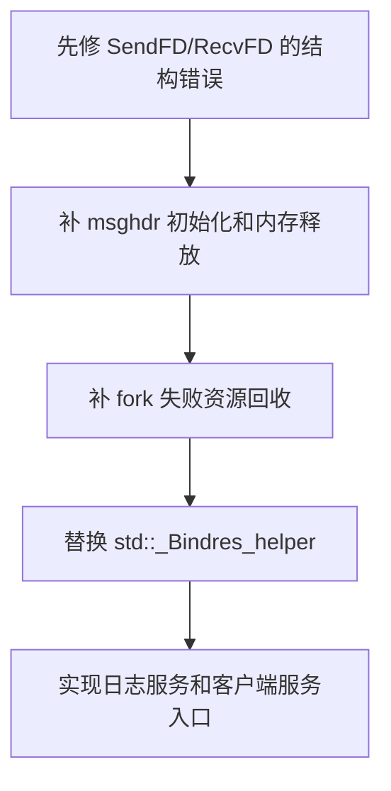

---
title: 当前问题清单
date: 2026-05-12
tags:
  - linux-server
  - eplayer
  - code-review
aliases:
  - 线程阶段问题清单
status: draft
---

# 当前问题清单

> [!warning] 说明
> 本笔记只记录当前阶段的源码问题，不直接修改代码。后续修复时应先复现或编译验证，再做最小改动。

## 需要优先修正

1. `SendFD()` 第二段 `iovec` 写错位置。

   代码在 [D:/c++/project/Linux_server/EplayerServer/EplayerServer/main.cpp:86](/D:/c++/project/Linux_server/EplayerServer/EplayerServer/main.cpp#L86) 和 [D:/c++/project/Linux_server/EplayerServer/EplayerServer/main.cpp:87](/D:/c++/project/Linux_server/EplayerServer/EplayerServer/main.cpp#L87) 仍然写入 `iov[0]`，导致 `iov[1]` 未初始化。

2. `SendFD()` 把 `SCM_RIGHTS` 写到了 `cmsg_level`。

   [D:/c++/project/Linux_server/EplayerServer/EplayerServer/main.cpp:96](/D:/c++/project/Linux_server/EplayerServer/EplayerServer/main.cpp#L96) 应表达控制消息类型，但当前代码再次赋值 `cmsg_level`。正确语义应是 `cmsg_type = SCM_RIGHTS`。

3. `RecvFD()` 成功路径没有释放 `cmsg`。

   失败路径在 [D:/c++/project/Linux_server/EplayerServer/EplayerServer/main.cpp:132](/D:/c++/project/Linux_server/EplayerServer/EplayerServer/main.cpp#L132) 释放了内存，但成功路径 [D:/c++/project/Linux_server/EplayerServer/EplayerServer/main.cpp:135](/D:/c++/project/Linux_server/EplayerServer/EplayerServer/main.cpp#L135) 取出 fd 后直接返回，存在泄漏。

4. `msghdr msg` 没有初始化。

   `SendFD()` 的 `msg` 在 [D:/c++/project/Linux_server/EplayerServer/EplayerServer/main.cpp:82](/D:/c++/project/Linux_server/EplayerServer/EplayerServer/main.cpp#L82) 声明，`RecvFD()` 的 `msg` 在 [D:/c++/project/Linux_server/EplayerServer/EplayerServer/main.cpp:112](/D:/c++/project/Linux_server/EplayerServer/EplayerServer/main.cpp#L112) 声明。没有清零时，未显式设置的字段可能带来不稳定行为。

## 后续关注

1. `m_pid` 没有初始化。

   构造函数初始化了 `m_func` 和 `pipes`，见 [D:/c++/project/Linux_server/EplayerServer/EplayerServer/main.cpp:37](/D:/c++/project/Linux_server/EplayerServer/EplayerServer/main.cpp#L37)，但 `m_pid` 未初始化。虽然创建成功后会在 [D:/c++/project/Linux_server/EplayerServer/EplayerServer/main.cpp:76](/D:/c++/project/Linux_server/EplayerServer/EplayerServer/main.cpp#L76) 赋值，创建前读取会有风险。

2. `std::_Bindres_helper` 属于标准库实现细节。

   成员 `m_binder` 使用 `std::_Bindres_helper`，见 [D:/c++/project/Linux_server/EplayerServer/EplayerServer/main.cpp:31](/D:/c++/project/Linux_server/EplayerServer/EplayerServer/main.cpp#L31)。这种写法依赖特定编译器实现，移植性较差。

3. `fork()` 失败时未关闭已创建的 `socketpair`。

   `fork()` 失败返回位置见 [D:/c++/project/Linux_server/EplayerServer/EplayerServer/main.cpp:64](/D:/c++/project/Linux_server/EplayerServer/EplayerServer/main.cpp#L64)。此时 `pipes` 已经创建，应考虑关闭两端，避免 fd 泄漏。

4. 子进程入口函数目前是空实现。

   `CreateLogServer()` 和 `CreateClientServer()` 目前都直接返回 0，分别见 [D:/c++/project/Linux_server/EplayerServer/EplayerServer/main.cpp:145](/D:/c++/project/Linux_server/EplayerServer/EplayerServer/main.cpp#L145)、[D:/c++/project/Linux_server/EplayerServer/EplayerServer/main.cpp:150](/D:/c++/project/Linux_server/EplayerServer/EplayerServer/main.cpp#L150)。

## 修复建议顺序

相关机制说明见 [[01-CProcess进程封装]] 和 [[02-socketpair与FD传递]]。
