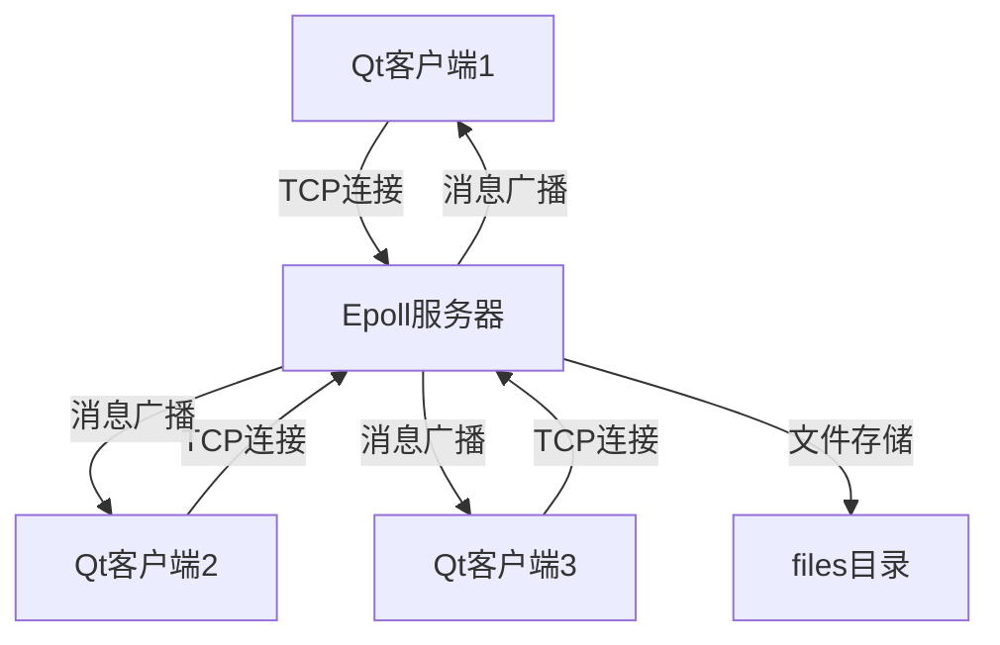
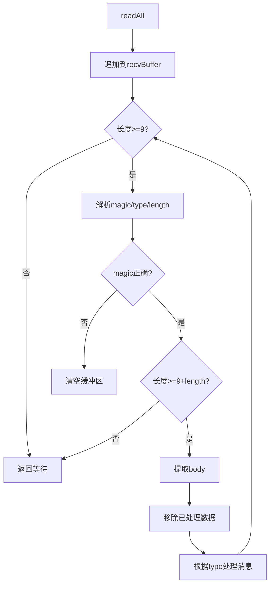
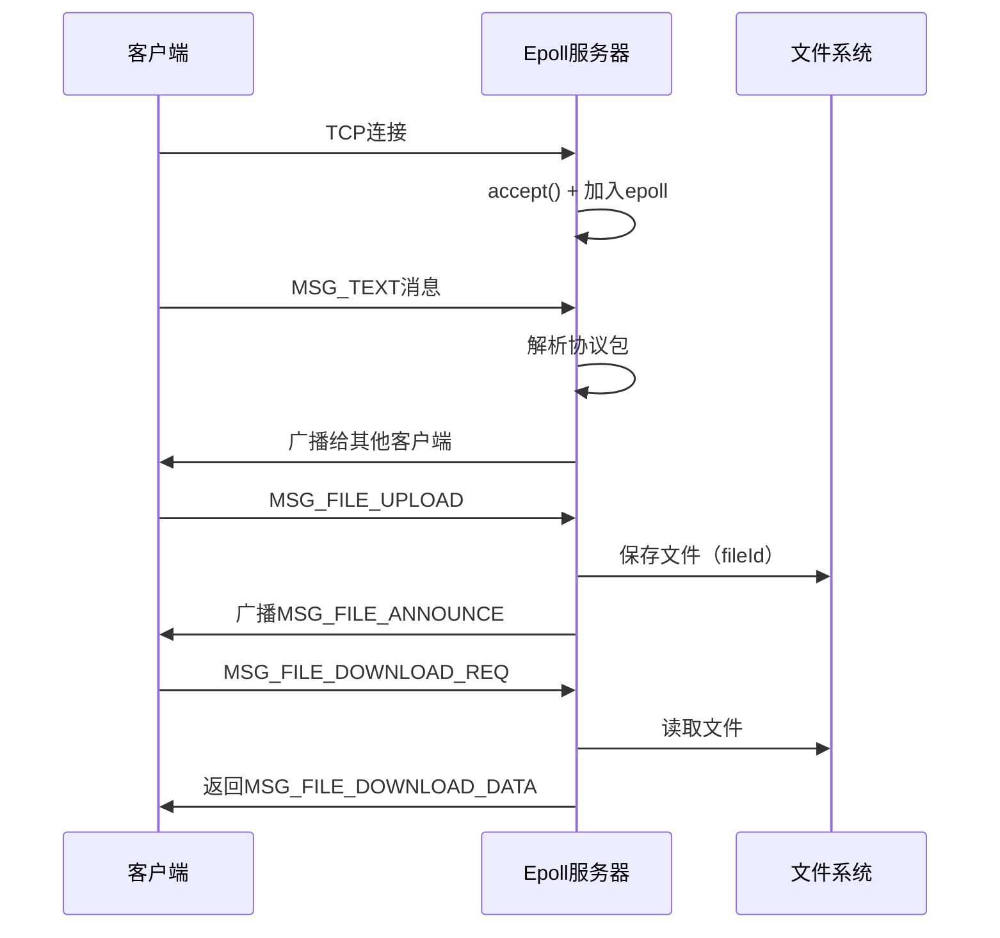
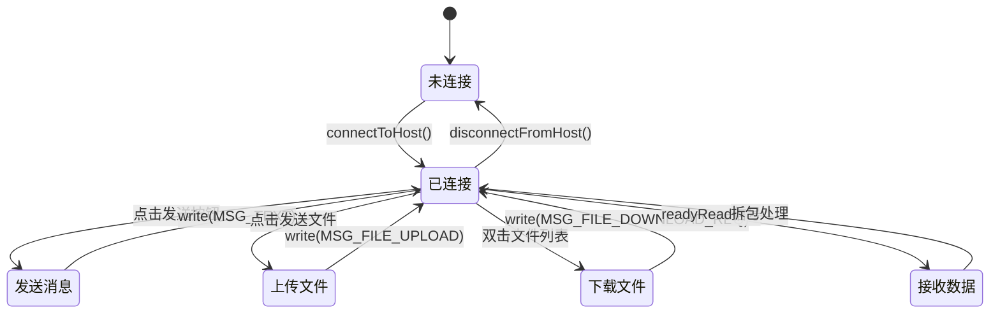

# 聊天室项目技术总结

## 项目概述

这是一个基于 C/S 架构的网络聊天室应用，支持多客户端同时在线、文本消息群发和文件共享功能。

- **后端**: Linux C++ + Epoll 高性能服务器
- **前端**: Qt5 GUI 客户端
- **通信协议**: 自定义二进制协议（大端序）
- **并发模型**: Epoll + 非阻塞IO

## 核心技术架构



---

## 一、后端技术详解

### 1.1 网络编程基础

#### 套接字创建与配置 (EpollServer.cpp:372-396)

```cpp
int listen_fd = ::socket(AF_INET, SOCK_STREAM, 0);
int opt = 1;
::setsockopt(listen_fd, SOL_SOCKET, SO_REUSEADDR, &opt, sizeof(opt));
```

**涉及知识点:**
- 套接字编程 - 套接字概念与创建
- TCP编程 - TCP服务器端基本结构
- TIME_WAIT状态 - SO_REUSEADDR选项的作用

**关键技术:**
- `AF_INET`: IPv4协议族
- `SOCK_STREAM`: TCP流式套接字
- `SO_REUSEADDR`: 允许地址快速重用，避免TIME_WAIT状态阻塞端口

#### 监听队列 (EpollServer.cpp:393)

```cpp
if (::listen(listen_fd, 128) < 0) {
    perror("listen");
}
```

**涉及知识点:**
- listen函数 - 监听队列的backlog参数
- TCP协议基础 - TCP三次握手与半连接队列

**关键参数:**
- `backlog = 128`: 全连接队列长度，决定同时处理多少个待accept的连接

---

### 1.2 IO复用 - Epoll模型

#### Epoll实例创建 (EpollServer.cpp:408-425)

```cpp
int epfd = ::epoll_create1(0);

epoll_event ev {};
ev.events = EPOLLIN;  // 监听可读事件
ev.data.fd = listen_fd;
::epoll_ctl(epfd, EPOLL_CTL_ADD, listen_fd, &ev);
```

**涉及知识点:**
- [[13.1 IO复用简介]] - IO复用的概念与必要性
- [[13.4 epoll模型]] - epoll的三个核心函数

**核心机制:**
- **epoll_create1(0)**: 创建epoll文件描述符
- **epoll_ctl()**: 注册/修改/删除监听的文件描述符
- **epoll_wait()**: 等待事件发生（阻塞）

#### 事件循环 (EpollServer.cpp:433-506)

```cpp
while (true) {
    int n = ::epoll_wait(epfd, events.data(), MAX_EVENTS, -1);

    for (int i = 0; i < n; ++i) {
        int fd = events[i].data.fd;

        if (fd == listen_fd) {
            // 新连接到来
            int conn_fd = ::accept(listen_fd, ...);
            set_non_blocking(conn_fd);
            epoll_ctl(epfd, EPOLL_CTL_ADD, conn_fd, &cev);
        } else if (evts & EPOLLIN) {
            // 客户端数据到来
            recv(fd, buf, sizeof(buf), 0);
        }
    }
}
```

**涉及知识点:**
- 并发服务器模型 - 单线程Reactor模型

**设计亮点:**
1. **单线程事件驱动**: 一个线程管理所有客户端连接
2. **非阻塞IO**: 避免单个客户端阻塞整个服务器
3. **高并发**: 可同时处理数千个连接

---

### 1.3 非阻塞IO设置

#### fcntl设置 (EpollServer.cpp:78-83)

```cpp
bool set_non_blocking(int fd) {
    int flags = fcntl(fd, F_GETFL, 0);
    if (flags == -1) return false;
    if (fcntl(fd, F_SETFL, flags | O_NONBLOCK) == -1) return false;
    return true;
}
```

**涉及知识点:**
- Linux系统编程基础 - fcntl函数详解
- Linux系统编程基础 - 阻塞与非阻塞IO

**为什么需要非阻塞IO:**
- 在Epoll模型中，如果使用阻塞IO，一个客户端的慢速读写会阻塞整个事件循环
- 非阻塞IO配合Epoll，实现真正的异步事件处理

---

### 1.4 自定义应用层协议

#### 协议格式 (EpollServer.cpp:21-32)

```
+--------+-------+--------+------------------+
| MAGIC  | TYPE  | LENGTH |     PAYLOAD      |
| 4 Bytes| 1 Byte| 4 Bytes|  LENGTH Bytes    |
+--------+------+--------+-------------------+
```

**协议头定义:**

```cpp
constexpr uint32_t MAGIC = 0x48574600;  // "HWF"协议魔数
constexpr int HEADER_SIZE = 4 + 1 + 4;  // 9字节固定头

enum MsgType : uint8_t {
    MSG_TEXT = 1,               // 普通文本
    MSG_FILE_UPLOAD = 2,        // 文件上传
    MSG_FILE_ANNOUNCE = 3,      // 文件公告（广播）
    MSG_FILE_DOWNLOAD_REQ = 4,  // 文件下载请求
    MSG_FILE_DOWNLOAD_DATA = 5  // 文件下载响应
};
```

**涉及知识点:**
- 网络编程基础 - 应用层协议设计
- TCP粘包与拆包 - 为什么需要协议头

**协议设计关键:**
1. **MAGIC**: 协议魔数，用于校验数据合法性
2. **TYPE**: 消息类型，实现多种业务逻辑
3. **LENGTH**: 负载长度，解决TCP粘包问题
4. **大端序**: 网络字节序标准，确保跨平台兼容

---

### 1.5 网络字节序处理

#### 大端序读写 (EpollServer.cpp:53-76)

```cpp
// 读取大端序 uint32
uint32_t read_u32(const uint8_t *p) {
    return (p[0] << 24) | (p[1] << 16) | (p[2] << 8) | p[3];
}

// 写入大端序 uint32
void write_u32(std::vector<uint8_t> &buf, uint32_t v) {
    buf.push_back((v >> 24) & 0xFF);
    buf.push_back((v >> 16) & 0xFF);
    buf.push_back((v >> 8) & 0xFF);
    buf.push_back(v & 0xFF);
}
```

**涉及知识点:**
- 网络编程基础 - 字节序转换与大端序小端序
- 位运算符 - 位移和位掩码操作

**为什么手动实现:**
- 标准的`htonl()`/`ntohl()`只适用于32位整数
- 需要处理64位文件大小（uint64_t），需自定义函数
- 确保跨平台字节序一致性

---

### 1.6 消息处理机制

#### 粘包拆包处理 (EpollServer.cpp:302-367)

```cpp
void process_client_buffer(std::unordered_map<int, Client> &clients, int fd)
{
    Client &cli = clients[fd];
    auto &buf = cli.recvBuffer;

    while (true) {
        // 1. 检查是否有完整的协议头
        if (buf.size() < HEADER_SIZE) return;

        // 2. 解析协议头
        uint32_t magic = read_u32(buf.data());
        uint8_t type = buf[4];
        uint32_t length = read_u32(buf.data() + 5);

        // 3. 检查magic合法性
        if (magic != MAGIC) {
            close(fd);
            clients.erase(fd);
            return;
        }

        // 4. 检查payload是否完整
        if (buf.size() < HEADER_SIZE + length)
            return;  // 等待更多数据

        // 5. 提取payload并处理
        const uint8_t *payload = buf.data() + HEADER_SIZE;
        handle_message(type, payload, length);

        // 6. 移除已处理的数据
        buf.erase(buf.begin(), buf.begin() + HEADER_SIZE + length);
    }
}
```

**涉及知识点:**
- TCP粘包与拆包 - TCP流式传输的特性
- TCP编程 - 接收缓冲区管理

**拆包策略:**
1. **累积接收**: 将收到的数据追加到缓冲区
2. **循环处理**: 一次recv可能包含多个完整消息
3. **边界检测**: 通过LENGTH字段判断消息完整性
4. **残留处理**: 保留不完整的消息，等待下次数据到来

---

### 1.7 消息广播机制

#### 群发消息 (EpollServer.cpp:85-98)

```cpp
void broadcast_packet(const std::unordered_map<int, Client>& clients,
                      int from_fd,
                      const std::vector<uint8_t>& packet)
{
    for (const auto &kv : clients) {
        int cfd = kv.first;

        if (cfd == from_fd) {
            continue;  // 不发送给自己
        }

        ::send(cfd, packet.data(), packet.size(), 0);
    }
}
```

**涉及知识点:**
- TCP编程 - 回声服务器的基本收发模式
- [[14.5 map]] - 哈希表遍历

**设计特点:**
- **排除发送者**: 避免消息回环
- **统一格式**: 所有客户端收到相同的二进制数据包
- **无差别广播**: 不区分客户端身份（简化版，生产环境需考虑权限）

---

### 1.8 文件上传与存储

#### 文件上传处理 (EpollServer.cpp:118-208)

**消息格式:**

```
MSG_FILE_UPLOAD payload:
+----------+----------+----------+-------------+
| nameLen  | fileName | fileSize |  fileData   |
| 4 Bytes  | nameLen  | 8 Bytes  | fileSize    |
+----------+----------+----------+-------------+
```

**处理流程:**

```cpp
void handle_file_upload(...) {
    // 1. 解析文件名长度和文件名
    uint32_t nameLen = read_u32(payload);
    std::string fileName((char*)(payload + 4), nameLen);

    // 2. 解析文件大小
    uint64_t fileSize = read_u64(payload + 4 + nameLen);

    // 3. 提取文件数据
    const uint8_t* fileData = payload + 4 + nameLen + 8;

    // 4. 保存到磁盘
    mkdir("files", 0755);
    uint32_t fileId = g_nextFileId++;
    std::string path = "files/" + std::to_string(fileId) + "_" + fileName;
    std::ofstream ofs(path, std::ios::binary);
    ofs.write((char*)fileData, fileSize);
    ofs.close();

    // 5. 广播文件公告（MSG_FILE_ANNOUNCE）
    broadcast_file_announce(fileId, fileName, fileSize);
}
```

**涉及知识点:**
- 文件与目录操作 - 二进制文件写入
- 文件与目录操作 - mkdir创建目录
- [[8.1 string]] - 字符串拼接

**设计细节:**
- **文件ID自增**: 防止文件名冲突
- **保留原文件名**: 方便客户端下载时识别
- **二进制模式**: `std::ios::binary` 确保文件完整性

---

### 1.9 文件下载机制

#### 下载请求处理 (EpollServer.cpp:212-299)

**流程:**

```cpp
void handle_file_download_req(...) {
    // 1. 解析请求的文件ID
    uint32_t fileId = read_u32(payload);

    // 2. 在文件表中查找
    auto it = std::find_if(g_files.begin(), g_files.end(),
                           [fileId](const FileInfo& info) {
                               return info.id == fileId;
                           });

    if (it == g_files.end()) {
        // 文件不存在，返回错误消息
        send_error_message(to_fd, "File not found");
        return;
    }

    // 3. 读取文件内容
    std::ifstream ifs(it->path, std::ios::binary);
    std::vector<uint8_t> fileData(
        (std::istreambuf_iterator<char>(ifs)),
         std::istreambuf_iterator<char>());

    // 4. 构造 MSG_FILE_DOWNLOAD_DATA 响应
    // payload: [fileId][nameLen][fileName][fileSize][fileData]

    // 5. 只发送给请求者（不广播）
    send(to_fd, packet.data(), packet.size(), 0);
}
```

**涉及知识点:**
- 文件与目录操作 - 文件读取
- lambda表达式 - lambda在STL算法中的应用
- [[14.1 vector]] - vector的迭代器构造

**关键技术:**
- **`std::istreambuf_iterator`**: 高效读取整个文件到内存
- **`std::find_if` + lambda**: 在文件列表中快速查找
- **点对点传输**: 不广播下载数据，避免浪费带宽

---

### 1.10 数据结构设计

#### 客户端结构 (EpollServer.cpp:34-37)

```cpp
struct Client {
    int fd;                         // 套接字文件描述符
    std::vector<uint8_t> recvBuffer; // 接收缓冲区
};
```

**涉及知识点:**
- 结构体定义 - Client/FileInfo结构定义
- [[14.1 vector]] - 动态数组的使用

**设计理由:**
- **recvBuffer**: 存储未处理的TCP字节流，解决粘包问题
- **动态扩容**: `vector<uint8_t>` 自动管理内存

#### 文件信息结构 (EpollServer.cpp:40-46)

```cpp
struct FileInfo {
    uint32_t id;           // 文件唯一ID
    std::string fileName;  // 原始文件名
    uint64_t size;         // 文件大小（字节）
    std::string uploader;  // 上传者（预留）
    std::string path;      // 磁盘存储路径
};

std::vector<FileInfo> g_files;  // 全局文件表
```

**涉及知识点:**
- [[8.1 string]] - string的使用
- [[14.1 vector]] - 作为动态文件表

---

## 二、前端技术详解

### 2.1 Qt网络编程

#### TCP客户端创建 (mainwindow.cpp:24-49)

```cpp
m_socket(new QTcpSocket(this))

// 连接socket信号
connect(m_socket, &QTcpSocket::connected,
        this, &MainWindow::onSocketConnected);
connect(m_socket, &QTcpSocket::disconnected,
        this, &MainWindow::onSocketDisconnected);
connect(m_socket, &QTcpSocket::readyRead,
        this, &MainWindow::onSocketReadyRead);
connect(m_socket, &QTcpSocket::errorOccurred,
        this, &MainWindow::onSocketErrorOccurred);
```

**涉及知识点:**
- Windows网络编程 - TCP客户端对比
- **Qt特有**: 信号槽机制，异步事件驱动

**Qt vs 原始socket:**

| 特性 | Qt QTcpSocket | 原始socket API |
|------|--------------|----------------|
| 连接建立 | `connectToHost()` | `connect()` |
| 数据接收 | `readAll()` | `recv()/read()` |
| 事件通知 | 信号槽 | epoll/select |
| 错误处理 | `errorOccurred` | errno |

---

### 2.2 信号槽机制

#### 事件驱动架构 (mainwindow.cpp:37-49)

```cpp
// 按钮点击事件
connect(ui->btnSend, &QPushButton::clicked,
        this, &MainWindow::onSendButtonClicked);

// 网络事件
connect(m_socket, &QTcpSocket::readyRead,
        this, &MainWindow::onSocketReadyRead);

// 双击列表项
connect(ui->listWidgetFiles, &QListWidget::itemDoubleClicked,
        this, &MainWindow::onFileItemDoubleClicked);
```

**核心概念:**
- **信号(Signal)**: 事件发生的通知（如按钮点击、数据到达）
- **槽(Slot)**: 响应信号的函数
- **自动连接**: Qt的元对象系统（MOC）自动管理

**与观察者模式的关系:**
- 类似于C++面向对象编程中的观察者模式
- Qt在编译时通过MOC（Meta-Object Compiler）生成连接代码

---

### 2.3 二进制数据流处理

#### QDataStream使用 (mainwindow.cpp:112-124)

```cpp
QByteArray packet;
QDataStream ds(&packet, QIODevice::WriteOnly);
ds.setByteOrder(QDataStream::BigEndian);  // 设置大端序

quint32 magic  = kMagic;
quint8  type   = MsgText;
quint32 length = payload.size();

ds << magic;   // 自动转为大端序
ds << type;
ds << length;

packet.append(payload);
m_socket->write(packet);
```

**涉及知识点:**
- vector容器 - 动态字节数组的概念
- 网络编程基础 - 字节序转换与大端序

**QDataStream优势:**
- **自动序列化**: `operator<<` 自动处理字节序转换
- **类型安全**: 编译期检查类型错误
- **代码简洁**: 避免手动位移操作

---

### 2.4 消息接收与拆包

#### 接收缓冲区管理 (mainwindow.cpp:260-396)

```cpp
void MainWindow::onSocketReadyRead()
{
    // 1. 读取socket缓冲区中的所有数据
    QByteArray data = m_socket->readAll();
    m_recvBuffer.append(data);

    const int headerSize = 4 + 1 + 4;  // 9字节

    // 2. 循环拆包
    while (true) {
        // 2.1 检查是否有完整的协议头
        if (m_recvBuffer.size() < headerSize)
            return;

        // 2.2 解析协议头
        QDataStream ds(m_recvBuffer);
        ds.setByteOrder(QDataStream::BigEndian);

        quint32 magic;
        quint8  type;
        quint32 length;
        ds >> magic >> type >> length;

        // 2.3 校验magic
        if (magic != kMagic) {
            appendSystemMessage("协议错误");
            m_recvBuffer.clear();
            return;
        }

        // 2.4 检查payload是否完整
        if (m_recvBuffer.size() < headerSize + int(length))
            return;  // 等待更多数据

        // 2.5 提取body
        m_recvBuffer.remove(0, headerSize);
        QByteArray body = m_recvBuffer.left(length);
        m_recvBuffer.remove(0, length);

        // 2.6 根据type分发处理
        if (type == MsgText) {
            handle_text(body);
        } else if (type == MsgFileAnnounce) {
            handle_file_announce(body);
        } else if (type == MsgFileDownloadData) {
            handle_file_download(body);
        }
    }
}
```

**拆包流程图:**



**涉及知识点:**
- TCP粘包与拆包 - 为什么需要循环处理
- TCP编程 - TCP缓冲区的工作原理

---

### 2.5 文件上传实现

#### 文件选择与上传 (mainwindow.cpp:189-258)

```cpp
void MainWindow::onSendFileButtonClicked()
{
    // 1. 打开文件选择对话框
    const QString filePath =
            QFileDialog::getOpenFileName(this, tr("选择要发送的文件"));

    // 2. 读取文件全部内容到内存
    QFile file(filePath);
    file.open(QIODevice::ReadOnly);
    QByteArray fileData = file.readAll();
    file.close();

    // 3. 提取文件名和大小
    QString fileName = QFileInfo(filePath).fileName();
    QByteArray nameBytes = fileName.toUtf8();
    quint32 nameLen = nameBytes.size();
    quint64 fileSize = fileData.size();

    // 4. 构造 payload: [nameLen][name][fileSize][fileData]
    QByteArray payload;
    QDataStream ds(&payload, QIODevice::WriteOnly);
    ds.setByteOrder(QDataStream::BigEndian);

    ds << nameLen;
    ds.writeRawData(nameBytes.constData(), nameBytes.size());
    ds << fileSize;
    ds.writeRawData(fileData.constData(), fileData.size());

    // 5. 封装为完整协议包
    QByteArray packet;
    QDataStream pds(&packet, QIODevice::WriteOnly);
    pds.setByteOrder(QDataStream::BigEndian);
    pds << kMagic << quint8(MsgFileUpload) << quint32(payload.size());
    packet.append(payload);

    // 6. 发送
    m_socket->write(packet);
}
```

**涉及知识点:**
- 文件与目录操作 - 文件读取的原理
- **Qt特有**: `QFileDialog`、`QFileInfo` GUI组件

**注意事项:**
- **内存限制**: 一次性读取整个文件到内存，不适合大文件（GB级）
- **改进方案**: 分块上传 + 进度条

---

### 2.6 文件下载实现

#### 文件列表管理 (mainwindow.h:40-45)

```cpp
struct RemoteFile {
    quint32 id;        // 服务器分配的文件ID
    QString name;      // 文件名
    quint64 size;      // 文件大小
};
QVector<RemoteFile> m_remoteFiles;  // 远程文件列表
```

#### 下载请求 (mainwindow.cpp:398-445)

```cpp
void MainWindow::onFileItemDoubleClicked(QListWidgetItem *item)
{
    int row = ui->listWidgetFiles->row(item);
    const RemoteFile &rf = m_remoteFiles[row];

    // 构造下载请求
    QByteArray payload;
    QDataStream ds(&payload, QIODevice::WriteOnly);
    ds.setByteOrder(QDataStream::BigEndian);
    ds << rf.id;  // 只发送文件ID

    // 封装为完整协议包
    QByteArray packet;
    QDataStream pds(&packet, QIODevice::WriteOnly);
    pds << kMagic << quint8(MsgFileDownloadReq) << quint32(payload.size());
    packet.append(payload);

    m_socket->write(packet);
}
```

#### 下载数据处理 (mainwindow.cpp:343-389)

```cpp
// 收到 MSG_FILE_DOWNLOAD_DATA
QDataStream bs(body);
bs.setByteOrder(QDataStream::BigEndian);

quint32 fileId;
quint32 nameLen;
quint64 fileSize;

bs >> fileId >> nameLen;

QByteArray nameBytes(nameLen, 0);
bs.readRawData(nameBytes.data(), nameLen);
QString fileName = QString::fromUtf8(nameBytes);

bs >> fileSize;

QByteArray fileData(fileSize, 0);
bs.readRawData(fileData.data(), fileSize);

// 弹出保存对话框
QString savePath = QFileDialog::getSaveFileName(this, tr("保存文件"), fileName);

QFile out(savePath);
out.open(QIODevice::WriteOnly);
out.write(fileData);
out.close();
```

**涉及知识点:**
- 文件与目录操作 - 文件保存
- [[14.1 vector]] - QVector的使用

---

## 三、关键技术对比与总结

### 3.1 Epoll vs Select/Poll

| 特性 | Epoll | Select | Poll |
|------|-------|--------|------|
| 时间复杂度 | O(活跃连接数) | O(总连接数) | O(总连接数) |
| 最大连接数 | 无限制 | 1024（可调） | 无限制 |
| 跨平台 | 仅Linux | POSIX | POSIX |
| 适用场景 | 高并发服务器 | 少量连接 | 中等连接数 |

**涉及知识点:**
- select模型 - Select的工作原理
- poll模型 - Poll的改进
- [[13.4 epoll模型]] - Epoll的性能优势

**本项目选择Epoll的理由:**
1. **高并发**: 支持数千个客户端同时在线
2. **事件通知**: 只通知活跃连接，减少无效遍历
3. **内核支持**: 文件描述符在内核态管理，减少用户态/内核态切换

---

### 3.2 阻塞IO vs 非阻塞IO

| 特性 | 阻塞IO | 非阻塞IO + Epoll |
|------|--------|------------------|
| recv无数据时 | 阻塞等待 | 立即返回-1（EAGAIN） |
| 线程利用率 | 每连接需要一个线程 | 单线程处理所有连接 |
| 上下文切换 | 频繁 | 极少 |
| 适用场景 | 简单客户端 | 高性能服务器 |

**涉及知识点:**
- Linux系统编程 - 阻塞IO的问题
- [[12.1 线程简介]] - 多线程的开销

---

### 3.3 C++ STL容器选择

#### std::unordered_map vs std::map

```cpp
// 本项目使用 unordered_map 存储客户端
std::unordered_map<int, Client> clients;
```

**涉及知识点:**
- [[14.5 map]] - 两者的性能差异

| 操作 | unordered_map | map |
|------|---------------|-----|
| 查找/插入/删除 | O(1) 平均 | O(log n) |
| 遍历顺序 | 无序 | 按key排序 |
| 内存占用 | 更多（哈希表） | 更少（红黑树） |

**选择理由:**
- 客户端频繁的增删查操作，`unordered_map` 的 O(1) 性能更优
- 不需要按fd排序

#### std::vector vs std::list

```cpp
// 接收缓冲区使用 vector
std::vector<uint8_t> recvBuffer;
```

**涉及知识点:**
- [[14.1 vector]] - vector的内存布局
- list容器 - list的双向链表结构

| 操作 | vector | list |
|------|--------|------|
| 尾部插入 | O(1) 摊销 | O(1) |
| 头部删除 | O(n) | O(1) |
| 随机访问 | O(1) | O(n) |
| 内存连续性 | 连续 | 不连续 |

**选择理由:**
- 缓冲区主要操作: 尾部追加（append）、头部删除（erase）
- `vector` 内存连续，缓存友好
- `erase(begin(), begin()+n)` 虽然是 O(n)，但数据量小时性能可接受

---

### 3.4 大端序 vs 小端序

**网络字节序规定:**
- **大端序 (Big-Endian)**: 高字节存储在低地址（网络标准）
- **小端序 (Little-Endian)**: 低字节存储在低地址（x86 CPU）

**示例:**

```cpp
uint32_t value = 0x12345678;

// 大端序内存布局（网络传输）
// [12] [34] [56] [78]

// 小端序内存布局（x86）
// [78] [56] [34] [12]
```

**涉及知识点:**
- 网络编程基础 - htonl/ntohl字节序转换函数
- 进程的虚拟地址空间 - 内存地址布局

**本项目处理:**
- **后端**: 手动实现 `read_u32()`/`write_u32()` 处理大端序
- **前端**: 使用 `QDataStream::BigEndian` 自动转换

---

## 四、项目涉及的核心知识点汇总

### 4.1 Linux系统编程

1. **网络编程**
   - 套接字编程 - socket/bind/listen/accept
   - TCP原理 - TCP三次握手
   - TCP粘包与拆包 - 应用层协议设计
   - TIME_WAIT状态 - SO_REUSEADDR选项

2. **IO复用**
   - [[13.1 IO复用简介]] - 为什么需要IO复用
   - [[13.4 epoll模型]] - epoll三板斧

3. **文件IO**
   - Linux IO函数 - open/read/write/close
   - Linux IO函数 - fcntl设置非阻塞
   - 文件与目录函数 - mkdir创建目录

---

### 4.2 C++基础

1. **指针与内存**
   - [[6.1基本指针]] - 指针的基本用法
   - [[6.2 动态内存分配与释放]] - new/delete
   - C++智能指针 - 现代C++内存管理（可优化）

2. **结构体**
   - [[7.1 结构体]] - Client/FileInfo结构定义

3. **函数与模板**
   - lambda表达式 - `std::find_if`中的lambda
   - C++函数基础 - 引用传参

---

### 4.3 C++高级

1. **STL容器**
   - [[14.1 vector]] - 缓冲区管理
   - [[14.5 map]] - 客户端哈希表

2. **C++11特性**
   - C++11特性 - auto类型推导
   - C++11特性 - lambda表达式与查找文件ID

3. **迭代器**
   - C++迭代器 - `std::istreambuf_iterator` 读取文件

---

### 4.4 跨平台对比

| 概念 | Linux实现 | Windows实现 |
|------|----------|-------------|
| IO复用 | epoll | select模型 |
| TCP服务器 | TCP服务器端实现 | TCP简单示例 |
| 非阻塞IO | fcntl + O_NONBLOCK | ioctlsocket + FIONBIO |

---

## 五、项目架构总结

### 5.1 后端核心流程



### 5.2 前端核心流程



---

## 六、项目改进方向

根据《Linux多线程服务端编程》和《Effective Modern C++》的最佳实践，以下是改进建议：

### 6.1 内存管理优化

**问题:** 使用原始指针和手动内存管理

```cpp
// 当前代码
Client* c = new Client();
clients[fd] = c;  // 潜在内存泄漏风险
```

**改进:** 使用智能指针

```cpp
// 改进后
std::unordered_map<int, std::unique_ptr<Client>> clients;
clients[fd] = std::make_unique<Client>();
```

**涉及知识点:**
- C++智能指针 - unique_ptr独占所有权
- C++智能指针 - shared_ptr共享所有权

---

### 6.2 并发模型优化

**问题:** 单线程处理所有IO，CPU利用率低

**改进:** One Loop Per Thread模型（muduo风格）

```cpp
// 参考《Linux多线程服务端编程》第8章
EventLoopThreadPool pool(4);  // 4个IO线程
pool.start();

// 新连接到来时分配到某个IO线程
EventLoop* loop = pool.getNextLoop();
loop->addConnection(conn_fd);
```

**涉及知识点:**
- [[12.2 线程的创建与运行]] - 线程创建
- C++11特性 - thread线程库
- **《Linux多线程服务端编程》**: Reactor + 线程池模式

---

### 6.3 协议安全性增强

**问题:** 缺少身份验证和加密

**改进:**
1. **身份验证**: 添加 `MSG_LOGIN` 消息类型
2. **加密传输**: 使用TLS/SSL（参考OpenSSL库）
3. **消息完整性**: 添加CRC32校验和

**涉及知识点:**
- TCP编程 - TLS/SSL安全传输原理
- C++基础 - 简单加密实现

---

### 6.4 大文件传输优化

**问题:** 一次性读取整个文件到内存，OOM风险

**改进:** 分块传输 + 进度反馈

```cpp
// 分块读取（每次8KB）
constexpr size_t CHUNK_SIZE = 8192;
while (!ifs.eof()) {
    char chunk[CHUNK_SIZE];
    ifs.read(chunk, CHUNK_SIZE);
    size_t n = ifs.gcount();
    send_chunk(fd, chunk, n);
}
```

**涉及知识点:**
- 文件与目录操作 - 分块读取文件
- TCP编程 - 流式传输

---

### 6.5 错误处理增强

**问题:** 大量 `perror()` 打印，缺少日志系统

**改进:** 使用日志库（spdlog/glog）

```cpp
#include <spdlog/spdlog.h>

if (listen_fd < 0) {
    spdlog::error("socket() failed: {}", strerror(errno));
    return;
}
```

**涉及知识点:**
- Linux基础函数 - printf族函数
- **《Effective Modern C++》Item 18**: 使用`std::unique_ptr`管理日志对象

---

## 七、编译与运行

### 7.1 后端编译 (CMake)

```bash
cd 项目/聊天室/代码/后端
mkdir build && cd build
cmake ..
make
./ChatServer 8080
```

**涉及知识点:**
- Makefile与CMake - CMakeLists.txt编写基础
- Makefile与CMake - target_link_libraries配置

---

### 7.2 前端编译 (qmake)

```bash
cd 项目/聊天室/代码/前端
qmake ChatRoom.pro
make
./ChatRoom
```

**涉及知识点:**
- **Qt构建系统**: `.pro` 文件配置

---

## 八、关键代码位置索引

| 功能模块 | 文件 | 行号 |
|---------|------|------|
| Epoll创建 | EpollServer.cpp | 408-425 |
| 事件循环 | EpollServer.cpp | 433-506 |
| 粘包拆包 | EpollServer.cpp | 302-367 |
| 文件上传处理 | EpollServer.cpp | 118-208 |
| 文件下载处理 | EpollServer.cpp | 212-299 |
| Qt消息拆包 | mainwindow.cpp | 260-396 |
| 文件上传UI | mainwindow.cpp | 189-258 |
| 文件下载UI | mainwindow.cpp | 398-445 |

---

## 九、参考资料

### 书籍

1. **《Linux多线程服务端编程》** - 陈硕
   - 第8章: Reactor模式
   - 第13章: muduo网络库设计

2. **《Effective Modern C++》** - Scott Meyers
   - Item 18: 使用`std::unique_ptr`管理独占资源
   - Item 21: 优先使用`std::make_unique`和`std::make_shared`

3. **《Computer Networking: A Top-Down Approach》** - Kurose
   - Chapter 3.5: TCP协议详解

### 相关笔记

- [[13.4 epoll模型]]
- TCP粘包与拆包
- [[14.5 map]]

---

## 总结

本聊天室项目是一个**网络编程 + 系统编程 + C++ STL**的综合实践案例，涵盖以下核心技术：

1. ✅ **Epoll高性能IO复用** - 支持高并发连接
2. ✅ **自定义二进制协议** - 解决TCP粘包问题
3. ✅ **非阻塞IO** - 单线程事件驱动架构
4. ✅ **STL容器高效使用** - unordered_map/vector管理状态
5. ✅ **Qt跨平台GUI** - 信号槽机制实现异步事件
6. ✅ **文件传输** - 二进制文件的网络传输

**学习价值:**
- 深入理解Linux网络编程的核心API
- 掌握现代C++的STL容器和算法
- 理解Reactor模式在网络服务器中的应用
- 学习Qt框架的事件驱动编程模型

**后续优化方向:**
- 引入多线程提升CPU利用率
- 使用智能指针改善内存管理
- 添加TLS加密保障通信安全
- 实现大文件的分块传输和断点续传
