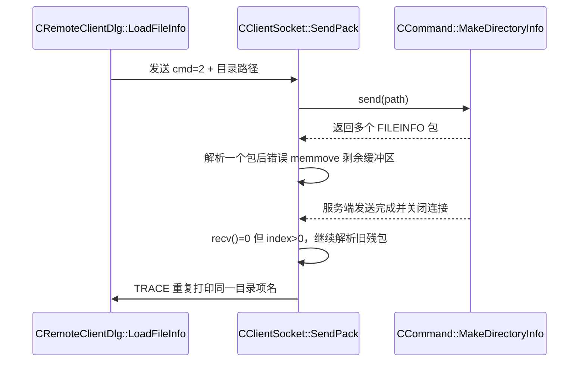

---
tags:
  - 项目/远控系统
  - debug
git: "8d2e3c3"
---

# Debug-020 单击目录一次后重复解析同一FILEINFO导致日志刷屏

> **现象**：客户端只点击一次文件树中的 `Program Files`，输出窗口却快速重复打印 `Microsoft`，目录树展开异常。
> **根因**：`CClientSocket::SendPack()` 在处理 `cmd=2` 多包目录响应时，错误地搬运了剩余缓冲区；当服务端关闭连接后，本地错位残包又被反复拿来解析，`CPacket` 构造函数里的 `TRACE("%s", strData.c_str() + 12)` 就会持续打印同一个目录项名。

---

## Bug 基本信息

| 项目 | 内容 |
|------|------|
| **编号** | Debug-020 |
| **严重程度** | 🔴 功能失常 + 日志刷屏 |
| **分类** | TCP 流式接收 + 缓冲区剩余数据搬运错误 |
| **commit** | `8d2e3c3` |
| **出现场景** | 单击目录树中的 `Program Files`，客户端接收多个 `FILEINFO` 包时 |

---

## 现象描述

1. 文件树只点击一次 `Program Files`。
2. `RemoteClient\CClientSocket.h(82)` 开始连续快速打印 `Microsoft`。
3. 目录树可能不展开、展开不完整，或者看起来像在反复收到同一个目录项。
4. 网络已经联通，说明不是 NAT/IP 问题，而是 `cmd=2` 的收包与解析出了问题。

---

## 调试过程

1. 先确认不是重复点击触发，因为这次只单击一次也能稳定复现。
2. 定位到 `RemoteClient\CClientSocket.h` 的 `TRACE("%s\r\n", strData.c_str() + 12);`。
3. 继续核对 `FILEINFO` 结构，发现前 12 字节正好是 `IsInvalid / IsDirectory / HasNext` 三个 `BOOL`，所以这里打印的其实就是 `szFileName`。
4. 顺着调用链继续追：
   `CRemoteClientDlg::LoadFileInfo()` -> `SendCommandPacket(cmd=2)` -> `CClientSocket::SendPack()` -> `CPacket((BYTE*)pBuffer, nLen)`。
5. 在 `SendPack()` 中发现，包解析成功后这两行写反了“剩余数据”的搬运方向：

```cpp
index -= nLen;
memmove(pBuffer, pBuffer + index, nLen);
```

6. 结果是：当一次 `recv()` 里带回来多个目录包时，客户端并没有把“未解析的剩余字节”搬到缓冲区开头，而是把一段错误位置的数据覆盖到了开头。
7. 如果这时服务端又正好发完目录内容并关闭连接，`recv()` 返回 `0`，但客户端由于 `index > 0` 还会继续尝试解析这段错位残包，于是同一个目录名会被反复打印，形成刷屏。

```
在 Winsock 里：

- recv() > 0：收到了数据
- recv() = 0：对端正常关闭连接
- recv() < 0：出错

所以 recv() = 0 不是“收到 0 字节数据包”，而是“这条连接结束了”。

index > 0 是什么意思?
表示：

客户端本地缓冲区里还残留着一些还没清掉的有效字节。

你这里的 index 表示的是：

`当前 pBuffer 里有效数据的总长度`

比如：

- 这次 recv() 收到了 18 字节
- 成功解析掉前 10 字节
- 理论上还剩 8 字节没处理

那就应该是：

`index = 8`

也就是说：

虽然 socket 可能已经关了，但内存里的旧数据还没被清干净。
```


---

## 关键链路



---

## 根因分析

### 1. `CClientSocket.h(82)` 打印的不是“循环变量”，而是目录项名

```cpp
TRACE("%s\r\n", strData.c_str() + 12);
```

这里的 `+12` 不是魔法数字，而是跳过 `FILEINFO` 结构开头的三个 `BOOL` 字段。所以它会直接把当前包里的目录项名字打印出来。`Microsoft` 只是 `Program Files` 下某个目录名，不是额外生成的字符串。

### 2. 真正的问题在 `SendPack()` 的剩余缓冲区搬运逻辑

现有代码：

```cpp
index -= nLen;
memmove(pBuffer, pBuffer + index, nLen);
```

这里应该搬的是“剩余未解析数据”，但现有写法搬的是“从错误位置开始的 `nLen` 字节”。

正确语义应该是：

- 已解析掉 `nLen` 字节
- 还剩 `index - nLen` 字节
- 应该把 `pBuffer + nLen` 开始的剩余数据搬到缓冲区开头

### 3. 服务端关闭连接后，客户端还会继续解析错位残包

现有循环条件是：

```cpp
if (length > 0 || (index > 0))
```

这意味着：

- 即使 `recv()` 已经返回 `0`
- 只要本地 `index > 0`
- 客户端仍然会继续拿缓冲区里的旧数据尝试构造 `CPacket`

如果这段残包刚好还能走到 `TRACE("%s", strData.c_str() + 12)`，就会反复刷出同一个目录名。

---

## 最小修改点

### 修改点 1：修正剩余缓冲区搬运方向

`RemoteClient\CClientSocket.cpp` 的 `CClientSocket::SendPack()` 中，把：

```cpp
index -= nLen;
memmove(pBuffer, pBuffer + index, nLen);
```

改成：

```cpp
memmove(pBuffer, pBuffer + nLen, index - nLen);
index -= nLen;
```

这是这次问题的**核心修复点**。

### 修改点 2：对端关闭后，不再继续拿旧残包死循环解析

把 `recv()` 返回值的关闭分支提前处理，不要再用：

```cpp
if (length > 0 || (index > 0))
```

去兜底“连接已经关闭但本地还有残包”的情况。

最小化思路是：

```cpp
int length = recv(...);
if (length <= 0)
{
    CloseSocket();
    ::SendMessage(hWnd, WM_SEND_PACK_ACK, NULL, 1);
    return;
}
```

然后再进入后面的 `index += length` 和 `CPacket` 解析逻辑。

### 可选修改点 3：把原始包名 `TRACE` 注释掉或换到更外层

```cpp
TRACE("%s\r\n", strData.c_str() + 12);
```

这行不是根因，但它会把“残包被反复解析”放大成肉眼可见的刷屏。真正修好循环后，这行可以保留；如果只是想减小调试噪音，也可以先关掉。

---

## 修复前 / 修复后对比

### 修复前

```text
点击一次目录
  -> 服务端回多个 FILEINFO
  -> 客户端解析一个包后错误搬运剩余数据
  -> 服务端关闭连接
  -> recv=0 但 index>0
  -> 客户端反复解析错位旧残包
  -> TRACE 连续刷出 Microsoft
```

### 修复后

```text
点击一次目录
  -> 服务端回多个 FILEINFO
  -> 客户端正确搬运剩余数据
  -> 每个包只解析一次
  -> 对端关闭后正常退出本次接收循环
  -> TRACE 数量与真实目录项数量一致
```

---

## 验证结果

1. 单击一次 `Program Files` 后，不再无限刷 `Microsoft`。
2. 目录项只按实际返回数量打印，不会重复解析同一个 `FILEINFO`。
3. 目录树展开恢复正常，或者至少不会再出现“日志无限刷、树卡住”的现象。
4. 和前面排查出的 NAT/IP 问题区分开后，可以确认这是独立的应用层收包 Bug。

---

## 调试经验

| 教训 | 说明 |
|------|------|
| **TCP 多包响应最怕剩余缓冲区搬运方向写反** | `memmove` 搬错一次，后续所有包都有可能错位 |
| **`index` 表示“当前缓冲区有效数据长度”** | 不能把它同时当“剩余数据起点”来用 |
| **连接关闭后的残包要有明确策略** | 不能因为 `index > 0` 就无条件继续解析旧数据 |
| **原始 `TRACE` 很容易误导排查** | 看到同一个目录名刷屏，不一定是服务端重复发，更可能是客户端在重复解析旧缓冲区 |

---

## 关联笔记

- [[Debug-002 TCP粘包导致文件列表数据丢失]] — 同类问题：缓冲区剩余数据处理
- [[Debug-014 显示内容变化过大导致接收程序卡死]] — 同类问题：recv 循环退出条件
- [[Debug-008 盘符显示遗漏最后一个驱动器]] — 同属目录/文件信息解析链路问题

---

## 更新记录

| 日期 | 变更 |
|------|------|
| 2026-03-26 | 初始版本：记录目录树单击一次后重复解析同一 `FILEINFO` 导致日志刷屏的问题、根因和最小修改点 |

## ASCII 图解：为什么这两行会把剩余缓冲区搬错

先明确两个变量的含义：

```cpp
index = 当前缓冲区里总共有效的字节数
nLen  = 这次成功解析掉的“第一个完整包”的字节数
```

所以：

```cpp
剩余数据长度 = index - nLen
剩余数据起点 = pBuffer + nLen
```

不是 `pBuffer + index`。

### 正常场景

假设这次 `recv()` 后，缓冲区里一共有 18 字节有效数据：

- 前 10 字节是已经成功解析出来的包 A
- 后 8 字节是下一个包 B 的开头

```text
pBuffer
  |
  v
+----已解析包A----+--剩余包B开头--+
0                10             18
```

也可以理解成：

```text
[AAAA AAAA AA][BBBB BBBB]
  <---10字节---><--8字节-->
       nLen       index-nLen
```

我们真正想做的是：

```text
把剩下的 8 字节 BBBBBBBB 挪到缓冲区最前面
```

也就是：

```text
搬运前：
[AAAA AAAA AA][BBBB BBBB]
 0          10         18

搬运后：
[BBBB BBBB]
 0        8
```

对应的正确代码应该是：

```cpp
memmove(pBuffer, pBuffer + nLen, index - nLen);
index -= nLen;
```

代入具体数字就是：

```cpp
memmove(pBuffer, pBuffer + 10, 8);
index = 8;
```

### 原代码为什么错

原代码是：

```cpp
index -= nLen;
memmove(pBuffer, pBuffer + index, nLen);
```

还是代入刚才的例子：

```cpp
index = 18 - 10 = 8;
memmove(pBuffer, pBuffer + 8, 10);
```

注意这时候实际干的事情是：

```text
从 offset 8 开始，拷贝 10 字节到缓冲区开头
```

但 offset 8 并不是“剩余数据起点”。

原始布局：

```text
[AAAA AAAA AA][BBBB BBBB]
 0        8 10         18
```

从 8 开始的 10 字节实际上是：

```text
[A A][B B B B B B B B]
```

所以错误搬运后的结果变成：

```text
[A A B B B B B B B B]
```

也就是：

- 前 2 字节还是旧包 A 的尾巴
- 后 8 字节才是真正剩余的包 B

下一轮再拿这段数据去构造 `CPacket`，就很容易出现：

- 包头错位
- 长度字段错位
- 文件名字段错位
- 同一个目录项被重复打印

### 为什么这里一定要用 `memmove`

因为源和目标在同一个缓冲区里，而且区域是重叠的：

```text
dst = pBuffer
src = pBuffer + nLen
```

这种情况必须用 `memmove`，不能直接假定 `memcpy` 是安全的。

### 一句话记忆

```text
pBuffer + nLen     = 剩余数据从哪里开始
index - nLen       = 剩余数据有多长
```

这两个量必须成对使用，不能写成：

```text
pBuffer + index
nLen
```

因为那相当于把“剩余长度”误当成了“剩余起点”。

### 如果想先减 `index` 再搬，也可以这样写

```cpp
index -= nLen;
memmove(pBuffer, pBuffer + nLen, index);
```

这也是正确的，因为这时 `index` 已经等于“剩余数据长度”了。

所以真正的关键不是先后顺序，而是：

```text
起点必须是 pBuffer + nLen
长度必须是 index - nLen（或减完之后的 index）
```

## 为什么 `recv() = 0` 且 `index > 0` 会导致一直循环

这里要把两个量分开理解。

### `recv() = 0` 是什么意思

在 Winsock 里：

- `recv() > 0`：本次收到了数据
- `recv() = 0`：对端已经正常关闭连接
- `recv() < 0`：收包出错

所以 `recv() = 0` 不是“收到了一个 0 字节的数据包”，而是：

```text
这条 TCP 连接已经结束了
```

对于当前目录枚举场景来说，通常就是：

```text
服务端把这一批 FILEINFO 都发完了，然后关闭本次连接
```

### `index > 0` 是什么意思

`index` 表示当前 `pBuffer` 里还有多少“有效数据”。

```cpp
index = 当前缓冲区中有效数据的总长度
```

也就是说：

- 如果 `index = 0`，说明本地缓冲区已经清空了
- 如果 `index > 0`，说明本地缓冲区里还残留着还没清掉的数据

理论上，这些残留数据应该是“下一个包的开头”或者“还没拼完整的剩余字节”。

### 为什么它会进入死循环

现有逻辑是：

```cpp
int length = recv(m_sock, pBuffer + index, BUFFER_SIZE - index, 0);
if (length > 0 || (index > 0))
{
    index += (size_t)length;
    size_t nLen = index;
    CPacket pack((BYTE*)pBuffer, nLen);
    if (nLen > 0)
    {
        ::SendMessage(hWnd, WM_SEND_PACK_ACK, (WPARAM)new CPacket(pack), data.wParam);
        index -= nLen;
        memmove(pBuffer, pBuffer + index, nLen);
    }
}
else
{
    CloseSocket();
    ::SendMessage(hWnd, WM_SEND_PACK_ACK, NULL, 1);
}
```

关键问题就在这句：

```cpp
if (length > 0 || (index > 0))
```

它的含义是：

```text
只要这次收到了新数据，或者本地缓冲区里还有旧数据，就继续解析
```

这在“缓冲区管理完全正确”的前提下有时能工作，但你现在的问题是：

1. 由于 `memmove` 写错，缓冲区里的残留数据已经错位
2. 对端又已经关闭连接，`recv()` 返回 `0`
3. 但因为 `index > 0`，代码仍然继续拿这段错位旧数据去构造 `CPacket`

### 形成循环的过程

假设当前状态是：

```text
服务端已关闭连接
recv() = 0

客户端缓冲区里还残留一段错位数据
index = 10
```

那么条件判断变成：

```text
if (length > 0 || index > 0)
= if (0 > 0 || 10 > 0)
= if (false || true)
= true
```

于是代码不会进入关闭分支，而是继续：

```cpp
CPacket pack((BYTE*)pBuffer, nLen);
```

去解析这段旧残包。

如果这段残包又碰巧还能解析出一个“看起来合法”的包，那么：

- `nLen > 0`
- `TRACE("%s", strData.c_str() + 12)` 会再次打印目录名，比如 `Microsoft`
- 然后再执行一次错误的 `memmove`
- `index` 依然可能大于 0
- 下一轮 `recv()` 还是 0
- 于是 снова进入同一个分支

### 用 ASCII 看这个死循环

初始状态：

```text
socket: 已关闭
recv() = 0

缓冲区:
[错位残包数据]
index = 10
```

进入判断：

```text
length = 0
index  = 10

if (length > 0 || index > 0)
   = if (false || true)
   = true
```

于是继续解析旧缓冲区：

```text
[错位残包数据]
    |
    +--> CPacket(...)
    +--> TRACE("Microsoft")
    +--> 错误 memmove
    +--> index 仍然可能 > 0
```

下一轮还是：

```text
recv() = 0
index > 0
=> 再次进入解析分支
=> 再打印一次 Microsoft
=> 再错误搬运一次缓冲区
```

最终表现就是：

```text
点一次目录
-> 服务端发完并关闭连接
-> 客户端却一直重复解析旧残包
-> 输出窗口疯狂刷同一个目录项名
```

### 正常情况下为什么不会这样

如果剩余缓冲区搬运是正确的，那么每成功解析一个完整包后：

```text
index 会越来越小
```

最后应当收敛到：

```text
index = 0
```

这时再遇到：

```text
recv() = 0
```

判断就会变成：

```text
if (false || false)
```

程序会进入关闭分支，正常结束本次接收循环，而不是继续解析旧数据。

### 一句话总结

```text
recv() = 0 说明连接已经结束
index > 0 说明本地缓冲区还有残包
```

之所以会一直循环，是因为：

```text
连接虽然结束了，但代码仍然允许靠 index > 0 继续解析旧数据；
而旧数据又因为 memmove 写错始终清不干净，于是同一个目录项被反复解析、反复打印。
```
