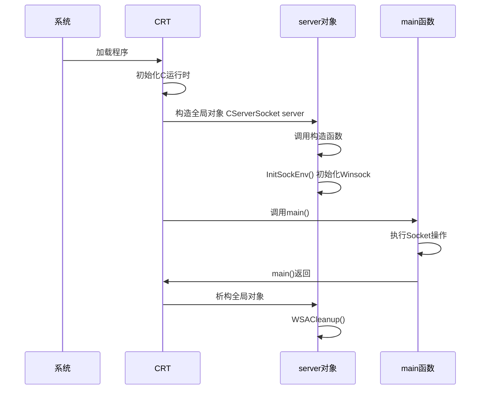

---
tags:
  - 项目/远控系统
git: "10d79cd"
git_msg: "初步的网络编程框架搭建完成"
git_note: "2.1 的全局对象模式从未单独提交，与 2.2 同属此 commit"
---

# 2.1 网络基础 - Windows Socket编程

## 概念定义

> Windows Socket (Winsock) 是 Windows 平台上的网络编程接口，提供了 BSD Socket 的兼容实现。

### TCP服务端编程流程

![[Pasted image 20251223060308.png]]

---

## 程序执行顺序

### CRT（C Runtime Library）

**CRT** 是 C 运行时库，是 C/C++ 程序运行的基础支撑。在 Windows 中，CRT 负责：

```
  程序加载
      ↓
  CRT 初始化（初始化 C 运行时环境）
      ↓
  CRT 构造全局对象（如 CServerSocket server）
      ↓
  CRT 调用 main() 函数
      ↓
  main() 返回后，CRT 析构全局对象
```

| 职责        | 说明                            |
| --------- | ----------------------------- |
| 运行时初始化    | 设置堆、栈、异常处理等基础设施               |
| 全局对象构造    | 在 `main()` 之前调用所有全局/静态对象的构造函数 |
| 调用 main() | 准备好参数后调用用户的 `main()` 函数       |
| 全局对象析构    | `main()` 返回后，按逆序析构全局/静态对象     |
|           |                               |

```c++
#pragma comment(linker, "/subsystem:windows /entry:WinMainCRTStartup")
#pragma comment(linker, "/subsystem:windows /entry:mainCRTStartup")
#pragma comment(linker, "/subsystem:console /entry:mainCRTStartup")
#pragma comment(linker, "/subsystem:console /entry:WinMainCRTStartup")
```

它们是 **C 运行时库（CRT）提供的启动入口**，不是真正给你写代码用的函数，而是：
- 由操作系统首先调用；
- 负责初始化运行时（全局变量、堆、C++ 静态对象等）；
- 然后再去调用你写的 `main` 或 `WinMain` 函数；
- 程序结束后再做清理。

它们的对应关系大致是：
- `/subsystem:console /entry:mainCRTStartup`：控制台程序，最终调用你的 `int main(...)`。
- `/subsystem:windows /entry:WinMainCRTStartup`：窗口程序，最终调用你的 `int WINAPI WinMain(...)`,在运行时会有一个黑框。
- --- 
### 关键机制：全局对象在main()之前构造



**执行顺序总结**：
1. 程序加载，CRT初始化
2. **全局对象 `server` 构造** → `InitSockEnv()` → `WSAStartup()`
3. **进入 `main()` 函数**
4. MFC初始化 (`AfxWinInit`)
5. Socket操作：`socket` → `bind` → `listen` → `closesocket`
6. `main()` 返回
7. **全局对象 `server` 析构** → `WSACleanup()`

---

## 代码详解

### ServerSocket.h - 封装Winsock初始化

```cpp
#pragma once
#include "pch.h"
#include "framework.h"

class CServerSocket
{
public:
    // 构造函数：程序启动时自动调用（全局对象）
    CServerSocket()
    {
        // 初始化Winsock环境，失败则弹窗并退出
        if (InitSockEnv() == FALSE)
        {
            MessageBox(NULL,
                _T("无法初始化套接字环境,请检查网络设置！"),
                _T("初始化错误！"),
                MB_OK | MB_ICONERROR);
            exit(0);  // 初始化失败，直接终止程序
        }
    }

    // 析构函数：程序退出时自动调用
    ~CServerSocket()
    {
        WSACleanup();  // 释放Winsock资源
    }

    // 初始化Winsock环境
    BOOL InitSockEnv()
    {
        WSADATA data;  // 存储Winsock实现的详细信息

        // WSAStartup: 初始化Winsock DLL
        // MAKEWORD(1, 1): 请求Winsock 1.1版本
        // 返回0表示成功，非0表示失败
        if (WSAStartup(MAKEWORD(1, 1), &data) != 0)
        {
            return FALSE;
        }
        return TRUE;
    }
};

// extern声明：允许其他编译单元访问此变量
// 实际定义在 ServerSocket.cpp 中
extern CServerSocket server;
```

#### WSAStartup 说明

`WSAStartup` 的本质是向操作系统注册"本进程要使用 Winsock"，它会将 `ws2_32.dll` 加载进进程并完成初始化。

```cpp
int WSAStartup(
    WORD      wVersionRequested,  // 请求的 Winsock 版本，用 MAKEWORD(主, 次) 构造
    LPWSADATA lpWSAData           // 输出：DLL 实际提供的版本信息（通常不关心内容）
);
```

**引用计数**：每次 `WSAStartup` 必须对应一次 `WSACleanup`，Winsock 内部用引用计数管理，计数归零时 DLL 才真正卸载。这正是 `CServerSocket` 构造/析构配对调用的原因。

> [!warning] 版本建议
> 当前代码使用 `MAKEWORD(1, 1)`（Winsock 1.1，1993年），建议改为 `MAKEWORD(2, 2)`。
> Winsock 2.2 才支持重叠 I/O、完成端口（IOCP）、`getaddrinfo`（IPv6）等现代特性，远控系统后续扩展时必须升级。

**与 Linux 的区别**：Linux 的 socket 是内核系统调用，无需初始化步骤；Windows 将 Winsock 实现在用户态 DLL 中，因此需要这个显式的"握手"。

### ServerSocket.cpp - 全局对象定义

```cpp
#include "pch.h"
#include "ServerSocket.h"

// 全局对象定义：程序启动时构造，退出时析构
// 利用RAII确保Winsock环境的正确初始化和清理
CServerSocket server;
```

### RemoteCtrl.cpp - 主程序

``` cpp
#include "pch.h"
#include "framework.h"
#include "RemoteCtrl.h"
#include "ServerSocket.h"  // 包含此头文件，使用extern声明的server

#ifdef _DEBUG
#define new DEBUG_NEW
#endif

CWinApp theApp;  // MFC应用程序对象

using namespace std;

int main()
{
    int nRetCode = 0;

    // 获取当前模块句柄
    HMODULE hModule = ::GetModuleHandle(nullptr);

    if (hModule != nullptr)
    {
        // 初始化MFC框架
        if (!AfxWinInit(hModule, nullptr, ::GetCommandLine(), 0))
        {
            wprintf(L"错误: MFC 初始化失败\n");
            nRetCode = 1;
        }
        else
        {
            // ========== TCP服务端核心流程 ==========

            // 1. 创建套接字
            // PF_INET: IPv4协议族
            // SOCK_STREAM: TCP流式套接字
            // 0: 自动选择协议（TCP）
            SOCKET serv_sock = socket(PF_INET, SOCK_STREAM, 0);
            // TODO: 校验 serv_sock != INVALID_SOCKET

            // 2. 配置服务器地址结构
            sockaddr_in serv_adr, client_adr;
            memset(&serv_adr, 0, sizeof(serv_adr));  // 清零
            serv_adr.sin_family = AF_INET;           // IPv4
            serv_adr.sin_addr.s_addr = INADDR_ANY;   // 监听所有网卡
            serv_adr.sin_port = htons(9527);         // 端口号（网络字节序）

            // 3. 绑定地址
            // 将套接字与IP地址和端口关联
            bind(serv_sock,
                 reinterpret_cast<sockaddr*>(&serv_adr),
                 sizeof(serv_adr));
            // TODO: 校验返回值

            // 4. 开始监听
            // 1: backlog队列长度（等待连接的最大数量）
            listen(serv_sock, 1);

            // 5. 接受客户端连接（已注释）
            // char buffer[1024];
            // int cli_sz = sizeof(client_adr);
            // SOCKET client = accept(serv_sock,
            //     reinterpret_cast<sockaddr*>(&client_adr), &cli_sz);

            // 6. 数据收发（已注释）
            // recv(client, buffer, sizeof(buffer), 0);  // 接收数据
            // send(client, buffer, sizeof(buffer), 0);  // 发送数据

            // 7. 关闭套接字
            closesocket(serv_sock);
        }
    }
    else
    {
        wprintf(L"错误: GetModuleHandle 失败\n");
        nRetCode = 1;
    }

    return nRetCode;
}
```

**在非标准的 MFC 应用程序（如控制台程序或 DLL）中手动初始化 MFC 运行环境**。

#### 1. 它的核心功能

当你编写一个标准的 MFC 窗口程序（基于 `CWinApp`）时，MFC 会自动为你处理所有初始化工作。但如果你在**控制台程序（Console Application）**中想要使用 MFC 的类（比如 `CString`, `CFile`, `CStdioFile` 等），你就必须手动调用 `AfxWinInit`。

它主要负责以下工作：

- **初始化全局状态**：设置 MFC 内部使用的全局变量。
    
- **初始化线程状态**：为当前线程建立 MFC 必要的底层支持。
    
- **同步模块信息**：让程序知道当前的实例句柄（HINSTANCE）等系统信息。

#### 2. 函数原型

C++

```
BOOL AFXAPI AfxWinInit(
    HINSTANCE hInst,          // 当前应用程序实例句柄
    HINSTANCE hPrevInst,      // 前一个实例句柄（在 Win32 中始终为 NULL）
    LPTSTR lpCmdLine,         // 命令行参数字符串
    int nShowCmd              // 窗口显示标志（如 SW_SHOW）
);
```

---

## 关键函数说明

| 函数 | 作用 | 返回值 |
|------|------|--------|
| `WSAStartup()` | 初始化Winsock DLL | 0=成功 |
| `socket()` | 创建套接字 | SOCKET句柄，失败返回INVALID_SOCKET |
| `bind()` | 绑定地址和端口 | 0=成功，SOCKET_ERROR=失败 |
| `listen()` | 开始监听连接 | 0=成功 |
| `accept()` | 接受客户端连接 | 新的SOCKET句柄 |
| `recv()/send()` | 接收/发送数据 | 字节数，0=连接关闭，<0=错误 |
| `closesocket()` | 关闭套接字 | 0=成功 |
| `WSACleanup()` | 释放Winsock资源 | 0=成功 |

---

## 注意事项

> [!warning] Winsock版本
> 代码使用 `MAKEWORD(1, 1)` 请求 Winsock 1.1，建议升级为 `MAKEWORD(2, 2)` 使用 Winsock 2.2，支持更多高级特性。

> [!warning] 错误处理
> 代码中多处 `TODO` 标记表示需要添加返回值校验，生产环境必须检查每个Socket API的返回值。

> [!tip] RAII设计
> `CServerSocket` 类利用构造/析构函数自动管理 `WSAStartup/WSACleanup`，这是RAII思想的体现，避免资源泄漏。

---

## 设计分析：单线程初始化 + RAII析构

### 为什么在单线程环境（main之前）初始化？

#### 1. 避免竞态条件（Race Condition）

![[Pasted image 20251223061343.png]]

如果在多线程环境中初始化 Winsock：
- 多个线程可能同时检测到"未初始化"状态
- 导致 `WSAStartup` 被多次调用
- 需要额外的同步机制（互斥锁）来保护

```cpp
// ❌ 多线程环境需要额外加锁
std::mutex g_wsa_mutex;
bool g_initialized = false;

void InitIfNeeded() {
    std::lock_guard<std::mutex> lock(g_wsa_mutex);  // 额外开销
    if (!g_initialized) {
        WSAStartup(...);
        g_initialized = true;
    }
}
```

#### 2. 单线程初始化的优势

```cpp
// ✅ 全局对象在 main() 之前构造，此时只有一个线程
CServerSocket server;  // 单线程，无竞争
```

| 特性 | 单线程初始化 | 多线程初始化 |
|------|-------------|-------------|
| 竞态条件 | 不存在 | 需要处理 |
| 同步开销 | 无 | 需要互斥锁 |
| 代码复杂度 | 简单 | 复杂 |
| 初始化时机 | 确定（main前） | 不确定 |

#### 3. 保证初始化顺序

全局对象构造发生在程序最早期阶段：

```
  程序加载
      ↓
  CRT 初始化（初始化 C 运行时环境）
      ↓
  CRT 构造全局对象（如 CServerSocket server）
      ↓
  CRT 调用 main() 函数
      ↓
  main() 返回后，CRT 析构全局对象
```

```
程序加载
    ↓
CRT初始化（单线程）
    ↓
全局对象构造（单线程）← WSAStartup 在这里
    ↓
main() 开始（可能创建多线程）
    ↓
所有Socket操作都在已初始化的环境中进行
```

> [!note] 关键点
> 在 `main()` 执行前，程序处于**单线程状态**，不存在并发问题。Winsock 环境在任何业务代码运行前就已就绪。

---

### 为什么在析构函数中调用 WSACleanup？

#### 1. RAII 原则：资源获取即初始化

```cpp
class CServerSocket {
public:
    CServerSocket()  { WSAStartup(...); }   // 构造时获取资源
    ~CServerSocket() { WSACleanup(); }      // 析构时释放资源
};
```

**RAII 的核心思想**：
- 资源的生命周期与对象的生命周期绑定
- 构造函数获取资源，析构函数释放资源
- 无论程序如何退出，析构函数都会被调用

#### 2. 自动清理，不会遗漏

对比手动管理 vs RAII：

```cpp
// ❌ 手动管理：容易遗漏
int main() {
    WSAStartup(...);

    if (error1) return -1;  // 忘记 WSACleanup！
    if (error2) return -2;  // 忘记 WSACleanup！

    // 正常流程
    WSACleanup();
    return 0;
}

// ✅ RAII：自动清理
CServerSocket server;  // 全局对象

int main() {
    if (error1) return -1;  // 程序退出时自动调用析构
    if (error2) return -2;  // 程序退出时自动调用析构
    return 0;               // 程序退出时自动调用析构
}
```

#### 3. 处理各种退出场景

| 退出方式 | 手动管理 | RAII（析构函数） |
|---------|---------|-----------------|
| 正常 return | 需要手动调用 | 自动清理 ✅ |
| 异常退出 | 可能遗漏 | 自动清理 ✅ |
| 多个 return 点 | 每处都要写 | 只写一次 ✅ |
| exit() 调用 | 可能遗漏 | 自动清理 ✅ |

#### 4. 配对保证

![[Pasted image 20251223061611.png]]

> [!tip] 设计原则
> **谁申请，谁释放**。`CServerSocket` 在构造时调用 `WSAStartup`，就应该在析构时调用 `WSACleanup`，形成对称的资源管理。

---

### 总结：这种设计的好处

```cpp
// ServerSocket.cpp 中只需一行
CServerSocket server;
```

这一行代码实现了：

| 好处 | 说明 |
|------|------|
| **线程安全** | main() 前单线程环境，无竞态 |
| **自动初始化** | 无需手动调用，包含头文件即可 |
| **自动清理** | 程序退出时自动 WSACleanup |
| **异常安全** | 任何退出路径都会清理 |
| **代码简洁** | 业务代码无需关心 Winsock 生命周期 |
| **不会忘记** | 编译器保证析构函数被调用 |

> [!warning] 注意：全局对象的析构顺序
> 如果有多个全局对象依赖 Winsock，需要确保 `CServerSocket server` 最先构造（最后析构）。可以通过将其放在单独的 .cpp 文件并控制链接顺序来实现。

---

## 关联知识

- [[2.1 网络编程]] - Windows网络编程基础
- [[7.5 TCP协议基础]] - TCP协议原理

## 参考

- Windows Socket 2 文档
- 《Windows网络编程》
