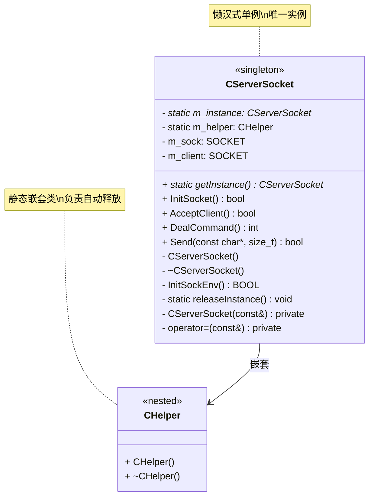
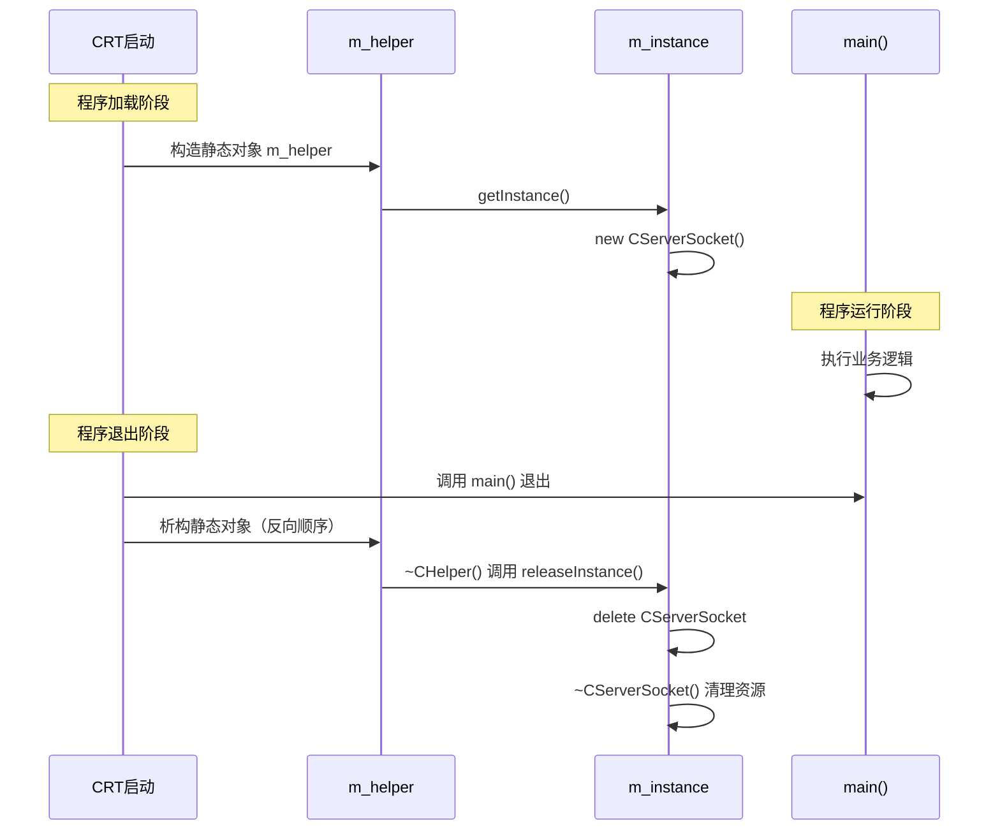
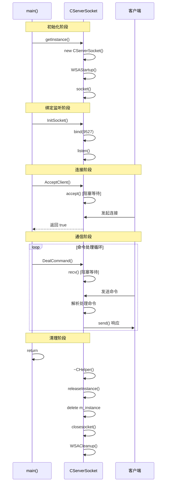

---
tags:
  - 项目/远控系统
git: "10d79cd"
git_msg: "初步的网络编程框架搭建完成，引入单例模式 ServerSocket"
---

# 2.2 网络编程架构设计 - 单例模式重构

> 本节将 [[2.1 网络编程基本设计]] 中的全局对象模式重构为**单例模式**，解决全局对象可能被拷贝的问题，并封装完整的服务器功能。

---

## 架构演进：从全局对象到单例模式

### 2.1 版本的问题

在 [[2.1 网络编程基本设计]] 中，我们使用全局对象管理 Winsock：

```cpp
// 2.1 版本：全局对象
CServerSocket server;  // 全局唯一，RAII管理
```

**存在的问题**：

| 问题        | 说明                                 |
| --------- | ---------------------------------- |
| **可被拷贝**  | `CServerSocket s2 = server;` 会创建副本 |
| **可被赋值**  | `s2 = server;` 同样会创建副本             |
| **多实例风险** | 每个副本都持有 socket 句柄，析构时重复关闭          |
| **职责分散**  | socket 操作分散在 main 函数中              |

```cpp
// ❌ 2.1 版本的隐患
CServerSocket server;
CServerSocket copy = server;  // 拷贝构造！
// 两个对象析构时都会调用 WSACleanup()
```

### 2.2 版本的改进

使用**单例模式**确保全局唯一，并封装完整的服务器功能：

```cpp
// ✅ 2.2 版本：单例模式
CServerSocket* pserver = CServerSocket::getInstance();
pserver->InitSocket();
pserver->AcceptClient();
pserver->DealCommand();
```

**改进点**：

| 改进       | 实现方式                                |
| -------- | ----------------------------------- |
| **唯一实例** | 静态指针 `m_instance` + `getInstance()` |
| **禁止拷贝** | 私有化拷贝构造和赋值运算符                       |
| **自动清理** | 嵌套类 `CHelper` 在析构时释放单例              |
| **职责内聚** | 所有 socket 操作封装在类内                   |

---

## 单例模式实现详解

### 整体结构

```
┌─────────────────────────────────────────────────────┐
│                   CServerSocket                     │
├─────────────────────────────────────────────────────┤
│ - m_instance: CServerSocket*  (静态，唯一实例指针)     │
│ - m_helper: CHelper           (静态，负责释放实例)     │
│ - m_sock: SOCKET              (服务端监听socket)      │
│ - m_client: SOCKET            (客户端连接socket)      │
├─────────────────────────────────────────────────────┤
│ + getInstance(): CServerSocket*                     │
│ + InitSocket(): bool                                │
│ + AcceptClient(): bool                              │
│ + DealCommand(): int                                │
│ + Send(): bool                                      │
├─────────────────────────────────────────────────────┤
│ - CServerSocket()             (私有构造)             │
│ - ~CServerSocket()            (私有析构)             │
│ - CServerSocket(const&)       (私有拷贝，禁用)        │
│ - operator=(const&)           (私有赋值，禁用)        │
│ - InitSockEnv(): BOOL                               │
│ - releaseInstance(): void                           │
├─────────────────────────────────────────────────────┤
│  ┌─────────────────────────────────────────────┐    │
│  │              CHelper (嵌套类)                │    │
│  ├─────────────────────────────────────────────┤    │
│  │  + CHelper()   → getInstance() 触发创建      │    │
│  │  + ~CHelper()  → releaseInstance() 释放      │    │
│  └─────────────────────────────────────────────┘    │
└─────────────────────────────────────────────────────┘
```



### 为什么需要 CHelper 嵌套类？

**问题**：单例使用 `new` 创建，不会自动调用析构函数

```cpp
// 单例通过 new 创建
m_instance = new CServerSocket();

// 程序退出时：
// - 静态指针 m_instance 的 4/8 字节内存被回收
// - 但 m_instance 指向的堆对象不会被 delete
// - ~CServerSocket() 永远不会被调用！
// - WSACleanup() 不会执行！
```

**解决方案**：利用静态对象的析构

```cpp
class CHelper {
public:
    CHelper() {
        CServerSocket::getInstance();  // 可选：提前创建实例
    }
    ~CHelper() {
        CServerSocket::releaseInstance();  // 程序退出时释放
    }
};

static CHelper m_helper;  // 静态对象，程序退出时析构
```

**执行流程**：

```
程序启动
    ↓
CRT 初始化静态对象
    ↓
m_helper 构造 → getInstance() → new CServerSocket()
    ↓
main() 执行业务逻辑
    ↓
main() 返回
    ↓
CRT 析构静态对象
    ↓
~CHelper() → releaseInstance() → delete m_instance
    ↓
~CServerSocket() → closesocket() + WSACleanup()
```

> [!tip] 设计模式关联
> 这种实现方式是 [[16.1 单例模式]] 中"懒汉式 + 静态嵌套类释放"的变体。

### 补充：静态变量在内存中的存储位置

在单例模式的实现中，我们使用了两个关键的**静态成员**：

```cpp
static CServerSocket* m_instance;  // 单例指针
static CHelper m_helper;           // 静态辅助对象
```

这两个静态变量存储在进程的**虚拟地址空间**的哪个区域？根据 [[1.3 进程的虚拟地址空间|进程的虚拟地址空间]] 中的内存布局：

```
高地址 0xFFFFFFFF
┌─────────────────────────────────────┐
│           内核空间                    │ 0xC0000000 - 0xFFFFFFFF
├─────────────────────────────────────┤
│        命令行参数和环境变量            │
├─────────────────────────────────────┤
│           .stack (栈)               │  ↓ 向下生长
├─────────────────────────────────────┤
│        *.dll / *.so                 │  共享库映射区
├─────────────────────────────────────┤
│            .heap   堆               │  ↑ 向上生长
├─────────────────────────────────────┤
│           .bss                      │  未初始化/初始化为0的静态变量
├─────────────────────────────────────┤
│           .data                     │  已初始化且非零的静态变量
├─────────────────────────────────────┤
│           .rodata                   │  只读数据段
├─────────────────────────────────────┤
│           .text                     │  代码段（汇编指令）
├─────────────────────────────────────┤ 0x08048000
│          不可访问区域                 │  访问会导致段错误
└─────────────────────────────────────┘ 0x00000000
低地址
```

**静态变量的存储规则**：

| 变量类型 | 存储位置 | 示例 |
|---------|---------|------|
| 已初始化且非零的静态变量 | `.data` | `static int a = 10;` |
| 未初始化或为零的静态变量 | `.bss` | `static int b = 0;` 或 `static int b;` |
| 静态对象（类类型） | `.data` / `.bss` | `static CHelper m_helper;` |

**在本例中的应用**：

| 静态成员 | 初始化值 | 存储位置 | 原因 |
|---------|---------|---------|------|
| `m_instance` | `NULL` (0) | `.bss` | 未初始化，值为0 |
| `m_helper` | 默认构造 | `.data` | 有默认构造函数调用 |

**为什么重要？**

1. **生命周期**：静态变量在 `main()` 之前创建，`main()` 之后销毁，确保单例的可用性
2. **内存区域**：`m_helper` 作为静态对象存储在 `.data`/`.bss` 段，其析构函数会在程序退出时自动被调用
3. **地址固定**：静态变量的地址在程序运行期间不会改变，这使得 `CHelper` 能够可靠地访问和释放单例

> [!note] 扩展阅读
> 关于全局变量和静态变量的详细存储规则，请参见 [[1.3 进程的虚拟地址空间#4 变量存储位置详解|变量存储位置详解]]。

### 补充：为什么其他释放方式行不通？

#### 方式1：手动 delete（不可靠）

```cpp
int main() {
    CServerSocket* pserver = CServerSocket::getInstance();
    // ... 使用 ...
    delete pserver;  // 依赖程序员记得手动调用
}
```

**问题**：程序员可能忘记调用，或在复杂项目中难以追踪所有退出路径。

#### 方式2：atexit 注册

`atexit()` 是 C 标准库函数，用于注册在程序正常退出时自动调用的清理函数。

##### 2.1 atexit 机制原理

```cpp
#include <cstdlib>

int atexit(void (*func)(void));
```

**函数说明**：
- 参数 `func`：指向清理函数的指针，函数原型为 `void func(void)`
- 返回值：成功返回 0，失败返回非零
- 注册的清理函数在程序退出时（`main()` 返回或调用 `exit()`）被自动调用

**执行顺序**：后注册先执行（LIFO，栈式）

```
程序退出时执行顺序：
┌─────────────────────────────────────┐
│  atexit 注册顺序                    │
│  1. atexit(func1)  ← 先注册         │
│  2. atexit(func2)                   │
│  3. atexit(func3)  ← 后注册         │
└─────────────────────────────────────┘
              ↓
┌─────────────────────────────────────┐
│  程序退出时调用顺序                  │
│  1. func3()  ← 后注册先执行         │
│  2. func2()                        │
│  3. func1()  ← 先注册后执行         │
└─────────────────────────────────────┘
```

##### 2.2 atexit 基本使用示例

```cpp
#include <cstdio>
#include <cstdlib>

void cleanup1() {
    printf("Cleanup 1 executed\n");  // 第3个执行
}

void cleanup2() {
    printf("Cleanup 2 executed\n");  // 第2个执行
}

void cleanup3() {
    printf("Cleanup 3 executed\n");  // 第1个执行
}

int main() {
    // 注册清理函数
    atexit(cleanup1);  // 先注册
    atexit(cleanup2);  // 后注册
    atexit(cleanup3);  // 最后注册

    printf("main() starting...\n");
    // 输出：
    // main() starting...
    // 程序退出时：
    // Cleanup 3 executed
    // Cleanup 2 executed
    // Cleanup 1 executed

    return 0;
}
```

##### 2.3 atexit 在单例模式中的应用

**核心思路**：在首次创建单例时注册清理函数

```cpp
class CServerSocket
{
public:
    static CServerSocket* getInstance() {
        if (m_instance == NULL) {
            // ========== 关键：首次创建时注册 atexit ==========
            static bool registered = []() {
                // 注册退出时调用的清理函数
                int result = atexit(releaseInstance);
                if (result != 0) {
                    fprintf(stderr, "atexit registration failed!\n");
                }
                return result == 0;  // 返回注册是否成功
            }();

            if (!registered) {
                return NULL;  // 注册失败，拒绝创建
            }

            m_instance = new CServerSocket();
        }
        return m_instance;
    }

private:
    static void releaseInstance() {
        printf("Releasing singleton instance...\n");
        delete m_instance;
        m_instance = NULL;
    }

    static CServerSocket* m_instance;
};

// 静态成员初始化
CServerSocket* CServerSocket::m_instance = NULL;
```

**执行流程**：

```
程序启动
    ↓
CRT 初始化静态变量
    ↓
m_instance = NULL  ← 静态指针变量创建（在 .bss 段）
    ↓
main() 开始执行
    ↓
首次调用 getInstance()
    ↓
static bool registered 初始化
    ↓
Lambda 执行 → atexit(releaseInstance)
    ↓
new CServerSocket() 创建堆对象  ← m_instance 指向该对象
    ↓
main() 业务逻辑
    ↓
main() 返回
    ↓
C Runtime 调用已注册的 exit handlers
    ↓
releaseInstance() 被调用
    ↓
delete m_instance
    ↓
~CServerSocket() 清理资源
```


**m_instance 创建的两个阶段**：

| 阶段 | 时间 | 内容 | 位置 |
|-----|------|------|------|
| **阶段1** | 程序启动时（main() 之前） | 指针变量本身初始化为 `NULL` | `.bss` 段 |
| **阶段2** | 首次调用 `getInstance()` 时 | 堆对象创建，指针指向该对象 | 堆（heap） |

```cpp
// 阶段1：静态成员初始化（程序启动时）
CServerSocket* CServerSocket::m_instance = NULL;

// 阶段2：new 创建对象（首次调用 getInstance() 时）
m_instance = new CServerSocket();  // ← 堆对象
```

##### 2.4 atexit 的优势与局限

**优势**：

| 特性 | 说明 |
|-----|------|
| **自动调用** | 无需手动管理，程序退出时自动执行 |
| **跨平台** | C 标准库函数，Windows/Linux/macOS 都支持 |
| **灵活性** | 可注册多个清理函数，按需组织 |

**局限**：

| 问题 | 说明 |
|-----|------|
| **可读性差** | 静态局部变量 + lambda + atexit 组合，理解成本高 |
| **错误处理困难** | `atexit()` 返回值容易被忽略 |
| **不能传参** | 清理函数不能带参数，依赖全局/静态变量 |
| **类型不安全** | 使用函数指针，而非函数对象（C++11 后可用 `std::atexit` 的包装） |
| **异常安全** | 如果 `atexit()` 注册本身抛出异常，程序会 terminate |

##### 2.5 atexit vs CHelper 对比

| 特性 | atexit 方式 | CHelper 方式 |
|-----|------------|-------------|
| **代码量** | 少（约5行） | 多（嵌套类定义） |
| **可读性** | 低（需要理解 lambda + atexit） | 高（显式的析构逻辑） |
| **可维护性** | 低（隐藏的注册逻辑） | 高（清晰的释放流程） |
| **异常安全** | 差（注册失败难处理） | 好（构造/析构保证） |
| **C 兼容** | 是 | 否（需要类） |
| **调试友好** | 差（断点难设） | 好（可设断点） |

##### 2.6 atexit 注意事项

**1. 注册时机**

```cpp
// ✅ 正确：在 getInstance() 内部注册
static CServerSocket* getInstance() {
    static bool registered = []() {
        return atexit(releaseInstance) == 0;
    }();
    // ...
}

// ❌ 错误：在类外全局注册（可能太早或太晚）
class CServerSocket {
    // ...
};

static bool g_registered = atexit(CServerSocket::releaseInstance);  // 构造函数前执行
```

**2. 多次注册问题**

```cpp
class CServerSocket {
public:
    static CServerSocket* getInstance() {
        if (m_instance == NULL) {
            static bool registered = []() {
                atexit(releaseInstance);  // 只注册一次
                return true;
            }();
            m_instance = new CServerSocket();
        }
        return m_instance;
    }
};
```

**3. 不能通过 `exit()` 传递状态**

```cpp
// atexit 函数不能带参数，状态通过全局变量传递
static int g_exitStatus = 0;

void cleanupWithStatus() {
    printf("Exit with status: %d\n", g_exitStatus);
}

int main() {
    atexit(cleanupWithStatus);

    if (error_condition) {
        g_exitStatus = 1;
        exit(1);  // 触发 atexit
    }

    return 0;
}
```

##### 2.7 扩展：C++11 的 atexit 替代方案

C++11 提供了更类型安全的 `std::atexit`（需要 `<cstdlib>`）：

```cpp
#include <cstdlib>
#include <type_traits>

class CServerSocket {
public:
	static CServerSocket& getInstance() {
    static char dummy = []() {           // 第一层静态变量
        std::atexit(+[](void) {
            delete &getInstance();       // 注册清理函数
        });
        return 0;
    }();                                  // 立即执行 lambda

    static CServerSocket instance;        // 第二层静态变量（实际单例）
    return instance;
}

private:
    CServerSocket() { /* ... */ }
    ~CServerSocket() { /* ... */ }
};
```


**核心机制：两层静态变量**

| 静态变量 | 作用 | 执行时机 |
|---------|------|---------|
| `dummy` | 触发 `atexit` 注册清理函数 | 首次调用 `getInstance()` 时 |
| `instance` | 实际单例对象 | 首次调用 `getInstance()` 时 |

**关键语法解析**

| 语法 | 说明 |
|-----|------|
| `+[](void) { }` | `+` 将 lambda 隐式转换为函数指针，满足 `atexit` 的 `void(*)(void)` 签名要求 |
| `delete &getInstance()` | 获取静态变量 instance 的地址并删除，触发析构 |
| `static char dummy` | dummy 值不重要，只是"副作用"（atexit注册）的载体 |

**执行流程**

```
程序启动
    ↓
首次调用 getInstance()
    ↓
┌─────────────────────────────────────────┐
│ 初始化 dummy                             │
│   lambda 执行 → std::atexit() 注册       │
│   dummy = 0  ← 初始化完成                │
└─────────────────────────────────────────┘
    ↓
┌─────────────────────────────────────────┐
│ 初始化 instance                         │
│   static CServerSocket instance;        │
│   ↓                                      │
│   调用 CServerSocket() 构造函数          │
└─────────────────────────────────────────┘
    ↓
return instance;
    ↓
程序退出时
    ↓
cleanup_lambda 被调用
    ↓
delete &getInstance()
    ↓
~CServerSocket() 析构函数执行
```

###### 2.7.2 与 CHelper 方案对比

| 特性 | CHelper 嵌套类 | atexit + lambda |
|-----|---------------|-----------------|
| **代码行数** | ~15行 | ~8行 |
| **可读性** | 高（显式类定义） | 低（魔术技巧） |
| **线程安全** | 依赖静态对象构造 | C++11 保证 |
| **理解成本** | 低 | 高（需理解 lambda 转换） |
| **调试** | 友好 | 困难（断点难设） |
| **可维护性** | 高 | 低 |

###### 2.7.3 潜在问题

```cpp
// ⚠️ 如果 getInstance() 抛异常，程序 terminate
// ⚠️ 如果 atexit() 注册失败，没有好的处理方式
// ⚠️ 可读性差，团队成员可能难以理解
// ⚠️ 过度使用技巧，违背"清晰优先"原则
```

> **结论**：`atexit` 机制虽然可以实现单例的自动释放，但代码可读性和维护性较差。在实际项目中，推荐使用 **CHelper 嵌套类** 或 **Meyers' Singleton**（C++11 局部静态变量）方案。

**问题**：可读性差，需要理解 `atexit` 机制。

#### 方式3：智能指针（不灵活）

```cpp
// C++11 版本
static std::unique_ptr<CServerSocket> m_instance = []() {
    std::unique_ptr<CServerSocket> p(new CServerSocket());
    return p;
}();
```

**问题**：需要头文件包含 `<memory>`，且与原有设计风格不一致。

### 案例：没有 CHelper 会发生什么？

**场景**：程序运行一段时间后正常退出

```cpp
// 假设没有 CHelper
int main() {
    auto pserver = CServerSocket::getInstance();
    pserver->InitSocket();
    pserver->AcceptClient();
    pserver->DealCommand();
    // 程序退出，main() 返回
    // m_instance 指针本身被回收（4/8字节）
    // 但 new CServerSocket() 的内存泄漏！
    // ~CServerSocket() 永远不会调用
    // WSACleanup() 永远不会调用
    return 0;
}
```

**后果**：

| 资源 | 未释放后果 |
|------|-----------|
| socket 句柄 | 操作系统回收（进程退出） |
| Winsock 状态 | 可能影响后续网络通信 |
| 堆内存 | 内存泄漏（虽然进程退出时OS会回收） |
| 其他资源（如文件、数据库连接） | 可能造成数据丢失或资源泄漏 |

```
程序启动阶段（CRT初始化）
CRT startup code (mainCRTStartup / wmainCRTStartup)
        ↓
__initterm() 遍历全局初始化函数表
        ↓
CServerSocket::m_instance = NULL  (静态指针初始化为0)
        ↓
CServerSocket::m_helper 构造  ← 关键入口
m_helper 构造 → getInstance()
CHelper::CHelper()
        ↓
CServerSocket::getInstance()  (第1次调用)
        ↓
if (m_instance == NULL)  → true
        ↓
m_instance = new CServerSocket()  ← 触发构造函数
new CServerSocket() 详细过程
operator new(sizeof(CServerSocket))
        ↓
调用 CServerSocket::CServerSocket()
        ↓
m_client = INVALID_SOCKET
        ↓
InitSockEnv() ← WSA初始化
        ↓
WSAStartup(MAKEWORD(1, 1), &data)  ← Windows Socket API
        ↓
socket(PF_INET, SOCK_STREAM, 0)  ← 创建TCP Socket
        ↓
m_sock = 返回值 (有效socket句柄)
InitSockEnv() 内部
BOOL InitSockEnv()
        ↓
WSADATA data;
        ↓
WSAStartup(MAKEWORD(1, 1), &data)
        ├─ 检查返回值: 0=成功, 其他=失败
        ├─ 加载 ws2_32.dll
        └─ 初始化Winsock环境
        ↓
返回 TRUE/FALSE
main() 业务逻辑
main()
        ↓
CServerSocket* pserver = CServerSocket::getInstance()  (第N次调用)
        ↓
if (m_instance == NULL) → false (已创建)
        ↓
return m_instance;  (返回已有指针)
        ↓
pserver->InitSocket()
        ├─ bind(m_sock, &serv_adr, ...)  ← 绑定本地地址
        │   ├─ serv_adr.sin_family = AF_INET
        │   ├─ serv_adr.sin_addr.s_addr = INADDR_ANY
        │   └─ serv_adr.sin_port = htons(9527)
        ↓
listen(m_sock, 1)  ← 开始监听
        ↓
pserver->AcceptClient()
        └─ accept(m_sock, &client_adr, &cli_sz)
           ├─ 阻塞等待客户端连接
           ├─ TCP三次握手完成
           └─ 返回客户端socket (m_client)
程序退出阶段
main() 返回
        ↓
exit() / return from main()
        ↓
__initterm() 逆向遍历静态对象析构表
        ↓
~CHelper()  ← 静态对象析构 (后进先出)
        ↓
CServerSocket::releaseInstance()
        ↓
CServerSocket* tmp = m_instance;
        ↓
m_instance = NULL;  ← 防止重入
        ↓
delete tmp;
        ↓
operator delete()
        ↓
~CServerSocket()  ← 析构函数
        ↓
closesocket(m_sock);  ← 关闭监听socket
        ↓
closesocket(m_client);  ← 关闭客户端socket
        ↓
WSACleanup();  ← 清理Winsock资源

```

### 静态对象析构顺序详解



**关键点**：

1. **静态对象在 main() 之前构造**：确保单例在程序开始前可用
2. **静态对象在 main() 之后析构**：确保在业务逻辑完成后才清理
3. **全局静态对象析构顺序**：后构造的先析构（`m_helper` 在 `m_instance` 之后构造，所以先析构）

> [!warning] 注意事项
> 如果单例 A 依赖单例 B，确保 A 在 B 之后构造，这样 B 会在 A 之前析构。

---

## 代码详解

### ServerSocket.h - 单例类定义

```cpp
#pragma once
#include "pch.h"
#include "framework.h"

class CServerSocket
{
public:
    // ==================== 公有接口 ====================

    // 获取单例实例（懒汉式）
    static CServerSocket* getInstance() {
        if (m_instance == NULL)
        {
            // 首次调用时创建实例
            // 注意：此实现非线程安全，但在单线程初始化场景下可接受
            m_instance = new CServerSocket();
        }
        return m_instance;
    }

    // 初始化服务端 Socket（绑定 + 监听）
    bool InitSocket()
    {
        // 检查 socket 是否创建成功
        if (m_sock == -1)
            return false;

        // 配置服务器地址
        sockaddr_in serv_adr;
        memset(&serv_adr, 0, sizeof(serv_adr));
        serv_adr.sin_family = AF_INET;           // IPv4
        serv_adr.sin_addr.s_addr = INADDR_ANY;   // 监听所有网卡
        serv_adr.sin_port = htons(9527);         // 端口号

        // 绑定地址
        if (bind(m_sock, reinterpret_cast<sockaddr*>(&serv_adr),
                 sizeof(serv_adr)) == -1)
            return false;

        // 开始监听，backlog = 1
        if (listen(m_sock, 1) == -1)
            return false;

        return true;
    }

    // 接受客户端连接
    bool AcceptClient()
    {
        sockaddr_in client_adr;
        int cli_sz = sizeof(client_adr);

        // accept 会阻塞，直到有客户端连接
        m_client = accept(m_sock, (sockaddr*)&client_adr, &cli_sz);

        if (m_client == -1)
            return false;
        return true;
    }

    // 处理客户端命令（主循环）
    int DealCommand()
    {
        // ⚠️ BUG: 这里是赋值 = 而非比较 ==
        // 原代码: if (m_client = -1)  ← 错误！
        // 应该是: if (m_client == -1) ← 正确
        if (m_client == -1)  // 修正后
            return -1;

        char buffer[1024] = "";
        while (true)
        {
            // 接收数据
            int len = recv(m_client, buffer, sizeof(buffer), 0);

            if (len <= 0)
                return -1;  // 连接断开或出错

            // TODO: 解析并处理命令
            // 根据 buffer 内容执行相应操作
        }
    }

    // 发送数据到客户端
    bool Send(const char* pData, size_t nSize)
    {
        if (m_client == -1)
            return false;

        return send(m_client, pData, nSize, 0) > 0;
    }

private:
    // ==================== 成员变量 ====================
    SOCKET m_client;  // 客户端连接 socket
    SOCKET m_sock;    // 服务端监听 socket

    // ==================== 禁止拷贝和赋值 ====================

    // 私有赋值运算符（禁止赋值）
    CServerSocket& operator=(const CServerSocket& ss) {}

    // 私有拷贝构造（禁止拷贝）
    CServerSocket(const CServerSocket& ss)
    {
        m_sock = ss.m_sock;
        m_client = ss.m_client;
    }

    // ==================== 私有构造/析构 ====================

    // 私有构造函数
    CServerSocket() {
        m_client = INVALID_SOCKET;

        // 初始化 Winsock 环境
        if (InitSockEnv() == FALSE)
        {
            MessageBox(NULL,
                _T("无法初始化套接字环境,请检查网络设置！"),
                _T("初始化错误！"),
                MB_OK | MB_ICONERROR);
            exit(0);
        }

        // 创建监听 socket
        m_sock = socket(PF_INET, SOCK_STREAM, 0);
    }

    // 私有析构函数
    ~CServerSocket()
    {
        closesocket(m_sock);
        WSACleanup();
    }

    // 初始化 Winsock 环境
    BOOL InitSockEnv()
    {
        WSADATA data;
        if (WSAStartup(MAKEWORD(1, 1), &data) != 0)
        {
            return FALSE;
        }
        return TRUE;
    }

    // ==================== 单例释放 ====================

    // 释放单例实例（由 CHelper 调用）
    static void releaseInstance()
    {
        if (m_instance != NULL)
        {
            CServerSocket* tmp = m_instance;
            m_instance = NULL;  // 先置空，防止重入
            delete tmp;          // 再删除，触发析构
        }
    }

    // ==================== 静态成员 ====================

    static CServerSocket* m_instance;  // 单例指针

    // 嵌套辅助类：负责单例的自动释放
    class CHelper
    {
    public:
        CHelper()
        {
            // 可在此提前触发单例创建
            CServerSocket::getInstance();
        }
        ~CHelper()
        {
            // 程序退出时释放单例
            CServerSocket::releaseInstance();
        }
    };

    static CHelper m_helper;  // 静态辅助对象
};

// 外部声明（兼容旧代码）
extern CServerSocket server;
```

### ServerSocket.cpp - 静态成员初始化

```cpp
#include "pch.h"
#include "ServerSocket.h"

// 静态成员初始化
CServerSocket* CServerSocket::m_instance = NULL;
CServerSocket::CHelper CServerSocket::m_helper;

// 全局指针（方便访问）
CServerSocket* pserver = CServerSocket::getInstance();
```

**关键点**：
- `m_instance` 初始化为 `NULL`，首次调用 `getInstance()` 时才创建
- `m_helper` 是静态对象，程序退出时自动析构，触发 `releaseInstance()`

### RemoteCtrl.cpp - 主程序

```cpp
#include "pch.h"
#include "framework.h"
#include "RemoteCtrl.h"
#include "ServerSocket.h"

CWinApp theApp;

int main()
{
    int nRetCode = 0;
    HMODULE hModule = ::GetModuleHandle(nullptr);

    if (hModule != nullptr)
    {
        if (!AfxWinInit(hModule, nullptr, ::GetCommandLine(), 0))
        {
            wprintf(L"错误: MFC 初始化失败\n");
            nRetCode = 1;
        }
        else
        {
            // 获取单例实例
            CServerSocket* pserver = CServerSocket::getInstance();
            int count = 0;

            // 服务器主循环
            while (CServerSocket::getInstance() != NULL)
            {
                // 1. 初始化 Socket（bind + listen）
                if (pserver->InitSocket() == false)
                {
                    MessageBox(NULL,
                        _T("网络初始化异常，未能成功初始化，请检查网络状态！"),
                        _T("网络初始化失败"),
                        MB_OK | MB_ICONERROR);
                    exit(0);
                }

                // 2. 等待客户端连接
                if (pserver->AcceptClient() == false)
                {
                    if (count >= 3)
                    {
                        MessageBox(NULL,
                            _T("多次无法正常接入用户，结束程序！"),
                            _T("接入用户失败"),
                            MB_OK | MB_ICONERROR);
                        exit(0);
                    }
                    MessageBox(NULL,
                        _T("无法正常接入用户，自动重试"),
                        _T("接入用户失败"),
                        MB_OK | MB_ICONERROR);
                    count++;
                    continue;  // 重试
                }

                // 3. 处理客户端命令
                int ret = pserver->DealCommand();
                // TODO: 根据 ret 处理不同情况
            }
        }
    }
    else
    {
        wprintf(L"错误: GetModuleHandle 失败\n");
        nRetCode = 1;
    }

    return nRetCode;
}
```

---

## 服务器执行流程

### 整体流程概览

### 整体流程概览

```
┌─────────────────────────────────────────────────────────────────┐
│                     1. 初始化阶段                                 │
├─────────────────────────────────────────────────────────────────┤
│  getInstance()                                                  │
│       ↓                                                         │
│  new CServerSocket()                                            │
│       ↓                                                         │
│  WSAStartup() 初始化 Winsock                                     │
│       ↓                                                         │
│  socket() 创建监听 socket                                        │
└─────────────────────────────────────────────────────────────────┘
                              ↓
┌─────────────────────────────────────────────────────────────────┐
│                     2. 绑定监听阶段                               │
├─────────────────────────────────────────────────────────────────┤
│  InitSocket()                                                   │
│       ↓                                                         │
│  bind() 绑定端口 9527                                            │
│       ↓                                                         │
│  listen() 开始监听                                               │
└─────────────────────────────────────────────────────────────────┘
                              ↓
┌─────────────────────────────────────────────────────────────────┐
│                     3. 连接阶段（阻塞）                          │
├─────────────────────────────────────────────────────────────────┤
│  AcceptClient()                                                 │
│       ↓                                                         │
│  accept() 阻塞等待                                               │
│       ↓                                                         │
│  三次握手完成                                                     │
│       ↓                                                         │
│  返回客户端 socket                                                │
└─────────────────────────────────────────────────────────────────┘
                              ↓
┌─────────────────────────────────────────────────────────────────┐
│                     4. 通信阶段（循环）                            │
├─────────────────────────────────────────────────────────────────┤
│  while (true) {                                                 │
│      recv() 阻塞等待命令                                          │
│            ↓                                                    │
│      解析命令                                                    │
│            ↓                                                    │
│      执行操作                                                    │
│            ↓                                                    │
│      send() 响应                                                │
│            ↓                                                    │
│  } ←─────────────────────────────────────────────────────────┐  │
└─────────────────────────────────────────────────────────────────┘
                              ↓
┌─────────────────────────────────────────────────────────────────┐
│                     5. 清理阶段                                  │
├─────────────────────────────────────────────────────────────────┤
│  main() 返回                                                    │
│       ↓                                                         │
│  ~CHelper() 析构                                                │
│       ↓                                                         │
│  releaseInstance()                                              │
│       ↓                                                         │
│  delete m_instance                                              │
│       ↓                                                         │
│  closesocket() + WSACleanup()                                   │
└─────────────────────────────────────────────────────────────────┘
```

### 各阶段详细说明

#### 阶段 1：初始化（静态对象构造）

```cpp
// ServerSocket.cpp
CServerSocket* CServerSocket::m_instance = NULL;     // .bss 段，值为 0
CServerSocket::CHelper CServerSocket::m_helper;      // 静态对象构造
// m_helper 构造时调用 getInstance()
```

**执行顺序**：

| 步骤 | 操作 | 说明 |
|-----|------|------|
| 1 | 程序加载 | CRT 初始化静态变量 |
| 2 | m_helper 构造 | 调用 getInstance() |
| 3 | getInstance() | 检测 m_instance == NULL，执行 new |
| 4 | CServerSocket() | WSAStartup() + socket() |

#### 阶段 2：绑定监听

```cpp
pserver->InitSocket();
// 内部实现：
bool InitSocket() {
    bind(m_sock, (sockaddr*)&serv_adr, sizeof(serv_adr));  // 绑定地址
    listen(m_sock, 1);  // backlog = 1
}
```

**服务器状态**：
- socket 句柄 `m_sock` 已创建
- 端口 9527 已绑定
- 处于 LISTENING 状态

#### 阶段 3：连接（阻塞）

```cpp
pserver->AcceptClient();
// 内部实现：
m_client = accept(m_sock, (sockaddr*)&client_adr, &cli_sz);
```

> [!important] 关键点
> `accept()` 是阻塞调用，会暂停程序执行，直到有客户端连接。

**TCP 三次握手**：

```
客户端                              服务器
  │                                  │
  │  ─────── SYN ─────────────────→  │  客户端发起连接
  │  ←────── SYN+ACK ─────────────   │  服务器响应
  │  ─────── ACK ─────────────────→  │  客户端确认
  │                                  │
  │  ←───── 数据通信开始 ──────────→   │  连接建立
```

连接建立后：
- `m_client` 保存客户端 socket 句柄
- `accept()` 返回 true
- 程序继续执行

#### 阶段 4：通信（主循环）

```cpp
int DealCommand() {
    while (true) {
        int len = recv(m_client, buffer, sizeof(buffer), 0);  // 阻塞等待
        if (len <= 0) return -1;  // 连接断开或出错
        // 解析命令 → 执行操作 → 发送响应
    }
}
```

**命令处理流程**：

| 步骤 | 操作 | 说明 |
|-----|------|------|
| 1 | recv() | 阻塞等待客户端数据 |
| 2 | 解析 | 解析 CPacket 数据包 |
| 3 | 执行 | 根据命令类型执行操作 |
| 4 | send() | 构造响应包并发送 |
| 5 | 循环 | 回到步骤 1 |

**常见命令**：

| 命令 ID | 操作 | 返回值 |
|--------|------|--------|
| 1 | 获取磁盘分区 | "C,D,E" 格式字符串 |
| 2 | 获取文件列表 | 文件名列表 |

#### 阶段 5：清理

```cpp
// main() 退出后，静态对象析构（反向顺序）
~CHelper() {
    CServerSocket::releaseInstance();
}

void releaseInstance() {
    delete m_instance;  // → ~CServerSocket()
}

~CServerSocket() {
    closesocket(m_sock);   // 关闭监听 socket
    closesocket(m_client); // 关闭客户端 socket
    WSACleanup();          // 清理 Winsock
}
```

**析构顺序**：

| 步骤 | 操作 | 触发方 |
|-----|------|--------|
| 1 | main() 返回 | 程序结束 |
| 2 | CRT 析构静态对象 | 运行时 |
| 3 | ~CHelper() | 后构造先析构 |
| 4 | releaseInstance() | CHelper 调用 |
| 5 | delete m_instance | 触发析构 |
| 6 | ~CServerSocket() | 释放资源 |

### 执行时序图




---

## 设计对比：2.1 vs 2.2

| 特性 | 2.1 全局对象 | 2.2 单例模式 |
|------|-------------|-------------|
| **实例控制** | 可被拷贝/赋值 | 唯一实例，禁止拷贝 |
| **创建时机** | main() 前自动构造 | 首次调用 getInstance() |
| **职责分布** | Socket 操作在 main() | 操作封装在类内 |
| **接口设计** | 无明确接口 | InitSocket/AcceptClient/DealCommand/Send |
| **资源释放** | 全局对象析构 | CHelper 触发释放 |
| **代码复用** | 低 | 高 |

---

## 代码问题分析

> [!warning] Bug：赋值与比较混淆

```cpp
// ❌ 原代码（错误）
int DealCommand()
{
    if (m_client = -1)  // 这是赋值！不是比较！
        return false;
    // ...
}
```

**问题分析**：
- `m_client = -1` 是**赋值操作**，将 `m_client` 设为 -1
- 赋值表达式的值是 -1（非零），所以 `if` 条件永远为真
- 导致函数永远返回 false，无法处理任何命令

```cpp
// ✅ 修正后
if (m_client == -1)  // 双等号：比较操作
    return -1;
```

> [!warning] 潜在问题：线程安全

```cpp
static CServerSocket* getInstance() {
    if (m_instance == NULL)  // 检查
    {
        m_instance = new CServerSocket();  // 创建
    }
    return m_instance;
}
```

在多线程环境下，两个线程可能同时通过 `if` 检查，导致创建多个实例。

**解决方案**（如需多线程）：
1. 使用 Meyers' Singleton（C++11 局部静态变量）
2. 使用 `std::call_once`
3. 添加互斥锁保护

> [!note] 当前场景
> 由于 `m_helper` 在 main() 前单线程环境中构造时就调用了 `getInstance()`，实际上避免了多线程竞争问题。

---

## 最佳实践建议

| 推荐 | 当前实现 | 改进方向 |
|-----|---------|---------|
| 使用 Meyers' Singleton | 懒汉式 + new | 改用局部静态变量 |
| MAKEWORD(2, 2) | MAKEWORD(1, 1) | 升级 Winsock 版本 |
| 使用 `= delete` | 私有空实现 | Modern C++ 风格 |
| 检查所有返回值 | 部分 TODO | 完善错误处理 |

**Meyers' Singleton 改进版**：

```cpp
// ✅ 更简洁的 Modern C++ 实现
class CServerSocket
{
public:
    static CServerSocket& getInstance() {
        static CServerSocket instance;  // C++11 线程安全
        return instance;
    }

    // 禁止拷贝和移动
    CServerSocket(const CServerSocket&) = delete;
    CServerSocket& operator=(const CServerSocket&) = delete;

private:
    CServerSocket() { /* 初始化 */ }
    ~CServerSocket() { /* 清理 */ }
};
```

---

## 关联知识

- [[2.1 网络编程基本设计]] - 基础版本，全局对象 RAII
- [[16.1 单例模式]] - 单例模式的多种实现方式
- [[7.5 TCP协议基础]] - TCP 三次握手与连接建立

---

## 参考

- 《Effective C++》Item 4: 确定对象被使用前已被初始化
- 《设计模式》- 创建型模式：单例模式
- Windows Socket 2 API 文档
