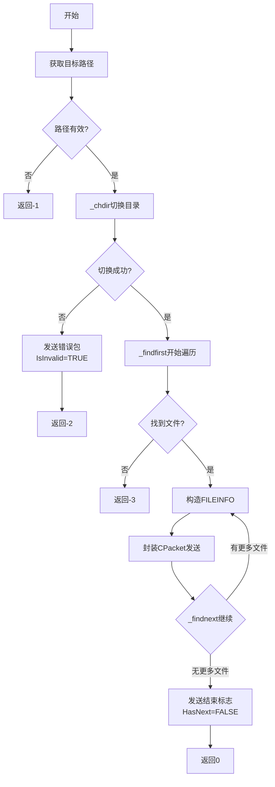

---
tags:
  - 项目/远控系统
  - Windows/文件系统
  - 网络编程/协议设计
git: "b733fc3"
git_msg: "完成了获取指定文件目录下的文件和文件夹功能"
---

# 2.5 获取指定文件目录下的文件和文件夹

本节实现远控系统中的目录遍历功能，允许控制端查看被控端指定目录下的文件和文件夹列表。

---

## 1. 功能概述

### 1.1 需求分析

远控系统需要实现以下能力：
1. 控制端发送目标路径给被控端
2. 被控端遍历指定目录下的所有文件和文件夹
3. 被控端将文件信息通过网络发送给控制端
4. 处理权限不足、目录不存在等异常情况

### 1.2 协议设计

命令码分配：
- **命令 1**：获取磁盘分区信息
- **命令 2**：获取指定目录的文件列表（本节实现）

---

## 2. 核心数据结构

### 2.1 FILEINFO 结构体

`RemoteCtrl.cpp:53-69`

```cpp
typedef struct file_info {
    file_info()
    {
        IsInvalid = FALSE;
        IsDirectory = -1;
        HasNext = TRUE;
        memset(szFileName, 0, sizeof(szFileName));
    }
    // 是否有效
    BOOL IsInvalid;
    // 是否为目录，0 否，1 是
    BOOL IsDirectory;
    // 是否还有后续 0 没有 1 有
    BOOL HasNext;
    // 文件名
    char szFileName[256];
} FILEINFO, *PFILEINFO;
```

**字段说明**：

| 字段 | 类型 | 说明 | 取值 |
|:---|:---|:---|:---|
| `IsInvalid` | `BOOL` | 标记路径是否有效 | `TRUE`: 无效路径（权限不足等）<br>`FALSE`: 有效路径 |
| `IsDirectory` | `BOOL` | 标识是否为目录 | `1`: 目录<br>`0`: 文件 |
| `HasNext` | `BOOL` | 是否还有后续数据 | `TRUE`: 还有数据<br>`FALSE`: 传输结束标志 |
| `szFileName` | `char[256]` | 文件/文件夹名称 | 最大支持 255 字符 + `\0` |

**设计要点**：

1. **流式传输**：通过 `HasNext` 实现流式传输，避免一次性加载大量数据到内存
2. **错误传递**：通过 `IsInvalid` 向控制端反馈权限错误等异常情况
3. **固定大小**：结构体大小固定（264字节），便于网络传输和解包

> [!warning] 文件名长度限制
> Windows 文件名最大长度为 255 字符，但完整路径最大长度为 260 字符（`MAX_PATH`）。此处仅传输文件名，不包含完整路径。

---

## 3. 关键实现

### 3.1 获取目标路径

`ServerSocket.h:216-224`

```cpp
bool GetFilePath(std::string& strPath)
{
    if (m_packet.sCmd == 2)
    {
        strPath = m_packet.strData;
        return true;
    }
    return false;
}
```

**实现分析**：
- 从解包后的 `CPacket` 对象中提取路径字符串
- 验证命令码为 2（获取目录列表命令）
- 使用引用参数返回路径，避免字符串拷贝开销

### 3.2 目录遍历核心函数

`RemoteCtrl.cpp:71-114`

```cpp
int MakeDirectoryInfo()
{
    std::string strPath;
    std::list<FILEINFO> lstFileInfos;

    // 1. 从 CPacket 中提取控制端发来的路径（要求 sCmd == 2）
    if (CServerSocket::getInstance()->GetFilePath(strPath) == false)
    {
        OutputDebugString(_T("当前的命令，不是获取文件列表，命令获取错误"));
        return -1;
    }

    // 2. 切换工作目录：验证路径有效性 + 使 _findfirst("*") 能相对遍历
    if (_chdir(strPath.c_str()) != 0)
    {
        // 路径无效，构造错误包通知控制端
        FILEINFO finfo;
        finfo.IsInvalid = TRUE;
        finfo.IsDirectory = TRUE;
        finfo.HasNext = FALSE;
        memcpy(finfo.szFileName, strPath.c_str(), strPath.size());
        CPacket pack(2, (BYTE*)&finfo, sizeof(finfo));
        CServerSocket::getInstance()->Send(pack);
        OutputDebugString(_T("没有权限访问目录!!"));
        return -2;
    }

    // 3. 开始遍历当前目录所有条目（"*" 通配，含 "." 和 ".."）
    _finddata_t fdata;
    int hfind = 0;  // ⚠️ 应为 intptr_t，64 位下 int 会截断
    if ((hfind = _findfirst("*", &fdata)) == -1)
    {
        OutputDebugString(_T("没有找到任何文件!!"));
        return -3;
    }

    // 4. 逐个发送文件信息（do-while 确保 _findfirst 的第一条结果也被处理）
    do {
        FILEINFO finfo;
        finfo.IsDirectory = (fdata.attrib & _A_SUBDIR) != 0;  // 位运算判断是否为目录
        memcpy(finfo.szFileName, fdata.name, strlen(fdata.name));
        CPacket pack(2, (BYTE*)&finfo, sizeof(finfo));
        CServerSocket::getInstance()->Send(pack);
    } while (!_findnext(hfind, &fdata));  // 返回 -1 时遍历结束
    // ⚠️ 缺少 _findclose(hfind)，句柄泄漏

    // 5. 发送结束标志
    FILEINFO finfo;
    finfo.HasNext = FALSE;
    // ⚠️ 未调用 Send()，结束包实际上没有发出
    return 0;
}
```

**`Send(pack)` 发送的数据包内容**：

`CPacket pack(2, (BYTE*)&finfo, sizeof(finfo))` 调用的是 CPacket 的三参数打包构造函数（`nCmd`, `pData`, `nSize`），详见 [[2.4 获取磁盘分区信息#CPacket 新增构造函数]]。经过 `Data()` 序列化后，实际发送的字节流：

```
偏移    字段         大小    值
──────────────────────────────────────
0       sHead        2B     0xFEFF
2       nLength      4B     268 (= 264 + 2 + 2)
6       sCmd         2B     2
8       strData      264B   FILEINFO 原始内存
272     sSum         2B     校验和
──────────────────────────────────────
总计                 274B
```

其中 `strData` 的 264 字节即 `FILEINFO` 内存布局：

```
偏移    字段           大小    示例值
──────────────────────────────────────
0       IsInvalid      4B     FALSE (0)
4       IsDirectory    4B     1=目录 / 0=文件
8       HasNext        4B     TRUE (1)
12      szFileName     256B   "test.txt\0..."
──────────────────────────────────────
总计                   264B
```

控制端从 `CPacket.strData` 取出 264 字节，强转 `(FILEINFO*)` 即可读取文件信息。

**执行流程图**：



---

## 4. Windows 文件遍历 API

### 4.1 核心函数

本实现使用了 C 运行时库提供的文件遍历函数：

| 函数 | 功能 | 返回值 |
|:---|:---|:---|
| `_findfirst(pattern, fileinfo)` | 开始文件搜索 | 成功：搜索句柄<br>失败：-1 |
| `_findnext(handle, fileinfo)` | 继续搜索下一个文件 | 成功：0<br>失败：-1 |
| `_findclose(handle)` | 关闭搜索句柄 | 无 |
| `_chdir(path)` | 切换当前工作目录 | 成功：0<br>失败：-1 |

### 4.2 _finddata_t 结构体

```cpp
struct _finddata_t {
    unsigned attrib;       // 文件属性
    time_t   time_create;  // 创建时间
    time_t   time_access;  // 最后访问时间
    time_t   time_write;   // 最后修改时间
    _fsize_t size;         // 文件大小
    char     name[260];    // 文件名
};
```

**文件属性标志**：

| 宏定义 | 含义 |
|:---|:---|
| `_A_NORMAL` | 普通文件 |
| `_A_RDONLY` | 只读文件 |
| `_A_HIDDEN` | 隐藏文件 |
| `_A_SYSTEM` | 系统文件 |
| `_A_SUBDIR` | 子目录 |
| `_A_ARCH` | 归档文件 |

### 4.3 判断文件类型

`RemoteCtrl.cpp:103`

```cpp
finfo.IsDirectory = (fdata.attrib & _A_SUBDIR) != 0;
```

使用位运算检测 `_A_SUBDIR` 标志位：
- 如果 `attrib` 的 `_A_SUBDIR` 位为 1，表示这是一个目录
- 否则为普通文件

### 4.4 `_finddata_t fdata` 的工作机制

`fdata` 是**输出参数**，声明时是空的（栈上未初始化的垃圾值），由 `_findfirst` / `_findnext` 负责填充内容。

**内存视角**（假设 `fdata` 在栈地址 `0x0061F800`，目录下有 `docs\`、`hello.txt`、`main.cpp`）：

```
① _finddata_t fdata;                        → 0x0061F800: name="烫烫烫"（垃圾值）
② _findfirst("*", &fdata)                   → 0x0061F800: name="docs"      attrib=0x10
③ _findnext(hfind, &fdata)  — 第一次调用    → 0x0061F800: name="hello.txt" attrib=0x20
④ _findnext(hfind, &fdata)  — 第二次调用    → 0x0061F800: name="main.cpp"  attrib=0x20
⑤ _findnext(hfind, &fdata)  — 返回 -1       → 没有更多文件，fdata 不更新
```

始终是**同一个地址**被反复覆盖，所以循环体内必须**立即**把 `fdata.name` 拷贝出来，否则下次迭代就被覆盖了。

**`_findfirst` 与 do-while 分开写的原因**：

`_findfirst` 承担两个职责：**开启搜索**（返回句柄 `hfind`）+ **获取第一个结果**（填充 `fdata`）。必须先单独调用它来判断目录是否为空，再进入循环：

```
_findfirst("*", &fdata)
    │
    ├── 返回 -1 → 空目录，直接结束（不进循环）
    │
    └── 成功 → fdata 已有第一个结果，hfind 记录搜索位置
                │
                └── do {
                        处理 fdata（第一次是 _findfirst 的结果）
                    } while (_findnext(hfind, &fdata))
                              └── 用 hfind 接着上次的位置往下找
```

`hfind`（搜索句柄）的作用是记录"扫描到哪了"，`_findnext` 凭它知道从哪继续。

### 4.5 `_chdir` 与 `_findfirst` 的隐式通信

`_chdir` 没有返回新路径，`_findfirst("*")` 也没有接收路径参数，它们通过**操作系统为每个进程维护的当前工作目录（CWD）**隐式通信：

```
被控端进程的全局状态
├── 进程ID: 1234
├── 当前工作目录(CWD): "C:\"     ← 所有函数共享这个状态
└── ...

_chdir("C:\\Windows")          → 写 CWD：改为 "C:\Windows"
_findfirst("*", &fdata)        → 读 CWD：把 "*" 解析为 "C:\Windows\*"
```

`_findfirst` 使用相对路径 `"*"` 时，操作系统自动用进程的 CWD 来补全完整路径。所以必须**先 `_chdir` 再 `_findfirst`**，顺序不能反。

---

## 5. 错误处理机制

### 5.1 三层异常处理

| 错误类型 | 返回码 | 处理方式 | 用户反馈 |
|:---|:---:|:---|:---|
| 命令码错误 | -1 | 仅本地日志 | 无（协议错误） |
| 权限不足/路径无效 | -2 | 发送错误包 | 显示无效路径 |
| 目录为空 | -3 | 仅本地日志 | 无（正常情况） |

### 5.2 权限错误处理

`RemoteCtrl.cpp:81-93`

当 `_chdir` 失败时（权限不足或路径不存在）：

```cpp
FILEINFO finfo;
finfo.IsInvalid = TRUE;          // 标记无效
finfo.IsDirectory = TRUE;        // 标记为目录（路径本身）
finfo.HasNext = FALSE;           // 无后续数据
memcpy(finfo.szFileName, strPath.c_str(), strPath.size());
```

这样控制端可以：
1. 通过 `IsInvalid` 识别出错误
2. 通过 `szFileName` 显示出错的路径
3. 通过 `HasNext = FALSE` 知道不会有后续数据

> [!tip] 错误信息传递
> 将错误信息通过正常的数据通道返回，而不是使用特殊的错误码，这简化了控制端的协议解析逻辑。

---

## 6. 流式传输设计

### 6.1 传输流程

```
控制端                    被控端
  |                         |
  |--[命令2 + 路径]-------->|
  |                         | _findfirst("*")
  |<--[FILEINFO: file1]-----|
  |<--[FILEINFO: folder1]---|
  |<--[FILEINFO: file2]-----|
  |         ...              |
  |<--[HasNext=FALSE]--------|  // 结束标志
  |                         |
```

### 6.2 边界条件

**空目录处理**：
- `_findfirst` 返回 -1
- 函数返回 -3
- 控制端不会收到任何数据包

**单个文件**：
- 第一个包：文件信息（`HasNext = TRUE`，默认值）
- 第二个包：结束标志（`HasNext = FALSE`）

**大量文件**：
- 逐个发送，不会占用过多内存
- 网络传输与文件遍历并行进行

> [!warning] 资源泄漏风险
> 当前代码未调用 `_findclose(hfind)` 关闭搜索句柄，存在资源泄漏风险。应在函数返回前调用。

---

## 7. 与其他模块的集成

### 7.1 命令分发

`RemoteCtrl.cpp:159-170`

```cpp
int nCmd = 1;
switch (nCmd)
{
    // 查看磁盘分区
    case 1:
        MakeDriverInfo();
        break;
    // 查看指定目录下的文件
    case 2:
        MakeDirectoryInfo();
        break;
}
```

**命令码设计**：
- 采用顺序编号（1、2、3...）
- 预留足够的命令空间供后续扩展

### 7.2 与 CPacket 协议层交互

每个 `FILEINFO` 都被封装为独立的 `CPacket`：

```cpp
CPacket pack(2, (BYTE*)&finfo, sizeof(finfo));
CServerSocket::getInstance()->Send(pack);
```

**协议格式**：

```
+--------+----------+------+-------------------+--------+
| Header | Length   | Cmd  | FILEINFO (264B)   | Sum    |
| 0xFEFF | 268      | 2    | ...               | Checksum|
+--------+----------+------+-------------------+--------+
  2字节    4字节     2字节    264字节            2字节
```

---

## 8. 改进建议

### 8.1 资源管理问题

**当前问题**：
```cpp
int hfind = _findfirst("*", &fdata);
// ... 使用 hfind ...
// ❌ 缺少 _findclose(hfind)
```

**建议修复**：
```cpp
int hfind = _findfirst("*", &fdata);
if (hfind == -1) return -3;

// 使用 RAII 管理资源
struct FindHandleGuard {
    intptr_t handle;
    ~FindHandleGuard() { if (handle != -1) _findclose(handle); }
} guard{hfind};
```

**参见**：[[5.1 文件简介]] - RAII 资源管理原则

### 8.2 路径安全性

**潜在风险**：
- 恶意客户端可能发送 `..` 路径进行目录穿越攻击
- 未对路径合法性进行校验

**建议**：
```cpp
// 校验路径是否在允许范围内
bool IsPathSafe(const std::string& path) {
    // 1. 检查绝对路径
    // 2. 禁止 .. 和特殊字符
    // 3. 白名单机制
}
```

### 8.3 Unicode 支持

当前使用 `char` 和 `strlen`，不支持 Unicode 文件名。

**建议使用**：
- `_wfindfirst` / `_wfindnext`（宽字符版本）
- `std::wstring` 存储文件名
- UTF-8 编码传输

**参见**：[[5.1 文件简介]] - C++ 文件流的 Unicode 支持

### 8.4 性能优化

**批量发送**：
```cpp
std::vector<FILEINFO> batch;
do {
    batch.push_back(finfo);
    if (batch.size() >= 10) {  // 每 10 个打包发送
        SendBatch(batch);
        batch.clear();
    }
} while (!_findnext(hfind, &fdata));
```

---

## 9. 测试要点

### 9.1 功能测试

| 测试场景 | 期望结果 |
|:---|:---|
| 空目录 | 返回 -3 |
| 单个文件 | 收到 1 个文件包 + 结束标志 |
| 包含子目录 | 正确区分文件和目录 |
| 权限不足目录 | 收到 `IsInvalid=TRUE` 的错误包 |
| 特殊字符文件名 | 正确传输不乱码 |

### 9.2 边界测试

- 路径长度接近 260 字符
- 文件名长度接近 255 字符
- 超过 10000 个文件的目录
- 网络中断时的行为

---

## 10. 关键要点

1. **流式传输**：通过 `HasNext` 标志实现流式文件列表传输
2. **错误反馈**：使用 `IsInvalid` 向控制端传递异常信息
3. **Windows API**：掌握 `_findfirst` / `_findnext` 文件遍历模式
4. **资源管理**：必须调用 `_findclose` 释放搜索句柄
5. **安全性**：需要对路径进行合法性校验，防止目录穿越攻击

---

## 11. 关联知识

- [[5.1 文件简介]] - Windows 文件操作基础（C/C++/Win32 API/MFC四种方式）
- [[6.9 操作目录]] - Linux 目录遍历对比（`opendir`/`readdir`）
- [[2.3 设计网络传输包协议]] - CPacket 协议封装与粘包处理
- [[2.4 获取磁盘分区信息]] - 命令 1 实现，使用 `_chdrive` 枚举磁盘
- [[2.6 文件打开与下载]] - 命令 3/4 实现，使用 `ShellExecuteA` 和文件下载

---

## 参考

- MSDN: `_findfirst`, `_findnext`, `_findclose` 文档
- 《Windows系统编程》第 3 章：文件系统遍历
- 远控项目代码：`RemoteCtrl.cpp:71-114`, `ServerSocket.h:216-224`
