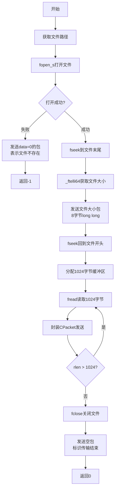
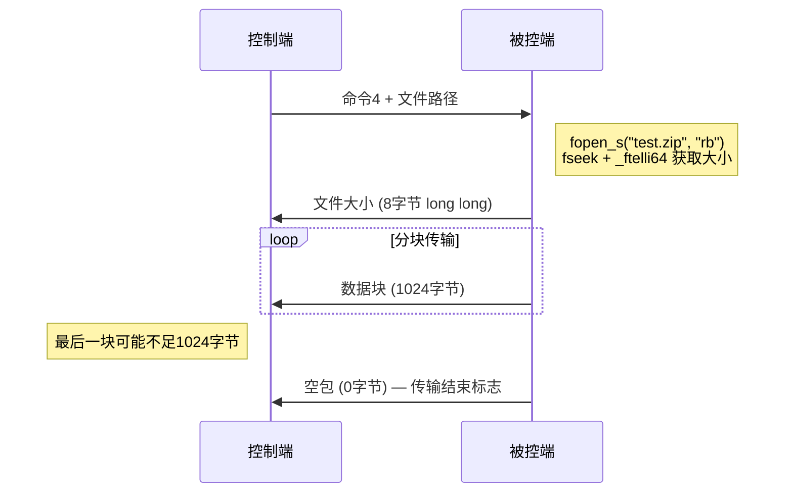

---
tags:
  - 项目/远控系统
  - Windows/文件操作
  - 网络编程/文件传输
git: "d7401da"
git_msg: "完成了打开文件的功能"
---

# 2.6 文件打开与下载

本节实现远控系统中的文件打开和下载功能，允许控制端远程执行被控端的文件，或将被控端的文件下载到本地。

---

## 1. 功能概述

### 1.1 需求分析

在文件管理功能的基础上，远控系统需要实现：
1. **文件打开**：控制端发送文件路径，被控端打开/运行该文件
2. **文件下载**：控制端请求文件，被控端分块传输文件数据
3. **大文件支持**：使用 64 位文件大小表示，支持 >4GB 的文件
4. **错误处理**：文件不存在、无权限等异常情况的处理

### 1.2 协议设计

命令码扩展：
- **命令 1**：获取磁盘分区信息
- **命令 2**：获取指定目录的文件列表
- **命令 3**：打开/运行文件（本节实现）
- **命令 4**：下载文件（本节实现）

---

## 2. 文件打开功能

### 2.1 RunFile() 实现

`RemoteCtrl.cpp:116-124`

```cpp
int RunFile()
{
    // 从控制端接收的数据包中提取目标文件路径
    std::string strPath;
    CServerSocket::getInstance()->GetFilePath(strPath);
    // 调用 Windows Shell 打开文件（等同于双击文件）
    ShellExecuteA(NULL, NULL, strPath.c_str(), NULL, NULL, SW_SHOWNORMAL);
    // 回送命令 3 的应答包，通知控制端执行完毕
    CPacket pack(3, NULL, 0);
    CServerSocket::getInstance()->Send(pack);
    return 0;
}
```

**功能说明**：
1. 从网络包中提取文件路径
2. 使用 `ShellExecuteA` API 打开/运行文件
3. 发送空数据包（命令 3）作为响应

### 2.2 ShellExecuteA API 详解

```cpp
HINSTANCE ShellExecuteA(
    HWND    hwnd,          // 父窗口句柄，NULL表示无父窗口
    LPCSTR  lpOperation,   // 操作类型："open", "edit", "print" 等
    LPCSTR  lpFile,        // 要执行的文件路径
    LPCSTR  lpParameters,  // 命令行参数
    LPCSTR  lpDirectory,   // 工作目录
    INT     nShowCmd       // 窗口显示方式
);
```

**参数说明**：

| 参数 | 值 | 说明 |
|:---|:---|:---|
| `hwnd` | `NULL` | 无父窗口 |
| `lpOperation` | `NULL` | 使用文件关联的默认操作 |
| `lpFile` | `strPath.c_str()` | 目标文件完整路径 |
| `lpParameters` | `NULL` | 无命令行参数 |
| `lpDirectory` | `NULL` | 使用文件所在目录作为工作目录 |
| `nShowCmd` | `SW_SHOWNORMAL` | 正常显示窗口 |

**工作原理**：
- 如果是可执行文件（.exe, .bat, .cmd），直接运行
- 如果是文档文件（.txt, .docx, .pdf），使用关联的程序打开
- 如果是文件夹路径，使用资源管理器打开

> [!tip] lpOperation 为 NULL 的好处
> 让 Windows 根据文件扩展名自动选择操作，无需区分文件类型。例如：
> - `.txt` → 用记事本打开
> - `.docx` → 用 Word 打开
> - `.exe` → 直接运行

### 2.3 协议格式

**请求包**（控制端 → 被控端）：
```
┌──────┬────────┬─────┬─────────────────┬────────┐
│ FEFF │ len    │ 3   │ "C:\test.exe"   │ sum    │
│ 包头  │ 长度   │ 命令 │ 文件路径         │ 校验和  │
└──────┴────────┴─────┴─────────────────┴────────┘
```

**响应包**（被控端 → 控制端）：
```
┌──────┬────────┬─────┬────────┐
│ FEFF │ 4      │ 3   │ sum    │
│ 包头  │ 长度=4 │ 命令 │ 校验和  │
└──────┴────────┴─────┴────────┘
```

响应包为空包（无数据载荷），仅表示命令已执行。

> [!warning] 安全风险
> `ShellExecuteA` 会立即执行文件，没有权限检查和确认机制。恶意客户端可能：
> - 执行系统关键程序（如 `shutdown.exe`）
> - 运行恶意脚本
> - 建议添加白名单或用户确认机制

---

## 3. 文件下载功能

### 3.1 DownloadFile() 实现

`RemoteCtrl.cpp:126-158`

```cpp
int DownloadFile()
{
    // 获取控制端请求下载的文件路径
    std::string strPath;
    CServerSocket::getInstance()->GetFilePath(strPath);
    long long data = 0;
    FILE* pFile = NULL;
    // 以二进制只读模式打开目标文件
    errno_t err = fopen_s(&pFile, strPath.c_str(), "rb");
    if (err != 0)
    {
        // 打开失败，发送 data=0 告知控制端文件不可用
        CPacket pack(4, (BYTE*)&data, 8);
        CServerSocket::getInstance()->Send(pack);
        return -1;
    }
    if (pFile != NULL)
    {
        // 获取文件大小：移到末尾 → 读位置 → 移回开头
        fseek(pFile, 0, SEEK_END);        // 把文件指针移动到文件末尾
        data = _ftelli64(pFile);          // 获取当前文件指针偏移量，64位，支持 >4GB 文件
        /*
          - 4 — 命令码，表示"下载文件"
		  - (BYTE*)&data — 把 long long data（文件大小）的地址强转为字节指针，当作原始数据传输
		  - 8 — 数据长度 8 字节（long long 正好 8 字节）
		  控制端收到这个包后，从 8 字节数据中还原出文件大小，就知道后续要接收多少数据。
        */
        CPacket head(4, (BYTE*)&data, 8); // 第一个包：告知控制端文件总大小
        // 把文件指针移回文件开头。因为前面为了获取文件大小，已经用 fseek(SEEK_END) 把指针移到了末尾，
        // 现在要从头开始读文件内容，必须移回去。
        fseek(pFile, 0, SEEK_SET);
        // 分块读取并逐包发送文件内容
        char buffer[1024] = "";
        size_t rlen = 0;
        do {
            rlen = fread(buffer, 1, 1024, pFile);   // 从文件中读取最多 1024 字节数据，存入 buffer 数组里。
            CPacket pack(4, (BYTE*)buffer, rlen);
            CServerSocket::getInstance()->Send(pack);
        } while (rlen == 1024);  // ⚠️ Bug：应为 rlen == 1024，见第6节

        fclose(pFile);
    }
    // 发送空包作为文件传输结束标志
    CPacket pack(4, NULL, 0);
    CServerSocket::getInstance()->Send(pack);
    return 0;
}
```

### 3.2 执行流程分析



### 3.3 关键 C 文件 API

| 函数 | 功能 | 参数说明 |
|:---|:---|:---|
| `fopen_s(&pFile, path, "rb")` | 安全打开文件 | `rb` = 二进制只读模式<br>返回 `errno_t` 错误码 |
| `fseek(pFile, 0, SEEK_END)` | 移动文件指针到末尾 | 用于获取文件大小 |
| `_ftelli64(pFile)` | 获取当前文件位置（64位） | 返回 `long long`，支持 >4GB 文件 |
| `fseek(pFile, 0, SEEK_SET)` | 移动文件指针到开头 | 准备读取文件内容 |
| `fread(buf, 1, 1024, pFile)` | 读取数据 | 读取 1024 个 1 字节的元素<br>返回实际读取的元素数 |
| `fclose(pFile)` | 关闭文件 | 释放文件句柄资源 |

**fseek 位置参数**：

| 常量 | 含义 |
|:---|:---|
| `SEEK_SET` | 文件开头 |
| `SEEK_CUR` | 当前位置 |
| `SEEK_END` | 文件末尾 |

### 3.4 文件大小获取技巧

```cpp
fseek(pFile, 0, SEEK_END);   // 移动到末尾
data = _ftelli64(pFile);      // 当前位置 = 文件大小
fseek(pFile, 0, SEEK_SET);   // 移回开头
```

**为什么使用 `_ftelli64`？**

| 函数 | 返回类型 | 最大文件大小 | 说明 |
|:---|:---:|:---:|:---|
| `ftell()` | `long` (32位) | 2GB | 会溢出 |
| `_ftelli64()` | `long long` (64位) | 9EB | Windows 扩展函数 |

> [!tip] 跨平台替代方案
> Linux/POSIX 使用 `fseeko()` + `ftello()`（需定义 `_FILE_OFFSET_BITS=64`）

---

## 4. 协议改进

### 4.1 CPacket 构造函数修正

`ServerSocket.h:18-26`

```cpp
CPacket(WORD nCmd, const BYTE* pData, size_t nSize)
{
    sHead = 0xFEFF;           // 包头魔数，用于接收端识别包起始
    nLength = nSize + 4;      // 包体长度 = 数据长度 + cmd(2B) + sum(2B)
    sCmd = nCmd;              // 命令码（1=磁盘 2=目录 3=打开 4=下载）
    if (nSize > 0)
    {
        strData.resize(nSize);
        memcpy((void*)strData.c_str(), pData, nSize);  // 拷贝数据载荷
    }
    else
    {
        strData.clear();      // 空包：无数据载荷
    }
    // 计算校验和：逐字节累加
    sSum = 0;
    for (size_t j = 0; j < strData.size(); j++)
    {
        sSum += BYTE(strData[j]) & 0xFF;
    }
}
```

**改进说明**：
- 原代码：当 `nSize = 0` 时，`strData.resize(0)` 后仍执行 `memcpy`，可能导致空指针解引用
	- `strData.resize(0)` 后，`strData` 是一个空字符串，其内部缓冲区可能为 `nullptr`（取决于标准库实现）
	- 此时 `strData.c_str()` 返回的指针指向一个空的 `'\0'`，但 `pData` 参数在调用方传入时也可能是 `nullptr`（因为没有数据要发送）
	- `memcpy(dest, nullptr, 0)` 是**未定义行为**——即使拷贝长度为 0，C 标准仍要求两个指针都必须有效
- 修正后：检查 `nSize > 0`，避免对空数据进行 memcpy

**适用场景**：
- 命令 3（RunFile）的响应包：无数据，只有命令码
- 命令 4（DownloadFile）的结束标志：空包表示传输完成

### 4.2 GetFilePath() 扩展

`ServerSocket.h:226`

```cpp
bool GetFilePath(std::string& strPath)
{
    // 命令 2/3/4 的数据载荷都是文件路径，统一提取
    if ((m_packet.sCmd >= 2) && (m_packet.sCmd <= 4))
    {
        strPath = m_packet.strData;
        return true;
    }
    return false;  // 其他命令不含文件路径
}
```

**修改前**：只支持命令 2（获取目录列表）
**修改后**：支持命令 2-4（目录列表、打开文件、下载文件）

---

## 5. 文件下载协议详解

### 5.1 传输流程



### 5.2 数据包格式

**1. 文件大小包**（第一个包）：
```
┌──────┬────────┬─────┬───────────────┬────────┐
│ FEFF │ 12     │ 4   │ 文件大小(8B)   │ sum    │
│      │        │     │ (long long)   │        │
└──────┴────────┴─────┴───────────────┴────────┘
```

**2. 数据块包**（循环发送）：
```
┌──────┬────────┬─────┬───────────────┬────────┐
│ FEFF │ 1028   │ 4   │ 数据(1024B)    │ sum    │
│      │        │     │               │        │
└──────┴────────┴─────┴───────────────┴────────┘
```

**3. 结束标志包**：
```
┌──────┬────────┬─────┬────────┐
│ FEFF │ 4      │ 4   │ sum    │
│      │        │     │        │
└──────┴────────┴─────┴────────┘
```

### 5.3 控制端解析逻辑

```cpp
long long fileSize = 0;
std::vector<BYTE> fileData;

// 1. 接收第一个包，读取文件大小
CPacket pack1 = RecvPacket();
if (pack1.strData.size() == 8) {
    fileSize = *(long long*)pack1.strData.c_str();
    if (fileSize == 0) {
        // 文件打开失败
        return;
    }
    fileData.reserve(fileSize);  // 预分配内存
}

// 2. 循环接收数据块
while (true) {
    CPacket pack = RecvPacket();
    if (pack.strData.size() == 0) {
        // 空包，传输结束
        break;
    }
    // 将本次收到的数据块追加到 fileData 尾部
    fileData.insert(fileData.end(),
                    pack.strData.begin(),
                    pack.strData.end());
}

// 3. 保存到本地文件
FILE* pFile = fopen("downloaded_file", "wb");
fwrite(fileData.data(), 1, fileData.size(), pFile);
fclose(pFile);
```

---

## 6. 代码问题分析

### 6.1 Bug: 循环终止条件错误

`RemoteCtrl.cpp:151`

```cpp
do {
    rlen = fread(buffer, 1, 1024, pFile);
    CPacket pack(4, (BYTE*)buffer, rlen);
    CServerSocket::getInstance()->Send(pack);
} while (rlen > 1024);  // ❌ 错误：应该是 >= 1024
```

**问题分析**：
- `fread` 最多读取 1024 字节，因此 `rlen` 最大值为 1024
- 条件 `rlen > 1024` **永远为假**，循环只执行一次就退出
- 实际效果：只发送文件的前 1024 字节

**正确写法**：
```cpp
do {
    rlen = fread(buffer, 1, 1024, pFile);
    if (rlen > 0) {  // 只要读到数据就发送
        CPacket pack(4, (BYTE*)buffer, rlen);
        CServerSocket::getInstance()->Send(pack);
    }
} while (rlen == 1024);  // 读满1024字节继续，否则说明到末尾了
```

**推荐写法（更清晰）**：
```cpp
while (true) {
    size_t rlen = fread(buffer, 1, 1024, pFile);
    CPacket pack(4, (BYTE*)buffer, rlen);
    CServerSocket::getInstance()->Send(pack);

    if (rlen < 1024) {  // 未读满说明到文件末尾
        break;
    }
}
```

### 6.2 资源管理问题

**当前问题**：
```cpp
FILE* pFile = NULL;
errno_t err = fopen_s(&pFile, strPath.c_str(), "rb");
if (err != 0)
{
    // 错误处理
    return -1;
}
// ... 使用 pFile ...
fclose(pFile);  // ✅ 正常路径有关闭
```

但如果在使用过程中发生异常（如网络断开），`fclose` 不会被调用，导致资源泄漏。

**建议修复（RAII）**：
```cpp
class FileGuard {
    FILE* pFile;
public:
    FileGuard(const char* path, const char* mode) {
        fopen_s(&pFile, path, mode);
    }
    ~FileGuard() {
        if (pFile) fclose(pFile);
    }
    FILE* get() { return pFile; }
    operator bool() { return pFile != nullptr; }
};

// 使用
FileGuard file(strPath.c_str(), "rb");
if (!file) {
    // 错误处理
}
// 自动关闭，即使异常退出
```

**或使用 C++ 文件流**：
```cpp
std::ifstream ifs(strPath, std::ios::binary);
if (!ifs.is_open()) {
    // 错误处理
}
// 析构函数自动关闭
```

**参见**：[[5.1 文件简介]] - C/C++/Win32 API 文件操作对比

---

## 7. 安全性问题

### 7.1 路径穿越攻击

**风险**：恶意客户端可能发送特殊路径：
```
"C:\\Windows\\System32\\config\\SAM"  // 系统敏感文件
"..\\..\\..\\boot.ini"                 // 目录穿越
```

**防御措施**：
```cpp
bool IsPathSafe(const std::string& path) {
    // 1. 禁止绝对路径中的系统目录
    if (path.find(":\\Windows\\") != std::string::npos) {
        return false;
    }

    // 2. 禁止 ".." 相对路径
    if (path.find("..") != std::string::npos) {
        return false;
    }

    // 3. 白名单机制：只允许特定目录
    const char* allowedDirs[] = {"C:\\Users\\Public\\", "D:\\Share\\"};
    for (auto dir : allowedDirs) {
        if (path.find(dir) == 0) {
            return true;
        }
    }

    return false;
}
```

### 7.2 权限控制

**建议**：
- 被控端以低权限用户运行
- 只允许访问特定目录（沙箱机制）
- 记录所有文件操作日志

### 7.3 文件大小限制

**问题**：恶意客户端可能请求超大文件，消耗内存和带宽。

**防御**：
```cpp
const long long MAX_FILE_SIZE = 100 * 1024 * 1024;  // 100MB

if (data > MAX_FILE_SIZE) {
    // 拒绝下载
    data = -1;  // 使用 -1 表示文件过大
    CPacket pack(4, (BYTE*)&data, 8);
    CServerSocket::getInstance()->Send(pack);
    return -2;
}
```

---

## 8. 性能优化

### 8.1 增大缓冲区

```cpp
// ❌ 当前：1024字节缓冲区
char buffer[1024] = "";

// ✅ 优化：64KB缓冲区（减少系统调用次数）
const size_t BUFFER_SIZE = 64 * 1024;
char buffer[BUFFER_SIZE];
```

**收益**：
- 减少 `fread` 系统调用次数
- 减少网络包数量（减少协议开销）
- 对于 10MB 文件：1024B需发送10240个包，64KB只需160个包

### 8.2 异步发送

**当前问题**：读文件和发送网络是串行的，CPU 利用率低。

**改进方案**：
```cpp
// 使用双缓冲 + 多线程
std::queue<std::vector<BYTE>> dataQueue;
std::mutex queueMutex;

// 线程1: 读文件
while (fread(buffer, ...)) {
    std::lock_guard<std::mutex> lock(queueMutex);
    dataQueue.push(std::vector<BYTE>(buffer, buffer + rlen));
}

// 线程2: 发送网络
while (!dataQueue.empty() || !fileReadDone) {
    std::vector<BYTE> data;
    {
        std::lock_guard<std::mutex> lock(queueMutex);
        if (!dataQueue.empty()) {
            data = dataQueue.front();
            dataQueue.pop();
        }
    }
    if (!data.empty()) {
        SendPacket(data);
    }
}
```

### 8.3 压缩传输

对于文本文件，可以使用 zlib 压缩：
```cpp
#include <zlib.h>

std::vector<BYTE> Compress(const BYTE* data, size_t size) {
    uLongf compressedSize = compressBound(size);
    std::vector<BYTE> compressed(compressedSize);

    compress(compressed.data(), &compressedSize, data, size);
    compressed.resize(compressedSize);

    return compressed;
}
```

---

## 9. 测试要点

### 9.1 功能测试

| 测试场景 | 期望结果 |
|:---|:---|
| 打开文本文件 | 用记事本打开 |
| 打开可执行文件 | 程序运行 |
| 打开不存在的文件 | 无响应或报错（ShellExecute失败） |
| 下载空文件 | 发送大小=0，然后结束包 |
| 下载小文件 (<1024B) | 发送大小 + 一个数据包 + 结束包 |
| 下载大文件 (>10MB) | 正确分块传输 |
| 下载不存在的文件 | 发送大小=0的错误包 |

### 9.2 边界测试

- 文件大小恰好 1024 字节
- 文件大小 1024*N 字节（整数倍）
- 超大文件（4GB+）
- 路径包含中文、空格、特殊字符
- 网络中断时的行为

### 9.3 安全测试

- 尝试下载系统文件
- 路径穿越攻击
- 请求不存在的文件
- 同时下载大量文件

---

## 10. 关键要点

1. **文件打开**：使用 `ShellExecuteA` 自动根据文件扩展名选择程序
2. **C 文件 API**：`fopen_s`/`fread`/`fseek`/`_ftelli64`/`fclose`
3. **大文件支持**：使用 `long long`（64位）表示文件大小
4. **分块传输**：1024 字节缓冲区，循环读取和发送
5. **协议改进**：CPacket 支持空数据（`nSize=0`）
6. **Bug 修复**：循环条件应为 `rlen == 1024` 而非 `rlen > 1024`
7. **安全风险**：路径穿越、权限控制、文件大小限制
8. **资源管理**：使用 RAII 或确保异常安全的文件关闭

---

## 11. 命令体系总结

| 命令码 | 功能 | 请求数据 | 响应数据 |
|:---:|:---|:---|:---|
| 1 | 获取磁盘分区 | 无 | 盘符列表（如 "C,D,E"） |
| 2 | 获取目录列表 | 目录路径 | FILEINFO 结构体流 |
| 3 | 打开/运行文件 | 文件路径 | 空包（确认执行） |
| 4 | 下载文件 | 文件路径 | 文件大小 + 数据块流 + 空包 |

---

## 12. 关联知识

- [[5.1 文件简介]] - C/C++/Win32 API/MFC 文件操作对比
- [[2.3 设计网络传输包协议]] - CPacket 协议封装与粘包处理
- [[2.4 获取磁盘分区信息]] - 命令 1 实现（`_chdrive` 枚举磁盘）
- [[2.5 获取指定文件目录下的文件和文件夹]] - 命令 2 实现（`_findfirst`/`_findnext`）

---

## 13. 参考

- MSDN: `ShellExecuteA`, `fopen_s`, `fread`, `_ftelli64` 文档
- 《Windows系统编程》第 3 章：文件系统操作
- 远控项目代码：`RemoteCtrl.cpp:116-158`, `ServerSocket.h:18-26`
