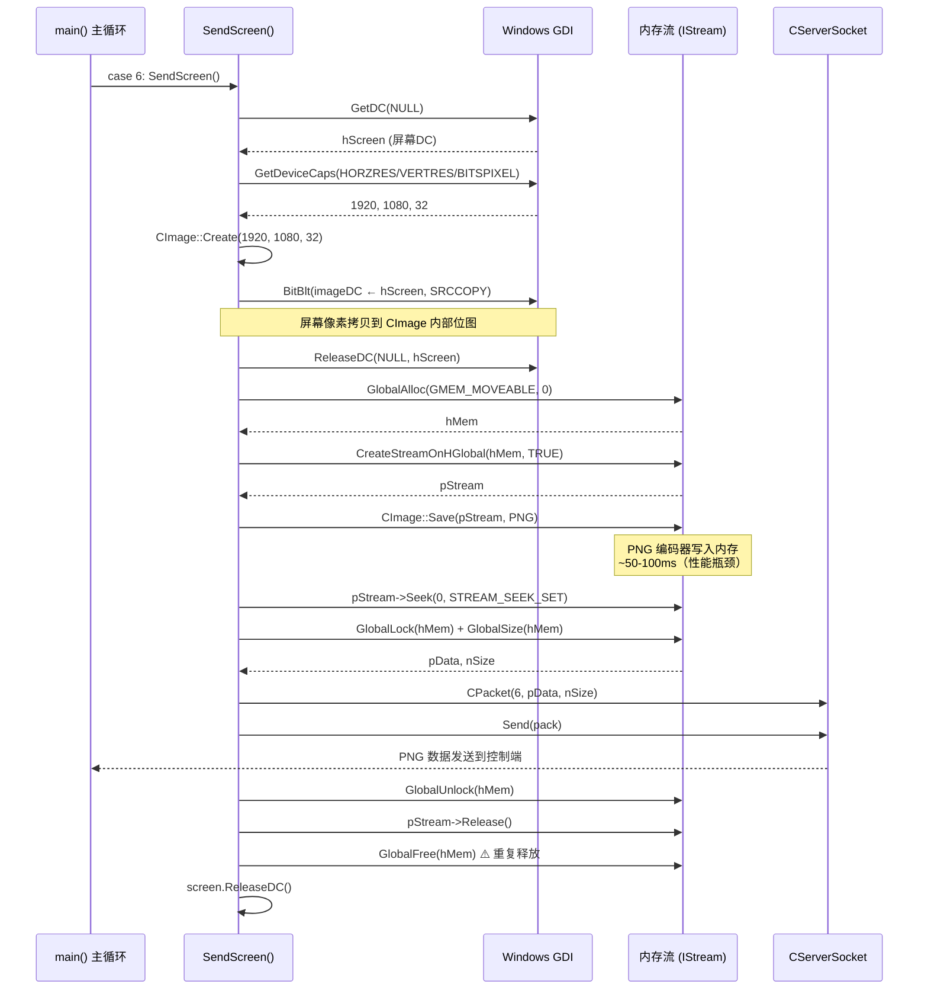

---
tags:
  - 项目/远控系统
git: "282e985"
git_msg: "完成了屏幕截屏与发送"
git_history:
  - "10d79cd — 初步网络框架（2.1/2.2）"
  - "509bd5c — 协议设计与粘包处理（2.3）"
  - "8dcce91 — 磁盘枚举（2.4）"
  - "b733fc3 — 目录遍历（2.5）"
  - "d7401da — 文件打开与下载（2.6）"
  - "9ae2609 — 鼠标消息处理（2.7）"
  - "282e985 — 屏幕截屏与发送（2.8）"
---

# 第二章总结：远控架构和基本设计

> 本篇是第二章（2.1-2.8）的完整总结，基于 `282e985` 提交时的源码，从**服务端（被控端）**和**客户端（控制端）**两个视角讲解整体架构，并附完整时序图。

---

## 一、章节演进路线

```
2.1 全局对象 + RAII（Winsock 生命周期管理）
 ↓ 问题：全局对象可被拷贝，析构时重复关闭 socket
2.2 单例模式 + 封装接口（CServerSocket）
 ↓ 问题：TCP 是字节流，recv 无消息边界
2.3 应用层协议 + 包解析（CPacket）
 ↓ 问题：只能收发原始数据，无业务功能
2.4 CPacket 打包构造 + 磁盘枚举 + 命令分发框架
 ↓ 能力：可响应命令 1
2.5 FILEINFO 结构体 + 目录遍历 + 流式传输
 ↓ 能力：可响应命令 2
2.6 文件打开 + 文件下载 + 分块传输
 ↓ 能力：可响应命令 3/4
2.7 MOUSEEV 结构体 + 鼠标事件模拟
 ↓ 能力：可响应命令 5
2.8 GDI 截屏 + IStream 内存流 + PNG 编码发送
 ↓ 能力：可响应命令 6
```

两个阶段的分界线：

| 阶段 | 笔记 | 关注点 |
|------|------|--------|
| **基础设施** | 2.1-2.3 | Winsock 初始化、单例模式、协议设计、粘包处理 |
| **业务功能** | 2.4-2.8 | 磁盘枚举、目录遍历、文件操作、鼠标控制、屏幕截图 |

---

## 二、项目文件结构（`282e985` 时的状态）

```
RemoteCtrl/
├── RemoteCtrl/              ← 被控端（服务端，控制台程序）
│   ├── pch.h / pch.cpp              预编译头（引入 framework.h）
│   ├── framework.h                  MFC + Windows 头文件集中引入
│   ├── RemoteCtrl.h                 MFC 生成的占位头文件
│   ├── RemoteCtrl.cpp               ★ 核心：main() + 6 个命令处理函数
│   ├── ServerSocket.h               ★ 核心：CPacket + MOUSEEV + CServerSocket
│   └── ServerSocket.cpp             静态成员初始化（3 行有效代码）
│
└── RemoteClient/            ← 控制端（客户端，MFC 对话框程序）
    ├── RemoteClient.h / .cpp        MFC App 类（自动生成，空壳）
    ├── RemoteClientDlg.h / .cpp     主对话框（自动生成，空壳）
    ├── Resource.h                   资源 ID 定义
    ├── framework.h                  头文件引入
    └── pch.h / pch.cpp              预编译头
```

> [!important] 关键特征
> 截至 2.8，**所有业务逻辑集中在被控端的两个文件**：`ServerSocket.h`（协议 + 网络）和 `RemoteCtrl.cpp`（命令处理）。**客户端仍然是 MFC 自动生成的空壳**，尚未实现任何功能。

---

## 三、服务端源码讲解（被控端）

### 3.1 ServerSocket.h — 协议层与网络层

整个头文件包含三个组件，所有逻辑以 inline 形式写在头文件中：

#### 3.1.1 CPacket — 网络数据包

**协议格式**：

```
偏移  0    2         6    8        8+N     8+N+2
     ┌─────┬─────────┬────┬────────┬───────┐
     │FEFF │ nLength │Cmd │ Data   │ Sum   │
     │ 2B  │   4B    │ 2B │  NB    │  2B   │
     └─────┴─────────┴────┴────────┴───────┘
           ←──────── nLength ──────────────→
```

**源码**（`282e985:ServerSocket.h`）：

```cpp
#pragma pack(push)
#pragma pack(1)   // 关闭字节对齐，保证包格式紧凑

class CPacket
{
public:
    WORD   sHead;      // 包头魔数 0xFEFF，用于在字节流中定位包起始
    DWORD  nLength;    // 包体长度 = sCmd(2) + strData(N) + sSum(2)
    WORD   sCmd;       // 命令码（1-6）
    std::string strData;  // 可变长数据载荷
    WORD   sSum;       // 校验和：strData 所有字节累加
    std::string strOut;   // 序列化缓冲区（Data() 方法使用）

    // 默认构造
    CPacket() : sHead(0), nLength(0), sCmd(0), sSum(0) {}

    // ① 打包构造（发送方向）—— 2.4 新增，2.6 修正空包支持
    CPacket(WORD nCmd, const BYTE* pData, size_t nSize)
    {
        sHead = 0xFEFF;
        nLength = nSize + 4;
        sCmd = nCmd;
        if (nSize > 0) {                          // 2.6 修正：检查 nSize
            strData.resize(nSize);
            memcpy((void*)strData.c_str(), pData, nSize);
        } else {
            strData.clear();                      // 空包：命令 3 响应、命令 4 结束标志
        }
        sSum = 0;
        for (size_t j = 0; j < strData.size(); j++)
            sSum += BYTE(strData[j]) & 0xFF;
    }

    // ② 解析构造（接收方向）—— 2.3 引入
    // nSize 是 [in/out]：传入缓冲区数据量，解析成功后返回消耗字节数，失败置 0
    CPacket(const BYTE* pData, size_t& nSize)
    {
        // 步骤1：逐字节扫描魔数 0xFEFF（处理粘包）
        size_t i = 0;
        for (; i < nSize; i++) {
            if (*(WORD*)(pData + i) == 0xFEFF) {
                sHead = *(WORD*)(pData + i);
                i += 2;
                break;
            }
        }
        // 步骤2：检查剩余数据是否足够
        if (i + 4 + 2 + 2 > nSize) { nSize = 0; return; }

        // 步骤3：读取 nLength，验证包体完整性
        nLength = *(DWORD*)(pData + i); i += 4;
        if (nLength + i > nSize) { nSize = 0; return; }

        // 步骤4：读取命令码
        sCmd = *(WORD*)(pData + i); i += 2;

        // 步骤5：读取数据载荷
        if (nLength > 4) {
            strData.resize(nLength - 4);
            memcpy((void*)strData.c_str(), pData + i, nLength - 4);
            i += nLength - 4;
        }

        // 步骤6：读取并验证校验和
        sSum = *(WORD*)(pData + i); i += 2;
        WORD sum = 0;
        for (size_t j = 0; j < strData.size(); j++)
            sum += BYTE(strData[j]) & 0xFF;
        nSize = (sum == sSum) ? i : 0;
    }

    // 序列化为连续字节流，供 send() 发送
    const char* Data() { /* 将各字段按顺序写入 strOut */ }
    int Size() { return nLength + 6; }
};

#pragma pack(pop)
```

**设计要点**：
- `#pragma pack(1)` 确保结构体无填充，网络传输不会因对齐导致格式错乱
- 双向构造：打包（发送）+ 解析（接收），一个类完成序列化/反序列化
- 粘包处理：魔数扫描 + 长度校验 + `memmove` 滑动窗口

#### 3.1.2 MOUSEEV — 鼠标事件结构体（2.7 新增）

```cpp
typedef struct MouseEvent {
    MouseEvent() {
        nAction = 0;      // 0=单击 1=双击 2=按下 3=释放
        nButton = -1;     // 0=左键 1=右键 2=中键 4=纯移动
        ptXY.x = 0;
        ptXY.y = 0;
    }
    WORD  nAction;     // 动作类型
    WORD  nButton;     // 按键类型
    POINT ptXY;        // 屏幕坐标（x:4B + y:4B）
} MOUSEEV, *PMOUSEEV;  // 总大小 12 字节
```

#### 3.1.3 CServerSocket — 单例 TCP 服务器

```cpp
class CServerSocket
{
public:
    static CServerSocket* getInstance();    // 懒汉式单例

    // ===== 网络操作 =====
    bool InitSocket();       // bind(9527) + listen(1)
    bool AcceptClient();     // accept 阻塞等待连接
    int  DealCommand();      // recv 循环 + CPacket 解析 → 返回 sCmd

    // ===== 发送 =====
    bool Send(const char* pData, size_t nSize);   // 原始字节
    bool Send(CPacket& pack);                     // 包对象

    // ===== 数据提取 =====
    bool GetFilePath(std::string& strPath);       // 命令 2-4：提取路径
    bool GetMouseEvent(MOUSEEV& mouse);           // 命令 5：提取鼠标事件

private:
    SOCKET m_client;     // 已连接的控制端 socket
    SOCKET m_sock;       // 监听 socket
    CPacket m_packet;    // 最近一次解析的包

    CServerSocket();     // 私有构造：WSAStartup + socket()
    ~CServerSocket();    // closesocket + WSACleanup
    // 禁止拷贝/赋值（私有化）

    static CServerSocket* m_instance;
    class CHelper { /* RAII：构造时创建单例，析构时释放 */ };
    static CHelper m_helper;  // 静态成员，驱动 main() 前初始化
};
```

**DealCommand() 核心逻辑**（粘包处理）：

```cpp
int DealCommand()
{
    char* buffer = new char[BUFFER_SIZE];  // ⚠️ 堆分配，存在内存泄漏
    size_t index = 0;  // 缓冲区中有效数据的末尾偏移

    while (true) {
        // ─── 接收数据，追加到已有数据之后 ───────────────────────────
        // buffer + index：跳过上次残留的数据，从末尾开始写入新数据
        // BUFFER_SIZE - index：防止越界，只写剩余空间
        // 这样保证多次 recv() 的数据在内存中是连续的
        size_t len = recv(m_client, buffer + index, BUFFER_SIZE - index, 0);
        if (len <= 0) return -1;

        index += len;  // 更新有效数据总长度
        len = index;   // len 传给 CPacket，表示"当前可供解析的字节数"

        // ─── 尝试解析一个完整数据包 ──────────────────────────────────
        // CPacket 构造函数内部：
        //   1. 搜索包头标志 0xFEFF（定位包起始位置）
        //   2. 读取 nLength 字段（包体长度）
        //   3. 判断 buffer 中是否已有足够的字节（处理"拆包"）
        //      ├─ 数据足够：填充所有字段，并将 len 改写为"本包实际消耗的字节数"
        //      └─ 数据不足：不填充字段，将 len 改写为 0，通知调用者继续接收
        m_packet = CPacket((BYTE*)buffer, len);

        // ─── len 现在已被 CPacket 构造函数修改 ──────────────────────
        if (len > 0) {
            // 成功解析出一个完整包
            // len = 刚刚消耗掉的字节数（可能 < index，说明有粘包残留）

            // ─── 粘包处理：把残留数据移到缓冲区头部 ─────────────────
            // 场景：recv 一次收到 [包A][包B的一部分]
            //   len        = 包A 的字节数（已被 CPacket 消耗）
            //   index - len = 包B 的残留字节数
            // memmove 把残留数据前移，下次 recv 会继续追加在后面
            memmove(buffer, buffer + len, BUFFER_SIZE - len);
            index -= len;  // 有效数据长度减去已消费部分

            return m_packet.sCmd;  // ⚠️ 未 delete[] buffer（内存泄漏）
        }

        // len == 0：数据不完整（拆包），while 循环继续接收
        // 下次 recv 会把新数据追加到 buffer + index 处，拼合成完整包
    }
}
```

```

  buffer 内容（index = 80）：
  ┌──────────────────────────────────────────────────────────────────┐
  │  包A（60字节）已解析完成  │   包B残留（20字节）    │  空闲区（944字节）  │
  └──────────────────────────────────────────────────────────────────┘
  0                       60                  80                1024

  CPacket 解析后 len = 60，执行：

  memmove(buffer, buffer + len, BUFFER_SIZE - len);
  //       ↑目标   ↑源：从60字节处开始  ↑移动1024-60=964字节

  移动后：

  buffer 内容（index = 20）：
  ┌──────────────────────────────────────────────────────────────────┐
  │  包B残留（20字节）   │  （原来的乱数据，但不重要）  │  空闲区            │
  └──────────────────────────────────────────────────────────────────┘
  0                   20                                           1024

  index -= len → index = 80 - 60 = 20，下次 recv 从 buffer + 20 开始追加新数据，包B的残留被安全保留。

  ------------------------------------------------------------------------------------------
  为什么用 memmove 而不是 memcpy？

  ┌──────────────┬────────────────────────┬──────────────┐
  │              │         memcpy         │   memmove    │
  ├──────────────┼────────────────────────┼──────────────┤
  │ 源和目标重叠   │    未定义行为（数据损坏）  │   安全处理重叠 │
  └──────────────┴────────────────────────┴──────────────┘

  这里 buffer（目标）和 buffer + len（源）共享同一块内存，如果 len 很小，两者会大量重叠，必须用 memmove。

  ------------------------------------------------------------------------------------------
  
```

```
index 是局部变量，return 之后栈帧销毁，index 归零，buffer 也泄漏。                                       
  所以这里的 memmove 实际上毫无意义：                                                                                   
  // 函数内：
  char* buffer = new char[BUFFER_SIZE];  // 每次调用重新分配
  size_t index = 0;                       // 每次调用从 0 开始

  // ...解析成功后...
  memmove(buffer, buffer + len, BUFFER_SIZE - len);  // 移动了残留数据
  index -= len;                                       // 更新了 index

  return m_packet.sCmd;  // ← 直接返回，buffer 和 index 就此消失

  下次调用 DealCommand() 时：
  - buffer 重新 new，是全新的空内存
  - index 重新初始化为 0
  - 上次的粘包残留永久丢失

  ---
  结论：这段代码实际上只解决了拆包，没有解决粘包

  ┌────────────────────────┬──────────────┬────────────────────────────────────────────────┐
  │          问题           │  是否真正解决  │                      原因                      │
  ├────────────────────────┼──────────────┼────────────────────────────────────────────────┤
  │ 拆包（一个包分多次到）     │ ✅ 解决      │     while 循环在同一次调用内不断 recv 拼接         │
  ├────────────────────────┼──────────────┼────────────────────────────────────────────────┤
  │ 粘包（多个包一次到）       │ ❌ 没解决    │     buffer/index 是局部变量，return 后残留数据丢失 │
  └────────────────────────┴──────────────┴────────────────────────────────────────────────┘

  memmove 是写代码时"想着要处理粘包"但没有配套持久化 buffer 的半成品设计
```

---

### 3.2 ServerSocket.cpp — 静态成员初始化

整个文件只有 3 行有效代码：

```cpp
CServerSocket* CServerSocket::m_instance = NULL;      // 单例指针
CServerSocket::CHelper CServerSocket::m_helper;       // 触发 main() 前初始化
CServerSocket* pserver = CServerSocket::getInstance(); // 全局便捷指针
```

`m_helper` 的构造触发 `getInstance()` → `new CServerSocket()` → `WSAStartup()` + `socket()`，在 `main()` 之前完成 Winsock 初始化。

### 3.3 RemoteCtrl.cpp — 命令处理层

包含 `main()` 函数和 6 个命令处理函数。

#### 命令处理函数一览

| 函数                    | 命令码 | 功能       | 核心 API                                    |
| --------------------- | :-: | -------- | ----------------------------------------- |
| `MakeDriverInfo()`    |  1  | 枚举磁盘分区   | `_chdrive()`                              |
| `MakeDirectoryInfo()` |  2  | 遍历目录文件列表 | `_findfirst()` / `_findnext()`            |
| `RunFile()`           |  3  | 打开/运行文件  | `ShellExecuteA()`                         |
| `DownloadFile()`      |  4  | 分块下载文件   | `fopen_s()` / `fread()` / `_ftelli64()`   |
| `MouseEvent()`        |  5  | 模拟鼠标操作   | `SetCursorPos()` / `mouse_event()`        |
| `SendScreen()`        |  6  | 截屏并发送    | `BitBlt()` / `CImage::Save()` / `IStream` |

#### 辅助函数

| 函数 | 功能 |
|------|------|
| `Dump()` | 十六进制调试输出到 VS 输出窗口 |

#### main() — 命令分发

```cpp
int main()
{
    // MFC 初始化 ...

    // 注意：此时 main() 中的网络主循环已被注释掉
    // 改为硬编码 nCmd = 6 进行测试
    int nCmd = 6;
    switch (nCmd)
    {
    case 1: MakeDriverInfo();     break;  // 磁盘分区
    case 2: MakeDirectoryInfo();  break;  // 目录列表
    case 3: RunFile();            break;  // 打开文件
    case 4: DownloadFile();       break;  // 下载文件
    case 5: MouseEvent();         break;  // 鼠标操作
    case 6: SendScreen();         break;  // 屏幕截图
    }
}
```

> [!warning] 网络主循环状态
> 在 `282e985` 中，原有的 `InitSocket → AcceptClient → DealCommand` 主循环**被注释掉了**，改为硬编码命令码直接调用函数进行单元测试。完整的网络驱动命令分发将在后续章节恢复。

#### 各命令处理函数详解

**命令 1：MakeDriverInfo() — 磁盘枚举**

```cpp
int MakeDriverInfo()
{
    std::string result;
    for (int i = 1; i <= 26; i++) {          // 遍历 A-Z
        if (_chdrive(i) == 0) {              // 尝试切换驱动器
            if (result.size() > 0) result += ',';
            result += 'A' + i - 1;           // 数字→盘符
        }
    }
    CPacket pack(1, (BYTE*)result.c_str(), result.size());
    // 发送 → 控制端收到 "C,D,E" 之类的字符串
    return 0;
}
```

传输模式：**单包** — 一个请求对应一个响应包。

---

**命令 2：MakeDirectoryInfo() — 目录遍历**

```cpp
int MakeDirectoryInfo()
{
    std::string strPath;
    CServerSocket::getInstance()->GetFilePath(strPath);   // 从数据包提取路径

    if (_chdir(strPath.c_str()) != 0) {                   // 切换目录失败
        FILEINFO finfo;
        finfo.IsInvalid = TRUE; finfo.HasNext = FALSE;
        CPacket pack(2, (BYTE*)&finfo, sizeof(finfo));
        CServerSocket::getInstance()->Send(pack);         // 发送错误包
        return -2;
    }

    _finddata_t fdata;
    int hfind = _findfirst("*", &fdata);                  // 开始遍历
    do {
        FILEINFO finfo;
        finfo.IsDirectory = (fdata.attrib & _A_SUBDIR) != 0;
        memcpy(finfo.szFileName, fdata.name, strlen(fdata.name));
        CPacket pack(2, (BYTE*)&finfo, sizeof(finfo));
        CServerSocket::getInstance()->Send(pack);         // 逐条发送
    } while (!_findnext(hfind, &fdata));

    // ⚠️ Bug：缺少 _findclose(hfind)
    // ⚠️ Bug：结束标志 FILEINFO 未调用 Send()
    FILEINFO finfo;
    finfo.HasNext = FALSE;
    return 0;
}
```

传输模式：**流式** — 多个同构 FILEINFO 包 + 结束标志。

**涉及的 C 运行时函数**

| 函数 | 头文件 | 作用 |
|------|--------|------|
| `_chdir(path)` | `<direct.h>` | 切换当前工作目录，成功返回 0，失败返回 -1 |
| `_findfirst(pattern, &fdata)` | `<io.h>` | 按通配符开始遍历，返回搜索句柄，失败返回 -1 |
| `_findnext(handle, &fdata)` | `<io.h>` | 获取下一个匹配项，无更多项时返回 -1 |
| `_findclose(handle)` | `<io.h>` | 释放搜索句柄（本代码遗漏，导致句柄泄漏） |

`_findfirst` / `_findnext` 的典型用法：

```cpp
_finddata_t fdata;
intptr_t hfind = _findfirst("*", &fdata);  // "*" 匹配所有文件和目录
if (hfind == -1) { /* 目录为空或出错 */ }

do {
    // fdata.name       — 文件/目录名（不含路径）
    // fdata.attrib     — 属性掩码
    //   _A_SUBDIR (0x10) — 是目录
    //   _A_RDONLY (0x01) — 只读
    // fdata.size       — 文件大小（字节）
    // fdata.time_write — 最后写入时间
} while (_findnext(hfind, &fdata) == 0);  // 返回 0 表示还有下一个

_findclose(hfind);  // 必须调用，否则内核搜索句柄泄漏
```

> [!note] 为什么用 `_chdir` 而不是直接传完整路径给 `_findfirst`？
> `_findfirst` 的 pattern 参数是**相对路径**，先 `_chdir` 切换目录后，
> 只需传 `"*"` 即可遍历该目录，避免路径拼接的复杂度。
> 副作用是改变了进程的全局当前目录，线程不安全。

FILEINFO 结构体（264 字节固定大小）：

```cpp
typedef struct file_info {
    BOOL IsInvalid;        // 4B  路径是否有效
    BOOL IsDirectory;      // 4B  文件 vs 目录
    BOOL HasNext;          // 4B  是否还有后续数据
    char szFileName[256];  // 256B 文件名
} FILEINFO;
```

---

**命令 3：RunFile() — 打开文件**

```cpp
int RunFile()
{
    std::string strPath;
    CServerSocket::getInstance()->GetFilePath(strPath);
    ShellExecuteA(NULL, NULL, strPath.c_str(), NULL, NULL, SW_SHOWNORMAL);
    CPacket pack(3, NULL, 0);   // 空包确认
    CServerSocket::getInstance()->Send(pack);
    return 0;
}
```

传输模式：**单包** — 空包作为执行确认。

---

**命令 4：DownloadFile() — 文件下载**

```cpp
int DownloadFile()
{
    std::string strPath;
    CServerSocket::getInstance()->GetFilePath(strPath);
    long long data = 0;
    FILE* pFile = NULL;
    errno_t err = fopen_s(&pFile, strPath.c_str(), "rb");
    if (err != 0) {
        CPacket pack(4, (BYTE*)&data, 8);   // data=0 表示文件不可用
        CServerSocket::getInstance()->Send(pack);
        return -1;
    }
    if (pFile != NULL) {
        fseek(pFile, 0, SEEK_END);
        data = _ftelli64(pFile);             // 64 位文件大小
        CPacket head(4, (BYTE*)&data, 8);    // 第一个包：文件大小
        // ⚠️ Bug：head 包未调用 Send()
        fseek(pFile, 0, SEEK_SET);
        char buffer[1024] = "";
        size_t rlen = 0;
        do {
            rlen = fread(buffer, 1, 1024, pFile);
            CPacket pack(4, (BYTE*)buffer, rlen);
            CServerSocket::getInstance()->Send(pack);
        } while (rlen > 1024);               // ⚠️ Bug：应为 rlen == 1024
        fclose(pFile);
    }
    CPacket pack(4, NULL, 0);                // 空包结束标志
    CServerSocket::getInstance()->Send(pack);
    return 0;
}
```

传输模式：**分块** — 大小包 + 1024B 数据块 + 空包。

---

**命令 5：MouseEvent() — 鼠标事件模拟**

```cpp
int MouseEvent()
{
    MOUSEEV mouse;
    if (CServerSocket::getInstance()->GetMouseEvent(mouse)) {
        // 第一步：按键编码（低4位）
        DWORD nFlags = 0;
        switch (mouse.nButton) {
        case 0: nFlags = 1; break;   // 左键
        case 1: nFlags = 2; break;   // 右键
        case 2: nFlags = 4; break;   // 中键
        case 4: nFlags = 8; break;   // 纯移动
        }
        // 第二步：设置鼠标位置
        if (nFlags != 8) SetCursorPos(mouse.ptXY.x, mouse.ptXY.y);

        // 第三步：动作编码（高4位）
        switch (mouse.nAction) {
        case 0: nFlags |= 0x10; break;   // 单击
        case 1: nFlags |= 0x20; break;   // ⚠️ Bug：!= 应为 |=
        case 2: nFlags |= 0x40; break;   // ⚠️ Bug
        case 3: nFlags |= 0x80; break;   // ⚠️ Bug
        }

        // 第四步：根据 nFlags 调用 mouse_event()
        switch (nFlags) {
        case 0x11: /* 左键单击 */    ...
        case 0x21: /* 左键双击 */    ... // ⚠️ 缺 break，fall-through
        // ... 右键、中键类似 ...
        case 0x08: /* 纯移动 */
            mouse_event(MOUSEEVENTF_MOVE, mouse.ptXY.x, mouse.ptXY.y, 0, ...);
            break;
        }
        CPacket pack(4, NULL, 0);  // ⚠️ Bug：命令码应为 5
        CServerSocket::getInstance()->Send(pack);
    }
    return 0;
}
```

---

**命令 6：SendScreen() — 屏幕截图（2.8 新增）**

```cpp
int SendScreen()
{
    CImage screen;
    HDC hScreen = ::GetDC(NULL);                         // 获取整个屏幕 DC
    int nBitPerpixel = GetDeviceCaps(hScreen, BITSPIXEL); // 32 位色深
    int nWidth  = GetDeviceCaps(hScreen, HORZRES);
    int nHeight = GetDeviceCaps(hScreen, VERTRES);
    screen.Create(nWidth, nHeight, nBitPerpixel);
    BitBlt(screen.GetDC(), 0, 0, 1920, 1020,             // ⚠️ Bug：硬编码尺寸
           hScreen, 0, 0, SRCCOPY);
    ReleaseDC(NULL, hScreen);

    // 创建内存流，避免磁盘 I/O
    HGLOBAL hMem = GlobalAlloc(GMEM_MOVEABLE, 0);
    IStream* pStream = NULL;
    HRESULT ret = CreateStreamOnHGlobal(hMem, TRUE, &pStream);  // TRUE=自动释放

    if (ret == S_OK) {
        screen.Save(pStream, Gdiplus::ImageFormatPNG);    // 编码为 PNG
        LARGE_INTEGER bg = { 0 };
        pStream->Seek(bg, STREAM_SEEK_SET, NULL);         // 重置流位置

        PBYTE pData = (PBYTE)GlobalLock(hMem);
        SIZE_T nSize = GlobalSize(hMem);
        CPacket pack(6, pData, nSize);                    // 命令码 6
        CServerSocket::getInstance()->Send(pack);
        GlobalUnlock(hMem);
    }

    pStream->Release();
    GlobalFree(hMem);     // ⚠️ Bug：重复释放（pStream 已设置自动释放）
    screen.ReleaseDC();
    return 0;
}
```

传输模式：**单包** — 整个 PNG 图像作为一个数据包发送（1-3MB）。

---

## 四、客户端源码讲解（控制端）

截至 `282e985`，客户端是 MFC 自动生成的**空壳对话框程序**：

```cpp
// RemoteClientDlg.h
class CRemoteClientDlg : public CDialogEx
{
public:
    CRemoteClientDlg(CWnd* pParent = nullptr);
protected:
    HICON m_hIcon;
    virtual BOOL OnInitDialog();
    afx_msg void OnPaint();
    // ... 标准 MFC 消息映射
};
```

```cpp
// RemoteClientDlg.cpp
BOOL CRemoteClientDlg::OnInitDialog()
{
    CDialogEx::OnInitDialog();
    SetIcon(m_hIcon, TRUE);
    SetIcon(m_hIcon, FALSE);
    // TODO: 在此添加额外的初始化代码  ← 空的
    return TRUE;
}
```

**客户端状态**：
- 无网络连接逻辑（没有 `CClientSocket`）
- 无命令发送功能
- 无数据接收和显示功能
- 仅有 MFC 框架代码（关于对话框、窗口绘制等）

> 客户端网络模块将在 [[3.2 客户端网络编程模块]] 中实现。

---

## 五、命令体系总览

| 命令码 | 功能 | 处理函数 | 请求数据 | 响应数据 | 传输模式 |
|:---:|:---|:---|:---|:---|:---|
| 1 | 磁盘枚举 | `MakeDriverInfo()` | 无 | `"C,D,E"` | 单包 |
| 2 | 目录遍历 | `MakeDirectoryInfo()` | 路径字符串 | FILEINFO×N + 结束标志 | 流式 |
| 3 | 打开文件 | `RunFile()` | 文件路径 | 空包 | 单包 |
| 4 | 下载文件 | `DownloadFile()` | 文件路径 | 大小包 + 数据块×N + 空包 | 分块 |
| 5 | 鼠标操作 | `MouseEvent()` | MOUSEEV(12B) | 空包 | 单包 |
| 6 | 屏幕截图 | `SendScreen()` | 无 | PNG 图像数据 | 单包 |

**三种传输模式**：

```
单包模式（命令 1/3/5/6）:  请求 → [响应]
流式模式（命令 2）:        请求 → [数据1] → [数据2] → ... → [HasNext=FALSE]
分块模式（命令 4）:        请求 → [文件大小] → [块1] → [块2] → ... → [空包]
```

---

## 六、完整调用关系图

```
程序启动
    ↓
CRT 构造 ServerSocket.cpp 中的静态对象
    ↓
m_helper 构造 → getInstance() → new CServerSocket()
                                    ├→ InitSockEnv() → WSAStartup(1.1)
                                    └→ socket(PF_INET, SOCK_STREAM, 0)
    ↓
RemoteCtrl.cpp::main()
    ├→ AfxWinInit()              → MFC 初始化
    │
    │  ┌─ 正式模式（已注释） ──────────────────────────────┐
    │  │ pserver->InitSocket()   → bind(9527) + listen(1)  │
    │  │ pserver->AcceptClient() → accept（阻塞）           │
    │  │ pserver->DealCommand()  → recv + CPacket 解析      │
    │  │     ↓ 返回 sCmd                                    │
    │  └────────────────────────────────────────────────────┘
    │
    └→ switch (nCmd)  ←── 当前硬编码为 6
            │
            ├→ 1: MakeDriverInfo()
            │       ├→ _chdrive(1..26) 枚举
            │       └→ Send(CPacket(1, "C,D"))
            │
            ├→ 2: MakeDirectoryInfo()
            │       ├→ GetFilePath() 提取路径
            │       ├→ _chdir() + _findfirst/_findnext
            │       └→ 逐条 Send(CPacket(2, FILEINFO))
            │
            ├→ 3: RunFile()
            │       ├→ GetFilePath()
            │       ├→ ShellExecuteA()
            │       └→ Send(CPacket(3, NULL, 0))
            │
            ├→ 4: DownloadFile()
            │       ├→ GetFilePath()
            │       ├→ fopen_s → _ftelli64 → Send(大小包)
            │       ├→ fread 循环 → Send(数据块)
            │       └→ Send(CPacket(4, NULL, 0))
            │
            ├→ 5: MouseEvent()
            │       ├→ GetMouseEvent()
            │       ├→ nFlags 编码（按键位 | 动作位）
            │       ├→ SetCursorPos() + mouse_event()
            │       └→ Send(CPacket(5, NULL, 0))
            │
            └→ 6: SendScreen()
                    ├→ GetDC(NULL) + BitBlt() → 截取屏幕
                    ├→ GlobalAlloc + CreateStreamOnHGlobal
                    ├→ CImage::Save(pStream, PNG)
                    ├→ GlobalLock → 获取 PNG 字节流
                    └→ Send(CPacket(6, pData, nSize))
```

---

## 七、时序图

### 7.1 完整通信时序（设计目标）

```mermaid
sequenceDiagram
    participant C as 控制端 (Client)
    participant S as 被控端 (Server)

    Note over S: 【ServerSocket.cpp】<br/>CRT 静态初始化 m_helper<br/>→ getInstance() → new CServerSocket()
    Note over S: 【ServerSocket.h · CServerSocket()】<br/>构造函数：WSAStartup(1,1) + socket(PF_INET, SOCK_STREAM)

    S->>S: 【ServerSocket.h · InitSocket()】<br/>bind(INADDR_ANY:9527) + listen(1)
    S->>S: 【ServerSocket.h · AcceptClient()】<br/>accept() 阻塞等待...

    C->>S: TCP 三次握手
    Note over S: accept() 返回，<br/>保存到成员 m_client

    rect rgb(230, 245, 255)
        Note over C,S: 命令 1：获取磁盘分区（单包模式）
        C->>S: 发送序列化字节流：[FEFF][len][cmd=1][sum]
        S->>S: 【ServerSocket.h · DealCommand()】<br/>recv(m_client, buffer+index) 接收原始字节<br/>→ m_packet = CPacket((BYTE*)buffer, len) 解析构造<br/>→ 扫描魔数0xFEFF + 读取nLength/sCmd/strData/sSum<br/>→ memmove 处理粘包残留<br/>→ return m_packet.sCmd (=1)
        S->>S: 【RemoteCtrl.cpp · MakeDriverInfo()】<br/>_chdrive(1..26) 逐个尝试切换驱动器<br/>→ 成功的拼接为 "C,D,E" 字符串
        S->>S: 【ServerSocket.h · CPacket 打包构造】<br/>CPacket pack(1, "C,D,E", 5)<br/>→ sHead=0xFEFF, nLength=9, sCmd=1, 计算sSum
        S-->>C: 【ServerSocket.h · Send(pack)】<br/>pack.Data() 序列化 → send(m_client)
    end

    rect rgb(230, 255, 230)
        Note over C,S: 命令 2：获取目录列表（流式模式）
        C->>S: [FEFF][len][cmd=2][data="C:\Users"][sum]
        S->>S: 【ServerSocket.h · DealCommand()】<br/>recv → m_packet = CPacket(buffer, len)<br/>→ m_packet.strData = "C:\Users"<br/>→ return m_packet.sCmd (=2)
        S->>S: 【RemoteCtrl.cpp · MakeDirectoryInfo()】<br/>→ 【ServerSocket.h · GetFilePath(strPath)】<br/>　 从 m_packet.strData 拷贝路径<br/>→ _chdir(strPath) 切换目录<br/>→ _findfirst("*") + _findnext 循环
        S-->>C: Send(CPacket(2, FILEINFO: "Desktop" 📁))
        S-->>C: Send(CPacket(2, FILEINFO: "test.txt" 📄))
        S-->>C: Send(CPacket(2, FILEINFO: "docs" 📁))
        S-->>C: Send(CPacket(2, FILEINFO: HasNext=FALSE)) 结束标志
    end

    rect rgb(255, 245, 230)
        Note over C,S: 命令 3：打开文件（单包模式）
        C->>S: [FEFF][len][cmd=3][data="C:\test.exe"][sum]
        S->>S: 【ServerSocket.h · DealCommand()】<br/>recv → m_packet = CPacket(buffer, len)<br/>→ m_packet.strData = "C:\test.exe"<br/>→ return m_packet.sCmd (=3)
        S->>S: 【RemoteCtrl.cpp · RunFile()】<br/>→ GetFilePath(strPath) 从 m_packet 提取路径<br/>→ ShellExecuteA(NULL, NULL, strPath, ..., SW_SHOWNORMAL)
        S-->>C: 【ServerSocket.h · Send()】<br/>CPacket(3, NULL, 0) 空包确认
    end

    rect rgb(255, 230, 230)
        Note over C,S: 命令 4：下载文件（分块模式）
        C->>S: [FEFF][len][cmd=4][data="C:\file.zip"][sum]
        S->>S: 【ServerSocket.h · DealCommand()】<br/>recv → m_packet = CPacket(buffer, len)<br/>→ m_packet.strData = "C:\file.zip"<br/>→ return m_packet.sCmd (=4)
        S->>S: 【RemoteCtrl.cpp · DownloadFile()】<br/>→ GetFilePath(strPath) 从 m_packet 提取路径<br/>→ fopen_s(strPath, "rb")<br/>→ fseek(SEEK_END) + _ftelli64 获取文件大小
        S-->>C: Send(CPacket(4, &fileSize, 8)) 文件大小包
        S-->>C: Send(CPacket(4, buffer, 1024)) fread 块1
        S-->>C: Send(CPacket(4, buffer, 1024)) fread 块2
        S-->>C: Send(CPacket(4, buffer, rlen)) fread 残余
        S-->>C: Send(CPacket(4, NULL, 0)) 空包结束标志
        Note over S: fclose(pFile)
    end

    rect rgb(245, 230, 255)
        Note over C,S: 命令 5：鼠标操作（单包模式）
        C->>S: [FEFF][len][cmd=5][data=MOUSEEV 12B][sum]
        S->>S: 【ServerSocket.h · DealCommand()】<br/>recv → m_packet = CPacket(buffer, len)<br/>→ m_packet.strData 存储 MOUSEEV 二进制<br/>→ return m_packet.sCmd (=5)
        S->>S: 【RemoteCtrl.cpp · MouseEvent()】<br/>→ 【ServerSocket.h · GetMouseEvent(mouse)】<br/>　 memcpy(m_packet.strData → MOUSEEV)<br/>→ nFlags 编码：按键位(低4) | 动作位(高4)<br/>→ SetCursorPos(mouse.ptXY) 定位<br/>→ mouse_event(nFlags) 模拟点击
        S-->>C: Send(CPacket(5, NULL, 0)) 确认
    end

    rect rgb(255, 255, 220)
        Note over C,S: 命令 6：屏幕截图（单包模式）
        C->>S: [FEFF][len][cmd=6][data=空][sum]
        S->>S: 【ServerSocket.h · DealCommand()】<br/>recv → m_packet = CPacket(buffer, len)<br/>→ m_packet.strData 为空<br/>→ return m_packet.sCmd (=6)
        S->>S: 【RemoteCtrl.cpp · SendScreen()】<br/>→ GetDC(NULL) 获取屏幕DC<br/>→ CImage::Create + BitBlt 截屏<br/>→ CreateStreamOnHGlobal 创建内存流<br/>→ CImage::Save(pStream, PNG) 编码<br/>→ GlobalLock 获取 PNG 字节指针
        S-->>C: 【ServerSocket.h · Send()】<br/>CPacket(6, pData, nSize) 打包构造<br/>→ pack.Data() 序列化 → send(m_client)
        Note over S: GlobalUnlock + Release 释放资源
    end
```



### 7.2 SendScreen 内部时序（2.8 重点）



---

## 八、已知 Bug 汇总

| # | 位置 | 描述 | 影响 | 引入版本 |
|---|------|------|------|---------|
| 1 | `DealCommand()` | `new char[]` 未 `delete[]`，内存泄漏 | 每次调用泄漏 4KB | 2.3 (`509bd5c`) |
| 2 | `MakeDirectoryInfo()` | 缺少 `_findclose(hfind)` | 搜索句柄泄漏 | 2.5 (`b733fc3`) |
| 3 | `MakeDirectoryInfo()` | 结束标志 `HasNext=FALSE` 未调用 `Send()` | 控制端无法知道传输结束 | 2.5 (`b733fc3`) |
| 4 | `MakeDirectoryInfo()` | `int hfind` 应为 `intptr_t` | 64 位下截断 | 2.5 (`b733fc3`) |
| 5 | `DownloadFile()` | 循环条件 `rlen > 1024` 永远为假 | 只发送前 1024 字节 | 2.6 (`d7401da`) |
| 6 | `DownloadFile()` | `head` 包未调用 `Send()` | 控制端收不到文件大小 | 2.6 (`d7401da`) |
| 7 | `MouseEvent()` | `!=` 应为 `\|=`（位或赋值） | 动作标志位无法设置，鼠标操作失效 | 2.7 (`9ae2609`) |
| 8 | `MouseEvent()` | 双击 case 缺少 `break` | 双击变成 4 次点击 | 2.7 (`9ae2609`) |
| 9 | `MouseEvent()` | 响应包命令码写成 4 | 控制端协议解析错误 | 2.7 (`9ae2609`) |
| 10 | `SendScreen()` | `BitBlt` 硬编码 `1920×1020` | 非该分辨率的屏幕截图不完整 | 2.8 (`282e985`) |
| 11 | `SendScreen()` | `GlobalFree(hMem)` 重复释放 | 内存损坏或崩溃 | 2.8 (`282e985`) |

---

## 九、设计局限与后续改进

| 局限 | 当前状态 | 后续改进方向 |
|------|----------|-------------|
| 单连接模型 | 一次只服务一个客户端 | 多线程 |
| 客户端空壳 | MFC 自动生成代码 | [[3.2 客户端网络编程模块]] |
| 主循环被注释 | 硬编码命令码测试 | 恢复 `DealCommand` 驱动 |
| Winsock 1.1 | `MAKEWORD(1,1)` | 升级到 2.2 |
| 禁止拷贝方式 | 私有空实现 | `= delete` (Modern C++) |
| 全部写在头文件 | inline 实现 | 拆分 .h / .cpp |
| 资源管理 | 手动管理，多处泄漏 | RAII 封装 |
| 安全性 | 无路径校验、无认证 | 白名单 + 认证机制 |
| 截图性能 | PNG 编码占 60% 耗时 | JPEG / 差分传输 |

---

## 十、关联笔记

**本章各节**：
- [[2.1 网络编程基本设计]] — Winsock 初始化与 RAII
- [[2.2 网络编程架构设计]] — 单例模式重构
- [[2.3 设计网络传输包协议]] — CPacket 协议设计与粘包处理
- [[2.4 获取磁盘分区信息]] — 命令 1：磁盘枚举
- [[2.5 获取指定文件目录下的文件和文件夹]] — 命令 2：目录遍历
- [[2.6 文件打开与下载]] — 命令 3/4：文件操作
- [[2.7 鼠标消息处理]] — 命令 5：鼠标事件模拟
- [[2.8 屏幕截屏与发送]] — 命令 6：屏幕截图

**分段总结**：
- [[2.3-2.1 总结]] — 基础设施阶段总结
- [[2.6-2.4 总结]] — 文件管理功能总结

**后续章节**：
- [[3.2 客户端网络编程模块]] — 客户端网络模块实现
