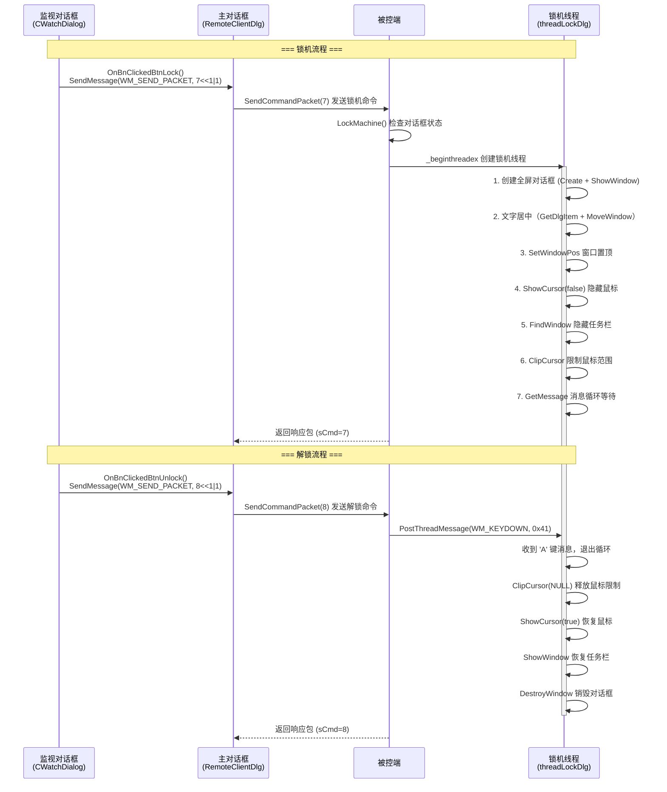

---
tags:
  - 项目/远控系统
git: "062571f, 35d05a7"
git_msg: "基本完成服务器的功能，实现了锁机 / 实现客户端的锁机和解锁控制"
---

# 3.1 锁机处理

> 本节实现远控系统的**锁机功能**：通过全屏对话框覆盖屏幕、隐藏鼠标、限制鼠标活动范围，达到锁定被控端的效果。

---

## 功能概述

锁机功能是远控系统的核心功能之一，用于远程锁定被控端计算机，防止本地用户操作。

| 功能 | 说明 |
|------|------|
| **锁机（被控端）** | 显示全屏对话框，隐藏鼠标和任务栏，限制鼠标活动 |
| **解锁（被控端）** | 恢复鼠标和任务栏，关闭锁机对话框 |
| **锁机/解锁（控制端）** | 监视对话框中的按钮，发送锁机/解锁命令 |
| **命令码** | 锁机: `sCmd=7`，解锁: `sCmd=8` |

---

## 设计背景

### 问题分析

锁机需要解决以下问题：

1. **界面遮挡**：全屏覆盖所有窗口，防止用户看到桌面
2. **输入限制**：禁止鼠标和键盘操作
3. **任务栏隐藏**：防止用户通过任务栏切换程序
4. **置顶保持**：锁机窗口必须始终在最顶层

### 设计目标

1. 创建全屏对话框覆盖整个屏幕
2. 将窗口设置为始终置顶
3. 隐藏鼠标光标
4. 限制鼠标活动范围到极小区域
5. 隐藏 Windows 任务栏
6. 支持远程解锁（通过发送按键消息）

---

## 架构设计

### 整体流程



### 组件关系

| 组件/类 | 职责 | 相关笔记 |
|--------|------|---------|
| CLockInfoDialog | 锁机对话框（MFC 对话框类） | 本笔记 |
| threadLockDlg | 锁机线程函数，执行锁机逻辑 | 本笔记 |
| LockMachine | 启动锁机线程 | 本笔记 |
| UnlockMachine | 发送消息解锁 | 本笔记 |
| CWatchDialog | 监视对话框，提供锁机/解锁按钮 | 本笔记 |
| RemoteClientDlg | 客户端主对话框，路由锁机/解锁命令 | 本笔记 |
| CServerSocket | 网络通信 | [[2.2 网络编程架构设计]] |
| CPacket | 数据包封装 | [[2.3 设计网络传输包协议]] |

---

## 核心实现

### CLockInfoDialog 对话框类

锁机对话框是一个简单的 MFC 对话框，不需要复杂的 UI 逻辑，只作为全屏遮挡使用。

**LockInfoDialog.h**

```cpp
#pragma once
#include "afxdialogex.h"

// CLockInfoDialog 对话框
class CLockInfoDialog : public CDialog
{
    DECLARE_DYNAMIC(CLockInfoDialog)

public:
    CLockInfoDialog(CWnd* pParent = nullptr);   // 标准构造函数
    virtual ~CLockInfoDialog();

// 对话框数据
#ifdef AFX_DESIGN_TIME
    enum { IDD = IDD_DIALOG_INFO };  // 对话框资源 ID
#endif

protected:
    virtual void DoDataExchange(CDataExchange* pDX);  // DDX/DDV 支持

    DECLARE_MESSAGE_MAP()
};
```

**关键点**：
- 继承自 `CDialog`，是标准的 MFC 模态/非模态对话框
- `IDD_DIALOG_INFO` 是在资源文件中定义的对话框模板 ID
- 对话框本身不需要特殊功能，锁机逻辑在线程函数中实现

**LockInfoDialog.cpp**

```cpp
#include "pch.h"
#include "RemoteCtrl.h"
#include "afxdialogex.h"
#include "LockInfoDialog.h"

IMPLEMENT_DYNAMIC(CLockInfoDialog, CDialog)

CLockInfoDialog::CLockInfoDialog(CWnd* pParent /*=nullptr*/)
    : CDialog(IDD_DIALOG_INFO, pParent)
{
    // 构造函数为空，对话框创建时由 MFC 框架处理
}

CLockInfoDialog::~CLockInfoDialog()
{
}

void CLockInfoDialog::DoDataExchange(CDataExchange* pDX)
{
    CDialog::DoDataExchange(pDX);
    // DDX 数据交换，用于控件与变量的绑定
    // 锁机对话框不需要数据交换
}

BEGIN_MESSAGE_MAP(CLockInfoDialog, CDialog)
    // 消息映射为空，不处理特殊消息
END_MESSAGE_MAP()
```

> 📁 完整实现见 `RemoteCtrl/LockInfoDialog.h` 和 `RemoteCtrl/LockInfoDialog.cpp`

---

### 全局变量定义

```cpp
CLockInfoDialog dlg;      // 全局对话框对象
unsigned threadid = 0;    // 锁机线程 ID，用于跨线程通信
```

**设计说明**：
- `dlg` 作为全局变量，生命周期贯穿整个程序
- `threadid` 保存线程 ID，解锁时需要用它向线程发送消息

---

### threadLockDlg 线程函数（核心）

这是锁机功能的**核心实现**，在独立线程中执行所有锁机操作。

```cpp
unsigned __stdcall threadLockDlg(void* arg)
{
    // ===== 调试输出：显示当前线程 ID =====
    TRACE("%s(%d):%d\r\n", __FUNCTION__, __LINE__, GetCurrentThreadId());

    // ===== 1. 创建并显示对话框 =====
    // Create: 创建非模态对话框
    // 参数1: 对话框资源 ID
    // 参数2: 父窗口，NULL 表示桌面
    dlg.Create(IDD_DIALOG_INFO, NULL);
    dlg.ShowWindow(SW_SHOW);

    // ===== 2. 设置全屏尺寸 =====
    CRect rect;
    rect.left = 0;
    rect.top = 0;
    // GetSystemMetrics: 获取系统度量值
    // SM_CXFULLSCREEN: 全屏窗口客户区宽度
    // SM_CYFULLSCREEN: 全屏窗口客户区高度（不含任务栏）
    rect.right = GetSystemMetrics(SM_CXFULLSCREEN);
    rect.bottom = GetSystemMetrics(SM_CYFULLSCREEN);
    // 乘以 1.05 确保覆盖任务栏区域
    rect.bottom *= 1.05;
    // MoveWindow: 移动窗口到指定位置和大小
    dlg.MoveWindow(rect);

    // ===== 2.5 文字居中显示 =====
    // 获取对话框上的静态文本控件，使其居中
    CWnd* pText = dlg.GetDlgItem(IDC_STATIC);
    if (pText)
    {
        CRect rtText;
        pText->GetWindowRect(rtText);
        int nWidth = rtText.Width();
        int x = (rect.right - nWidth) / 2;
        int nHeight = rtText.Height();
        int y = (rect.bottom - nHeight) / 2;
        pText->MoveWindow(x, y, rtText.Width(), rtText.Height());
    }

    // ===== 3. 窗口置顶 =====
    // SetWindowPos: 设置窗口位置、大小和 Z 序
    // wndTopMost: 窗口置于所有非置顶窗口之上，即使失去焦点也保持置顶
    // SWP_NOSIZE | SWP_NOMOVE: 不改变窗口大小和位置，只改变 Z 序
    dlg.SetWindowPos(&dlg.wndTopMost, 0, 0, 0, 0, SWP_NOSIZE | SWP_NOMOVE);

    // ===== 4. 隐藏鼠标光标 =====
    // ShowCursor(false): 隐藏鼠标光标
    // 注意: ShowCursor 使用引用计数，多次调用 false 需要同样次数的 true 才能恢复
    ShowCursor(false);

    // ===== 5. 隐藏任务栏 =====
    // FindWindow: 根据窗口类名查找窗口
    // "Shell_TrayWnd": Windows 任务栏的窗口类名
    // SW_HIDE: 隐藏窗口
    ::ShowWindow(::FindWindow(_T("Shell_TrayWnd"), NULL), SW_HIDE);

    // ===== 6. 限制鼠标活动范围 =====
    // ClipCursor: 将鼠标光标限制在指定矩形区域内
    // 设置为 1x1 像素的区域，实际上禁止了鼠标移动
    rect.left = 0;
    rect.top = 0;
    rect.right = 1;
    rect.bottom = 1;
    ClipCursor(rect);

    // ===== 7. 消息循环 =====
    // 自建消息循环，等待解锁信号
    MSG msg;
    while (GetMessage(&msg, NULL, 0, 0))
    {
        TranslateMessage(&msg);
        DispatchMessage(&msg);

        // 检测按键消息
        if (msg.message == WM_KEYDOWN)
        {
            TRACE("msg:%08X wParam:%08X lParam:%08X\r\n",
                  msg.message, msg.wParam, msg.lParam);
            // 0x41 是 'A' 键的虚拟键码
            // 收到 'A' 键按下消息时退出循环
            if (msg.wParam == 0x41)
                break;
        }
    }

    // ===== 8. 恢复系统状态 =====
    // 释放鼠标活动限制
    ClipCursor(NULL);
    // 恢复鼠标光标显示
    ShowCursor(true);
    // 恢复任务栏显示
    ::ShowWindow(::FindWindow(_T("Shell_TrayWnd"), NULL), SW_SHOW);
    // 销毁对话框
    dlg.DestroyWindow();

    // ===== 9. 结束线程 =====
    _endthreadex(0);
    return 0;
}
```

**关键点解析**：

1. **线程函数签名**
   - `unsigned __stdcall` 是 `_beginthreadex` 要求的调用约定
   - 返回值为 `unsigned`，参数为 `void*`

2. **全屏窗口尺寸**
   - `SM_CXFULLSCREEN` 获取不含任务栏的屏幕宽度
   - `SM_CYFULLSCREEN` 获取不含任务栏的屏幕高度
   - 乘以 1.05 是为了确保覆盖任务栏区域

3. **窗口置顶**
   - `wndTopMost` 使窗口永远在最上层
   - 即使其他程序试图获取焦点，锁机窗口也保持置顶

4. **鼠标限制**
   - `ClipCursor` 将鼠标限制在 1x1 像素区域
   - 用户无法移动鼠标到其他位置

5. **消息循环**
   - `GetMessage` 阻塞等待消息
   - 检测到 `WM_KEYDOWN` + `0x41`('A'键) 时退出
   - 解锁时通过 `PostThreadMessage` 发送此消息

---

### LockMachine 锁机函数

```cpp
int LockMachine()
{
    // ===== 检查对话框状态 =====
    // 如果对话框已经创建，不重复锁机
    // INVALID_HANDLE_VALUE: 无效句柄值
    if ((dlg.m_hWnd == NULL) || (dlg.m_hWnd == INVALID_HANDLE_VALUE))
    {
        // ===== 创建锁机线程 =====
        // _beginthreadex: 创建线程（比 _beginthread 更安全）
        // 参数1: 安全属性，NULL 使用默认
        // 参数2: 栈大小，0 使用默认
        // 参数3: 线程函数
        // 参数4: 传给线程函数的参数
        // 参数5: 创建标志，0 立即运行
        // 参数6: 输出线程 ID
        _beginthreadex(NULL, 0, threadLockDlg, NULL, 0, &threadid);
        TRACE("threadid=%d\r\n", threadid);
    }

    // ===== 发送响应包 =====
    // 通知控制端锁机命令已执行
    CPacket pack(7, NULL, 0);
    CServerSocket::getInstance()->Send(pack);
    return 0;
}
```

**关键点**：
- 使用 `_beginthreadex` 而非 `CreateThread`，更适合 C 运行时库
- 保存 `threadid` 用于后续解锁通信
- 响应包使用 [[2.3 设计网络传输包协议]] 中定义的 `CPacket` 类

---

### UnlockMachine 解锁函数

```cpp
int UnlockMachine()
{
    // ===== 向锁机线程发送按键消息 =====
    // PostThreadMessage: 向指定线程的消息队列投递消息
    // 参数1: 目标线程 ID
    // 参数2: 消息类型 WM_KEYDOWN
    // 参数3: wParam，虚拟键码 0x41 = 'A'
    // 参数4: lParam，键盘消息的附加信息，这里设为 0
    PostThreadMessage(threadid, WM_KEYDOWN, 0x41, 0);

    // ===== 发送响应包 =====
    // 注意：命令号必须是 8（解锁），不能写成 7（锁机）
    CPacket pack(8, NULL, 0);
    CServerSocket::getInstance()->Send(pack);
    return 0;
}
```

**关键点**：
- `PostThreadMessage` 是**异步**的，不等待消息处理完成
- 发送 `WM_KEYDOWN` + `0x41` 触发线程函数中的退出条件
- 线程退出时会自动恢复系统状态

---

## 客户端（控制端）实现

> `35d05a7` 新增：在监视对话框 `CWatchDialog` 中添加锁机/解锁按钮，通过主对话框路由命令。

### 监视对话框按钮

在 `CWatchDialog` 中添加两个按钮 `IDC_BTN_LOCK` 和 `IDC_BTN_UNLOCK`，点击后向主对话框发送消息：

**CWatchDialog.h** 新增声明：

```cpp
afx_msg void OnBnClickedBtnUnlock();
afx_msg void OnBnClickedBtnLock();
```

**CWatchDialog.cpp** 新增实现：

```cpp
// 消息映射中注册按钮事件
ON_BN_CLICKED(IDC_BTN_UNLOCK, &CWatchDialog::OnBnClickedBtnUnlock)
ON_BN_CLICKED(IDC_BTN_LOCK, &CWatchDialog::OnBnClickedBtnLock)

void CWatchDialog::OnBnClickedBtnLock()
{
    // 获取父窗口（主对话框），发送锁机命令
    // WM_SEND_PACKET 的 wParam 编码: 命令号 << 1 | bAutoClose
    CRemoteClientDlg* pParent = (CRemoteClientDlg*)GetParent();
    pParent->SendMessage(WM_SEND_PACKET, 7 << 1 | 1);
}

void CWatchDialog::OnBnClickedBtnUnlock()
{
    // 获取父窗口（主对话框），发送解锁命令
    CRemoteClientDlg* pParent = (CRemoteClientDlg*)GetParent();
    pParent->SendMessage(WM_SEND_PACKET, 8 << 1 | 1);
}
```

### 主对话框消息路由

在 `RemoteClientDlg::OnSendPacket` 中增加 case 7 和 case 8 的路由：

```cpp
LRESULT CRemoteClientDlg::OnSendPacket(WPARAM wParam, LPARAM lParam)
{
    int cmd = wParam >> 1;
    switch (cmd)
    {
        // ... 其他命令 ...
        case 7:   // 锁机
        case 8:   // 解锁
        {
            ret = SendCommandPacket(cmd, wParam & 1);
        }
        break;
    }
    return ret;
}
```

**关键点**：
- `wParam` 的编码方式：高位存命令号，最低位存 `bAutoClose` 标志
- 锁机/解锁命令不需要额外数据，只发送命令号即可
- `bAutoClose = 1`：发送完命令后自动关闭 socket 连接

---

## Win32 API 详解

### GetSystemMetrics - 获取系统度量

```cpp
int GetSystemMetrics(int nIndex);
```

| 参数 | 说明 |
|------|------|
| `SM_CXFULLSCREEN` | 全屏窗口客户区宽度 |
| `SM_CYFULLSCREEN` | 全屏窗口客户区高度（不含任务栏） |
| `SM_CXSCREEN` | 屏幕宽度（像素） |
| `SM_CYSCREEN` | 屏幕高度（像素） |

### SetWindowPos - 设置窗口位置和 Z 序

```cpp
BOOL SetWindowPos(
    const CWnd* pWndInsertAfter,  // Z 序位置
    int x, int y,                  // 位置
    int cx, int cy,                // 大小
    UINT nFlags                    // 选项标志
);
```

| pWndInsertAfter | 说明 |
|-----------------|------|
| `wndTopMost` | 置于所有非置顶窗口之上 |
| `wndNoTopMost` | 置于所有置顶窗口之下 |
| `wndTop` | 置于 Z 序顶部 |
| `wndBottom` | 置于 Z 序底部 |

| nFlags | 说明 |
|--------|------|
| `SWP_NOSIZE` | 忽略 cx, cy 参数 |
| `SWP_NOMOVE` | 忽略 x, y 参数 |
| `SWP_NOZORDER` | 忽略 pWndInsertAfter |

### ClipCursor - 限制鼠标范围

```cpp
BOOL ClipCursor(const RECT* lpRect);
```

- `lpRect`: 限制区域，NULL 表示取消限制
- 将鼠标光标限制在指定矩形内

### FindWindow - 查找窗口

```cpp
HWND FindWindow(
    LPCTSTR lpClassName,   // 窗口类名
    LPCTSTR lpWindowName   // 窗口标题
);
```

| 窗口类名 | 说明 |
|----------|------|
| `Shell_TrayWnd` | Windows 任务栏 |
| `Progman` | 桌面程序管理器 |
| `WorkerW` | 桌面壁纸窗口 |

### PostThreadMessage - 向线程发送消息

```cpp
BOOL PostThreadMessage(
    DWORD idThread,  // 目标线程 ID
    UINT Msg,        // 消息类型
    WPARAM wParam,   // 消息参数
    LPARAM lParam    // 消息参数
);
```

- 将消息投递到目标线程的消息队列
- **异步调用**，立即返回
- 目标线程必须有消息循环（调用过 `GetMessage`）

---

## 命令处理集成

在主程序的命令分发中，锁机和解锁分别对应 `sCmd=7` 和 `sCmd=8`：

```cpp
switch (nCmd)
{
    // ... 其他命令 ...

    case 7:  // 锁机
        LockMachine();
        break;
    case 8:  // 解锁
        UnlockMachine();
        break;
}
```

> 📎 命令分发框架详见 [[2.4 获取磁盘分区信息]]

---

## 易错点与调试

> [!warning] 常见错误

### 1. ShowCursor 的引用计数问题

```cpp
// ❌ 错误：多次调用可能导致计数不平衡
ShowCursor(false);
ShowCursor(false);  // 计数变为 -2
// ...
ShowCursor(true);   // 计数变为 -1，光标仍然隐藏！

// ✅ 正确：确保 false 和 true 调用次数匹配
ShowCursor(false);
// ...
ShowCursor(true);
```

### 2. FindWindow 类名拼写错误

```cpp
// ❌ 错误：类名拼写错误，找不到任务栏
::FindWindow(_T("Shell_TaryWnd"), NULL);  // Tary 应该是 Tray

// ✅ 正确
::FindWindow(_T("Shell_TrayWnd"), NULL);
```

> [!note] 代码中的拼写问题
> 当前代码中存在 `Shell_TaryWnd` 的拼写错误（应为 `Shell_TrayWnd`），这会导致隐藏任务栏功能失效。

### 3. UnlockMachine 响应包命令号错误

```cpp
// ❌ 错误：解锁函数发送了锁机的命令号
CPacket pack(7, NULL, 0);  // 7 是锁机命令！

// ✅ 正确：解锁应答应该是 8
CPacket pack(8, NULL, 0);  // 8 是解锁命令
```

> 此 Bug 在 `35d05a7` 中修复。控制端收到错误的命令号会误判命令执行结果。

### 4. 解锁时未释放 ClipCursor

```cpp
// ❌ 错误：解锁后鼠标仍然被限制在 1x1 区域
ShowCursor(true);
::ShowWindow(::FindWindow(_T("Shell_TrayWnd"), NULL), SW_SHOW);
dlg.DestroyWindow();

// ✅ 正确：解锁时需要先调用 ClipCursor(NULL) 释放限制
ClipCursor(NULL);  // 释放鼠标活动限制
ShowCursor(true);
::ShowWindow(::FindWindow(_T("Shell_TrayWnd"), NULL), SW_SHOW);
dlg.DestroyWindow();
```

### 5. 线程 ID 保存时机

```cpp
// ❌ 错误：在线程启动前使用 threadid
PostThreadMessage(threadid, ...);  // threadid 可能还是 0

// ✅ 正确：确保线程已启动且 threadid 已赋值
_beginthreadex(NULL, 0, threadLockDlg, NULL, 0, &threadid);
// threadid 在函数返回后已经有效
```

---

## 关联知识

- [[2.2 网络编程架构设计]] - CServerSocket 单例模式，网络通信基础
- [[2.3 设计网络传输包协议]] - CPacket 协议封装，响应包发送
- [[2.4 获取磁盘分区信息]] - 命令分发框架

---

## 代码索引

| 功能 | 文件 | 位置 |
|------|------|------|
| CLockInfoDialog 类定义 | LockInfoDialog.h | 类声明 |
| CLockInfoDialog 实现 | LockInfoDialog.cpp | 全文件 |
| threadLockDlg 线程函数 | RemoteCtrl.cpp | 行 318-361 |
| LockMachine 锁机函数 | RemoteCtrl.cpp | 行 363-375 |
| UnlockMachine 解锁函数 | RemoteCtrl.cpp | 行 377-385 |
| OnBnClickedBtnLock | CWatchDialog.cpp | 锁机按钮 |
| OnBnClickedBtnUnlock | CWatchDialog.cpp | 解锁按钮 |
| OnSendPacket (case 7/8) | RemoteClientDlg.cpp | 消息路由 |

---

## 更新记录

| 日期 | 变更 |
|------|------|
| 2025-01-13 | 初始版本：实现锁机/解锁功能 |
| 2026-03-13 | 合并 4.12 内容：客户端锁机/解锁控制、Bug 修复、文字居中 |
