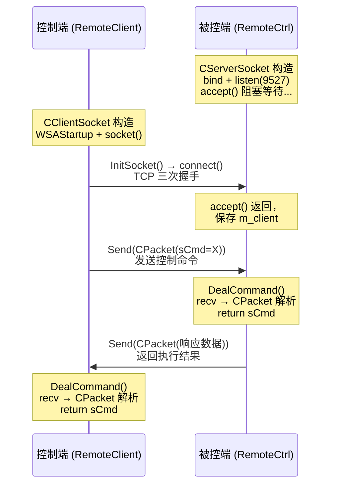

---
tags:
  - 项目/远控系统
git: "79ea2be"
git_msg: "添加了客户端的网络编程模块"
---

# 3.2 客户端网络编程模块

> 本节实现远控系统的**控制端网络模块**：`CClientSocket` 类负责与被控端建立连接、发送命令、接收响应。

---

## 功能概述

客户端网络模块是控制端的核心组件，负责主动连接被控端并发送控制命令。

| 功能 | 说明 |
|------|------|
| **建立连接** | 主动连接被控端的监听端口 |
| **发送命令** | 封装 CPacket 发送控制指令 |
| **接收响应** | 解析被控端返回的数据包 |
| **单例模式** | 全局唯一实例，统一管理网络连接 |

---

## 设计背景

### 问题分析

控制端需要解决以下问题：

1. **连接管理**：主动连接被控端，维护连接状态
2. **命令发送**：将控制指令封装为协议包发送
3. **响应接收**：处理被控端返回的数据（文件列表、截图等）
4. **资源管理**：Winsock 的初始化和清理

### 设计目标

1. 单例模式确保全局唯一的网络连接
2. 复用被控端的 `CPacket` 协议封装
3. 提供简洁的 API 供 UI 层调用
4. 自动管理 Winsock 生命周期

---

## 架构设计

### 整体流程



### 与服务端的对比

| 对比项 | CServerSocket (被控端) | CClientSocket (控制端) |
|--------|----------------------|----------------------|
| **角色** | 服务端，被动等待连接 | 客户端，主动发起连接 |
| **核心函数** | `bind` + `listen` + `accept` | `connect` |
| **端口** | 监听 9527 端口 | 连接目标 9527 端口 |
| **CPacket** | 相同协议封装 | 相同协议封装 |
| **单例模式** | 是 | 是 |

> 📎 服务端网络架构详见 [[2.2 网络编程架构设计]]

---

## 核心实现

### CPacket 协议类（复用）

控制端复用与被控端相同的 `CPacket` 类，确保双向通信使用统一协议。

> 📎 CPacket 完整设计详见 [[2.3 设计网络传输包协议]]

**协议格式回顾**：

```
┌──────────┬──────────┬──────────┬──────────┬──────────┐
│  sHead   │ nLength  │   sCmd   │ strData  │   sSum   │
│  2字节    │  4字节   │  2字节    │  可变长   │  2字节   │
│  0xFEFF  │ 数据长度  │  命令码   │  数据内容  │ 校验和   │
└──────────┴──────────┴──────────┴──────────┴──────────┘
```

---

### CClientSocket 单例类

**技术栈**：
- **单例模式**：懒汉式单例 + CHelper 自动释放
- **Winsock**：`WSAStartup`, `socket`, `connect`, `send`, `recv`
- **C++ 特性**：禁用拷贝构造和赋值运算符

**CClientSocket.h**

```cpp
#pragma once
#include "pch.h"
#include "framework.h"
#include <string>

// ===== 字节对齐：确保协议结构体紧凑排列 =====
#pragma pack(push)
#pragma pack(1)

// CPacket 类定义（同被控端，此处省略）
// ...

#pragma pack(pop)

// ===== 鼠标事件结构体 =====
typedef struct MouseEvent {
    MouseEvent()
    {
        nAction = 0;
        nButton = -1;
        ptXY.x = 0;
        ptXY.y = 0;
    }
    WORD nAction;   // 动作：移动、单击、双击
    WORD nButton;   // 按钮：左键、右键、中键
    POINT ptXY;     // 坐标
}MOUSEEV, * PMOUSEEV;

// ===== 错误信息获取函数 =====
// 这个函数的作用是把 WSA 错误码（一个整数）转换成人类可读的错误描述字符串。
std::string GetErrorInfo(int wsaErrCode)
{
    std::string ret;
    LPVOID lpMsgBuf = NULL;
    // FormatMessage: 将错误代码转换为可读文本
    FormatMessage(
        FORMAT_MESSAGE_FROM_SYSTEM | FORMAT_MESSAGE_ALLOCATE_BUFFER,
        NULL,
        wsaErrCode,
        MAKELANGID(LANG_NEUTRAL, SUBLANG_DEFAULT),
        (LPTSTR)&lpMsgBuf, 0, NULL
    );
    ret = (char*)lpMsgBuf;
    LocalFree(lpMsgBuf);
    return ret;
}

// ===== CClientSocket 单例类 =====
class CClientSocket
{
public:
    // ===== 获取单例实例 =====
    static CClientSocket* getInstance() {
        if (m_instance == NULL)
        {
            // 懒汉式：首次调用时创建实例
            m_instance = new CClientSocket();
        }
        return m_instance;
    }

    // ===== 初始化并连接服务器 =====
    bool InitSocket(const std::string& strIPAddress)
    {
        // 检查 socket 是否有效
        if (m_sock == -1)
            return false;

        // 设置服务器地址结构
        sockaddr_in serv_adr;
        memset(&serv_adr, 0, sizeof(serv_adr));
        serv_adr.sin_family = AF_INET;                           // IPv4
        serv_adr.sin_addr.s_addr = inet_addr(strIPAddress.c_str()); // IP 地址
        serv_adr.sin_port = htons(9527);                         // 端口号

        // 检查 IP 地址是否有效
        if (serv_adr.sin_addr.s_addr == INADDR_NONE)
        {
            AfxMessageBox("指定的IP地址不存在！");
            return false;
        }

        // ===== 发起连接 =====
        // connect: TCP 三次握手，建立连接
        int ret = connect(m_sock, (sockaddr*)&serv_adr, sizeof(serv_adr));
        if (ret == -1)
        {
            AfxMessageBox("连接失败");
            TRACE("连接失败：%d %s\r\n", WSAGetLastError(), GetErrorInfo(WSAGetLastError()).c_str());
        }
        return true;
    }

    // ===== 处理命令响应 =====
#define BUFFER_SIZE 4096
    int DealCommand()
    {
        if (m_sock == -1)
            return -1;

        // 动态分配接收缓冲区
        char* buffer = new char[BUFFER_SIZE];
        memset(buffer, 0, BUFFER_SIZE);
        size_t index = 0;

        while (true)
        {
            // recv: 接收数据
            size_t len = recv(m_sock, buffer + index, BUFFER_SIZE - index, 0);
            if (len <= 0)
                return -1;

            // 累加已接收数据长度
            index += len;
            len = index;

            // 解析数据包
            m_packet = CPacket((BYTE*)buffer, len);
            if (len > 0)
            {
                // 移除已处理的数据，保留未处理部分
                memmove(buffer, buffer + len, BUFFER_SIZE - len);
                index -= len;
                return m_packet.sCmd;  // 返回命令码
            }
        }
        return -1;
    }

    // ===== 发送原始数据 =====
    bool Send(const char* pData, size_t nSize)
    {
        if (m_sock == -1)
            return false;
        return send(m_sock, pData, nSize, 0) > 0;
    }

    // ===== 发送数据包 =====
    bool Send(CPacket& pack)
    {
        if (m_sock == -1)
            return false;
        return send(m_sock, pack.Data(), pack.Size(), 0) > 0;
    }

    // ===== 获取文件路径（从响应包） =====
    bool GetFilePath(std::string& strPath)
    {
        // 命令码 2-4 对应文件相关操作
        if ((m_packet.sCmd >= 2) && (m_packet.sCmd <= 4))
        {
            strPath = m_packet.strData;
            return true;
        }
        return false;
    }

    // ===== 获取鼠标事件 =====
    bool GetMouseEvent(MOUSEEV& mouse)
    {
        if (m_packet.sCmd == 5)
        {
            memcpy(&mouse, m_packet.strData.c_str(), sizeof(MOUSEEV));
            return true;
        }
        return false;
    }

private:
    SOCKET m_sock;       // 套接字句柄
    CPacket m_packet;    // 当前数据包

    // ===== 禁用拷贝 =====
    CClientSocket& operator=(const CClientSocket& ss) {}
    CClientSocket(const CClientSocket& ss)
    {
        m_sock = ss.m_sock;
    }

    // ===== 私有构造函数 =====
    CClientSocket() {
        // 初始化 Winsock 环境
        if (InitSockEnv() == FALSE)
        {
            MessageBox(NULL, _T("无法初始化套接字环境,请检查网络设置！"),
                       _T("初始化错误"), MB_OK | MB_ICONERROR);
            exit(0);
        }
        // 创建 TCP 套接字
        m_sock = socket(PF_INET, SOCK_STREAM, 0);
    }

    // ===== 私有析构函数 =====
    ~CClientSocket()
    {
        closesocket(m_sock);
        WSACleanup();
    }

    // ===== 初始化 Winsock 环境 =====
    BOOL InitSockEnv()
    {
        WSADATA data;
        // 请求使用 Winsock 1.1 版本
        if (WSAStartup(MAKEWORD(1, 1), &data) != 0)
        {
            return FALSE;
        }
        return TRUE;
    }

    // ===== 释放单例实例 =====
    static void releaseInstance()
    {
        if (m_instance != NULL)
        {
            CClientSocket* tmp = m_instance;
            m_instance = NULL;
            delete tmp;
        }
    }

    // ===== 静态成员 =====
    static CClientSocket* m_instance;

    // ===== CHelper 内部类：自动释放单例 =====
    class CHelper
    {
    public:
        CHelper()
        {
            // 程序启动时创建单例
            CClientSocket::getInstance();
        }
        ~CHelper()
        {
            // 程序退出时释放单例
            CClientSocket::releaseInstance();
        }
    };
    static CHelper m_helper;
};

// 声明外部变量，方便其他文件使用
extern CClientSocket server;
```

**CClientSocket.cpp**

```cpp
#include "pch.h"
#include "CClientSocket.h"

// 静态成员初始化
CClientSocket* CClientSocket::m_instance = NULL;
CClientSocket::CHelper CClientSocket::m_helper;

// 全局指针，程序启动时自动创建单例
CClientSocket* pclient = CClientSocket::getInstance();
```

---

### 关键函数详解

#### InitSocket - 连接服务器

```cpp
bool InitSocket(const std::string& strIPAddress)
{
    // 1. 填充服务器地址结构
    sockaddr_in serv_adr;
    serv_adr.sin_family = AF_INET;                              // IPv4 协议族
    serv_adr.sin_addr.s_addr = inet_addr(strIPAddress.c_str()); // 转换 IP 字符串
    serv_adr.sin_port = htons(9527);                            // 主机序转网络序

    // 2. 发起连接
    int ret = connect(m_sock, (sockaddr*)&serv_adr, sizeof(serv_adr));
}
```

**关键点**：
- `inet_addr`：将点分十进制 IP 字符串转换为 32 位网络字节序整数
- `htons`：Host TO Network Short，16 位端口号转网络字节序
- `connect`：发起 TCP 三次握手，成功返回 0，失败返回 -1

#### DealCommand - 接收并解析响应

```cpp
int DealCommand()
{
    while (true)
    {
        // 1. 接收数据到缓冲区末尾
        size_t len = recv(m_sock, buffer + index, BUFFER_SIZE - index, 0);

        // 2. 尝试解析数据包
        m_packet = CPacket((BYTE*)buffer, len);

        // 3. 如果解析成功，移除已处理数据
        if (len > 0)
        {
            memmove(buffer, buffer + len, BUFFER_SIZE - len);
            index -= len;
            return m_packet.sCmd;
        }
    }
}
```

**设计思路**：
- **循环接收**：TCP 是流协议，一次 recv 可能收到不完整的包
- **累积解析**：不断累积数据直到可以解析出完整的 CPacket
- **移除已处理**：用 memmove 移除已解析的数据，保留未处理部分

> 📎 粘包处理机制详见 [[2.3 设计网络传输包协议]]

---

## Win32 API 详解

### connect - 建立连接

```cpp
int connect(
    SOCKET s,                    // 套接字
    const struct sockaddr* name, // 服务器地址
    int namelen                  // 地址结构长度
);
```

| 返回值 | 说明 |
|--------|------|
| 0 | 连接成功 |
| SOCKET_ERROR (-1) | 连接失败，调用 WSAGetLastError() 获取错误码 |

| 常见错误码 | 说明 |
|-----------|------|
| WSAECONNREFUSED | 连接被拒绝（服务器未监听） |
| WSAETIMEDOUT | 连接超时 |
| WSAENETUNREACH | 网络不可达 |

### inet_addr - IP 地址转换

```cpp
unsigned long inet_addr(const char* cp);
```

- 将点分十进制字符串（如 "192.168.1.1"）转换为 32 位网络字节序整数
- 失败返回 `INADDR_NONE` (0xFFFFFFFF)

### FormatMessage - 获取错误描述

```cpp
DWORD FormatMessage(
    DWORD dwFlags,       // 格式化选项
    LPCVOID lpSource,    // 消息来源
    DWORD dwMessageId,   // 消息 ID（错误码）
    DWORD dwLanguageId,  // 语言 ID
    LPTSTR lpBuffer,     // 输出缓冲区
    DWORD nSize,         // 缓冲区大小
    va_list* Arguments   // 参数列表
);
```

| 标志 | 说明 |
|------|------|
| `FORMAT_MESSAGE_FROM_SYSTEM` | 从系统消息表获取 |
| `FORMAT_MESSAGE_ALLOCATE_BUFFER` | 自动分配缓冲区 |

---

## 单例模式详解

### 为什么使用单例

1. **资源唯一性**：整个控制端只需要一个网络连接
2. **状态共享**：UI 的各个部分都需要访问同一个连接
3. **生命周期管理**：统一管理 Winsock 的初始化和清理

### CHelper 自动释放机制

```cpp
class CHelper
{
public:
    CHelper()
    {
        CClientSocket::getInstance();  // 构造时创建单例
    }
    ~CHelper()
    {
        CClientSocket::releaseInstance();  // 析构时释放单例
    }
};
static CHelper m_helper;  // 静态成员
```

**原理**：
- `m_helper` 是静态成员，程序启动时构造，退出时析构
- 构造函数调用 `getInstance()` 确保单例被创建
- 析构函数调用 `releaseInstance()` 确保单例被释放
- 利用 C++ 的 RAII 机制，无需手动管理

> 📎 这与被控端 [[2.2 网络编程架构设计]] 中的 CHelper 设计完全一致

---

## 其他修改

### 修复任务栏类名拼写错误

本次提交同时修复了被控端锁机功能中的一个拼写错误：

```cpp
// ❌ 修复前（错误）
::ShowWindow(::FindWindow(_T("Shell_TaryWnd"), NULL), SW_HIDE);
::ShowWindow(::FindWindow(_T("Shell_TaryWnd"), NULL), SW_SHOW);

// ✅ 修复后（正确）
::ShowWindow(::FindWindow(_T("Shell_TrayWnd"), NULL), SW_HIDE);
::ShowWindow(::FindWindow(_T("Shell_TrayWnd"), NULL), SW_SHOW);
```

> 📁 `RemoteCtrl/RemoteCtrl.cpp` : threadLockDlg (行 335, 356)

---

## 易错点与调试

> [!warning] 常见错误

### 1. 连接前未检查 socket 有效性

```cpp
// ❌ 错误：直接连接
connect(m_sock, ...);

// ✅ 正确：先检查 socket
if (m_sock == -1)
    return false;
connect(m_sock, ...);
```

### 2. 内存泄漏

```cpp
// ❌ 错误：动态分配后未释放
char* buffer = new char[BUFFER_SIZE];
// ... 使用后未 delete

// ✅ 正确：使用后释放，或使用智能指针
std::unique_ptr<char[]> buffer(new char[BUFFER_SIZE]);
```

### 3. 字节序问题

```cpp
// ❌ 错误：直接使用主机字节序
serv_adr.sin_port = 9527;

// ✅ 正确：转换为网络字节序
serv_adr.sin_port = htons(9527);
```

---

## 关联知识

- [[2.2 网络编程架构设计]] - 服务端 CServerSocket 单例设计
- [[2.3 设计网络传输包协议]] - CPacket 协议封装
- [[3.1 锁机处理]] - 被控端锁机功能

---

## 代码索引

| 功能 | 文件 | 位置 |
|------|------|------|
| CClientSocket 类定义 | CClientSocket.h | 全文件 |
| 静态成员初始化 | CClientSocket.cpp | 行 1-7 |
| 任务栏类名修复 | RemoteCtrl.cpp | 行 335, 356 |

> 📁 客户端路径: `RemoteCtrl/RemoteClient/CClientSocket.h`

---

## 更新记录

| 日期 | 变更 |
|------|------|
| 2025-01-14 | 初始版本：添加客户端网络编程模块 |
