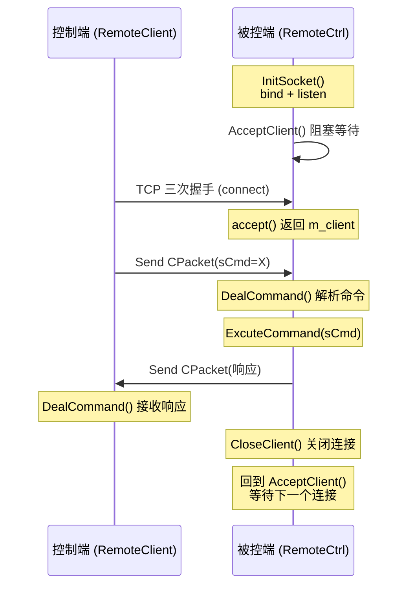

---
tags:
  - 项目/远控系统
git: "e805494"
git_msg: "完成网络模块对接，修正内存泄漏Bug和客户端连接Bug"
---

> 本节完成**客户端与被控端的网络对接**，并修复两个关键 Bug：被控端内存泄漏、客户端连接失败后无法重连。

---

## 功能概述

本次更新实现了客户端与被控端的完整通信流程，并修复了调试过程中发现的问题。

| 功能 | 说明 |
|------|------|
| **网络对接** | 启用被控端事件循环，完成 C/S 通信 |
| **内存泄漏修复** | 修复 DealCommand 中 buffer 未释放的问题 |
| **重连Bug修复** | 修复客户端连接失败后无法重新连接的问题 |
| **测试命令** | 新增 `sCmd=1981` 测试连接命令 |

---

## 问题背景

### 问题1：被控端内存泄漏

在 [[3.2 客户端网络编程模块]] 中，`DealCommand` 函数使用 `new` 分配接收缓冲区，但**存在多个 return 路径未释放内存**：

```
调用 DealCommand
    │
    ├── new char[BUFFER_SIZE]  ←─── 分配内存
    │
    ├── recv 失败 → return -1  ←─── 🔴 内存泄漏！
    │
    ├── 解析成功 → return sCmd ←─── 🔴 内存泄漏！
    │
    └── 循环结束 → return -1   ←─── 🔴 内存泄漏！
```

**日志表现**：连续多次命令后，内存占用持续增长。

### 问题2：客户端无法重连

客户端 `CClientSocket` 的 socket 在构造函数中创建，当**连接失败后再次调用 `InitSocket`** 时：

```
构造函数
    │
    └── m_sock = socket(...)  ←─── socket 已创建

第一次 InitSocket
    │
    └── connect(m_sock, ...) → 失败

第二次 InitSocket
    │
    └── connect(m_sock, ...) ←─── 🔴 使用同一个已失败的 socket！
```

**原因**：connect 失败后，socket 处于错误状态，必须重新创建才能再次连接。

---

## 架构设计

### 完整通信流程

本次对接后的完整通信流程：



### 被控端主循环结构

```
main()
  │
  └── while (true)  ←─── 外层循环：重新初始化
        │
        ├── InitSocket()  ←─── 初始化 socket
        │
        └── while (true)  ←─── 内层循环：处理连接
              │
              ├── AcceptClient()    ←─── 等待客户端
              │
              ├── DealCommand()     ←─── 接收命令
              │
              ├── ExcuteCommand()   ←─── 执行命令
              │
              └── CloseClient()     ←─── 关闭连接
```

---

## 核心实现

### 1. 被控端主循环（RemoteCtrl.cpp）

**技术栈**：
- **双层循环架构**：外层负责初始化，内层负责处理请求
- **短连接模式**：每次命令处理完后关闭连接

```cpp
// ===== 被控端主循环 =====
CServerSocket* pserver = CServerSocket::getInstance();
int count = 0;

// 外层循环：程序主循环
while (CServerSocket::getInstance() != NULL)
{
    // ===== 初始化网络 =====
    if (pserver->InitSocket() == false)
    {
        MessageBox(NULL, _T("网络初始化异常，未能成功初始化，请检查网络状态！"),
                   _T("网络初始化失败"), MB_OK | MB_ICONERROR);
        exit(0);
    }

    // 内层循环：处理客户端请求
    while (CServerSocket::getInstance() != NULL)
    {
        // ===== 1. 等待客户端连接 =====
        if (pserver->AcceptClient() == false)
        {
            if (count >= 3)
            {
                MessageBox(NULL, _T("多次无法正常接入用户，结束程序！"),
                           _T("接入用户失败"), MB_OK | MB_ICONERROR);
                exit(0);
            }
            MessageBox(NULL, _T("无法正常接入用户，自动重试"),
                       _T("接入用户失败"), MB_OK | MB_ICONERROR);
            count++;
        }
        TRACE("AcceptClient return true\r\n");

        // ===== 2. 接收并解析命令 =====
        int ret = pserver->DealCommand();
        TRACE("DealCommand ret %d\r\n", ret);

        // ===== 3. 执行命令 =====
        if (ret > 0)
        {
            ret = ExcuteCommand(pserver->GetPacket().sCmd);
            if (ret != 0)
            {
                TRACE("执行命令失败：%d ret=%d\r\n", pserver->GetPacket().sCmd, ret);
            }

            // ===== 4. 关闭客户端连接 =====
            pserver->CloseClient();
            TRACE("Command has done!\r\n");
        }
    }
}
```

**关键点**：

1. **双层 while 循环**
   - 外层循环：程序生命周期，负责初始化
   - 内层循环：请求处理循环，每次处理一个客户端

2. **短连接模式**
   - 每个命令处理完成后调用 `CloseClient()` 关闭连接
   - 客户端下次请求需要重新建立连接

3. **错误重试机制**
   - `AcceptClient` 失败最多重试 3 次
   - 超过重试次数则退出程序

> 📁 `RemoteCtrl/RemoteCtrl.cpp` : main (行 456-496)

---

### 2. ExcuteCommand 命令分发（新增）

将原来 switch-case 代码块提取为独立函数，提高代码可维护性：

```cpp
int ExcuteCommand(int nCmd)
{
    int ret = 0;
    switch (nCmd)
    {
    case 1:     // 查看磁盘分区
        ret = MakeDriverInfo();
        break;
    case 2:     // 查看目录内容
        ret = MakeDirectoryInfo();
        break;
    case 3:     // 打开文件
        ret = RunFile();
        break;
    case 4:     // 下载文件
        ret = DownloadFile();
        break;
    case 5:     // 鼠标操作
        ret = MouseEvent();
        break;
    case 6:     // 屏幕截图
        ret = SendScreen();
        break;
    case 7:     // 锁机
        ret = LockMachine();
        break;
    case 8:     // 解锁
        ret = UnlockMachine();
        break;
    case 1981:  // 测试连接（新增）
        ret = TestConnect();
        break;
    }
    return ret;
}
```

**设计思路**：
- 将命令分发逻辑独立出来，main 函数更简洁
- 统一返回值处理，便于日志记录和错误追踪
- 新增 `1981` 测试命令用于调试网络连接

> 📁 `RemoteCtrl/RemoteCtrl.cpp` : ExcuteCommand (行 396-443)

---

### 3. TestConnect 测试命令（新增）

用于验证网络连接是否正常：

```cpp
int TestConnect()
{
    // 发送响应包，命令码 1981 表示测试成功
    CPacket pack(1981, NULL, 0);
    bool ret = CServerSocket::getInstance()->Send(pack);
    TRACE("Send ret = %d\r\n", ret);

    return 0;
}
```

**用途**：
- 控制端发送 `sCmd=1981`，被控端原样返回
- 通过响应确认双向通信正常
- 调试时快速验证网络连通性

> 📁 `RemoteCtrl/RemoteCtrl.cpp` : TestConnect (行 386-393)

---

### 4. 内存泄漏修复（ServerSocket.h）

**问题代码**（修复前）：

```cpp
int DealCommand()
{
    if (m_client == -1)
        return -1;

    char* buffer = new char[BUFFER_SIZE];  // 分配内存
    memset(buffer, 0, BUFFER_SIZE);
    size_t index = 0;

    while (true)
    {
        size_t len = recv(m_client, buffer + index, BUFFER_SIZE - index, 0);
        if (len <= 0)
            return -1;   // ❌ 内存泄漏！未释放 buffer

        index += len;
        len = index;
        m_packet = CPacket((BYTE*)buffer, len);
        if (len > 0)
        {
            memmove(buffer, buffer + len, BUFFER_SIZE - len);
            index -= len;
            return m_packet.sCmd;  // ❌ 内存泄漏！未释放 buffer
        }
    }
    return -1;  // ❌ 内存泄漏！未释放 buffer
}
```

**修复后代码**：

```cpp
int DealCommand()
{
    if (m_client == -1)
        return -1;

    char* buffer = new char[BUFFER_SIZE];
    // ===== 新增：检查内存分配 =====
    if (buffer == NULL)
    {
        TRACE("内存不足！\r\n");
        return -2;
    }
    memset(buffer, 0, BUFFER_SIZE);
    size_t index = 0;

    while (true)
    {
        size_t len = recv(m_client, buffer + index, BUFFER_SIZE - index, 0);
        if (len <= 0)
        {
            delete[] buffer;  // ✅ 释放内存
            return -1;
        }
        TRACE("recv %d\r\n", len);

        index += len;
        len = index;
        m_packet = CPacket((BYTE*)buffer, len);
        if (len > 0)
        {
            memmove(buffer, buffer + len, BUFFER_SIZE - len);
            index -= len;
            delete[] buffer;  // ✅ 释放内存
            return m_packet.sCmd;
        }
    }
    delete[] buffer;  // ✅ 释放内存
    return -1;
}
```

**修复要点**：

| 修改点 | 说明 |
|--------|------|
| 添加 NULL 检查 | 防止内存分配失败导致崩溃 |
| recv 失败时释放 | `return -1` 前添加 `delete[] buffer` |
| 解析成功时释放 | `return sCmd` 前添加 `delete[] buffer` |
| 循环结束时释放 | 函数末尾添加 `delete[] buffer` |

> 📁 `RemoteCtrl/ServerSocket.h` : DealCommand (行 198-230)

---

### 5. CloseClient 方法（新增）

关闭当前客户端连接，使被控端可以接受下一个连接：

```cpp
void CloseClient()
{
    closesocket(m_client);
    m_client = INVALID_SOCKET;
}
```

**设计说明**：
- `closesocket` 关闭套接字，释放系统资源
- `m_client = INVALID_SOCKET` 标记为无效，防止误用

> 📁 `RemoteCtrl/ServerSocket.h` : CloseClient (行 273-277)

---

### 6. GetPacket 方法（新增）

获取当前解析的数据包，供 `ExcuteCommand` 使用：

```cpp
CPacket& GetPacket()
{
    return m_packet;
}
```

> 📁 `RemoteCtrl/ServerSocket.h` : GetPacket (行 267-270)

---

### 7. 客户端重连Bug修复（CClientSocket.h）

**问题代码**（修复前）：

```cpp
// 构造函数中创建 socket
CClientSocket() {
    if (InitSockEnv() == FALSE) { ... }
    m_sock = socket(PF_INET, SOCK_STREAM, 0);  // 创建 socket
}

// InitSocket 直接使用已有 socket
bool InitSocket(const std::string& strIPAddress)
{
    if (m_sock == -1)
        return false;
    // ... 直接 connect，不重建 socket
    int ret = connect(m_sock, ...);
    // connect 失败后，m_sock 仍是原来的值，但已不可用
}
```

**修复后代码**：

```cpp
bool InitSocket(const std::string& strIPAddress)
{
    // ===== 新增：重建 socket =====
    if (m_sock != INVALID_SOCKET)
        CloseSocket();                         // 关闭旧 socket
    m_sock = socket(PF_INET, SOCK_STREAM, 0);  // 创建新 socket

    if (m_sock == -1)
        return false;

    sockaddr_in serv_adr;
    memset(&serv_adr, 0, sizeof(serv_adr));
    serv_adr.sin_family = AF_INET;
    serv_adr.sin_addr.s_addr = inet_addr(strIPAddress.c_str());
    serv_adr.sin_port = htons(9527);

    if (serv_adr.sin_addr.s_addr == INADDR_NONE)
    {
        AfxMessageBox("指定的IP地址不存在！");
        return false;
    }

    int ret = connect(m_sock, (sockaddr*)&serv_adr, sizeof(serv_adr));
    if (ret == -1)
    {
        AfxMessageBox("连接失败");
        TRACE("连接失败：%d %s\r\n", WSAGetLastError(), GetErrInfo(WSAGetLastError()).c_str());
        return false;  // ✅ 新增：连接失败返回 false
    }
    return true;
}

// ===== 新增：关闭 socket =====
void CloseSocket()
{
    closesocket(m_sock);
    m_sock = INVALID_SOCKET;
}
```

**修复要点**：

| 修改点 | 说明 |
|--------|------|
| 先关闭旧 socket | `CloseSocket()` 释放旧连接 |
| 重新创建 socket | `socket()` 创建新的套接字 |
| 连接失败返回 false | 原代码缺少 `return false` |

> 📁 `RemoteClient/CClientSocket.h` : InitSocket (行 166-193)

---

### 8. 客户端 buffer 改用 vector（避免内存泄漏）

**修复前**：

```cpp
int DealCommand()
{
    char* buffer = new char[BUFFER_SIZE];  // 动态分配，可能泄漏
    // ...
}
```

**修复后**：

```cpp
class CClientSocket
{
private:
    std::vector<char> m_buffer;  // 成员变量，自动管理

    CClientSocket() {
        // ...
        m_buffer.resize(BUFFER_SIZE);  // 构造时分配
    }

    int DealCommand()
    {
        char* buffer = m_buffer.data();  // 使用成员 buffer
        memset(buffer, 0, BUFFER_SIZE);
        // ...
    }
};
```

**优势**：
- `std::vector` 析构时自动释放内存
- 避免每次调用 `DealCommand` 都分配/释放
- 无需手动 `delete[]`，不会泄漏

> 📎 这是 Modern C++ 的 RAII 思想，详见 [[Effective Modern C++.pdf]]

---

### 9. GetErrInfo 移至 cpp 文件

**问题**：头文件中定义函数会导致多重定义错误

```cpp
// ❌ 头文件中定义（CClientSocket.h）
std::string GetErrorInfo(int wsaErrCode)
{
    // ... 函数体
}

// 当多个 .cpp 包含此头文件时，链接器报错：
// error LNK2005: GetErrorInfo 已经在 xxx.obj 中定义
```

**修复**：

```cpp
// ✅ 头文件中声明（CClientSocket.h）
std::string GetErrInfo(int wsaErrCode);

// ✅ cpp 文件中定义（CClientSocket.cpp）
std::string GetErrInfo(int wsaErrCode)
{
    std::string ret;
    LPVOID lpMsgBuf = NULL;
    FormatMessage(
        FORMAT_MESSAGE_FROM_SYSTEM | FORMAT_MESSAGE_ALLOCATE_BUFFER,
        NULL,
        wsaErrCode,
        MAKELANGID(LANG_NEUTRAL, SUBLANG_DEFAULT),
        (LPTSTR)&lpMsgBuf, 0, NULL
    );
    ret = (char*)lpMsgBuf;
    LocalFree(lpMsgBuf);
    return ret;
}
```

**说明**：
- 函数名从 `GetErrorInfo` 改为 `GetErrInfo`（避免与系统函数冲突）
- 声明放头文件，定义放 cpp 文件

> 📁 `RemoteClient/CClientSocket.cpp` (行 7-20)

---

## 调试日志分析

对接完成后的正常通信日志：

```
ServerSocket.h(188) : enter AcceptClient       ← 等待客户端
ServerSocket.h(192) : m_client=660             ← 接受连接，句柄 660
RemoteCtrl.cpp(480) : AcceptClient return true ← 连接成功
ServerSocket.h(220) : recv 10                  ← 收到 10 字节
RemoteCtrl.cpp(482) : DealCommand ret 1981     ← 解析出命令 1981
RemoteCtrl.cpp(391) : Send ret = 1             ← 发送响应成功
RemoteCtrl.cpp(491) : Command has done!        ← 命令处理完成
ServerSocket.h(188) : enter AcceptClient       ← 等待下一个连接
```

**日志解读**：
1. `m_client=660`：accept 返回的客户端 socket 句柄
2. `recv 10`：收到 10 字节（CPacket 头部大小）
3. `ret 1981`：解析出测试命令
4. `Send ret = 1`：响应发送成功
5. 循环继续等待下一个连接

---

## 易错点与调试

> [!warning] 常见错误

### 1. 忘记释放动态内存

```cpp
// ❌ 错误：多个 return 路径，容易遗漏
char* buffer = new char[SIZE];
if (error1) return -1;  // 泄漏
if (error2) return -2;  // 泄漏
delete[] buffer;
return 0;

// ✅ 正确：使用 RAII 或确保所有路径都释放
std::vector<char> buffer(SIZE);  // 自动管理
// 或
std::unique_ptr<char[]> buffer(new char[SIZE]);
```

### 2. connect 失败后重用 socket

```cpp
// ❌ 错误：connect 失败后 socket 不可重用
connect(m_sock, &addr, sizeof(addr));  // 失败
connect(m_sock, &addr, sizeof(addr));  // 仍然失败！

// ✅ 正确：重建 socket
closesocket(m_sock);
m_sock = socket(PF_INET, SOCK_STREAM, 0);
connect(m_sock, &addr, sizeof(addr));  // 可以成功
```

### 3. 头文件中定义函数

```cpp
// ❌ 错误：头文件中定义非 inline 函数
// MyHeader.h
void myFunc() { ... }  // 多重定义

// ✅ 正确方案1：声明与定义分离
// MyHeader.h
void myFunc();
// MyHeader.cpp
void myFunc() { ... }

// ✅ 正确方案2：使用 inline
// MyHeader.h
inline void myFunc() { ... }
```

---

## 关联知识

- [[2.2 网络编程架构设计]] - CServerSocket 单例设计
- [[2.3 设计网络传输包协议]] - CPacket 协议封装
- [[3.1 锁机处理]] - 被控端锁机功能
- [[3.2 客户端网络编程模块]] - 客户端 CClientSocket 设计

---

## 代码索引

| 功能 | 文件 | 位置 |
|------|------|------|
| 被控端主循环 | RemoteCtrl.cpp | 行 456-496 |
| ExcuteCommand | RemoteCtrl.cpp | 行 396-443 |
| TestConnect | RemoteCtrl.cpp | 行 386-393 |
| DealCommand 内存泄漏修复 | ServerSocket.h | 行 198-230 |
| CloseClient | ServerSocket.h | 行 273-277 |
| GetPacket | ServerSocket.h | 行 267-270 |
| InitSocket 重连修复 | CClientSocket.h | 行 166-193 |
| CloseSocket | CClientSocket.h | 行 268-272 |
| GetErrInfo | CClientSocket.cpp | 行 7-20 |

---

## 更新记录

| 日期 | 变更 |
|------|------|
| 2026-01-16 | 初始版本：网络对接完成、内存泄漏修复、重连Bug修复 |
