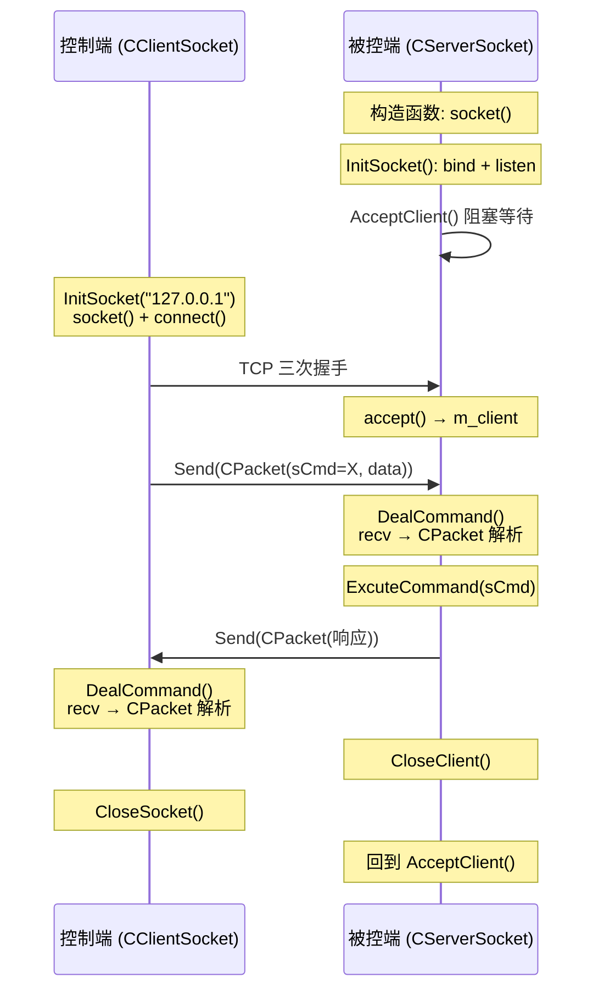

---
tags:
  - 项目/远控系统
git: "e805494"
git_msg: "完成网络模块对接，修正内存泄漏Bug和客户端连接Bug"
---

# 客户端与服务端的网络总结

> 本篇总结截至 `e805494` 时，**被控端（CServerSocket）** 与 **控制端（CClientSocket）** 两端网络模块的设计对比、通信流程与实现差异。

---

## 设计背景

经过 [[2.1 网络编程基本设计]] → [[2.2 网络编程架构设计]] → [[2.3 设计网络传输包协议]] → [[3.2 客户端网络编程模块]] 四个阶段的开发，在 [[3.3  网络模块对接与Bug修复]] 中完成了首次端到端通信。两端网络模块已经形成了**镜像对称**的架构关系，本篇对这种对称性进行梳理和对比。

---

## 架构对比

### 类结构对称

两端的网络模块在架构上高度对称，均采用**单例模式 + CHelper 自动释放**的设计：

| 特性 | CServerSocket（被控端） | CClientSocket（控制端） |
|------|----------------------|----------------------|
| **设计模式** | 单例（`getInstance`） | 单例（`getInstance`） |
| **自动释放** | `CHelper` 析构释放 | `CHelper` 析构释放 |
| **Winsock 初始化** | `WSAStartup(1,1)` | `WSAStartup(1,1)` |
| **socket 创建时机** | 构造函数中创建 | `InitSocket` 时创建 |
| **端口号** | `htons(9527)` | `htons(9527)` |
| **协议** | TCP（`SOCK_STREAM`） | TCP（`SOCK_STREAM`） |

> 📎 单例模式设计详见 [[2.2 网络编程架构设计]]，CPacket 协议格式详见 [[2.3 设计网络传输包协议]]

### 核心方法对比

| 功能 | CServerSocket | CClientSocket |
|------|---------------|---------------|
| **初始化** | `InitSocket()` → bind + listen | `InitSocket(ip)` → connect |
| **建立连接** | `AcceptClient()` 被动等待 | `connect` 主动连接 |
| **接收数据** | `DealCommand()` 从 `m_client` 接收 | `DealCommand()` 从 `m_sock` 接收 |
| **发送数据** | `Send()` 向 `m_client` 发送 | `Send()` 向 `m_sock` 发送 |
| **关闭连接** | `CloseClient()` 关闭客户端句柄 | `CloseSocket()` 关闭自身 socket |
| **获取数据包** | `GetPacket()` | `GetPacket()` |
| **获取文件路径** | `GetFilePath()` | `GetFilePath()` |
| **获取鼠标事件** | `GetMouseEvent()` | `GetMouseEvent()` |

---

## 通信流程

### 完整交互时序



### 调用链对比

**被控端（服务端循环）**：

```
main()
  └── while (true)              ←── 外层：初始化
        ├── InitSocket()        ←── bind + listen
        └── while (true)        ←── 内层：请求处理
              ├── AcceptClient()     ←── accept 阻塞
              ├── DealCommand()      ←── recv + CPacket 解析
              ├── ExcuteCommand()    ←── switch(sCmd) 命令分发
              └── CloseClient()     ←── closesocket(m_client)
```

**控制端（按钮事件）**：

```
OnBnClickedBtnTest()
  ├── InitSocket("127.0.0.1")  ←── socket() + connect
  ├── Send(CPacket(1981))      ←── 发送命令
  ├── DealCommand()            ←── recv 等待响应
  └── CloseSocket()            ←── closesocket(m_sock)
```

---

## 关键差异详解

### 1. Socket 管理策略

两端对 socket 的管理方式不同，这是 C/S 架构中的核心区别：

**被控端**：管理两个 socket

```cpp
class CServerSocket {
    SOCKET m_sock;    // 监听 socket（生命周期 = 程序生命周期）
    SOCKET m_client;  // 客户端 socket（生命周期 = 单次连接）
};
```

- `m_sock`：在构造函数中创建，程序退出时关闭
- `m_client`：每次 `accept` 获得，处理完命令后 `CloseClient()` 关闭

**控制端**：管理一个 socket

```cpp
class CClientSocket {
    SOCKET m_sock;    // 连接 socket（每次命令重建）
};
```

- `m_sock`：每次 `InitSocket` 时重建（先关旧的再创新的）

### 2. DealCommand 的缓冲区管理

两端的 `DealCommand` 实现几乎相同，但缓冲区管理策略不同：

| 方面        | CServerSocket               | CClientSocket                    |
| --------- | --------------------------- | -------------------------------- |
| **缓冲区来源** | `new char[BUFFER_SIZE]`     | `m_buffer.data()`（`std::vector`） |
| **生命周期**  | 函数局部，每次 new/delete          | 成员变量，跟随对象                        |
| **内存释放**  | 手动 `delete[]`（三个 return 路径） | 自动（RAII）                         |
| **接收对象**  | `m_client`（客户端句柄）           | `m_sock`（自身 socket）              |

**被控端**使用手动内存管理：

```cpp
// CServerSocket::DealCommand
char* buffer = new char[BUFFER_SIZE];
// ... 三个 return 路径都需要 delete[] buffer
```

**控制端**已改用 RAII：

```cpp
// CClientSocket::DealCommand
char* buffer = m_buffer.data();  // vector 成员，自动管理
```

#### vector 如何实现 RAII？

RAII（Resource Acquisition Is Initialization）的核心思想是：**将资源的生命周期绑定到对象的生命周期**。对象构造时获取资源，析构时自动释放，不需要手动管理。

控制端用 `std::vector<char> m_buffer` 替代 `new char[]`，本质上就是把裸指针的手动管理委托给了 vector 对象。整个过程可以拆成三步来看：

**第一步：构造时分配**

```cpp
CClientSocket() {
    // ...
    m_buffer.resize(BUFFER_SIZE);  // vector 内部调用 new 分配堆内存
}
```

`resize` 内部做的事情等价于 `new char[BUFFER_SIZE]`，但这块内存**由 vector 对象持有**，不是裸指针。

**第二步：使用时取指针**

```cpp
int DealCommand() {
    char* buffer = m_buffer.data();  // 获取内部数组的首地址
    memset(buffer, 0, BUFFER_SIZE);
    // recv(m_sock, buffer + index, ...)
    // ...
}
```

`data()` 返回 vector 内部数组的裸指针，可以像普通 `char*` 一样传给 `recv`、`memset` 等 C 风格 API。关键区别在于：**这个指针不需要你释放**，vector 会管。

**第三步：析构时自动释放**

```cpp
~CClientSocket() {
    closesocket(m_sock);
    WSACleanup();
    // m_buffer 是成员变量，在这里被自动析构
    // vector 的析构函数内部调用 delete[] 释放堆内存
}
```

CClientSocket 是单例，程序退出时 `CHelper::~CHelper()` 调用 `releaseInstance()` → `delete tmp` → 触发 `~CClientSocket()` → 触发 `m_buffer` 的析构 → 内存释放。整条链路**全自动**，没有任何手动 `delete`。

**对比两种方式的控制流**：

```
      手动管理（被控端）                    RAII（控制端）
━━━━━━━━━━━━━━━━━━━━━━━━━━━━━━━━━━━━━━━━━━━━━━━━━━━━━━━━━━━━━━━━━━━━
DealCommand() {                   DealCommand() {
  buffer = new char[4096];          buffer = m_buffer.data();
  if (recv 失败)                    if (recv 失败)
    delete[] buffer; ← 手动             return -1; ← 直接返回
    return -1;
  if (解析成功)                     if (解析成功)
    delete[] buffer; ← 手动             return sCmd; ← 直接返回
    return sCmd;
  delete[] buffer;   ← 手动         return -1; ← 直接返回
  return -1;                      }
}                                 // buffer 不需要释放，vector 管
```

手动方式有 3 个 `delete[]`，**漏掉任何一个就是内存泄漏**——这正是被控端 [[Debug-005 服务端内存泄漏与客户端无法重连|Bug]] 的根源。RAII 方式下，`DealCommand` 内部完全不需要关心内存释放，无论从哪个分支 return，内存都是安全的。

> [!tip] 改进方向
> 被控端的 `DealCommand` 也应该改用 `std::vector` 成员变量，避免手动 `delete[]` 的遗漏风险。这正是 [[3.3  网络模块对接与Bug修复#4. 内存泄漏修复（ServerSocket.h）|内存泄漏 Bug]] 的根源。

### 3. 连接模式

当前采用**短连接**模式：

```
客户端                        被控端
  │                            │
  ├── connect ─────────────►  accept
  ├── send(命令) ──────────►   recv
  ◄── recv ◄──────────────── send(响应)
  ├── close ──────────►      close
  │                            │
  ├── connect ─────────────►  accept    ← 下一个命令重新连接
  ...                          ...
```

每个命令都要经历**完整的 TCP 三次握手 + 四次挥手**，有额外开销，但实现简单、状态清晰。

---

## 共享组件：CPacket

两端复用完全相同的 `CPacket` 类定义（代码在各自的头文件中重复定义）：

```
┌──────────┬──────────┬──────────┬──────────┬──────────┐
│ sHead    │ nLength  │ sCmd     │ strData  │ sSum     │
│ 2 bytes  │ 4 bytes  │ 2 bytes  │  变长     │ 2 bytes  │
│ 0xFEFF   │ 数据总长  │  命令码   │  数据体   │  校验和   │
└──────────┴──────────┴──────────┴──────────┴──────────┘
```

两端使用 CPacket 的方式：

| 操作 | 发送端 | 接收端 |
|------|--------|--------|
| **构造** | `CPacket(sCmd, pData, nSize)` | `CPacket((BYTE*)buffer, len)` |
| **序列化** | `pack.Data()` + `pack.Size()` | — |
| **反序列化** | — | 构造函数内解析字节流 |

> 📎 协议细节详见 [[2.3 设计网络传输包协议]]

---

## 命令码总表

截至 `e805494`，系统支持的所有命令码：

| sCmd | 功能 | 处理函数 | 状态 |
|------|------|----------|------|
| 1 | 获取磁盘分区 | `MakeDriverInfo()` | 已实现 |
| 2 | 获取目录内容 | `MakeDirectoryInfo()` | 已实现 |
| 3 | 打开文件 | `RunFile()` | 已实现 |
| 4 | 下载文件 | `DownloadFile()` | 已实现 |
| 5 | 鼠标操作 | `MouseEvent()` | 已实现 |
| 6 | 屏幕截图 | `SendScreen()` | 已实现 |
| 7 | 锁机 | `LockMachine()` | 已实现 |
| 8 | 解锁 | `UnlockMachine()` | 已实现 |
| 1981 | 测试连接 | `TestConnect()` | 调试用 |

命令分发由 `ExcuteCommand(int nCmd)` 统一处理，详见 [[3.3  网络模块对接与Bug修复#2. ExcuteCommand 命令分发（新增）|ExcuteCommand 命令分发]]。

---

## 设计缺陷与改进方向

### 1. CPacket 代码重复

当前 `CPacket` 在 `ServerSocket.h` 和 `CClientSocket.h` 中各定义了一份，两边的代码几乎完全相同。

```
ServerSocket.h   ─── CPacket 定义（被控端）
CClientSocket.h  ─── CPacket 定义（控制端）  ←── 重复！
```

**问题**：修改协议需要同步两个文件，容易遗漏导致通信异常。

**改进方向**：将 `CPacket` 和 `MOUSEEV` 等共享数据结构提取到独立头文件（如 `Protocol.h`），两端共同引用。

### 2. 被控端缓冲区管理

被控端 `DealCommand` 仍使用 `new/delete` 手动管理缓冲区，而控制端已改用 `std::vector`。

```cpp
// ❌ 被控端：每次调用都 new/delete，容易泄漏
char* buffer = new char[BUFFER_SIZE];
// ... 三个 return 路径都要 delete[]

// ✅ 控制端：vector 成员变量，自动管理
char* buffer = m_buffer.data();
```

**改进方向**：被控端也采用 `std::vector<char> m_buffer` 成员变量的方式。

### 3. 短连接开销

当前每个命令都重新建立 TCP 连接，对于高频操作（如鼠标控制、屏幕监控）会有明显性能问题。

**改进方向**：改为长连接，通过协议中的 `sCmd` 区分不同命令，一个连接内处理多个命令。

---

## 关联知识

- [[2.1 网络编程基本设计]] - Winsock 初始化、基本 socket 操作
- [[2.2 网络编程架构设计]] - CServerSocket 单例模式设计
- [[2.3 设计网络传输包协议]] - CPacket 协议设计与粘包处理
- [[3.2 客户端网络编程模块]] - CClientSocket 设计（与 CServerSocket 镜像）
- [[3.3  网络模块对接与Bug修复]] - 首次端到端通信、Bug 修复
- [[Debug-005 服务端内存泄漏与客户端无法重连]] - 本次对接中发现的两个 Bug

---

## 代码索引

| 内容 | 文件 | 说明 |
|------|------|------|
| CServerSocket 完整定义 | `RemoteCtrl/ServerSocket.h` | 被控端网络核心 |
| CClientSocket 完整定义 | `RemoteClient/CClientSocket.h` | 控制端网络核心 |
| GetErrInfo 实现 | `RemoteClient/CClientSocket.cpp` | 错误信息格式化 |
| 被控端主循环 | `RemoteCtrl/RemoteCtrl.cpp` | main 函数双层循环 |
| ExcuteCommand | `RemoteCtrl/RemoteCtrl.cpp` | 命令分发 |
| 控制端测试按钮 | `RemoteClient/RemoteClientDlg.cpp` | OnBnClickedBtnTest |

---

## 更新记录

| 日期 | 变更 |
|------|------|
| 2026-02-25 | 初始版本：基于 e805494 总结客户端与服务端网络架构对比 |
