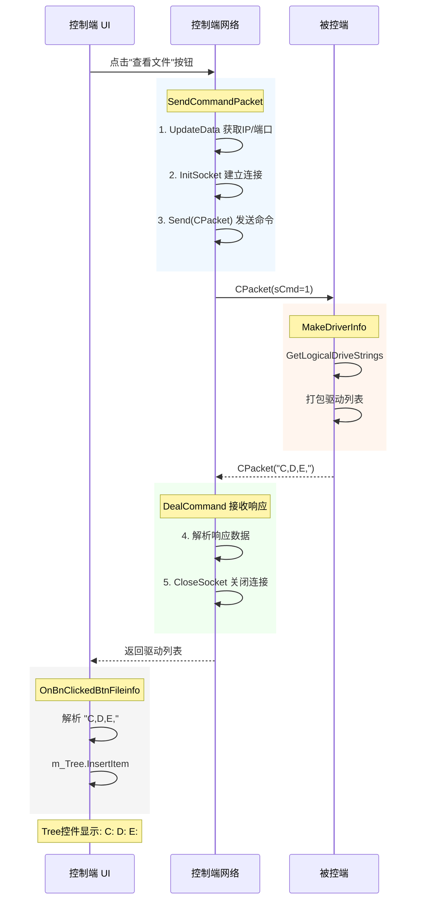

---
tags:
  - 项目/远控系统
git: d9835e0
git_msg: 完善网络通信模块，初步完成驱动信息获取功能，添加UI控件
---

> 本节完成**控制端 UI 界面搭建**和**驱动信息获取功能**：添加 IP/端口输入、Tree/List 控件，实现从被控端获取磁盘分区信息并显示。

---

## 功能概述

| 功能 | 说明 |
|------|------|
| **UI 控件集成** | 添加 IP 地址、端口、Tree、List 控件 |
| **命令发送封装** | `SendCommandPacket` 统一命令发送流程 |
| **驱动信息获取** | `sCmd=1` 获取被控端磁盘分区列表 |
| **字节序修复** | 修复 IP 地址大小端转换问题 |

---

## 设计背景

### 问题分析

在 [[3.3 网络模块对接与Bug修复]] 完成网络对接后，存在以下问题：

1. **IP/端口硬编码**：`InitSocket("127.0.0.1")` 无法动态配置
2. **命令发送重复代码**：每个按钮都要写相同的连接→发送→接收→关闭流程
3. **驱动信息未发送**：`MakeDriverInfo()` 打包后忘记调用 `Send()`
4. **无 UI 展示**：获取的数据无法可视化显示

### 设计目标

1. 添加可配置的 IP 地址和端口输入控件
2. 封装 `SendCommandPacket` 统一命令发送流程
3. 修复驱动信息发送遗漏
4. 使用 Tree 控件展示磁盘分区

---

## 架构设计

### 整体流程



### 新增 UI 控件

| 控件 ID | 类型 | 用途 | 绑定变量 |
|---------|------|------|---------|
| `IDC_IPADDRESS_SERV` | IP Address | 服务器 IP 地址 | `m_server_address` (DWORD) |
| `IDC_EDIT_PORT` | Edit | 端口号 | `m_nPort` (CString) |
| `IDC_TREE_DIR` | Tree Control | 目录树显示 | `m_Tree` (CTreeCtrl) |
| `IDC_LIST_FILE` | List Control | 文件列表显示 | 待绑定 |
| `IDC_BTN_FILEINFO` | Button | 查看文件信息 | 消息处理函数 |

---

## 核心实现

### 1. SendCommandPacket 命令发送封装

**技术栈**：
- **MFC DDX**：`UpdateData()` 同步控件与变量
- **CClientSocket**：网络通信单例
- **CPacket**：协议封装

**设计思路**：将"连接→发送→接收→关闭"流程封装为单一函数，避免代码重复。

```cpp
int CRemoteClientDlg::SendCommandPacket(int nCmd, BYTE* pData, size_t nLength)
{
    // ===== 1. 同步 UI 数据到变量 =====
    // UpdateData(TRUE): 从控件读取数据到成员变量
    // m_server_address 获取 IP 地址控件的值
    // m_nPort 获取端口输入框的值
    UpdateData();

    // ===== 2. 初始化网络连接 =====
    CClientSocket* pClient = CClientSocket::getInstance();
    // atoi: 字符串转整数，将端口字符串转为数字
    bool ret = pClient->InitSocket(m_server_address, atoi((LPCSTR)m_nPort));
    if (!ret)
    {
        AfxMessageBox("网络初始化失败");
        return -1;
    }

    // ===== 3. 构造并发送数据包 =====
    CPacket pack(nCmd, pData, nLength);
    ret = pClient->Send(pack);
    TRACE("Send ret %d \r\n", ret);

    // ===== 4. 接收响应 =====
    int cmd = pClient->DealCommand();
    TRACE("ack:%d\r\n", cmd);

    // ===== 5. 关闭连接 =====
    pClient->CloseSocket();

    return cmd;
}
```

**关键点**：

1. **UpdateData() 的双向同步**
   - `UpdateData(TRUE)` 或 `UpdateData()`：控件 → 变量
   - `UpdateData(FALSE)`：变量 → 控件

2. **短连接模式**
   - 每次命令都重新建立连接
   - 命令完成后立即关闭
   - 适合低频命令场景

3. **返回值设计**
   - 返回响应命令码（正常情况）
   - 返回 -1 表示失败

> 📁 `RemoteClient/RemoteClientDlg.cpp` : SendCommandPacket (行 68-87)

---

### 2. InitSocket 参数改进

**修改前**（[[3.2 客户端网络编程模块]]）：

```cpp
bool InitSocket(const std::string& strIPAddress)
{
    serv_adr.sin_addr.s_addr = inet_addr(strIPAddress.c_str());
    serv_adr.sin_port = htons(9527);  // 端口硬编码
}
```

**修改后**：

```cpp
bool InitSocket(int nIP, int nPort)
{
    if (m_sock != INVALID_SOCKET)
        CloseSocket();
    m_sock = socket(PF_INET, SOCK_STREAM, 0);

    if (m_sock == -1)
        return false;

    sockaddr_in serv_adr;
    memset(&serv_adr, 0, sizeof(serv_adr));
    serv_adr.sin_family = AF_INET;

    // ===== 关键：IP 地址字节序转换 =====
    // IP Address 控件返回的是主机字节序（如 0x7F000001 = 127.0.0.1）
    // 网络传输需要网络字节序（大端）
    // htonl: Host TO Network Long，32位主机序转网络序
    TRACE("addr %08X nIP %08X\r\n", inet_addr("127.0.0.1"), nIP);
    serv_adr.sin_addr.s_addr = htonl(nIP);

    // htons: Host TO Network Short，16位主机序转网络序
    serv_adr.sin_port = htons(nPort);

    // ... 后续 connect 代码
}
```

**字节序问题详解**：

| 概念 | 说明 | 示例 |
|------|------|------|
| 主机字节序 | CPU 本地存储顺序 | x86: 小端（低位在前）|
| 网络字节序 | 网络传输统一顺序 | 大端（高位在前）|
| `127.0.0.1` 主机序 | `0x7F000001` | MFC IP 控件返回值 |
| `127.0.0.1` 网络序 | `0x0100007F` | `inet_addr()` 返回值 |

```
IP: 127.0.0.1

主机字节序 (小端):  01 00 00 7F  (内存低地址 → 高地址)
网络字节序 (大端):  7F 00 00 01  (网络传输顺序)

MFC IP 控件返回: 0x7F000001 (主机序，高位在高地址)
需要 htonl() 转换为: 0x0100007F (网络序)
```

> 📁 `RemoteClient/CClientSocket.h` : InitSocket (行 167-200)

---

### 3. 驱动信息获取修复（被控端）

**问题**：`MakeDriverInfo()` 构造了数据包但**忘记发送**！

```cpp
int MakeDriverInfo()
{
    std::string result;
    // 获取所有驱动器字母
    DWORD nDrivers = GetLogicalDriveStrings(BUFFER_SIZE, drivers);
    for (int i = 0; i < (int)nDrivers; i += 4)
    {
        result += drivers[i];  // 添加盘符
        result += ',';
    }

    CPacket pack(1, (BYTE*)result.c_str(), result.size());
    // 调试输出：查看打包后的数据
    // FFFE070000000100432C44B300 解析：
    // FFFE: 包头
    // 07000000: 长度 7
    // 0100: 命令码 1
    // 432C44B3: "C,D," (ASCII)
    // 00: 校验和
    Dump((BYTE*)pack.Data(), pack.Size());

    // ❌ 修复前：缺少这行！数据包构造了但没发送
    // ✅ 修复后：添加发送
    CServerSocket::getInstance()->Send(pack);

    return 0;
}
```

**调试数据解析**：

日志中的 `FFFE070000000100432C44B300` 解析：

| 字节 | 值 | 含义 |
|------|-----|------|
| `FFFE` | 0xFEFF | 包头标识 |
| `07000000` | 7 | 数据长度（小端） |
| `0100` | 1 | 命令码 sCmd=1 |
| `43` | 'C' | 盘符 C |
| `2C` | ',' | 分隔符 |
| `44` | 'D' | 盘符 D |
| `B3` | 校验和 | ... |

> 📎 CPacket 协议格式详见 [[2.3 设计网络传输包协议]]

> 📁 `RemoteCtrl/RemoteCtrl.cpp` : MakeDriverInfo (行 47-55)

---

### 4. 驱动信息显示（控制端）

**技术栈**：
- **CTreeCtrl**：MFC 树形控件
- **字符串解析**：手动解析逗号分隔的盘符

```cpp
void CRemoteClientDlg::OnBnClickedBtnFileinfo()
{
    // ===== 1. 发送命令获取驱动信息 =====
    int ret = SendCommandPacket(1);  // sCmd=1: 获取驱动信息
    if (ret == -1)
    {
        AfxMessageBox(_T("命令处理失败！！！"));
        return;
    }

    // ===== 2. 获取响应数据 =====
    CClientSocket* pClient = CClientSocket::getInstance();
    // 响应数据格式: "C,D,E," （逗号分隔的盘符）
    std::string drivers = pClient->GetPacket().strData;

    // ===== 3. 清空并重新填充 Tree 控件 =====
    std::string dr;
    m_Tree.DeleteAllItems();  // 清空所有节点

    // ===== 4. 解析盘符并插入 Tree =====
    for (size_t i = 0; i < drivers.size(); i++)
    {
        if (drivers[i] == ',')
        {
            // 遇到逗号，说明一个盘符解析完成
            dr += ":";  // 添加冒号显示为 "C:"
            // InsertItem: 插入树节点
            // TVI_ROOT: 插入到根级别
            // TVI_LAST: 插入到末尾
            m_Tree.InsertItem(dr.c_str(), TVI_ROOT, TVI_LAST);
            dr.clear();  // 清空准备下一个
            continue;
        }
        dr += drivers[i];  // 累积盘符字符
    }
}
```

**CTreeCtrl::InsertItem 参数说明**：

```cpp
HTREEITEM InsertItem(
    LPCTSTR lpszItem,      // 节点文本
    HTREEITEM hParent,     // 父节点（TVI_ROOT 表示根级别）
    HTREEITEM hInsertAfter // 插入位置（TVI_LAST 表示末尾）
);
```

| 常量 | 说明 |
|------|------|
| `TVI_ROOT` | 插入为根节点 |
| `TVI_FIRST` | 插入到开头 |
| `TVI_LAST` | 插入到末尾 |
| `TVI_SORT` | 按字母排序插入 |

> 📁 `RemoteClient/RemoteClientDlg.cpp` : OnBnClickedBtnFileinfo (行 191-215)

---

### 5. 被控端主循环优化

**修改前**（[[3.3 网络模块对接与Bug修复]]）：

```cpp
while (CServerSocket::getInstance() != NULL)
{
    if (pserver->InitSocket() == false)  // ❌ 每次循环都初始化
    {
        // ...
    }
    while (CServerSocket::getInstance() != NULL)
    {
        // 内层循环处理请求
    }
}
```

**修改后**：

```cpp
// ===== InitSocket 移到循环外，只初始化一次 =====
if (pserver->InitSocket() == false)
{
    MessageBox(NULL, _T("网络初始化异常"), _T("网络初始化失败"), MB_OK | MB_ICONERROR);
    exit(0);
}

// 单层循环处理请求
while (CServerSocket::getInstance() != NULL)
{
    if (pserver->AcceptClient() == false)
    {
        // 重试逻辑
    }
    TRACE("AcceptClient return true\r\n");

    int ret = pserver->DealCommand();
    TRACE("DealCommand ret %d\r\n", ret);

    if (ret > 0)
    {
        ret = ExcuteCommand(pserver->GetPacket().sCmd);
        pserver->CloseClient();
        TRACE("Command has done!\r\n");
    }
}
```

**优化点**：
- `InitSocket()` 只调用一次（bind + listen 只需一次）
- 移除冗余的双层循环结构
- 代码更简洁清晰

> 📁 `RemoteCtrl/RemoteCtrl.cpp` : main (行 461-495)

---

### 6. 控件初始化

在对话框初始化时设置默认值：

```cpp
BOOL CRemoteClientDlg::OnInitDialog()
{
    CDialogEx::OnInitDialog();
    // ...

    // ===== 设置控件默认值 =====
    UpdateData();  // 先读取当前值
    m_server_address = 0x7F000001;  // 127.0.0.1（主机字节序）
    m_nPort = _T("9527");           // 默认端口
    UpdateData(FALSE);  // 写回控件显示

    return TRUE;
}
```

**DDX 绑定配置**：

```cpp
void CRemoteClientDlg::DoDataExchange(CDataExchange* pDX)
{
    CDialogEx::DoDataExchange(pDX);
    // DDX_IPAddress: IP 地址控件绑定
    DDX_IPAddress(pDX, IDC_IPADDRESS_SERV, m_server_address);
    // DDX_Text: 文本框绑定
    DDX_Text(pDX, IDC_EDIT_PORT, m_nPort);
    // DDX_Control: 控件对象绑定
    DDX_Control(pDX, IDC_TREE_DIR, m_Tree);
}
```

> 📁 `RemoteClient/RemoteClientDlg.cpp` : OnInitDialog (行 127-135), DoDataExchange (行 62-67)

---

## MFC DDX/DDV 机制详解

### DDX（Dialog Data Exchange）

DDX 实现控件与成员变量的双向数据交换：

```
          UpdateData(TRUE)
控件值  ─────────────────→  成员变量
        ←─────────────────
          UpdateData(FALSE)
```

| DDX 宏 | 用途 | 示例 |
|--------|------|------|
| `DDX_Text` | 文本框 ↔ CString/int | `DDX_Text(pDX, IDC_EDIT, m_str)` |
| `DDX_IPAddress` | IP 控件 ↔ DWORD | `DDX_IPAddress(pDX, IDC_IP, m_ip)` |
| `DDX_Control` | 控件 ↔ 控件类 | `DDX_Control(pDX, IDC_TREE, m_tree)` |
| `DDX_Check` | 复选框 ↔ int | `DDX_Check(pDX, IDC_CHK, m_check)` |

### IP Address 控件

MFC 的 `CIPAddressCtrl` 返回的是 **32 位主机字节序整数**：

```cpp
// 127.0.0.1 的表示
DWORD ip = 0x7F000001;  // 主机序

// 分解为四个字节
BYTE b1 = (ip >> 24) & 0xFF;  // 127
BYTE b2 = (ip >> 16) & 0xFF;  // 0
BYTE b3 = (ip >> 8) & 0xFF;   // 0
BYTE b4 = ip & 0xFF;          // 1
```

---

## 调试日志分析

原始日志（笔记开头的测试日志）：

```
CClientSocket.h(179) : addr 0100007F nIP 7F000001
CClientSocket.h(246) : m_sock = 740
RemoteClientDlg.cpp(82) : Send ret 1
ServerSocket.h(192) : m_client=184
RemoteCtrl.cpp(481) : AcceptClient return true
ServerSocket.h(220) : recv 10
RemoteCtrl.cpp(483) : DealCommand ret 1
FFFE070000000100432C44B300
RemoteCtrl.cpp(492) : Command has done!
RemoteClientDlg.cpp(84) : ack:1
```

**日志解读**：

| 日志 | 含义 |
|------|------|
| `addr 0100007F nIP 7F000001` | 调试字节序：`inet_addr` 返回网络序，控件返回主机序 |
| `m_sock = 740` | 客户端 socket 句柄 |
| `Send ret 1` | 发送成功 |
| `recv 10` | 收到 10 字节（CPacket 头部） |
| `DealCommand ret 1` | 解析出命令码 1（驱动信息） |
| `FFFE070000000100432C...` | 发送的数据包（包含 C, D 盘符） |
| `ack:1` | 客户端收到响应，命令码 1 |

**问题**：日志显示只有 C 盘，说明被控端只有一个盘符（或其他盘未识别）。

---

## 易错点与调试

> [!warning] 常见错误

### 1. IP 地址字节序错误

```cpp
// ❌ 错误：直接使用 IP 控件的值
serv_adr.sin_addr.s_addr = nIP;  // 主机序，连接错误地址

// ✅ 正确：转换为网络字节序
serv_adr.sin_addr.s_addr = htonl(nIP);
```

### 2. 忘记 UpdateData

```cpp
// ❌ 错误：直接使用成员变量
void OnButtonClick()
{
    // m_server_address 还是旧值！
    pClient->InitSocket(m_server_address, ...);
}

// ✅ 正确：先同步控件数据
void OnButtonClick()
{
    UpdateData();  // 从控件读取最新值
    pClient->InitSocket(m_server_address, ...);
}
```

### 3. 忘记发送数据包

```cpp
// ❌ 错误：只打包不发送
CPacket pack(1, data, len);
Dump(pack.Data(), pack.Size());  // 调试输出
// 忘记 Send()！

// ✅ 正确：打包后发送
CPacket pack(1, data, len);
CServerSocket::getInstance()->Send(pack);
```

### 4. Tree 控件未清空

```cpp
// ❌ 错误：重复点击按钮，节点叠加
m_Tree.InsertItem("C:", TVI_ROOT, TVI_LAST);

// ✅ 正确：先清空再插入
m_Tree.DeleteAllItems();
m_Tree.InsertItem("C:", TVI_ROOT, TVI_LAST);
```

---

## 关联知识

- [[2.3 设计网络传输包协议]] - CPacket 协议格式
- [[2.4 获取磁盘分区信息]] - GetLogicalDriveStrings API
- [[3.2 客户端网络编程模块]] - CClientSocket 设计
- [[3.3 网络模块对接与Bug修复]] - 网络对接基础

---

## 代码索引

| 功能 | 文件 | 位置 |
|------|------|------|
| SendCommandPacket | RemoteClientDlg.cpp | 行 68-87 |
| InitSocket（新参数） | CClientSocket.h | 行 167-200 |
| MakeDriverInfo（修复） | RemoteCtrl.cpp | 行 47-55 |
| OnBnClickedBtnFileinfo | RemoteClientDlg.cpp | 行 191-215 |
| DoDataExchange（DDX） | RemoteClientDlg.cpp | 行 62-67 |
| OnInitDialog（默认值） | RemoteClientDlg.cpp | 行 127-135 |
| 主循环优化 | RemoteCtrl.cpp | 行 461-495 |
| Resource.h（控件ID） | Resource.h | 全文件 |

---

## 更新记录

| 日期 | 变更 |
|------|------|
| 2026-01-17 | 初始版本：UI 控件集成、驱动信息获取、字节序修复 |
