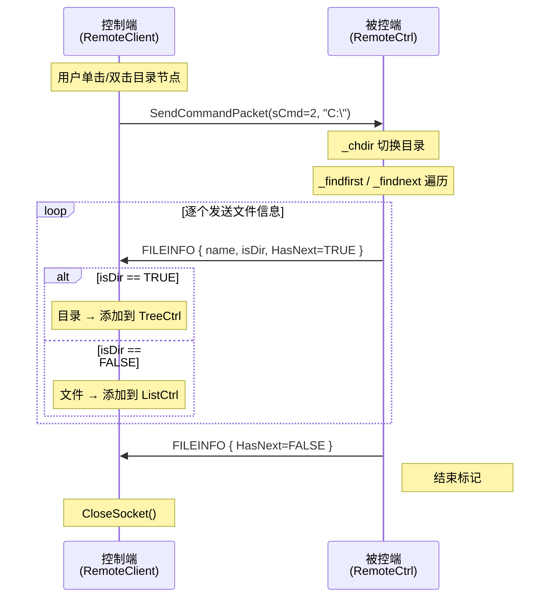

---
tags:
  - 项目/远控系统
git: "dc068a2"
git_msg: "完善树控件（只显示文件夹）、列表数据展示、右键菜单"
git_related: "6957688 — 完成文件目录信息的获取和展示功能"
---


> 实现远程文件目录的获取与展示功能，用户双击目录节点时动态加载子目录内容。

---

## 功能概述

| 功能 | 说明 |
|------|------|
| **目录浏览** | 控制端可浏览被控端的完整文件系统 |
| **延迟加载** | 单击/双击目录节点时动态加载子目录，减少网络传输 |
| **树形展示** | 使用 MFC `CTreeCtrl` **只展示目录**结构 |
| **列表展示** | 使用 MFC `CListCtrl` 展示当前目录的**文件列表** |
| **右键菜单** | 文件列表支持右键菜单（下载、删除、运行） |
| **命令码** | `sCmd=2`（查看指定目录下的文件） |

---

## 设计背景

### 问题分析

在 [[3.4 驱动信息获取与UI控件集成]] 中已实现驱动器列表获取（`sCmd=1`），但只能看到磁盘分区（如 `C:`, `D:`），无法进一步浏览目录结构。

用户需要：
1. 点击某个磁盘分区后能看到其下的文件和目录
2. 继续点击子目录，能递归展开
3. 区分文件和目录（目录显示展开箭头）

### 设计目标

1. **延迟加载**：不一次性传输整个文件树，而是按需加载
2. **流式传输**：目录中的每个文件/子目录单独发送一个数据包
3. **结束标记**：使用 `HasNext=FALSE` 标记传输结束

---




### 数据结构

```cpp
// 文件信息结构体（控制端和被控端共用）
typedef struct file_info {
    file_info()
    {
        IsInvalid = FALSE;
        IsDirectory = -1;
        HasNext = TRUE;
        memset(szFileName, 0, sizeof(szFileName));
    }
    BOOL IsInvalid;      // 是否无效（如无权限访问）
    BOOL IsDirectory;    // 是否为目录：0=文件，1=目录
    BOOL HasNext;        // 是否还有后续数据：0=没有，1=有
    char szFileName[256]; // 文件名
} FILEINFO, *PFILEINFO;
```

**设计要点**：

| 字段 | 用途 |
|------|------|
| `IsInvalid` | 标记无权限访问的目录 |
| `IsDirectory` | 区分文件和目录，目录需要显示展开箭头 |
| `HasNext` | 控制端用来判断是否继续接收数据 |
| `szFileName[256]` | 固定大小，简化序列化（无需处理变长字符串） |

### 组件关系

| 组件/类 | 职责 | 相关笔记 |
|--------|------|---------|
| `CServerSocket` | 网络管理、发送数据包 | [[2.2 网络编程架构设计]] |
| `CPacket` | 协议封装、数据打包 | [[2.3 设计网络传输包协议]] |
| `CClientSocket` | 控制端网络、接收数据包 | [[3.2 客户端网络编程模块]] |
| `CTreeCtrl` | MFC 树形控件，**只显示目录** | MFC 标准控件 |
| `CListCtrl` | MFC 列表控件，**显示文件** | MFC 标准控件 |
| `CMenu` | MFC 菜单，右键弹出菜单 | MFC 标准控件 |

---

## 核心实现

### 1. 被控端：目录遍历 (MakeDirectoryInfo)

> 📁 `RemoteCtrl/RemoteCtrl/RemoteCtrl.cpp` : MakeDirectoryInfo (行 59-112)

**技术栈**：
- `_chdir`：改变当前工作目录
- `_findfirst` / `_findnext`：C 运行时库的目录遍历 API
- `_finddata_t`：存储文件属性的结构体

**设计思路**：采用流式发送，每找到一个文件就立即发送，而不是收集所有文件后一次性发送。这样可以避免大目录导致的内存占用，也能让控制端尽快开始显示。

```cpp
int MakeDirectoryInfo()
{
    std::string strPath;

    // ===== 1. 获取客户端请求的路径 =====
    // GetFilePath 从 CPacket 的 strData 中提取路径
    if (CServerSocket::getInstance()->GetFilePath(strPath) == false)
    {
        OutputDebugString(_T("当前的命令，不是获取文件列表，命令获取错误"));
        return -1;
    }

    // ===== 2. 切换到目标目录 =====
    // _chdir: 改变当前工作目录
    // 返回 0 表示成功，非 0 表示失败（如目录不存在或无权限）
    if (_chdir(strPath.c_str()) != 0)
    {
        // 无权限访问，发送错误信息
        FILEINFO finfo;
        finfo.IsInvalid = TRUE;      // 标记为无效
        finfo.IsDirectory = TRUE;
        finfo.HasNext = FALSE;       // 没有后续数据
        memcpy(finfo.szFileName, strPath.c_str(), strPath.size());
        CPacket pack(2, (BYTE*)&finfo, sizeof(finfo));
        CServerSocket::getInstance()->Send(pack);
        return -2;
    }

    // ===== 3. 开始遍历目录 =====
    _finddata_t fdata;
    // [重要] 使用 intptr_t 而非 int，保证 64 位兼容性
    intptr_t hfind = 0;

    // _findfirst: 查找匹配的第一个文件
    // "*" 表示匹配所有文件
    // 返回句柄，用于后续的 _findnext
    if ((hfind = _findfirst("*", &fdata)) == -1)
    {
        // 空目录也要发送结束标记
        FILEINFO finfo;
        finfo.HasNext = FALSE;
        CPacket pack(2, (BYTE*)&finfo, sizeof(finfo));
        CServerSocket::getInstance()->Send(pack);
        return -3;
    }

    // ===== 4. 循环发送每个文件/目录信息 =====
    do {
        FILEINFO finfo;
        // _A_SUBDIR: 目录属性标志
        // 使用位与运算检查是否为目录
        finfo.IsDirectory = (fdata.attrib & _A_SUBDIR) != 0;
        memcpy(finfo.szFileName, fdata.name, strlen(fdata.name));

        CPacket pack(2, (BYTE*)&finfo, sizeof(finfo));
        CServerSocket::getInstance()->Send(pack);

    } while (!_findnext(hfind, &fdata));
    // _findnext: 返回 0 表示找到下一个，-1 表示结束

    // ===== 5. 发送结束标记 =====
    FILEINFO finfo;
    finfo.HasNext = FALSE;  // 关键：通知控制端传输结束
    CPacket pack(2, (BYTE*)&finfo, sizeof(finfo));
    CServerSocket::getInstance()->Send(pack);

    return 0;
}
```

**关键点解析**：

1. **为什么用 `_chdir` 而不是拼接路径？**
   - `_findfirst("*", ...)` 搜索当前目录
   - 先切换目录再搜索，代码更简洁
   - 避免路径拼接的边界情况（如末尾是否有 `\`）

2. **流式发送 vs 批量发送**
   ```cpp
   // ✅ 流式发送（当前实现）
   do {
       Send(finfo);  // 每个文件立即发送
   } while (_findnext(...));

   // ❌ 批量发送（内存占用大）
   std::vector<FILEINFO> files;
   while (_findnext(...))
       files.push_back(finfo);
   Send(files);  // 大目录可能 OOM
   ```

3. **结束标记的必要性**
   - 控制端不知道目录有多少文件
   - `HasNext=FALSE` 让控制端知道何时停止接收

---

### 2. 控制端：发送命令 (SendCommandPacket)

> 📁 `RemoteCtrl/RemoteClient/RemoteClientDlg.cpp` : SendCommandPacket (行 70-93)

**设计改进**：新增 `bAutoClose` 参数控制是否自动关闭连接。

```cpp
// 参数说明：
// nCmd: 命令码（1=驱动器列表，2=目录内容，...）
// bAutoClose: 是否在收到第一个响应后关闭连接
// pData: 附加数据（如目录路径）
// nLength: 数据长度
int CRemoteClientDlg::SendCommandPacket(
    int nCmd,
    bool bAutoClose,  // [新增] 默认为 true
    BYTE* pData,
    size_t nLenght)
{
    UpdateData();  // MFC：从控件读取数据到成员变量
    CClientSocket* pClient = CClientSocket::getInstance();

    // 初始化 socket 并连接服务器
    bool ret = pClient->InitSocket(m_server_address, atoi((LPCSTR)m_nPort));
    if (!ret)
    {
        AfxMessageBox("网络初始化失败");
        return -1;
    }

    // 打包并发送命令
    CPacket pack(nCmd, pData, nLenght);
    ret = pClient->Send(pack);

    // 等待并处理响应
    int cmd = pClient->DealCommand();

    // [关键改进] 根据 bAutoClose 决定是否关闭连接
    if (bAutoClose)
    {
        pClient->CloseSocket();
    }
    // 不自动关闭时，调用者需要手动关闭

    return cmd;
}
```

**为什么需要 `bAutoClose` 参数？**

| 场景 | bAutoClose | 原因 |
|------|-----------|------|
| 获取驱动器列表 (`sCmd=1`) | `true` | 只有一个响应包 |
| 获取目录内容 (`sCmd=2`) | `false` | 需要持续接收多个 FILEINFO 包 |

---

### 3. 控制端：路径获取 (GetPath)

> 📁 `RemoteCtrl/RemoteClient/RemoteClientDlg.cpp` : GetPath (行 228-237)

**功能**：从树节点递归向上遍历，拼接出完整路径。

```cpp
CString CRemoteClientDlg::GetPath(HTREEITEM hTree)
{
    CString strRet, strTmp;

    // 从当前节点向上遍历到根节点
    do {
        // GetItemText: 获取节点显示的文本
        strTmp = m_Tree.GetItemText(hTree);
        // 拼接路径：当前节点 + '\' + 已累积的路径
        strRet = strTmp + '\\' + strRet;
        // GetParentItem: 获取父节点，根节点返回 NULL
        hTree = m_Tree.GetParentItem(hTree);
    } while (hTree != NULL);

    return strRet;
}
```

**示例**：

```
树结构：
└─ C:
   └─ Windows
      └─ System32  ← 当前选中

遍历过程：
1. strRet = "System32\"
2. strRet = "Windows\System32\"
3. strRet = "C:\Windows\System32\"
```

---

### 4. 控制端：清除子节点 (DeleteTreeChildrenItem)

> 📁 `RemoteCtrl/RemoteClient/RemoteClientDlg.cpp` : DeleteTreeChildrenItem (行 239-247)

**功能**：删除节点的所有子节点，为重新加载做准备。

```cpp
void CRemoteClientDlg::DeleteTreeChildrenItem(HTREEITEM hTree)
{
    HTREEITEM hSub = NULL;
    do {
        // GetChildItem: 获取第一个子节点
        hSub = m_Tree.GetChildItem(hTree);
        // 如果存在子节点，删除它
        if (hSub != NULL)
            m_Tree.DeleteItem(hSub);
        // 循环直到没有子节点
    } while (hSub != NULL);
}
```

**为什么不用递归？**
- `DeleteItem` 会自动删除该节点的所有后代
- 只需要逐个删除直接子节点即可

---

### 5. 控制端：加载文件信息 (LoadFileInfo) ⭐ 重构

> 📁 `RemoteCtrl/RemoteClient/RemoteClientDlg.cpp` : LoadFileInfo (行 231-279)

**重构背景**：原来的双击事件处理代码需要复用到单击事件，因此提取为独立函数。

**核心改进**：
1. **目录和文件分离**：目录添加到树控件，文件添加到列表控件
2. **复用性**：单击和双击事件都调用此函数

```cpp
void CRemoteClientDlg::LoadFileInfo()
{
    // ===== 1. 确定点击的节点 =====
    CPoint ptMouse;
    GetCursorPos(&ptMouse);                                // 获取鼠标屏幕坐标
    m_Tree.ScreenToClient(&ptMouse);                       // 转换为树控件内的坐标
    HTREEITEM hTreeSelected = m_Tree.HitTest(ptMouse, 0);  // 返回值：点中的节点句柄，没点中返回 NULL

    if (hTreeSelected == NULL)
        return;
    if (m_Tree.GetChildItem(hTreeSelected) == NULL)
        return;  // 没有子节点（文件），不处理

    // ===== 2. 清除旧数据 =====
    DeleteTreeChildrenItem(hTreeSelected);  // 清除树的子节点
    m_List.DeleteAllItems();                 // 清除列表内容

    // ===== 3. 发送请求并接收数据 =====
    CString strPath = GetPath(hTreeSelected);
    int cCmd = SendCommandPacket(2, false, (BYTE*)(LPCTSTR)strPath, strPath.GetLength());
    PFILEINFO pInfo = (PFILEINFO)CClientSocket::getInstance()->GetPacket().strData.c_str();
    CClientSocket* pClient = CClientSocket::getInstance();

    // ===== 4. 处理文件信息：目录和文件分流 =====
    while (pInfo->HasNext == TRUE) {
        TRACE("[%s] isdir %d\r\n", pInfo->szFileName, pInfo->IsDirectory);

        if (pInfo->IsDirectory)
        {
            // 跳过 "." 和 ".."
            if (CString(pInfo->szFileName) == "." ||
                CString(pInfo->szFileName) == "..")
            {
                int cmd = pClient->DealCommand();
                if (cmd < 0) break;
                pInfo = (PFILEINFO)pClient->GetPacket().strData.c_str();
                continue;
            }
            // [目录] 添加到树控件
            HTREEITEM hTemp = m_Tree.InsertItem(pInfo->szFileName, hTreeSelected, TVI_LAST);
            m_Tree.InsertItem("", hTemp, TVI_LAST);  // 占位符
        }
        else
        {
            // [文件] 添加到列表控件
            m_List.InsertItem(0, pInfo->szFileName);
        }

        int cmd = pClient->DealCommand();
        if (cmd < 0) break;
        pInfo = (PFILEINFO)pClient->GetPacket().strData.c_str();
    }

    pClient->CloseSocket();
}
```

**目录与文件分流逻辑**：

```
接收到 FILEINFO
       │
       ▼
   IsDirectory?
    ╱         ╲
  是           否
   │            │
   ▼            ▼
 TreeCtrl    ListCtrl
 (目录树)    (文件列表)
```

---

### 6. 控制端：单击/双击事件处理

> 📁 `RemoteCtrl/RemoteClient/RemoteClientDlg.cpp` : OnNMDblclkTreeDir / OnNMClickTreeDir (行 303-316)

**设计思路**：单击和双击都触发目录加载，提升用户体验。两个事件处理函数都直接调用 `LoadFileInfo()`。

```cpp
// 双击事件
void CRemoteClientDlg::OnNMDblclkTreeDir(NMHDR* pNMHDR, LRESULT* pResult)
{
    *pResult = 0;
    LoadFileInfo();  // 直接复用
}

// 单击事件
void CRemoteClientDlg::OnNMClickTreeDir(NMHDR* pNMHDR, LRESULT* pResult)
{
    *pResult = 0;
    LoadFileInfo();  // 直接复用
}
```

**消息映射**：

```cpp
BEGIN_MESSAGE_MAP(CRemoteClientDlg, CDialogEx)
    // ...
    ON_NOTIFY(NM_DBLCLK, IDC_TREE_DIR, &CRemoteClientDlg::OnNMDblclkTreeDir)
    ON_NOTIFY(NM_CLICK, IDC_TREE_DIR, &CRemoteClientDlg::OnNMClickTreeDir)
    ON_NOTIFY(NM_RCLICK, IDC_LIST_FILE, &CRemoteClientDlg::OnNMRClickListFile)
END_MESSAGE_MAP()
```

| 消息 | 控件 | 处理函数 |
|------|------|---------|
| `NM_DBLCLK` | IDC_TREE_DIR | OnNMDblclkTreeDir |
| `NM_CLICK` | IDC_TREE_DIR | OnNMClickTreeDir |
| `NM_RCLICK` | IDC_LIST_FILE | OnNMRClickListFile |

---

### 7. 控制端：右键菜单 (OnNMRClickListFile)

> 📁 `RemoteCtrl/RemoteClient/RemoteClientDlg.cpp` : OnNMRClickListFile (行 318-337)

**技术栈**：
- `NM_RCLICK`：MFC 列表控件右键点击通知
- `CMenu`：MFC 菜单类
- `TrackPopupMenu`：显示弹出菜单

```cpp
void CRemoteClientDlg::OnNMRClickListFile(NMHDR* pNMHDR, LRESULT* pResult)
{
    LPNMITEMACTIVATE pNMItemActivate = reinterpret_cast<LPNMITEMACTIVATE>(pNMHDR);
    *pResult = 0;

    // ===== 1. 获取鼠标位置 =====
    CPoint ptMouse, ptList;
    GetCursorPos(&ptMouse);      // 屏幕坐标（用于显示菜单）
    ptList = ptMouse;
    m_List.ScreenToClient(&ptList);  // 客户区坐标（用于命中测试）

    // ===== 2. 检查是否点击了列表项 =====
    int ListSelected = m_List.HitTest(ptList);
    if (ListSelected < 0)
        return;  // 没有点中任何项，不显示菜单

    // ===== 3. 加载并显示弹出菜单 =====
    CMenu menu;
    menu.LoadMenu(IDR_MENU_RCLICK);  // 从资源加载菜单
    CMenu* pPopup = menu.GetSubMenu(0);  // 获取第一个子菜单

    if (pPopup != NULL)
    {
        // TrackPopupMenu: 在指定位置显示弹出菜单
        // TPM_LEFTALIGN: 菜单左边缘对齐鼠标位置
        // TPM_RIGHTBUTTON: 响应右键点击
        pPopup->TrackPopupMenu(TPM_LEFTALIGN | TPM_RIGHTBUTTON,
            ptMouse.x, ptMouse.y, this);
    }
}
```

**菜单资源定义** (Resource.h)：

```cpp
#define IDR_MENU_RCLICK     130
#define ID_DOWNLOAD_FILE    32774
#define ID_DELETE_FILE      32775
#define ID_RUN_FILE         32776
```

**菜单项说明**：

| 菜单项 ID | 功能 | 说明 |
|----------|------|------|
| `ID_DOWNLOAD_FILE` | 下载文件 | 从被控端下载选中文件 |
| `ID_DELETE_FILE` | 删除文件 | 删除被控端的文件 |
| `ID_RUN_FILE` | 运行文件 | 在被控端执行文件 |

---

### 8. UI 控件绑定

> 📁 `RemoteCtrl/RemoteClient/RemoteClientDlg.cpp` : DoDataExchange (行 62-69)

**DDX 数据交换**：将控件与成员变量绑定。

```cpp
void CRemoteClientDlg::DoDataExchange(CDataExchange* pDX)
{
    CDialogEx::DoDataExchange(pDX);
    DDX_IPAddress(pDX, IDC_IPADDRESS_SERV, m_server_address);
    DDX_Text(pDX, IDC_EDIT_PORT, m_nPort);
    DDX_Control(pDX, IDC_TREE_DIR, m_Tree);   // 树控件
    DDX_Control(pDX, IDC_LIST_FILE, m_List);  // 列表控件（新增）
}
```

**头文件声明** (RemoteClientDlg.h)：

```cpp
class CRemoteClientDlg : public CDialogEx
{
private:
    void LoadFileInfo();                    // 加载文件信息（新增）
    CString GetPath(HTREEITEM hTree);
    void DeleteTreeChildrenItem(HTREEITEM hTree);
    int SendCommandPacket(int nCmd, bool bAutoClose = true,
        BYTE* pData = NULL, size_t nLength = 0);

public:
    CTreeCtrl m_Tree;                       // 目录树
    CListCtrl m_List;                       // 文件列表（新增）

    afx_msg void OnNMDblclkTreeDir(NMHDR* pNMHDR, LRESULT* pResult);
    afx_msg void OnNMClickTreeDir(NMHDR* pNMHDR, LRESULT* pResult);   // 新增
    afx_msg void OnNMRClickListFile(NMHDR* pNMHDR, LRESULT* pResult); // 新增
};
```

---

## C 运行时库 API 详解

### _findfirst / _findnext

```cpp
intptr_t _findfirst(const char* filespec, _finddata_t* fileinfo);
int _findnext(intptr_t handle, _finddata_t* fileinfo);
int _findclose(intptr_t handle);
```

| 参数/返回值 | 说明 |
|-------------|------|
| `filespec` | 搜索模式，如 `"*"` 匹配所有，`"*.txt"` 匹配 txt 文件 |
| `fileinfo` | 输出参数，存储找到的文件信息 |
| `handle` | 搜索句柄，用于 `_findnext` |
| 返回值 | `-1` 表示失败或结束 |

**_finddata_t 结构体**：

```cpp
struct _finddata_t {
    unsigned attrib;       // 文件属性
    time_t time_create;    // 创建时间
    time_t time_access;    // 最后访问时间
    time_t time_write;     // 最后修改时间
    _fsize_t size;         // 文件大小
    char name[260];        // 文件名
};
```

**常用属性标志**：

| 标志 | 值 | 含义 |
|------|-----|------|
| `_A_NORMAL` | 0x00 | 普通文件 |
| `_A_RDONLY` | 0x01 | 只读文件 |
| `_A_HIDDEN` | 0x02 | 隐藏文件 |
| `_A_SYSTEM` | 0x04 | 系统文件 |
| `_A_SUBDIR` | 0x10 | 子目录 |
| `_A_ARCH` | 0x20 | 存档文件 |

---

## Bug 修复记录

### Bug 1: 64 位系统句柄截断

> 📁 `RemoteCtrl/RemoteCtrl/RemoteCtrl.cpp` 行 82-86

```cpp
// ❌ 原代码
int hfind = 0;
if ((hfind = _findfirst("*", &fdata)) == -1)

// ✅ 修复后
intptr_t hfind = 0;
if ((hfind = _findfirst("*", &fdata)) == -1)
```

**问题分析**：
- `_findfirst` 返回类型是 `intptr_t`（64 位系统为 8 字节）
- 用 `int`（4 字节）存储会截断高 32 位
- 截断后的句柄值可能恰好等于 `-1`，导致误判为失败
- 即使不等于 `-1`，后续 `_findnext` 使用错误句柄也会崩溃

**症状**：
```
0x00007FFBB54254A6 (ntdll.dll)处引发的异常: 0xC0000005:
写入位置 0xFFFFFFFF9735E8A0 时发生访问冲突
```

### Bug 2: Socket 提前关闭

> 📁 `RemoteCtrl/RemoteClient/RemoteClientDlg.cpp` 行 85-92

```cpp
// ❌ 原代码：无条件关闭
int cmd = pClient->DealCommand();
pClient->CloseSocket();  // 总是关闭
return cmd;

// ✅ 修复后：条件关闭
int cmd = pClient->DealCommand();
if (bAutoClose)
{
    pClient->CloseSocket();
}
return cmd;
```

**问题分析**：
- 获取目录内容时，被控端会发送多个 FILEINFO 包
- 如果收到第一个包就关闭连接，后续包无法接收
- 导致目录内容显示不完整或控制端卡死

### Bug 3: 空目录未发送结束标记

> 📁 `RemoteCtrl/RemoteCtrl/RemoteCtrl.cpp` 行 87-94

```cpp
// ❌ 原代码：直接返回，未发送结束标记
if ((hfind = _findfirst("*", &fdata)) == -1)
{
    OutputDebugString(_T("没有找到任何文件!!"));
    return -3;  // 控制端会一直等待
}

// ✅ 修复后：发送 HasNext=FALSE 的结束包
if ((hfind = _findfirst("*", &fdata)) == -1)
{
    OutputDebugString(_T("没有找到任何文件!!"));
    FILEINFO finfo;
    finfo.HasNext = FALSE;
    CPacket pack(2, (BYTE*)&finfo, sizeof(finfo));
    CServerSocket::getInstance()->Send(pack);
    return -3;
}
```

---

## 易错点与调试

> [!warning] 常见错误

### 1. 忘记跳过 "." 和 ".."

```cpp
// ❌ 错误：把 . 和 .. 也添加到树中
HTREEITEM hTemp = m_Tree.InsertItem(pInfo->szFileName, ...);

// ✅ 正确：跳过这两个特殊目录
if (pInfo->IsDirectory)
{
    if (CString(pInfo->szFileName) == "." ||
        CString(pInfo->szFileName) == "..")
    {
        // 获取下一个，不添加
        continue;
    }
}
```

**原因**：
- `.` 表示当前目录
- `..` 表示父目录
- 在树控件中显示这两个会造成混乱

### 2. 目录没有占位子节点

```cpp
// ❌ 错误：目录没有展开箭头
HTREEITEM hTemp = m_Tree.InsertItem(pInfo->szFileName, ...);
// 目录和文件看起来一样

// ✅ 正确：为目录添加空占位符
HTREEITEM hTemp = m_Tree.InsertItem(pInfo->szFileName, ...);
if (pInfo->IsDirectory)
{
    m_Tree.InsertItem("", hTemp, TVI_LAST);  // 添加占位符
}
```

**效果**：
- 有子节点的节点会显示展开箭头
- 用户知道这是可以展开的目录

### 3. 坐标转换遗漏

```cpp
// ❌ 错误：直接使用屏幕坐标
CPoint ptMouse;
GetCursorPos(&ptMouse);  // 屏幕坐标
HTREEITEM hTreeSelected = m_Tree.HitTest(ptMouse, 0);
// HitTest 期望的是客户区坐标，结果会错误

// ✅ 正确：转换为客户区坐标
CPoint ptMouse;
GetCursorPos(&ptMouse);
m_Tree.ScreenToClient(&ptMouse);  // 关键！
HTREEITEM hTreeSelected = m_Tree.HitTest(ptMouse, 0);
```

---

## MFC TreeCtrl API 参考

| 函数 | 功能 |
|------|------|
| `InsertItem(text, parent, after)` | 插入节点 |
| `DeleteItem(item)` | 删除节点及其后代 |
| `DeleteAllItems()` | 清空整棵树 |
| `GetChildItem(item)` | 获取第一个子节点 |
| `GetParentItem(item)` | 获取父节点 |
| `GetItemText(item)` | 获取节点文本 |
| `HitTest(point, flags)` | 坐标命中测试 |

**常用常量**：

| 常量 | 用途 |
|------|------|
| `TVI_ROOT` | 根节点 |
| `TVI_LAST` | 插入到末尾 |
| `TVI_FIRST` | 插入到开头 |

---

## MFC ListCtrl API 参考

| 函数 | 功能 |
|------|------|
| `InsertItem(index, text)` | 在指定位置插入项 |
| `DeleteItem(index)` | 删除指定项 |
| `DeleteAllItems()` | 清空列表 |
| `GetItemText(index, subitem)` | 获取项文本 |
| `SetItemText(index, subitem, text)` | 设置项文本 |
| `HitTest(point)` | 坐标命中测试，返回项索引 |
| `GetSelectedCount()` | 获取选中项数量 |
| `GetNextItem(start, flags)` | 查找下一项 |

---

## MFC CMenu API 参考

| 函数 | 功能 |
|------|------|
| `LoadMenu(resourceID)` | 从资源加载菜单 |
| `GetSubMenu(pos)` | 获取子菜单 |
| `TrackPopupMenu(flags, x, y, pWnd)` | 显示弹出菜单 |
| `AppendMenu(flags, id, text)` | 追加菜单项 |
| `EnableMenuItem(id, flags)` | 启用/禁用菜单项 |

**TrackPopupMenu 标志**：

| 标志 | 说明 |
|------|------|
| `TPM_LEFTALIGN` | 菜单左边缘对齐位置 |
| `TPM_RIGHTALIGN` | 菜单右边缘对齐位置 |
| `TPM_LEFTBUTTON` | 响应左键 |
| `TPM_RIGHTBUTTON` | 响应右键 |

---

## 代码索引

| 功能 | 文件 | 位置 |
|------|------|------|
| FILEINFO 结构体（被控端） | ServerSocket.h | 行 153-168 |
| FILEINFO 结构体（控制端） | CClientSocket.h | 行 148-165 |
| MakeDirectoryInfo | RemoteCtrl.cpp | 行 59-112 |
| SendCommandPacket | RemoteClientDlg.cpp | 行 71-93 |
| DoDataExchange | RemoteClientDlg.cpp | 行 62-69 |
| LoadFileInfo ⭐ | RemoteClientDlg.cpp | 行 231-279 |
| GetPath | RemoteClientDlg.cpp | 行 281-290 |
| DeleteTreeChildrenItem | RemoteClientDlg.cpp | 行 292-300 |
| OnNMDblclkTreeDir | RemoteClientDlg.cpp | 行 303-308 |
| OnNMClickTreeDir ⭐ | RemoteClientDlg.cpp | 行 310-316 |
| OnNMRClickListFile ⭐ | RemoteClientDlg.cpp | 行 318-337 |
| OnBnClickedBtnFileinfo | RemoteClientDlg.cpp | 行 203-229 |

---

## 调试日志参考

原始调试过程中遇到的问题（已修复）：

```
0x00007FFBB54254A6 (ntdll.dll)处有未经处理的异常: 0xC0000005:
写入位置 0xFFFFFFFF9735E8A0 时发生访问冲突
```

**原因**：`int hfind` 在 64 位系统截断句柄值，导致后续操作访问无效内存。

---

## 关联知识

- [[2.3 设计网络传输包协议]] - CPacket 协议格式
- [[3.2 客户端网络编程模块]] - CClientSocket 实现
- [[3.4 驱动信息获取与UI控件集成]] - 驱动器列表获取（前置功能）

---

## 更新记录

| 日期         | 变更                                          |
| ---------- | ------------------------------------------- |
| 2026-01-18 | 初始版本：完成文件目录信息获取和展示功能                        |
| 2026-01-18 | 重构：提取 LoadFileInfo 函数，目录/文件分离显示，新增单击事件和右键菜单 |
