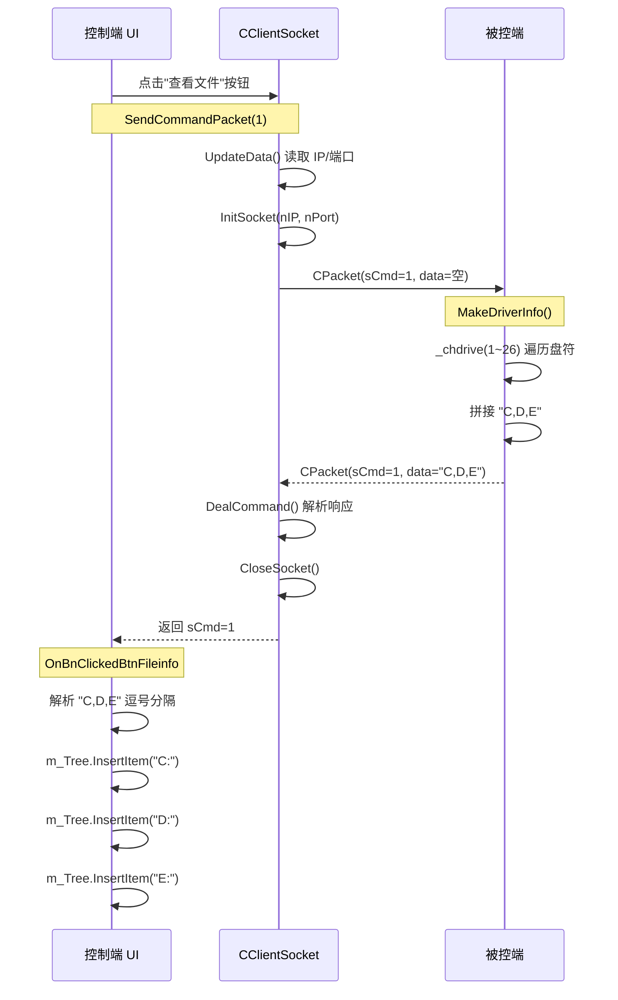

---
tags:
  - 项目/远控系统
git: "d9835e0"
git_msg: "1 完善网络通信模块 2 完善连接测试功能 3 初步完成驱动信息获取功能 4 添加了按钮、树、列表控件"
---

> 本节在 [[3.3 网络模块对接与Bug修复]] 的基础上，完成三件事：**控制端 UI 界面搭建**（IP/端口/Tree/List 控件）、**命令发送流程封装**（`SendCommandPacket`）、**驱动信息获取与展示**（`sCmd=1` 端到端打通）。

---

## 功能概述

| 功能 | 说明 |
|------|------|
| **控制端 UI 搭建** | 新增 IP 地址、端口、Tree、List 等控件，替代硬编码 |
| **SendCommandPacket 封装** | 将 连接→发送→接收→关闭 统一为一个函数调用 |
| **InitSocket 接口重构** | 参数从 `string` 改为 `int nIP, int nPort`，配合 UI 控件 |
| **驱动信息端到端打通** | 被控端 `MakeDriverInfo` 补上遗漏的 Send，控制端解析并显示到 Tree |
| **被控端主循环重构** | 双层 while 简化为单层，`InitSocket` 移到循环外 |

---

## 设计背景

### 上一版本的问题

在 [[3.3 网络模块对接与Bug修复]] 中，控制端的连接测试按钮 `OnBnClickedBtnTest` 长这样：

```cpp
void CRemoteClientDlg::OnBnClickedBtnTest()
{
    CClientSocket* pClient = CClientSocket::getInstance();
    bool ret = pClient->InitSocket("127.0.0.1");  // IP 硬编码
    if (!ret)
    {
        AfxMessageBox("网络初始化失败");
    }
    CPacket pack(1981, NULL, 0);
    ret = pClient->Send(pack);
    int cmd = pClient->DealCommand();
    pClient->CloseSocket();
}
```

问题很明显：

| 问题 | 说明 |
|------|------|
| IP 和端口硬编码 | `"127.0.0.1"` 和 `htons(9527)` 写死在代码里，调试不方便 |
| 发送流程没有封装 | 每加一个新命令按钮就要重复写 连接→发送→接收→关闭 |
| `MakeDriverInfo` 忘了发送 | 被控端打包了驱动信息但没有调用 `Send()`，数据根本没发出去 |
| 没有 UI 展示数据 | 就算数据回来了也无法显示 |
| 被控端主循环结构冗余 | 双层 while 嵌套，`InitSocket` 被反复调用 |

---

## 架构设计

### 驱动信息获取的完整流程



### 新增 UI 控件布局

本次在对话框资源中新增了 5 个控件：

| 控件 ID | 类型 | 用途 | 绑定变量 |
|---------|------|------|---------|
| `IDC_IPADDRESS_SERV` | IP Address Control | 输入被控端 IP | `m_server_address` (DWORD) |
| `IDC_EDIT_PORT` | Edit Control | 输入端口号 | `m_nPort` (CString) |
| `IDC_TREE_DIR` | Tree Control | 显示磁盘/目录树 | `m_Tree` (CTreeCtrl) |
| `IDC_LIST_FILE` | List Control | 显示文件列表 | 待绑定 |
| `IDC_BTN_FILEINFO` | Button | 触发"查看文件"命令 | 消息映射函数 |

对应 `Resource.h` 新增定义：

```cpp
#define IDC_BTN_TEST                    1000
#define IDC_EDIT_PORT                   1001
#define IDC_IPADDRESS_SERV              1002
#define IDC_TREE_DIR                    1003
#define IDC_LIST_FILE                   1004
#define IDC_BTN_FILEINFO                1005
```

---

## 核心实现

### 1. DDX 数据绑定与控件初始化

MFC 通过 DDX（Dialog Data Exchange）机制将控件与成员变量建立双向绑定。只需在 `DoDataExchange` 中声明映射关系，后续调用 `UpdateData()` 就能自动同步。

**技术栈**：
- `DDX_IPAddress`：IP 地址控件 ↔ DWORD 变量
- `DDX_Text`：文本框 ↔ CString 变量
- `DDX_Control`：控件 ↔ 控件类对象（不走值交换，直接绑定控件句柄）

```cpp
// ===== RemoteClientDlg.h 新增成员 =====
class CRemoteClientDlg : public CDialogEx
{
public:
    DWORD m_server_address;   // IP 地址（主机字节序，如 0x7F000001）
    CString m_nPort;          // 端口号（字符串形式）
    CTreeCtrl m_Tree;         // 目录树控件对象
};
```

```cpp
// ===== DoDataExchange：建立绑定关系 =====
void CRemoteClientDlg::DoDataExchange(CDataExchange* pDX)
{
    CDialogEx::DoDataExchange(pDX);
    // IP 控件 ↔ m_server_address
    // MFC IP Address 控件内部以 DWORD 形式存储 IP，主机字节序
    // 127.0.0.1 → 0x7F000001
    DDX_IPAddress(pDX, IDC_IPADDRESS_SERV, m_server_address);

    // 文本框 ↔ m_nPort
    DDX_Text(pDX, IDC_EDIT_PORT, m_nPort);

    // Tree 控件 ↔ m_Tree 对象
    // DDX_Control 不做值交换，只将控件句柄绑定到 CTreeCtrl 对象
    // 之后就可以通过 m_Tree 调用 InsertItem、DeleteAllItems 等方法
    DDX_Control(pDX, IDC_TREE_DIR, m_Tree);
}
```

```cpp
// ===== OnInitDialog：设置默认值 =====
BOOL CRemoteClientDlg::OnInitDialog()
{
    CDialogEx::OnInitDialog();
    // ... 图标设置等代码 ...

    // 先读取控件当前值到变量（此时变量已被构造函数初始化为 0/空）
    UpdateData();
    // 设置默认 IP 和端口
    m_server_address = 0x7F000001;  // 127.0.0.1
    m_nPort = _T("9527");
    // 将变量值写回控件显示
    UpdateData(FALSE);

    return TRUE;
}
```

**UpdateData 的双向机制**：

```
UpdateData(TRUE)  或 UpdateData()
    控件上显示的值 ───→ 成员变量

UpdateData(FALSE)
    成员变量 ───→ 控件上显示的值
```

> 📁 `RemoteClient/RemoteClientDlg.cpp` : DoDataExchange, OnInitDialog

---

### 2. SendCommandPacket 命令发送封装

这是本次提交最重要的设计改进。之前每个按钮的处理函数都要手写完整的 连接→发送→接收→关闭 流程，现在提取为统一方法。

**设计思路**：
- 任何命令的发送过程都是相同的：建立连接 → 组包发送 → 等待响应 → 关闭连接
- 唯一变化的是 `sCmd` 命令码和附带的数据
- 使用**短连接模式**：每次命令独立建立连接，完成后立即关闭

```cpp
// ===== 声明（RemoteClientDlg.h）=====
private:
    // pData 和 nLength 提供默认值，简单命令只传 nCmd 即可
    int SendCommandPacket(int nCmd, BYTE* pData = NULL, size_t nLength = 0);
```

```cpp
// ===== 实现（RemoteClientDlg.cpp）=====
int CRemoteClientDlg::SendCommandPacket(int nCmd, BYTE* pData, size_t nLength)
{
    // 1. 从控件读取最新的 IP 和端口
    UpdateData();

    // 2. 获取网络单例并建立连接
    CClientSocket* pClient = CClientSocket::getInstance();
    // m_server_address 是 DWORD 主机序，m_nPort 是 CString
    // atoi((LPCSTR)m_nPort) 将 CString → const char* → int
    bool ret = pClient->InitSocket(m_server_address, atoi((LPCSTR)m_nPort));
    if (!ret)
    {
        AfxMessageBox("网络初始化失败");
        return -1;
    }

    // 3. 构造数据包并发送
    CPacket pack(nCmd, pData, nLength);
    ret = pClient->Send(pack);
    TRACE("Send ret %d \r\n", ret);

    // 4. 等待被控端响应
    int cmd = pClient->DealCommand();
    TRACE("ack:%d\r\n", cmd);

    // 5. 关闭连接
    pClient->CloseSocket();

    return cmd;  // 返回响应命令码，-1 表示失败
}
```

**封装后的调用对比**：

```cpp
// ===== 封装前：OnBnClickedBtnTest 的旧代码 =====
void CRemoteClientDlg::OnBnClickedBtnTest()
{
    CClientSocket* pClient = CClientSocket::getInstance();
    bool ret = pClient->InitSocket("127.0.0.1");
    if (!ret) { AfxMessageBox("网络初始化失败"); }
    CPacket pack(1981, NULL, 0);
    ret = pClient->Send(pack);
    int cmd = pClient->DealCommand();
    pClient->CloseSocket();
}

// ===== 封装后：一行搞定 =====
void CRemoteClientDlg::OnBnClickedBtnTest()
{
    SendCommandPacket(1981);
}
```

> 📁 `RemoteClient/RemoteClientDlg.cpp` : SendCommandPacket

---

### 3. InitSocket 接口重构与字节序处理

`InitSocket` 的签名从 `string` 改为 `int`，配合 MFC IP Address 控件的 DWORD 输出。

**修改前**（上一版本 e805494）：

```cpp
bool InitSocket(const std::string& strIPAddress)
{
    // ...
    serv_adr.sin_addr.s_addr = inet_addr(strIPAddress.c_str());
    serv_adr.sin_port = htons(9527);  // 端口写死
    // ...
}
```

**修改后**：

```cpp
bool InitSocket(int nIP, int nPort)
{
    if (m_sock != INVALID_SOCKET)
        CloseSocket();                  // 先关闭旧连接
    m_sock = socket(PF_INET, SOCK_STREAM, 0);
    if (m_sock == -1)
        return false;

    sockaddr_in serv_adr;
    memset(&serv_adr, 0, sizeof(serv_adr));
    serv_adr.sin_family = AF_INET;

    // ===== 关键：字节序转换 =====
    // MFC IP Address 控件返回的是主机字节序的 DWORD
    //   127.0.0.1 → 0x7F000001（高位字节 0x7F 在高位）
    // sin_addr.s_addr 要求网络字节序（大端）
    //   127.0.0.1 → 0x0100007F（高位字节 0x7F 在低地址）
    // htonl: Host TO Network Long，32 位主机序 → 网络序
    TRACE("addr %08X nIP %08X\r\n", inet_addr("127.0.0.1"), nIP);
    serv_adr.sin_addr.s_addr = htonl(nIP);

    // htons: Host TO Network Short，16 位主机序 → 网络序
    serv_adr.sin_port = htons(nPort);

    if (serv_adr.sin_addr.s_addr == INADDR_NONE)
    {
        AfxMessageBox("指定的IP地址不存在！");
        return false;
    }
    int ret = connect(m_sock, (sockaddr*)&serv_adr, sizeof(serv_adr));
    if (ret == -1)
    {
        AfxMessageBox("连接失败");
        return false;
    }
    return true;
}
```

**为什么 `inet_addr` 不需要 `htonl` 而 IP 控件需要？**

`inet_addr("127.0.0.1")` 本身就返回网络字节序，可以直接赋值给 `sin_addr.s_addr`。但 MFC IP Address 控件返回的是人类直觉的主机字节序数值，必须用 `htonl` 转换：

```
inet_addr("127.0.0.1") → 0x0100007F （已经是网络序，直接用）
MFC IP 控件             → 0x7F000001 （主机序，需要 htonl 转换）
htonl(0x7F000001)       → 0x0100007F （转换后一致）
```

> 📁 `RemoteClient/CClientSocket.h` : InitSocket

---

### 4. 被控端 MakeDriverInfo 修复

上一版本中 `MakeDriverInfo` 有一个关键遗漏：数据包构造了，但**忘记调用 `Send` 发送**。

```cpp
int MakeDriverInfo()
{
    std::string result;
    // 遍历 A~Z 共 26 个盘符
    // _chdrive(1) 尝试切换到 A 盘，返回 0 表示成功（该盘存在）
    for (int i = 1; i <= 26; i++)
    {
        if (_chdrive(i) == 0)
        {
            if (result.size() > 0)
                result += ',';         // 盘符之间用逗号分隔
            result += 'A' + i - 1;     // 数字 1→'A', 2→'B', ...
        }
    }
    // 打包：sCmd=1 表示驱动信息响应
    CPacket pack(1, (BYTE*)result.c_str(), result.size());

    // 调试：输出二进制包内容
    Dump((BYTE*)pack.Data(), pack.Size());

    // ✅ 修复：这行是本次新增的！上一版本忘记发送了
    CServerSocket::getInstance()->Send(pack);

    return 0;
}
```

**Dump 输出示例解读**：

代码注释中记录了调试输出 `FFFE070000000100432C44B300`：

```
FFFE       → 包头 0xFEFF（小端存储）
07000000   → nLength = 7（sCmd 2B + data 3B + sSum 2B）
0100       → sCmd = 1
43         → 'C'（0x43）
2C         → ','（0x2C）
44         → 'D'（0x44）
B3         → sSum 校验和低字节
00         → sSum 校验和高字节
```

可以看到该测试环境只检测到 C 和 D 两个盘符。

> 📁 `RemoteCtrl/RemoteCtrl.cpp` : MakeDriverInfo

---

### 5. 驱动信息解析与 Tree 控件显示

控制端收到响应后，需要把 `"C,D,E"` 这种逗号分隔字符串解析为 Tree 控件的节点。

```cpp
void CRemoteClientDlg::OnBnClickedBtnFileinfo()
{
    // 1. 发送 sCmd=1 获取驱动信息
    int ret = SendCommandPacket(1);
    if (ret == -1)
    {
        AfxMessageBox(_T("命令处理失败！！！"));
        return;
    }

    // 2. 从已接收的数据包中取出 strData
    CClientSocket* pClient = CClientSocket::getInstance();
    std::string drivers = pClient->GetPacket().strData;
    // drivers 的格式: "C,D,E"（逗号分隔的盘符字母）

    // 3. 清空 Tree 控件，防止重复点击时节点叠加
    std::string dr;
    m_Tree.DeleteAllItems();

    // 4. 逐字符解析，遇到逗号就插入一个节点
    for (size_t i = 0; i < drivers.size(); i++)
    {
        if (drivers[i] == ',')
        {
            dr += ":";  // "C" → "C:"，让显示更直观
            // InsertItem 三个参数：
            //   dr.c_str() - 节点显示文本
            //   TVI_ROOT   - 插入为根级节点（没有父节点）
            //   TVI_LAST   - 追加到末尾
            m_Tree.InsertItem(dr.c_str(), TVI_ROOT, TVI_LAST);
            dr.clear();
            continue;
        }
        dr += drivers[i];
    }
}
```

**消息映射注册**：

```cpp
BEGIN_MESSAGE_MAP(CRemoteClientDlg, CDialogEx)
    // ... 原有映射 ...
    ON_BN_CLICKED(IDC_BTN_TEST, &CRemoteClientDlg::OnBnClickedBtnTest)
    ON_BN_CLICKED(IDC_BTN_FILEINFO, &CRemoteClientDlg::OnBnClickedBtnFileinfo)  // 新增
END_MESSAGE_MAP()
```

**CTreeCtrl::InsertItem 常用参数**：

| 参数/常量 | 说明 |
|----------|------|
| `TVI_ROOT` | 插入为根级节点 |
| `TVI_LAST` | 追加到当前层级末尾 |
| `TVI_FIRST` | 插入到当前层级开头 |
| `TVI_SORT` | 按字母序自动排列 |

> 📁 `RemoteClient/RemoteClientDlg.cpp` : OnBnClickedBtnFileinfo

---

### 6. 被控端主循环重构

上一版本的 `main` 存在双层 while 嵌套，且 `InitSocket`（bind + listen）在外层循环内被反复调用。

**修改前**（e805494）：

```cpp
while (CServerSocket::getInstance() != NULL)
{
    if (pserver->InitSocket() == false)   // ❌ 每轮外层循环都重新 bind+listen
    {
        // 报错退出
    }
    while (CServerSocket::getInstance() != NULL)  // 内层循环
    {
        if (pserver->AcceptClient() == false) { /* 重试 */ }
        int ret = pserver->DealCommand();
        if (ret > 0)
        {
            ExcuteCommand(pserver->GetPacket().sCmd);
            pserver->CloseClient();
        }
    }
}
```

**修改后**（d9835e0）：

```cpp
// InitSocket 只调用一次：bind + listen 本身就只需要做一次
if (pserver->InitSocket() == false)
{
    MessageBox(NULL, _T("网络初始化异常"), _T("网络初始化失败"), MB_OK | MB_ICONERROR);
    exit(0);
}

// 单层循环：accept → 处理命令 → 关闭客户端 → 继续 accept
while (CServerSocket::getInstance() != NULL)
{
    if (pserver->AcceptClient() == false)
    {
        if (count >= 3)
        {
            MessageBox(NULL, _T("多次无法正常接入用户，结束程序！"),
                       _T("接入用户失败"), MB_OK | MB_ICONERROR);
            exit(0);
        }
        MessageBox(NULL, _T("无法正常接入用户，自动重试"),
                   _T("接入用户失败"), MB_OK | MB_ICONERROR);
        count++;
    }

    int ret = pserver->DealCommand();
    if (ret > 0)
    {
        ret = ExcuteCommand(pserver->GetPacket().sCmd);
        if (ret != 0)
        {
            TRACE("执行命令失败：%d ret=%d\r\n", pserver->GetPacket().sCmd, ret);
        }
        pserver->CloseClient();
    }
}
```

**重构理由**：
- `InitSocket()` 内部执行的是 `socket()` + `bind()` + `listen()`，这些操作只需要做一次
- 服务端的工作模型是：绑定一次端口 → 循环 accept 客户端连接 → 处理 → 关闭客户端 → 继续 accept
- 双层循环在语义上是多余的，因为内层循环的退出条件与外层相同

> 📁 `RemoteCtrl/RemoteCtrl.cpp` : main

---

## 易错点与调试

> [!warning] 常见错误

### 1. IP 地址字节序不匹配

```cpp
// ❌ 错误：MFC IP 控件返回主机序，直接赋值给 sin_addr
serv_adr.sin_addr.s_addr = nIP;  // 连接到错误的地址

// ✅ 正确：用 htonl 转为网络序
serv_adr.sin_addr.s_addr = htonl(nIP);
```

这个问题很隐蔽：在本机测试（127.0.0.1）时，如果字节序搞反，变成 1.0.0.127，连接会直接失败。但如果 IP 是对称的（如 10.0.0.10），错误可能被掩盖。

### 2. 构造完数据包忘记发送

```cpp
// ❌ 代码看起来"完整"，但数据包只打包了没发出去
CPacket pack(1, (BYTE*)result.c_str(), result.size());
Dump((BYTE*)pack.Data(), pack.Size());  // 调试时看到了数据，以为没问题
// 缺少 Send()！

// ✅ 打包后必须发送
CPacket pack(1, (BYTE*)result.c_str(), result.size());
CServerSocket::getInstance()->Send(pack);
```

### 3. UpdateData 方向搞反

```cpp
// ❌ 设置完变量后调用 UpdateData() 而不是 UpdateData(FALSE)
m_server_address = 0x7F000001;
UpdateData();       // 这是从控件读取值到变量！刚赋的值被控件旧值覆盖了

// ✅ 赋值后用 FALSE 写回控件
m_server_address = 0x7F000001;
UpdateData(FALSE);  // 变量 → 控件
```

### 4. 盘符解析遗漏最后一项

当前的 `MakeDriverInfo` 拼出的字符串如果最后没有逗号（如 `"C,D,E"`），`OnBnClickedBtnFileinfo` 的解析逻辑会**丢失最后一个盘符**，因为循环只在遇到 `,` 时才插入节点。如果最后一个字符不是逗号，累积在 `dr` 中的最后一个盘符就不会被插入 Tree。

```cpp
// 假设 drivers = "C,D,E"
// 循环结束时 dr = "E"，但没有触发 InsertItem
```

不过看 `MakeDriverInfo` 的实现，盘符之间有逗号但**最后一个盘符后面没有逗号**（因为是 `if (result.size() > 0) result += ','` 前置逗号逻辑），所以这个隐患确实存在。

---

## 关联知识

- [[2.2 网络编程架构设计]] - CServerSocket 单例模式设计
- [[2.3 设计网络传输包协议]] - CPacket 协议格式与粘包处理
- [[3.2 客户端网络编程模块]] - CClientSocket 设计、旧版 InitSocket
- [[3.3 网络模块对接与Bug修复]] - 本次修改的前置版本

---

## 代码索引

| 功能 | 文件 | 说明 |
|------|------|------|
| DDX 数据绑定 | RemoteClientDlg.cpp : DoDataExchange | DDX_IPAddress, DDX_Text, DDX_Control |
| 控件默认值 | RemoteClientDlg.cpp : OnInitDialog | 127.0.0.1:9527 |
| 命令发送封装 | RemoteClientDlg.cpp : SendCommandPacket | 连接→发送→接收→关闭 |
| InitSocket 重构 | CClientSocket.h : InitSocket | string → int nIP, int nPort |
| 驱动信息发送修复 | RemoteCtrl.cpp : MakeDriverInfo | 补上遗漏的 Send |
| 驱动信息 Tree 显示 | RemoteClientDlg.cpp : OnBnClickedBtnFileinfo | 解析逗号分隔 → InsertItem |
| 主循环重构 | RemoteCtrl.cpp : main | 双层 while → 单层 |
| 控件 ID 定义 | Resource.h | IDC_IPADDRESS_SERV 等 5 个新控件 |

---

## 更新记录

| 日期 | 变更 |
|------|------|
| 2026-02-21 | 初始版本 |
