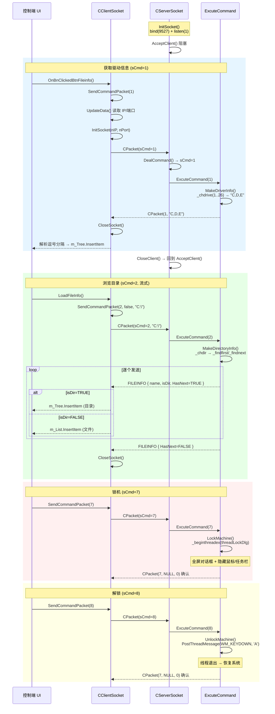

---
tags:
  - 项目/远控系统
git: "dc068a2"
git_msg: "完善树控件（只显示文件夹）、列表数据展示、右键菜单"
git_history:
  - "062571f — 锁机功能（3.1）"
  - "79ea2be — 客户端网络模块（3.2）"
  - "e805494 — 网络对接与Bug修复（3.3）"
  - "d9835e0 — 驱动信息获取与UI控件集成（3.4/3.6）"
  - "dc068a2 — 文件树实现与右键菜单（3.5）"
---

# 第三章总结：锁机与文件处理

> 本篇是第三章（3.1-3.6）的完整总结，基于 `dc068a2` 提交时的源码。第三章完成了两件大事：**客户端从空壳变为可交互的控制程序**，**C/S 双端实现首次端到端通信并逐步扩展文件管理功能**。

---

## 一、章节演进路线

```
3.1 被控端锁机功能（线程 + 全屏对话框）
 ↓ 此时客户端仍是 MFC 空壳，无法发送命令
3.2 控制端网络模块（CClientSocket 单例）
 ↓ 有了网络模块，但还没对接
3.3 首次端到端通信 + Bug修复（内存泄漏 / 重连失败）
 ↓ 能通信了，但客户端没有 UI，只能硬编码测试
3.4/3.6 控制端 UI 搭建 + 驱动信息获取
 ↓ 有了 IP/端口输入、Tree/List 控件，能看到盘符了
3.5 文件树 + 文件列表 + 右键菜单
 ↓ 可以浏览远程文件系统，具备实用性
```

两个阶段的分界线：

| 阶段 | 笔记 | 关注点 |
|------|------|--------|
| **网络打通** | 3.1-3.3 | 锁机功能、客户端网络模块、端到端对接、Bug 修复 |
| **UI 与文件管理** | 3.4-3.6 | 控制端 UI 搭建、驱动信息显示、目录浏览、文件列表 |

---

## 二、项目文件结构（`dc068a2` 时的状态）

```
RemoteCtrl/
├── RemoteCtrl/              ← 被控端（服务端，控制台程序）
│   ├── pch.h / pch.cpp              预编译头
│   ├── framework.h                  MFC + Windows 头文件引入
│   ├── RemoteCtrl.cpp               ★ 核心：main() + ExcuteCommand + 8 个命令函数
│   ├── ServerSocket.h               ★ 核心：CPacket + FILEINFO + CServerSocket
│   ├── ServerSocket.cpp             静态成员初始化
│   ├── LockInfoDialog.h             锁机对话框声明（3.1 新增）
│   ├── LockInfoDialog.cpp           锁机对话框实现（3.1 新增）
│   └── Resource.h                   资源 ID（IDD_DIALOG_INFO）
│
└── RemoteClient/            ← 控制端（客户端，MFC 对话框程序）
    ├── RemoteClient.h / .cpp        MFC App 类
    ├── RemoteClientDlg.h / .cpp     ★ 核心：UI 事件 + SendCommandPacket + LoadFileInfo
    ├── CClientSocket.h              ★ 核心：CPacket + FILEINFO + CClientSocket
    ├── CClientSocket.cpp            静态成员 + GetErrInfo
    ├── Resource.h                   资源 ID（控件 + 菜单）
    └── pch.h / pch.cpp              预编译头
```

> [!important] 关键变化
> 与第二章末尾对比，最大变化是**控制端从空壳变为功能完整的程序**：新增了 `CClientSocket` 网络模块、`RemoteClientDlg` 中的 UI 控件和事件处理、右键菜单等。被控端新增了 `CLockInfoDialog` 锁机对话框和 `ExcuteCommand` 命令分发函数。

---

## 三、第三章新增内容一览

### 3.1 被控端：锁机与解锁

| 项目 | 说明 |
|------|------|
| **新增文件** | `LockInfoDialog.h / .cpp` |
| **命令码** | 锁机 `sCmd=7`，解锁 `sCmd=8` |
| **核心设计** | 独立线程 (`_beginthreadex`) + 全屏对话框 + 消息循环 |

锁机原理：

```
LockMachine()
  └── _beginthreadex(threadLockDlg)
        ├── Create(IDD_DIALOG_INFO)    全屏对话框
        ├── SetWindowPos(wndTopMost)   窗口置顶
        ├── ShowCursor(false)          隐藏鼠标
        ├── FindWindow("Shell_TrayWnd") → SW_HIDE  隐藏任务栏
        ├── ClipCursor(1x1)           限制鼠标移动
        └── GetMessage 循环            等待解锁信号

UnlockMachine()
  └── PostThreadMessage(threadid, WM_KEYDOWN, 0x41)
        → 线程收到 'A' 键 → 退出循环 → 恢复系统状态
```

关键 Win32 API：

| API | 用途 |
|-----|------|
| `_beginthreadex` | 创建线程（CRT 安全版） |
| `SetWindowPos(wndTopMost)` | 窗口置顶 |
| `ClipCursor` | 限制鼠标活动范围 |
| `FindWindow("Shell_TrayWnd")` | 查找并隐藏任务栏 |
| `PostThreadMessage` | 跨线程发送消息（异步） |

> 📎 详见 [[3.1 锁机处理]]

---

### 3.2 控制端：CClientSocket 网络模块

控制端的网络模块与被控端**镜像对称**，均采用单例模式 + CHelper 自动释放：

| 对比项 | CServerSocket（被控端） | CClientSocket（控制端） |
|--------|----------------------|----------------------|
| **角色** | 服务端，被动等待连接 | 客户端，主动发起连接 |
| **初始化** | `bind` + `listen` | `connect` |
| **Socket 数量** | 2 个（m_sock + m_client） | 1 个（m_sock） |
| **接收对象** | 从 `m_client` 接收 | 从 `m_sock` 接收 |
| **关闭连接** | `CloseClient()` | `CloseSocket()` |

两端复用完全相同的 `CPacket` 协议类（各自头文件中重复定义）。

> 📎 详见 [[3.2 客户端网络编程模块]]、[[3.3.1 客户端与服务端的网络总结]]

---

### 3.3 首次端到端通信 + Bug 修复

本节是第三章的**里程碑**——远控系统首次实现完整的 C/S 通信。

**新增功能**：

| 功能 | 说明 |
|------|------|
| 被控端主循环 | `InitSocket → AcceptClient → DealCommand → ExcuteCommand → CloseClient` |
| ExcuteCommand | 将 switch-case 提取为独立命令分发函数 |
| TestConnect | `sCmd=1981` 调试连接 |
| 客户端 buffer 改用 vector | RAII 替代手动 new/delete |

**修复的 Bug**：

| Bug | 原因 | 修复 |
|-----|------|------|
| 被控端内存泄漏 | `DealCommand` 中 `new char[]` 三个 return 路径未 `delete[]` | 每个 return 前添加 `delete[] buffer` |
| 客户端无法重连 | `connect` 失败后 socket 不可重用，但未重建 | `InitSocket` 中先 `CloseSocket()` 再 `socket()` |
| 头文件函数多重定义 | `GetErrorInfo` 定义在头文件 | 声明/定义分离，移至 .cpp |

**RAII 改进对比**：

```
手动管理（被控端）               RAII（控制端）
━━━━━━━━━━━━━━━━━━━━━━━━━━━━━━━━━━━━━━━━━━━━━━━━━━━━
buffer = new char[4096];      buffer = m_buffer.data();
if (recv 失败)                if (recv 失败)
  delete[] buffer; ← 手动       return -1; ← 直接返回
  return -1;
if (解析成功)                  if (解析成功)
  delete[] buffer; ← 手动       return sCmd; ← 直接返回
  return sCmd;
```

> 📎 详见 [[3.3  网络模块对接与Bug修复]]

---

### 3.4/3.6 控制端 UI 搭建 + 驱动信息获取

**控制端从空壳变为可交互程序**，新增 5 个 UI 控件：

| 控件 ID | 类型 | 用途 | 绑定变量 |
|---------|------|------|---------|
| `IDC_IPADDRESS_SERV` | IP Address | 服务器 IP | `m_server_address` (DWORD) |
| `IDC_EDIT_PORT` | Edit | 端口号 | `m_nPort` (CString) |
| `IDC_TREE_DIR` | Tree Control | 目录树 | `m_Tree` (CTreeCtrl) |
| `IDC_LIST_FILE` | List Control | 文件列表 | `m_List` (CListCtrl) |
| `IDC_BTN_FILEINFO` | Button | 查看文件 | 消息处理函数 |

**关键封装 — SendCommandPacket**：

将"连接→发送→接收→关闭"流程统一为一个函数：

```cpp
// 封装前：每个按钮都要写完整流程
CClientSocket* p = CClientSocket::getInstance();
p->InitSocket(...);
CPacket pack(1981, NULL, 0);
p->Send(pack);
int cmd = p->DealCommand();
p->CloseSocket();

// 封装后：一行搞定
SendCommandPacket(1981);
```

**其他改进**：

| 改进 | 说明 |
|------|------|
| InitSocket 接口重构 | `string` → `int nIP, int nPort`，配合 MFC IP 控件 |
| IP 字节序处理 | MFC IP 控件返回主机序，需 `htonl()` 转网络序 |
| MakeDriverInfo 修复 | 补上遗漏的 `Send()` |
| 被控端主循环重构 | 双层 while → 单层，`InitSocket` 移到循环外 |

> 📎 详见 [[3.4 驱动信息获取与UI控件集成]]、[[3.6 驱动信息获取与UI控件集成]]

---

### 3.5 文件树实现

**核心设计：目录与文件分流**

```
接收到 FILEINFO
       │
   IsDirectory?
    ╱         ╲
  是            否
   │            │
   ▼            ▼
 m_Tree       m_List
(CTreeCtrl)  (CListCtrl)
 只显示目录    只显示文件
```

**被控端：流式传输**

```cpp
// MakeDirectoryInfo：逐条发送 FILEINFO
do {
    finfo.IsDirectory = (fdata.attrib & _A_SUBDIR) != 0;
    Send(CPacket(2, &finfo, sizeof(finfo)));
} while (!_findnext(hfind, &fdata));
// 最后发送 HasNext=FALSE 结束标记
```

**控制端：LoadFileInfo() 统一处理**

```
用户点击目录节点
  ├── 1. HitTest() 获取点击节点
  ├── 2. SelectItem() 设置选中状态
  ├── 3. DeleteTreeChildrenItem() 清除旧子节点
  ├── 4. m_List.DeleteAllItems() 清除文件列表
  ├── 5. GetPath() 递归拼接完整路径
  ├── 6. SendCommandPacket(2, false, path)
  └── 7. 循环接收 FILEINFO
       ├── IsDirectory=TRUE → m_Tree.InsertItem (添加占位符)
       └── IsDirectory=FALSE → m_List.InsertItem
```

**新增功能**：

| 功能 | 实现 |
|------|------|
| 延迟加载 | 单击/双击目录节点时才加载子目录 |
| 占位符节点 | 为目录添加空子节点，显示展开箭头 |
| 右键菜单 | `NM_RCLICK` → `CMenu` → 下载/删除/运行 |
| bAutoClose 参数 | `SendCommandPacket` 支持不自动关闭连接（流式接收） |

**修复的 Bug**：

| Bug | 原因 | 修复 |
|-----|------|------|
| 64 位句柄截断 | `int hfind` 在 64 位系统截断 `_findfirst` 返回值 | 改为 `intptr_t hfind` |
| Socket 提前关闭 | `SendCommandPacket` 无条件关闭连接 | 新增 `bAutoClose` 参数 |
| 空目录未发结束标记 | `_findfirst` 失败时直接 return | 发送 `HasNext=FALSE` 包 |

> 📎 详见 [[3.5 文件树实现]]

---

## 四、控制端源码讲解

### 4.1 RemoteClientDlg — 核心控制界面

截至 `dc068a2`，`RemoteClientDlg` 已从空壳发展为功能完整的控制界面：

```cpp
class CRemoteClientDlg : public CDialogEx
{
public:
    // ===== UI 控件 =====
    DWORD m_server_address;     // IP 地址（主机字节序）
    CString m_nPort;            // 端口号
    CTreeCtrl m_Tree;           // 目录树（只显示目录）
    CListCtrl m_List;           // 文件列表（只显示文件）

private:
    // ===== 核心方法 =====
    int SendCommandPacket(int nCmd, bool bAutoClose = true,
        BYTE* pData = NULL, size_t nLength = 0);
    void LoadFileInfo();
    CString GetPath(HTREEITEM hTree);
    void DeleteTreeChildrenItem(HTREEITEM hTree);

    // ===== 事件处理 =====
    afx_msg void OnBnClickedBtnTest();        // 测试连接
    afx_msg void OnBnClickedBtnFileinfo();    // 获取驱动信息
    afx_msg void OnNMDblclkTreeDir(...);      // 双击目录节点
    afx_msg void OnNMClickTreeDir(...);       // 单击目录节点
    afx_msg void OnNMRClickListFile(...);     // 右键文件列表
};
```

#### 消息映射

```cpp
BEGIN_MESSAGE_MAP(CRemoteClientDlg, CDialogEx)
    ON_BN_CLICKED(IDC_BTN_TEST, &CRemoteClientDlg::OnBnClickedBtnTest)
    ON_BN_CLICKED(IDC_BTN_FILEINFO, &CRemoteClientDlg::OnBnClickedBtnFileinfo)
    ON_NOTIFY(NM_DBLCLK, IDC_TREE_DIR, &CRemoteClientDlg::OnNMDblclkTreeDir)
    ON_NOTIFY(NM_CLICK, IDC_TREE_DIR, &CRemoteClientDlg::OnNMClickTreeDir)
    ON_NOTIFY(NM_RCLICK, IDC_LIST_FILE, &CRemoteClientDlg::OnNMRClickListFile)
END_MESSAGE_MAP()
```

#### DDX 数据绑定

```cpp
void CRemoteClientDlg::DoDataExchange(CDataExchange* pDX)
{
    CDialogEx::DoDataExchange(pDX);
    DDX_IPAddress(pDX, IDC_IPADDRESS_SERV, m_server_address);
    DDX_Text(pDX, IDC_EDIT_PORT, m_nPort);
    DDX_Control(pDX, IDC_TREE_DIR, m_Tree);
    DDX_Control(pDX, IDC_LIST_FILE, m_List);
}
```

### 4.2 CClientSocket — 控制端网络核心

```cpp
class CClientSocket
{
public:
    static CClientSocket* getInstance();

    // ===== 网络操作 =====
    bool InitSocket(int nIP, int nPort);   // socket() + connect()
    int  DealCommand();                     // recv + CPacket 解析
    bool Send(CPacket& pack);              // 发送数据包
    void CloseSocket();                     // 关闭连接

    // ===== 数据提取 =====
    CPacket& GetPacket();
    bool GetFilePath(std::string& strPath);
    bool GetMouseEvent(MOUSEEV& mouse);

private:
    SOCKET m_sock;
    CPacket m_packet;
    std::vector<char> m_buffer;  // RAII 缓冲区（改进）

    static CClientSocket* m_instance;
    class CHelper { /* 构造创建单例，析构释放单例 */ };
    static CHelper m_helper;
};
```

---

## 五、被控端源码讲解

### 5.1 RemoteCtrl.cpp 变化

与第二章末尾对比，主要变化：

| 变化 | 说明 |
|------|------|
| 恢复网络主循环 | 不再硬编码命令码，由 `DealCommand` 驱动 |
| 提取 `ExcuteCommand` | 命令分发独立为函数 |
| 新增锁机函数 | `LockMachine` / `UnlockMachine` / `threadLockDlg` |
| 新增 `TestConnect` | `sCmd=1981` 调试连接 |
| 主循环重构 | 3.4 中从双层 while 简化为单层 |

#### ExcuteCommand 命令分发

```cpp
int ExcuteCommand(int nCmd)
{
    switch (nCmd)
    {
    case 1:    return MakeDriverInfo();       // 磁盘分区
    case 2:    return MakeDirectoryInfo();    // 目录遍历
    case 3:    return RunFile();              // 打开文件
    case 4:    return DownloadFile();         // 下载文件
    case 5:    return MouseEvent();           // 鼠标操作
    case 6:    return SendScreen();           // 屏幕截图
    case 7:    return LockMachine();          // 锁机
    case 8:    return UnlockMachine();        // 解锁
    case 1981: return TestConnect();          // 测试连接
    }
    return -1;
}
```

#### 被控端主循环（`dc068a2` 最终状态）

```cpp
if (pserver->InitSocket() == false)  // bind + listen 只执行一次
{
    MessageBox(NULL, _T("网络初始化异常"), _T("失败"), MB_OK | MB_ICONERROR);
    exit(0);
}

while (CServerSocket::getInstance() != NULL)
{
    if (pserver->AcceptClient() == false) { /* 重试逻辑 */ }
    int ret = pserver->DealCommand();
    if (ret > 0)
    {
        ret = ExcuteCommand(pserver->GetPacket().sCmd);
        pserver->CloseClient();
    }
}
```

### 5.2 ServerSocket.h 变化

| 变化 | 说明 |
|------|------|
| DealCommand 修复内存泄漏 | 所有 return 路径添加 `delete[] buffer` |
| 新增 `CloseClient()` | 关闭客户端连接 |
| 新增 `GetPacket()` | 获取当前解析的数据包 |
| 新增 FILEINFO 结构体 | 文件信息传输用 |

---

## 六、命令体系总览

| 命令码 | 功能 | 处理函数 | 传输模式 | 引入版本 |
|:---:|:---|:---|:---|:---|
| 1 | 磁盘枚举 | `MakeDriverInfo()` | 单包 | 2.4 |
| 2 | 目录遍历 | `MakeDirectoryInfo()` | 流式 | 2.5 |
| 3 | 打开文件 | `RunFile()` | 单包 | 2.6 |
| 4 | 下载文件 | `DownloadFile()` | 分块 | 2.6 |
| 5 | 鼠标操作 | `MouseEvent()` | 单包 | 2.7 |
| 6 | 屏幕截图 | `SendScreen()` | 单包 | 2.8 |
| 7 | **锁机** | `LockMachine()` | 单包 | **3.1** |
| 8 | **解锁** | `UnlockMachine()` | 单包 | **3.1** |
| 1981 | **测试连接** | `TestConnect()` | 单包 | **3.3** |

> 第三章新增命令码 7、8、1981，第二章的 1-6 在本章中通过 `ExcuteCommand` 统一分发。

---

## 七、完整调用关系图

### 7.1 被控端调用链

```
程序启动
  ↓
CRT 静态初始化 → m_helper → getInstance() → new CServerSocket()
                                               ├→ WSAStartup(1,1)
                                               └→ socket(PF_INET, SOCK_STREAM)
  ↓
main()
  ├→ AfxWinInit()
  ├→ InitSocket()                   → bind(9527) + listen(1)
  │
  └→ while (true)                   ← 主循环
        ├→ AcceptClient()           → accept() 阻塞
        ├→ DealCommand()            → recv + CPacket 解析
        │     ↓ return sCmd
        ├→ ExcuteCommand(sCmd)
        │     ├→ 1: MakeDriverInfo()      → _chdrive 枚举
        │     ├→ 2: MakeDirectoryInfo()   → _findfirst/_findnext 流式发送
        │     ├→ 3: RunFile()             → ShellExecuteA
        │     ├→ 4: DownloadFile()        → fread 分块发送
        │     ├→ 5: MouseEvent()          → SetCursorPos + mouse_event
        │     ├→ 6: SendScreen()          → BitBlt + CImage::Save(PNG)
        │     ├→ 7: LockMachine()         → _beginthreadex(threadLockDlg)
        │     ├→ 8: UnlockMachine()       → PostThreadMessage(WM_KEYDOWN)
        │     └→ 1981: TestConnect()      → Send(CPacket(1981))
        │
        └→ CloseClient()
```

### 7.2 控制端调用链

```
程序启动
  ↓
CRT 静态初始化 → m_helper → getInstance() → new CClientSocket()
                                               ├→ WSAStartup(1,1)
                                               └→ m_buffer.resize(BUFFER_SIZE)
  ↓
CRemoteClientDlg::OnInitDialog()
  ├→ m_server_address = 0x7F000001    (127.0.0.1)
  └→ m_nPort = "9527"

用户操作 →
  │
  ├→ [查看文件] OnBnClickedBtnFileinfo()
  │     ├→ SendCommandPacket(1)       → 获取驱动信息
  │     ├→ 解析 "C,D,E" 逗号分隔
  │     └→ m_Tree.InsertItem("C:")    → 显示到树控件
  │
  ├→ [单击/双击目录] OnNMClickTreeDir / OnNMDblclkTreeDir
  │     └→ LoadFileInfo()
  │           ├→ HitTest → SelectItem
  │           ├→ DeleteTreeChildrenItem    清除旧节点
  │           ├→ GetPath(hSelected)        递归拼接路径
  │           ├→ SendCommandPacket(2, false, path)
  │           └→ while (HasNext)
  │                 ├→ IsDirectory → m_Tree.InsertItem
  │                 └→ 非目录 → m_List.InsertItem
  │
  ├→ [右键文件] OnNMRClickListFile()
  │     ├→ HitTest 检查命中
  │     └→ CMenu → TrackPopupMenu  → 下载/删除/运行
  │
  └→ [测试连接] OnBnClickedBtnTest()
        └→ SendCommandPacket(1981)
```

---

## 八、完整通信时序图



---

## 九、第三章 Bug 修复汇总

| # | 笔记 | 描述 | 原因 | 修复 |
|---|------|------|------|------|
| 1 | 3.1 | 任务栏类名拼写错误 | `Shell_TaryWnd` 应为 `Shell_TrayWnd` | 3.2 中修复拼写 |
| 2 | 3.3 | 被控端 DealCommand 内存泄漏 | `new char[]` 三个 return 路径未 `delete[]` | 每个 return 前添加 `delete[]` |
| 3 | 3.3 | 客户端无法重连 | `connect` 失败后 socket 不可重用 | InitSocket 中先 `CloseSocket()` 再 `socket()` |
| 4 | 3.3 | GetErrorInfo 头文件多重定义 | 非 inline 函数定义在头文件 | 声明/定义分离，移至 .cpp |
| 5 | 3.4 | MakeDriverInfo 忘记 Send | 构造 CPacket 后未调用 Send() | 补上 `Send(pack)` |
| 6 | 3.5 | 64 位 `_findfirst` 句柄截断 | `int hfind` 截断 `intptr_t` 返回值 | 改为 `intptr_t hfind` |
| 7 | 3.5 | SendCommandPacket 提前关闭连接 | 流式传输需要保持连接 | 新增 `bAutoClose` 参数 |
| 8 | 3.5 | 空目录未发送结束标记 | `_findfirst` 失败时直接 return | 发送 `HasNext=FALSE` 包 |

> 完整调试过程另见 Debug 日志系列笔记。

---

## 十、第二章 vs 第三章对比

| 维度 | 第二章结束时 (`282e985`) | 第三章结束时 (`dc068a2`) |
|------|------------------------|------------------------|
| **客户端** | MFC 空壳，无任何功能 | 完整 UI + 网络模块 + 文件浏览 |
| **命令分发** | 硬编码 `nCmd=6` 测试 | `ExcuteCommand` 函数 + 网络驱动 |
| **主循环** | 已注释 | 恢复并重构为单层循环 |
| **命令数量** | 6 个 (1-6) | 9 个 (1-8, 1981) |
| **缓冲区管理** | 手动 new/delete（泄漏） | 被控端修复泄漏，控制端改用 vector |
| **UI 控件** | 无 | IP / Port / Tree / List / Menu |
| **可用性** | 需要代码级调试 | 用户可通过 UI 操作 |

---

## 十一、设计局限与后续改进

| 局限 | 当前状态 | 改进方向 |
|------|----------|---------|
| CPacket 代码重复 | 两端各自定义一份 | 提取到共享头文件 `Protocol.h` |
| 被控端缓冲区管理 | 仍用手动 `new/delete` | 改用 `std::vector` 成员 |
| 短连接开销 | 每个命令重建 TCP 连接 | 长连接 + 命令码复用 |
| 单连接模型 | 一次只服务一个客户端 | 多线程 / IO 复用 |
| 缺少错误处理 | 部分函数不检查返回值 | 统一错误处理框架 |
| 文件下载未实现 | 右键菜单中的下载按钮无功能 | [[4.1 文件下载功能的实现]] |
| 安全性 | 无认证、无加密 | 认证 + TLS |
| Winsock 版本 | `MAKEWORD(1,1)` | 升级到 2.2 |

---

## 十二、关联笔记

**本章各节**：
- [[3.1 锁机处理]] — 锁机/解锁功能
- [[3.2 客户端网络编程模块]] — CClientSocket 单例设计
- [[3.3  网络模块对接与Bug修复]] — 首次端到端通信
- [[3.3.1 客户端与服务端的网络总结]] — C/S 架构对比
- [[3.4 驱动信息获取与UI控件集成]] — UI 搭建与驱动信息
- [[3.5 文件树实现]] — 目录浏览与文件列表
- [[3.6 驱动信息获取与UI控件集成]] — 驱动信息（详细版）

**上一章总结**：
- [[2.9 远控架构和基本设计 - 总结]] — 第二章完整总结

**后续章节**：
- [[4.1 文件下载功能的实现]] — 文件下载功能
- [[4.2 文件和盘符显示不全bug修复]] — Bug 修复

**Debug 日志**：
- [[Debug-005 服务端内存泄漏与客户端无法重连]] — 3.3 中修复的两个 Bug
- [[Debug-008 盘符显示遗漏最后一个驱动器]] — 驱动信息解析问题
- [[Debug-009 树控件未设置选中状态导致路径错误]] — 树控件选中状态问题
