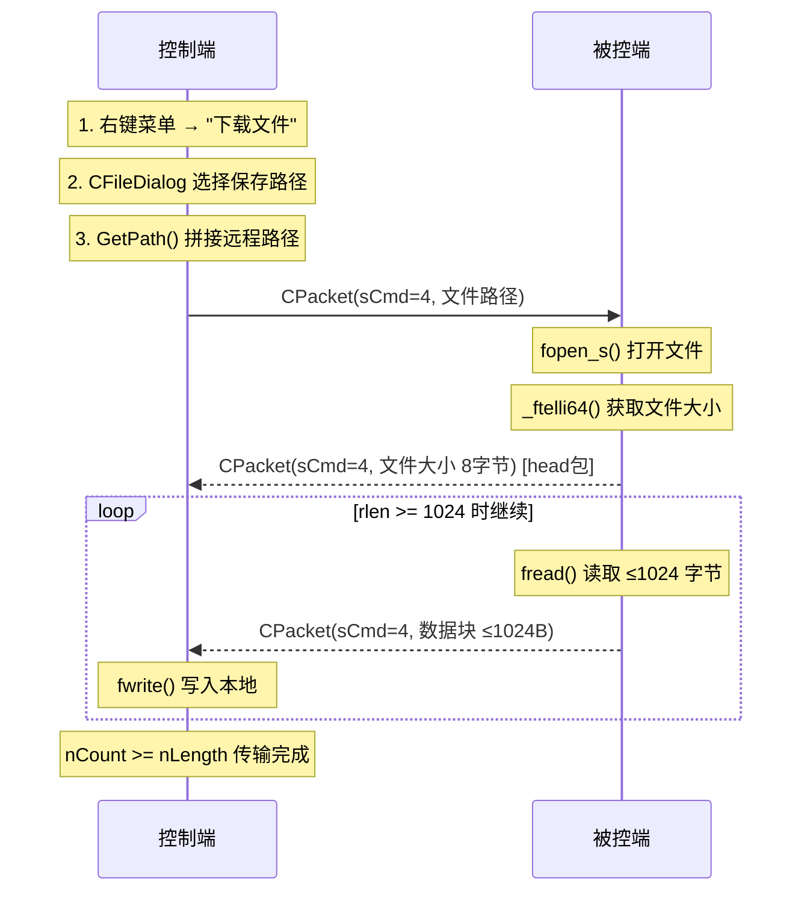
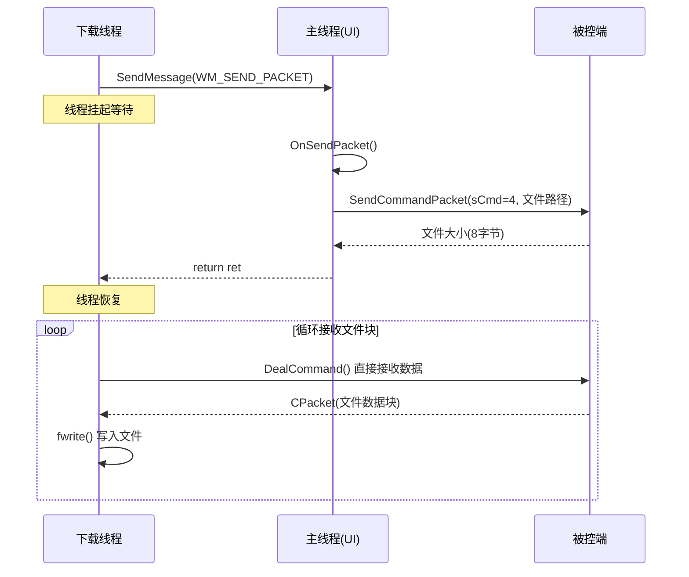
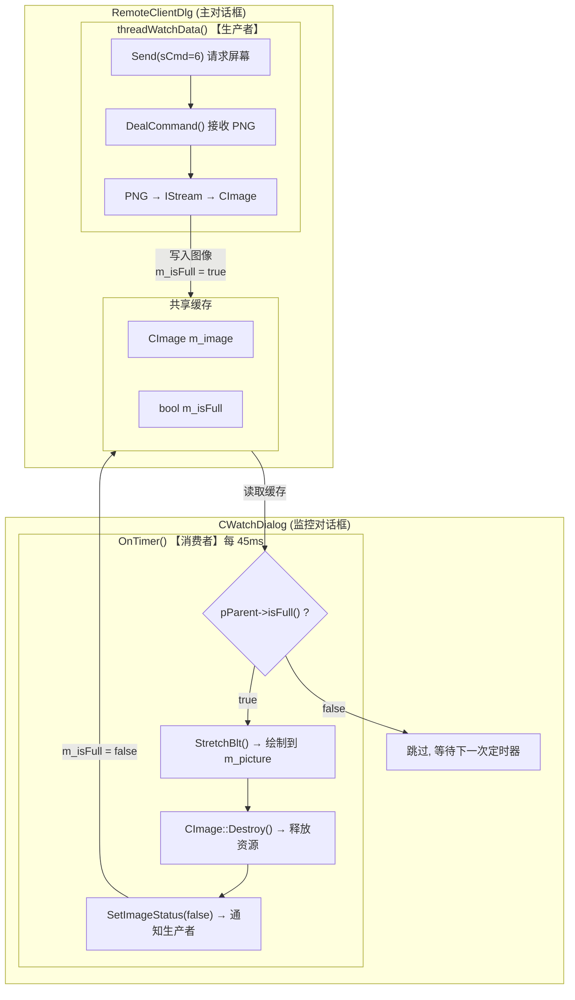
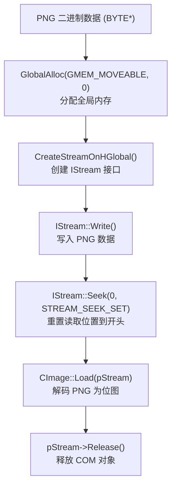
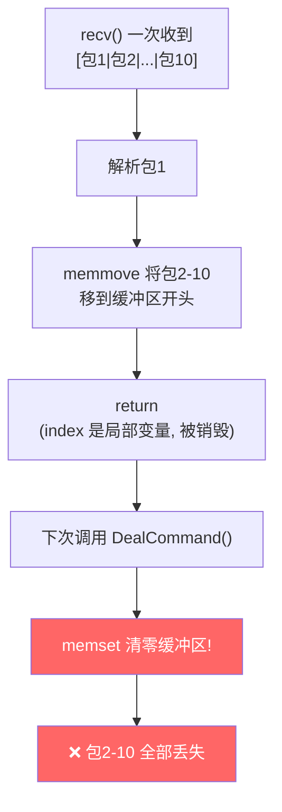
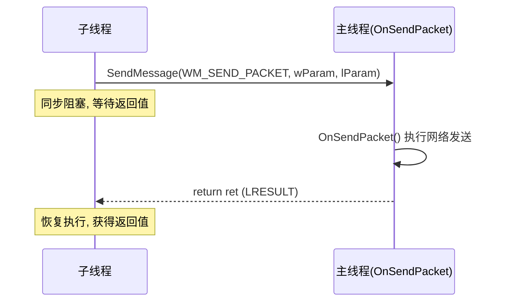
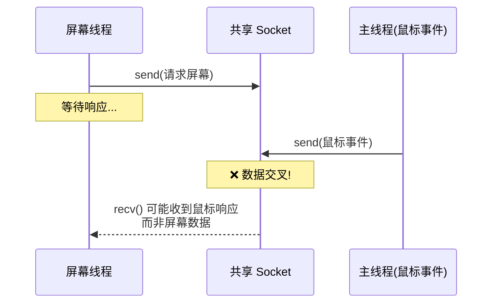

---
tags:
  - 项目/远控系统
---

# 4. 文件窃取与鼠标控制 — 章节总结

> 本章实现远控系统的三大核心能力：**文件窃取**（下载/删除/运行）、**远程桌面监控**（截屏传输与显示）、**鼠标远程控制**（事件捕获与模拟）。贯穿全章的主线是**多线程架构演进**与**网络协议复用**。

---

## 一、章节全景

### 1.1 笔记索引

| 编号 | 主题 | 核心内容 | Git Commit |
|------|------|---------|------------|
| [[4.1 文件下载功能的实现]] | 文件下载 | 控制端/被控端文件传输流程，分块传输 | `560248c` |
| [[4.2 文件和盘符显示不全bug修复]] | Bug 修复 + 新功能 | 盘符解析、TCP 粘包、删除/运行文件 | `f4ee1b8` |
| [[4.3 下载大文件]] | 多线程下载 | UI 线程分离、自定义消息 `WM_SEND_PACKET` | `033d986` |
| [[4.4 远程桌面显示功能设计与数据接收发送]] | 远程桌面框架 | 数据接收线程、生产者-消费者缓存模型 | `0adec81` |
| [[4.5 远程数据缓存及添加监控对话框]] | 图像缓存 | PNG→IStream→CImage 转换、CWatchDialog | `61c4de7` |
| [[4.6 远程桌面显示完成与Bug调试]] | 桌面显示完成 | StretchBlt 绘制、帧率控制、命令分发 | `3348297` |
| [[4.7 鼠标远程控制（控制端）]] | 鼠标捕获 | MOUSEEV 结构体、坐标转换、MFC 消息映射 | `9dc0fb3` |
| [[4.8 鼠标远程控制（被控端）与 Bug 修复]] | 鼠标模拟 | mouse_event API、nFlags 位编码、坐标修复 | `39d3d44` |
| [[4.9 搭建开发环境]] | 测试环境 | VMware NAT 配置、IP 地址转换 | `c2a6d51` |
| [[4.10 Bug 修复与远程测试环境搭建]] | 综合 Bug 修复 | Socket 竞态、坐标硬编码、线程泄漏 | `c2a6d51` |
| [[4.11 远程控制 Bug 修复与线程生命周期管理]] | 深度 Bug 分析 | 位运算符误写、线程退出机制、CImage 释放 | `c2a6d51` |
| [[4.12 锁机与解锁功能的实现]] | 锁机/解锁 | 客户端锁机和解锁控制 | `35d05a7` |

### 1.2 命令码汇总

本章涉及的所有 `sCmd` 命令码：

| sCmd | 功能 | 控制端入口 | 被控端入口 |
|------|------|-----------|-----------|
| 1 | 获取磁盘分区 | `OnBnClickedBtnFileinfo()` | `MakeDriverInfo()` |
| 2 | 获取目录文件 | `LoadFileInfo()` / `LoadFileCurrent()` | `MakeDirectoryInfo()` |
| 3 | 运行/打开文件 | `OnRunFile()` | `RunFile()` |
| 4 | 下载文件 | `OnDownloadFile()` → 线程 | `DownloadFile()` |
| 5 | 鼠标控制 | MFC鼠标消息 → `WM_SEND_PACKET` | `MouseEvent()` |
| 6 | 远程桌面 | `threadWatchData()` | `SendScreen()` |
| 9 | 删除文件 | `OnDeleteFile()` | `DeleteLocalFile()` |

---

## 二、文件窃取功能

### 2.1 文件下载流程



**关键设计**：
- 用 `long long`（8 字节）传输文件大小，支持 > 4GB 大文件
- 被控端以 1024 字节为单位分块读取，`rlen >= 1024` 继续循环
- 控制端通过累计字节数 `nCount >= nLength` 判断传输完成

### 2.2 大文件下载的多线程改造

大文件在主线程下载会导致 UI 卡死（Windows 3 秒无响应则判定"未响应"），因此将下载逻辑移到独立线程。

**核心机制**：自定义消息 `WM_SEND_PACKET`



**设计要点**：
- `SendMessage` 是**同步**的，确保主线程执行完网络发送后才继续
- `DealCommand()` 可在子线程调用——它只做数据接收，不操作 UI
- 使用 `CStatusDlg` 非模态对话框显示下载状态

### 2.3 wParam 编码规范

```cpp
wParam = (sCmd << 1) | autoClose
//  sCmd: 命令码（右移1位解码）
//  autoClose: 最低位，是否自动关闭连接
```

### 2.4 文件删除与运行

| 功能 | sCmd | 控制端 | 被控端 |
|------|------|--------|--------|
| 删除文件 | 9 | `OnDeleteFile()` → 发送路径 | `DeleteFileA()` Win32 API |
| 运行文件 | 3 | `OnRunFile()` → 发送路径 | `ShellExecute()` 打开文件 |

---

## 三、远程桌面监控

### 3.1 整体架构：生产者-消费者模型



### 3.2 PNG 数据到 CImage 的转换链

网络接收的是 PNG 二进制字节流，`CImage::Load()` 只接受文件路径或 `IStream`，因此需要**内存流桥接**：



### 3.3 帧率控制

| 角色 | 机制 | 频率 |
|------|------|------|
| 生产者（线程） | `GetTickCount64()` 计时，间隔 50ms | ~20 FPS |
| 消费者（定时器） | `SetTimer(0, 45, NULL)` | ~22 FPS |

> 消费者频率略高于生产者，避免缓存积压。

---

## 四、鼠标远程控制

### 4.1 控制端：事件捕获与封装

**MOUSEEV 结构体**（1 字节对齐）：

```cpp
#pragma pack(1)
typedef struct MouseEvent {
    WORD nAction;   // 0=单击, 1=移动, 2=双击, 3=按下, 4=弹起
    WORD nButton;   // 0=左键, 1=中键, 2=右键, 8=无按键(纯移动)
    POINT ptXY;     // 远程屏幕坐标
} MOUSEEV;
#pragma pack()
```

**坐标转换**：

```
本地监控窗口 (width0 × height0)    →    远程屏幕 (m_nObjWidth × m_nObjHeight)

远程X = 本地X × m_nObjWidth / width0
远程Y = 本地Y × m_nObjHeight / height0
```

注意：MFC 消息处理函数的 `point` 参数已是客户区坐标，`GetCursorPos()` 返回的才是屏幕坐标。通过 `isScreen` 参数区分。

**MFC 消息映射**：

| Windows 消息 | MFC 宏 | 处理函数 |
|-------------|--------|---------|
| WM_LBUTTONDBLCLK | ON_WM_LBUTTONDBLCLK | OnLButtonDblClk |
| WM_LBUTTONDOWN | ON_WM_LBUTTONDOWN | OnLButtonDown |
| WM_LBUTTONUP | ON_WM_LBUTTONUP | OnLButtonUp |
| WM_RBUTTONDOWN | ON_WM_RBUTTONDOWN | OnRButtonDown |
| WM_RBUTTONUP | ON_WM_RBUTTONUP | OnRButtonUp |
| WM_MOUSEMOVE | ON_WM_MOUSEMOVE | OnMouseMove |
| STN_CLICKED | ON_STN_CLICKED | OnStnClickedWatch |

### 4.2 被控端：事件模拟

**nFlags 位编码**：

```
nFlags = 按键类型(低4位) | 动作类型(高4位)

低4位: 0x01=左键, 0x02=右键, 0x04=中键, 0x08=无按键
高4位: 0x10=单击, 0x20=双击, 0x40=按下, 0x80=弹起
```

| nFlags | 含义 | 执行方式 |
|--------|------|---------|
| 0x11 | 左键单击 | LEFTDOWN + LEFTUP |
| 0x21 | 左键双击 | fall-through: 两次单击 |
| 0x41 | 左键按下 | LEFTDOWN |
| 0x81 | 左键弹起 | LEFTUP |
| 0x12 | 右键单击 | RIGHTDOWN + RIGHTUP |
| 0x08 | 纯移动 | MOUSEEVENTF_MOVE |

**关键 API**：
- `SetCursorPos(x, y)` — 移动光标到指定屏幕坐标
- `mouse_event(dwFlags, dx, dy, 0, GetMessageExtraInfo())` — 模拟鼠标事件

---

## 五、Bug 修复全览

本章修复了大量 Bug，这些 Bug 覆盖了网络编程、多线程、MFC UI、C 语言基础等多个维度，具有很高的学习价值。

### 5.1 Bug 分类汇总

| 类别 | Bug | 笔记 | 根因 | 修复方案 |
|------|-----|------|------|---------|
| **字符串解析** | 最后一个盘符丢失 | 4.2 | 分隔符循环结束后未处理残余 | 循环后检查 `!dr.empty()` |
| **TCP 粘包** | 文件显示不全（27→3） | 4.2 | `memset` 清零 + `index` 局部变量 | 将 `index` 改为成员变量 |
| **忘记调用** | head 包未发送 | 4.1 | 创建了 `CPacket head` 但忘记 `Send()` | 补充 `Send(head)` |
| **循环条件** | 只传输 1024 字节 | 4.1 | `while(rlen > 1024)` 永远为 false | 改为 `rlen >= 1024` |
| **运算符误写** | `!=` 写成 `\|=` | 4.8/4.11 | 比较运算符被误用为赋值 | 改为 `nFlags \|= 0x20` |
| **坐标系混淆** | ScreenToClient 重复转换 | 4.8 | MFC `point` 已是客户区坐标 | 添加 `isScreen` 参数 |
| **硬编码** | 分辨率 1920×1080 | 4.10/4.11 | 不适配其他分辨率 | 从截图动态获取 `GetWidth()/GetHeight()` |
| **线程泄漏** | 重复打开监视崩溃 | 4.10/4.11 | `for(;;)` 无退出机制 | `m_isClosed` + `WaitForSingleObject` |
| **资源泄漏** | CImage 重复加载 | 4.11 | `Load()` 前未 `Destroy()` | 先检查 `(HBITMAP)m_image != NULL` |
| **MFC 默认行为** | 回车键关闭窗口 | 4.10/4.11 | OnOK() 默认关闭对话框 | 重写 `OnOK()` 为空 |
| **线程启动顺序** | 线程比对话框先启动 | 4.6 | 线程在 `DoModal()` 前发消息 | 先创建对话框，后启动线程 |
| **Socket 竞态** | 鼠标事件时灵时不灵 | 4.10 | 短连接 + TIME_WAIT | 待改长连接（遗留问题） |

### 5.2 经典 Bug 深度剖析

#### TCP 粘包导致数据丢失

**核心问题**：`DealCommand()` 每次调用都 `memset` 清零缓冲区 + `index` 是局部变量。



**修复**：将 `index` 改为成员变量，不在每次调用时 `memset`。

#### `!=` vs `|=` 运算符误写

```cpp
// ❌ nFlags != 0x20;  — 比较结果 true/false，被丢弃
// ✅ nFlags |= 0x20;  — 按位或赋值，合并标志位
```

这个 Bug 导致双击/按下/弹起操作**全部失效**，但移动和单击正常（因为它们的 case 分支是正确的）。编译器不会报错，因为语法上合法。**预防**：开启 `/W4` 编译警告。

---

## 六、关键技术总结

### 6.1 多线程模式

本章建立了统一的线程模式——**静态入口 + 实例方法**：

```cpp
// 1. 静态入口函数（匹配 _beginthread 签名）
static void threadEntry(void* arg) {
    auto* thiz = (CRemoteClientDlg*)arg;
    thiz->threadWork();
    _endthread();
}

// 2. 实例方法（可访问所有成员）
void threadWork() {
    while (!m_isClosed) { /* 工作逻辑 */ }
}

// 3. 启动
_beginthread(threadEntry, 0, this);
```

### 6.2 跨线程通信模式



- **SendMessage**：同步调用，切换到主线程执行，返回值直接传回
- **PostMessage**：异步投递，不等待结果
- 本项目使用 `SendMessage` 因为需要网络发送的返回值

### 6.3 Win32 API 速查

| API | 用途 | 笔记 |
|-----|------|------|
| `_beginthread` / `_endthread` | 创建/终止线程 | 4.3 |
| `SendMessage` / `PostMessage` | 窗口消息发送 | 4.3 |
| `WaitForSingleObject` | 等待线程退出 | 4.11 |
| `GetTickCount64` | 高精度时间戳 | 4.6 |
| `GlobalAlloc` + `CreateStreamOnHGlobal` | 内存流桥接 | 4.5 |
| `CImage::Load` / `StretchBlt` / `Destroy` | 图像加载/绘制/释放 | 4.5/4.6 |
| `mouse_event` | 模拟鼠标操作 | 4.8 |
| `SetCursorPos` | 设置光标位置 | 4.8 |
| `ScreenToClient` | 坐标系转换 | 4.7 |
| `SetTimer` / `OnTimer` | MFC 定时器 | 4.6 |
| `DeleteFileA` | 删除文件 | 4.2 |
| `CFileDialog` | 文件对话框 | 4.1 |

---

## 七、架构反思与遗留问题

### 7.1 短连接 vs 长连接

当前架构使用**短连接模式**（每次命令后关闭 Socket），不适合实时控制场景：
- `CloseClient()` / `CloseSocket()` 导致 TCP TIME_WAIT
- 后续 `connect()` 可能失败或超时
- **第一次操作成功，后续不稳定**

**推荐改进**：监视期间保持长连接，关闭监视时才断开。

### 7.2 多线程数据交叉

屏幕获取线程和鼠标事件共用同一个 Socket：



**改进方向**：互斥锁串行化发送，或为屏幕/鼠标使用独立连接。

### 7.3 线程安全

`m_isFull` 标志的读写缺乏同步保护。虽然 `bool` 在 x86 上读写是原子的，但严格来说应使用 `std::atomic<bool>`。

### 7.4 UI 与网络耦合

`CWatchDialog` 通过 `GetParent()` 强转访问父对话框——紧耦合，难以复用和测试。改进方向：使用接口 (`IPacketSender`) 或回调函数解耦。

---

## 八、本章核心收获

| 维度 | 收获 |
|------|------|
| **网络编程** | TCP 粘包处理、分块传输协议、短连接 vs 长连接 |
| **多线程** | UI 线程分离、静态入口模式、线程生命周期管理、协作式退出 |
| **跨线程通信** | `WM_SEND_PACKET` 自定义消息、`SendMessage` 同步调用 |
| **图像处理** | PNG→IStream→CImage 转换链、StretchBlt 缩放绘制 |
| **设计模式** | 生产者-消费者（缓存刷新）、单例模式（CClientSocket） |
| **Bug 调试** | 运算符误写、坐标系混淆、线程竞态、资源泄漏 |
| **MFC 框架** | 消息映射、DDX 数据交换、定时器、非模态对话框 |
