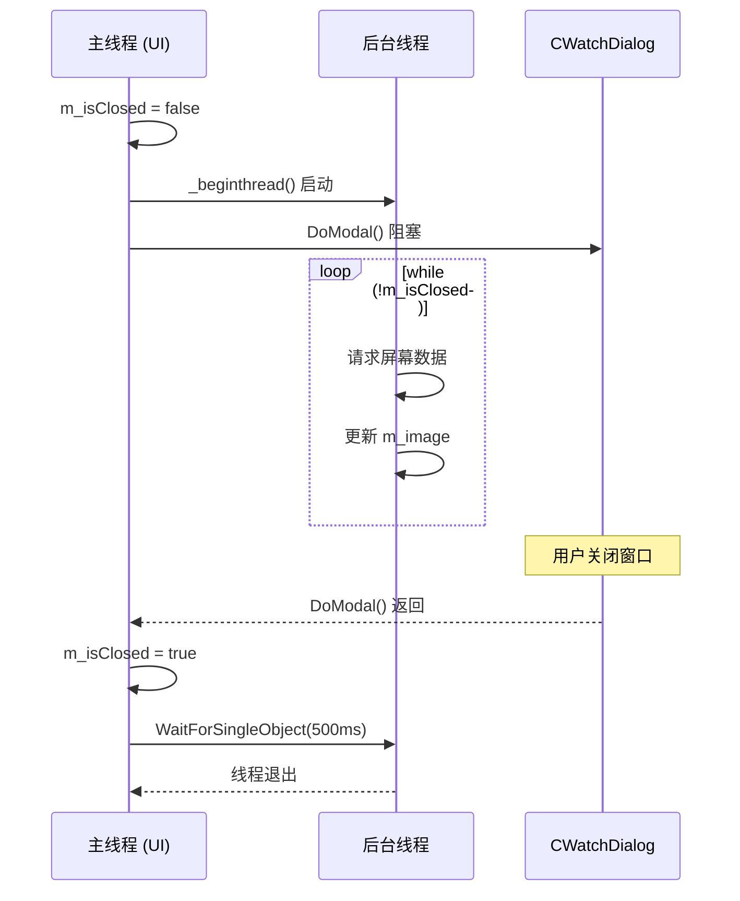

---
tags:
  - 项目/远控系统
git: "c2a6d51"
git_msg: "修复坐标硬编码、位运算符误写、线程生命周期、MFC默认行为等bug"
git_note: "与 4.9、4.10 同属此 commit，本篇为深入 bug 分析"
---

> 修复远程鼠标控制中的四个关键 Bug：坐标计算硬编码、位运算符误写、线程生命周期失控、MFC 对话框默认行为干扰。

---

## 功能概述

| 修复项 | 问题 | 影响 |
|--------|------|------|
| **坐标计算** | 硬编码 1920×1080 | 非标准分辨率下鼠标位置偏移 |
| **位运算符** | `!=` 误写为 `\|=` | 双击/按下/弹起操作完全失效 |
| **线程崩溃** | 无退出机制 + 资源泄漏 | 重复打开监视窗口导致崩溃 |
| **回车关闭** | MFC 默认 OnOK 行为 | 误触回车导致监视窗口关闭 |

---

## 设计背景

### 问题复现

在 [[4.8 鼠标远程控制（被控端）与 Bug 修复]] 完成后，实际测试中发现以下问题：

**问题 1：坐标偏移**
```
场景：被控端分辨率为 1366×768
现象：点击监视窗口右下角，被控端鼠标却跑到屏幕中间
原因：坐标转换公式硬编码了 1920×1080
```

**问题 2：鼠标操作失效**
```
场景：双击、按下、弹起操作
现象：被控端毫无反应
原因：被控端 MouseEvent() 中 nFlags != 0x20 是比较而非赋值
```

**问题 3：重复打开崩溃**
```
场景：关闭监视窗口后再次打开
现象：程序崩溃或图像显示异常
原因：后台线程未退出 + CImage 未释放
```

**问题 4：误触关闭**
```
场景：监视窗口获得焦点时按回车
现象：窗口立即关闭
原因：MFC 对话框默认将回车映射到 OnOK()
```

---

## 架构设计

### Bug 1：坐标计算流程

```
修复前：
┌─────────────────────────────────────────────────────────┐
│  UserPoint2RemoteScreenPoint(point)                     │
│  ├── 获取本地控件尺寸: width0, height0                    │
│  ├── 硬编码远程尺寸: width=1920, height=1080  ← 问题所在   │
│  └── 返回: point × (1920/width0, 1080/height0)          │
└─────────────────────────────────────────────────────────┘

修复后：
┌─────────────────────────────────────────────────────────┐
│  OnTimer() 首次接收图像时                                 │
│  ├── m_nObjWidth = pParent->GetImage().GetWidth()       │
│  └── m_nObjHeight = pParent->GetImage().GetHeight()     │
│                          ↓                              │
│  UserPoint2RemoteScreenPoint(point)                     │
│  ├── 获取本地控件尺寸: clientRect.Width/Height()          │
│  └── 返回: point × (m_nObjWidth/本地宽, m_nObjHeight/本地高)│
└─────────────────────────────────────────────────────────┘
```

### Bug 3：线程生命周期



---

## 核心实现

### 1. 动态获取远程屏幕尺寸

**设计思路**：从接收到的屏幕截图中提取实际分辨率，而非硬编码。截图的宽高就是被控端的屏幕分辨率。

**技术栈**：
- `CImage::GetWidth()/GetHeight()`：获取图像实际尺寸
- 成员变量延迟初始化：首次有效时才赋值

> 📁 `RemoteClient/CWatchDialog.h` : 新增成员变量

```cpp
public:
    int m_nObjWidth;    // 远程桌面宽度（从截图获取）
    int m_nObjHeight;   // 远程桌面高度（从截图获取）
```

> 📁 `RemoteClient/CWatchDialog.cpp` : 构造函数初始化

```cpp
CWatchDialog::CWatchDialog(CWnd* pParent /*=nullptr*/)
    : CDialog(IDD_DIG_WATCH, pParent)
{
    // ===== 初始化为 -1 表示"尚未获取" =====
    // 不能初始化为 0，因为 0 会导致除零错误
    m_nObjWidth = -1;
    m_nObjHeight = -1;
}
```

> 📁 `RemoteClient/CWatchDialog.cpp` : OnTimer 中获取实际尺寸 (行 81-92)

```cpp
void CWatchDialog::OnTimer(UINT_PTR nIDEvent)
{
    if (nIDEvent == 0)
    {
        CRemoteClientDlg* pParent = (CRemoteClientDlg*)GetParent();
        if (pParent->isFull())
        {
            CRect rect;
            m_picture.GetWindowRect(rect);

            // ===== 首次获取远程屏幕尺寸 =====
            // 只在第一次有效图像到达时获取，后续不再更新
            // 这样可以避免每帧都调用 GetWidth/GetHeight
            if (m_nObjWidth == -1)
            {
                m_nObjWidth = pParent->GetImage().GetWidth();
            }
            if (m_nObjHeight == -1)
            {
                m_nObjHeight = pParent->GetImage().GetHeight();
            }

            // ===== 缩放绘制到本地控件 =====
            pParent->GetImage().StretchBlt(
                m_picture.GetDC()->GetSafeHdc(),
                0, 0,
                rect.Width(), rect.Height(),
                SRCCOPY);

            m_picture.InvalidateRect(NULL);
            pParent->GetImage().Destroy();
        }
    }
    CDialog::OnTimer(nIDEvent);
}
```

**关键点**：
1. **延迟初始化**：只在首次收到有效图像时获取尺寸，避免空图像导致错误
2. **一次性获取**：假设远程分辨率在会话期间不变，只获取一次提高效率
3. **-1 作为哨兵值**：明确区分"未初始化"和"有效值"

---

### 2. 坐标转换函数重构

> 📁 `RemoteClient/CWatchDialog.cpp` : UserPoint2RemoteScreenPoint (行 46-60)

```cpp
CPoint CWatchDialog::UserPoint2RemoteScreenPoint(CPoint& point, bool isScreen = false)
{
    CRect clientRect;

    // ===== 坐标系转换（仅当传入屏幕坐标时） =====
    if (isScreen)
    {
        // GetCursorPos() 返回屏幕坐标，需要转换为客户区坐标
        ScreenToClient(&point);
    }
    // MFC 消息处理函数的 point 参数已经是客户区坐标，无需转换

    // ===== 获取本地图片控件尺寸 =====
    m_picture.GetWindowRect(clientRect);

    // ===== 比例映射：本地坐标 → 远程坐标 =====
    // 公式：远程坐标 = 本地坐标 × (远程尺寸 / 本地尺寸)
    return CPoint(
        point.x * m_nObjWidth / clientRect.Width(),
        point.y * m_nObjHeight / clientRect.Height()
    );
}
```

**对比修复前后**：

```cpp
// ❌ 修复前：硬编码分辨率
int width = 1920, height = 1080;  // 假设所有被控端都是 1080p
int x = point.x * width / width0;
int y = point.y * height / height0;
return CPoint(x, y);

// ✅ 修复后：使用实际分辨率
return CPoint(
    point.x * m_nObjWidth / clientRect.Width(),
    point.y * m_nObjHeight / clientRect.Height()
);
```

---

### 3. 鼠标事件有效性保护

**设计思路**：在尺寸未获取前（m_nObjWidth == -1），坐标转换会产生错误结果。因此所有鼠标事件处理函数都需要增加前置检查。

> 📁 `RemoteClient/CWatchDialog.cpp` : OnLButtonDown 示例 (行 114-128)

```cpp
void CWatchDialog::OnLButtonDown(UINT nFlags, CPoint point)
{
    // ===== 有效性检查 =====
    // 只有当远程尺寸已获取时，才处理鼠标事件
    // 防止在首帧图像到达前的误操作
    if ((m_nObjWidth != -1) && (m_nObjHeight != -1))
    {
        TRACE("x=%d y=%d\r\n", point.x, point.y);

        // 坐标转换
        CPoint remote = UserPoint2RemoteScreenPoint(point);
        TRACE("remote: x=%d y=%d\r\n", remote.x, remote.y);

        // 封装鼠标事件
        MOUSEEV event;
        event.ptXY = remote;
        event.nButton = 0;   // 左键
        event.nAction = 2;   // 按下

        // 通过父对话框发送
        CRemoteClientDlg* pParent = (CRemoteClientDlg*)GetParent();
        pParent->SendMessage(WM_SEND_PACKET, 5 << 1 | 1, (WPARAM)&event);
    }

    CDialog::OnLButtonDown(nFlags, point);
}
```

**所有需要保护的函数**：

| 函数 | nButton | nAction |
|------|---------|---------|
| OnLButtonDblClk | 0 | 2 (双击) |
| OnLButtonDown | 0 | 2 (按下) |
| OnLButtonUp | 0 | 3 (弹起) |
| OnRButtonDblClk | 1 | 1 (双击) |
| OnRButtonDown | 1 | 2 (按下) |
| OnRButtonUp | 1 | 3 (弹起) |
| OnMouseMove | 8 | 0 (移动) |
| OnStnClickedWatch | 0 | 0 (单击) |

---

### 4. 被控端位运算符修复

**问题根源**：C/C++ 中 `!=` 是比较运算符，返回 bool 值后被丢弃；`|=` 才是按位或赋值运算符。

> 📁 `RemoteCtrl/RemoteCtrl.cpp` : MouseEvent (行 203-213)

```cpp
// ===== 解析动作类型并设置标志位 =====
switch (mouse.nAction)
{
case 0: // 单击
    nFlags |= 0x10;
    break;
case 1: // 双击
    // ❌ 修复前：nFlags != 0x20;  // 比较运算，结果被丢弃！
    // ✅ 修复后：
    nFlags |= 0x20;  // 按位或赋值，将 0x20 合并到 nFlags
    break;
case 2: // 按下
    // ❌ 修复前：nFlags != 0x40;
    // ✅ 修复后：
    nFlags |= 0x40;
    break;
case 3: // 放开
    // ❌ 修复前：nFlags != 0x80;
    // ✅ 修复后：
    nFlags |= 0x80;
    break;
default:
    break;
}
```

**Bug 影响分析**：

```
nFlags 编码规则：低4位=按键类型，高4位=动作类型

正确执行：
  nFlags = 0x01 (左键)
  nFlags |= 0x40 (按下)
  结果：nFlags = 0x41 → 触发 case 0x41: 左键按下

错误执行：
  nFlags = 0x01 (左键)
  nFlags != 0x40  → 比较结果 true，但未赋值给 nFlags！
  结果：nFlags = 0x01 → 无法匹配任何 case
```

---

### 5. 线程生命周期管理

**问题分析**：
1. `_beginthread` 创建的线程使用 `for(;;)` 无限循环
2. 对话框关闭后线程仍在运行，访问已销毁的对象
3. 再次打开对话框时，旧线程与新线程并存

> 📁 `RemoteClient/RemoteClientDlg.h` : 新增关闭标志

```cpp
private:
    CImage m_image;     // 缓存
    bool m_isFull;      // 缓存是否有数据
    bool m_isClosed;    // 监视是否关闭（线程退出标志）
```

> 📁 `RemoteClient/RemoteClientDlg.cpp` : OnBnClickedBtnStartWatch (行 601-612)

```cpp
void CRemoteClientDlg::OnBnClickedBtnStartWatch()
{
    // ===== 1. 重置关闭标志 =====
    m_isClosed = false;

    // ===== 2. 创建监视对话框 =====
    CWatchDialog dlg(this);

    // ===== 3. 启动后台线程 =====
    // 保存线程句柄，用于后续等待
    HANDLE hThread = (HANDLE)_beginthread(
        CRemoteClientDlg::threadEntryForWatchData,
        0,
        this
    );

    // ===== 4. 显示模态对话框（阻塞） =====
    // 此处阻塞，直到用户关闭对话框
    dlg.DoModal();

    // ===== 5. 通知线程退出 =====
    m_isClosed = true;

    // ===== 6. 等待线程结束 =====
    // 超时 500ms，防止死锁
    WaitForSingleObject(hThread, 500);
}
```

> 📁 `RemoteClient/RemoteClientDlg.cpp` : threadWatchData 循环条件 (行 258-265)

```cpp
void CRemoteClientDlg::threadWatchData()
{
    Sleep(50);  // 等待对话框初始化

    CClientSocket* pClient = NULL;
    do {
        pClient = CClientSocket::getInstance();
    } while (pClient == NULL);

    ULONGLONG tick = GetTickCount64();

    // ===== 修复：使用关闭标志控制循环 =====
    // 修复前：for (;;)  // 无限循环，无法退出
    // 修复后：
    while (!m_isClosed)
    {
        // 限制请求频率
        if (GetTickCount64() - tick < 50)
        {
            Sleep(1);
            continue;
        }
        tick = GetTickCount64();

        // ... 请求和处理屏幕数据 ...
    }
}
```

---

### 6. CImage 资源释放

**问题**：`CImage::Load()` 前如果已有图像数据，需要先释放，否则内存泄漏。

> 📁 `RemoteClient/RemoteClientDlg.cpp` : threadWatchData 图像加载 (行 296-300)

```cpp
// ===== 加载新图像前先释放旧图像 =====
// (HBITMAP)m_image 检查是否有已加载的位图
// 如果有，必须先调用 Destroy() 释放，否则内存泄漏
if ((HBITMAP)m_image != NULL)
    m_image.Destroy();

// 从流中加载新图像
m_image.Load(pStream);
m_isFull = true;
```

**CImage 内存模型**：

```
CImage 对象
    │
    └── 内部持有 HBITMAP 句柄 ──→ GDI 位图对象（系统资源）

Load() 行为：
  1. 解析图像数据
  2. 创建新的 HBITMAP
  3. 将新句柄赋给内部变量

问题：如果之前已有 HBITMAP，旧句柄丢失 → 内存泄漏

正确做法：
  if (已有位图) Destroy();  // 先释放旧的
  Load(新数据);             // 再加载新的
```

---

### 7. 阻止回车键关闭对话框

**MFC 对话框默认行为**：
- 按 Enter 键 → 调用 `OnOK()` → 关闭对话框
- 按 ESC 键 → 调用 `OnCancel()` → 关闭对话框

> 📁 `RemoteClient/CWatchDialog.h` : 声明 OnOK

```cpp
public:
    virtual void OnOK();  // 重写以阻止默认行为
```

> 📁 `RemoteClient/CWatchDialog.cpp` : OnOK 实现 (行 246-252)

```cpp
void CWatchDialog::OnOK()
{
    // ===== 重写 OnOK，阻止回车键关闭窗口 =====
    // 默认实现会调用 EndDialog(IDOK)，关闭对话框
    // 注释掉基类调用，使回车键无效

    // CDialog::OnOK();  // 不调用基类！
}
```

**为什么不能简单删除 OnOK？**

MFC 框架通过消息映射自动处理 IDOK 按钮和回车键：
1. 对话框有默认按钮（`BS_DEFPUSHBUTTON` 样式）
2. 按回车时，框架发送 `BN_CLICKED` 通知给默认按钮
3. 如果没有默认按钮，框架直接调用 `OnOK()`

必须显式重写并置空，才能阻止这一行为。

---

## Win32 API 详解

### WaitForSingleObject - 等待内核对象

```cpp
DWORD WaitForSingleObject(
    HANDLE hHandle,        // 要等待的对象句柄
    DWORD  dwMilliseconds  // 超时时间（毫秒）
);
```

| 参数 | 说明 |
|------|------|
| hHandle | 线程/进程/事件/互斥体等内核对象的句柄 |
| dwMilliseconds | `INFINITE` 表示无限等待；其他值表示超时毫秒数 |

| 返回值 | 含义 |
|--------|------|
| WAIT_OBJECT_0 | 对象变为有信号状态（线程已退出） |
| WAIT_TIMEOUT | 超时，对象仍未变为有信号状态 |
| WAIT_FAILED | 函数失败，调用 GetLastError() 获取原因 |

**本项目用法**：
```cpp
// 等待线程退出，最多 500ms
// 防止线程卡死导致主程序无响应
WaitForSingleObject(hThread, 500);
```

### CImage::GetWidth / GetHeight

```cpp
int GetWidth() const throw();   // 返回图像宽度（像素）
int GetHeight() const throw();  // 返回图像高度（像素）
```

**注意**：空图像调用这些方法行为未定义，应先检查图像是否有效。

---

## 易错点与调试

> [!warning] 常见错误

### 1. `!=` 与 `|=` 混淆

这是本次最严重的 Bug，属于"编译通过但逻辑错误"的典型案例。

```cpp
// ❌ 错误：比较运算符，结果被丢弃
nFlags != 0x20;  // 等价于 (nFlags != 0x20); 无任何效果

// ✅ 正确：按位或赋值
nFlags |= 0x20;  // 等价于 nFlags = nFlags | 0x20;
```

**预防措施**：
- 开启编译器警告：`/W4` 会警告"表达式结果未使用"
- Code Review 时特别关注位运算

### 2. 线程退出时机

```cpp
// ❌ 错误：先销毁对话框，再设置标志
dlg.DoModal();
// 此时线程可能还在访问 pParent（已销毁）
m_isClosed = true;

// ✅ 正确：设置标志后等待线程真正退出
dlg.DoModal();
m_isClosed = true;
WaitForSingleObject(hThread, 500);  // 确保线程已退出
```

### 3. CImage 重复加载

```cpp
// ❌ 错误：直接加载，内存泄漏
m_image.Load(pStream);  // 如果 m_image 已有数据，旧数据泄漏

// ✅ 正确：先销毁再加载
if ((HBITMAP)m_image != NULL)
    m_image.Destroy();
m_image.Load(pStream);
```

### 4. 延迟初始化的哨兵值

```cpp
// ❌ 错误：用 0 作为"未初始化"标志
m_nObjWidth = 0;  // 如果忘记初始化就使用，除零崩溃！

// ✅ 正确：用 -1 作为哨兵值
m_nObjWidth = -1;  // 明确表示"未初始化"
if (m_nObjWidth == -1) { /* 初始化 */ }
if (m_nObjWidth != -1) { /* 安全使用 */ }
```

---

## 关联知识

- [[4.7 鼠标远程控制（控制端）]] - 鼠标事件捕获、MOUSEEV 结构体定义
- [[4.8 鼠标远程控制（被控端）与 Bug 修复]] - mouse_event API、nFlags 编码规则
- [[4.5 远程数据缓存及添加监控对话框]] - CImage 缓存机制、OnTimer 定时刷新
- [[2.3 设计网络传输包协议]] - CPacket 协议封装

---

## 代码索引

| 功能 | 文件 | 位置 |
|------|------|------|
| m_nObjWidth/Height 声明 | CWatchDialog.h | 行 21-22 |
| 构造函数初始化 | CWatchDialog.cpp | 行 16-17 |
| 动态获取远程尺寸 | CWatchDialog.cpp | 行 83-90 |
| 坐标转换函数 | CWatchDialog.cpp | 行 46-60 |
| 鼠标事件有效性检查 | CWatchDialog.cpp | 行 104-150 |
| OnOK 重写 | CWatchDialog.cpp | 行 246-252 |
| m_isClosed 声明 | RemoteClientDlg.h | 行 41 |
| 线程启动与等待 | RemoteClientDlg.cpp | 行 601-612 |
| 线程循环条件 | RemoteClientDlg.cpp | 行 260 |
| CImage 释放 | RemoteClientDlg.cpp | 行 298-299 |
| 位运算符修复 | RemoteCtrl.cpp | 行 206-213 |

---

## 遗留问题：Socket 生命周期竞态

> [!bug] 尚未修复
> 本次提交修复了 4 个 Bug，但 **鼠标事件"时灵时不灵"** 的问题尚未彻底解决。根本原因是短连接架构不适应实时控制场景。

### 问题现象

```
第一次操作：✓ 成功
后续操作：  ✗ 时灵时不灵，有时无响应
```

### 根因分析

当前架构使用**短连接模式**：每次命令执行后双方都关闭 Socket。

```
┌─────────────────────────────────────────────────────────────────┐
│ 问题时序                                                         │
├─────────────────────────────────────────────────────────────────┤
│                                                                  │
│ T0: 控制端发送鼠标事件                                            │
│     └─ InitSocket() → connect() → send() → recv()               │
│                                                                  │
│ T1: 被控端处理完成                                                │
│     └─ MouseEvent() → Send(ACK) → CloseClient() ← 关闭连接！     │
│                                                                  │
│ T2: 控制端收到响应                                                │
│     └─ DealCommand() → CloseSocket() ← 再次关闭！                │
│                                                                  │
│ T3: 用户再次移动鼠标                                              │
│     └─ connect() → 可能失败（TIME_WAIT 状态）                    │
│                                                                  │
└─────────────────────────────────────────────────────────────────┘
```

**关键代码位置**：

| 位置 | 文件 | 行为 |
|------|------|------|
| 被控端 | `RemoteCtrl.cpp:523` | `pserver->CloseClient()` 每次命令后关闭 |
| 控制端 | `RemoteClientDlg.cpp:87` | `pClient->CloseSocket()` 每次响应后关闭 |

### TCP TIME_WAIT 问题

```
连接关闭后：
┌────────────────────────────────────────────────────────────┐
│  TIME_WAIT 状态 (持续 30秒 ~ 2分钟)                         │
│  ├── 端口被占用，无法立即重用                               │
│  ├── 新的 connect() 可能失败或超时                         │
│  └── 导致后续鼠标操作无法及时发送                           │
└────────────────────────────────────────────────────────────┘
```

### 为什么第一次总是成功？

```
程序启动后首次操作：
  ✓ 端口全新，无 TIME_WAIT
  ✓ 被控端正在 listen()，立即 accept
  ✓ 三次握手完成，命令执行

首次操作后：
  ✗ 连接进入 TIME_WAIT
  ✗ 端口短时间内无法重用
  ✗ 后续 connect() 可能失败
```

### 解决方案（待实现）

| 方案 | 说明 | 复杂度 |
|------|------|--------|
| **长连接模式** | 建立连接后保持，直到用户关闭监视 | ★★☆ |
| **SO_REUSEADDR** | 设置 socket 选项允许端口快速重用 | ★☆☆ |
| **连接池** | 预先建立多个连接，轮询使用 | ★★★ |
| **心跳保活** | 定期发送心跳包防止连接被中间设备断开 | ★★☆ |

**推荐方案**：改用长连接模式

```cpp
// 控制端：监视期间保持连接
void CRemoteClientDlg::OnBnClickedBtnStartWatch()
{
    // 建立连接（仅一次）
    if (!pClient->IsConnected())
        pClient->InitSocket();

    CWatchDialog dlg(this);
    dlg.DoModal();

    // 关闭监视时才断开
    pClient->CloseSocket();
}

// 被控端：不要每次命令后关闭
// 删除 pserver->CloseClient();
```

### 多线程数据交叉问题

当前还存在另一个隐患：**屏幕获取线程**和**鼠标事件**共用同一个 Socket。

```
屏幕线程                    主线程
    │                         │
    │  send(请求屏幕)          │
    │       ↓                 │
    │   等待响应...            │  ← 用户此时点击鼠标
    │       ↓                 │  send(鼠标事件)
    │   recv() ← 可能收到鼠标响应而非屏幕数据！
```

**解决方向**：
- 使用互斥锁串行化发送
- 或为屏幕和鼠标使用独立连接

> 📎 详见 [[4.9 搭建开发环境]] 中的完整分析

---

## 更新记录

| 日期 | Commit | 变更 |
|------|--------|------|
| 2026-01-27 | `c2a6d51` | 修复坐标计算、位运算符、线程崩溃、回车关闭四个 Bug |
| 2026-01-27 | - | 补充遗留问题：Socket 生命周期竞态分析 |
