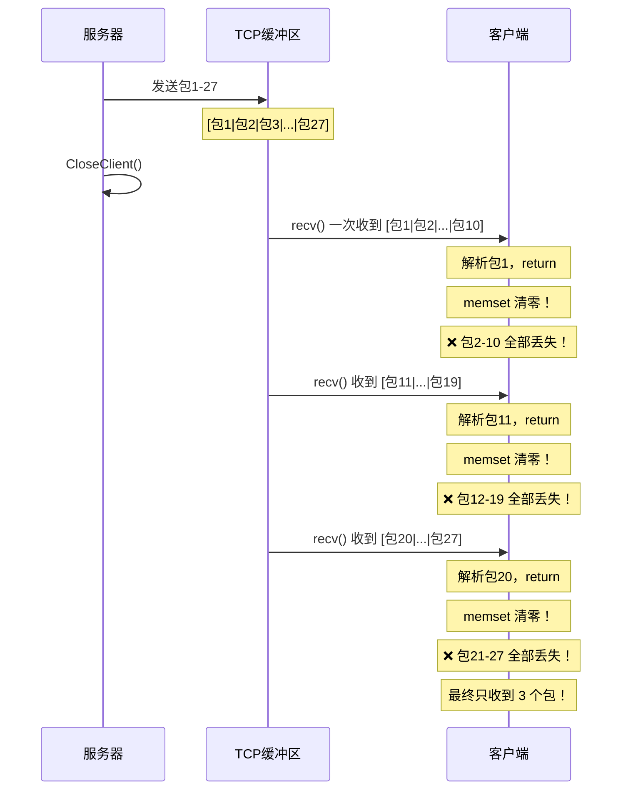

---
tags:
  - 项目/远控系统
git: "f4ee1b8"
git_msg: "解决文件夹中显示的Bug，会缺漏文件"
---

> 修复文件浏览器中盘符缺失、文件显示不全的问题，并新增删除文件、运行文件功能。

---

## 功能概述

| 项目 | 说明 |
|------|------|
| **修复内容** | 盘符显示不全、文件列表缺漏 |
| **新增功能** | 删除文件 (sCmd=9)、运行文件 (sCmd=3) |
| **根本原因** | 字符串解析逻辑不完整、TCP 粘包导致数据丢失 |

---

## Bug 1：最后一个盘符缺失

### 问题描述

获取磁盘分区信息时，服务端返回 `"C,D"` 格式的字符串，但控制端只显示 C 盘，D 盘丢失。

### 原因分析

原代码使用逗号作为分隔符，但**最后一个盘符后面没有逗号**：

```
服务端返回: "C,D"
           ↑    ↑
          有逗号  无逗号，被忽略
```

**原代码逻辑**：

```cpp
for (size_t i = 0; i < drivers.size(); i++)
{
    if (drivers[i] == ',')        // 遇到逗号 → 说明前面累积的是一个完整盘符
    {
        dr += ":";                // 拼接为 "C:" 格式
        // 插入树控件根节点，如 "C:"
        HTREEITEM hTemp = m_Tree.InsertItem(dr.c_str(), TVI_ROOT, TVI_LAST);
        // 插入一个空子节点，让树节点显示可展开的 "+"
        m_Tree.InsertItem(NULL, hTemp, TVI_LAST);
        dr.clear();               // 清空，准备累积下一个盘符
        continue;                 // 跳过逗号，不累积到 dr
    }
    dr += drivers[i];             // 非逗号字符累积到 dr（如 'C'、'D'）
}
// 循环结束，dr="D" 但没有被处理！
// 因为 "D" 后面没有逗号，if 分支永远不会触发
```

### 修复方案

> 📁 `RemoteClient/RemoteClientDlg.cpp` : OnBnClickedBtnFileinfo (行 232-239)

在循环结束后，检查 `dr` 是否非空，若非空则处理最后一个盘符：

```cpp
void CRemoteClientDlg::OnBnClickedBtnFileinfo()
{
    // ... 原有循环代码 ...

    for (size_t i = 0; i < drivers.size(); i++)
    {
        if (drivers[i] == ',')
        {
            dr += ":";
            HTREEITEM hTemp = m_Tree.InsertItem(dr.c_str(), TVI_ROOT, TVI_LAST);
            m_Tree.InsertItem(NULL, hTemp, TVI_LAST);
            dr.clear();
            continue;
        }
        dr += drivers[i];
    }

    // ===== 新增：处理最后一个盘符 =====
    // 字符串 "C,D" 中，D 后面没有逗号，循环结束时 dr="D"
    if (!dr.empty())
    {
        dr += ":";
        HTREEITEM hTemp = m_Tree.InsertItem(dr.c_str(), TVI_ROOT, TVI_LAST);
        m_Tree.InsertItem(NULL, hTemp, TVI_LAST);
    }
}
```

**修复原理**：

| 处理阶段 | dr 的值 | 动作 |
|---------|--------|------|
| 遇到 `C` | `"C"` | 累积 |
| 遇到 `,` | `"C"` → 清空 | 插入 "C:" 节点 |
| 遇到 `D` | `"D"` | 累积 |
| 循环结束 | `"D"` | **新增**：插入 "D:" 节点 |

---

## Bug 2：文件显示不全（TCP 粘包问题）

### 问题现象

服务端发送 27 个文件信息包，客户端只收到 3 个。

### 调试日志分析

```
server:count = 27          ← 服务器发送了 27 个包
Command has done!          ← 服务器执行完毕，关闭连接
...
ack:2  [$Recycle.Bin]      ← 客户端收到第 1 个
ack:2  [.ADSPOWER_GLOBAL]  ← 客户端收到第 2 个
ack:2  [Output.txt]        ← 客户端收到第 3 个
ack:-1                     ← recv 失败，循环终止
Count = 3                  ← 只收到 3 个
```

### 根本原因：TCP 粘包 + memset 清零

TCP 是**流式协议**，多个数据包可能被合并成一次 `recv()`。问题出在 `DealCommand()` 的实现：



**问题代码**：

```cpp
int DealCommand()
{
    char* buffer = m_buffer.data();
    memset(buffer, 0, BUFFER_SIZE);  // ❌ 清空了上次剩余的数据
    size_t index = 0;                 // ❌ 局部变量，每次都从0开始
    while (true)
    {
        // 1. 接收数据，追加到 buffer + index
        size_t len = recv(m_sock, buffer + index, BUFFER_SIZE - index, 0);
        if (len <= 0) return -1;

        index += len;        // 更新有效数据长度
        len = index;         // len 现在表示可解析的总数据量

        // 2. 用 CPacket 构造函数解析一个包
        //    内部流程：搜索包头 0xFEFF → 读 nLength → 读 sCmd
        //            → 读 strData → 读 sSum → 校验和验证
        //    解析成功：len = 已消费字节数
        //    解析失败：len = 0，继续 recv
        m_packet = CPacket((BYTE*)buffer, len);

        if (len > 0)
        {
            // 3. 移除已解析的数据，保留剩余部分
            memmove(buffer, buffer + len, BUFFER_SIZE - len);
            index -= len;             // 计算了新的 index
            return m_packet.sCmd;     // ❌ 但 return 后 index 丢失！
        }
        // len == 0 表示包不完整，继续循环接收
    }
}
```

**结论**：每次 `recv()` 可能收到约 9 个包，但只处理 1 个，丢失 8 个。三次 recv 就只收到 3 个。

### 关键变量解析

问题代码中 `len`、`index`、`BUFFER_SIZE` 容易混淆，逐个拆解：

| 变量 | 含义 | 性质 |
|------|------|------|
| `BUFFER_SIZE` | 缓冲区**总容量** | 固定常量 `4096` |
| `index` | 缓冲区中**有效数据的字节数** | 随 recv/解析动态变化 |
| `len` | 在代码中被**反复赋值**，不同阶段含义不同 | 见下表 |

**`len` 的三次变身**：

```cpp
// ① len = 本次 recv 收到的字节数
size_t len = recv(m_sock, buffer + index, BUFFER_SIZE - index, 0);

// ② len 被改写为 index（缓冲区总有效数据量）
index += len;
len = index;

// ③ len 被 CPacket 构造函数改写为"解析一个包消费了多少字节"
m_packet = CPacket((BYTE*)buffer, len);
//   解析成功 → len = 已消费字节数
//   解析失败 → len = 0
```

### memmove 做了什么

`memmove(buffer, buffer + len, BUFFER_SIZE - len)` 的作用是**把已解析的包"剪掉"，剩余数据挪到缓冲区开头**：

![[Pasted image 20260305155813.png]]

> [!tip] 为什么搬 `BUFFER_SIZE - len` 而不是 `index - len`？
> 实际有效数据只有 `index - len = 200` 字节，但代码搬了 `BUFFER_SIZE - len = 3996` 字节。这是偷懒写法——多搬的部分全是 0，不会出错，只是多做了无用功。精确写法应为 `memmove(buffer, buffer + len, index - len)`。

> [!tip] 为什么用 `memmove` 而不是 `memcpy`？
> 源 (`buffer + len`) 和目标 (`buffer`) 在**同一块内存中且有重叠**。`memcpy` 在内存重叠时行为未定义，`memmove` 保证重叠时也能正确搬运。

### Bug 因果链

`memmove` 本身逻辑正确，包2、包3 确实被搬到了缓冲区开头，`index` 也正确更新为 200。**但紧接着 `return`**，`index` 作为局部变量被销毁。下次调用 `DealCommand()` 时：

1. `memset(buffer, 0, BUFFER_SIZE)` → 包2、包3 被清零
2. `index = 0` → 从头开始，之前的搬运成果全部白费

**memmove 做了正确的事，但它的成果被 `return` + `memset` 彻底毁掉了。**

> [!note] 修复方案
> 将 `index` 改为成员变量，不要在每次调用时 `memset` 清零。
> 或者在解析完一个包后继续检查缓冲区是否还有完整的包。

---

## 新增功能：删除文件 (sCmd=9)

### 整体流程

```
┌─────────────────────────────────────────────────────────────┐
│                      控制端 (Client)                         │
├─────────────────────────────────────────────────────────────┤
│  1. 右键菜单点击 "删除文件"                                    │
│           ↓                                                 │
│  2. OnDeleteFile() 获取选中文件路径                           │
│           ↓                                                 │
│  3. SendCommandPacket(9, path) 发送删除命令                   │
│           ↓                                                 │
│  4. 调用 LoadFileCurrent() 刷新文件列表                       │
└─────────────────────────────────────────────────────────────┘
                            ↑ 网络 ↓
┌─────────────────────────────────────────────────────────────┐
│                      被控端 (Server)                         │
├─────────────────────────────────────────────────────────────┤
│  1. ExcuteCommand() 收到 sCmd=9                             │
│           ↓                                                 │
│  2. DeleteLocalFile() 被调用                                 │
│           ↓                                                 │
│  3. DeleteFileA() 删除文件                                   │
│           ↓                                                 │
│  4. 发送空响应包确认                                          │
└─────────────────────────────────────────────────────────────┘
```

### 控制端：OnDeleteFile()

> 📁 `RemoteClient/RemoteClientDlg.cpp` : OnDeleteFile (行 439-453)

```cpp
void CRemoteClientDlg::OnDeleteFile()
{
    // ===== 1. 获取当前目录路径 =====
    HTREEITEM hSelected = m_Tree.GetSelectedItem();
    CString strPath = GetPath(hSelected);

    // ===== 2. 获取选中的文件名 =====
    int nSelected = m_List.GetSelectionMark();
    CString strFile = m_List.GetItemText(nSelected, 0);

    // ===== 3. 拼接完整路径并发送删除命令 =====
    strFile = strPath + strFile;  // 如 "C:\Users\test.txt"
    int ret = SendCommandPacket(9, true, (BYTE*)(LPCSTR)strFile, strFile.GetLength());

    if (ret < 0)
    {
        AfxMessageBox("删除文件命令执行失败！！！！");
    }

    // ===== 4. 刷新文件列表 =====
    LoadFileCurrent();  // 重新加载当前目录，显示删除后的结果
}
```

### 被控端：DeleteLocalFile()

> 📁 `RemoteCtrl/RemoteCtrl.cpp` : DeleteLocalFile (行 406-421)

**技术栈**：
- `DeleteFileA()` - Win32 API，删除指定文件

```cpp
int DeleteLocalFile()
{
    // ===== 1. 获取文件路径 =====
    std::string strPath;
    CServerSocket::getInstance()->GetFilePath(strPath);

    // ===== 2. 字符串编码转换（备用） =====
    TCHAR sPath[MAX_PATH] = _T("");
    mbstowcs(sPath, strPath.c_str(), strPath.size());
    MultiByteToWideChar(CP_ACP, 0, strPath.c_str(), strPath.size(),
        sPath, sizeof(sPath) / sizeof(TCHAR));

    // ===== 3. 删除文件 =====
    // DeleteFileA: ANSI 版本，直接使用 char* 路径
    DeleteFileA(strPath.c_str());

    // ===== 4. 发送确认响应 =====
    CPacket pack(9, NULL, 0);
    bool ret = CServerSocket::getInstance()->Send(pack);
    TRACE("Send ret = %d\r\n", ret);
    return 0;
}
```

---

## 新增功能：运行/打开文件 (sCmd=3)

### 控制端：OnRunFile()

> 📁 `RemoteClient/RemoteClientDlg.cpp` : OnRunFile (行 455-468)

```cpp
void CRemoteClientDlg::OnRunFile()
{
    // ===== 1. 获取完整文件路径 =====
    HTREEITEM hSelected = m_Tree.GetSelectedItem();
    CString strPath = GetPath(hSelected);
    int nSelected = m_List.GetSelectionMark();
    CString strFile = m_List.GetItemText(nSelected, 0);
    strFile = strPath + strFile;

    // ===== 2. 发送运行命令 =====
    // sCmd=3 对应 RunFile() 函数
    int ret = SendCommandPacket(3, true, (BYTE*)(LPCSTR)strFile, strFile.GetLength());

    if (ret < 0)
    {
        AfxMessageBox("打开文件命令执行失败！！！！");
    }
}
```

> 📎 被控端 `RunFile()` 函数使用 `ShellExecute()` 打开文件，详见 [[2.6 文件打开与下载]]

---

## 新增辅助函数：LoadFileCurrent()

### 设计目的

`LoadFileInfo()` 用于展开树节点时加载**子目录和文件**，而 `LoadFileCurrent()` 专门用于**刷新当前目录的文件列表**（如删除后刷新）。

> 📁 `RemoteClient/RemoteClientDlg.cpp` : LoadFileCurrent (行 242-266)

```cpp
void CRemoteClientDlg::LoadFileCurrent()
{
    // ===== 1. 获取当前选中的目录 =====
    HTREEITEM hTree = m_Tree.GetSelectedItem();
    CString strPath = GetPath(hTree);

    // ===== 2. 清空文件列表 =====
    m_List.DeleteAllItems();

    // ===== 3. 发送目录查询命令 =====
    int cCmd = SendCommandPacket(2, false, (BYTE*)(LPCTSTR)strPath, strPath.GetLength());
    PFILEINFO pInfo = (PFILEINFO)CClientSocket::getInstance()->GetPacket().strData.c_str();
    CClientSocket* pClient = CClientSocket::getInstance();

    // ===== 4. 只处理文件，忽略目录 =====
    while (pInfo->HasNext == TRUE)
    {
        TRACE("[%s] isdir %d\r\n", pInfo->szFileName, pInfo->IsDirectory);
        if (!pInfo->IsDirectory)  // 只显示文件，不显示子目录
        {
            m_List.InsertItem(0, pInfo->szFileName);
        }
        int cmd = pClient->DealCommand();
        TRACE("ack:%d\r\n", cmd);
        if (cmd < 0)
            break;
        pInfo = (PFILEINFO)CClientSocket::getInstance()->GetPacket().strData.c_str();
    }

    pClient->CloseSocket();
}
```

### LoadFileInfo vs LoadFileCurrent

| 函数 | 用途 | 显示内容 |
|------|------|---------|
| `LoadFileInfo()` | 展开树节点时调用 | 子目录（加入树）+ 文件（加入列表） |
| `LoadFileCurrent()` | 删除文件后刷新 | 只显示文件（加入列表） |

---

## 新增调试函数：Dump()

> 📁 `RemoteClient/CClientSocket.cpp` : Dump (行 24-38)

用于将二进制数据以十六进制格式输出到调试窗口，便于分析网络数据包：

```cpp
void Dump(BYTE* pData, size_t nSize)
{
    std::string strOut;
    for (size_t i = 0; i < nSize; i++)
    {
        char buf[8] = "";
        // 每 16 字节换行
        if (i > 0 && (i % 16 == 0))
            strOut += '\n';
        // 格式化为两位十六进制
        snprintf(buf, sizeof(buf), "%02X", pData[i] & 0xFF);
        strOut += buf;
    }
    strOut += '\n';
    OutputDebugStringA(strOut.c_str());
}
```

**使用场景**：调试网络数据包时，查看原始字节内容。

---

## ServerSocket.h 修改

> 📁 `RemoteCtrl/ServerSocket.h` : GetFilePath (行 270-276)

扩展 `GetFilePath()` 支持新命令 sCmd=9：

```cpp
bool GetFilePath(std::string& strPath)
{
    // 原有：sCmd=2,3,4 支持获取文件路径
    // 新增：sCmd=9 (删除文件) 也需要获取文件路径
    if (((m_packet.sCmd >= 2) && (m_packet.sCmd <= 4)) ||
        (m_packet.sCmd == 9))  // ⬅️ 新增
    {
        strPath = m_packet.strData;
        return true;
    }
    return false;
}
```

---

## 命令码汇总

| sCmd | 功能 | 控制端函数 | 被控端函数 |
|------|------|-----------|-----------|
| 1 | 获取磁盘分区 | `OnBnClickedBtnFileinfo()` | `MakeDriverInfo()` |
| 2 | 获取目录文件 | `LoadFileInfo()` / `LoadFileCurrent()` | `MakeDirectoryInfo()` |
| 3 | 运行/打开文件 | `OnRunFile()` | `RunFile()` |
| 4 | 下载文件 | `OnDownloadFile()` | `DownloadFile()` |
| 9 | 删除文件 | `OnDeleteFile()` | `DeleteLocalFile()` |

---

## Win32 API 详解

### DeleteFileA - 删除文件

```cpp
BOOL DeleteFileA(
    LPCSTR lpFileName  // 要删除的文件路径（ANSI 字符串）
);
```

| 返回值 | 说明 |
|--------|------|
| 非零 | 删除成功 |
| 0 | 删除失败，调用 `GetLastError()` 获取错误码 |

**常见错误码**：
- `ERROR_FILE_NOT_FOUND` (2) - 文件不存在
- `ERROR_ACCESS_DENIED` (5) - 拒绝访问（文件被占用或无权限）

---

## 易错点与调试

> [!warning] 常见错误

### 1. 字符串解析边界条件

```cpp
// ❌ 错误：只依赖分隔符，忽略最后一项
for (char c : str) {
    if (c == ',') { process(item); item.clear(); }
    else item += c;
}
// 最后一项 item 未处理！

// ✅ 正确：循环后检查剩余内容
for (char c : str) {
    if (c == ',') { process(item); item.clear(); }
    else item += c;
}
if (!item.empty()) process(item);  // 处理最后一项
```

### 2. TCP 粘包处理

```cpp
// ❌ 错误：每次调用清空缓冲区
int DealCommand() {
    memset(buffer, 0, size);  // 丢失上次剩余数据
    recv(...);
}

// ✅ 正确：保留未处理的数据
class CSocket {
    char m_buffer[SIZE];
    size_t m_index = 0;  // 成员变量，保持状态

    int DealCommand() {
        // 不清空，继续从 m_index 位置接收
        recv(m_sock, m_buffer + m_index, SIZE - m_index, 0);
    }
};
```

---

## 关联知识

- [[2.3 设计网络传输包协议]] - CPacket 协议和粘包处理
- [[2.6 文件打开与下载]] - RunFile() 的实现
- [[4.1 文件下载功能的实现]] - 文件下载流程

---

## 代码索引

| 功能 | 文件 | 位置 |
|------|------|------|
| 盘符缺失修复 | RemoteClientDlg.cpp | 行 232-239 |
| LoadFileCurrent() | RemoteClientDlg.cpp | 行 242-266 |
| OnDeleteFile() | RemoteClientDlg.cpp | 行 439-453 |
| OnRunFile() | RemoteClientDlg.cpp | 行 455-468 |
| DeleteLocalFile() | RemoteCtrl.cpp | 行 406-421 |
| GetFilePath() 修改 | ServerSocket.h | 行 270-276 |
| Dump() 调试函数 | CClientSocket.cpp | 行 24-38 |

---

## 调试日志存档

<details>
<summary>TCP 粘包问题调试记录（点击展开）</summary>

### 调试思路

确定发送端没有问题，在服务端加日志，统计数量，打印文件信息。
客户端加日志，统计数量，打印信息。
两边比对，查看是数据的问题，还是显示的问题。

### 问题现象

发送 27 个包但只能收到 3 个：

```
server:count = 27          ← 服务器发送了 27 个包
Command has done!          ← 服务器执行完毕，关闭连接
ack:2  [$Recycle.Bin]      ← 客户端收到第 1 个
ack:2  [.ADSPOWER_GLOBAL]  ← 客户端收到第 2 个
ack:2  [Output.txt]        ← 客户端收到第 3 个
ack:-1                     ← recv 失败，循环终止
Count = 3                  ← 只收到 3 个
```

### 时序分析

```
服务器                        TCP缓冲区                      客户端
   |                             |                             |
发送包1-27 ──────────────────→ [包1|包2|...|包27]              |
CloseClient()                   |                             |
   |                       ←─── recv() 收到 [包1|...|包10]
   |                             |                 ↓
   |                             |           解析包1，return
   |                             |                 ↓
   |                             |           memset清零！
   |                             |           包2-10 丢失！
```

### 关键代码问题

```cpp
int DealCommand()
{
    char* buffer = m_buffer.data();
    memset(buffer, 0, BUFFER_SIZE);  // 问题1：清空了上次剩余的数据
    size_t index = 0;                 // 问题2：局部变量，每次都从0开始
    while (true)
    {
        size_t len = recv(m_sock, buffer + index, ...);
        memmove(buffer, buffer + len, ...);
        index -= len;
        return m_packet.sCmd;  // return 后 index 丢失！
    }
}
```

### 原始日志

```
D:\c++\project\remote_ctl\...\RemoteCtrl.cpp(102) : atlTraceGeneral - Users
D:\c++\project\remote_ctl\...\RemoteCtrl.cpp(102) : atlTraceGeneral - vfcompat.dll
D:\c++\project\remote_ctl\...\RemoteCtrl.cpp(102) : atlTraceGeneral - Windows
D:\c++\project\remote_ctl\...\RemoteCtrl.cpp(107) : atlTraceGeneral - server:count = 27
D:\c++\project\remote_ctl\...\RemoteCtrl.cpp(520) : atlTraceGeneral - Command has done!
D:\c++\project\remote_ctl\...\RemoteClientDlg.cpp(284) : atlTraceGeneral - [$Recycle.Bin] isdir 1
D:\c++\project\remote_ctl\...\RemoteClientDlg.cpp(306) : atlTraceGeneral - ack:2
D:\c++\project\remote_ctl\...\RemoteClientDlg.cpp(284) : atlTraceGeneral - [.ADSPOWER_GLOBAL] isdir 1
D:\c++\project\remote_ctl\...\RemoteClientDlg.cpp(306) : atlTraceGeneral - ack:2
D:\c++\project\remote_ctl\...\RemoteClientDlg.cpp(284) : atlTraceGeneral - [Output.txt] isdir 0
D:\c++\project\remote_ctl\...\RemoteClientDlg.cpp(306) : atlTraceGeneral - ack:-1
D:\c++\project\remote_ctl\...\RemoteClientDlg.cpp(313) : atlTraceGeneral - Count = 3
```

</details>

---

## 更新记录

| 日期 | 变更 |
|------|------|
| 2026-01-19 | 初始版本：修复盘符缺失，新增删除/运行文件功能 |
