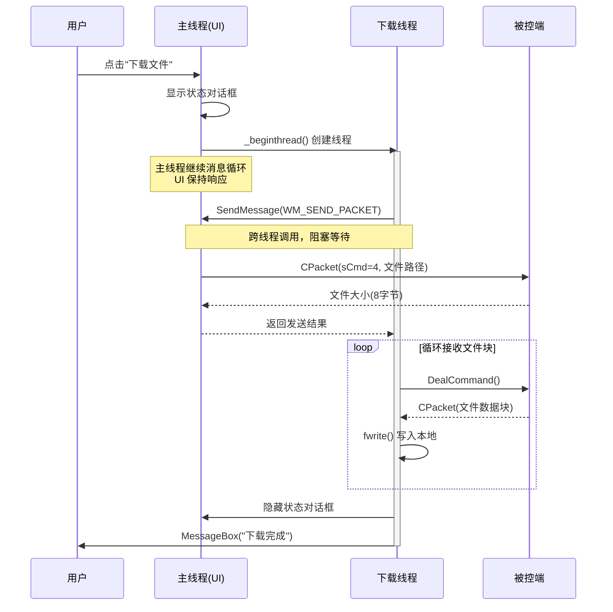

---
tags:
  - 项目/远控系统
git: "033d986"
git_msg: "实现大文件下载功能"
---


> 解决大文件下载时 UI 卡死问题：将下载操作移到独立线程，通过 Windows 消息机制实现跨线程通信。

---

## 功能概述

| 项目 | 说明 |
|------|------|
| **问题** | 大文件下载时主线程阻塞，导致 UI 无响应（假死） |
| **解决方案** | 独立线程执行下载 + 自定义消息跨线程通信 |
| **命令码** | `sCmd = 4`（与 [[4.1 文件下载功能的实现]] 相同） |
| **新增组件** | `CStatusDlg` 状态对话框、`WM_SEND_PACKET` 自定义消息 |

---

## 设计背景

### 问题分析

在 [[4.1 文件下载功能的实现]] 中，`OnDownloadFile()` 在**主线程**（UI 线程）中执行网络通信和文件写入。这带来一个严重问题：

```
用户点击"下载" → 主线程开始下载 → UI 卡死 → 用户无法操作 → 假死状态
        ↓
   文件越大，卡死时间越长
```

**具体问题**：

| 问题 | 说明 |
|------|------|
| **UI 无响应** | 主线程忙于网络 I/O，无法处理消息循环 |
| **超时风险** | 下载超过 3 秒，Windows 认为程序无响应 |
| **用户体验差** | 用户看到"程序未响应"，可能强制关闭 |

### 设计目标

1. 下载操作在独立线程执行，主线程保持响应
2. 显示状态对话框，告知用户正在下载
3. 解决跨线程访问 MFC 控件的问题

---

## 架构设计

### 整体流程



### 为什么需要消息机制？

**MFC 的线程规则**：只能在**创建窗口的线程**中操作该窗口。

```
主线程创建 → CRemoteClientDlg (包含 m_Tree, m_List, CClientSocket 等)
             ↓
        下载线程无法直接访问这些对象！
```

**错误做法**（会导致崩溃或未定义行为）：

```cpp
// ❌ 下载线程直接调用主线程的方法
void threadDownFile() {
    // 危险！跨线程直接调用会出问题
    SendCommandPacket(4, false, ...);  // 内部使用 CClientSocket
}
```

**正确做法**（通过消息机制）：

```cpp
// ✅ 下载线程发送消息，让主线程执行操作
void threadDownFile() {
    // SendMessage 会切换到主线程执行 OnSendPacket
    int ret = SendMessage(WM_SEND_PACKET, 参数...);
}
```

---

## 核心实现

### 1. 自定义消息定义

> 📁 `RemoteClient/RemoteClientDlg.h`

**技术栈**：
- `WM_USER`：用户自定义消息的起始值（0x0400）
- Windows 消息机制：消息 ID、wParam、lParam

```cpp
// ===== 自定义消息 ID =====
// WM_USER (0x0400) 以上的消息 ID 可供应用程序自定义使用
// WM_USER + 1 = 0x0401，用于触发数据包发送
#define WM_SEND_PACKET (WM_USER + 1)
```

> [!info] 一句话理解
> `WM_SEND_PACKET` 是子线程委托主线程 **"帮我发一个网络包"** 的信号。子线程不能直接操作主线程的 Socket 和 UI 控件（MFC 线程规则），所以通过 `SendMessage` 发送这个自定义消息，让主线程代为执行 `SendCommandPacket()`。`SendMessage` 是同步的，子线程会阻塞等待主线程处理完毕并返回结果后才继续执行。

**消息参数设计**：

| 参数 | 用途 | 编码方式 |
|------|------|---------|
| `wParam` | 命令码 + 是否自动关闭 | 高位: sCmd, 最低位: autoClose |
| `lParam` | 文件路径字符串指针 | `(LPARAM)(LPCSTR)strFile` |

```cpp
// wParam 编码：sCmd << 1 | autoClose
// 例如：sCmd=4, autoClose=false → wParam = 4 << 1 | 0 = 8
```

---

### 2. 消息映射注册

> 📁 `RemoteClient/RemoteClientDlg.cpp` : BEGIN_MESSAGE_MAP

**技术栈**：
- `ON_MESSAGE` 宏：注册自定义消息处理函数
- MFC 消息映射机制

```cpp
BEGIN_MESSAGE_MAP(CRemoteClientDlg, CDialogEx)
    // ... 其他消息映射 ...
    ON_COMMAND(ID_DOWNLOAD_FILE, &CRemoteClientDlg::OnDownloadFile)
    ON_COMMAND(ID_DELETE_FILE, &CRemoteClientDlg::OnDeleteFile)
    ON_COMMAND(ID_RUN_FILE, &CRemoteClientDlg::OnRunFile)

    // ===== 新增：注册自定义消息处理函数 =====
    // ON_MESSAGE: 映射自定义消息到处理函数
    // 参数1: 消息 ID
    // 参数2: 处理函数指针（必须返回 LRESULT，参数为 WPARAM, LPARAM）
    ON_MESSAGE(WM_SEND_PACKET, &CRemoteClientDlg::OnSendPacket)
END_MESSAGE_MAP()
```

**ON_MESSAGE 与 ON_COMMAND 的区别**：

| 宏 | 用途 | 处理函数签名 |
|----|------|-------------|
| `ON_COMMAND` | 菜单/按钮命令 | `void OnXxx()` |
| `ON_MESSAGE` | 自定义消息 | `LRESULT OnXxx(WPARAM, LPARAM)` |

---

### 3. 消息处理函数 OnSendPacket

> 📁 `RemoteClient/RemoteClientDlg.cpp` : OnSendPacket

**设计思路**：
- 这个函数在**主线程**中执行（消息机制保证）
- 解码 wParam 获取命令参数
- 调用 `SendCommandPacket` 发送数据包
- 返回值传回给调用线程

```cpp
// ===== 消息处理函数：在主线程中执行网络发送 =====
// 当子线程调用 SendMessage(WM_SEND_PACKET, ...) 时，
// Windows 会将执行切换到主线程来调用此函数
LRESULT CRemoteClientDlg::OnSendPacket(WPARAM wParam, LPARAM lParam)
{
    // ===== 1. 解析参数 =====
    // lParam 包含文件路径字符串的指针
    CString strFile = (LPCSTR)lParam;

    // ===== 2. 解码 wParam =====
    // wParam 编码格式: (sCmd << 1) | autoClose
    // wParam >> 1: 右移1位得到 sCmd
    // wParam & 1:  取最低位得到 autoClose
    int ret = SendCommandPacket(
        wParam >> 1,                    // sCmd (命令码)
        wParam & 1,                     // autoClose (是否自动关闭)
        (BYTE*)(LPCSTR)strFile,         // 数据内容
        strFile.GetLength()             // 数据长度
    );

    // ===== 3. 返回结果 =====
    // 返回值会传回给 SendMessage 的调用者
    return ret;
}
```

**关键点**：

| 要点 | 说明 |
|------|------|
| **线程安全** | 虽然从子线程调用，但实际执行在主线程 |
| **同步调用** | `SendMessage` 会阻塞直到 `OnSendPacket` 返回 |
| **返回值传递** | `OnSendPacket` 的返回值就是 `SendMessage` 的返回值 |

---

### 4. 下载线程入口函数

> 📁 `RemoteClient/RemoteClientDlg.h` + `RemoteClientDlg.cpp`

**头文件声明**：

```cpp
class CRemoteClientDlg : public CDialogEx
{
private:
    // ===== 线程相关函数 =====
    // 静态函数作为线程入口，因为 _beginthread 不接受成员函数
    static void threadEntryForDownFIle(void* arg);
    // 实际的下载逻辑（实例方法）
    void threadDownFile();

    // ... 其他成员 ...

protected:
    CStatusDlg m_dlgStatus;  // 状态对话框

public:
    // ===== 消息处理函数 =====
    afx_msg LRESULT OnSendPacket(WPARAM wParam, LPARAM lParam);
};
```

**线程入口实现**：

```cpp
// ===== 线程入口函数（静态） =====
// _beginthread 要求函数签名为 void (*)(void*)
// 静态成员函数满足这个要求，普通成员函数不行（有隐式 this 指针）
void CRemoteClientDlg::threadEntryForDownFIle(void* arg)
{
    // ===== 1. 还原 this 指针 =====
    // arg 是创建线程时传入的 this 指针
    CRemoteClientDlg* thiz = (CRemoteClientDlg*)arg;

    // ===== 2. 调用实例方法 =====
    // 通过 thiz 指针调用成员函数，可以访问类的所有成员
    thiz->threadDownFile();

    // ===== 3. 结束线程 =====
    // _endthread: 正常终止当前线程
    // 注意：如果不调用 _endthread，线程函数返回时也会自动终止
    _endthread();
}
```

**为什么需要静态入口函数？**

```
_beginthread(函数指针, 栈大小, 参数)
              ↓
       要求: void (*)(void*)
              ↓
   普通成员函数: void (CRemoteClientDlg::*)(void*)  ❌ 不匹配
   静态成员函数: void (*)(void*)                    ✅ 匹配
```

---

### 5. 下载线程主逻辑 threadDownFile

> 📁 `RemoteClient/RemoteClientDlg.cpp` : threadDownFile

**技术栈**：
- `SendMessage`：跨线程同步消息调用
- `CFileDialog`：文件保存对话框
- `fopen/fwrite/fclose`：C 标准文件 I/O

```cpp
void CRemoteClientDlg::threadDownFile()
{
    // ===== 1. 获取选中的文件名 =====
    int nListSelected = m_List.GetSelectionMark();
    CString strFile = m_List.GetItemText(nListSelected, 0);

    // ===== 2. 弹出文件保存对话框 =====
    // 注意：CFileDialog 在子线程中创建，需要传入父窗口
    CFileDialog dlg(FALSE, NULL,
        strFile, OFN_HIDEREADONLY | OFN_OVERWRITEPROMPT,
        NULL, this);

    if (dlg.DoModal() == IDOK)
    {
        // ===== 3. 创建本地文件 =====
        FILE* pFile = fopen(dlg.GetPathName(), "wb+");
        if (pFile == NULL)
        {
            AfxMessageBox(_T("本地没有权限保存该文件，文件无法创建！"));
            m_dlgStatus.ShowWindow(SW_HIDE);
            EndWaitCursor();
            return;
        }

        // ===== 4. 拼接远程文件路径 =====
        HTREEITEM hSelected = m_Tree.GetSelectedItem();
        strFile = GetPath(hSelected) + strFile;
        TRACE("%s\r\n", LPCSTR(strFile));

        CClientSocket* pClient = CClientSocket::getInstance();
        do {
            // ===== 5. 关键：通过消息机制发送命令 =====
            // SendMessage: 向主线程发送消息，同步等待返回
            //   参数1: 目标窗口句柄（this->m_hWnd，会自动使用）
            //   参数2: 消息 ID
            //   参数3: wParam = sCmd << 1 | autoClose
            //          4 << 1 | 0 = 8 (sCmd=4, autoClose=false)
            //   参数4: lParam = 文件路径字符串指针
            int ret = SendMessage(WM_SEND_PACKET,
                                  4 << 1 | 0,
                                  (LPARAM)(LPCSTR)strFile);
            if (ret < 0)
            {
                AfxMessageBox("执行下载命令失败！");
                TRACE("执行下载失败：ret = %d\r\n", ret);
                break;
            }

            // ===== 6. 获取文件大小 =====
            long long nLenght = *(long long*)pClient->GetPacket().strData.c_str();
            if (nLenght == 0)
            {
                AfxMessageBox("文件长度为零或者无法读取文件！！！");
                break;
            }

            // ===== 7. 循环接收文件内容 =====
            long long nCount = 0;
            while (nCount < nLenght)
            {
                ret = pClient->DealCommand();
                if (ret < 0)
                {
                    AfxMessageBox("传输失败！！");
                    TRACE("传输失败：ret = %d\r\n", ret);
                    break;
                }
                // 写入接收到的数据
                fwrite(pClient->GetPacket().strData.c_str(),
                       1,
                       pClient->GetPacket().strData.size(),
                       pFile);
                nCount += pClient->GetPacket().strData.size();
            }
        } while (false);

        // ===== 8. 清理资源 =====
        fclose(pFile);
        pClient->CloseSocket();
    }

    // ===== 9. 恢复 UI 状态 =====
    m_dlgStatus.ShowWindow(SW_HIDE);
    EndWaitCursor();
    MessageBox(_T("下载完成！！"), _T("完成"));
}
```

**关键点解析**：

| 代码行 | 说明 |
|-------|------|
| `SendMessage(WM_SEND_PACKET, ...)` | 切换到主线程执行网络发送 |
| `4 << 1 \| 0` | 编码：sCmd=4 左移1位，autoClose=0 占最低位 |
| `(LPARAM)(LPCSTR)strFile` | 字符串转指针，通过 lParam 传递 |
| `pClient->DealCommand()` | 在子线程直接调用，因为这是数据接收 |

---

### 6. 修改后的 OnDownloadFile

> 📁 `RemoteClient/RemoteClientDlg.cpp` : OnDownloadFile

**旧代码**（[[4.1 文件下载功能的实现]]）：

```cpp
void CRemoteClientDlg::OnDownloadFile()
{
    // ❌ 在主线程直接执行下载，会导致 UI 卡死
    // 获取文件名 → 弹对话框 → 发命令 → 接收数据 → 全程阻塞
}
```

**新代码**：

```cpp
// 下载的时候有一个线程运行消息循环
// 如果下载超过了3秒，那么这个线程就会卡死
void CRemoteClientDlg::OnDownloadFile()
{
    // ===== 1. 创建下载线程 =====
    // _beginthread: C 运行时库的线程创建函数
    //   参数1: 线程入口函数
    //   参数2: 栈大小，0 使用默认
    //   参数3: 传给线程的参数，这里传 this 指针
    _beginthread(CRemoteClientDlg::threadEntryForDownFIle, 0, this);

    // ===== 2. 显示等待状态 =====
    // BeginWaitCursor: 将鼠标改为等待光标（沙漏）
    BeginWaitCursor();

    // ===== 3. 显示状态对话框 =====
    m_dlgStatus.m_info.SetWindowText(_T("命令正在执行中"));
    m_dlgStatus.ShowWindow(SW_SHOW);
    m_dlgStatus.CenterWindow(this);  // 居中显示
    m_dlgStatus.SetActiveWindow();   // 设为活动窗口
}
```

**执行流程对比**：

| 旧实现 | 新实现 |
|-------|-------|
| 主线程执行全部操作 | 主线程只启动线程 + 显示 UI |
| 下载期间 UI 卡死 | 下载期间 UI 保持响应 |
| 无状态提示 | 显示"命令正在执行中" |

---

### 7. 状态对话框 CStatusDlg

> 📁 `RemoteClient/StatusDlg.h` + `StatusDlg.cpp`

新增一个简单的状态对话框，用于显示下载进度。

**StatusDlg.h**：

```cpp
#pragma once
#include "afxdialogex.h"

// CStatusDlg 对话框
class CStatusDlg : public CDialog
{
    DECLARE_DYNAMIC(CStatusDlg)

public:
    CStatusDlg(CWnd* pParent = nullptr);
    virtual ~CStatusDlg();

#ifdef AFX_DESIGN_TIME
    enum { IDD = IDD_DLG_STATUS };  // 对话框资源 ID
#endif

protected:
    virtual void DoDataExchange(CDataExchange* pDX);
    DECLARE_MESSAGE_MAP()

public:
    CEdit m_info;  // 信息显示控件，关联到 IDC_EDIT_INFO
};
```

**StatusDlg.cpp**：

```cpp
#include "pch.h"
#include "RemoteClient.h"
#include "afxdialogex.h"
#include "StatusDlg.h"

IMPLEMENT_DYNAMIC(CStatusDlg, CDialog)

CStatusDlg::CStatusDlg(CWnd* pParent /*=nullptr*/)
    : CDialog(IDD_DLG_STATUS, pParent)
{
}

CStatusDlg::~CStatusDlg()
{
}

void CStatusDlg::DoDataExchange(CDataExchange* pDX)
{
    CDialog::DoDataExchange(pDX);
    // DDX_Control: 将控件 ID 与成员变量绑定
    DDX_Control(pDX, IDC_EDIT_INFO, m_info);
}

BEGIN_MESSAGE_MAP(CStatusDlg, CDialog)
END_MESSAGE_MAP()
```

**初始化状态对话框**（在 `OnInitDialog` 中）：

```cpp
BOOL CRemoteClientDlg::OnInitDialog()
{
    // ... 其他初始化代码 ...

    // ===== 创建状态对话框（非模态） =====
    // Create: 创建非模态对话框
    // 参数1: 对话框资源 ID
    // 参数2: 父窗口
    m_dlgStatus.Create(IDD_DLG_STATUS, this);
    // 初始隐藏，下载时才显示
    m_dlgStatus.ShowWindow(SW_HIDE);

    return TRUE;
}
```

---

## 消息机制深入讲解

### SendMessage vs PostMessage

| 特性 | SendMessage | PostMessage |
|------|-------------|-------------|
| **同步性** | 同步，等待处理完成 | 异步，立即返回 |
| **返回值** | 处理函数的返回值 | 是否投递成功（BOOL） |
| **跨线程** | 会切换到目标线程执行 | 投递到目标线程消息队列 |
| **使用场景** | 需要返回值时 | 不需要等待结果时 |

**本项目使用 SendMessage 的原因**：

```cpp
// 需要等待发送结果，确认命令是否成功
int ret = SendMessage(WM_SEND_PACKET, ...);
if (ret < 0) {
    // 处理发送失败
}
```

### 消息流转过程

```
下载线程                           主线程
   │                                 │
   │ SendMessage(WM_SEND_PACKET)     │
   │─────────────────────────────────→│
   │          【线程被挂起】           │
   │                                 │ 取出消息
   │                                 │ 调用 OnSendPacket()
   │                                 │ 执行 SendCommandPacket()
   │                                 │ 返回 ret
   │←────────────────────────────────│
   │          【线程恢复】            │
   │ 获得返回值 ret                   │
```

### 为什么 DealCommand 可以在子线程调用？

```cpp
// 在 threadDownFile 中
while (nCount < nLenght) {
    ret = pClient->DealCommand();  // 这里没有用 SendMessage
    // ...
}
```

**原因**：
- `SendCommandPacket` 会修改窗口状态（如更新控件），需要在主线程
- `DealCommand` 只是**接收数据**，不涉及 UI 操作
- Socket 接收操作本身是线程安全的（每个调用独立）

---

## 易错点与调试

> [!warning] 常见错误

### 1. 静态函数无法访问成员变量

```cpp
// ❌ 错误：静态函数没有 this 指针
static void threadEntryForDownFIle(void* arg)
{
    m_List.GetSelectionMark();  // 编译错误！
}

// ✅ 正确：通过参数传入 this 指针
static void threadEntryForDownFIle(void* arg)
{
    CRemoteClientDlg* thiz = (CRemoteClientDlg*)arg;
    thiz->m_List.GetSelectionMark();  // OK
}
```

### 2. 忘记注册消息映射

```cpp
// ❌ 错误：只定义了处理函数，没有注册消息映射
LRESULT OnSendPacket(WPARAM, LPARAM);  // 声明了
// 但是 BEGIN_MESSAGE_MAP 中没有 ON_MESSAGE

// ✅ 正确：必须在消息映射中注册
BEGIN_MESSAGE_MAP(CRemoteClientDlg, CDialogEx)
    ON_MESSAGE(WM_SEND_PACKET, &CRemoteClientDlg::OnSendPacket)
END_MESSAGE_MAP()
```

### 3. wParam 编码解码不一致

```cpp
// 编码（发送端）
int wParam = sCmd << 1 | autoClose;  // sCmd=4, autoClose=0 → 8

// 解码（接收端）必须一致
int sCmd = wParam >> 1;              // 8 >> 1 = 4 ✅
int autoClose = wParam & 1;          // 8 & 1 = 0 ✅

// ❌ 错误：解码方式不对
int sCmd = wParam & 0xFF;  // 得到 8，不是 4！
```

### 4. 子线程直接操作 MFC 控件

```cpp
// ❌ 危险：可能导致崩溃或数据竞争
void threadDownFile() {
    m_dlgStatus.SetWindowText(_T("下载中..."));  // 跨线程操作！
}

// ✅ 正确：通过消息机制
void threadDownFile() {
    // 使用 PostMessage 更新 UI（异步）
    // 或者将 UI 更新放在主线程的响应函数中
}
```

---

## Win32 API 详解

### _beginthread - 创建线程

```cpp
uintptr_t _beginthread(
    void (__cdecl *start_address)(void *),  // 线程函数
    unsigned stack_size,                     // 栈大小，0=默认
    void *arglist                            // 传给线程的参数
);
```

| 返回值 | 含义 |
|--------|------|
| `-1L` | 创建失败 |
| 其他 | 线程句柄（不等于线程 ID） |

**与 `_beginthreadex` 的区别**：

| 特性 | `_beginthread` | `_beginthreadex` |
|------|----------------|------------------|
| 返回值 | 线程句柄 | 线程句柄（需手动关闭） |
| 线程 ID | 无法获取 | 通过参数返回 |
| 线程函数签名 | `void (*)(void*)` | `unsigned (__stdcall*)(void*)` |

### SendMessage - 发送窗口消息

```cpp
LRESULT SendMessage(
    HWND   hWnd,    // 目标窗口句柄
    UINT   Msg,     // 消息 ID
    WPARAM wParam,  // 消息参数
    LPARAM lParam   // 消息参数
);
```

**MFC 封装版本**（CWnd 成员函数）：

```cpp
// 自动使用当前窗口的 m_hWnd
LRESULT CWnd::SendMessage(UINT message, WPARAM wParam, LPARAM lParam);
```

---

## 关联知识

- [[4.1 文件下载功能的实现]] - 原始的单线程下载实现
- [[3.1 锁机处理]] - 另一个使用线程和消息的例子（`_beginthreadex` + `PostThreadMessage`）
- [[3.2 客户端网络编程模块]] - CClientSocket 和 DealCommand 的实现

---

## 代码索引

| 功能 | 文件 | 位置 |
|------|------|------|
| WM_SEND_PACKET 定义 | RemoteClient/RemoteClientDlg.h | 行 8 |
| ON_MESSAGE 注册 | RemoteClient/RemoteClientDlg.cpp | 行 108 |
| OnSendPacket() | RemoteClient/RemoteClientDlg.cpp | 行 496-502 |
| threadEntryForDownFIle() | RemoteClient/RemoteClientDlg.cpp | 行 237-242 |
| threadDownFile() | RemoteClient/RemoteClientDlg.cpp | 行 244-308 |
| OnDownloadFile() (新) | RemoteClient/RemoteClientDlg.cpp | 行 456-465 |
| CStatusDlg 类 | RemoteClient/StatusDlg.h + .cpp | 全文件 |

---

## 更新记录

| 日期 | 变更 |
|------|------|
| 2026-01-22 | 初始版本：实现线程化大文件下载，自定义消息跨线程通信 |
