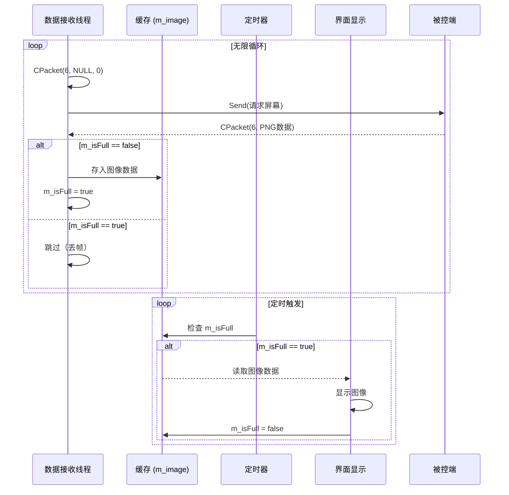

---
tags:
  - 项目/远控系统
git: "0adec81"
git_msg: "完成屏幕数据接收线程"
---

# 3.7 远程桌面显示功能设计与数据接收发送

> 本节实现控制端的**远程桌面监控功能**，通过独立线程持续接收被控端的屏幕数据，并设计缓存机制实现数据的**生产-消费**模型。

---

## 1. 功能概述

### 1.1 需求分析

远程桌面监控是远控系统的核心功能，控制端需要：

| 需求 | 说明 | 技术要点 |
|------|------|---------|
| **实时性** | 尽可能快地显示被控端屏幕 | 独立线程持续请求数据 |
| **流畅性** | 避免界面卡顿 | 数据接收与 UI 显示分离 |
| **资源控制** | 避免内存溢出 | 缓存机制控制数据堆积 |
| **命令码** | `sCmd=6` | 与 [[2.8 屏幕截屏与发送]] 对应 |

### 1.2 整体架构设计

远程桌面功能由三个核心组件构成：

```
┌─────────────────────────────────────────────────────────────┐
│                    控制端远程桌面架构                          │
├─────────────────────────────────────────────────────────────┤
│                                                             │
│   ┌──────────────┐    ┌──────────────┐    ┌──────────────┐  │
│   │  1. 数据线程  │ ──→│  2. 缓存区    │ ──→│  3. 定时器    │  │
│   │ threadWatch  │    │   CImage     │    │   刷新显示    │  │
│   │   Data()     │    │   m_isFull   │    │              │  │
│   └──────────────┘    └──────────────┘    └──────────────┘  │
│         ↑                    ↑                    ↓         │
│      持续请求             生产者-消费者          读取缓存        │
│      屏幕数据               同步标志            更新界面        │
│                                                             │
└─────────────────────────────────────────────────────────────┘
```

| 组件 | 职责 | 本次提交状态 |
|------|------|-------------|
| **数据线程** | 持续向被控端请求屏幕数据，存入缓存 | ✅ 已实现 |
| **缓存区** | 存储一帧图像数据，使用标志位同步 | ⚠️ 结构已定义，存储逻辑待实现 |
| **定时器** | 定期检查缓存，有数据则刷新显示 | ❌ 待实现 |

---

## 2. 设计背景

### 2.1 为什么使用独立线程？

**问题场景**：如果在 UI 线程（主线程）中直接调用网络请求：

```
UI 线程执行流程（错误做法）：

用户点击"开始监控"
     │
     ↓
while(true) {
    Send(请求屏幕);     ← 阻塞等待发送完成
    DealCommand();      ← 阻塞等待接收数据
    显示图像();          ← 更新 UI
}
     │
     ↓
❌ 界面完全卡死，无法响应任何操作
```

**后果**：
- MFC 的消息循环被阻塞
- 窗口无法重绘、无法响应鼠标/键盘
- 程序表现为"未响应"

**解决方案**：将网络 I/O 放入独立线程

```
┌─────────────────┐          ┌─────────────────┐
│    UI 主线程     │          │   数据接收线程   │
├─────────────────┤          ├─────────────────┤
│ - 消息循环       │          │ - 网络请求       │
│ - 界面重绘       │          │ - 数据接收       │
│ - 用户交互响应   │  ← 缓存 → │ - 存入缓存       │
│ - 定时器刷新     │          │                 │
│ - 读取缓存显示   │          │                 │
└─────────────────┘          └─────────────────┘
        ↑                            ↑
   始终保持响应                 独立运行不阻塞
```

### 2.2 为什么需要缓存机制？

**问题**：数据生产速度与消费速度不匹配

| 角色 | 速度 | 说明 |
|------|------|------|
| **生产者**（网络接收） | 取决于网络带宽和被控端编码速度 | 可能快可能慢 |
| **消费者**（UI 显示） | 取决于 MFC 消息循环和定时器频率 | 通常固定（如 30ms 一帧） |

**不匹配导致的问题**：

```
场景 1：生产 > 消费（网络快、显示慢）

时间 →
生产者：[帧1][帧2][帧3][帧4][帧5][帧6]...
消费者：[帧1].....[帧2].....
                    ↓
              数据堆积，内存溢出！

场景 2：生产 < 消费（网络慢、显示快）

时间 →
生产者：[帧1].........[帧2]...
消费者：[帧1][空][空][空][帧2]...
                    ↓
              频繁空转，浪费 CPU
```

**缓存机制的作用**：

```
生产者 ──→ [单帧缓存] ──→ 消费者
              ↑
         m_isFull 标志

- m_isFull = false：缓存为空，生产者可以写入
- m_isFull = true： 缓存已满，生产者跳过（丢帧）
                    消费者读取后置为 false
```

**设计权衡**：

| 方案 | 优点 | 缺点 |
|------|------|------|
| 单帧缓存（当前） | 实现简单，内存占用固定 | 网络快时会丢帧 |
| 队列缓存 | 不丢帧 | 实现复杂，需要控制队列长度 |
| 双缓冲 | 无锁切换 | 内存占用翻倍 |

> [!note] 设计决策
> 对于远程监控，**实时性比完整性更重要**。丢弃旧帧、显示最新帧是合理的策略。

---

## 3. 通信流程

### 3.1 时序图



### 3.2 数据流

```
被控端                                 控制端
┌──────────┐                         ┌──────────────────────┐
│SendScreen│                         │   threadWatchData    │
│          │                         │                      │
│ 截取屏幕  │ ←── CPacket(6,空) ────  │ 1. 发送请求           │
│ 编码PNG  │                         │                      │
│          │ ──→ CPacket(6,PNG) ──→  │ 2. 接收响应           │
│          │                         │                      │
└──────────┘                         │ 3. 检查缓存标志       │
                                     │    if(!m_isFull)      │
                                     │ 4. 存入 m_image       │
                                     │ 5. m_isFull = true   │
                                     └──────────────────────┘
                                                │
                                                ↓
                                     ┌──────────────────────┐
                                     │       定时器          │
                                     │                      │
                                     │ 1. 检查 m_isFull     │
                                     │ 2. 读取 m_image      │
                                     │ 3. 显示到界面        │
                                     │ 4. m_isFull = false  │
                                     └──────────────────────┘
```

---

## 4. 核心实现

### 4.1 新增成员变量

> 📁 `RemoteClient/RemoteClientDlg.h` : 新增成员变量 (行 27-28)

```cpp
private:
    CImage m_image;  // 缓存：存储一帧屏幕图像
    bool m_isFull;   // 缓存状态标志
                     // true  = 缓存有数据，等待消费
                     // false = 缓存为空，可以写入
```

**设计说明**：

| 成员 | 类型 | 作用 |
|------|------|------|
| `m_image` | `CImage` (ATL) | 存储解码后的图像，支持直接绘制到 DC |
| `m_isFull` | `bool` | 简单的同步标志，实现生产者-消费者协调 |

### 4.2 新增成员函数声明

> 📁 `RemoteClient/RemoteClientDlg.h` : 新增函数声明 (行 30-31)

```cpp
private:
    // 线程入口函数 - 必须是静态函数
    // 原因：_beginthread 要求函数签名为 void (*)(void*)
    //       非静态成员函数有隐式的 this 指针，签名不匹配
    static void threadEntryForWatchData(void* arg);

    // 实际的线程工作函数 - 成员函数
    // 可以访问 this 指针和所有成员变量
    void threadWatchData();
```

**为什么需要两个函数？**

```
_beginthread 的函数指针要求：
void (*start_address)(void*);

非静态成员函数的实际签名：
void (CRemoteClientDlg::*)(void*);  // 有隐式 this 参数

静态成员函数的签名：
void (*)(void*);  // 无 this 参数，匹配！
```

**解决方案：静态入口 + 实例方法**

```cpp
// 1. 启动线程，传入 this 指针
_beginthread(threadEntryForWatchData, 0, this);

// 2. 静态入口函数接收 this
static void threadEntryForWatchData(void* arg) {
    CRemoteClientDlg* thiz = (CRemoteClientDlg*)arg;
    thiz->threadWatchData();  // 3. 调用实例方法
}

// 4. 实例方法可以访问所有成员
void threadWatchData() {
    m_image = ...;   // ✅ 可以访问
    m_isFull = ...;  // ✅ 可以访问
}
```

### 4.3 初始化代码

> 📁 `RemoteClient/RemoteClientDlg.cpp` : OnInitDialog() (行 150)

```cpp
BOOL CRemoteClientDlg::OnInitDialog()
{
    // ... 其他初始化代码 ...

    m_dlgStatus.Create(IDD_DLG_STATUS, this);
    m_dlgStatus.ShowWindow(SW_HIDE);

    // ===== 新增：初始化缓存状态 =====
    m_isFull = false;  // 初始状态：缓存为空，可以接收数据

    return TRUE;
}
```

### 4.4 线程入口函数

> 📁 `RemoteClient/RemoteClientDlg.cpp` : threadEntryForWatchData() (行 246-251)

```cpp
void CRemoteClientDlg::threadEntryForWatchData(void* arg)
{
    // ===== 1. 类型转换：恢复 this 指针 =====
    // arg 是启动线程时传入的 this 指针
    // 需要转换回 CRemoteClientDlg* 才能调用成员函数
    CRemoteClientDlg* thiz = (CRemoteClientDlg*)arg;

    // ===== 2. 调用实际的工作函数 =====
    // 通过 thiz 指针调用成员函数
    // 这样在 threadWatchData 中可以直接访问 m_image、m_isFull 等成员
    thiz->threadWatchData();

    // ===== 3. 线程退出 =====
    // _endthread() 用于终止 _beginthread 创建的线程
    // 会自动释放线程句柄，但不会调用 C++ 析构函数！
    _endthread();
}
```

**关键点**：

| 步骤 | 说明 |
|------|------|
| 类型转换 | `void*` → `CRemoteClientDlg*`，恢复类型信息 |
| 成员调用 | 通过 `thiz->` 调用成员函数，获得完整的对象访问权限 |
| 线程退出 | `_endthread()` 与 `_beginthread()` 配对使用 |

### 4.5 数据接收线程（核心逻辑）

> 📁 `RemoteClient/RemoteClientDlg.cpp` : threadWatchData() (行 253-283)

```cpp
void CRemoteClientDlg::threadWatchData()
{
    // ===== 1. 获取网络单例 =====
    // 等待 CClientSocket 单例初始化完成
    // 在某些启动顺序下，线程可能先于单例初始化执行
    CClientSocket* pClient = NULL;
    do {
        pClient = CClientSocket::getInstance();
    } while (pClient == NULL);
    // 注意：这是一个忙等待（busy wait），不推荐
    // 更好的做法是使用事件或条件变量

    // ===== 2. 无限循环请求数据 =====
    for (;;)
    {
        // ----- 2.1 构造请求包 -----
        // 命令码 6 = 请求屏幕截图
        // 参数为空（NULL, 0），不需要传递额外数据
        CPacket pack(6, NULL, 0);

        // ----- 2.2 发送请求 -----
        bool ret = pClient->Send(pack);

        if (ret)  // 发送成功
        {
            // ----- 2.3 接收响应 -----
            // DealCommand() 阻塞等待服务器响应
            // 返回值是响应包的命令码
            int cmd = pClient->DealCommand();

            if (cmd == 6)  // 确认是屏幕数据响应
            {
                // ----- 2.4 检查缓存状态 -----
                if (m_isFull == false)  // 缓存为空，可以写入
                {
                    // 获取响应数据（PNG 图像字节流）
                    BYTE* pData = (BYTE*)pClient->GetPacket().strData.c_str();

                    // TODO: 将 PNG 数据解码并存入 m_image
                    // 当前只获取了指针，未实际存储
                    // 完整实现需要：
                    // 1. 创建内存流 IStream
                    // 2. m_image.Load(pStream) 解码 PNG

                    // 标记缓存已满
                    m_isFull = true;
                }
                // else: 缓存已满，丢弃当前帧
                // 这是有意为之：保证实时性，丢弃旧数据
            }
        }
        else  // 发送失败
        {
            // ----- 2.5 发送失败处理 -----
            // Sleep(1) 避免 CPU 空转
            // 如果不 Sleep，while(true) 会 100% 占用 CPU
            Sleep(1);
        }
    }
}
```

**逐行分析**：

#### 第一部分：获取单例

```cpp
CClientSocket* pClient = NULL;
do {
    pClient = CClientSocket::getInstance();
} while (pClient == NULL);
```

| 代码 | 作用 |
|------|------|
| `getInstance()` | 获取网络通信单例 |
| `do-while` | 确保单例已初始化，否则持续等待 |

**潜在问题**：忙等待消耗 CPU，建议改用同步原语。

#### 第二部分：无限循环

```cpp
for (;;)
{
    CPacket pack(6, NULL, 0);
    bool ret = pClient->Send(pack);
```

| 代码 | 作用 |
|------|------|
| `for (;;)` | 等同于 `while(true)`，无限循环 |
| `CPacket(6, NULL, 0)` | 创建命令码为 6 的请求包，无附加数据 |
| `Send(pack)` | 发送请求到被控端 |

> 📎 CPacket 的定义和协议格式见 [[2.3 设计网络传输包协议]]

#### 第三部分：接收与缓存

```cpp
int cmd = pClient->DealCommand();
if (cmd == 6)
{
    if (m_isFull == false)
    {
        BYTE* pData = (BYTE*)pClient->GetPacket().strData.c_str();
        // TODO: 存入CImage
        m_isFull = true;
    }
}
```

| 代码 | 作用 |
|------|------|
| `DealCommand()` | 阻塞接收响应，返回命令码 |
| `cmd == 6` | 验证响应类型正确 |
| `m_isFull == false` | 检查缓存是否可写 |
| `GetPacket().strData` | 获取响应数据（PNG 字节流） |
| `m_isFull = true` | 标记缓存已满 |

#### 第四部分：错误处理

```cpp
else
{
    Sleep(1);
}
```

| 代码 | 作用 |
|------|------|
| `Sleep(1)` | 发送失败时短暂休眠，避免 CPU 100% |

**为什么是 Sleep(1) 而不是更长？**
- Sleep(0)：让出时间片，但可能立即返回
- Sleep(1)：至少等待 1ms，有效降低 CPU 占用
- 更长的 Sleep：降低响应速度

---

## 5. 调用链分析

### 5.1 线程启动（待实现）

```
用户点击"开始监控"
    │
    ↓
OnBnClickedStartWatch()  // 按钮响应函数（待实现）
    │
    ↓
_beginthread(threadEntryForWatchData, 0, this);
    │                            ↑
    │                      传入 this 指针
    ↓
threadEntryForWatchData(void* arg)
    │
    ↓ 类型转换
    │
CRemoteClientDlg* thiz = (CRemoteClientDlg*)arg;
    │
    ↓
thiz->threadWatchData();
    │
    ↓
进入无限循环，持续请求数据
```

### 5.2 数据流转

```
threadWatchData()
    │
    ├─→ CPacket pack(6, NULL, 0)     创建请求包
    │
    ├─→ pClient->Send(pack)          发送请求
    │         │
    │         ↓ 网络传输
    │   ┌─────────────┐
    │   │   被控端     │
    │   │ SendScreen()│              见 [[2.8 屏幕截屏与发送]]
    │   └─────────────┘
    │         │
    │         ↓ 网络传输
    │
    ├─→ pClient->DealCommand()       接收响应
    │
    ├─→ pClient->GetPacket()         获取数据
    │         │
    │         ↓ PNG 字节流
    │
    ├─→ if (m_isFull == false)       检查缓存
    │         │
    │         ↓
    └─→ m_isFull = true              标记缓存已满
              │
              ↓ 等待定时器消费（待实现）
```

---

## 6. Win32 API 详解

### 6.1 _beginthread - 创建线程

```cpp
uintptr_t _beginthread(
    void (__cdecl *start_address)(void*),  // 线程入口函数
    unsigned stack_size,                    // 栈大小，0 表示默认
    void *arglist                           // 传递给线程的参数
);
```

| 参数 | 说明 |
|------|------|
| `start_address` | 线程函数指针，必须是 `void (*)(void*)` 签名 |
| `stack_size` | 栈大小，0 使用默认值（通常 1MB） |
| `arglist` | 传递给线程函数的参数，通常是 `this` 指针 |

**返回值**：
- 成功：线程句柄（uintptr_t）
- 失败：-1L

**与 CreateThread 的区别**：

| 特性 | _beginthread | CreateThread |
|------|-------------|--------------|
| 运行时库初始化 | ✅ 自动初始化 CRT | ❌ 需要手动处理 |
| 句柄管理 | 自动关闭 | 需要 CloseHandle |
| 适用场景 | 使用 CRT 函数的线程 | 纯 Win32 API 线程 |

### 6.2 _endthread - 结束线程

```cpp
void _endthread(void);
```

**作用**：
- 终止当前线程
- 自动关闭线程句柄
- 释放 CRT 分配的线程本地存储

**注意**：不会调用 C++ 对象的析构函数！

### 6.3 Sleep - 线程休眠

```cpp
void Sleep(DWORD dwMilliseconds);
```

| 参数 | 说明 |
|------|------|
| 0 | 放弃当前时间片，但可能立即被调度回来 |
| 1+ | 至少休眠指定毫秒数 |
| INFINITE | 永久休眠 |

---

## 7. 待完善功能

### 7.1 CImage 数据存储

**当前代码**（仅获取指针）：

```cpp
BYTE* pData = (BYTE*)pClient->GetPacket().strData.c_str();
// TODO: 存入CImage
m_isFull = true;
```

**完整实现**（参考方案）：

```cpp
if (m_isFull == false)
{
    // 1. 获取 PNG 数据
    std::string& strData = pClient->GetPacket().strData;

    // 2. 创建内存流
    HGLOBAL hMem = GlobalAlloc(GMEM_MOVEABLE, strData.size());
    if (hMem != NULL)
    {
        void* pMem = GlobalLock(hMem);
        memcpy(pMem, strData.c_str(), strData.size());
        GlobalUnlock(hMem);

        IStream* pStream = NULL;
        CreateStreamOnHGlobal(hMem, TRUE, &pStream);

        // 3. 加载到 CImage
        m_image.Destroy();  // 释放之前的图像
        HRESULT hr = m_image.Load(pStream);

        pStream->Release();

        if (SUCCEEDED(hr))
        {
            m_isFull = true;
        }
    }
}
```

### 7.2 线程安全问题

**当前问题**：`m_isFull` 在多线程环境下可能出现竞态条件

```
数据线程                    定时器（UI线程）
   │                              │
   │  if (m_isFull == false)      │
   │       ↓                      │
   │   [检查为 false]              │
   │       │                      │  if (m_isFull == true)
   │       │                      │       ↓
   │       │                      │   [检查为 true]
   │       │                      │       │
   │   存入数据                    │   读取数据
   │   m_isFull = true            │   m_isFull = false
   │       │                      │       │
   └───────┼──────────────────────┼───────┘
           │                      │
       同时操作 m_isFull，数据可能不一致！
```

**解决方案**：

| 方案 | 实现 | 复杂度 |
|------|------|--------|
| 临界区 | `CRITICAL_SECTION` | 中等 |
| 原子变量 | `std::atomic<bool>` | 简单 |
| 互斥量 | `std::mutex` | 中等 |

**推荐实现**（C++11 原子变量）：

```cpp
// 头文件
#include <atomic>

private:
    std::atomic<bool> m_isFull;

// 使用
m_isFull.store(true);   // 写入
if (!m_isFull.load())   // 读取
```

### 7.3 定时器显示（待实现）

**设计思路**：

```cpp
// 1. 在 OnInitDialog 中启动定时器
SetTimer(1, 33, NULL);  // 约 30 FPS

// 2. 消息映射
ON_WM_TIMER()

// 3. 定时器处理函数
void CRemoteClientDlg::OnTimer(UINT_PTR nIDEvent)
{
    if (nIDEvent == 1 && m_isFull)
    {
        // 获取显示区域
        CWnd* pWnd = GetDlgItem(IDC_STATIC_SCREEN);
        CRect rect;
        pWnd->GetClientRect(&rect);

        // 绘制图像
        CDC* pDC = pWnd->GetDC();
        m_image.Draw(pDC->m_hDC, rect);
        pWnd->ReleaseDC(pDC);

        // 标记缓存已消费
        m_isFull = false;
    }

    CDialogEx::OnTimer(nIDEvent);
}
```

### 7.4 线程退出机制（待实现）

**当前问题**：`for(;;)` 无限循环无法优雅退出

**解决方案**：添加退出标志

```cpp
// 头文件
private:
    volatile bool m_bStopThread;

// 初始化
m_bStopThread = false;

// 线程函数
void CRemoteClientDlg::threadWatchData()
{
    // ...
    while (!m_bStopThread)  // 替换 for(;;)
    {
        // ...
    }
}

// 停止函数
void CRemoteClientDlg::StopWatchThread()
{
    m_bStopThread = true;
    // 可选：等待线程退出
}
```

---

## 8. 易错点与调试

### 8.1 线程函数签名错误

```cpp
// ❌ 错误：非静态成员函数作为线程入口
_beginthread(threadWatchData, 0, this);  // 编译错误！

// ✅ 正确：静态函数作为入口
_beginthread(threadEntryForWatchData, 0, this);
```

**原因**：`_beginthread` 需要 `void (*)(void*)` 签名，非静态成员函数有隐式 this 参数。

### 8.2 忘记初始化缓存标志

```cpp
// ❌ 错误：未初始化
// bool m_isFull;  // 未初始化，值不确定

// ✅ 正确：在 OnInitDialog 中初始化
m_isFull = false;
```

**后果**：如果 `m_isFull` 初始值为 `true`，数据永远无法写入缓存。

### 8.3 发送失败时的 CPU 占用

```cpp
// ❌ 错误：无休眠的循环
for (;;)
{
    if (!pClient->Send(pack))
    {
        continue;  // CPU 100%！
    }
}

// ✅ 正确：失败时休眠
for (;;)
{
    if (!pClient->Send(pack))
    {
        Sleep(1);  // 让出 CPU
        continue;
    }
}
```

---

## 9. 关联知识

- [[2.8 屏幕截屏与发送]] - 被控端的截屏实现（命令码 6 的服务端处理）
- [[2.3 设计网络传输包协议]] - CPacket 协议格式
- [[3.2 客户端网络编程模块]] - CClientSocket 单例类
- [[3.1 锁机处理]] - 类似的线程入口函数模式

---

## 10. 代码索引

| 功能 | 文件 | 位置 |
|------|------|------|
| 缓存变量定义 | RemoteClientDlg.h | 行 27-28 |
| 线程函数声明 | RemoteClientDlg.h | 行 30-31 |
| 缓存初始化 | RemoteClientDlg.cpp | OnInitDialog() 行 150 |
| 线程入口函数 | RemoteClientDlg.cpp | threadEntryForWatchData() 行 246-251 |
| 数据接收线程 | RemoteClientDlg.cpp | threadWatchData() 行 253-283 |

---

## 11. 更新记录

| 日期 | 变更 | Git Commit |
|------|------|------------|
| 2026-01-23 | 初始版本：屏幕数据接收线程框架 | `0adec81` |

---

## 12. 下一步计划

根据提交备注"缓存数据未实现"，后续需要完成：

1. [ ] CImage 数据存储逻辑
2. [ ] 定时器显示功能
3. [ ] 线程安全机制
4. [ ] 线程启动与退出控制
5. [ ] 远程桌面 UI 控件
