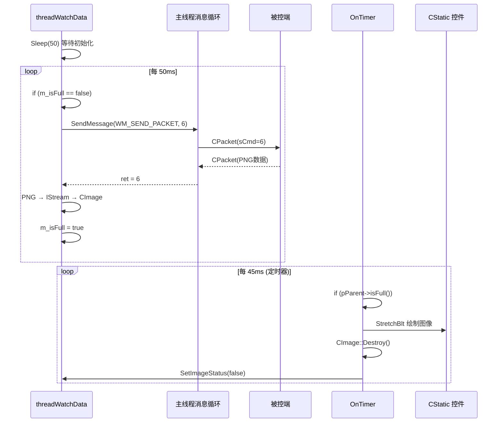

---
tags:
  - 项目/远控系统
git: "3348297"
git_msg: "完成了远程桌面的显示，调试和修改了其中的bug"
---


> 完成远程桌面图像的显示功能，并修复多个影响性能和稳定性的Bug。

---

## 功能概述

| 功能 | 说明 |
|------|------|
| **图像显示** | 使用 CImage::StretchBlt 绘制到 CStatic 控件 |
| **缓存循环** | 消费后重置缓存状态，实现连续刷新 |
| **Bug修复** | 线程启动顺序、时序控制、命令处理优化 |

---

## 设计背景

### 前序工作回顾

| 笔记 | 完成内容 |
|------|----------|
| [[4.4 远程桌面显示功能设计与数据接收发送]] | 数据接收线程框架 |
| [[4.5 远程数据缓存及添加监控对话框]] | PNG→CImage 转换、CWatchDialog 框架 |

**遗留问题**：
1. `OnTimer()` 中获取到图像后如何绘制？
2. 图像显示后缓存如何重置？
3. 线程与对话框的启动顺序问题

---

## 核心实现分析

### 1. 图像绘制到 CStatic 控件

#### 控件绑定

```cpp
// CWatchDialog.h
class CWatchDialog : public CDialog
{
public:
    CStatic m_picture;  // 绑定 Picture Control
};

// CWatchDialog.cpp - DoDataExchange
void CWatchDialog::DoDataExchange(CDataExchange* pDX)
{
    CDialog::DoDataExchange(pDX);
    DDX_Control(pDX, IDC_WATCH, m_picture);  // 绑定控件
}
```

**技术点**：
- `DDX_Control`：MFC 数据交换宏，将对话框控件与成员变量绑定
- `IDC_WATCH`：新增的 Picture Control 资源 ID

#### 图像绘制实现

```cpp
void CWatchDialog::OnTimer(UINT_PTR nIDEvent)
{
    if (nIDEvent == 0)
    {
        CRemoteClientDlg* pParent = (CRemoteClientDlg*)GetParent();
        if (pParent->isFull())
        {
            // ===== 1. 获取控件尺寸 =====
            CRect rect;
            m_picture.GetWindowRect(rect);

            // ===== 2. 缩放绘制图像 =====
            // StretchBlt: 支持缩放的位块传输
            pParent->GetImage().StretchBlt(
                m_picture.GetDC()->GetSafeHdc(),  // 目标 DC
                0, 0,                              // 目标起点
                rect.Width(), rect.Height(),       // 目标尺寸（缩放）
                SRCCOPY                            // 光栅操作码
            );

            // ===== 3. 刷新控件 =====
            m_picture.InvalidateRect(NULL);

            // ===== 4. 释放图像资源 =====
            pParent->GetImage().Destroy();

            // ===== 5. 重置缓存状态 =====
            pParent->SetImageStatus();  // m_isFull = false
        }
    }
    CDialog::OnTimer(nIDEvent);
}
```

### 2. CImage 绘制 API 对比

| 方法 | 功能 | 适用场景 |
|------|------|----------|
| `BitBlt` | 1:1 复制，不缩放 | 图像与控件尺寸相同 |
| `StretchBlt` | 支持缩放 | 图像与控件尺寸不同 |
| `Draw` | 高级绘制，支持透明 | 需要 Alpha 通道 |

```cpp
// BitBlt - 不缩放（注释掉的代码）
// pParent->GetImage().BitBlt(m_picture.GetDC()->GetSafeHdc(), 0, 0, SRCCOPY);

// StretchBlt - 缩放到控件大小
pParent->GetImage().StretchBlt(hdc, 0, 0, width, height, SRCCOPY);
```

### 3. 缓存重置接口

```cpp
// RemoteClientDlg.h - 新增方法
class CRemoteClientDlg : public CDialogEx
{
public:
    void SetImageStatus(bool isFull = false)
    {
        m_isFull = isFull;
    }
};
```

**设计意图**：
- 消费者（CWatchDialog）显示图像后，调用 `SetImageStatus()` 重置缓存
- 生产者（threadWatchData）检测到 `m_isFull == false`，继续获取下一帧
- 形成完整的**生产者-消费者循环**

---

## Bug 修复分析

### Bug 1：线程启动顺序错误

#### 问题代码

```cpp
// ❌ 错误：先启动线程，后创建对话框
void CRemoteClientDlg::OnBnClickedBtnStartWatch()
{
    _beginthread(CRemoteClientDlg::threadEntryForWatchData, 0, this);
    CWatchDialog dlg(this);
    dlg.DoModal();
}
```

#### 问题分析

```
时序问题：
┌─────────────────┬─────────────────────────────────────┐
│ 主线程           │ 工作线程                             │
├─────────────────┼─────────────────────────────────────┤
│ _beginthread()  │                                     │
│                 │ threadWatchData() 开始运行           │
│                 │ → SendMessage(WM_SEND_PACKET)       │
│                 │ → 等待主线程处理消息...（死锁风险）      │
│ CWatchDialog()  │                                     │
│ dlg.DoModal()   │                                     │
└─────────────────┴─────────────────────────────────────┘
```

线程在对话框创建前就开始发送消息，可能导致：
1. `GetParent()` 返回无效指针
2. `SendMessage` 阻塞等待，但主线程还未进入消息循环

#### 修复代码

```cpp
// ✅ 正确：先创建对话框，后启动线程
void CRemoteClientDlg::OnBnClickedBtnStartWatch()
{
    CWatchDialog dlg(this);  // 先创建对话框
    _beginthread(CRemoteClientDlg::threadEntryForWatchData, 0, this);  // 后启动线程
    dlg.DoModal();  // 进入消息循环
}
```

### Bug 2：线程启动时机过早

#### 问题分析

即使修复了启动顺序，线程可能在 `DoModal()` 进入消息循环前就开始工作。

#### 修复方案

```cpp
void CRemoteClientDlg::threadWatchData()
{
    Sleep(50);  // 等待对话框完成初始化

    CClientSocket* pClient = NULL;
    do {
        pClient = CClientSocket::getInstance();
    } while (pClient == NULL);

    // ... 正常工作
}
```

### Bug 3：帧率控制不稳定

#### 问题代码

```cpp
// ❌ 问题：Sleep(1) 导致 CPU 空转或帧率不稳定
for (;;)
{
    // 发送请求...
    Sleep(1);
}
```

#### 修复方案

```cpp
void CRemoteClientDlg::threadWatchData()
{
    ULONGLONG tick = GetTickCount64();  // 记录开始时间

    for (;;)
    {
        // 保证每次循环间隔至少 50ms
        if (GetTickCount64() - tick < 50)
        {
            Sleep(GetTickCount64() - tick);
        }
        tick = GetTickCount64();  // 更新时间戳

        // ... 获取并缓存图像
    }
}
```

**技术点**：
- `GetTickCount64()`：返回系统启动后的毫秒数（64位，不会溢出）
- 动态计算 Sleep 时间，保证稳定的帧间隔

### Bug 4：消息处理函数不完整

#### 背景：OnSendPacket 的作用

`OnSendPacket` 是 `WM_SEND_PACKET` 自定义消息的处理函数，充当**子线程与主线程之间的命令代理**。子线程（远程桌面刷新线程、下载线程等）不能直接调用 `SendCommandPacket()`，因为后者内部调用 `UpdateData()` 读取 UI 控件——MFC 要求 UI 操作必须在主线程执行。

**跨线程通信流程**：

```
子线程                           主线程
  │                                │
  ├─ SendMessage(WM_SEND_PACKET)──→│ OnSendPacket()
  │  (同步阻塞等待)                 │  ├─ 解码 wParam → cmd + autoClose
  │                                │  ├─ 根据 cmd 解读 lParam
  │                                │  └─ SendCommandPacket(...)
  │  ←─────────────────────────────│     └─ UpdateData() ← 必须主线程
  │  (获得返回值 ret)               │
```

#### wParam 位打包编码

`wParam` 通过位运算将两个参数编码为一个整数：

```
编码：wParam = sCmd << 1 | autoClose
解码：cmd = wParam >> 1,  autoClose = wParam & 1

示例：
  6 << 1 | 1 = 0b1101 = 13  → cmd=6(截图), autoClose=1
  4 << 1 | 0 = 0b1000 = 8   → cmd=4(下载), autoClose=0
  5 << 1 | 1 = 0b1011 = 11  → cmd=5(鼠标), autoClose=1
```

#### lParam 的含义取决于命令类型

| cmd | 命令 | lParam 含义 | 传参方式 |
|-----|------|------------|---------|
| 4 | 下载文件 | 文件路径字符串指针 | `(BYTE*)(LPCSTR)strFile` + 字符串长度 |
| 5 | 鼠标事件 | `MOUSEEV` 结构体指针 | `(BYTE*)lParam` + `sizeof(MOUSEEV)` |
| 6/7/8 | 截图/锁定/解锁 | 未使用 | 不传 pData |

#### 问题代码

```cpp
// ❌ 问题：OnSendPacket 只处理文件下载命令
// 把 lParam 无条件当作字符串指针，其他命令类型会出错
LRESULT CRemoteClientDlg::OnSendPacket(WPARAM wParam, LPARAM lParam)
{
    CString strFile = (LPCSTR)lParam;  // 假设 lParam 总是字符串
    int ret = SendCommandPacket(wParam >> 1, wParam & 1,
                                (BYTE*)(LPCSTR)strFile, strFile.GetLength());
    return ret;
}
```

**问题**：当 cmd=6（截图）时，lParam 未传有效字符串，`CString strFile = (LPCSTR)lParam` 会把随机内存当字符串解析，导致未定义行为。当 cmd=5（鼠标）时，lParam 是 `MOUSEEV*` 指针，强转为字符串更是错误。

#### 修复代码（最终版本）

```cpp
// ✅ 正确：根据命令类型分别处理 lParam
LRESULT CRemoteClientDlg::OnSendPacket(WPARAM wParam, LPARAM lParam)
{
    int ret = 0;
    int cmd = wParam >> 1;        // 高位是命令号
    bool autoClose = wParam & 1;  // 最低位是是否自动关闭

    switch (cmd)
    {
    case 4:  // 下载文件（lParam 传文件路径字符串）
    {
        CString strFile = (LPCSTR)lParam;
        ret = SendCommandPacket(cmd, autoClose,
                                (BYTE*)(LPCSTR)strFile, strFile.GetLength());
    }
    break;

    case 5:  // 鼠标事件（lParam 传 MOUSEEV 指针）
    {
        ret = SendCommandPacket(cmd, autoClose,
                                (BYTE*)lParam, sizeof(MOUSEEV));
    }
    break;

    case 6: case 7: case 8:  // 屏幕截图 / 锁定 / 解锁（无附加数据）
    {
        ret = SendCommandPacket(cmd, autoClose);
    }
    break;

    default:
        ret = -1;
    }
    return ret;
}
```

#### 各调用方示例

```cpp
// 远程桌面线程：请求截图（cmd=6, autoClose=true）
SendMessage(WM_SEND_PACKET, 6 << 1 | 1);

// 下载线程：下载文件（cmd=4, autoClose=false，保持连接接收数据）
SendMessage(WM_SEND_PACKET, 4 << 1 | 0, (LPARAM)(LPCSTR)strFile);

// 鼠标控制：发送鼠标事件（cmd=5, autoClose=true）
SendMessage(WM_SEND_PACKET, 5 << 1 | 1, (LPARAM)&mouseEvent);

// 锁定按钮：锁定被控端（cmd=7, autoClose=true）
pParent->SendMessage(WM_SEND_PACKET, 7 << 1 | 1);
```

> 📎 `OnSendPacket` 首次引入于 [[4.3 下载大文件]]，当时只处理 cmd=4（文件下载）。随着远程桌面和鼠标控制功能的加入，需要扩展为 switch-case 分发。

### Bug 5：命令检查位置影响性能

#### 问题代码

```cpp
// ❌ 问题：m_isFull 检查在 if(cmd==6) 内部
int cmd = pClient->DealCommand();
if (cmd == 6)
{
    if (m_isFull == false)  // 每次都要先 DealCommand
    {
        // 缓存图像...
    }
}
```

#### 优化代码

```cpp
// ✅ 优化：先检查缓存状态，再发送命令
if (m_isFull == false)  // 先检查是否需要新数据
{
    int ret = SendMessage(WM_SEND_PACKET, 6 << 1 | 1);
    if (ret == 6)
    {
        // 缓存图像...
    }
}
else
{
    Sleep(1);  // 缓存满时让出 CPU
}
```

**性能提升**：避免在缓存已满时仍然发送网络请求。

---

## 架构图

### 完整数据流



### 生产者-消费者循环

```
┌──────────────────────────────────────────────────────────────┐
│                        主对话框                               │
│  ┌────────────────────────┐  ┌────────────────────────────┐  │
│  │   threadWatchData      │  │   共享缓存                  │  │
│  │   [生产者]              │  │   CImage m_image           │  │
│  │                        │  │   bool m_isFull            │  │
│  │   if (!m_isFull)  ─────┼──┼──→ 写入图像                  │  │
│  │       获取PNG           │  │      m_isFull = true       │  │
│  │       转换CImage        │  │                            │  │
│  └────────────────────────┘  └────────────┬───────────────┘  │
└───────────────────────────────────────────│──────────────────┘
                                            │
              ┌─────────────────────────────┘
              ↓
┌──────────────────────────────────────────────────────────────┐
│                     CWatchDialog                              │
│  ┌────────────────────────────────────────────────────────┐  │
│  │   OnTimer() [消费者]                                    │  │
│  │                                                        │  │
│  │   if (pParent->isFull())                               │  │
│  │   {                                                    │  │
│  │       StretchBlt() → 绘制到 m_picture                  │  │
│  │       Destroy()    → 释放 CImage 资源                  │  │
│  │       SetImageStatus(false) → 重置缓存状态 ────────────┼──→ 通知生产者
│  │   }                                                    │  │
│  └────────────────────────────────────────────────────────┘  │
└──────────────────────────────────────────────────────────────┘
```

---

## Win32 API 详解

### GetTickCount64

```cpp
ULONGLONG GetTickCount64();
```

| 特性 | 说明 |
|------|------|
| 返回值 | 系统启动后经过的毫秒数 |
| 精度 | 约 10-16 毫秒 |
| 优势 | 64位不会溢出（GetTickCount 约 49.7 天溢出） |

### CImage::StretchBlt

```cpp
BOOL StretchBlt(
    HDC hDestDC,       // 目标设备上下文
    int xDest,         // 目标 X 坐标
    int yDest,         // 目标 Y 坐标
    int nDestWidth,    // 目标宽度
    int nDestHeight,   // 目标高度
    DWORD dwROP = SRCCOPY  // 光栅操作码
);
```

| 光栅操作码 | 说明 |
|-----------|------|
| `SRCCOPY` | 直接复制源图像 |
| `SRCPAINT` | 源与目标 OR 操作 |
| `SRCAND` | 源与目标 AND 操作 |

### InvalidateRect

```cpp
void CWnd::InvalidateRect(LPCRECT lpRect, BOOL bErase = TRUE);
```

| 参数 | 说明 |
|------|------|
| `lpRect` | 无效区域，NULL 表示整个客户区 |
| `bErase` | 是否擦除背景 |

**作用**：标记区域为"无效"，触发 `WM_PAINT` 消息重绘。

---

## 易错点与调试经验

### 1. 定时器频率设置

```cpp
// 定时器：45ms（约 22 FPS）
SetTimer(0, 45, NULL);

// 线程帧率控制：50ms（20 FPS）
if (GetTickCount64() - tick < 50)
    Sleep(GetTickCount64() - tick);
```

**注意**：消费者频率应略高于生产者，避免缓存积压。

### 2. CImage 资源释放

```cpp
// ✅ 正确：显示后立即释放
pParent->GetImage().StretchBlt(...);
pParent->GetImage().Destroy();  // 释放 GDI 资源

// ❌ 错误：不释放会导致内存泄漏
pParent->GetImage().StretchBlt(...);
// 下一帧 Load() 时旧图像未释放
```

### 3. 调试输出清理

```cpp
// 发布版本注释掉 Dump 调试输出
// Dump((BYTE*)pack.Data(), pack.Size());
```

---

## 本节关键收获

| 技术点 | 说明 |
|--------|------|
| CStatic 绑定 | DDX_Control 宏绑定控件 |
| StretchBlt | 缩放绘制图像到指定尺寸 |
| InvalidateRect | 触发控件重绘 |
| GetTickCount64 | 高精度时间戳，帧率控制 |
| 线程启动顺序 | 对话框创建后再启动线程 |
| 消息处理分发 | switch-case 根据命令类型处理 |

---

## 代码索引

| 功能 | 文件 | 变更 |
|------|------|------|
| 图像绘制 | CWatchDialog.cpp | OnTimer() |
| CStatic 绑定 | CWatchDialog.h/cpp | m_picture |
| 缓存重置 | RemoteClientDlg.h | SetImageStatus() |
| 线程帧率控制 | RemoteClientDlg.cpp | GetTickCount64() |
| 命令处理 | RemoteClientDlg.cpp | OnSendPacket() |

---

## 相关笔记

- [[4.5 远程数据缓存及添加监控对话框]] - PNG 缓存机制
- [[4.4 远程桌面显示功能设计与数据接收发送]] - 线程框架设计
- [[2.8 屏幕截屏与发送]] - 服务端截图实现
