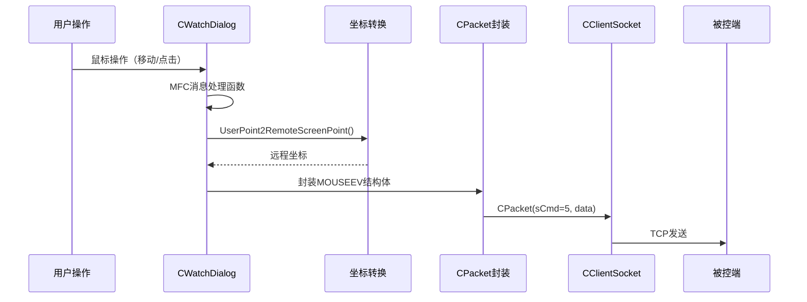

---
tags:
  - 项目/远控系统
git: "9dc0fb3"
git_msg: "设计了鼠标远程控制的结构，实现了本地鼠标信息的获取、封装和发送"
---


> 实现控制端捕获本地鼠标操作，转换坐标后封装发送给被控端，使用户可以通过监控窗口远程操控被控端鼠标。

---

## 功能概述

| 功能 | 说明 |
|------|------|
| **鼠标事件捕获** | 捕获监控窗口中的鼠标移动、单击、双击等操作 |
| **坐标转换** | 将本地窗口坐标映射到远程屏幕坐标 |
| **事件封装** | 将鼠标事件封装为 `MOUSEEV` 结构体 |
| **网络发送** | 使用 `CPacket(sCmd=5)` 发送鼠标指令 |

---

## 设计背景

### 问题分析

用户在控制端的监控窗口（`CWatchDialog`）中看到被控端的桌面画面。要实现远程操控，需要解决以下问题：

1. **如何捕获鼠标操作？** 监控窗口需要响应鼠标消息
2. **坐标如何转换？** 监控窗口尺寸与被控端屏幕尺寸不同
3. **发送什么信息？** 需要设计统一的鼠标事件结构
4. **哪些操作需要支持？** 移动、单击、双击、按下、弹起

### 设计目标

1. 捕获监控窗口中的所有鼠标操作
2. 正确转换坐标（本地窗口 → 远程屏幕）
3. 封装为通用的鼠标事件结构
4. 复用已有的网络协议框架

---

## 架构设计

### 整体流程



### 组件关系

| 组件/类 | 职责 | 相关笔记 |
|--------|------|---------|
| CWatchDialog | 监控对话框，捕获鼠标事件 | - |
| MOUSEEV | 鼠标事件结构体 | - |
| CPacket | 协议封装 | [[2.3 设计网络传输包协议]] |
| CClientSocket | 网络发送 | [[2.2 网络编程架构设计]] |

---

## 核心实现

### 1. 鼠标事件结构体设计

**设计思路**：需要一个通用结构体来描述所有类型的鼠标操作，包含三个要素：
- 哪个按键（左/中/右）
- 什么动作（移动/点击/双击/按下/弹起）
- 什么位置（坐标）

**技术栈**：
- `#pragma pack(1)`：1 字节对齐，确保网络传输时结构体大小可预测
- `WORD`：2 字节无符号整数，足以表示动作和按键类型
- `POINT`：Windows 标准坐标结构，包含 x 和 y

> 📁 `RemoteClient/CClientSocket.h` : MOUSEEV (行 142-153)

```cpp
#pragma pack(push)
#pragma pack(1)

typedef struct MouseEvent {
    MouseEvent()
    {
        nAction = 0;
        nButton = -1;
        ptXY.x = 0;
        ptXY.y = 0;
    }
    WORD nAction;   // 动作类型
    WORD nButton;   // 按键类型
    POINT ptXY;     // 坐标位置
} MOUSEEV, * PMOUSEEV;

#pragma pack(pop)
```

**字段编码规范**：

| 字段 | 值 | 含义 |
|------|-----|------|
| `nAction` | 0 | 单击 |
| | 1 | 移动 |
| | 2 | 双击 |
| | 3 | 按下 |
| | 4 | 弹起 |
| `nButton` | 0 | 左键 |
| | 1 | 中键 |
| | 2 | 右键 |

**关键点**：
1. **1 字节对齐**：`#pragma pack(1)` 确保结构体紧凑，无填充字节
2. **默认初始化**：构造函数将 `nButton` 初始化为 -1，表示未指定
3. **使用 POINT**：复用 Windows 标准结构，与系统 API 兼容

---

### 2. MFC 鼠标消息映射

**设计思路**：MFC 使用消息映射机制处理 Windows 消息。通过 `BEGIN_MESSAGE_MAP` 宏将鼠标消息（如 `WM_MOUSEMOVE`）映射到成员函数。

**技术栈**：
- `ON_WM_LBUTTONDBLCLK()`：左键双击消息宏
- `ON_WM_MOUSEMOVE()`：鼠标移动消息宏
- `ON_STN_CLICKED()`：静态控件点击通知

> 📁 `RemoteClient/CWatchDialog.cpp` : 消息映射 (行 31-41)

```cpp
BEGIN_MESSAGE_MAP(CWatchDialog, CDialog)
    ON_WM_TIMER()
    ON_WM_LBUTTONDBLCLK()       // 左键双击 → OnLButtonDblClk()
    ON_WM_LBUTTONDOWN()         // 左键按下 → OnLButtonDown()
    ON_WM_LBUTTONUP()           // 左键弹起 → OnLButtonUp()
    ON_WM_RBUTTONDBLCLK()       // 右键双击 → OnRButtonDblClk()
    ON_WM_RBUTTONDOWN()         // 右键按下 → OnRButtonDown()
    ON_WM_RBUTTONUP()           // 右键弹起 → OnRButtonUp()
    ON_WM_MOUSEMOVE()           // 鼠标移动 → OnMouseMove()
    ON_STN_CLICKED(IDC_WATCH, &CWatchDialog::OnStnClickedWatch)  // 图片控件单击
END_MESSAGE_MAP()
```

**MFC 消息映射原理**：

```
Windows 消息 (WM_LBUTTONDBLCLK)
        ↓
    MFC 框架
        ↓
    消息映射表查找
        ↓
    调用 OnLButtonDblClk()
```

**关键点**：
1. **宏展开**：`ON_WM_MOUSEMOVE()` 展开为 `{WM_MOUSEMOVE, ..., &ThisClass::OnMouseMove}`
2. **图片控件特殊处理**：`ON_STN_CLICKED` 用于捕获 `CStatic` 控件上的点击事件
3. **函数签名固定**：消息处理函数必须使用 `afx_msg void OnXxx(UINT nFlags, CPoint point)` 签名

---

### 3. 坐标转换函数

**设计思路**：监控窗口的尺寸（如 800×450）与被控端屏幕尺寸（如 1920×1080）不同，需要按比例转换坐标。

**核心公式**：
```
远程X = 本地X × (远程宽度 / 本地宽度)
远程Y = 本地Y × (远程高度 / 本地高度)
```

**技术栈**：
- `ScreenToClient()`：将屏幕坐标转换为窗口客户区坐标
- `GetWindowRect()`：获取控件的屏幕矩形区域
- `CRect::Width()/Height()`：获取矩形宽高

> 📁 `RemoteClient/CWatchDialog.cpp` : UserPoint2RemoteScreenPoint (行 46-60)

```cpp
CPoint CWatchDialog::UserPoint2RemoteScreenPoint(CPoint& point)
{
    CRect clientRect;

    // ===== 1. 屏幕坐标 → 客户区坐标 =====
    // point 参数是屏幕坐标（相对于整个屏幕）
    // 需要转换为窗口客户区坐标（相对于窗口左上角）
    ScreenToClient(&point);

    // ===== 2. 获取图片控件尺寸 =====
    // GetWindowRect 返回的是屏幕坐标，但我们只需要宽高
    m_picture.GetWindowRect(clientRect);
    int width0 = clientRect.Width();    // 本地图片控件宽度
    int height0 = clientRect.Height();  // 本地图片控件高度

    // ===== 3. 远程屏幕尺寸（硬编码） =====
    // TODO: 应该从被控端获取实际分辨率
    int width = 1920, height = 1080;

    // ===== 4. 比例转换 =====
    int x = point.x * width / width0;
    int y = point.y * height / height0;

    return CPoint(x, y);
}
```

**坐标转换示意图**：

```
本地监控窗口 (800 × 450)          远程屏幕 (1920 × 1080)
┌─────────────────────┐          ┌─────────────────────────────┐
│                     │          │                             │
│    (400, 225)       │    →     │         (960, 540)          │
│        ×            │  转换    │             ×               │
│                     │          │                             │
└─────────────────────┘          └─────────────────────────────┘

转换公式：
x' = 400 × (1920 / 800) = 960
y' = 225 × (1080 / 450) = 540
```

**关键点**：
1. **先转客户区坐标**：鼠标消息可能携带屏幕坐标，需要先转换
2. **整数除法顺序**：先乘后除避免精度丢失（`point.x * width / width0`）
3. **硬编码问题**：当前远程尺寸硬编码为 1920×1080，实际应动态获取

---

### 4. 鼠标事件封装与发送

**设计思路**：每个鼠标消息处理函数的逻辑相似：
1. 坐标转换
2. 封装 MOUSEEV
3. 打包 CPacket
4. 发送

以左键双击为例：

> 📁 `RemoteClient/CWatchDialog.cpp` : OnLButtonDblClk (行 95-108)

```cpp
void CWatchDialog::OnLButtonDblClk(UINT nFlags, CPoint point)
{
    // ===== 1. 坐标转换 =====
    CPoint remote = UserPoint2RemoteScreenPoint(point);

    // ===== 2. 封装 MOUSEEV =====
    MOUSEEV event;
    event.ptXY = remote;    // 远程坐标
    event.nButton = 0;      // 左键
    event.nAction = 2;      // 双击

    // ===== 3. 获取网络单例 =====
    CClientSocket* pClient = CClientSocket::getInstance();

    // ===== 4. 打包并发送 =====
    // sCmd = 5 表示鼠标控制命令
    CPacket pack(5, (BYTE*)&event, sizeof(event));
    pClient->Send(pack);

    // ===== 5. 调用基类处理 =====
    CDialog::OnLButtonDblClk(nFlags, point);
}
```

**各消息处理函数对比**：

| 函数 | nButton | nAction | 说明 |
|------|---------|---------|------|
| OnLButtonDblClk | 0 | 2 | 左键双击 |
| OnRButtonDblClk | 2 | 2 | 右键双击 |
| OnRButtonDown | 0 | 3 | 按下（注：代码中 nButton 写错了） |
| OnRButtonUp | 0 | 4 | 弹起（注：代码中 nButton 写错了） |
| OnMouseMove | 0 | 1 | 移动 |
| OnStnClickedWatch | 0 | 3 | 图片控件单击 |

**数据流**：

```
CPoint point (本地坐标)
       ↓
UserPoint2RemoteScreenPoint()
       ↓
CPoint remote (远程坐标)
       ↓
MOUSEEV { nAction=2, nButton=0, ptXY=remote }
       ↓
CPacket(sCmd=5, data=&event, size=sizeof(MOUSEEV))
       ↓
CClientSocket::Send() → TCP 发送
```

---

### 5. 图片控件点击处理

**设计思路**：`CStatic` 图片控件默认不响应点击消息。通过添加 `ON_STN_CLICKED` 映射，当用户点击图片时触发 `OnStnClickedWatch`。

> 📁 `RemoteClient/CWatchDialog.cpp` : OnStnClickedWatch (行 195-211)

```cpp
void CWatchDialog::OnStnClickedWatch()
{
    // ===== 1. 获取当前鼠标位置 =====
    // 注意：STN_CLICKED 通知不携带坐标，需要主动获取
    CPoint point;
    GetCursorPos(&point);   // 获取屏幕坐标

    // ===== 2. 坐标转换 =====
    CPoint remote = UserPoint2RemoteScreenPoint(point);

    // ===== 3. 封装为"按下"事件 =====
    MOUSEEV event;
    event.ptXY = remote;
    event.nButton = 0;      // 左键
    event.nAction = 3;      // 按下

    // ===== 4. 发送 =====
    CClientSocket* pClient = CClientSocket::getInstance();
    CPacket pack(5, (BYTE*)&event, sizeof(event));
    pClient->Send(pack);
}
```

**关键点**：
1. **STN_CLICKED 不携带坐标**：必须用 `GetCursorPos()` 获取
2. **与 OnLButtonDown 的区别**：`OnLButtonDown` 在对话框背景上触发，`OnStnClickedWatch` 在图片控件上触发

---

## Win32 API 详解

### ScreenToClient - 坐标系转换

```cpp
BOOL ScreenToClient(
    HWND hWnd,      // 窗口句柄
    LPPOINT lpPoint // 要转换的点（输入输出参数）
);
```

| 参数 | 说明 |
|------|------|
| hWnd | 目标窗口句柄 |
| lpPoint | 指向 POINT 结构的指针，函数会原地修改 |

**作用**：将屏幕坐标（相对于屏幕左上角）转换为客户区坐标（相对于窗口客户区左上角）。

### GetCursorPos - 获取鼠标位置

```cpp
BOOL GetCursorPos(
    LPPOINT lpPoint // 输出参数，接收鼠标屏幕坐标
);
```

**作用**：获取鼠标光标当前的屏幕坐标。

### GetWindowRect - 获取窗口矩形

```cpp
BOOL GetWindowRect(
    HWND hWnd,     // 窗口句柄
    LPRECT lpRect  // 输出参数，接收窗口矩形
);
```

**作用**：获取窗口在屏幕上的位置和大小（屏幕坐标）。

---

## 易错点与调试

> [!warning] 常见错误

### 1. nButton 字段设置错误

代码中存在 bug：`OnRButtonDown` 和 `OnRButtonUp` 的 `nButton` 应该是 2（右键），但写成了 0（左键）。

```cpp
// ❌ 错误：OnRButtonDown 中
event.nButton = 0;  // 应该是右键，但写成了左键

// ✅ 正确
event.nButton = 2;  // 右键
```

### 2. 坐标转换精度问题

```cpp
// ❌ 可能的精度问题（如果先除后乘）
int x = point.x / width0 * width;  // 整数除法会丢失小数

// ✅ 正确：先乘后除
int x = point.x * width / width0;
```

### 3. 硬编码远程分辨率

```cpp
// ❌ 当前实现：硬编码 1920×1080
int width = 1920, height = 1080;

// ✅ 更好的方案：从被控端获取实际分辨率
// 可以在握手阶段让被控端发送屏幕尺寸
```

### 4. OnLButtonDown 为空实现

```cpp
void CWatchDialog::OnLButtonDown(UINT nFlags, CPoint point)
{
    // 当前为空，没有发送鼠标按下事件
    CDialog::OnLButtonDown(nFlags, point);
}
```

这会导致单击（按下+弹起）无法正确传递。`OnStnClickedWatch` 部分弥补了这个问题，但仅限于图片控件区域。

---

## 附加修改

### BUFFER_SIZE 扩大

> 📁 `RemoteClient/CClientSocket.h` 和 `RemoteCtrl/ServerSocket.h`

```cpp
// 旧值
#define BUFFER_SIZE 4096

// 新值
#define BUFFER_SIZE 4096000
```

**原因**：屏幕截图数据较大，4KB 的缓冲区不足以容纳完整的图像数据包。

### BitBlt 硬编码修复

> 📁 `RemoteCtrl/RemoteCtrl.cpp` : SendScreen

```cpp
// ❌ 旧代码：硬编码尺寸导致部分屏幕无法捕获
BitBlt(screen.GetDC(), 0, 0, 1920, 1020, hScreen, 0, 0, SRCCOPY);

// ✅ 新代码：使用实际屏幕尺寸
BitBlt(screen.GetDC(), 0, 0, nWidth, nHeight, hScreen, 0, 0, SRCCOPY);
```

---

## 关联知识

- [[2.2 网络编程架构设计]] - CClientSocket 单例模式
- [[2.3 设计网络传输包协议]] - CPacket 协议封装
- [[4.8 鼠标远程控制（被控端）与 Bug 修复]] - 被控端鼠标事件处理（待实现）

---

## 代码索引

| 功能 | 文件 | 位置 |
|------|------|------|
| MOUSEEV 结构体 | CClientSocket.h | 行 142-153 |
| 消息映射 | CWatchDialog.cpp | 行 31-41 |
| 坐标转换函数 | CWatchDialog.cpp | 行 46-60 |
| 左键双击处理 | CWatchDialog.cpp | 行 95-108 |
| 鼠标移动处理 | CWatchDialog.cpp | 行 180-193 |
| 图片控件点击 | CWatchDialog.cpp | 行 195-211 |
| BUFFER_SIZE | CClientSocket.h | 行 227 |

---

## 更新记录

| 日期 | 变更 |
|------|------|
| 2026-01-25 | 初始版本：鼠标远程控制（控制端）实现 |
