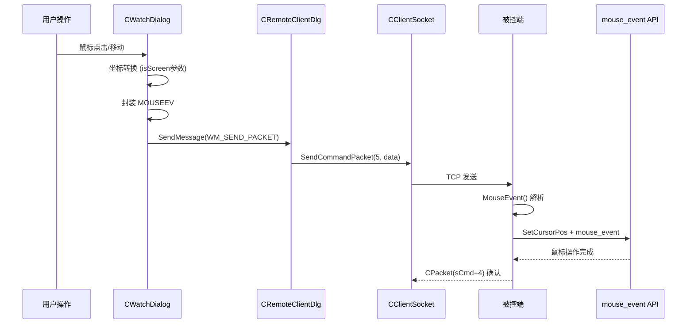

---
tags:
  - 项目/远控系统
git: "39d3d44"
git_msg: "完成鼠标远程控制，修复鼠标的坐标bug"
---

> 完成鼠标远程控制的被控端实现，修复控制端坐标转换 Bug，并分析当前架构中网络通信与 UI 耦合的设计问题。

---

## 功能概述

| 功能 | 说明 |
|------|------|
| **被控端鼠标事件处理** | 接收控制端发来的鼠标指令，模拟鼠标操作 |
| **坐标 Bug 修复** | 修复控制端坐标转换函数的坐标系混淆问题 |
| **消息转发机制** | 通过 `WM_SEND_PACKET` 自定义消息转发网络数据 |
| **命令码** | `sCmd=5` |

---

## 设计背景

### 问题分析

在 [[3.10]] 中实现了控制端的鼠标事件捕获和发送，但存在两个问题：

1. **坐标转换 Bug**
   - `UserPoint2RemoteScreenPoint` 总是调用 `ScreenToClient()`
   - 但 MFC 鼠标消息处理函数（如 `OnLButtonDown`）接收的 `point` 参数已经是客户区坐标
   - 只有 `GetCursorPos()` 获取的才是屏幕坐标
   - 导致重复转换，坐标错误

2. **网络调用分散**
   - 每个鼠标消息处理函数都直接调用 `CClientSocket::Send()`
   - 代码重复，且 `CWatchDialog` 与网络层紧耦合

### 设计目标

1. 修复坐标转换 Bug
2. 统一网络发送入口，通过消息机制解耦
3. 实现被控端鼠标事件模拟

---

## 架构设计

### 整体流程



### 消息流转

```
CWatchDialog                    CRemoteClientDlg                 被控端
     │                                │                            │
     │  SendMessage(WM_SEND_PACKET,   │                            │
     │     5<<1|1, &event)            │                            │
     ├───────────────────────────────→│                            │
     │                                │  OnSendPacket()            │
     │                                │  SendCommandPacket(5,...)  │
     │                                ├───────────────────────────→│
     │                                │                            │ MouseEvent()
     │                                │                            │ mouse_event()
```

### 设计问题

> [!warning] 架构耦合问题
>
> 当前设计中，`CWatchDialog` 需要通过 `GetParent()` 获取父对话框指针，再调用 `SendMessage`。这导致：
> 1. 子对话框依赖父对话框的存在
> 2. 网络通信逻辑与 UI 层耦合
> 3. 难以复用和单元测试

**更好的方案**：
- 使用观察者模式或回调函数
- 将网络发送逻辑抽象为独立的服务类
- 使用依赖注入而非硬编码的父子关系

---

## 核心实现

### 1. 坐标 Bug 修复

**问题根源**：不同场景下获取的坐标类型不同：

| 场景 | 坐标类型 | 说明 |
|------|---------|------|
| `OnLButtonDown(point)` | 客户区坐标 | MFC 自动转换 |
| `OnMouseMove(point)` | 客户区坐标 | MFC 自动转换 |
| `GetCursorPos(&point)` | 屏幕坐标 | 系统 API 返回 |

**修复方案**：添加 `isScreen` 参数，仅在需要时转换。

> 📁 `RemoteClient/CWatchDialog.cpp` : UserPoint2RemoteScreenPoint (行 44-60)

```cpp
// 修复前：总是调用 ScreenToClient，导致客户区坐标被错误转换
// CPoint CWatchDialog::UserPoint2RemoteScreenPoint(CPoint& point)

// 修复后：添加 isScreen 参数，按需转换
CPoint CWatchDialog::UserPoint2RemoteScreenPoint(CPoint& point, bool isScreen = false)
{
    CRect clientRect;

    // ===== 仅当传入屏幕坐标时才转换 =====
    if (isScreen)
    {
        // 屏幕坐标 → 客户区坐标
        ScreenToClient(&point);
    }
    // 如果 isScreen=false，point 已经是客户区坐标，无需转换

    // ===== 获取图片控件尺寸 =====
    m_picture.GetWindowRect(clientRect);
    int width0 = clientRect.Width();
    int height0 = clientRect.Height();

    // ===== 远程屏幕尺寸 =====
    int width = 1920, height = 1080;

    // ===== 比例转换 =====
    int x = point.x * width / width0;
    int y = point.y * height / height0;

    return CPoint(x, y);
}
```

**调用方式**：

```cpp
// 场景1：MFC 消息处理函数，point 已是客户区坐标
void CWatchDialog::OnLButtonDown(UINT nFlags, CPoint point)
{
    CPoint remote = UserPoint2RemoteScreenPoint(point);  // isScreen 默认 false
    // ...
}

// 场景2：使用 GetCursorPos，需要转换屏幕坐标
void CWatchDialog::OnStnClickedWatch()
{
    CPoint point;
    GetCursorPos(&point);  // 获取的是屏幕坐标
    CPoint remote = UserPoint2RemoteScreenPoint(point, true);  // isScreen = true
    // ...
}
```

---

### 2. WM_SEND_PACKET 消息机制

**设计思路**：将网络发送逻辑集中到 `CRemoteClientDlg`，子对话框通过自定义消息通知。

**消息定义**：

> 📁 `RemoteClient/RemoteClientDlg.h` (行 9)

```cpp
#define WM_SEND_PACKET (WM_USER + 1)    // 自定义消息：发送数据包
```

**wParam 编码规范**：

```cpp
wParam = (cmd << 1) | hasData
```

| 位 | 含义 | 示例 |
|-----|------|------|
| bit 0 | 是否有数据 | 1=有数据, 0=无数据 |
| bit 1-31 | 命令码 | 5=鼠标操作 |

**消息注册**：

> 📁 `RemoteClient/RemoteClientDlg.cpp` (行 109)

```cpp
BEGIN_MESSAGE_MAP(CRemoteClientDlg, CDialogEx)
    // ...
    ON_MESSAGE(WM_SEND_PACKET, &CRemoteClientDlg::OnSendPacket)  // 注册自定义消息
END_MESSAGE_MAP()
```

**消息处理**：

> 📁 `RemoteClient/RemoteClientDlg.cpp` : OnSendPacket (行 570-597)

```cpp
LRESULT CRemoteClientDlg::OnSendPacket(WPARAM wParam, LPARAM lParam)
{
    int ret = 0;
    int cmd = wParam >> 1;  // 提取命令码

    switch (cmd)
    {
    case 4:  // 文件下载
    {
        CString strFile = (LPCSTR)lParam;
        ret = SendCommandPacket(cmd, wParam & 1, (BYTE*)(LPCSTR)strFile, strFile.GetLength());
    }
        break;

    case 5:  // 鼠标操作
    {
        // lParam 指向 MOUSEEV 结构体
        ret = SendCommandPacket(cmd, wParam & 1, (BYTE*)lParam, sizeof(MOUSEEV));
    }
        break;

    case 6:  // 远程监控
    {
        ret = SendCommandPacket(cmd, wParam & 1);
    }
        break;

    default:
        ret = -1;
    }
    return ret;
}
```

**发送调用**：

```cpp
// 在 CWatchDialog 中发送鼠标事件
CRemoteClientDlg* pParent = (CRemoteClientDlg*)GetParent();
pParent->SendMessage(WM_SEND_PACKET, 5 << 1 | 1, (WPARAM)&event);
//                                   ↑↑↑↑↑↑↑↑↑
//                                   cmd=5, hasData=1
```

---

### 3. 被控端 MouseEvent 函数

**设计思路**：使用位运算组合 `nButton` 和 `nAction` 成为统一的 `nFlags`，然后根据 `nFlags` 调用对应的 `mouse_event` API。

**nFlags 编码**：

```
nFlags = nButton | (nAction << 4)

低 4 位：按键类型
    0x01 = 左键
    0x02 = 右键
    0x04 = 中键
    0x08 = 无按键（纯移动）

高 4 位：动作类型
    0x10 = 单击
    0x20 = 双击
    0x40 = 按下
    0x80 = 弹起
```

**组合示例**：

| nFlags | 含义 | 计算 |
|--------|------|------|
| 0x11 | 左键单击 | 0x01 \| 0x10 |
| 0x21 | 左键双击 | 0x01 \| 0x20 |
| 0x41 | 左键按下 | 0x01 \| 0x40 |
| 0x81 | 左键弹起 | 0x01 \| 0x80 |
| 0x12 | 右键单击 | 0x02 \| 0x10 |
| 0x08 | 纯鼠标移动 | 0x08 |

> 📁 `RemoteCtrl/RemoteCtrl.cpp` : MouseEvent (行 172-279)

```cpp
int MouseEvent()
{
    MOUSEEV mouse;
    if (CServerSocket::getInstance()->GetMouseEvent(mouse))
    {
        DWORD nFlags = 0;

        // ===== 1. 解析按键类型 =====
        switch (mouse.nButton)
        {
        case 0:  // 左键
            nFlags = 1;
            break;
        case 1:  // 右键
            nFlags = 2;
            break;
        case 2:  // 中键
            nFlags = 4;
            break;
        case 4:  // 没有按键（纯移动）
            nFlags = 8;
            break;
        default:
            break;
        }

        // ===== 2. 设置鼠标位置 =====
        // 纯移动时不需要先设置位置（由 MOUSEEVENTF_MOVE 处理）
        if (nFlags != 8)
            SetCursorPos(mouse.ptXY.x, mouse.ptXY.y);

        // ===== 3. 解析动作类型 =====
        switch (mouse.nAction)
        {
        case 0:  // 单击
            nFlags |= 0x10;
            break;
        case 1:  // 双击
            nFlags |= 0x20;  // 注意：原代码写成 != 是 bug
            break;
        case 2:  // 按下
            nFlags |= 0x40;
            break;
        case 3:  // 放开
            nFlags |= 0x80;
            break;
        default:
            break;
        }

        TRACE("mouse event : %08X x %d y %d\r\n", nFlags, mouse.ptXY.x, mouse.ptXY.y);

        // ===== 4. 执行鼠标操作 =====
        switch (nFlags)
        {
        // ----- 左键 -----
        case 0x21:  // 左键双击（利用 fall-through 实现两次点击）
            mouse_event(MOUSEEVENTF_LEFTDOWN, 0, 0, 0, GetMessageExtraInfo());
            mouse_event(MOUSEEVENTF_LEFTUP, 0, 0, 0, GetMessageExtraInfo());
        case 0x11:  // 左键单击
            mouse_event(MOUSEEVENTF_LEFTDOWN, 0, 0, 0, GetMessageExtraInfo());
            mouse_event(MOUSEEVENTF_LEFTUP, 0, 0, 0, GetMessageExtraInfo());
            break;
        case 0x41:  // 左键按下
            mouse_event(MOUSEEVENTF_LEFTDOWN, 0, 0, 0, GetMessageExtraInfo());
            break;
        case 0x81:  // 左键放开
            mouse_event(MOUSEEVENTF_LEFTUP, 0, 0, 0, GetMessageExtraInfo());
            break;

        // ----- 右键 -----
        case 0x22:  // 右键双击
            mouse_event(MOUSEEVENTF_RIGHTDOWN, 0, 0, 0, GetMessageExtraInfo());
            mouse_event(MOUSEEVENTF_RIGHTUP, 0, 0, 0, GetMessageExtraInfo());
        case 0x12:  // 右键单击
            mouse_event(MOUSEEVENTF_RIGHTDOWN, 0, 0, 0, GetMessageExtraInfo());
            mouse_event(MOUSEEVENTF_RIGHTUP, 0, 0, 0, GetMessageExtraInfo());
            break;
        case 0x42:  // 右键按下
            mouse_event(MOUSEEVENTF_RIGHTDOWN, 0, 0, 0, GetMessageExtraInfo());
            break;
        case 0x82:  // 右键放开
            mouse_event(MOUSEEVENTF_RIGHTUP, 0, 0, 0, GetMessageExtraInfo());
            break;

        // ----- 中键 -----
        case 0x24:  // 中键双击
            mouse_event(MOUSEEVENTF_MIDDLEDOWN, 0, 0, 0, GetMessageExtraInfo());
            mouse_event(MOUSEEVENTF_MIDDLEUP, 0, 0, 0, GetMessageExtraInfo());
        case 0x14:  // 中键单击
            mouse_event(MOUSEEVENTF_MIDDLEDOWN, 0, 0, 0, GetMessageExtraInfo());
            mouse_event(MOUSEEVENTF_MIDDLEUP, 0, 0, 0, GetMessageExtraInfo());
            break;
        case 0x44:  // 中键按下
            mouse_event(MOUSEEVENTF_MIDDLEDOWN, 0, 0, 0, GetMessageExtraInfo());
            break;
        case 0x84:  // 中键放开
            mouse_event(MOUSEEVENTF_MIDDLEUP, 0, 0, 0, GetMessageExtraInfo());
            break;

        // ----- 纯移动 -----
        case 0x08:
            mouse_event(MOUSEEVENTF_MOVE, mouse.ptXY.x, mouse.ptXY.y, 0, GetMessageExtraInfo());
            break;

        default:
            break;
        }

        // ===== 5. 发送确认包 =====
        CPacket pack(4, NULL, 0);
        CServerSocket::getInstance()->Send(pack);
    }
    else
    {
        OutputDebugString(_T("获取鼠标操作参数失败!"));
        return -1;
    }
    return 0;
}
```

**关键点**：

1. **Fall-through 技巧**：双击的 case 没有 break，会继续执行单击的代码，实现连续两次点击
2. **SetCursorPos**：在模拟点击前先移动光标到目标位置
3. **MOUSEEVENTF_MOVE**：纯移动时使用绝对坐标

---

### 4. 控制端消息处理函数修正

**nButton 和 nAction 编码修正**：

| 事件 | nButton | nAction | 修正说明 |
|------|---------|---------|---------|
| 左键双击 | 0 | 2 | 原 nAction=2（正确） |
| 左键按下 | 0 | 2 | 原为空实现，现补充 |
| 左键弹起 | 0 | 3 | 原被注释，现启用 |
| 右键双击 | 1 | 1 | 原 nButton=2 改为 1 |
| 右键按下 | 1 | 2 | 原 nButton=0 改为 1 |
| 右键弹起 | 1 | 3 | 原 nButton=0 改为 1 |
| 鼠标移动 | 8 | 0 | 原 nButton=0 改为 8 |

> 📁 `RemoteClient/CWatchDialog.cpp` : OnLButtonDown (行 111-127)

```cpp
void CWatchDialog::OnLButtonDown(UINT nFlags, CPoint point)
{
    TRACE("x=%d y=%d\r\n", point.x, point.y);  // 调试：记录原始坐标

    // 坐标转换（point 已是客户区坐标，无需 ScreenToClient）
    CPoint remote = UserPoint2RemoteScreenPoint(point);
    TRACE("x=%d y=%d\r\n", point.x, point.y);  // 调试：记录转换后坐标

    // 封装鼠标事件
    MOUSEEV event;
    event.ptXY = remote;
    event.nButton = 0;   // 左键
    event.nAction = 2;   // 按下

    // 通过父对话框发送
    CRemoteClientDlg* pParent = (CRemoteClientDlg*)GetParent();
    pParent->SendMessage(WM_SEND_PACKET, 5 << 1 | 1, (WPARAM)&event);

    CDialog::OnLButtonDown(nFlags, point);
}
```

---

## Win32 API 详解

### mouse_event - 模拟鼠标操作

```cpp
void mouse_event(
    DWORD dwFlags,      // 鼠标事件标志
    DWORD dx,           // X 坐标或位移
    DWORD dy,           // Y 坐标或位移
    DWORD dwData,       // 滚轮数据
    ULONG_PTR dwExtraInfo  // 额外信息
);
```

| dwFlags | 值 | 说明 |
|---------|-----|------|
| MOUSEEVENTF_LEFTDOWN | 0x0002 | 左键按下 |
| MOUSEEVENTF_LEFTUP | 0x0004 | 左键弹起 |
| MOUSEEVENTF_RIGHTDOWN | 0x0008 | 右键按下 |
| MOUSEEVENTF_RIGHTUP | 0x0010 | 右键弹起 |
| MOUSEEVENTF_MIDDLEDOWN | 0x0020 | 中键按下 |
| MOUSEEVENTF_MIDDLEUP | 0x0040 | 中键弹起 |
| MOUSEEVENTF_MOVE | 0x0001 | 鼠标移动 |
| MOUSEEVENTF_ABSOLUTE | 0x8000 | 使用绝对坐标 |

### SetCursorPos - 设置光标位置

```cpp
BOOL SetCursorPos(
    int X,  // 屏幕 X 坐标
    int Y   // 屏幕 Y 坐标
);
```

**作用**：将鼠标光标移动到指定的屏幕坐标位置。

### GetMessageExtraInfo - 获取额外消息信息

```cpp
LPARAM GetMessageExtraInfo(void);
```

**作用**：获取当前消息的额外信息，用于 `mouse_event` 的最后一个参数，确保模拟消息与真实消息一致。

---

## 易错点与调试

> [!warning] 常见错误

### 1. 运算符写错：`!=` vs `|=`

原代码中存在严重 Bug：

```cpp
// ❌ 错误：!= 是比较运算符，结果被丢弃
nFlags != 0x20;
nFlags != 0x40;
nFlags != 0x80;

// ✅ 正确：|= 是按位或赋值
nFlags |= 0x20;
nFlags |= 0x40;
nFlags |= 0x80;
```

**影响**：双击、按下、弹起的动作标志无法正确设置，导致这些操作失效。

### 2. 坐标系混淆

```cpp
// ❌ 错误：MFC 消息处理函数的 point 已是客户区坐标
void OnLButtonDown(UINT nFlags, CPoint point)
{
    ScreenToClient(&point);  // 错误！会导致坐标偏移
}

// ✅ 正确：判断坐标类型再转换
CPoint remote = UserPoint2RemoteScreenPoint(point, false);  // 客户区坐标
```

### 3. 双击实现缺少 break

```cpp
// 利用 fall-through 实现双击
case 0x21:  // 左键双击
    mouse_event(MOUSEEVENTF_LEFTDOWN, ...);
    mouse_event(MOUSEEVENTF_LEFTUP, ...);
    // 注意：没有 break，继续执行下面的单击代码
case 0x11:  // 左键单击
    mouse_event(MOUSEEVENTF_LEFTDOWN, ...);
    mouse_event(MOUSEEVENTF_LEFTUP, ...);
    break;  // 这里才 break
```

这是有意为之：双击 = 点击两次。

### 4. 鼠标移动被注释

```cpp
void CWatchDialog::OnMouseMove(UINT nFlags, CPoint point)
{
    // ...
    // TODO:存在一个设计隐患 网络通信和对话框有耦合
    //pParent->SendMessage(WM_SEND_PACKET, 5 << 1 | 1, (WPARAM)&event);
    CDialog::OnMouseMove(nFlags, point);
}
```

**原因**：鼠标移动事件频率极高，每秒可能触发数十次。如果每次都发送网络包：
- 网络带宽消耗大
- 可能造成网络拥塞
- 被控端处理不过来

**优化方向**：
- 节流（Throttle）：限制发送频率
- 差值压缩：只发送位移变化
- 批量发送：累积多个移动事件后一次发送

---

## 设计反思

### 当前架构问题

```
CWatchDialog ──GetParent()──→ CRemoteClientDlg ──→ CClientSocket
     ↑                              ↑
     │                              │
   子对话框                      父对话框
   (UI层)                     (UI层 + 网络逻辑)
```

**问题**：
1. 子对话框硬依赖父对话框类型（强制转换）
2. 网络发送逻辑分散在 UI 层
3. 难以复用和测试

### 改进方案

```
CWatchDialog ──接口──→ IPacketSender ←── CRemoteClientDlg
                           ↑
                           │
                     CClientSocket
```

使用接口解耦：

```cpp
// 定义接口
class IPacketSender {
public:
    virtual bool SendMouseEvent(const MOUSEEV& event) = 0;
};

// CWatchDialog 依赖接口而非具体类
class CWatchDialog : public CDialog {
    IPacketSender* m_pSender;
public:
    void SetPacketSender(IPacketSender* pSender) { m_pSender = pSender; }
};
```

---

## 关联知识

- [[3.10]] - 控制端鼠标事件捕获与封装
- [[2.2 网络编程架构设计]] - CClientSocket/CServerSocket 单例模式
- [[2.3 设计网络传输包协议]] - CPacket 协议封装

---

## 代码索引

| 功能 | 文件 | 位置 |
|------|------|------|
| 坐标转换函数（修复后） | CWatchDialog.cpp | 行 44-60 |
| WM_SEND_PACKET 定义 | RemoteClientDlg.h | 行 9 |
| OnSendPacket 处理 | RemoteClientDlg.cpp | 行 570-597 |
| MouseEvent 函数 | RemoteCtrl.cpp | 行 172-279 |
| 左键按下处理 | CWatchDialog.cpp | 行 111-127 |

---

## 更新记录

| 日期 | 变更 |
|------|------|
| 2026-01-25 | 初始版本：被控端鼠标处理、坐标 Bug 修复、架构分析 |
