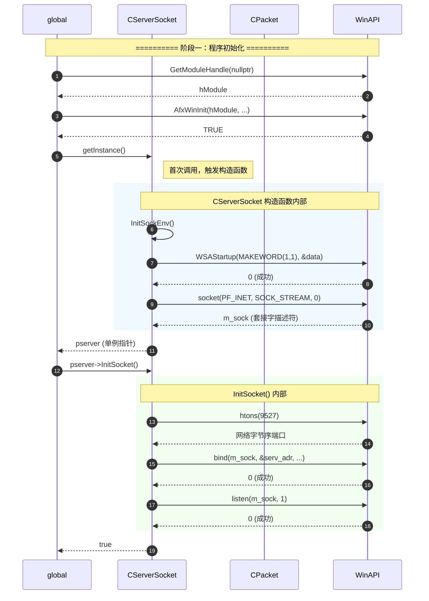
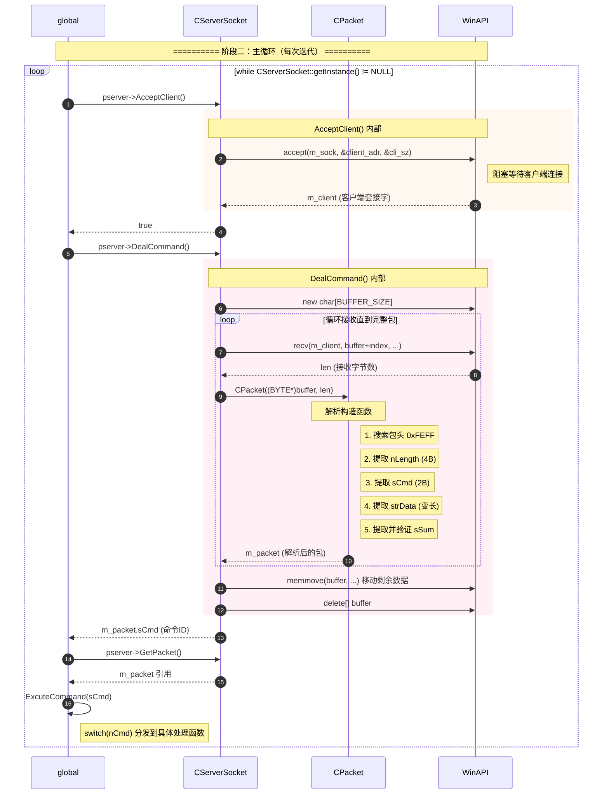
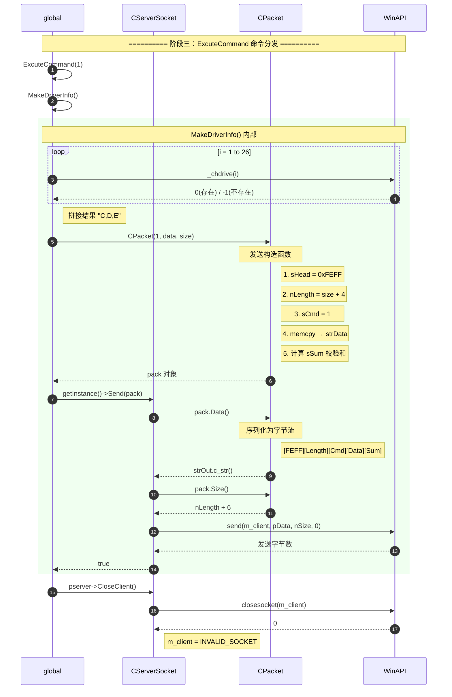
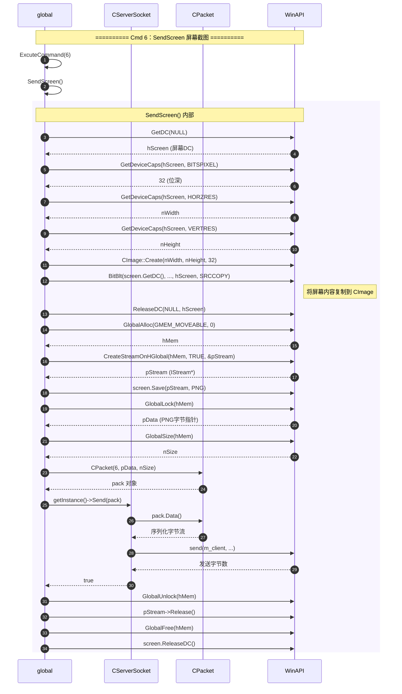
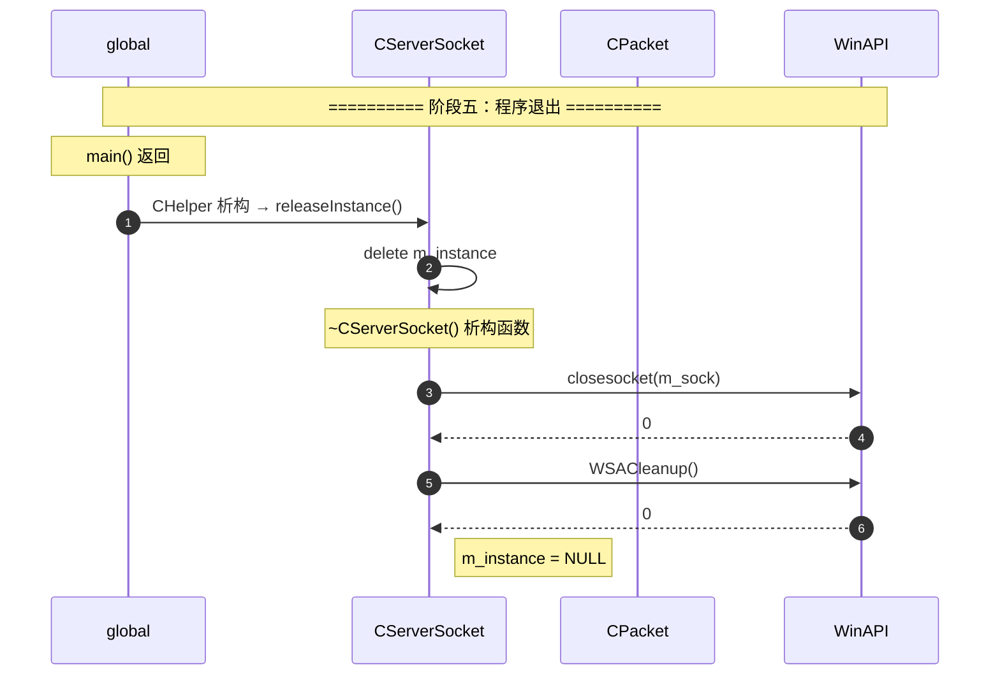

# 5.1 UML 时序图入门：服务端核心调用流程

## 四个参与者

| 参与者 | 含义 | 对应代码 |
|--------|------|----------|
| **global** | 全局作用域的函数 | `main()`、`ExcuteCommand()`、`MakeDriverInfo()` 等 |
| **WinAPI** | Windows/C运行时 API | `WSAStartup`、`socket`、`bind`、`recv`、`send` 等 |
| **CPacket** | 协议封包类 | 构造函数（解析/封装）、`Data()`、`Size()` |
| **CServerSocket** | 服务端网络单例 | `getInstance()`、`InitSocket()`、`DealCommand()` 等 |

## 完整时序图

### 阶段一：初始化

### 阶段二：主循环 — 接受连接与解析命令

### 阶段三：命令处理（以 Cmd 1 获取磁盘为例）

### 阶段四：命令处理（以 Cmd 6 屏幕截图为例）

### 阶段五：程序退出（CHelper 自动释放）

## 调用关系总结

### global → CServerSocket 的调用

| 调用点 | 函数 | 作用 |
|--------|------|------|
| `main()` | `getInstance()` | 获取/创建单例 |
| `main()` | `InitSocket()` | bind + listen |
| `main()` | `AcceptClient()` | 等待客户端连接 |
| `main()` | `DealCommand()` | 接收并解析命令 |
| `main()` | `GetPacket()` | 获取解析后的数据包 |
| `main()` | `CloseClient()` | 关闭客户端连接 |
| 各命令函数 | `Send(pack)` | 发送响应包 |
| 各命令函数 | `GetFilePath()` | 从包中提取路径 |
| `MouseEvent()` | `GetMouseEvent()` | 从包中提取鼠标事件 |

### CServerSocket → CPacket 的调用

| 调用点 | 函数 | 作用 |
|--------|------|------|
| `DealCommand()` | `CPacket(BYTE*, size_t&)` | 从原始字节解析包 |
| `Send(CPacket&)` | `pack.Data()` | 序列化为字节流 |
| `Send(CPacket&)` | `pack.Size()` | 获取总包大小 |

### CServerSocket → WinAPI 的调用

| 调用点 | API | 作用 |
|--------|-----|------|
| 构造函数 | `WSAStartup()` | 初始化 Winsock |
| 构造函数 | `socket()` | 创建套接字 |
| `InitSocket()` | `bind()` | 绑定地址 |
| `InitSocket()` | `listen()` | 开始监听 |
| `AcceptClient()` | `accept()` | 接受连接 |
| `DealCommand()` | `recv()` | 接收数据 |
| `Send()` | `send()` | 发送数据 |
| `CloseClient()` | `closesocket()` | 关闭连接 |
| 析构函数 | `WSACleanup()` | 清理 Winsock |

### global → WinAPI 的直接调用

> 命令处理函数中直接调用的 WinAPI，不经过 CServerSocket。

| 命令函数 | API | 作用 |
|----------|-----|------|
| `MakeDriverInfo()` | `_chdrive()` | 检测磁盘分区 |
| `MakeDirectoryInfo()` | `_chdir()` / `_findfirst()` / `_findnext()` | 遍历目录 |
| `RunFile()` | `ShellExecuteA()` | 执行文件 |
| `DownloadFile()` | `fopen_s()` / `fread()` / `fclose()` | 读取文件 |
| `MouseEvent()` | `SetCursorPos()` / `mouse_event()` | 控制鼠标 |
| `SendScreen()` | `GetDC()` / `BitBlt()` / `GlobalAlloc()` | 屏幕截图 |
| `DeleteLocalFile()` | `DeleteFileA()` | 删除文件 |
