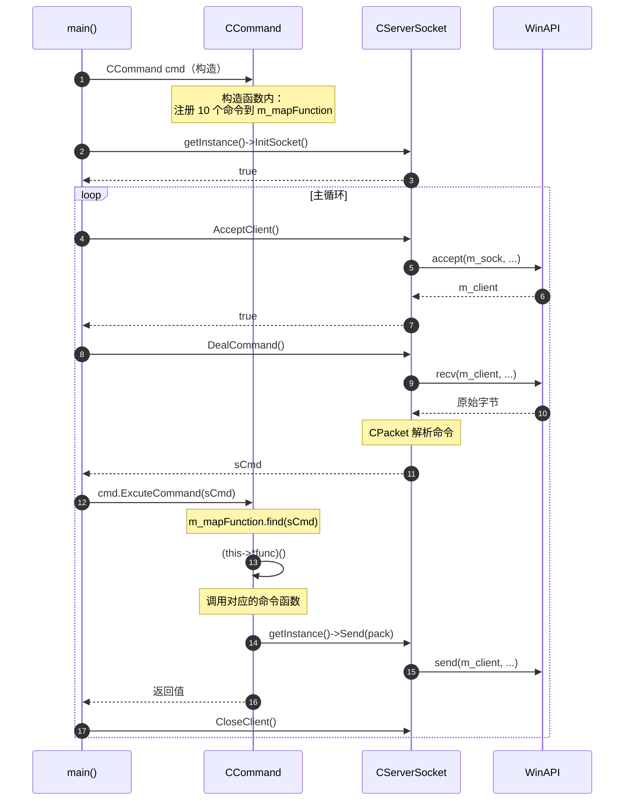

> 将 RemoteCtrl.cpp 中 555 行的"上帝文件"拆分为 CCommand 命令类 + CEdoyunTool 工具类，用**成员函数指针 + map** 替代 switch-case 命令分发。

---

## 重构概述

| 项目 | 重构前 | 重构后 |
|------|--------|--------|
| **命令函数位置** | RemoteCtrl.cpp 全局自由函数 | CCommand 类的 protected 成员函数 |
| **命令分发方式** | `switch-case`（ExcuteCommand） | `std::map<int, CMDFUNC>` 查表 |
| **工具函数** | RemoteCtrl.cpp 中的全局 `Dump()` | CEdoyunTool 类的静态方法 |
| **main() 职责** | 网络循环 + 命令分发 + 所有命令实现 | 仅网络循环，命令委托给 CCommand |
| **RemoteCtrl.cpp 行数** | ~555 行 | ~90 行 |
| **头文件依赖** | RemoteCtrl.cpp 直接 `#include` 10+ 个头文件 | RemoteCtrl.cpp 只需 4 个，其余由 Command.h 内部包含 |
| **全局变量** | `dlg`、`threadid` 散落在全局作用域 | 封装为 CCommand 的 protected 成员 |

> 📁 对应 Git 提交：`d27c8a4` — "1 优化代码：建立命令类 2 优化代码：建立工具类"

### 命令映射总表

| 命令号 | 函数名 | 功能 | 已有笔记 |
|--------|--------|------|---------|
| 1 | `MakeDriverInfo` | 获取磁盘分区信息 | [[2.4 获取磁盘分区信息]] |
| 2 | `MakeDirectoryInfo` | 获取指定目录下的文件列表 | [[2.5 获取指定文件目录下的文件和文件夹]] |
| 3 | `RunFile` | 打开/执行文件 | [[2.6 文件打开与下载]] |
| 4 | `DownloadFile` | 下载文件到控制端 | [[4.1 文件下载功能的实现]] |
| 5 | `MouseEvent` | 鼠标远程控制 | [[4.8 鼠标远程控制（被控端）与 Bug 修复]] |
| 6 | `SendScreen` | 屏幕截图并发送 | [[2.8 屏幕截屏与发送]] |
| 7 | `LockMachine` | 锁定被控端 | [[3.1 锁机处理]] |
| 8 | `UnlockMachine` | 解锁被控端 | [[4.12 锁机与解锁功能的实现]] |
| 9 | `DeleteLocalFile` | 删除被控端文件 | — |
| 1981 | `TestConnect` | 测试连接是否存活 | — |

---

## 设计背景

### 重构前的问题

重构前所有代码集中在 RemoteCtrl.cpp 一个文件中：

```
RemoteCtrl.cpp (555行)
  │
  ├── Dump()                    // 工具函数
  ├── MakeDriverInfo()          // 全局自由函数
  ├── MakeDirectoryInfo()       // 全局自由函数
  ├── RunFile()                 // ...
  ├── DownloadFile()            // ...
  ├── MouseEvent()              // ...
  ├── SendScreen()              // ...
  ├── LockMachine()             // ...
  ├── UnlockMachine()           // ...
  ├── DeleteLocalFile()         // ...
  ├── TestConnect()             // ...
  ├── ExcuteCommand()           // switch-case 分发
  └── main()                    // 网络主循环
```

**核心问题**：

1. **单一职责违反**：main 文件承担了网络管理、命令分发、所有业务逻辑三重职责
2. **扩展性差**：每新增一个命令，需要在 switch-case 中加一个 case，还要在同一文件中写实现
3. **全局状态散落**：`dlg`、`threadid` 等锁机相关变量是全局变量，生命周期不可控
4. **无法复用**：Dump 等工具函数与业务代码混在一起

### 重构目标

1. **职责分离**：main 只管网络循环，命令逻辑封装到 CCommand
2. **开闭原则**：新增命令只需在构造函数的映射表中加一行，不改分发逻辑
3. **状态封装**：`dlg`、`threadid` 成为 CCommand 的成员变量
4. **头文件依赖简化**：RemoteCtrl.cpp 不再直接依赖 `<atlimage.h>`、`<direct.h>` 等底层头文件

---

## 架构设计

### 重构后的文件结构

```
RemoteCtrl/
  ├── RemoteCtrl.cpp        // main()：网络循环，~90行
  │     #include "Command.h"    ← 唯一新增的依赖
  │
  ├── Command.h              // CCommand 类定义 + 所有命令函数（内联实现）
  │     #include <map>           ← STL 容器
  │     #include <atlimage.h>    ← CImage（截屏）
  │     #include <direct.h>      ← _chdrive/_chdir（磁盘/目录）
  │     #include <io.h>          ← _findfirst/_findnext（文件遍历）
  │     #include "EdoyunTool.h"  ← 工具类
  │     #include "ServerSocket.h"← 网络层
  │     #include "LockInfoDialog.h" ← 锁机对话框
  │
  ├── Command.cpp            // CCommand 构造函数 + ExcuteCommand（仅 39 行）
  ├── EdoyunTool.h           // CEdoyunTool 工具类（静态方法）
  ├── EdoyunTool.cpp         // 仅 #include "pch.h" + "EdoyunTool.h"
  └── ServerSocket.h/cpp     // 网络层（本次未改动）
```

> [!info] 为什么命令函数实现放在 Command.h 而不是 Command.cpp？
> 当前所有命令函数（`MakeDriverInfo`、`SendScreen` 等）都以**内联方式**写在 Command.h 的类定义体内。这意味着：
> - 类体内定义的成员函数**隐式 inline**
> - 只有 `CCommand()` 构造函数和 `ExcuteCommand()` 的实现放在 Command.cpp
> - 好处：修改命令函数时只需改一个文件
> - 代价：Command.h 有 436 行，任何 `#include "Command.h"` 的文件都会编译这些代码
>
> 更好的做法是将命令函数实现移到 Command.cpp，头文件只保留声明。但在当前项目规模下（只有 RemoteCtrl.cpp 包含它），影响不大。

### 调用关系

```
main()
  │
  ├── CCommand cmd;                          // 构造时注册所有命令映射
  ├── CServerSocket::getInstance()           // 网络单例
  │
  └── while 主循环
        ├── pserver->AcceptClient()
        ├── pserver->DealCommand()
        ├── cmd.ExcuteCommand(sCmd)          // 通过 map 查表分发
        │     ├── m_mapFunction.find(sCmd)   // O(log n) 红黑树查找
        │     ├── (this->*it->second)()      // 成员函数指针调用
        │     │     ├── MakeDriverInfo()     // sCmd=1
        │     │     ├── MakeDirectoryInfo()  // sCmd=2
        │     │     ├── RunFile()            // sCmd=3
        │     │     ├── DownloadFile()       // sCmd=4
        │     │     ├── MouseEvent()         // sCmd=5
        │     │     ├── SendScreen()         // sCmd=6
        │     │     ├── LockMachine()        // sCmd=7
        │     │     ├── UnlockMachine()      // sCmd=8
        │     │     ├── DeleteLocalFile()    // sCmd=9
        │     │     └── TestConnect()        // sCmd=1981
        │     └── return 结果
        └── pserver->CloseClient()
```

### 重构后的时序图

对比 [[5.1 入门]] 中的旧时序图，重构后 `ExcuteCommand` 不再是全局函数，而是 CCommand 对象的方法：



**与旧时序图的关键区别**：
- 旧图：`main()` → `ExcuteCommand()` → `MakeDriverInfo()` 全部在 global 参与者内
- 新图：`main()` → `CCommand::ExcuteCommand()` → `CCommand::MakeDriverInfo()`，命令处理有了独立的参与者

---

## 核心实现

### 1. 成员函数指针 — 深入理解

成员函数指针是本次重构的**技术基石**，理解它才能理解整个 map 分发机制。

#### 什么是成员函数指针？

普通函数指针指向一个**独立的函数**，而成员函数指针指向一个**类的成员函数**。区别在于：成员函数有一个隐含的 `this` 参数，调用时必须绑定到具体对象。

```cpp
// ===== 普通函数指针 =====
int Add(int a, int b) { return a + b; }
int (*pFunc)(int, int) = &Add;    // 定义 + 赋值
int result = pFunc(1, 2);         // 直接调用，不需要对象

// ===== 成员函数指针 =====
class CCommand {
public:
    int MakeDriverInfo();         // 成员函数
};
int (CCommand::*pMemFunc)() = &CCommand::MakeDriverInfo;  // 定义 + 赋值

CCommand cmd;
int result = (cmd.*pMemFunc)();   // 通过对象调用（.* 运算符）

CCommand* pCmd = &cmd;
int result = (pCmd->*pMemFunc)(); // 通过指针调用（->* 运算符）
```

#### typedef 语法拆解

代码中的 typedef 初看很复杂，逐层拆解：

```cpp
typedef int(CCommand::* CMDFUNC)();
//      │   │            │       │
//      │   │            │       └── () 无参数
//      │   │            └── CMDFUNC 是这个类型的别名
//      │   └── CCommand::* 指向 CCommand 成员的指针
//      └── int 返回值类型
```

**等价理解**：`CMDFUNC` 是一个类型，表示"指向 CCommand 类中、无参数、返回 int 的成员函数的指针"。

有了这个 typedef，就可以像普通类型一样使用：

```cpp
// 没有 typedef 时，声明一个 map 极其冗长：
std::map<int, int(CCommand::*)()> m_mapFunction;

// 有了 typedef 后：
std::map<int, CMDFUNC> m_mapFunction;
```

#### `->*` 运算符详解

`->*` 是 C++ 中**优先级最低的运算符之一**，因此调用时必须加括号：

```cpp
// ✅ 正确：先解引用成员函数指针，再调用
return (this->*it->second)();

// ❌ 错误：没有括号，编译器会解析为 this->*(it->second())
return this->*it->second();
```

运算符优先级：`()` > `->` > `->*`，所以 `it->second` 先执行（取出函数指针），然后 `this->*` 解引用，最后 `()` 调用。

#### 成员函数指针的内存模型

普通函数指针通常是一个地址（8 字节），但成员函数指针可能更大：

| 继承类型 | 指针大小（MSVC x64） | 原因 |
|---------|---------------------|------|
| 无继承 | 8 字节 | 只需函数地址 |
| 单继承 | 8 字节 | 只需函数地址 |
| 多继承 | 16 字节 | 函数地址 + this 偏移量 |
| 虚继承 | 24 字节 | 函数地址 + this 偏移量 + vbtable 索引 |

CCommand 当前无继承，所以 `CMDFUNC` 是 8 字节，与普通函数指针大小相同。

### 2. CCommand 类设计 — map 映射机制

这是本次重构的**核心设计**。用 `std::map` 存储命令号到成员函数指针的映射，替代原来的 switch-case。

**技术栈**：
- `typedef int(CCommand::* CMDFUNC)()`：成员函数指针类型定义
- `std::map<int, CMDFUNC>`：命令号 → 函数指针的映射表

#### 类型定义与成员

```cpp
class CCommand
{
public:
    CCommand();
    ~CCommand(){}
    int ExcuteCommand(int nCmd);
protected:
    // ===== 核心类型定义 =====
    // 成员函数指针类型：指向 CCommand 的无参成员函数，返回 int
    typedef int(CCommand::* CMDFUNC)();

    // 命令号到功能的映射表
    std::map<int, CMDFUNC> m_mapFunction;

    // 锁机相关状态（从全局变量变为成员变量）
    CLockInfoDialog dlg;
    unsigned threadid;

protected:
    // 所有命令处理函数声明为 protected 成员函数
    int MakeDriverInfo();
    int MakeDirectoryInfo();
    int RunFile();
    int DownloadFile();
    // ... 其他命令
};
```

**关键点**：

1. **成员函数指针 vs 普通函数指针**
   - 普通函数指针：`int(*func)()`，不绑定对象
   - 成员函数指针：`int(CCommand::*func)()`，调用时需要对象实例
   - 调用语法：`(this->*func)()`，必须通过对象调用

2. **状态封装的改进**
   - 重构前：`CLockInfoDialog dlg` 和 `unsigned threadid` 是全局变量
   - 重构后：成为 CCommand 的 protected 成员，生命周期与 CCommand 对象绑定

#### 构造函数 — 注册命令映射

> 📁 `Command.cpp`

```cpp
CCommand::CCommand() :threadid(0)
{
    // ===== 1. 定义命令映射表（局部结构体数组） =====
    struct {
        int nCmd;
        CMDFUNC func;
    }data[] = {
        {1,  &CCommand::MakeDriverInfo},
        {2,  &CCommand::MakeDirectoryInfo},
        {3,  &CCommand::RunFile},
        {4,  &CCommand::DownloadFile},
        {5,  &CCommand::MouseEvent},
        {6,  &CCommand::SendScreen},
        {7,  &CCommand::LockMachine},
        {8,  &CCommand::UnlockMachine},
        {9,  &CCommand::DeleteLocalFile},
        {1981, &CCommand::TestConnect},
        {-1, NULL}    // 哨兵值，标记数组结束
    };

    // ===== 2. 遍历数组，插入 map =====
    for (int i = 0; data[i].nCmd != -1; i++)
    {
        m_mapFunction.insert(std::pair<int, CMDFUNC>(data[i].nCmd, data[i].func));
    }
}
```

**设计思路**：

1. **局部结构体数组**：用 `{命令号, 函数指针}` 的数组集中定义所有映射关系，比逐行 `insert` 更清晰
2. **哨兵值 `{-1, NULL}`**：标记数组结束，循环条件 `data[i].nCmd != -1` 自动停止
3. **新增命令只需加一行**：在 `data[]` 数组中添加 `{新命令号, &CCommand::新函数}`

#### ExcuteCommand — map 查表分发

```cpp
int CCommand::ExcuteCommand(int nCmd)
{
    // ===== 1. 在 map 中查找命令号 =====
    std::map<int, CMDFUNC>::iterator it = m_mapFunction.find(nCmd);
    if (it == m_mapFunction.end())
    {
        return -1;  // 未知命令
    }

    // ===== 2. 通过成员函数指针调用对应函数 =====
    // this->*it->second 解引用成员函数指针
    // 等价于：this->MakeDriverInfo() 等
    return (this->*it->second)();
}
```

**关键语法解析**：

```
(this->*it->second)()
  │      │    │      │
  │      │    │      └── () 调用该函数
  │      │    └── it->second 取出 map 中的函数指针（CMDFUNC 类型）
  │      └── ->* 成员函数指针解引用运算符
  └── this 当前 CCommand 对象
```

> `->*` 是 C++ 的**成员指针解引用运算符**，专门用于通过对象指针调用成员函数指针。

---

### 2. 重构前后对比：switch-case vs map

#### 重构前：switch-case 分发

```cpp
// 旧代码：RemoteCtrl.cpp 中的全局函数
int ExcuteCommand(int nCmd)
{
    int ret = 0;
    switch (nCmd)
    {
    case 1:
        ret = MakeDriverInfo();
        break;
    case 2:
        ret = MakeDirectoryInfo();
        break;
    case 3:
        ret = RunFile();
        break;
    // ... 每个命令一个 case
    case 1981:
        ret = TestConnect();
        break;
    }
    return ret;
}
```

#### 重构后：map 查表分发

```cpp
// 新代码：CCommand 成员函数
int CCommand::ExcuteCommand(int nCmd)
{
    auto it = m_mapFunction.find(nCmd);
    if (it == m_mapFunction.end())
        return -1;
    return (this->*it->second)();
}
```

#### 两种方案的对比

| 维度 | switch-case | map + 函数指针 |
|------|-------------|---------------|
| **时间复杂度** | O(1)~O(n)，编译器可能优化为跳转表 | O(log n)，红黑树查找 |
| **扩展性** | 每加一个命令改两处（case + 函数） | 只在 data[] 数组加一行 |
| **开闭原则** | 违反：必须修改 switch 体 | 符合：分发逻辑不变 |
| **可读性** | 直观，一眼看到所有分支 | 需要理解函数指针语法 |
| **编译期检查** | case 值必须是常量 | 运行时注册，更灵活 |

> [!question] 代码注释中的问题
> 代码中留下了两个思考题：
> ```
> // 为什么使用映射表而不用switch case？（数量可能会变）
> // if-else、switch-case和hash的时间复杂度是什么样的？进行对比
> ```

#### 问题一：为什么使用映射表而不用 switch-case？

注释给出了关键提示：**数量可能会变**。

switch-case 的问题在于**每新增一个命令，必须修改分发函数本身**。如果未来命令从 10 个增长到 50 个，switch-case 会变成一个巨大的分支块。而映射表方案中，`ExcuteCommand()` 的代码**永远不需要改动**，只需在构造函数的 `data[]` 数组中加一行。

更深层的原因：映射表支持**运行时动态注册**。理论上可以在程序运行中添加/删除命令，而 switch-case 是编译期固定的。

#### 问题二：if-else、switch-case 和 hash 的时间复杂度对比

| 方案 | 时间复杂度 | 实现原理 | 适用场景 |
|------|-----------|---------|---------|
| **if-else** | **O(n)** | 逐个条件判断，最坏遍历所有分支 | 分支少（≤3），或条件是范围/复杂表达式 |
| **switch-case** | **O(1)** 或 **O(log n)** | 编译器优化：值连续时生成**跳转表**（O(1)）；值稀疏时生成**二分查找**（O(log n)）；极端情况退化为 if-else 链（O(n)） | 分支多，case 值为整数常量 |
| **hash（unordered_map）** | **O(1)** 均摊 | 哈希函数直接计算桶位置 | 大量分支，追求查找性能 |
| **std::map（红黑树）** | **O(log n)** | 平衡二叉搜索树 | 需要有序遍历，或 key 不好哈希 |

**本项目的选择**：使用 `std::map`，复杂度 O(log n)。对于 10 个命令，log₂(10) ≈ 3.3 次比较，与 switch-case 的跳转表（O(1)）差距在**纳秒级**，完全可忽略。选择 map 的真正原因是**架构灵活性**，而非性能。

> 如果命令数量增长到数百个且对性能敏感，可以换用 `std::unordered_map` 获得 O(1) 查找。

---

### 3. CEdoyunTool 工具类 — 重构前后对比

#### 重构前：全局函数

```cpp
// 旧代码：RemoteCtrl.cpp 中的全局函数
void Dump(BYTE* pData, size_t nSize)
{
    std::string strOut;
    for (size_t i = 0; i < nSize; i++)
    {
        char buf[8] = "";
        if (i > 0 && (i % 16 == 0))
            strOut += '/n';
        snprintf(buf, sizeof(buf), "%02X", pData[i] & 0xFF);
        strOut += buf;
    }
    strOut += '\n';
    OutputDebugStringA(strOut.c_str());
}

// 调用方式
Dump((BYTE*)pack.Data(), pack.Size());
```

#### 重构后：静态工具类

> 📁 `EdoyunTool.h`

```cpp
#pragma once
class CEdoyunTool
{
public:
    // 将字节数组以十六进制格式输出到 VS 调试窗口
    // pData: 数据指针  nSize: 数据长度
    // 输出格式：每字节 2 位十六进制，每 16 字节换行
    // 示例输出：FFFE070000000100432C44B300
    static void Dump(BYTE* pData, size_t nSize)
    {
        std::string strOut;
        for (size_t i = 0; i < nSize; i++)
        {
            char buf[8] = "";
            if (i > 0 && (i % 16 == 0))
                strOut += '\n';           // 每 16 字节换行
            snprintf(buf, sizeof(buf), "%02X", pData[i] & 0xFF);
            strOut += buf;
        }
        strOut += '\n';
        OutputDebugStringA(strOut.c_str());  // 输出到 VS Output 窗口
    }
};
```

```cpp
// 新调用方式：类名限定，语义更清晰
CEdoyunTool::Dump((BYTE*)pack.Data(), pack.Size());
```

#### 对比分析

| 维度 | 全局函数 `Dump()` | 静态方法 `CEdoyunTool::Dump()` |
|------|-------------------|-------------------------------|
| **命名空间** | 污染全局命名空间 | 限定在类作用域内 |
| **语义** | `Dump(...)` 含义模糊 | `CEdoyunTool::Dump(...)` 明确是工具类方法 |
| **扩展性** | 加新工具函数继续污染全局 | 统一放入 CEdoyunTool 类 |
| **可发现性** | 散落在文件中，难以找到 | IDE 中输入 `CEdoyunTool::` 自动补全所有工具方法 |

> [!tip] static 方法 vs 全局函数
> `static` 成员函数**不需要对象实例**，本质上和全局函数一样，但有类作用域的保护。这是 C++ 中替代 C 风格全局函数的常用手法。

---

### 4. 重构后的 main() — 完整前后对比

#### 重构前：main() 中直接调用全局 ExcuteCommand

> 📁 旧 `RemoteCtrl.cpp`（关键部分）

```cpp
#include "pch.h"
#include "framework.h"
#include "RemoteCtrl.h"
#include "ServerSocket.h"
#include <direct.h>       // _chdrive, _chdir
#include <stdio.h>        // fopen_s, fread
#include <io.h>           // _findfirst, _findnext
#include <list>           // std::list
#include <atlimage.h>     // CImage（截屏）
#include "LockInfoDialog.h"  // 锁机对话框
// ↑ main 文件直接依赖所有底层头文件

// 全局变量
CLockInfoDialog dlg;      // 锁机对话框（全局）
unsigned threadid;         // 锁机线程ID（全局）

// 全局函数（省略具体实现，共 ~400 行）
void Dump(BYTE* pData, size_t nSize) { ... }
int MakeDriverInfo() { ... }
int MakeDirectoryInfo() { ... }
int RunFile() { ... }
int DownloadFile() { ... }
int MouseEvent() { ... }
int SendScreen() { ... }
int LockMachine() { ... }
int UnlockMachine() { ... }
int DeleteLocalFile() { ... }
int TestConnect() { ... }

// 全局 switch-case 分发
int ExcuteCommand(int nCmd)
{
    int ret = 0;
    switch (nCmd)
    {
    case 1:  ret = MakeDriverInfo();    break;
    case 2:  ret = MakeDirectoryInfo(); break;
    case 3:  ret = RunFile();           break;
    case 4:  ret = DownloadFile();      break;
    case 5:  ret = MouseEvent();        break;
    case 6:  ret = SendScreen();        break;
    case 7:  ret = LockMachine();       break;
    case 8:  ret = UnlockMachine();     break;
    case 9:  ret = DeleteLocalFile();   break;
    case 1981: ret = TestConnect();     break;
    }
    return ret;
}

int main()
{
    // ... MFC 初始化 ...
    CServerSocket* pserver = CServerSocket::getInstance();
    // ... 网络循环 ...
    ret = ExcuteCommand(pserver->GetPacket().sCmd);  // 调用全局函数
    // ...
}
```

#### 重构后：main() 委托给 CCommand 对象

> 📁 新 `RemoteCtrl.cpp`（完整代码）

```cpp
#include "pch.h"
#include "framework.h"
#include "RemoteCtrl.h"
#include "ServerSocket.h"
#include "EdoyunTool.h"
#include "Command.h"        // ← 唯一新增，替代了 6 个底层头文件

int main()
{
    int nRetCode = 0;
    HMODULE hModule = ::GetModuleHandle(nullptr);

    if (hModule != nullptr)
    {
        if (!AfxWinInit(hModule, nullptr, ::GetCommandLine(), 0))
        {
            wprintf(L"错误: MFC 初始化失败\n");
            nRetCode = 1;
        }
        else
        {
            // ===== 关键变化 1：创建命令对象 =====
            CCommand cmd;    // 构造时自动注册所有命令到 m_mapFunction

            CServerSocket* pserver = CServerSocket::getInstance();
            int count = 0;
            if (pserver->InitSocket() == false)
            {
                MessageBox(NULL, _T("网络初始化异常，未能成功初始化，请检查网络状态！"),
                    _T("网络初始化失败"), MB_OK | MB_ICONERROR);
                exit(0);
            }
            while (CServerSocket::getInstance() != NULL)
            {
                if (pserver->AcceptClient() == false)
                {
                    if (count >= 3)
                    {
                        MessageBox(NULL, _T("多次无法正常接入用户，结束程序！"),
                            _T("接入用户失败"), MB_OK | MB_ICONERROR);
                        exit(0);
                    }
                    MessageBox(NULL, _T("无法正常接入用户，自动重试"),
                        _T("接入用户失败"), MB_OK | MB_ICONERROR);
                    count++;
                }
                TRACE("AcceptClient return true\r\n");
                int ret = pserver->DealCommand();
                TRACE("DealCommand ret %d\r\n", ret);
                if (ret > 0)
                {
                    // ===== 关键变化 2：委托给 CCommand =====
                    ret = cmd.ExcuteCommand(pserver->GetPacket().sCmd);
                    // 旧代码：ret = ExcuteCommand(pserver->GetPacket().sCmd);
                    if (ret != 0)
                    {
                        TRACE("执行命令失败：%d ret=%d\r\n",
                            pserver->GetPacket().sCmd, ret);
                    }
                    pserver->CloseClient();
                    TRACE("Command has done!\r\n");
                }
            }
        }
    }
    else
    {
        wprintf(L"错误: GetModuleHandle 失败\n");
        nRetCode = 1;
    }
    return nRetCode;
}
```

#### 关键变化总结

| 变化点 | 重构前 | 重构后 |
|--------|--------|--------|
| **头文件** | 10+ 个，直接依赖底层 API | 4 个，底层依赖由 Command.h 内部管理 |
| **全局函数** | 11 个命令函数 + 1 个分发函数 + 1 个工具函数 | 全部删除 |
| **全局变量** | `dlg`、`threadid` 散落在文件顶部 | 封装为 CCommand 成员 |
| **命令分发** | `ExcuteCommand(sCmd)` 全局函数 | `cmd.ExcuteCommand(sCmd)` 对象方法 |
| **main() 职责** | 网络循环 + 命令分发 + 所有业务逻辑 | **仅网络循环** |
| **代码行数** | ~555 行 | ~90 行 |

---

## 代码中的 Bug 修复记录

本次提交中，注释标注了几处之前版本的 Bug 修复：

> **Debug 日志索引**：
> | Bug | Debug 日志 | 修复版本 |
> |-----|-----------|---------|
> | _findfirst 句柄截断 | [[Debug-001 获取目录信息崩溃与数据丢失]] | 5.4 (`174aee7`) |
> | 文件下载只传输1024字节 | [[Debug-006 文件下载只传输1024字节]] | 早期版本 |
> | LockMachine 传参错误 | [[Debug-010 锁机线程传NULL参数]] | 5.5 (`174aee7`) |

### Bug 1：_findfirst 返回值类型截断

```cpp
// [原代码] int hfind = 0;
// [问题] 64位系统 _findfirst 返回 intptr_t(64位)，用 int(32位) 存储会截断句柄值
// [修复] 使用 intptr_t 确保在 64 位系统正确存储句柄
intptr_t hfind = 0;
```

**原因**：`_findfirst` 在 x64 平台返回 `intptr_t`（8 字节），用 `int`（4 字节）接收会截断高位，导致后续 `_findnext` 使用错误的句柄值。

### Bug 2：文件下载循环条件错误

```cpp
do {
    rlen = fread(buffer, 1, 1024, pFile);
    CPacket pack(4, (BYTE*)buffer, rlen);
    CServerSocket::getInstance()->Send(pack);
    // [原代码] } while (rlen > 1024);
    // [问题] fread 最多读 1024 字节，rlen 永远不会大于 1024
    //        因此循环只执行一次，大文件只传输前 1024 字节
    // [修复] 改为 rlen >= 1024，读满 1024 字节时继续读取
} while (rlen >= 1024);
```

**原因**：`fread(buffer, 1, 1024, pFile)` 最多返回 1024，条件 `rlen > 1024` 永远为 false，循环只执行一次。改为 `>= 1024` 后，读满时继续，读不满时说明到达文件末尾。

### Bug 3：DownloadFile 新增调试日志

```cpp
// 新增：打印文件路径，方便排查路径问题
TRACE("DownloadFile path: [%s] len=%d\r\n", strPath.c_str(), strPath.size());

// 新增：打印 fopen 失败原因
if (err != 0)
{
    TRACE("fopen_s failed: err=%d path=[%s]\r\n", err, strPath.c_str());
}
```

这些调试日志帮助定位文件下载失败时的具体原因（路径错误、权限不足等）。

---

## 易错点与调试

> [!warning] 成员函数指针的常见错误

### 1. 忘记 `&类名::` 取地址

```cpp
// ❌ 错误：直接写函数名
{1, MakeDriverInfo}

// ✅ 正确：必须用 &类名::函数名
{1, &CCommand::MakeDriverInfo}
```

**原因**：成员函数指针必须通过 `&ClassName::FuncName` 获取，不能像普通函数那样隐式转换。

### 2. 调用时忘记 `this->*`

```cpp
// ❌ 错误：像普通函数指针一样调用
return it->second();

// ✅ 正确：必须通过对象解引用
return (this->*it->second)();
```

**原因**：成员函数需要 `this` 指针才能访问成员变量（如 `dlg`、`threadid`）。

### 3. LockMachine 中 threadLockDlg 传参错误

> 📎 详见 [[Debug-010 锁机线程传NULL参数]]

```cpp
// 当前代码传了 NULL，锁机线程无法访问 CCommand 成员
_beginthreadex(NULL, 0, &CCommand::threadLockDlg, NULL, 0, &threadid);
//                                                 ^^^^
// threadLockDlg 内部做了 CCommand* thiz = (CCommand*)arg;
// arg 为 NULL，thiz 为空指针，调用 thiz->threadLockDlgMain() 是未定义行为
```

**应传入 `this`**：`_beginthreadex(NULL, 0, &CCommand::threadLockDlg, this, 0, &threadid);`

> ✅ 已在 [[5.5 Bug 修复与冗余代码清理]] 中修复（commit `174aee7`）

---

## 设计模式分析

### 本次重构涉及的模式

#### 1. 命令模式（Command Pattern）的雏形

本次重构将"命令分发"从 switch-case 改为 map + 函数指针，这是**命令模式**的简化版本：

| 命令模式角色 | 本项目对应 | 说明 |
|-------------|-----------|------|
| **Invoker（调用者）** | `main()` | 接收网络命令，调用 `cmd.ExcuteCommand()` |
| **Receiver（接收者）** | `CServerSocket`、WinAPI | 实际执行操作的对象 |
| **Command（命令）** | `CMDFUNC` 成员函数指针 | 封装了具体操作 |
| **ConcreteCommand** | `MakeDriverInfo` 等 | 每个具体命令的实现 |

与标准命令模式的区别：标准模式中每个命令是一个独立的类（继承自 Command 基类），而本项目用**成员函数指针**替代了类继承，更轻量但扩展性稍弱。

#### 2. 表驱动法（Table-Driven Method）

构造函数中用**数据表**（结构体数组）替代**逻辑分支**（switch-case），这是经典的表驱动法：

```cpp
// 表驱动：数据与逻辑分离
struct { int nCmd; CMDFUNC func; } data[] = {
    {1, &CCommand::MakeDriverInfo},
    {2, &CCommand::MakeDirectoryInfo},
    // ...
};

// 逻辑部分永远不变
for (int i = 0; data[i].nCmd != -1; i++)
    m_mapFunction.insert({data[i].nCmd, data[i].func});
```

**核心思想**：把变化的部分（命令映射关系）放到数据中，不变的部分（遍历注册逻辑）放到代码中。新增命令只改数据，不改逻辑。

---

## 进一步改进方向

> [!tip] 以下是当前代码可以继续优化的方向，供后续重构参考。

### 1. Command.h 过于臃肿

当前 Command.h 有 436 行，所有命令函数都内联在类定义中。更好的做法：

```
// 理想结构
Command.h      → 只有类声明（~30 行）
Command.cpp    → 构造函数 + ExcuteCommand + 所有命令函数实现
```

好处：修改某个命令函数时，只需重新编译 Command.cpp，不会触发所有包含 Command.h 的文件重新编译。

### 2. 使用 Modern C++ 改进

```cpp
// 当前写法：手动构造 pair
m_mapFunction.insert(std::pair<int, CMDFUNC>(data[i].nCmd, data[i].func));

// Modern C++ 写法：使用初始化列表
m_mapFunction = {
    {1, &CCommand::MakeDriverInfo},
    {2, &CCommand::MakeDirectoryInfo},
    // ...
};
```

### 3. 命令函数的职责仍然混杂

每个命令函数内部同时做了**业务逻辑**和**网络发送**两件事：

```cpp
int MakeDriverInfo()
{
    // 1. 业务逻辑：获取磁盘信息
    std::string result = ...;

    // 2. 网络发送：打包并发送
    CPacket pack(1, (BYTE*)result.c_str(), result.size());
    CServerSocket::getInstance()->Send(pack);
    return 0;
}
```

更好的设计是将业务逻辑和网络通信分离，让命令函数只返回数据，由上层统一发送。这样命令函数可以独立测试。

---

## 关联知识

- [[2.2 网络编程架构设计]] — CServerSocket 单例模式，本次重构未改动网络层
- [[2.3 设计网络传输包协议]] — CPacket 协议封装，命令函数中大量使用
- [[2.4 获取磁盘分区信息]] — MakeDriverInfo 的详细实现
- [[2.5 获取指定文件目录下的文件和文件夹]] — MakeDirectoryInfo 的详细实现
- [[2.8 屏幕截屏与发送]] — SendScreen 的详细实现
- [[3.1 锁机处理]] — threadLockDlg 锁机线程的详细实现
- [[4.1 文件下载功能的实现]] — DownloadFile 的详细实现
- [[4.8 鼠标远程控制（被控端）与 Bug 修复]] — MouseEvent 的详细实现
- [[5.1 入门]] — 重构前的 UML 时序图，展示了旧的全局函数调用关系

---

## 代码索引

| 功能 | 文件 | 说明 |
|------|------|------|
| CCommand 类定义 | Command.h | 类声明 + 所有命令函数内联实现（436 行） |
| 命令映射注册 | Command.cpp | 构造函数 + ExcuteCommand（39 行） |
| CEdoyunTool 工具类 | EdoyunTool.h | Dump 静态方法（19 行） |
| 重构后的 main | RemoteCtrl.cpp | 精简为 ~90 行 |

---

## 更新记录

| 日期 | 变更 |
|------|------|
| 2026-02-08 | 初始版本，分析 commit `d27c8a4` 的代码重构 |
| 2026-02-08 | 补充：成员函数指针深入讲解、完整前后对比、时序图、设计模式分析、改进方向 |

---

#项目/远控系统
