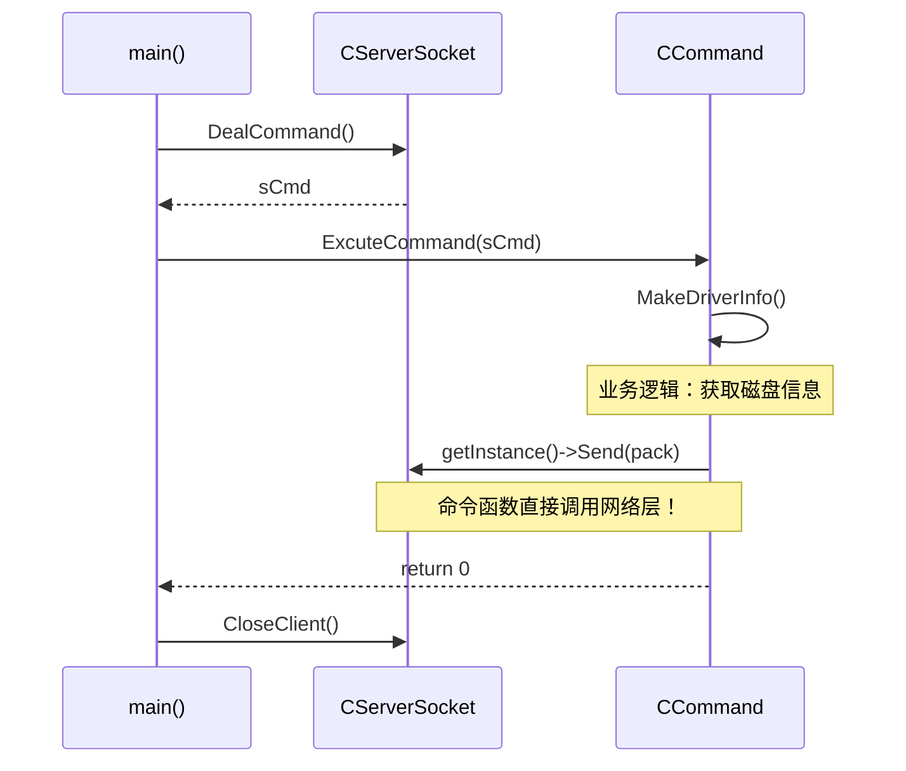
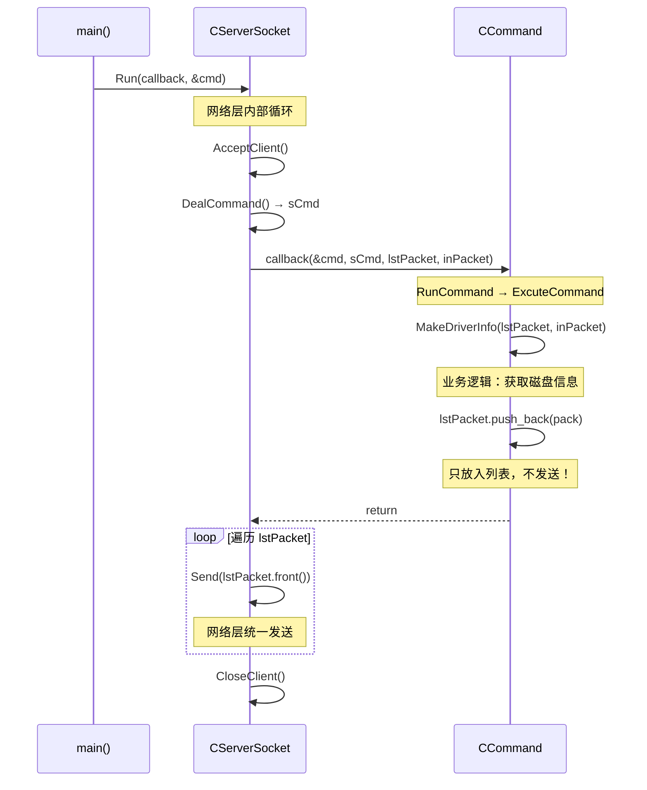

# 5.3 解耦命令处理和网络模块

> 通过**回调函数 + 数据包列表**机制，将 CCommand（命令处理）和 CServerSocket（网络通信）彻底解耦：命令函数不再直接调用网络发送，网络模块不再知道命令的存在。

---

## 重构概述

| 项目 | 重构前（5.2 版本） | 重构后（本次） |
|------|-------------------|---------------|
| **CPacket 位置** | 定义在 ServerSocket.h 内 | 独立为 Packet.h |
| **命令函数签名** | `int Func()` 无参数 | `int Func(list<CPacket>&, CPacket&)` |
| **命令函数如何发送数据** | 直接调用 `CServerSocket::getInstance()->Send()` | 将 CPacket 放入 `lstPacket` 列表，由网络层统一发送 |
| **命令函数如何获取数据** | 调用 `GetFilePath()`、`GetMouseEvent()` | 直接从 `inPacket` 参数读取 |
| **网络主循环位置** | `main()` 中手写 while 循环 | 封装为 `CServerSocket::Run()` |
| **main() 代码量** | ~40 行（含循环逻辑） | ~15 行（仅创建对象 + 调用 Run） |
| **模块间耦合** | CCommand 依赖 CServerSocket，CServerSocket 暴露大量 public 方法 | 通过 `SOCKET_CALLBACK` 函数指针解耦，互不直接依赖 |

> 📁 对应 Git 提交：`277a3b6` — "1 重构了命令处理模块 2 重构了网络处理模块 两个模块彻底解耦合"

---

## 设计背景

### 5.2 版本的遗留问题

[[5.2 代码重构]] 将全局函数封装为 CCommand 类，但**两个模块之间仍然紧耦合**：

```
5.2 版本的依赖关系（紧耦合）：

CCommand ──────────────────→ CServerSocket
  │ MakeDriverInfo()              │
  │   调用 getInstance()->Send()  │ 暴露 Send()
  │   调用 GetFilePath()          │ 暴露 GetFilePath()
  │   调用 GetMouseEvent()        │ 暴露 GetMouseEvent()
  │                               │
  └── 每个命令函数都直接依赖网络层
```

**具体问题**：

1. **CCommand 直接调用 CServerSocket**：每个命令函数内部都有 `CServerSocket::getInstance()->Send(pack)`，命令逻辑和网络发送混在一起
2. **CServerSocket 暴露过多接口**：`Send()`、`GetFilePath()`、`GetMouseEvent()`、`GetPacket()` 都是 public，任何代码都能调用
3. **main() 承担协调职责**：网络循环（AcceptClient → DealCommand → CloseClient）写在 main() 中，main 需要了解网络细节
4. **CPacket 与 CServerSocket 绑定**：CPacket、MOUSEEV、FILEINFO 都定义在 ServerSocket.h 中，想用 CPacket 就必须包含整个网络头文件

### 重构目标

1. **CCommand 不知道 CServerSocket 的存在**：命令函数只操作数据，不调用网络
2. **CServerSocket 不知道 CCommand 的存在**：网络层只负责收发，通过回调通知上层
3. **CPacket 独立**：协议包定义不依赖任何模块
4. **main() 极简化**：只做对象创建和启动

---

## 架构设计

### 新的依赖关系

```
5.3 版本的依赖关系（解耦）：

                    Packet.h（独立）
                   ╱          ╲
                  ╱            ╲
    CCommand ←──╱              ╲──→ CServerSocket
    (命令处理)                      (网络通信)
        │                              │
        │  不知道 CServerSocket        │  不知道 CCommand
        │  只操作 list<CPacket>        │  只通过回调通知
        │                              │
        └──── SOCKET_CALLBACK ────────┘
              (函数指针，桥梁)
```

**关键设计**：CCommand 和 CServerSocket **互不包含对方头文件**（虽然当前 Command.h 仍 include 了 ServerSocket.h，但命令函数内部不再调用 CServerSocket 的任何方法）。两者通过 `SOCKET_CALLBACK` 函数指针和 `std::list<CPacket>` 数据容器进行间接通信。

### 数据流对比

#### 重构前：命令函数直接发送



#### 重构后：命令函数只产出数据，网络层统一发送



### 重构后的文件结构

```
RemoteCtrl/
  ├── Packet.h              // ★ 新文件：CPacket + MOUSEEV + FILEINFO（独立）
  ├── ServerSocket.h         // CServerSocket（瘦身：移除 CPacket，新增 Run + 回调）
  ├── Command.h              // CCommand（命令函数签名变更，不再调用网络层）
  ├── Command.cpp            // 构造函数 + ExcuteCommand（签名变更）
  ├── RemoteCtrl.cpp         // main()（极简化）
  ├── EdoyunTool.h           // 工具类（未改动）
  └── EdoyunTool.cpp         // （未改动）
```

---

## 核心实现

### 1. Packet.h — 协议包独立

**重构思路**：CPacket、MOUSEEV、FILEINFO 是**纯数据结构**，不依赖网络层，应该独立存在。

> 📁 新文件 `Packet.h`

#### 搬迁内容

将以下内容从 ServerSocket.h 中**整体搬迁**到独立文件：

| 类/结构体 | 说明 | 原位置 | 行数 |
|-----------|------|--------|------|
| `CPacket` | 网络协议包（封装/解析） | ServerSocket.h 内 | ~130 行 |
| `MOUSEEV` | 鼠标事件结构体 | ServerSocket.h 内 | ~10 行 |
| `FILEINFO` | 文件信息结构体 | ServerSocket.h 内 | ~15 行 |

#### 重构前后的 #include 变化

```
===== 重构前（5.2）=====
ServerSocket.h 包含：CPacket + MOUSEEV + FILEINFO + CServerSocket（共 367 行）
Command.h:     #include "ServerSocket.h"  ← 为了用 CPacket，必须包含整个网络层

===== 重构后（5.3）=====
Packet.h 包含：CPacket + MOUSEEV + FILEINFO（共 165 行，独立）
ServerSocket.h: #include "Packet.h"       ← 网络层依赖协议包
Command.h:      #include "Packet.h"       ← 命令层依赖协议包（不再依赖网络层）
```

#### Packet.h 完整源码

```cpp
#pragma once
#include "pch.h"
#include "framework.h"
#include <list>

#pragma pack(push)
#pragma pack(1)    // 1 字节对齐，确保协议包内存布局精确

class CPacket
{
public:
    // ===== 默认构造 =====
    CPacket() :sHead(0), nLength(0), sCmd(0), sSum(0) {}

    // ===== 发送构造：从命令号 + 数据构建包 =====
    CPacket(WORD nCmd, const BYTE* pData, size_t nSize)
    {
        sHead = 0xFEFF;           // 固定包头
        nLength = nSize + 4;      // 数据长度 = 实际数据 + sCmd(2) + sSum(2)
        sCmd = nCmd;
        if (nSize > 0)
        {
            strData.resize(nSize);
            memcpy((void*)strData.c_str(), pData, nSize);
        }
        else
        {
            strData.clear();
        }
        // 计算校验和
        sSum = 0;
        for (size_t j = 0; j < strData.size(); j++)
        {
            sSum += BYTE(strData[j]) & 0xFF;
        }
    }

    // ===== 拷贝构造 =====
    CPacket(const CPacket& pack)
    {
        sHead = pack.sHead;
        nLength = pack.nLength;
        sCmd = pack.sCmd;
        strData = pack.strData;
        sSum = pack.sSum;
    }

    // ===== 解析构造：从原始字节流解析包 =====
    // nSize: 输入为缓冲区大小，输出为已消费的字节数（0 表示解析失败）
    CPacket(const BYTE* pData, size_t& nSize)
    {
        // 1. 搜索包头 0xFEFF
        size_t i = 0;
        for (; i < nSize; i++)
        {
            if (*(WORD*)(pData + i) == 0xFEFF)
            {
                sHead = *(WORD*)(pData + i);
                i += 2;
                break;
            }
        }
        // 2. 检查剩余数据是否足够（至少需要 nLength(4) + sCmd(2) + sSum(2)）
        if (i + 4 + 2 + 2 > nSize)
        {
            nSize = 0;    // 数据不完整，等待更多数据
            return;
        }
        // 3. 提取长度字段
        nLength = *(DWORD*)(pData + i);
        i += 4;
        if (nLength + i > nSize)
        {
            nSize = 0;    // 包体未完全接收
            return;
        }
        // 4. 提取命令号
        sCmd = *(WORD*)(pData + i);
        i += 2;
        // 5. 提取数据体
        if (nLength > 4)
        {
            strData.resize(nLength - 2 - 2);
            memcpy((void*)strData.c_str(), pData + i, nLength - 4);
            i += nLength - 4;
        }
        // 6. 提取并验证校验和
        sSum = *(WORD*)(pData + i);
        i += 2;
        WORD sum = 0;
        for (size_t j = 0; j < strData.size(); j++)
        {
            sum += BYTE(strData[j]) & 0xFF;
        }
        if (sum == sSum)
        {
            nSize = i;    // 解析成功，返回消费的字节数
            return;
        }
        nSize = 0;        // 校验失败
    }

    ~CPacket() {}

    // ===== 赋值运算符 =====
    CPacket& operator=(const CPacket& pack)
    {
        if (this != &pack)
        {
            sHead = pack.sHead;
            nLength = pack.nLength;
            sCmd = pack.sCmd;
            strData = pack.strData;
            sSum = pack.sSum;
        }
        return *this;
    }

    // ===== 序列化：返回可发送的字节流 =====
    int Size() { return nLength + 6; }  // 总大小 = sHead(2) + nLength(4) + 包体

    const char* Data()
    {
        strOut.resize(nLength + 6);
        BYTE* pData = (BYTE*)strOut.c_str();
        *(WORD*)pData = sHead;       pData += 2;
        *(DWORD*)(pData) = nLength;  pData += 4;
        *(WORD*)pData = sCmd;        pData += 2;
        memcpy(pData, strData.c_str(), strData.size());
        pData += strData.size();
        *(WORD*)pData = sSum;
        return strOut.c_str();
    }

public:
    WORD sHead;           // 包头：固定 0xFEFF
    DWORD nLength;        // 包体长度（从 sCmd 开始到 sSum 结束）
    WORD sCmd;            // 命令号
    std::string strData;  // 数据体
    WORD sSum;            // 校验和
    std::string strOut;   // 序列化输出缓冲
};

#pragma pack(pop)

// ===== 鼠标事件结构体 =====
typedef struct MouseEvent {
    MouseEvent()
    {
        nAction = 0;
        nButton = -1;
        ptXY.x = 0;
        ptXY.y = 0;
    }
    WORD nAction;   // 0=单击 1=双击 2=按下 3=松开
    WORD nButton;   // 0=左键 1=右键 2=中键 4=无按键
    POINT ptXY;     // 鼠标坐标
} MOUSEEV, *PMOUSEEV;

// ===== 文件信息结构体 =====
typedef struct file_info {
    file_info()
    {
        IsInvalid = FALSE;
        IsDirectory = -1;
        HasNext = TRUE;
        memset(szFileName, 0, sizeof(szFileName));
    }
    BOOL IsInvalid;          // 是否无效
    BOOL IsDirectory;        // 是否为目录
    BOOL HasNext;            // 是否有后续（0=最后一条）
    char szFileName[256];    // 文件名
} FILEINFO, *PFILEINFO;
```

> 📎 CPacket 的协议格式详解见 [[2.3 设计网络传输包协议]]

#### 独立的好处

| 维度 | 重构前 | 重构后 |
|------|--------|--------|
| **ServerSocket.h 行数** | 367 行（含 CPacket） | ~200 行（纯网络逻辑） |
| **Command.h 依赖** | 必须 `#include "ServerSocket.h"` | 只需 `#include "Packet.h"` |
| **新模块使用 CPacket** | 被迫引入整个网络层 | 只引入 Packet.h |
| **编译影响** | 改 CPacket 触发 ServerSocket 重编译 | 改 CPacket 不影响 ServerSocket 实现 |

### 2. SOCKET_CALLBACK — 解耦的桥梁

**重构思路**：CServerSocket 需要在收到命令后通知上层处理，但不应该知道上层是谁。解决方案：**函数指针回调**。

#### 回调机制的工作原理

回调（Callback）是一种**控制反转**模式：调用方不直接调用被调用方，而是把"做什么"的决定权交给外部传入的函数。

```
传统调用（紧耦合）：
  CServerSocket 直接调用 → CCommand::ExcuteCommand()
  CServerSocket 必须 #include "Command.h"

回调调用（松耦合）：
  main() 把 RunCommand 函数指针传给 → CServerSocket
  CServerSocket 收到命令后调用 → 函数指针（不知道是谁的函数）
  函数指针实际指向 → CCommand::RunCommand()
```

#### 回调类型定义

```cpp
// ServerSocket.h 中定义回调类型
typedef void (*SOCKET_CALLBACK)(
    void* arg,                    // 上层对象指针（void* 泛化）
    int status,                   // 命令状态（>0 为命令号，<0 为错误）
    std::list<CPacket>& lstPacket,// 输出：命令处理后要发送的数据包列表
    CPacket& inPacket             // 输入：收到的原始数据包
);
```

#### 四个参数的设计意图

| 参数 | 类型 | 方向 | 作用 | 谁填充 |
|------|------|------|------|--------|
| `void* arg` | `void*` | 输入 | 上层对象指针，CServerSocket 不知道具体类型 | main() 传入 `&cmd` |
| `int status` | `int` | 输入 | DealCommand 的返回值（>0 命令号，<0 错误码） | CServerSocket 填充 |
| `std::list<CPacket>& lstPacket` | 引用 | **输出** | 命令函数将要发送的包放入此列表 | CCommand 填充 |
| `CPacket& inPacket` | 引用 | 输入 | 客户端发来的原始数据包 | CServerSocket 填充 |

#### 回调的完整调用链

```
main() 中注册：
  CServerSocket::Run(&CCommand::RunCommand, &cmd)
                      ↑ 函数指针              ↑ void* arg

CServerSocket::Run() 内部调用：
  m_callback(m_arg, ret, lstPackets, m_packet)
      │        │     │       │          │
      │        │     │       │          └── CServerSocket 解析出的数据包
      │        │     │       └── 空列表，等待命令函数填充
      │        │     └── DealCommand() 返回的命令号
      │        └── main() 传入的 &cmd（CCommand 对象指针）
      └── main() 传入的 &CCommand::RunCommand

实际执行：
  CCommand::RunCommand(&cmd, sCmd, lstPackets, m_packet)
      │
      ├── CCommand* thiz = (CCommand*)arg;     // 恢复类型
      ├── thiz->ExcuteCommand(status, lstPacket, inPacket)
      │     └── (this->*it->second)(lstPacket, inPacket)  // map 查表分发
      │           └── MakeDriverInfo(lstPacket, inPacket)  // 具体命令
      │                 └── lstPacket.push_back(...)       // 填充响应包
      └── return（回到 CServerSocket::Run）

CServerSocket::Run() 继续：
  while (lstPackets.size() > 0)
      Send(lstPackets.front());    // 统一发送
      lstPackets.pop_front();      // 发送后移除
```

> [!info] 为什么用 `void*` 而不是模板或基类？
> `void*` 是 C 风格的泛化方式，让 CServerSocket 完全不依赖 CCommand 的类型。虽然不如 C++ 模板类型安全，但在 C/S 回调场景中是常见做法（类似 Win32 API 的 `LPARAM`/`WPARAM`、`_beginthreadex` 的 `void* arg`）。
>
> 更 Modern C++ 的做法是使用 `std::function<void(int, list<CPacket>&, CPacket&)>`，可以直接绑定成员函数，无需 `void*` 和手动类型转换。

### 3. CServerSocket 重构 — 完整前后对比

**重构思路**：将 main() 中的网络循环封装为 `Run()` 方法，同时将不需要外部调用的方法降级为 protected。

#### CServerSocket 成员变化

| 成员 | 重构前（5.2） | 重构后（5.3） | 说明 |
|------|-------------|-------------|------|
| `m_callback` | 不存在 | **新增** `SOCKET_CALLBACK` | 回调函数指针 |
| `m_arg` | 不存在 | **新增** `void*` | 上层对象指针 |
| `Run()` | 不存在 | **新增** public | 封装整个网络生命周期 |
| `InitSocket()` | **public** | **protected** | 不再需要外部调用 |
| `AcceptClient()` | **public** | **protected** | 不再需要外部调用 |
| `DealCommand()` | **public** | **protected** | 不再需要外部调用 |
| `Send()` | **public** | **protected** | 不再需要外部调用 |
| `CloseClient()` | **public** → 外部调用 | **protected** → Run 内部调用 | 不再需要外部调用 |
| `GetFilePath()` | **public** | **protected**（实际已无人调用） | CCommand 改为直接读 inPacket |
| `GetMouseEvent()` | **public** | **protected**（实际已无人调用） | CCommand 改为直接读 inPacket |
| `GetPacket()` | **public** | **protected**（实际已无人调用） | 数据通过回调参数传递 |

> [!tip] 访问控制的变化意义
> 重构前 CServerSocket 有 7 个 public 方法（getInstance、InitSocket、AcceptClient、DealCommand、Send、CloseClient、GetPacket 等），任何代码都能调用。重构后只剩 2 个 public 方法（`getInstance` 和 `Run`），**攻击面大幅缩小**。

#### Run() 完整源码

```cpp
int Run(SOCKET_CALLBACK callback, void* arg, short port = 9527)
{
    // ===== 1. 初始化网络 =====
    bool ret = InitSocket(port);
    if (ret == false) return -1;

    // ===== 2. 保存回调信息 =====
    std::list<CPacket> lstPackets;  // 待发送的数据包列表（在循环外创建）
    m_callback = callback;
    m_arg = arg;
    int count = 0;

    // ===== 3. 主循环：接受连接 → 处理命令 → 发送响应 → 关闭连接 =====
    while (true)
    {
        // 3.1 等待客户端连接
        if (AcceptClient() == false)
        {
            if (count >= 3) return -2;  // 连续 3 次失败，退出
            count++;
        }

        // 3.2 接收并解析命令
        int ret = DealCommand();

        // 3.3 通过回调通知上层处理命令
        if (ret > 0)
        {
            // 回调：CCommand::RunCommand 被调用
            // CCommand 将响应包放入 lstPackets
            m_callback(m_arg, ret, lstPackets, m_packet);

            // 3.4 统一发送所有响应包
            while (lstPackets.size() > 0)
            {
                Send(lstPackets.front());
                lstPackets.pop_front();
            }
        }

        // 3.5 关闭本次连接，等待下一个
        CloseClient();
    }
    return 0;
}
```

#### 重构前 main() 中的网络循环（已删除）

```cpp
// 5.2 版本：main() 手写网络循环
CCommand cmd;
CServerSocket* pserver = CServerSocket::getInstance();
if (pserver->InitSocket() == false) { /* 错误处理 */ }

while (CServerSocket::getInstance() != NULL)
{
    if (pserver->AcceptClient() == false) { /* 重试逻辑 */ }
    int ret = pserver->DealCommand();
    if (ret > 0)
    {
        ret = cmd.ExcuteCommand(pserver->GetPacket().sCmd);
        pserver->CloseClient();
    }
}
```

**对比**：重构前 main() 需要了解 InitSocket → AcceptClient → DealCommand → GetPacket → ExcuteCommand → CloseClient 的完整流程。重构后 main() 只需一行 `Run(callback, &cmd)`。

### 4. CCommand 的变化 — 不再依赖网络层

**重构思路**：命令函数的职责从"处理业务 + 发送数据"变为"处理业务 + 产出数据"。

#### 4.1 函数签名变更

```cpp
// ===== 重构前（5.2）=====
typedef int(CCommand::* CMDFUNC)();  // 无参数

// ===== 重构后（5.3）=====
typedef int(CCommand::* CMDFUNC)(std::list<CPacket>&, CPacket&);  // 带参数
```

ExcuteCommand 也相应变更：

```cpp
// ===== 重构前 =====
int CCommand::ExcuteCommand(int nCmd)
{
    std::map<int, CMDFUNC>::iterator it = m_mapFunction.find(nCmd);
    if (it == m_mapFunction.end()) return -1;
    return (this->*it->second)();  // 无参调用
}

// ===== 重构后 =====
int CCommand::ExcuteCommand(int nCmd, std::list<CPacket>& lstPacket, CPacket& inPacket)
{
    std::map<int, CMDFUNC>::iterator it = m_mapFunction.find(nCmd);
    if (it == m_mapFunction.end()) return -1;
    return (this->*it->second)(lstPacket, inPacket);  // 传递列表和输入包
}
```

#### 4.2 命令函数完整对比：MakeDriverInfo

```cpp
// ===== 重构前（5.2）：直接调用网络层 =====
int MakeDriverInfo()
{
    std::string result;
    for (int i = 1; i <= 26; i++)
    {
        if (_chdrive(i) == 0)
        {
            if (result.size() > 0) result += ',';
            result += 'A' + i - 1;
        }
    }
    CPacket pack(1, (BYTE*)result.c_str(), result.size());
    CEdoyunTool::Dump((BYTE*)pack.Data(), pack.Size());
    // ↓↓↓ 直接调用 CServerSocket 发送 ↓↓↓
    CServerSocket::getInstance()->Send(pack);
    return 0;
}

// ===== 重构后（5.3）：只填充列表 =====
int MakeDriverInfo(std::list<CPacket>& lstPacket, CPacket& inPacket)
{
    std::string result;
    for (int i = 1; i <= 26; i++)
    {
        if (_chdrive(i) == 0)
        {
            if (result.size() > 0) result += ',';
            result += 'A' + i - 1;
        }
    }
    // ↓↓↓ 只放入列表，不发送 ↓↓↓
    lstPacket.push_back(CPacket(1, (BYTE*)result.c_str(), result.size()));
    return 0;
}
```

**变化点**：
1. 删除了 `CServerSocket::getInstance()->Send(pack)` — 不再依赖网络层
2. 删除了 `CEdoyunTool::Dump(...)` — 调试代码清理
3. 改为 `lstPacket.push_back(...)` — 将响应包放入列表

#### 4.3 命令函数完整对比：MakeDirectoryInfo（数据获取方式变更）

```cpp
// ===== 重构前（5.2）：通过 CServerSocket 获取路径 =====
int MakeDirectoryInfo()
{
    std::string strPath;
    std::list<FILEINFO> lstFileInfos;
    // ↓↓↓ 通过网络层的辅助方法获取数据 ↓↓↓
    if (CServerSocket::getInstance()->GetFilePath(strPath) == false)
    {
        OutputDebugString(_T("当前的命令，不是获取文件列表，命令获取错误"));
        return -1;
    }
    // ... 遍历目录 ...
    CPacket pack(2, (BYTE*)&finfo, sizeof(finfo));
    CServerSocket::getInstance()->Send(pack);  // 直接发送
    // ...
}

// ===== 重构后（5.3）：直接从 inPacket 读取 =====
int MakeDirectoryInfo(std::list<CPacket>& lstPacket, CPacket& inPacket)
{
    // ↓↓↓ 直接从输入包读取路径，不依赖网络层 ↓↓↓
    std::string strPath = inPacket.strData;

    if (_chdir(strPath.c_str()) != 0)
    {
        FILEINFO finfo;
        finfo.HasNext = FALSE;
        lstPacket.push_back(CPacket(2, (BYTE*)&finfo, sizeof(finfo)));
        OutputDebugString(_T("没有权限访问目录!!"));
        return -2;
    }
    _finddata_t fdata;
    int hfind = 0;
    if ((hfind = _findfirst("*", &fdata)) == -1)
    {
        OutputDebugString(_T("没有找到任何文件!!"));
        FILEINFO finfo;
        finfo.HasNext = FALSE;
        lstPacket.push_back(CPacket(2, (BYTE*)&finfo, sizeof(finfo)));
        return -3;
    }
    int count = 0;
    do {
        FILEINFO finfo;
        finfo.IsDirectory = (fdata.attrib & _A_SUBDIR) != 0;
        memcpy(finfo.szFileName, fdata.name, strlen(fdata.name));
        TRACE("%s\r\n", finfo.szFileName);
        // ↓↓↓ 每个文件信息都放入列表 ↓↓↓
        lstPacket.push_back(CPacket(2, (BYTE*)&finfo, sizeof(finfo)));
        count++;
    } while (!_findnext(hfind, &fdata));
    TRACE("server:count = %d\r\n", count);
    // 结束标记
    FILEINFO finfo;
    finfo.HasNext = FALSE;
    lstPacket.push_back(CPacket(2, (BYTE*)&finfo, sizeof(finfo)));
    return 0;
}
```

**变化点**：
1. `CServerSocket::getInstance()->GetFilePath(strPath)` → `inPacket.strData` — 数据来源从网络层变为参数
2. 删除了 `GetFilePath` 的命令号校验逻辑 — 因为 ExcuteCommand 已经通过 map 确保了命令号正确
3. 所有 `Send(pack)` → `lstPacket.push_back(pack)` — 多个文件信息包都放入列表

#### 4.4 命令函数完整对比：MouseEvent（结构体数据获取变更）

```cpp
// ===== 重构前（5.2）=====
int MouseEvent()
{
    MOUSEEV mouse;
    // ↓↓↓ 通过网络层辅助方法获取鼠标事件 ↓↓↓
    if (CServerSocket::getInstance()->GetMouseEvent(mouse))
    {
        // ... 处理鼠标事件 ...
        CPacket pack(4, NULL, 0);
        CServerSocket::getInstance()->Send(pack);
    }
    return 0;
}

// ===== 重构后（5.3）=====
int MouseEvent(std::list<CPacket>& lstPacket, CPacket& inPacket)
{
    MOUSEEV mouse;
    // ↓↓↓ 直接从 inPacket 中 memcpy 出鼠标事件结构体 ↓↓↓
    memcpy(&mouse, inPacket.strData.c_str(), sizeof(MOUSEEV));

    // ... 处理鼠标事件（与之前相同）...

    lstPacket.push_back(CPacket(5, NULL, 0));  // 注意：命令号修正为 5
    return 0;
}
```

**变化点**：
1. `GetMouseEvent(mouse)` → `memcpy(&mouse, inPacket.strData.c_str(), sizeof(MOUSEEV))` — 直接从包数据中提取
2. 删除了 `if` 判断 — 不再需要检查命令号是否匹配（map 已保证）
3. 响应包命令号从 `4` 修正为 `5` — 修复了之前的 Bug

#### 4.5 所有命令函数的变更模式总结

| 命令函数 | 数据获取方式变更 | 发送方式变更 |
|---------|----------------|-------------|
| `MakeDriverInfo` | 无输入数据 | `Send(pack)` → `lstPacket.push_back(pack)` |
| `MakeDirectoryInfo` | `GetFilePath()` → `inPacket.strData` | 同上 |
| `RunFile` | `GetFilePath()` → `inPacket.strData` | 同上 |
| `DownloadFile` | `GetFilePath()` → `inPacket.strData` | 同上 |
| `MouseEvent` | `GetMouseEvent()` → `memcpy(inPacket)` | 同上 |
| `SendScreen` | 无输入数据 | 同上 |
| `LockMachine` | 无输入数据 | 同上 |
| `UnlockMachine` | 无输入数据 | 同上 |
| `DeleteLocalFile` | `GetFilePath()` → `inPacket.strData` | 同上 |
| `TestConnect` | 无输入数据 | 同上 |

#### RunCommand — 静态回调桥接函数

CCommand 新增了一个 **static 函数**，作为 CServerSocket 回调的入口：

```cpp
class CCommand
{
public:
    // 静态回调函数：CServerSocket 通过此函数通知 CCommand
    // 签名必须匹配 SOCKET_CALLBACK 类型：void(*)(void*, int, list<CPacket>&, CPacket&)
    static void RunCommand(void* arg, int status,
                           std::list<CPacket>& lstPacket, CPacket& inPacket)
    {
        // ===== 1. 恢复对象指针 =====
        CCommand* thiz = (CCommand*)arg;  // void* → CCommand*

        // ===== 2. 根据状态分发 =====
        if (status > 0)
        {
            // status > 0 表示有效命令号，调用 ExcuteCommand 分发
            int ret = thiz->ExcuteCommand(status, lstPacket, inPacket);
            if (ret != 0)
            {
                TRACE("执行命令失败：%d ret=%d\r\n", status, ret);
            }
        }
        else
        {
            // status <= 0 表示网络错误
            MessageBox(NULL, _T("无法正常接入用户，自动重试"),
                       _T("接入用户失败"), MB_OK | MB_ICONERROR);
        }
    }
};
```

**为什么必须是 static？**

| 函数类型 | 隐含参数 | 能否匹配 `void(*)(void*, int, ...)` |
|---------|---------|-------------------------------------|
| 普通全局函数 | 无 | ✅ 可以 |
| **static** 成员函数 | 无 | ✅ 可以（与全局函数等价） |
| 非 static 成员函数 | 隐含 `this` | ❌ 不可以（多了一个参数） |

- `SOCKET_CALLBACK` 是普通函数指针 `void(*)(void*, int, ...)`
- 非 static 成员函数有隐含的 `this` 参数，签名实际是 `void(CCommand*, void*, int, ...)`，多了一个参数
- static 成员函数没有 `this`，签名与普通函数指针兼容
- 通过 `void* arg` 传入对象指针，在函数内部手动恢复：`CCommand* thiz = (CCommand*)arg`

> 📎 这个模式在 [[5.2 代码重构]] 的 `threadLockDlg` 中也用过：`_beginthreadex` 要求 `unsigned(__stdcall*)(void*)`，同样用 static + void* 解决。

### 5. main() — 极简化（完整源码）

> 📁 `RemoteCtrl.cpp`（重构后完整代码）

```cpp
#include "pch.h"
#include "framework.h"
#include "RemoteCtrl.h"
#include "ServerSocket.h"
#include "EdoyunTool.h"
#include "Command.h"

#ifdef _DEBUG
#define new DEBUG_NEW
#endif

CWinApp theApp;
using namespace std;

int main()
{
    int nRetCode = 0;
    HMODULE hModule = ::GetModuleHandle(nullptr);

    if (hModule != nullptr)
    {
        if (!AfxWinInit(hModule, nullptr, ::GetCommandLine(), 0))
        {
            wprintf(L"错误: MFC 初始化失败\n");
            nRetCode = 1;
        }
        else
        {
            // ===== 核心代码只有两行 =====
            CCommand cmd;
            int ret = CServerSocket::getInstance()->Run(
                &CCommand::RunCommand,   // 回调函数
                &cmd                     // CCommand 对象指针
            );

            // 处理 Run() 返回的错误码
            switch (ret)
            {
            case -1:
                MessageBox(NULL,
                    _T("网络初始化异常，未能成功初始化，请检查网络状态！"),
                    _T("网络初始化失败"), MB_OK | MB_ICONERROR);
                exit(0);
                break;
            case -2:
                MessageBox(NULL,
                    _T("无法正常接入用户，自动重试"),
                    _T("接入用户失败"), MB_OK | MB_ICONERROR);
                exit(0);
                break;
            default:
                break;
            }
        }
    }
    else
    {
        wprintf(L"错误: GetModuleHandle 失败\n");
        nRetCode = 1;
    }
    return nRetCode;
}
```

#### main() 三个版本的演进对比

| 版本 | main() 核心逻辑 | 行数 | main() 知道什么 |
|------|-----------------|------|----------------|
| **5.1（原始）** | 手写网络循环 + switch-case 分发 + 全局命令函数 | ~555 行（整个文件） | 一切细节 |
| **5.2（CCommand）** | 手写网络循环 + `cmd.ExcuteCommand(sCmd)` | ~40 行 | 网络循环细节 |
| **5.3（解耦）** | `CServerSocket::Run(callback, &cmd)` | ~15 行 | 几乎什么都不知道 |

---

## 解耦效果总结

### 各模块的职责边界

| 模块 | 知道什么 | 不知道什么 |
|------|---------|-----------|
| **main()** | CCommand 和 CServerSocket 的存在 | 网络循环细节、命令处理细节 |
| **CServerSocket** | 如何收发数据、回调函数签名 | CCommand 的存在、命令如何处理 |
| **CCommand** | 如何处理各种命令、CPacket 的格式 | CServerSocket 的存在、数据如何发送 |
| **Packet.h** | 协议格式 | 谁在使用它 |

### 依赖关系对比

```
===== 重构前（5.2）=====

main() ──→ CServerSocket ←── CCommand
              │ (包含 CPacket)    │
              │                   │
              └── CCommand 直接调用 CServerSocket::Send()
                  CCommand 直接调用 CServerSocket::GetFilePath()
                  CCommand 直接调用 CServerSocket::GetMouseEvent()

===== 重构后（5.3）=====

main() ──→ CServerSocket ──→ Packet.h ←── CCommand
              │                               │
              │  通过 SOCKET_CALLBACK          │
              │  间接调用 CCommand             │
              │                               │
              └── CCommand 不调用 CServerSocket 的任何方法
```

### 如果要替换网络层？

| 场景 | 重构前需要改 | 重构后需要改 |
|------|-------------|-------------|
| 把 Winsock 换成 IOCP | CServerSocket + 所有 CCommand 函数 | 只改 CServerSocket |
| 新增一个命令 | CCommand + 可能改 CServerSocket | 只改 CCommand |
| 修改协议格式 | CPacket + CServerSocket + CCommand | 只改 Packet.h |

---

## 易错点与调试

> [!warning] 回调函数的常见陷阱

> **Debug 日志索引**：
> | Bug | Debug 日志 | 修复版本 |
> |-----|-----------|---------|
> | DownloadFile 发送 data 而非 buffer | [[Debug-007 文件下载发送文件大小而非文件内容]] | 5.5 (`174aee7`) |
> | _findfirst 类型回退 | [[Debug-001 获取目录信息崩溃与数据丢失]] | 5.4/5.5 (`174aee7`) |

### 1. static 函数中 void* 转换的安全性

```cpp
// RunCommand 中的类型转换
CCommand* thiz = (CCommand*)arg;

// 如果 main() 中传错了对象：
CServerSocket::getInstance()->Run(&CCommand::RunCommand, nullptr);  // ❌ 空指针崩溃
CServerSocket::getInstance()->Run(&CCommand::RunCommand, &cmd);     // ✅ 正确
```

**风险**：`void*` 没有类型检查，传错对象会导致未定义行为。编译器不会报错。如果传入了一个 `CServerSocket*` 而非 `CCommand*`，程序会在调用成员函数时崩溃或产生随机行为。

### 2. lstPacket 的生命周期与清空时机

```cpp
// Run() 中 lstPackets 是局部变量
int Run(SOCKET_CALLBACK callback, void* arg, short port = 9527)
{
    std::list<CPacket> lstPackets;  // 在循环外创建，整个生命周期内复用
    while (true)
    {
        // ... AcceptClient, DealCommand ...
        m_callback(m_arg, ret, lstPackets, m_packet);

        // 发送后逐个移除
        while (lstPackets.size() > 0)
        {
            Send(lstPackets.front());
            lstPackets.pop_front();  // 发送后移除
        }
        // 循环结束时 lstPackets 已清空，下次回调时是空列表 ✅
    }
}
```

命令函数必须在**每次调用时**将所有要发送的包都 push_back 进去，不能依赖上次调用的残留数据。如果某个命令函数忘记 push_back，客户端将收不到任何响应。

### 3. DownloadFile 中的 Bug（重构引入）

> 📎 详见 [[Debug-007 文件下载发送文件大小而非文件内容]]

```cpp
// 当前代码有 bug：发送的是 data（文件大小）而不是 buffer（文件内容）
int DownloadFile(std::list<CPacket>& lstPacket, CPacket& inPacket)
{
    std::string strPath = inPacket.strData;
    long long data = 0;
    FILE* pFile = NULL;
    errno_t err = fopen_s(&pFile, strPath.c_str(), "rb");
    // ...
    if (pFile != NULL)
    {
        fseek(pFile, 0, SEEK_END);
        data = _ftelli64(pFile);
        lstPacket.push_back(CPacket(4, (BYTE*)&data, 8));  // ✅ 发送文件大小
        fseek(pFile, 0, SEEK_SET);
        char buffer[1024] = "";
        size_t rlen = 0;
        do {
            rlen = fread(buffer, 1, 1024, pFile);
            lstPacket.push_back(CPacket(4, (BYTE*)&data, 8));  // ❌ Bug！应该是 buffer, rlen
        } while (rlen >= 1024);
        fclose(pFile);
    }
    lstPacket.push_back(CPacket(4, (BYTE*)&data, 8));  // ❌ 结束包也写错了
    return 0;
}
```

**问题分析**：重构时将 `Send(pack)` 批量替换为 `lstPacket.push_back()`，但循环体内和结束标记的参数都写成了 `(BYTE*)&data, 8`（文件大小），而不是 `(BYTE*)buffer, rlen`（文件内容）和 `NULL, 0`（结束标记）。

> ✅ 已在 [[5.5 Bug 修复与冗余代码清理]] 中修复（commit `174aee7`）

**正确代码应为**：
```cpp
do {
    rlen = fread(buffer, 1, 1024, pFile);
    lstPacket.push_back(CPacket(4, (BYTE*)buffer, rlen));   // ✅ 发送文件内容
} while (rlen >= 1024);
// ...
lstPacket.push_back(CPacket(4, NULL, 0));                   // ✅ 发送结束标记
```

### 4. _findfirst 返回值类型回退

> 📎 详见 [[Debug-001 获取目录信息崩溃与数据丢失]]

```cpp
// 5.2 版本已修复为 intptr_t
intptr_t hfind = 0;  // ✅ 64位安全

// 5.3 版本回退为 int
int hfind = 0;       // ❌ 64位系统可能截断句柄值
```

重构过程中，MakeDirectoryInfo 的代码被重写，`intptr_t hfind` 回退为 `int hfind`。这是 [[5.2 代码重构#Bug 1：_findfirst 返回值类型截断]] 中已经修复过的问题，在本次重构中意外回退。

> ✅ 已在 [[5.5 Bug 修复与冗余代码清理]] 中确认修复（commit `174aee7`）

### 5. CloseClient 缺少 INVALID_SOCKET 检查

```cpp
// 5.2 版本有检查
void CloseClient()
{
    if (m_client != INVALID_SOCKET)  // ✅ 先检查
    {
        closesocket(m_client);
        m_client = INVALID_SOCKET;
    }
}

// 5.3 版本的 Run() 中，CloseClient 在每次循环都调用
// 如果 AcceptClient 失败（m_client == -1），仍然会调用 CloseClient
// 当前 CloseClient 内部有检查，所以不会崩溃，但逻辑上不够严谨
```

---

## 关联知识

- [[5.2 代码重构]] — 上一次重构：建立 CCommand 类，switch-case → map，本次在此基础上进一步解耦
- [[5.1 入门]] — 重构前的 UML 时序图，展示了旧的全局函数调用关系
- [[2.2 网络编程架构设计]] — CServerSocket 单例模式的原始设计，本次新增 Run() 和回调机制
- [[2.3 设计网络传输包协议]] — CPacket 的完整实现（现已独立为 Packet.h）
- [[2.4 获取磁盘分区信息]] — MakeDriverInfo 的业务逻辑（本次只改了发送方式）
- [[2.5 获取指定文件目录下的文件和文件夹]] — MakeDirectoryInfo 的业务逻辑
- [[4.1 文件下载功能的实现]] — DownloadFile 的业务逻辑（本次重构引入了参数 Bug）
- [[4.8 鼠标远程控制（被控端）与 Bug 修复]] — MouseEvent 的业务逻辑（本次改为直接从 inPacket 读取）

---

## 代码索引

| 功能 | 文件 | 说明 |
|------|------|------|
| CPacket + MOUSEEV + FILEINFO | Packet.h（165 行） | ★ 新文件，从 ServerSocket.h 独立 |
| SOCKET_CALLBACK 定义 | ServerSocket.h | 回调函数指针类型 |
| CServerSocket::Run() | ServerSocket.h | 封装网络循环 + 回调机制 |
| CServerSocket 成员变量 | ServerSocket.h | 新增 m_callback、m_arg |
| CCommand::RunCommand() | Command.h | 静态回调桥接函数 |
| CMDFUNC 类型变更 | Command.h | `int()` → `int(list<CPacket>&, CPacket&)` |
| ExcuteCommand 签名变更 | Command.cpp | 增加 lstPacket + inPacket 参数 |
| 所有命令函数签名变更 | Command.h | 10 个函数全部增加参数 |
| 极简化 main() | RemoteCtrl.cpp | 仅创建对象 + 调用 Run() |

---

## 更新记录

| 日期 | 变更 |
|------|------|
| 2026-02-08 | 初始版本，分析 commit `277a3b6` 的解耦重构 |
| 2026-02-09 | 补充：Packet.h 完整源码、CServerSocket 成员变化表、回调调用链、命令函数完整对比（4 个）、main() 三版本演进、Bug 回退分析 |

---

#项目/远控系统
