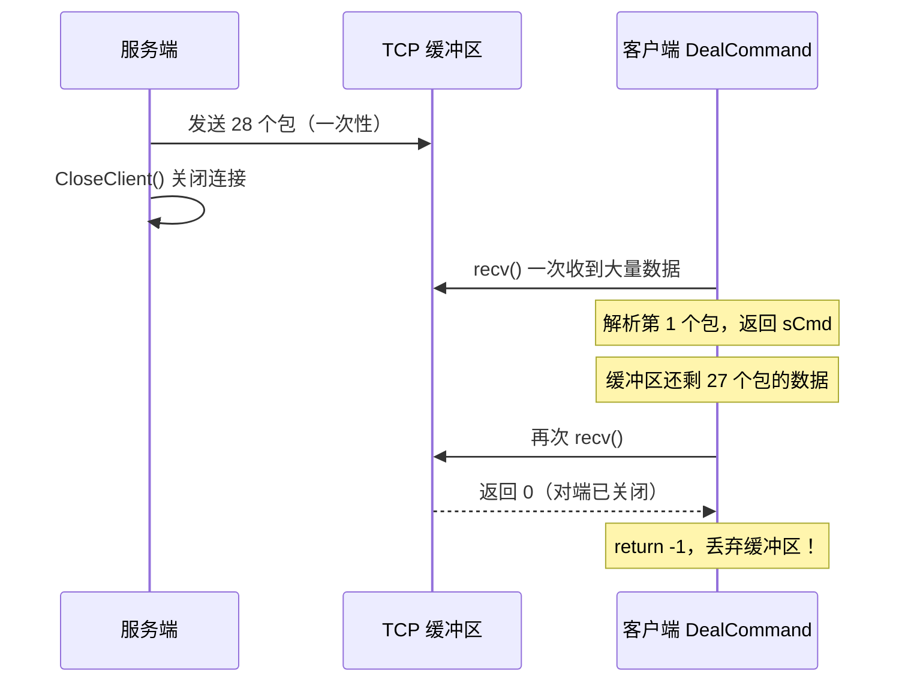

> 修复两个导致"点击 C 盘无法显示目录"的 Bug：服务端 `_findfirst` 句柄在 x64 下被截断导致崩溃，以及客户端 `DealCommand` 未优先消费缓冲区导致 TCP 数据丢失。

---

## 功能概述

| 项目 | 说明 |
|------|------|
| **影响命令** | `sCmd=2`（获取目录列表） |
| **Bug 数量** | 2 个（串联出现，修复第一个才暴露第二个） |
| **涉及文件** | `Command.h`（服务端）、`CClientSocket.h`（客户端） |
| **Debug 日志** | [[Debug-001 获取目录信息崩溃与数据丢失]] |

---

## Debug 日志

完整的现象、断点与崩溃信息放在 Debug 日志中，主笔记只保留结论与修复点：

- [[Debug-001 获取目录信息崩溃与数据丢失]]

---

## Bug 1：`_findfirst` 句柄截断（服务端崩溃）

### 问题分析

崩溃信息：

```
0x00007FFCFFE454A6 (ntdll.dll) 处引发的异常:
0xC0000005: 写入位置 0xFFFFFFFFEFC4DE40 时发生访问冲突
```

崩溃地址 `0xFFFFFFFFEFC4DE40` 的特征：**高 32 位全是 `F`**，这是 32 位有符号负数被符号扩展到 64 位的典型表现。

问题出在 `MakeDirectoryInfo` 中：

> 📁 `RemoteCtrl/Command.h` : MakeDirectoryInfo

```cpp
_finddata_t fdata;
int hfind = 0;    // ← int 是 32 位
// _findfirst 返回 intptr_t（x64 下是 64 位）
// 返回值被截断为 32 位存入 hfind
if ((hfind = _findfirst("*", &fdata)) == -1)
{
    // ...
}
do {
    // ...
    // _findnext 使用截断后的无效句柄 → 访问冲突！
} while (!_findnext(hfind, &fdata));
```

### 截断过程图解

```
_findfirst 返回值（64位）:  0x00000001 2345ABCD
                            ├─高32位─┤├─低32位─┤

存入 int hfind（32位截断）:           0x2345ABCD
                                      ├─低32位─┤

_findnext 使用时（符号扩展）: 0x00000000 2345ABCD  (如果正数)
                         或: 0xFFFFFFFF XXXX XXXX  (如果截断后为负数)
                              ↑ 无效地址，访问冲突！
```

### `_findfirst` / `_findnext` API 说明

```cpp
// <io.h> 中的声明
intptr_t _findfirst(const char* filespec, _finddata_t* fileinfo);
int      _findnext(intptr_t handle, _finddata_t* fileinfo);
int      _findclose(intptr_t handle);
```

| 平台 | `intptr_t` 大小 | `int` 大小 | 是否截断 |
|------|-----------------|-----------|---------|
| x86 (Win32) | 4 字节 | 4 字节 | ❌ 不截断 |
| **x64** | **8 字节** | **4 字节** | **✅ 截断！** |

这就是为什么 Win32 编译时没问题，切换到 **x64 才暴露**的原因。

### 修复

```cpp
// [原代码] int hfind = 0;
// [问题] 64位系统 _findfirst 返回 intptr_t(64位)，用 int(32位) 存储会截断句柄值
// [新代码] 使用 intptr_t 确保在 64 位系统正确存储句柄
intptr_t hfind = 0;
// [新代码结束]
if ((hfind = _findfirst("*", &fdata)) == -1)
```

> 📎 `_findfirst`/`_findnext` 的基本用法详见 [[2.5 获取指定文件目录下的文件和文件夹]]

---

## Bug 2：客户端缓冲区数据丢失

修复 Bug 1 后，服务端成功遍历 C 盘根目录（27 个文件/目录），全部发送。但客户端只显示了一部分。

### 问题分析

**服务端发送流程**（[[5.3 解耦命令处理和网络模块]] 中的 `Run()` 循环）：

```cpp
// ServerSocket.h - Run()
m_callback(m_arg, ret, lstPackets, m_packet);  // 生成 27+1 个包
while (lstPackets.size() > 0)
{
    Send(lstPackets.front());   // 一次性全部发送
    lstPackets.pop_front();
}
CloseClient();                  // ← 发完立即关闭连接！
```

**客户端接收流程**：



问题出在客户端 `DealCommand()` 的逻辑顺序：

> 📁 `RemoteClient/CClientSocket.h` : DealCommand（修复前）

```cpp
static size_t index = 0;   // 跨调用保持的缓冲区偏移
while(TRUE)
{
    // 问题：每次循环都先 recv，不检查缓冲区
    int ilen = recv(m_sock, buffer + index, ...);
    if (ilen == 0)          // 对端关闭
        return -1;          // ← 直接返回！缓冲区数据被丢弃
    if (ilen == SOCKET_ERROR)
        return -1;

    index += (size_t)ilen;
    size_t len = index;
    m_packet = CPacket((BYTE*)buffer, len);
    if (len > 0)
    {
        memmove(buffer, buffer + len, index - len);
        index -= len;
        return m_packet.sCmd;  // 解析一个包就返回
    }
}
```

**时序问题**：

1. 第一次 `DealCommand()`：`recv` 一次收到所有 28 个包的数据，解析第 1 个包返回，`index` 记录了剩余数据量
2. 第二次 `DealCommand()`：**又先调用 `recv`**，但服务端已关闭连接，`recv` 返回 0 → `return -1`
3. **缓冲区里还有 27 个包的数据，全部丢失**

### 修复

在 `recv` 之前，先检查缓冲区中是否已有完整的包：

> 📁 `RemoteClient/CClientSocket.h` : DealCommand（修复后）

```cpp
static size_t index = 0;
while(TRUE)
{
    // [新代码] 先检查缓冲区中是否已有完整的包，
    // 避免在连接关闭后丢失已接收的数据
    if (index > 0)
    {
        size_t len = index;
        m_packet = CPacket((BYTE*)buffer, len);
        if (len > 0)
        {
            memmove(buffer, buffer + len, index - len);
            index -= len;
            return m_packet.sCmd;
        }
    }
    // [新代码结束]

    if (index >= BUFFER_SIZE)
        return -1;
    int ilen = recv(m_sock, buffer + index, ...);
    // ... 后续逻辑不变
}
```

**修复逻辑**：

```
DealCommand() 进入
  │
  ├── 缓冲区有数据？(index > 0)
  │     ├── 能解析出完整包？→ 直接返回，不需要 recv
  │     └── 数据不完整 → 继续往下 recv
  │
  └── recv() 获取更多数据
        ├── 返回 0 → 对端关闭，return -1
        ├── 返回 -1 → 错误，return -1
        └── 返回 > 0 → 累加到缓冲区，尝试解析
```

---

## 两个 Bug 的关联

这两个 Bug 是**串联关系**，必须按顺序修复：

```
Bug 1 存在时：
  服务端崩溃 → 连接断开 → 客户端 recv 返回 0 → ack:-1
  （Bug 2 被掩盖，因为服务端根本没发出数据）

Bug 1 修复后：
  服务端正常发送 27 个包 → CloseClient()
  → 客户端只收到部分 → Bug 2 暴露
```

---

## 易错点与调试经验

> [!warning] x64 移植常见陷阱

### 1. 句柄/指针类型必须匹配平台位宽

```cpp
// ❌ 错误：x64 下截断
int hfind = _findfirst("*", &fdata);
int handle = (int)GetStdHandle(STD_OUTPUT_HANDLE);

// ✅ 正确：使用平台无关类型
intptr_t hfind = _findfirst("*", &fdata);
HANDLE handle = GetStdHandle(STD_OUTPUT_HANDLE);
```

### 2. TCP 接收必须"先消费缓冲区，再 recv"

```cpp
// ❌ 错误：每次都先 recv，可能在连接关闭后丢失缓冲区数据
while (true) {
    int len = recv(sock, buf + idx, ...);
    if (len <= 0) return -1;  // 缓冲区数据丢失！
    // parse...
}

// ✅ 正确：先检查缓冲区
while (true) {
    if (idx > 0 && tryParse(buf, idx))  // 先消费已有数据
        return parsed_cmd;
    int len = recv(sock, buf + idx, ...);
    if (len <= 0) return -1;
    // parse...
}
```

### 3. 识别地址截断的特征

| 崩溃地址特征 | 含义 |
|-------------|------|
| `0xFFFFFFFF XXXXXXXX` | 32 位负数被符号扩展到 64 位 |
| `0x00000000 XXXXXXXX` | 32 位正数被零扩展到 64 位 |
| `0xCCCCCCCC CCCCCCCC` | 未初始化的栈内存（Debug 模式） |
| `0xCDCDCDCD CDCDCDCD` | 未初始化的堆内存（Debug 模式） |

---

## 关联知识

- [[2.5 获取指定文件目录下的文件和文件夹]] — `_findfirst`/`_findnext` 的基本用法
- [[2.3 设计网络传输包协议]] — CPacket 协议格式与粘包处理
- [[5.3 解耦命令处理和网络模块]] — `Run()` 循环的发送逻辑
- [[5.4 修改]] — 同一功能的另一个 Bug（路径编码问题）
- [[4.2 文件和盘符显示不全bug修复]] — 之前的 TCP 粘包相关修复

---

## 代码索引

| 功能 | 文件 | 位置 |
|------|------|------|
| `_findfirst` 句柄修复 | `RemoteCtrl/Command.h` | `MakeDirectoryInfo` 函数 |
| 缓冲区优先消费 | `RemoteClient/CClientSocket.h` | `DealCommand` 函数 |
| 服务端发送循环 | `RemoteCtrl/ServerSocket.h` | `Run` 函数 |

---

## 更新记录

| 日期 | 变更 |
|------|------|
| 2026-02-10 | 初始版本：修复 `_findfirst` 截断 + 缓冲区数据丢失 |

---

#项目/远控系统
