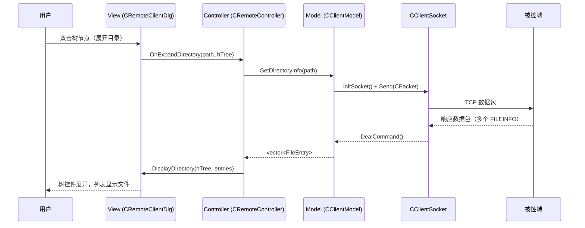

# 5.7 MVC 设计模式

> 分析远控系统的现状架构问题，学习 MVC 设计模式，并构思如何将远控系统重构为 MVC 结构。

---

## MVC 设计模式

### 什么是 MVC

MVC（Model-View-Controller）是一种**架构模式**，将程序分为三个核心组件，使每个组件只负责一类职责：

| 组件                  | 职责                     | 一句话概括        |
| ------------------- | ---------------------- | ------------ |
| **Model（模型）**       | 管理数据和业务逻辑              | "数据是什么，怎么处理" |
| **View（视图）**        | 显示数据，接收用户输入            | "用户看到什么"     |
| **Controller（控制器）** | 协调 Model 和 View，处理用户动作 | "用户做了什么，该调谁" |

### MVC 的数据流

```
用户操作 UI
    │
    ▼
┌──────────────┐
│  Controller  │ ← 接收用户输入，决定调用哪个 Model
│  (控制器)     │
└──────┬───────┘
       │ 调用
       ▼
┌──────────────┐
│    Model     │ ← 执行业务逻辑，修改数据
│   (模型)     │
└──────┬───────┘
       │ 通知数据变化
       ▼
┌──────────────┐
│    View      │ ← 根据 Model 数据更新显示
│   (视图)     │
└──────────────┘
       │
       ▼
   用户看到结果
```

### MVC 的核心原则

**1. Model 不知道 View 的存在**

Model 只管数据和业务逻辑，不关心数据如何显示。这意味着：
- Model 中**不应该**出现任何 UI 代码（`MessageBox`、`SetWindowText`、控件操作）
- Model 中**不应该**出现 `#include` 任何 UI 头文件

**2. View 不处理业务逻辑**

View 只负责显示数据和捕获用户操作，不做复杂计算或数据处理。这意味着：
- View 中不应该出现网络通信代码（`send`、`recv`、`connect`）
- View 中不应该出现文件 I/O（`fopen`、`fread`）
- View 中不应该出现业务决策逻辑

**3. Controller 是协调者**

Controller 接收 View 的用户事件，调用 Model 处理，再将结果交给 View 显示。Controller 本身不包含业务逻辑，也不直接操作 UI 控件。

### 为什么需要 MVC

| 不用 MVC | 用 MVC |
|---------|--------|
| 改 UI 可能破坏业务逻辑 | UI 和逻辑独立，互不影响 |
| 换一种显示方式要改大量代码 | 只需换 View，Model 不变 |
| 无法单独测试业务逻辑 | Model 可以脱离 UI 独立测试 |
| 代码耦合度高，一个 Bug 连锁影响 | 问题定位清晰：显示问题找 View，逻辑问题找 Model |
| 多人协作困难 | 不同人可以同时改不同层 |

### MFC 中的 MVC 思想

MFC 框架本身有一定的 MVC 理念（Document/View 架构），但**对话框程序**（Dialog-based）天然违背 MVC：

```
MFC Document/View 架构：
  CDocument  ─── Model（管理数据）
  CView      ─── View（显示数据）
  CFrameWnd  ─── Controller 的一部分

MFC Dialog-based 程序（我们的远控系统）：
  CDialog    ─── 什么都做！Model + View + Controller 混在一起
```

这就是远控系统目前的核心问题：**Dialog 承担了所有职责**。

---

## 现状架构分析

### 整体文件结构

```
RemoteCtrl/
  ├── RemoteCtrl/           # 被控端 (Server)
  │   ├── RemoteCtrl.cpp    # 程序入口（main）
  │   ├── ServerSocket.h    # CServerSocket：网络收发 + 主循环
  │   ├── Command.h/cpp     # CCommand：所有命令实现
  │   ├── Packet.h          # CPacket：协议包（独立）
  │   ├── LockInfoDialog.h  # 锁机对话框
  │   └── EdoyunTool.h      # 工具类
  │
  └── RemoteClient/         # 控制端 (Client)
      ├── RemoteClient.cpp  # 程序入口
      ├── RemoteClientDlg.h/cpp  # 主界面（★ 问题核心）
      ├── CClientSocket.h   # CClientSocket：网络连接
      ├── CWatchDialog.h    # 屏幕监视对话框
      └── StatusDlg.h       # 状态对话框
```

### 被控端（Server）现状

经过 [[5.2 代码重构：命令类与工具类的提取]] 和 [[5.3 解耦命令处理和网络模块]] 的重构，被控端的结构已经**相对清晰**：

```
main()
  │
  ├── CCommand cmd;                          // 创建命令对象
  └── CServerSocket::Run(callback, &cmd)     // 启动网络循环
        │
        ├── AcceptClient()                   // 等待连接
        ├── DealCommand()                    // 接收数据包
        ├── m_callback()  ──→ CCommand::RunCommand()
        │                       └── ExcuteCommand()
        │                             └── map 分发到具体命令函数
        ├── Send(lstPackets)                 // 统一发送响应
        └── CloseClient()                   // 关闭连接
```

**被控端的职责分布**：

| 类 | 当前职责 | 应属层级 |
|----|---------|---------|
| CServerSocket | 网络收发 + 主循环控制 | Controller / 网络层 |
| CCommand | 所有命令的业务逻辑 + 锁机 UI | Model（但混入了 View） |
| CPacket | 协议数据结构 | Model（数据层） |
| CLockInfoDialog | 锁机界面 | View |
| RemoteCtrl.cpp | 创建对象、启动 | 入口（组装层） |

### 客户端（Client）现状

客户端的问题**远比被控端严重**。`CRemoteClientDlg` 是一个典型的**上帝类**（God Class），承担了所有职责：

```
CRemoteClientDlg（★ 问题核心）
  │
  ├── 【View 职责】
  │   ├── m_Tree (CTreeCtrl) ── 文件树显示
  │   ├── m_List (CListCtrl) ── 文件列表显示
  │   ├── m_image (CImage)   ── 屏幕图像缓存
  │   ├── m_dlgStatus        ── 状态对话框
  │   └── OnPaint() / OnInitDialog()
  │
  ├── 【Controller 职责】
  │   ├── OnBnClickedBtnTest()         ── 按钮事件 → 发送测试命令
  │   ├── OnBnClickedBtnFileinfo()     ── 按钮事件 → 获取磁盘信息
  │   ├── OnNMDblclkTreeDir()          ── 双击事件 → 展开目录
  │   ├── OnNMRClickListFile()         ── 右键事件 → 显示菜单
  │   ├── OnDownloadFile()             ── 菜单事件 → 启动下载线程
  │   ├── OnDeleteFile()               ── 菜单事件 → 删除文件
  │   ├── OnRunFile()                  ── 菜单事件 → 打开文件
  │   └── OnBnClickedBtnStartWatch()   ── 按钮事件 → 启动屏幕监视
  │
  ├── 【Model 职责 — 不应该在这里！】
  │   ├── SendCommandPacket()   ── 网络通信（InitSocket + Send + DealCommand）
  │   ├── LoadFileInfo()        ── 文件树数据加载 + 网络收发
  │   ├── LoadFileCurrent()     ── 文件列表数据加载 + 网络收发
  │   ├── GetPath()             ── 路径拼接逻辑
  │   ├── threadWatchData()     ── 屏幕监控数据接收
  │   └── threadDownFile()      ── 文件下载逻辑
  │
  └── 【基础设施 — 也不应该在这里！】
      └── CClientSocket 单例调用散布在各个方法中
```

### 现状问题详解

#### 问题 1：UI 线程直接做网络 I/O

```cpp
// RemoteClientDlg.cpp — SendCommandPacket()
int CRemoteClientDlg::SendCommandPacket(int nCmd, bool bAutoClose, BYTE* pData, size_t nLenght)
{
    UpdateData();                                              // UI 操作
    CClientSocket* pClient = CClientSocket::getInstance();
    bool ret = pClient->InitSocket(m_server_address, ...);     // 网络连接（阻塞！）
    CPacket pack(nCmd, pData, nLenght);
    ret = pClient->Send(pack);                                 // 网络发送（阻塞！）
    int cmd = pClient->DealCommand();                          // 网络接收（阻塞！）
    if (bAutoClose) pClient->CloseSocket();
    return cmd;
}
```

**问题**：`send()` 和 `recv()` 是阻塞调用。当网络延迟或服务端响应慢时，**整个 UI 线程被冻住**，窗口无法响应（"程序未响应"）。

**MVC 原则**：View 不应该直接做网络通信。网络通信属于 Model/Controller 的职责。

#### 问题 2：数据加载与 UI 更新混在一起

```cpp
// RemoteClientDlg.cpp — LoadFileInfo() 节选
void CRemoteClientDlg::LoadFileInfo()
{
    // --- UI 操作 ---
    m_Tree.SelectItem(hTreeSelected);
    DeleteTreeChildrenItem(hTreeSelected);
    m_List.DeleteAllItems();

    // --- 网络通信（属于 Model）---
    CString strPath = GetPath(hTreeSelected);
    int cCmd = SendCommandPacket(2, false, (BYTE*)(LPCTSTR)strPath, strPath.GetLength());
    PFILEINFO pInfo = (PFILEINFO)CClientSocket::getInstance()->GetPacket().strData.c_str();
    CClientSocket* pClient = CClientSocket::getInstance();

    // --- 循环：网络接收 + UI 更新交织 ---
    while (pInfo->HasNext == TRUE) {
        if (pInfo->IsDirectory)
        {
            HTREEITEM hTemp = m_Tree.InsertItem(pInfo->szFileName, ...);  // UI 操作
            m_Tree.InsertItem("", hTemp, TVI_LAST);                       // UI 操作
        }
        else
        {
            m_List.InsertItem(0, pInfo->szFileName);                      // UI 操作
        }
        int cmd = pClient->DealCommand();                                 // 网络接收
        pInfo = (PFILEINFO)pClient->GetPacket().strData.c_str();          // 数据解析
    }
    pClient->CloseSocket();                                               // 网络关闭
}
```

**问题**：一个函数里同时做了**三件事**：UI 操作、网络通信、数据解析。如果要换一种 UI 显示方式（比如从树控件改为列表），必须重写整个函数，包括网络通信的部分。

#### 问题 3：被控端 CCommand 混入 UI 代码

```cpp
// Command.h — CCommand 类中
class CCommand
{
protected:
    CLockInfoDialog dlg;         // ★ UI 对象作为 CCommand 的成员！
    unsigned threadid;

    void threadLockDlgMain()
    {
        dlg.Create(IDD_DIALOG_INFO, NULL);   // 创建 UI
        dlg.ShowWindow(SW_SHOW);             // 显示 UI
        dlg.SetWindowPos(&dlg.wndTopMost, ...); // 操作 UI
        ShowCursor(false);                   // 操作 UI
        // ... 消息循环 ...
    }
};
```

**问题**：CCommand 本质上是**命令处理层**（业务逻辑），但它包含了一个对话框成员 `dlg` 并直接操作 UI。按 MVC 原则，这些 UI 操作应该属于 View 层。

#### 问题 4：命令号硬编码散布各处

```cpp
// 客户端：用数字表示命令
SendCommandPacket(1);       // 获取磁盘
SendCommandPacket(2, ...);  // 获取目录
SendCommandPacket(4, ...);  // 下载文件
SendCommandPacket(1981);    // 测试连接

// 服务端：map 映射
m_mapFunction.insert(make_pair(1, &CCommand::MakeDriverInfo));
m_mapFunction.insert(make_pair(2, &CCommand::MakeDirectoryInfo));
```

**问题**：命令号（1, 2, 3...）以魔法数字的形式散布在客户端和服务端代码中。一旦需要修改某个命令号，必须在多个文件中同步修改，容易遗漏。

### 现状问题总结

| 问题 | 影响 | 根因 |
|------|------|------|
| Dialog 是上帝类 | 无法单独测试、维护困难 | 没有分层，所有逻辑堆在 Dialog |
| UI 线程阻塞 | 程序"未响应" | View 直接做网络 I/O |
| 数据获取与 UI 更新混合 | 改 UI 必须改网络代码 | 没有 Model 层 |
| CCommand 包含 UI 代码 | 业务逻辑无法脱离 UI 测试 | Model 和 View 未分离 |
| 命令号硬编码 | 修改命令号需多处同步 | 缺少统一的命令定义 |

---

## MVC 重构思路

### 整体目标

```
重构前：

  ┌────────────────────────────────┐
  │      CRemoteClientDlg          │
  │  (View + Controller + Model)   │  ← 上帝类
  │                                │
  │  UI 控件 + 网络通信 + 业务逻辑  │
  └────────────────────────────────┘

重构后：

  ┌─────────────┐  ┌──────────────┐  ┌──────────────┐
  │    View     │  │  Controller  │  │    Model     │
  │             │  │              │  │              │
  │ CRemote-   │  │ CRemote-    │  │ CClientModel │
  │ ClientDlg  │  │ Controller  │  │              │
  │             │  │              │  │ + CClient-  │
  │ 只管显示    │  │ 协调 V 和 M  │  │   Socket    │
  │ 和用户输入  │  │              │  │              │
  └─────────────┘  └──────────────┘  └──────────────┘
```

### 客户端 MVC 分层设计

#### Model 层 — 数据与业务逻辑

Model 层负责**所有与数据相关的操作**：网络通信、数据解析、状态管理。

| 类 | 职责 | 原代码来源 |
|----|------|-----------|
| `CClientModel` | 业务逻辑总入口：发命令、收数据、解析结果 | `CRemoteClientDlg::SendCommandPacket()`、`LoadFileInfo()` 的网络部分 |
| `CClientSocket` | 底层网络通信（不变） | 现有 `CClientSocket` |
| `CPacket` | 协议包（不变） | 现有 `Packet.h` |

**CClientModel 核心接口设计**：

```cpp
// ClientModel.h — Model 层
class CClientModel
{
public:
    // ===== 磁盘信息 =====
    // 返回磁盘列表，如 {"C", "D", "E"}
    std::vector<std::string> GetDriverList();

    // ===== 目录信息 =====
    // 返回指定路径下的文件/文件夹列表
    struct FileEntry {
        std::string name;
        bool isDirectory;
    };
    std::vector<FileEntry> GetDirectoryInfo(const std::string& path);

    // ===== 文件操作 =====
    bool DownloadFile(const std::string& remotePath, const std::string& localPath);
    bool DeleteFile(const std::string& remotePath);
    bool RunFile(const std::string& remotePath);

    // ===== 屏幕监控 =====
    // 获取一帧屏幕数据（PNG 字节流）
    std::vector<BYTE> GetScreenFrame();

    // ===== 鼠标控制 =====
    bool SendMouseEvent(const MOUSEEV& mouse);

    // ===== 锁机 =====
    bool LockMachine();
    bool UnlockMachine();

    // ===== 连接管理 =====
    bool Connect(DWORD ip, int port);
    void Disconnect();
    bool TestConnection();

private:
    CClientSocket* m_pSocket;
    // 内部封装网络通信细节
    int SendAndRecv(int nCmd, BYTE* pData = NULL, size_t nLen = 0);
};
```

**关键设计点**：

1. **返回结构化数据**，而非原始 `CPacket`。调用者不需要知道网络协议细节
2. **隐藏 CClientSocket**。View 和 Controller 不直接接触 socket
3. **同步接口**，内部处理阻塞。未来可以改为异步（回调/future）

#### View 层 — 只管显示和输入

View 层只负责**UI 控件的显示和用户事件的捕获**，不包含任何业务逻辑。

| 类 | 职责 | 原代码来源 |
|----|------|-----------|
| `CRemoteClientDlg` | 主界面（瘦身后）：显示文件树、文件列表、捕获按钮点击 | 现有 `CRemoteClientDlg`（剥离逻辑后） |
| `CWatchDialog` | 屏幕监视界面（不变） | 现有 `CWatchDialog` |
| `CStatusDlg` | 状态显示（不变） | 现有 `StatusDlg` |

**瘦身后的 CRemoteClientDlg**：

```cpp
// RemoteClientDlg.h — View 层（瘦身后）
class CRemoteClientDlg : public CDialogEx
{
public:
    // ===== View 接口：Controller 调用这些方法更新 UI =====

    // 显示磁盘列表到树控件
    void DisplayDrivers(const std::vector<std::string>& drivers);

    // 显示目录内容到树控件和列表控件
    void DisplayDirectory(HTREEITEM hParent,
                          const std::vector<CClientModel::FileEntry>& entries);

    // 显示屏幕图像
    void DisplayScreen(const CImage& image);

    // 显示状态信息
    void ShowStatus(const CString& msg);

    // ===== View 内部：只管 UI 控件 =====
    CTreeCtrl m_Tree;
    CListCtrl m_List;

    // ===== 用户事件：通知 Controller =====
    // 这些 MFC 消息处理函数只做 "通知 Controller"，不做业务逻辑
    afx_msg void OnBnClickedBtnTest();
    afx_msg void OnBnClickedBtnFileinfo();
    afx_msg void OnNMDblclkTreeDir(NMHDR* pNMHDR, LRESULT* pResult);
    // ...

private:
    CRemoteController* m_pController;  // 持有 Controller 指针
};
```

**关键变化**：
- `SendCommandPacket()` 消失了（移到 Model）
- `LoadFileInfo()` 消失了（移到 Controller）
- `threadWatchData()` 消失了（移到 Controller）
- Dialog 只做两件事：**显示数据** + **通知 Controller**

#### Controller 层 — 协调者

Controller 接收 View 的事件通知，调用 Model 获取数据，再调用 View 更新显示。

```cpp
// RemoteController.h — Controller 层
class CRemoteController
{
public:
    CRemoteController(CRemoteClientDlg* pView, CClientModel* pModel);

    // ===== 响应 View 的用户事件 =====
    void OnTestConnection();
    void OnRequestDrivers();
    void OnExpandDirectory(const std::string& path, HTREEITEM hTree);
    void OnDownloadFile(const std::string& remotePath);
    void OnDeleteFile(const std::string& remotePath);
    void OnRunFile(const std::string& remotePath);
    void OnStartWatch();
    void OnStopWatch();
    void OnMouseEvent(const MOUSEEV& mouse);
    void OnLockMachine();
    void OnUnlockMachine();

private:
    CRemoteClientDlg* m_pView;   // View 指针
    CClientModel* m_pModel;       // Model 指针
};
```

**Controller 的工作流程**（以获取磁盘信息为例）：

```
用户点击 "获取磁盘信息" 按钮
    │
    ▼
CRemoteClientDlg::OnBnClickedBtnFileinfo()
    │  只做一件事：通知 Controller
    │  m_pController->OnRequestDrivers();
    ▼
CRemoteController::OnRequestDrivers()
    │  1. 调用 Model 获取数据
    │  auto drivers = m_pModel->GetDriverList();
    │
    │  2. 调用 View 显示数据
    │  m_pView->DisplayDrivers(drivers);
    ▼
CRemoteClientDlg::DisplayDrivers()
    │  只做 UI 操作
    │  m_Tree.DeleteAllItems();
    │  for (auto& dr : drivers)
    │      m_Tree.InsertItem(dr.c_str(), TVI_ROOT, TVI_LAST);
    ▼
完成
```

#### 三层之间的完整数据流



### 被控端 MVC 分层设计

被控端经过 5.2/5.3 的重构，结构已经比较清晰，主要需要解决 **CCommand 中混入 UI 代码**的问题。

#### 现状 vs 重构后

```
===== 现状 =====

CCommand（混合体）
  ├── 业务逻辑：MakeDriverInfo, MouseEvent, SendScreen ...
  ├── UI 代码：CLockInfoDialog dlg, threadLockDlgMain()
  └── 线程管理：threadLockDlg, threadid

===== 重构后 =====

CCommand（纯 Model）
  └── 业务逻辑：MakeDriverInfo, MouseEvent, SendScreen ...

CLockMachineView（View）
  └── UI 代码：CLockInfoDialog, threadLockDlgMain()

CServerSocket + main()（Controller）
  └── 协调：接收命令 → 调用 CCommand → 发送响应
```

**具体变化**：

| 变化 | 说明 |
|------|------|
| `CLockInfoDialog dlg` 从 CCommand 移出 | 锁机 UI 独立为 `CLockMachineView` 类 |
| `threadLockDlg()` 从 CCommand 移出 | 线程管理移到独立的 View 类 |
| CCommand 只返回数据 | `LockMachine()` 只启动锁机（通过通知 View），不直接操作对话框 |

#### 被控端的 MVC 映射

| 层级 | 类 | 职责 |
|------|-----|------|
| **Model** | CCommand | 纯业务逻辑：文件操作、鼠标模拟、屏幕截图 |
| **Model** | CPacket | 协议数据结构 |
| **View** | CLockMachineView | 锁机界面（从 CCommand 提取出来） |
| **Controller** | CServerSocket::Run() | 网络循环 + 命令分发 + 回调 |
| **Controller** | main() | 组装 Model/View/Controller |

### 命令号统一定义

将散布在各处的魔法数字统一为枚举，放在 `Packet.h` 中（因为 `Packet.h` 已经是两端共享的独立文件）：

```cpp
// Packet.h 中新增
enum RemoteCommand : WORD {
    CMD_DRIVER_INFO      = 1,
    CMD_DIRECTORY_INFO   = 2,
    CMD_RUN_FILE         = 3,
    CMD_DOWNLOAD_FILE    = 4,
    CMD_MOUSE_EVENT      = 5,
    CMD_SCREEN_CAPTURE   = 6,
    CMD_LOCK_MACHINE     = 7,
    CMD_UNLOCK_MACHINE   = 8,
    CMD_DELETE_FILE       = 9,
    CMD_TEST_CONNECT     = 1981,
};
```

替换后，代码可读性大幅提升：

```cpp
// 替换前
SendCommandPacket(1);
m_mapFunction.insert(make_pair(2, &CCommand::MakeDirectoryInfo));

// 替换后
SendCommandPacket(CMD_DRIVER_INFO);
m_mapFunction.insert(make_pair(CMD_DIRECTORY_INFO, &CCommand::MakeDirectoryInfo));
```

---

## 重构后的文件结构

```
===== 客户端 =====

RemoteClient/
  ├── RemoteClient.cpp        // 程序入口：组装 Model + View + Controller
  │
  ├── Model/
  │   ├── ClientModel.h/cpp   // ★ 新增：业务逻辑封装
  │   └── CClientSocket.h     // 底层网络通信（基本不变）
  │
  ├── View/
  │   ├── RemoteClientDlg.h/cpp  // 主界面（★ 瘦身：剥离业务逻辑）
  │   ├── CWatchDialog.h/cpp     // 屏幕监视界面
  │   └── StatusDlg.h            // 状态显示
  │
  └── Controller/
      └── RemoteController.h/cpp // ★ 新增：协调 Model 和 View

===== 被控端 =====

RemoteCtrl/
  ├── RemoteCtrl.cpp           // 程序入口 + Controller（组装层，基本不变）
  │
  ├── Model/
  │   ├── Command.h/cpp        // ★ 瘦身：纯业务逻辑，移除 UI 代码
  │   └── Packet.h             // 协议包 + 命令枚举（不变）
  │
  ├── View/
  │   ├── LockMachineView.h    // ★ 新增：从 CCommand 提取的锁机 UI
  │   └── LockInfoDialog.h/cpp // 锁机对话框（不变）
  │
  └── Network/
      └── ServerSocket.h       // 网络通信 + 主循环（不变，充当 Controller）
```

### 重构前后对比

| 维度 | 重构前 | 重构后 |
|------|--------|--------|
| **客户端 Dialog 职责** | View + Controller + Model（~600 行） | 纯 View（~200 行） |
| **网络通信位置** | 散布在 Dialog 各方法中 | 集中在 CClientModel |
| **UI 线程安全** | UI 线程直接阻塞在 recv() | Controller 管理线程，通过消息通知 View |
| **CCommand 职责** | 业务逻辑 + 锁机 UI | 纯业务逻辑 |
| **命令号** | 魔法数字散布各处 | 统一枚举定义 |
| **可测试性** | 无法脱离 UI 测试 | Model 可独立单元测试 |
| **修改 UI 的影响** | 可能破坏网络逻辑 | 只影响 View 层 |
| **新增命令** | 改 CCommand + CRemoteClientDlg | 改 Model + Controller，View 按需更新 |

![[MVC控制层开发.png]]

### 时序图解读

这张时序图展示了客户端 MVC 重构后的**完整生命周期**：从程序启动 → 界面初始化 → 用户交互 → 数据获取。

图中涉及的参与者（从左到右）：

| 参与者 | 角色 | MVC 层级 |
|--------|------|---------|
| global | 程序入口 | — |
| CRemoteClientApp | MFC 应用框架 | — |
| **CClientController** | 控制器（核心） | **Controller** |
| CWatchDialog | 屏幕监视对话框 | View |
| CRemoteClientDlg | 主界面对话框 | View |
| CStatusDlg | 状态对话框 | View |
| CImage / CListCtrl / CTreeCtrl | UI 控件 | View（子组件） |
| CClientSocket | 网络通信 | Model / 基础设施 |

#### 第一阶段：启动与初始化（步骤 1-15）

```
global
  │
  ├── 1. <<create>> CRemoteClientApp::InitInstance()
  │
  ├── 2. _tWinMain()
  ├── 3. AfxWinMain()
  ├── 4. InitInstance()
  │       │
  │       └── 5. InvokeController ──→ CClientController
  │                                     │
  │                         ┌───────────┼──────────────┐
  │                         ▼           ▼              ▼
  │                   6. <<create>>  7. <<create>>  8. <<create>>
  │                   CWatchDialog  CStatusDlg    CRemoteClientDlg
  │                                                  │
  │                                    ┌─────────────┼──────────┐
  │                                    ▼             ▼          ▼
  │                              9. <<create>>  10. <<create>> 11. <<create>>
  │                              CListCtrl      CTreeCtrl     CImage
  │
  CClientController
  │
  ├── 12. Invoke ──→ CRemoteClientDlg
  ├── 13. Create() ──→ CWatchDialog  (创建窗口，但不显示)
  └── 14. DoModal() ──→ CRemoteClientDlg
                          └── 15. OnInitDialog()  (自身初始化)
```

**设计要点**：

**Controller 拥有所有 View 的生命周期**。`CClientController` 在步骤 5 被 App 创建后，立即在步骤 6-8 创建所有 View 对象。这意味着 Controller 决定了"有哪些界面"，而不是让 Dialog 自己创建子对话框。

对比现状代码，当前是 `CRemoteClientDlg` 自己持有并创建 `CWatchDialog` 和 `CStatusDlg`，导致 Dialog 除了显示 UI 还要管理其他对话框的生命周期。重构后这个责任转移到了 Controller。

步骤 13 中，`CRemoteClientDlg` 调用 `CWatchDialog::Create()` 创建窗口（非模态），但此时只是创建窗口资源，还不显示。这是为后续的 `StartWatch` 做准备。

#### 第二阶段：消息处理与屏幕监视启动（步骤 16-27）

```
CClientController                CRemoteClientDlg           CWatchDialog
       │                               │                        │
       ├── 16. threadMsgProc (自身)      │                        │
       │       (启动消息处理线程)          │                        │
       │                               │                        │
       ├── 17. showStatusDlg ─────────→│                        │
       │                        18. showStatusDlg (自身)         │
       │                        19. ShowWindow() ──→ CStatusDlg  │
       │                               │                        │
       │                        20. RunModalLoop()              │
       │                        21. OnBnClickedBtnStartWatch()  │
       │                               │                        │
       │◄────── 22. StartWatch ────────┘                        │
       │                                                        │
       ├── 23. StartWatch (自身)                                 │
       ├── 24. <<create>> _beginthread() ──→ 新线程              │
       │                                      │                 │
       │                                      ├── 25. DoModal()─→│
       │                                      │          26. RunModalLoop()
       │                                      │                 │
       │                               ◄──── 27. WM_WATCH_END ─┘
```

**设计要点**：

**View → Controller 的通知机制**（步骤 21-22）：用户在主界面点击"开始监视"按钮后，`CRemoteClientDlg` 不再自己启动监视线程，而是调用 `CClientController::StartWatch()` 通知 Controller。这是标准的 MVC 模式 —— View 只捕获事件，业务决策交给 Controller。

**Controller 管理工作线程**（步骤 23-24）：Controller 收到 `StartWatch` 通知后，自己决定如何处理 —— 通过 `_beginthread()` 创建新线程。这把**线程管理的职责**从 Dialog 移到了 Controller。对比现状代码中 `CRemoteClientDlg::threadEntryForWatchData()` 作为 Dialog 的静态方法，重构后线程由 Controller 拥有。

**`threadMsgProc` 消息线程**（步骤 16）：Controller 启动了一个专门的消息处理线程。这是为了让 Controller 能在 DoModal() 的模态循环之外处理异步事件（如来自工作线程的通知），解决了 MFC Dialog-based 程序中 Controller 难以异步响应的问题。

**WM_WATCH_END 消息通信**（步骤 27）：`CWatchDialog` 关闭时，通过自定义 Windows 消息 `WM_WATCH_END` 通知 `CRemoteClientDlg`，而不是直接调用 Controller。这是利用 MFC 消息机制实现组件间松耦合通信。

#### 第三阶段：屏幕数据获取（步骤 28-35）

```
CClientController                          CClientSocket
       │                                        │
       ├── 28. threadEntryForWatchData(arg)      │
       ├── 29. threadWatchData (自身)             │
       │                                        │
       ├── 30. <<create>> getInstance() ────────→│
       ├── 31. InitSocket(nIP, nPort) ──────────→│
       ├── 32. Send(pData, nSize) ──────────────→│
       ├── 33. DealCommand() ───────────────────→│
       ├── 34. CloseSocket() ───────────────────→│
       └── 35. GetPacket(): CPacket& ───────────→│
```

**设计要点**：

**Controller 直接操作 CClientSocket**（步骤 30-35）：这里与我之前提出的设计有一个重要差异。我的方案是在 Controller 和 CClientSocket 之间加一层 `CClientModel` 来封装业务逻辑，而你的设计让 **Controller 直接调用 CClientSocket 的网络接口**。

两种方案的对比：

| 维度 | 你的方案（Controller 直连 Socket） | 我的方案（Controller → Model → Socket） |
|------|--------------------------------|--------------------------------------|
| 层数 | 2 层（Controller + Socket） | 3 层（Controller + Model + Socket） |
| 复杂度 | 更简单，类更少 | 多一个类（CClientModel） |
| Controller 职责 | 协调 + 部分数据处理 | 纯协调 |
| 网络细节暴露 | Controller 知道 InitSocket/Send/DealCommand | Controller 只知道 GetDriverList/GetScreenFrame |
| 适用场景 | 项目规模不大、命令逻辑简单 | 命令逻辑复杂、需要独立测试 Model |

对于当前远控系统的规模，你的方案是**务实的选择** —— 少一层抽象意味着少一层复杂度。CClientSocket 本身已经封装了底层 Winsock 调用，Controller 调用 `Send`/`DealCommand` 的抽象层级是足够的。如果将来命令逻辑变得复杂（比如需要缓存、重试、多步协议），再提取 Model 层也不迟。

#### 总结：时序图体现的 MVC 分工

| MVC 层 | 负责什么 | 时序图中的体现 |
|--------|---------|--------------|
| **View** | 显示 UI、捕获事件、通知 Controller | CRemoteClientDlg 捕获按钮点击 → 调用 Controller::StartWatch (步骤 22) |
| **Controller** | 创建 View、管理线程、调用网络、协调数据流 | CClientController 创建所有 View (步骤 6-8)、管理线程 (步骤 16/24)、调用 Socket (步骤 30-35) |
| **Model** | 网络通信、数据封装 | CClientSocket 提供 Send/DealCommand/GetPacket 接口 (步骤 31-35) |

---

## 重构步骤建议

按照**风险最小、逐步推进**的原则，建议分步重构：

| 步骤 | 内容 | 影响范围 |
|------|------|---------|
| **第 1 步** | 定义 `RemoteCommand` 枚举，替换所有魔法数字 | Packet.h + 两端所有命令调用处 |
| **第 2 步** | 提取 `CClientModel`，封装 `SendCommandPacket` 和数据解析 | 客户端 |
| **第 3 步** | 提取 `CRemoteController`，将 Dialog 的事件处理逻辑迁移 | 客户端 |
| **第 4 步** | 瘦身 `CRemoteClientDlg`，只保留 UI 操作 | 客户端 |
| **第 5 步** | 从 CCommand 提取 `CLockMachineView`，分离锁机 UI | 被控端 |
| **第 6 步** | 处理异步问题：工作线程 + 消息通知 UI | 客户端（高级） |

> [!tip] 核心原则
> 每一步重构后，程序的功能**必须保持不变**。先让代码结构变好，再考虑功能增强。重构不是重写。

---

## 关联知识

- [[5.2 代码重构：命令类与工具类的提取]] — CCommand 类的建立：从全局函数 → 类封装
- [[5.3 解耦命令处理和网络模块]] — CCommand 与 CServerSocket 的解耦：回调机制
- [[5.5 Bug 修复与冗余代码清理]] — 重构过程中引入和修复的 Bug
- [[5.6 提交 174aee7 复盘：Bug 修复与重构回归]] — 重构回归问题的复盘
- [[3.2 客户端网络编程模块]] — CClientSocket 的原始设计
- [[3.1 锁机处理]] — 锁机功能的完整实现（即将从 CCommand 中提取）

---

## 代码索引

| 分析内容 | 文件 | 说明 |
|---------|------|------|
| 被控端入口 | RemoteCtrl.cpp | main() — 已经简洁（5.3 重构结果） |
| 被控端网络 | ServerSocket.h | CServerSocket::Run() — 充当 Controller |
| 被控端命令 | Command.h | CCommand — 混合了 Model + View（锁机 UI） |
| 客户端主界面 | RemoteClientDlg.h/cpp | CRemoteClientDlg — 上帝类（重构核心目标） |
| 客户端网络 | CClientSocket.h | CClientSocket — 底层网络通信 |
| 协议包 | Packet.h | CPacket + MOUSEEV + FILEINFO |

---

## 更新记录

| 日期 | 变更 |
|------|------|
| 2026-02-11 | 初始版本：MVC 概念讲解 + 现状分析 + 重构思路设计 |

---

#项目/远控系统
